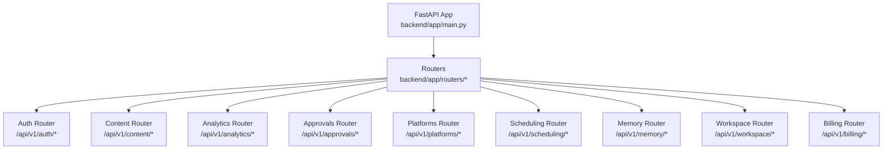
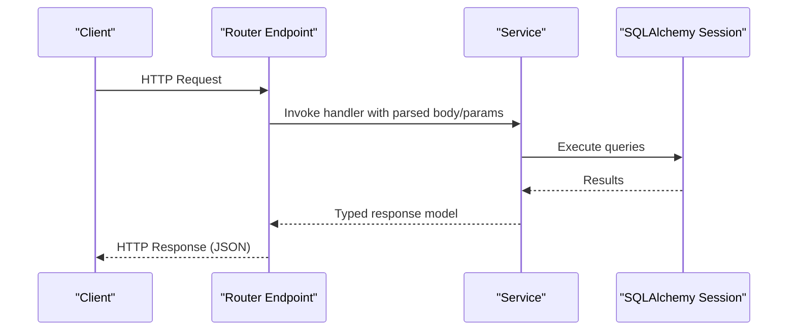

# API Reference

<cite>
**Referenced Files in This Document**
- [backend/app/main.py](file://backend/app/main.py)
- [backend/app/routers/auth.py](file://backend/app/routers/auth.py)
- [backend/app/routers/content.py](file://backend/app/routers/content.py)
- [backend/app/routers/analytics.py](file://backend/app/routers/analytics.py)
- [backend/app/routers/approvals.py](file://backend/app/routers/approvals.py)
- [backend/app/routers/platforms.py](file://backend/app/routers/platforms.py)
- [backend/app/routers/scheduling.py](file://backend/app/routers/scheduling.py)
- [backend/app/routers/memory.py](file://backend/app/routers/memory.py)
- [backend/app/routers/workspace.py](file://backend/app/routers/workspace.py)
- [backend/app/routers/billing.py](file://backend/app/routers/billing.py)
- [backend/app/schemas/auth.py](file://backend/app/schemas/auth.py)
- [backend/app/schemas/content.py](file://backend/app/schemas/content.py)
- [backend/app/schemas/analytics.py](file://backend/app/schemas/analytics.py)
- [backend/app/schemas/approval.py](file://backend/app/schemas/approval.py)
- [backend/app/schemas/platform.py](file://backend/app/schemas/platform.py)
- [backend/app/schemas/scheduling.py](file://backend/app/schemas/scheduling.py)
- [backend/app/schemas/memory.py](file://backend/app/schemas/memory.py)
- [backend/app/schemas/workspace.py](file://backend/app/schemas/workspace.py)
- [backend/app/schemas/billing.py](file://backend/app/schemas/billing.py)
</cite>

## Table of Contents
1. [Introduction](#introduction)
2. [Project Structure](#project-structure)
3. [Core Components](#core-components)
4. [Architecture Overview](#architecture-overview)
5. [Detailed Component Analysis](#detailed-component-analysis)
6. [Dependency Analysis](#dependency-analysis)
7. [Performance Considerations](#performance-considerations)
8. [Troubleshooting Guide](#troubleshooting-guide)
9. [Conclusion](#conclusion)
10. [Appendices](#appendices)

## Introduction
This document provides comprehensive API documentation for Socialium’s RESTful endpoints. It covers all HTTP methods, URL patterns, request/response schemas, authentication requirements, parameters, response codes, and error handling patterns across the following groups:
- Authentication
- Content Management
- Approval Workflow
- Platform Integrations
- Analytics
- Scheduling
- Memory (Brand Voice and Semantic Search)
- Workspace
- Billing

It also includes practical examples, curl commands, and client implementation guidelines for each endpoint group.

## Project Structure
Socialium is a FastAPI application with modular routers grouped by domain. Each router exposes endpoints under a base path derived from the configured API version and tag. Routers depend on SQLAlchemy async sessions and delegate to service classes.

**Diagram sources**
- [backend/app/main.py](file://backend/app/main.py#L57-L76)

**Section sources**
- [backend/app/main.py](file://backend/app/main.py#L57-L76)

## Core Components
- Base URL: /api/v1
- Authentication: JWT bearer tokens (access_token, refresh_token)
- Request/Response: Pydantic models define schemas; responses are strongly typed
- Pagination: Many list endpoints support page and page_size parameters
- Filtering: List endpoints often accept filters such as status, platform, and date ranges

**Section sources**
- [backend/app/routers/auth.py](file://backend/app/routers/auth.py#L20-L47)
- [backend/app/routers/content.py](file://backend/app/routers/content.py#L40-L51)
- [backend/app/routers/analytics.py](file://backend/app/routers/analytics.py#L13-L21)
- [backend/app/routers/approvals.py](file://backend/app/routers/approvals.py#L19-L28)
- [backend/app/routers/platforms.py](file://backend/app/routers/platforms.py#L17-L24)
- [backend/app/routers/scheduling.py](file://backend/app/routers/scheduling.py#L28-L37)
- [backend/app/routers/memory.py](file://backend/app/routers/memory.py#L18-L25)
- [backend/app/routers/workspace.py](file://backend/app/routers/workspace.py#L19-L27)
- [backend/app/routers/billing.py](file://backend/app/routers/billing.py#L20-L24)

## Architecture Overview
The API follows a layered architecture:
- Routers handle HTTP routing and dependency injection
- Services encapsulate business logic
- Schemas define request/response contracts
- Database layer uses SQLAlchemy async sessions

**Diagram sources**
- [backend/app/routers/content.py](file://backend/app/routers/content.py#L20-L27)
- [backend/app/services/content_generation_service.py](file://backend/app/services/content_generation_service.py#L12-L96)

## Detailed Component Analysis

### Authentication Endpoints
- Base Path: /api/v1/auth
- Authentication: Not required for signup/login; JWT required for protected endpoints (/me)
- Response Model: TokenResponse includes access_token, refresh_token, token_type, expires_in

Endpoints
- POST /signup
  - Description: Register a new user and return JWT tokens
  - Request Body: UserSignupRequest
  - Response: TokenResponse
  - Status Codes: 201 Created, 422 Unprocessable Entity
  - Example curl:
    - curl -X POST "{{API_URL}}/api/v1/auth/signup" -H "Content-Type: application/json" -d '{"email":"user@example.com","username":"user","password":"securepass","full_name":"User Name"}'
- POST /login
  - Description: Authenticate user and return JWT tokens
  - Request Body: UserLoginRequest
  - Response: TokenResponse
  - Status Codes: 200 OK, 401 Unauthorized, 422 Unprocessable Entity
  - Example curl:
    - curl -X POST "{{API_URL}}/api/v1/auth/login" -H "Content-Type: application/json" -d '{"email":"user@example.com","password":"securepass"}'
- POST /refresh
  - Description: Refresh an expired access token
  - Request Body: RefreshTokenRequest
  - Response: TokenResponse
  - Status Codes: 200 OK, 401 Unauthorized, 422 Unprocessable Entity
  - Example curl:
    - curl -X POST "{{API_URL}}/api/v1/auth/refresh" -H "Content-Type: application/json" -d '{"refresh_token":"<REFRESH_TOKEN>"}'
- GET /me
  - Description: Get current user profile
  - Response: UserResponse
  - Status Codes: 200 OK, 401 Unauthorized
  - Example curl:
    - curl -H "Authorization: Bearer {{ACCESS_TOKEN}}" "{{API_URL}}/api/v1/auth/me"
- PUT /me
  - Description: Update current user profile
  - Request Body: UserUpdateRequest
  - Response: UserResponse
  - Status Codes: 200 OK, 401 Unauthorized, 422 Unprocessable Entity
  - Example curl:
    - curl -X PUT "{{API_URL}}/api/v1/auth/me" -H "Authorization: Bearer {{ACCESS_TOKEN}}" -H "Content-Type: application/json" -d '{"full_name":"Updated Name","bio":"Bio"}'

Request/Response Schemas
- UserSignupRequest: email, username, password, full_name
- UserLoginRequest: email, password
- TokenResponse: access_token, refresh_token, token_type, expires_in
- RefreshTokenRequest: refresh_token
- UserResponse: id, email, username, full_name, avatar_url, bio, subscription_tier, created_at, updated_at
- UserUpdateRequest: full_name, username, bio, avatar_url

Authentication Notes
- Use Authorization: Bearer {{access_token}} header for protected endpoints
- Store refresh_token securely and use /auth/refresh to renew access_token

**Section sources**
- [backend/app/routers/auth.py](file://backend/app/routers/auth.py#L20-L68)
- [backend/app/schemas/auth.py](file://backend/app/schemas/auth.py#L9-L63)

### Content Management Endpoints
- Base Path: /api/v1/content
- Purpose: AI-driven content generation, variants, and draft lifecycle management

Endpoints
- POST /generate
  - Description: Generate content for selected platforms using AI
  - Request Body: ContentGenerateRequest
  - Response: list of DraftResponse
  - Status Codes: 201 Created, 422 Unprocessable Entity
  - Example curl:
    - curl -X POST "{{API_URL}}/api/v1/content/generate" -H "Authorization: Bearer {{ACCESS_TOKEN}}" -H "Content-Type: application/json" -d '{"source_text":"Topic content","platforms":["twitter"],"tone":"professional","creativity":0.7,"length":"medium","include_hashtags":true,"include_emojis":false,"workspace_id":"<UUID>"}'
- POST /variants
  - Description: Generate A/B variants of an existing draft
  - Request Body: ContentVariantRequest
  - Response: list of DraftResponse
  - Status Codes: 201 Created, 422 Unprocessable Entity
- GET /drafts
  - Description: List drafts with optional filtering
  - Query Params: workspace_id (required), status, platform, page=1, page_size=20
  - Response: DraftListResponse
  - Status Codes: 200 OK, 422 Unprocessable Entity
- GET /drafts/{draft_id}
  - Description: Get a single draft by ID
  - Path Params: draft_id (required)
  - Response: DraftResponse
  - Status Codes: 200 OK, 404 Not Found
- PUT /drafts/{draft_id}
  - Description: Update an existing draft
  - Path Params: draft_id (required)
  - Request Body: DraftUpdateRequest
  - Response: DraftResponse
  - Status Codes: 200 OK, 404 Not Found, 422 Unprocessable Entity
- PATCH /drafts/{draft_id}/status
  - Description: Update the status of a draft
  - Path Params: draft_id (required)
  - Request Body: DraftStatusUpdateRequest
  - Response: DraftResponse
  - Status Codes: 200 OK, 404 Not Found, 422 Unprocessable Entity
- DELETE /drafts/{draft_id}
  - Description: Delete a draft permanently
  - Path Params: draft_id (required)
  - Status Codes: 204 No Content, 404 Not Found

Request/Response Schemas
- ContentGenerateRequest: source_text, platforms, tone, creativity, length, include_hashtags, include_emojis, ai_model, workspace_id
- ContentVariantRequest: draft_id, count
- DraftResponse: id, workspace_id, platform, headline, body_text, hashtags, image_url, image_prompt, cta, tone, ai_model, status, character_count, quality_score, is_variant, variant_group_id, created_at, updated_at, published_at
- DraftListResponse: items, total, page, page_size
- DraftUpdateRequest: headline, body_text, hashtags, cta, tone
- DraftStatusUpdateRequest: status

Client Implementation Guidelines
- Use Authorization header for all endpoints except /generate and /variants
- Paginate using page and page_size for /drafts
- Validate enums against Platform and ContentTone

**Section sources**
- [backend/app/routers/content.py](file://backend/app/routers/content.py#L19-L94)
- [backend/app/schemas/content.py](file://backend/app/schemas/content.py#L12-L82)

### Approval Workflow Endpoints
- Base Path: /api/v1/approvals
- Purpose: Collaborative review and approval actions

Endpoints
- GET /pending
  - Description: List drafts pending approval
  - Query Params: workspace_id (required), page=1, page_size=20
  - Response: ApprovalListResponse
  - Status Codes: 200 OK, 422 Unprocessable Entity
- GET /history
  - Description: Get the approval history for a draft
  - Query Params: draft_id (required)
  - Response: list of ApprovalResponse
  - Status Codes: 200 OK, 422 Unprocessable Entity
- POST /{draft_id}/review
  - Description: Submit an approval action (approve/reject/request changes)
  - Path Params: draft_id (required)
  - Request Body: ApprovalRequest
  - Response: ApprovalResponse
  - Status Codes: 201 Created, 404 Not Found, 422 Unprocessable Entity
- POST /{approval_id}/comments
  - Description: Add a comment to an approval
  - Path Params: approval_id (required)
  - Request Body: ApprovalCommentRequest
  - Response: ApprovalCommentResponse
  - Status Codes: 201 Created, 404 Not Found, 422 Unprocessable Entity

Request/Response Schemas
- ApprovalRequest: action, feedback
- ApprovalCommentRequest: content
- ApprovalCommentResponse: id, author_id, content, created_at
- ApprovalResponse: id, draft_id, reviewer_id, action, feedback, version, created_at, comments
- PendingApprovalItem: draft_id, platform, headline, body_text, requested_by, character_count, created_at
- ApprovalListResponse: items, total, page, page_size

Client Implementation Guidelines
- Use Authorization header
- Track approval_id from previous responses for adding comments

**Section sources**
- [backend/app/routers/approvals.py](file://backend/app/routers/approvals.py#L19-L60)
- [backend/app/schemas/approval.py](file://backend/app/schemas/approval.py#L11-L69)

### Platform Integration Endpoints
- Base Path: /api/v1/platforms
- Purpose: Connect, manage, and sync social media accounts

Endpoints
- GET /accounts
  - Description: List all connected platform accounts for a workspace
  - Query Params: workspace_id (required)
  - Response: list of PlatformAccountResponse
  - Status Codes: 200 OK, 422 Unprocessable Entity
- POST /connect
  - Description: Connect a social media platform via OAuth
  - Query Params: workspace_id (required)
  - Request Body: PlatformConnectRequest
  - Response: PlatformAccountResponse
  - Status Codes: 201 Created, 422 Unprocessable Entity
- DELETE /accounts/{account_id}
  - Description: Disconnect a social media platform
  - Path Params: account_id (required)
  - Response: PlatformDisconnectResponse
  - Status Codes: 200 OK, 404 Not Found
- POST /accounts/{account_id}/sync
  - Description: Sync platform account data (follower count, profile info)
  - Path Params: account_id (required)
  - Response: PlatformAccountResponse
  - Status Codes: 200 OK, 404 Not Found

Request/Response Schemas
- PlatformConnectRequest: platform, auth_code, redirect_uri
- PlatformAccountResponse: id, platform, platform_user_id, platform_username, profile_data, is_active, connected_at, last_synced_at
- PlatformDisconnectResponse: message, platform, platform_username

Client Implementation Guidelines
- Use Authorization header
- Ensure redirect_uri matches OAuth provider configuration

**Section sources**
- [backend/app/routers/platforms.py](file://backend/app/routers/platforms.py#L17-L55)
- [backend/app/schemas/platform.py](file://backend/app/schemas/platform.py#L11-L40)

### Analytics Endpoints
- Base Path: /api/v1/analytics
- Purpose: Dashboard overview, trends, and recommendations

Endpoints
- GET /overview
  - Description: Get analytics overview dashboard data
  - Query Params: workspace_id (required), period="30d"
  - Response: AnalyticsDashboardResponse
  - Status Codes: 200 OK, 422 Unprocessable Entity
- GET /trends
  - Description: Get trend data for a specific metric
  - Query Params: workspace_id (required), metric="impressions", period="30d"
  - Response: As returned by service (dynamic)
  - Status Codes: 200 OK, 422 Unprocessable Entity
- GET /recommendations
  - Description: Get AI-powered content and scheduling recommendations
  - Query Params: workspace_id (required)
  - Response: As returned by service (dynamic)
  - Status Codes: 200 OK, 422 Unprocessable Entity

Request/Response Schemas
- AnalyticsDashboardResponse: overview, trends, platform_comparison, top_posts, best_posting_times
- AnalyticsOverview: total_posts_published, total_impressions, total_clicks, total_likes, total_shares, total_comments, average_engagement_rate, follower_growth, scheduled_posts, post_frequency
- AnalyticsTrendsResponse: impressions, clicks, engagement_rate, follower_growth
- TrendDataPoint: date, value
- PlatformComparison: platform, impressions, clicks, likes, engagement_rate
- TopPostItem: draft_id, headline, platform, impressions, engagement_rate, published_at
- PostingTimeRecommendation: day_of_week, hour, score

Client Implementation Guidelines
- Use Authorization header
- Period values align with supported timeframes

**Section sources**
- [backend/app/routers/analytics.py](file://backend/app/routers/analytics.py#L13-L43)
- [backend/app/schemas/analytics.py](file://backend/app/schemas/analytics.py#L9-L77)

### Scheduling Endpoints
- Base Path: /api/v1/scheduling
- Purpose: Schedule, reschedule, cancel, and discover optimal posting times

Endpoints
- POST /schedule
  - Description: Schedule a post for future publication
  - Request Body: SchedulePostRequest
  - Response: ScheduledPostResponse
  - Status Codes: 201 Created, 422 Unprocessable Entity
- GET /calendar
  - Description: Get scheduled posts in a date range (calendar view)
  - Query Params: workspace_id (required), start_date (ISO 8601), end_date (ISO 8601)
  - Response: ScheduleCalendarResponse
  - Status Codes: 200 OK, 422 Unprocessable Entity
- PUT /{scheduled_id}/reschedule
  - Description: Reschedule a previously scheduled post
  - Path Params: scheduled_id (required)
  - Request Body: SchedulePostRequest
  - Response: ScheduledPostResponse
  - Status Codes: 200 OK, 404 Not Found, 422 Unprocessable Entity
- DELETE /{scheduled_id}
  - Description: Cancel a scheduled post
  - Path Params: scheduled_id (required)
  - Status Codes: 204 No Content, 404 Not Found
- GET /optimize
  - Description: Get AI-recommended optimal posting times
  - Query Params: workspace_id (required)
  - Response: ScheduleOptimizerResponse
  - Status Codes: 200 OK, 422 Unprocessable Entity

Request/Response Schemas
- SchedulePostRequest: draft_id, scheduled_at, timezone="UTC", is_recurring=false, recurrence_rule
- ScheduledPostResponse: id, draft_id, scheduled_at, timezone, is_recurring, recurrence_rule, publish_status, error_message, created_at
- ScheduleCalendarItem: id, draft_id, platform, headline, body_text, scheduled_at, timezone, publish_status
- ScheduleCalendarResponse: items, start_date, end_date
- PostingTimeSlot: day_of_week, hour, score, is_available
- ScheduleOptimizerResponse: recommendations, explained

Client Implementation Guidelines
- Use Authorization header
- Ensure timezone values are valid IANA identifiers

**Section sources**
- [backend/app/routers/scheduling.py](file://backend/app/routers/scheduling.py#L18-L68)
- [backend/app/schemas/scheduling.py](file://backend/app/schemas/scheduling.py#L9-L70)

### Memory Endpoints
- Base Path: /api/v1/memory
- Purpose: Manage brand voice and search semantic memory

Endpoints
- GET /brand-voice
  - Description: Get the learned brand voice profile for a workspace
  - Query Params: workspace_id (required)
  - Response: BrandVoiceProfile
  - Status Codes: 200 OK, 422 Unprocessable Entity
- PUT /brand-voice
  - Description: Update brand voice settings
  - Query Params: workspace_id (required)
  - Request Body: BrandVoiceUpdateRequest
  - Response: BrandVoiceProfile
  - Status Codes: 200 OK, 422 Unprocessable Entity
- POST /search
  - Description: Search the semantic memory for similar content patterns
  - Request Body: MemorySearchRequest
  - Response: MemorySearchResponse
  - Status Codes: 200 OK, 422 Unprocessable Entity

Request/Response Schemas
- BrandVoiceProfile: workspace_id, tone, values, target_audience, learned_phrases, top_hooks, rejected_patterns, effective_ctas, last_updated
- BrandVoiceUpdateRequest: tone, values, target_audience
- MemorySearchRequest: query, limit
- MemorySearchResult: id, content, score, category
- MemorySearchResponse: results, query

Client Implementation Guidelines
- Use Authorization header
- Keep queries focused for meaningful semantic similarity

**Section sources**
- [backend/app/routers/memory.py](file://backend/app/routers/memory.py#L18-L46)
- [backend/app/schemas/memory.py](file://backend/app/schemas/memory.py#L8-L51)

### Workspace Endpoints
- Base Path: /api/v1/workspace
- Purpose: Team collaboration, member management, and settings

Endpoints
- POST /create
  - Description: Create a new workspace
  - Request Body: WorkspaceCreateRequest
  - Response: WorkspaceResponse
  - Status Codes: 201 Created, 422 Unprocessable Entity
- GET /{workspace_id}
  - Description: Get workspace details
  - Path Params: workspace_id (required)
  - Response: WorkspaceResponse
  - Status Codes: 200 OK, 404 Not Found
- PUT /{workspace_id}
  - Description: Update workspace settings
  - Path Params: workspace_id (required)
  - Request Body: WorkspaceUpdateSettingsRequest
  - Response: WorkspaceResponse
  - Status Codes: 200 OK, 404 Not Found, 422 Unprocessable Entity
- GET /{workspace_id}/members
  - Description: List workspace members
  - Path Params: workspace_id (required)
  - Response: list of WorkspaceMemberResponse
  - Status Codes: 200 OK, 404 Not Found
- POST /{workspace_id}/invite
  - Description: Invite a user to the workspace
  - Path Params: workspace_id (required)
  - Request Body: WorkspaceInviteRequest
  - Response: WorkspaceMemberResponse
  - Status Codes: 201 Created, 404 Not Found, 422 Unprocessable Entity
- DELETE /{workspace_id}/members/{member_id}
  - Description: Remove a member from the workspace
  - Path Params: workspace_id (required), member_id (required)
  - Status Codes: 204 No Content, 404 Not Found

Request/Response Schemas
- WorkspaceCreateRequest: name, slug
- WorkspaceInviteRequest: email, role="editor"
- WorkspaceMemberResponse: id, user_id, email, full_name, avatar_url, role, joined_at
- WorkspaceResponse: id, owner_id, name, slug, settings, created_at, updated_at, members
- WorkspaceUpdateSettingsRequest: name, settings

Client Implementation Guidelines
- Use Authorization header
- Roles: owner, editor, viewer

**Section sources**
- [backend/app/routers/workspace.py](file://backend/app/routers/workspace.py#L19-L80)
- [backend/app/schemas/workspace.py](file://backend/app/schemas/workspace.py#L9-L57)

### Billing Endpoints
- Base Path: /api/v1/billing
- Purpose: Subscription plans, usage, upgrades, payment methods, and invoices

Endpoints
- GET /plans
  - Description: Get available subscription plans
  - Response: list of PlanDetail
  - Status Codes: 200 OK
- GET /subscription
  - Description: Get current subscription details
  - Query Params: workspace_id (required)
  - Response: CurrentSubscription
  - Status Codes: 200 OK, 422 Unprocessable Entity
- POST /upgrade
  - Description: Upgrade or change subscription plan
  - Query Params: workspace_id (required)
  - Request Body: UpgradeRequest
  - Response: CurrentSubscription
  - Status Codes: 200 OK, 422 Unprocessable Entity
- GET /usage
  - Description: Get current usage metrics
  - Query Params: workspace_id (required)
  - Response: UsageMetrics
  - Status Codes: 200 OK, 422 Unprocessable Entity
- GET /payment-methods
  - Description: Get saved payment methods
  - Query Params: workspace_id (required)
  - Response: list of PaymentMethodResponse
  - Status Codes: 200 OK, 422 Unprocessable Entity
- GET /invoices
  - Description: Get billing invoices
  - Query Params: workspace_id (required), limit=10
  - Response: list of InvoiceResponse
  - Status Codes: 200 OK, 422 Unprocessable Entity

Request/Response Schemas
- PlanDetail: tier, label, price_monthly, price_annual, posts_per_day, platforms_count, team_members, features
- CurrentSubscription: workspace_id, tier, status, current_period_start, current_period_end, cancel_at_period_end, posts_used_this_month, posts_limit
- UpgradeRequest: plan
- PaymentMethodResponse: id, brand, last_four, exp_month, exp_year, is_default
- InvoiceResponse: id, amount, currency, status, invoice_pdf_url, created_at
- UsageMetrics: posts_published, posts_limit, percentage_used, tokens_used, storage_used_mb

Client Implementation Guidelines
- Use Authorization header
- Handle plan upgrades with appropriate error handling for payment failures

**Section sources**
- [backend/app/routers/billing.py](file://backend/app/routers/billing.py#L20-L76)
- [backend/app/schemas/billing.py](file://backend/app/schemas/billing.py#L11-L79)

## Dependency Analysis
Routers depend on:
- FastAPI APIRouter for endpoint registration
- SQLAlchemy AsyncSession for database access
- Service classes for business logic
- Pydantic models for request/response validation

```mermaid
graph TB
R_auth["routers/auth.py"] --> S_auth["services/auth_service.py"]
R_content["routers/content.py"] --> S_content["services/content_generation_service.py"]
R_analytics["routers/analytics.py"] --> S_analytics["services/analytics_service.py"]
R_approvals["routers/approvals.py"] --> S_approval["services/approval_workflow_service.py"]
R_platforms["routers/platforms.py"] --> S_platform["services/platform_integration_service.py"]
R_scheduling["routers/scheduling.py"] --> S_scheduler["services/scheduler_service.py"]
R_memory["routers/memory.py"] --> S_memory["services/memory_service.py"]
R_workspace["routers/workspace.py"] --> S_workspace["services/workspace_service.py"]
R_billing["routers/billing.py"] --> S_billing["services/billing_service.py"]
```

**Diagram sources**
- [backend/app/routers/auth.py](file://backend/app/routers/auth.py#L15-L15)
- [backend/app/routers/content.py](file://backend/app/routers/content.py#L15-L15)
- [backend/app/routers/analytics.py](file://backend/app/routers/analytics.py#L8-L8)
- [backend/app/routers/approvals.py](file://backend/app/routers/approvals.py#L14-L14)
- [backend/app/routers/platforms.py](file://backend/app/routers/platforms.py#L12-L12)
- [backend/app/routers/scheduling.py](file://backend/app/routers/scheduling.py#L13-L13)
- [backend/app/routers/memory.py](file://backend/app/routers/memory.py#L13-L13)
- [backend/app/routers/workspace.py](file://backend/app/routers/workspace.py#L14-L14)
- [backend/app/routers/billing.py](file://backend/app/routers/billing.py#L15-L15)

**Section sources**
- [backend/app/routers/auth.py](file://backend/app/routers/auth.py#L15-L15)
- [backend/app/routers/content.py](file://backend/app/routers/content.py#L15-L15)
- [backend/app/routers/analytics.py](file://backend/app/routers/analytics.py#L8-L8)
- [backend/app/routers/approvals.py](file://backend/app/routers/approvals.py#L14-L14)
- [backend/app/routers/platforms.py](file://backend/app/routers/platforms.py#L12-L12)
- [backend/app/routers/scheduling.py](file://backend/app/routers/scheduling.py#L13-L13)
- [backend/app/routers/memory.py](file://backend/app/routers/memory.py#L13-L13)
- [backend/app/routers/workspace.py](file://backend/app/routers/workspace.py#L14-L14)
- [backend/app/routers/billing.py](file://backend/app/routers/billing.py#L15-L15)

## Performance Considerations
- Pagination: Use page and page_size consistently on list endpoints to avoid large payloads
- Filtering: Apply filters early in queries to reduce result sets
- Batch Operations: Prefer bulk endpoints when available (e.g., variants generation)
- Caching: Cache analytics dashboards for short intervals to reduce repeated computations
- Validation: Leverage Pydantic validation to fail fast on malformed requests

## Troubleshooting Guide
Common Issues and Resolutions
- 401 Unauthorized
  - Cause: Missing or invalid Authorization header
  - Resolution: Obtain tokens via /auth/login or /auth/refresh; ensure bearer token format
- 404 Not Found
  - Cause: Invalid resource IDs (draft_id, account_id, scheduled_id, member_id)
  - Resolution: Verify IDs and permissions
- 422 Unprocessable Entity
  - Cause: Schema validation errors (missing fields, invalid types, out-of-range values)
  - Resolution: Align request bodies with documented schemas; check field lengths and enums
- 403 Forbidden
  - Cause: Insufficient permissions for workspace or billing operations
  - Resolution: Ensure user role allows requested action
- Rate Limits
  - Cause: Exceeding platform API rate limits or internal quotas
  - Resolution: Implement exponential backoff and retry logic

Error Handling Patterns
- All endpoints return structured JSON errors; include request ID where applicable
- Use consistent HTTP status codes aligned with endpoint definitions
- Log validation errors with field names and expected types for debugging

**Section sources**
- [backend/app/routers/auth.py](file://backend/app/routers/auth.py#L20-L68)
- [backend/app/routers/content.py](file://backend/app/routers/content.py#L40-L94)
- [backend/app/routers/approvals.py](file://backend/app/routers/approvals.py#L19-L60)
- [backend/app/routers/platforms.py](file://backend/app/routers/platforms.py#L17-L55)
- [backend/app/routers/scheduling.py](file://backend/app/routers/scheduling.py#L18-L68)
- [backend/app/routers/memory.py](file://backend/app/routers/memory.py#L18-L46)
- [backend/app/routers/workspace.py](file://backend/app/routers/workspace.py#L19-L80)
- [backend/app/routers/billing.py](file://backend/app/routers/billing.py#L20-L76)

## Conclusion
This API reference consolidates Socialium’s REST endpoints, schemas, and operational guidelines. By following the documented patterns, clients can integrate authentication, content generation, approvals, integrations, analytics, scheduling, memory, workspace, and billing features reliably and efficiently.

## Appendices

### Health Check
- GET /health
  - Description: Application health status
  - Response: JSON with status, app name, and environment
  - Status Codes: 200 OK

**Section sources**
- [backend/app/main.py](file://backend/app/main.py#L79-L82)