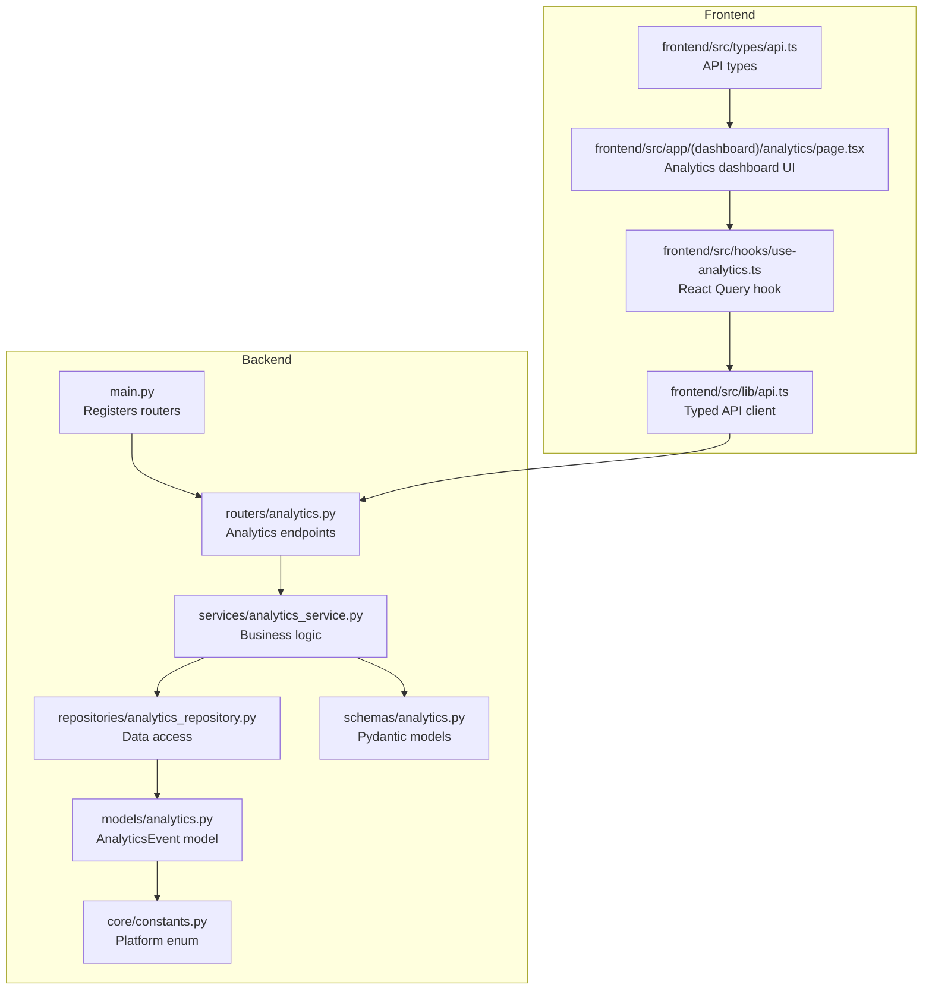
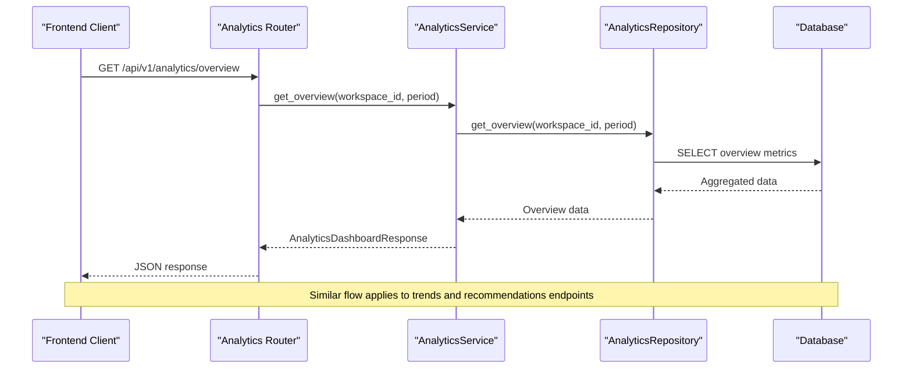
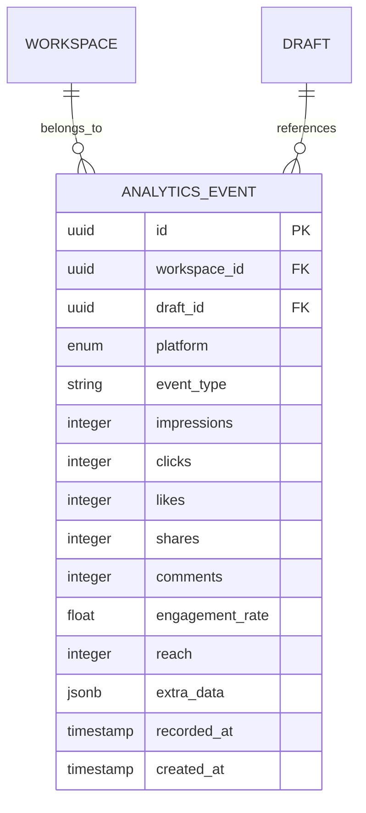
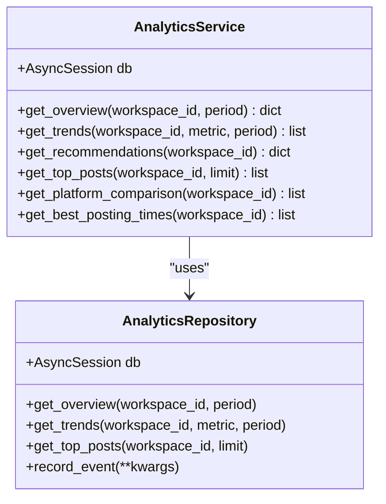
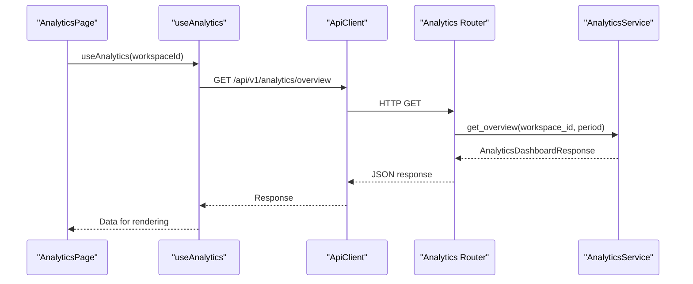
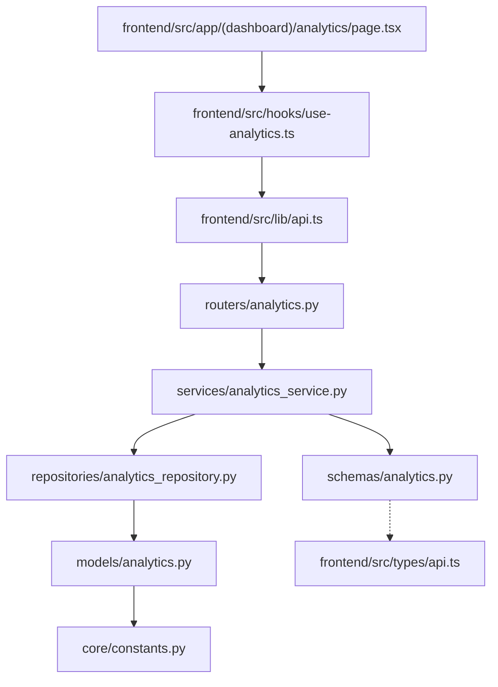

# Analytics API

<cite>
**Referenced Files in This Document**
- [backend/app/main.py](file://backend/app/main.py)
- [backend/app/routers/analytics.py](file://backend/app/routers/analytics.py)
- [backend/app/schemas/analytics.py](file://backend/app/schemas/analytics.py)
- [backend/app/services/analytics_service.py](file://backend/app/services/analytics_service.py)
- [backend/app/repositories/analytics_repository.py](file://backend/app/repositories/analytics_repository.py)
- [backend/app/models/analytics.py](file://backend/app/models/analytics.py)
- [backend/app/core/constants.py](file://backend/app/core/constants.py)
- [frontend/src/app/(dashboard)/analytics/page.tsx](file://frontend/src/app/(dashboard)/analytics/page.tsx)
- [frontend/src/hooks/use-analytics.ts](file://frontend/src/hooks/use-analytics.ts)
- [frontend/src/lib/api.ts](file://frontend/src/lib/api.ts)
- [frontend/src/types/api.ts](file://frontend/src/types/api.ts)
</cite>

## Table of Contents
1. [Introduction](#introduction)
2. [Project Structure](#project-structure)
3. [Core Components](#core-components)
4. [Architecture Overview](#architecture-overview)
5. [Detailed Component Analysis](#detailed-component-analysis)
6. [Dependency Analysis](#dependency-analysis)
7. [Performance Considerations](#performance-considerations)
8. [Troubleshooting Guide](#troubleshooting-guide)
9. [Conclusion](#conclusion)
10. [Appendices](#appendices)

## Introduction
This document provides comprehensive API documentation for Socialium's analytics endpoints. It covers performance metrics collection, trend analysis, engagement tracking, and recommendation generation. The documentation includes analytics data models, filtering options, time range queries, aggregated metrics, examples of analytics queries, performance dashboards, content optimization recommendations, and integration with external analytics platforms.

## Project Structure
The analytics functionality is implemented as part of the backend FastAPI application and consumed by the Next.js frontend. The backend exposes three primary analytics endpoints under the `/api/v1/analytics` route prefix, while the frontend integrates these endpoints to render dashboards and charts.

**Diagram sources**
- [backend/app/main.py](file://backend/app/main.py#L58-L62)
- [backend/app/routers/analytics.py](file://backend/app/routers/analytics.py#L1-L44)
- [backend/app/services/analytics_service.py](file://backend/app/services/analytics_service.py#L1-L60)
- [backend/app/repositories/analytics_repository.py](file://backend/app/repositories/analytics_repository.py#L1-L14)
- [backend/app/models/analytics.py](file://backend/app/models/analytics.py#L1-L49)
- [backend/app/schemas/analytics.py](file://backend/app/schemas/analytics.py#L1-L77)
- [backend/app/core/constants.py](file://backend/app/core/constants.py#L6-L12)
- [frontend/src/app/(dashboard)/analytics/page.tsx](file://frontend/src/app/(dashboard)/analytics/page.tsx#L1-L53)
- [frontend/src/hooks/use-analytics.ts](file://frontend/src/hooks/use-analytics.ts#L1-L13)
- [frontend/src/lib/api.ts](file://frontend/src/lib/api.ts#L1-L69)
- [frontend/src/types/api.ts](file://frontend/src/types/api.ts#L80-L97)

**Section sources**
- [backend/app/main.py](file://backend/app/main.py#L58-L62)
- [backend/app/routers/analytics.py](file://backend/app/routers/analytics.py#L1-L44)

## Core Components
This section documents the analytics endpoints, their request parameters, response schemas, and usage examples.

### Analytics Endpoints

#### GET /api/v1/analytics/overview
- Purpose: Retrieve the analytics dashboard overview for a workspace.
- Authentication: Not implemented in router; requires authentication middleware.
- Request parameters:
  - workspace_id (string, required): Identifier of the workspace.
  - period (string, optional): Time range for aggregation. Default is "30d".
- Response: AnalyticsDashboardResponse object containing overview metrics, trends, platform comparison, top posts, and best posting times.
- Example request:
  - GET /api/v1/analytics/overview?workspace_id=workspace-id&period=30d
- Example response:
  - See AnalyticsDashboardResponse schema below.

#### GET /api/v1/analytics/trends
- Purpose: Retrieve time-series trend data for a specific metric.
- Authentication: Not implemented in router; requires authentication middleware.
- Request parameters:
  - workspace_id (string, required): Identifier of the workspace.
  - metric (string, optional): Metric to analyze. Default is "impressions". Supported values include impressions, clicks, engagement_rate, follower_growth.
  - period (string, optional): Time range for aggregation. Default is "30d".
- Response: List of TrendDataPoint objects representing daily values for the selected metric.
- Example request:
  - GET /api/v1/analytics/trends?workspace_id=workspace-id&metric=engagement_rate&period=30d
- Example response:
  - See AnalyticsTrendsResponse schema below.

#### GET /api/v1/analytics/recommendations
- Purpose: Generate AI-powered content and scheduling recommendations.
- Authentication: Not implemented in router; requires authentication middleware.
- Request parameters:
  - workspace_id (string, required): Identifier of the workspace.
- Response: Recommendations including top-performing content patterns, underperforming content types, optimal posting times, and content type mix.
- Example request:
  - GET /api/v1/analytics/recommendations?workspace_id=workspace-id
- Example response:
  - See AnalyticsDashboardResponse schema below.

**Section sources**
- [backend/app/routers/analytics.py](file://backend/app/routers/analytics.py#L13-L43)

### Analytics Data Models

#### AnalyticsOverview
- Description: Dashboard overview metrics for a workspace.
- Fields:
  - total_posts_published (integer)
  - total_impressions (integer)
  - total_clicks (integer)
  - total_likes (integer)
  - total_shares (integer)
  - total_comments (integer)
  - average_engagement_rate (float)
  - follower_growth (integer)
  - scheduled_posts (integer)
  - post_frequency (float)

#### TrendDataPoint
- Description: Single data point in a trend series.
- Fields:
  - date (string)
  - value (float)

#### PlatformComparison
- Description: Per-platform metrics for comparison.
- Fields:
  - platform (string)
  - impressions (integer)
  - clicks (integer)
  - likes (integer)
  - engagement_rate (float)

#### TopPostItem
- Description: Top-performing post data.
- Fields:
  - draft_id (UUID)
  - headline (string or null)
  - platform (string)
  - impressions (integer)
  - engagement_rate (float)
  - published_at (datetime or null)

#### PostingTimeRecommendation
- Description: Recommended posting time with predicted engagement score.
- Fields:
  - day_of_week (integer, 0=Monday, 6=Sunday)
  - hour (integer)
  - score (float)

#### AnalyticsTrendsResponse
- Description: 30-day trend data for multiple metrics.
- Fields:
  - impressions (array of TrendDataPoint)
  - clicks (array of TrendDataPoint)
  - engagement_rate (array of TrendDataPoint)
  - follower_growth (array of TrendDataPoint)

#### AnalyticsDashboardResponse
- Description: Full analytics dashboard data combining overview, trends, platform comparison, top posts, and best posting times.
- Fields:
  - overview (AnalyticsOverview)
  - trends (AnalyticsTrendsResponse)
  - platform_comparison (array of PlatformComparison)
  - top_posts (array of TopPostItem)
  - best_posting_times (array of PostingTimeRecommendation)

**Section sources**
- [backend/app/schemas/analytics.py](file://backend/app/schemas/analytics.py#L9-L76)

### Filtering Options and Time Range Queries
- workspace_id: Required filter to scope analytics to a specific workspace.
- metric: Optional filter for trend analysis. Supported values include impressions, clicks, engagement_rate, follower_growth.
- period: Optional filter for time range aggregation. Default is "30d".

**Section sources**
- [backend/app/routers/analytics.py](file://backend/app/routers/analytics.py#L14-L33)

## Architecture Overview
The analytics architecture follows a layered pattern with clear separation of concerns:
- Routers handle HTTP requests and parameter validation.
- Services encapsulate business logic and orchestrate data retrieval.
- Repositories abstract data access and database operations.
- Models define the persistence layer for analytics events.
- Schemas enforce response validation and serialization.

**Diagram sources**
- [backend/app/routers/analytics.py](file://backend/app/routers/analytics.py#L13-L21)
- [backend/app/services/analytics_service.py](file://backend/app/services/analytics_service.py#L16-L22)
- [backend/app/repositories/analytics_repository.py](file://backend/app/repositories/analytics_repository.py#L10-L10)

**Section sources**
- [backend/app/routers/analytics.py](file://backend/app/routers/analytics.py#L1-L44)
- [backend/app/services/analytics_service.py](file://backend/app/services/analytics_service.py#L1-L60)
- [backend/app/repositories/analytics_repository.py](file://backend/app/repositories/analytics_repository.py#L1-L14)

## Detailed Component Analysis

### Analytics Event Model
The AnalyticsEvent model captures performance metrics for published content across supported platforms. It includes engagement metrics, reach, and metadata for analysis.

**Diagram sources**
- [backend/app/models/analytics.py](file://backend/app/models/analytics.py#L14-L48)
- [backend/app/core/constants.py](file://backend/app/core/constants.py#L6-L12)

**Section sources**
- [backend/app/models/analytics.py](file://backend/app/models/analytics.py#L1-L49)
- [backend/app/core/constants.py](file://backend/app/core/constants.py#L6-L12)

### Analytics Service Layer
The AnalyticsService provides the business logic for aggregating metrics and generating insights. It defines methods for overview, trends, recommendations, top posts, platform comparison, and best posting times.

**Diagram sources**
- [backend/app/services/analytics_service.py](file://backend/app/services/analytics_service.py#L6-L59)
- [backend/app/repositories/analytics_repository.py](file://backend/app/repositories/analytics_repository.py#L6-L13)

**Section sources**
- [backend/app/services/analytics_service.py](file://backend/app/services/analytics_service.py#L1-L60)
- [backend/app/repositories/analytics_repository.py](file://backend/app/repositories/analytics_repository.py#L1-L14)

### Frontend Integration
The frontend integrates analytics data through React Query hooks and a typed API client. The analytics page displays overview metrics and placeholders for trend charts.

**Diagram sources**
- [frontend/src/app/(dashboard)/analytics/page.tsx](file://frontend/src/app/(dashboard)/analytics/page.tsx#L13-L52)
- [frontend/src/hooks/use-analytics.ts](file://frontend/src/hooks/use-analytics.ts#L7-L12)
- [frontend/src/lib/api.ts](file://frontend/src/lib/api.ts#L47-L48)
- [backend/app/routers/analytics.py](file://backend/app/routers/analytics.py#L13-L21)

**Section sources**
- [frontend/src/app/(dashboard)/analytics/page.tsx](file://frontend/src/app/(dashboard)/analytics/page.tsx#L1-L53)
- [frontend/src/hooks/use-analytics.ts](file://frontend/src/hooks/use-analytics.ts#L1-L13)
- [frontend/src/lib/api.ts](file://frontend/src/lib/api.ts#L1-L69)

## Dependency Analysis
The analytics module exhibits clean separation of concerns with clear dependencies flowing from routers to services to repositories and models.

**Diagram sources**
- [backend/app/routers/analytics.py](file://backend/app/routers/analytics.py#L1-L44)
- [backend/app/services/analytics_service.py](file://backend/app/services/analytics_service.py#L1-L60)
- [backend/app/repositories/analytics_repository.py](file://backend/app/repositories/analytics_repository.py#L1-L14)
- [backend/app/models/analytics.py](file://backend/app/models/analytics.py#L1-L49)
- [backend/app/schemas/analytics.py](file://backend/app/schemas/analytics.py#L1-L77)
- [backend/app/core/constants.py](file://backend/app/core/constants.py#L6-L12)
- [frontend/src/app/(dashboard)/analytics/page.tsx](file://frontend/src/app/(dashboard)/analytics/page.tsx#L1-L53)
- [frontend/src/hooks/use-analytics.ts](file://frontend/src/hooks/use-analytics.ts#L1-L13)
- [frontend/src/lib/api.ts](file://frontend/src/lib/api.ts#L1-L69)
- [frontend/src/types/api.ts](file://frontend/src/types/api.ts#L80-L97)

**Section sources**
- [backend/app/routers/analytics.py](file://backend/app/routers/analytics.py#L1-L44)
- [backend/app/services/analytics_service.py](file://backend/app/services/analytics_service.py#L1-L60)
- [frontend/src/lib/api.ts](file://frontend/src/lib/api.ts#L1-L69)

## Performance Considerations
- Time-series aggregation: Trend analysis should leverage database-level grouping and aggregation to minimize payload sizes.
- Pagination: For large datasets, implement pagination in repository queries to avoid excessive memory usage.
- Caching: Cache frequently accessed overview data with appropriate invalidation strategies.
- Indexing: Ensure database indexes on workspace_id, recorded_at, and platform fields for efficient querying.
- Asynchronous processing: Use async database operations to maintain responsiveness during heavy analytics computations.

## Troubleshooting Guide
Common issues and resolutions:
- Authentication errors: Ensure proper authentication middleware is configured for analytics endpoints.
- Missing workspace_id: Validate workspace_id parameter presence and format before processing.
- Unsupported metric values: Implement validation for metric parameter against supported values.
- Database connectivity: Monitor repository query execution and handle connection failures gracefully.
- Data consistency: Verify AnalyticsEvent model fields align with actual database schema.

**Section sources**
- [backend/app/routers/analytics.py](file://backend/app/routers/analytics.py#L13-L43)
- [backend/app/services/analytics_service.py](file://backend/app/services/analytics_service.py#L16-L59)

## Conclusion
Socialium's analytics API provides a comprehensive foundation for performance monitoring, trend analysis, and recommendation generation. The modular architecture supports extensibility for additional metrics, platforms, and analytical capabilities while maintaining clean separation of concerns between presentation, business logic, and data access layers.

## Appendices

### API Endpoint Reference

#### GET /api/v1/analytics/overview
- Path parameters: None
- Query parameters:
  - workspace_id (required)
  - period (optional, default "30d")
- Response: AnalyticsDashboardResponse

#### GET /api/v1/analytics/trends
- Path parameters: None
- Query parameters:
  - workspace_id (required)
  - metric (optional, default "impressions")
  - period (optional, default "30d")
- Response: AnalyticsTrendsResponse

#### GET /api/v1/analytics/recommendations
- Path parameters: None
- Query parameters:
  - workspace_id (required)
- Response: AnalyticsDashboardResponse

### Supported Metrics
- impressions: Total views across all platforms
- clicks: Total clicks on published content
- engagement_rate: Calculated engagement percentage
- follower_growth: Net increase in followers

### Platform Support
- LinkedIn
- Twitter
- Instagram
- Facebook

**Section sources**
- [backend/app/routers/analytics.py](file://backend/app/routers/analytics.py#L13-L43)
- [backend/app/core/constants.py](file://backend/app/core/constants.py#L6-L12)