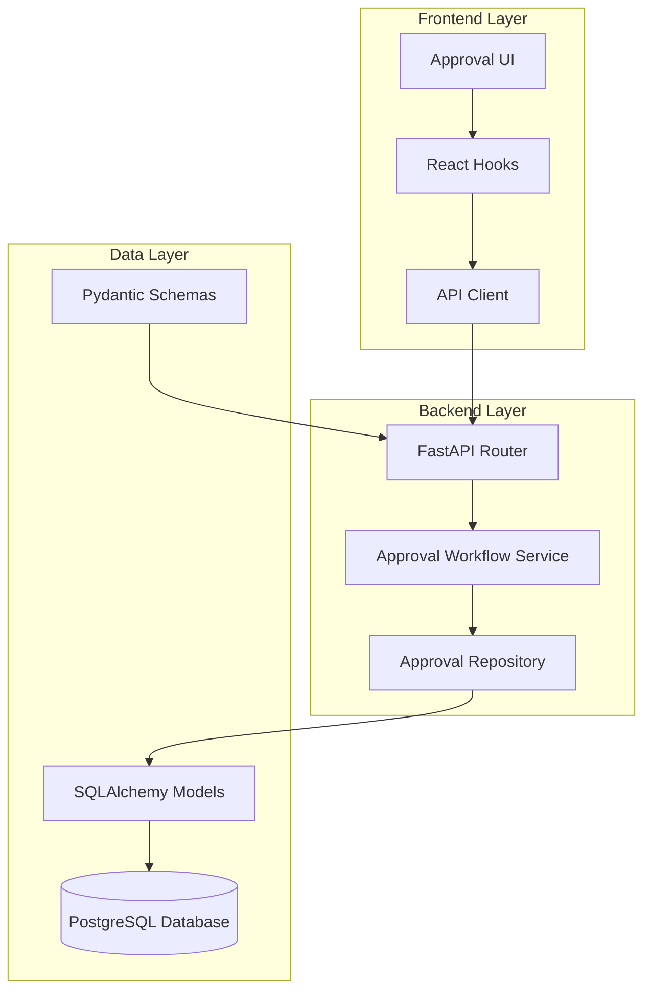
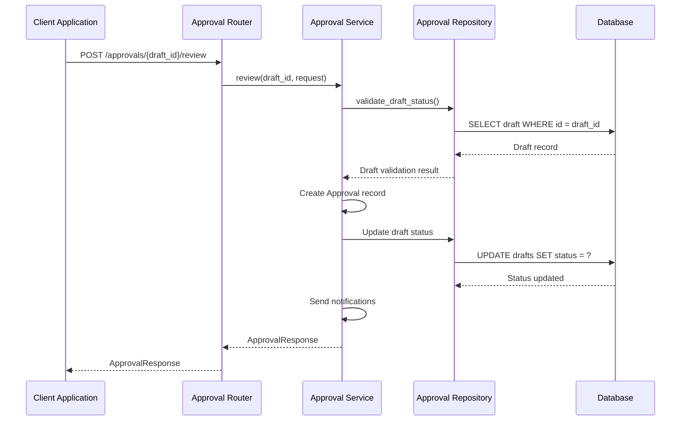
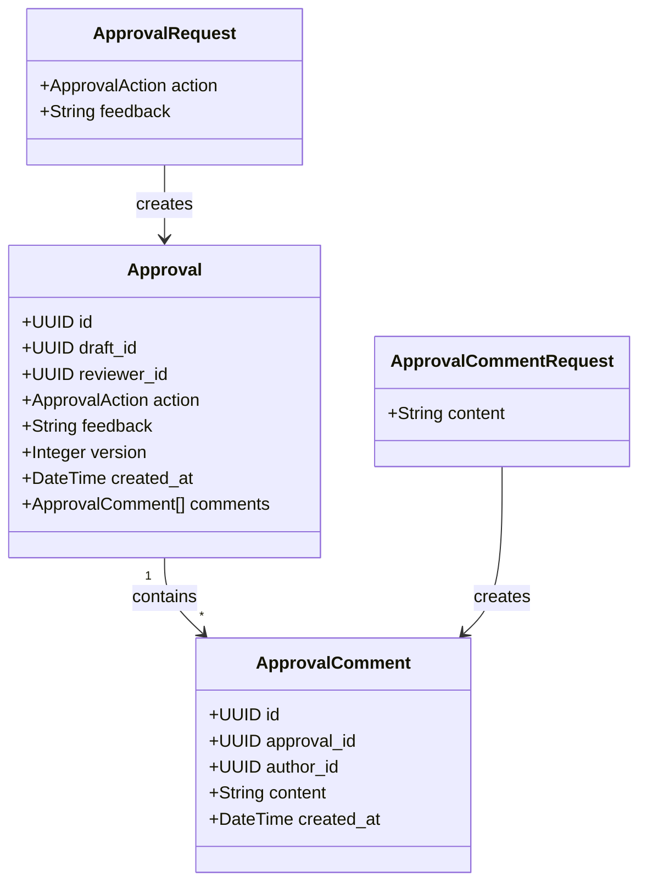
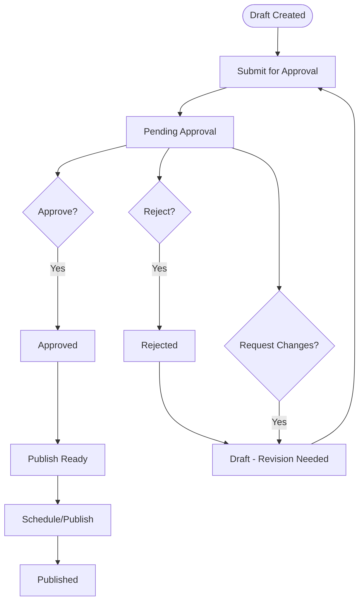
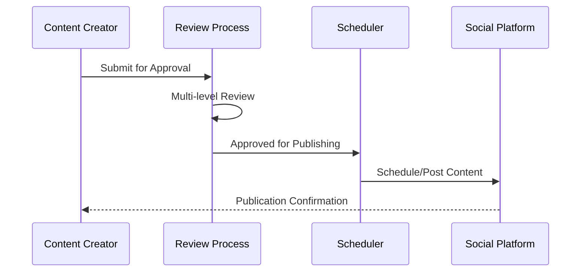

# Approval Workflow API

<cite>
**Referenced Files in This Document**
- [approvals.py](file://backend/app/routers/approvals.py)
- [approval.py](file://backend/app/schemas/approval.py)
- [approval.py](file://backend/app/models/approval.py)
- [constants.py](file://backend/app/core/constants.py)
- [draft.py](file://backend/app/models/draft.py)
- [approval_workflow_service.py](file://backend/app/services/approval_workflow_service.py)
- [approval_repository.py](file://backend/app/repositories/approval_repository.py)
- [use-approvals.ts](file://frontend/src/hooks/use-approvals.ts)
- [page.tsx](file://frontend/src/app/(dashboard)/approvals/page.tsx)
- [api.ts](file://frontend/src/lib/api.ts)
- [api.ts](file://frontend/src/types/api.ts)
</cite>

## Table of Contents
1. [Introduction](#introduction)
2. [Project Structure](#project-structure)
3. [Core Components](#core-components)
4. [Architecture Overview](#architecture-overview)
5. [Detailed Component Analysis](#detailed-component-analysis)
6. [API Reference](#api-reference)
7. [Approval Forms and Schemas](#approval-forms-and-schemas)
8. [Workflow State Transitions](#workflow-state-transitions)
9. [Multi-Level Approval Processes](#multi-level-approval-processes)
10. [Notification Systems](#notification-systems)
11. [Role-Based Access Control](#role-based-access-control)
12. [Integration with Publishing Workflows](#integration-with-publishing-workflows)
13. [Collaborative Approval Scenarios](#collaborative-approval-scenarios)
14. [Performance Considerations](#performance-considerations)
15. [Troubleshooting Guide](#troubleshooting-guide)
16. [Conclusion](#conclusion)

## Introduction
Socialium's Approval Workflow API provides a comprehensive system for managing content approval processes across social media platforms. This API enables teams to collaborate on content review, manage approval hierarchies, track decision history, and integrate seamlessly with content publishing workflows. The system supports multi-level approval processes, real-time commenting, and automated notifications to ensure efficient content governance.

## Project Structure
The approval workflow system follows a layered architecture with clear separation of concerns:



**Diagram sources**
- [approvals.py](file://backend/app/routers/approvals.py#L1-L61)
- [approval_workflow_service.py](file://backend/app/services/approval_workflow_service.py#L1-L48)
- [approval.py](file://backend/app/models/approval.py#L1-L69)

**Section sources**
- [approvals.py](file://backend/app/routers/approvals.py#L1-L61)
- [approval_workflow_service.py](file://backend/app/services/approval_workflow_service.py#L1-L48)

## Core Components
The approval workflow system consists of several interconnected components working together to provide a robust approval management solution:

### Backend Components
- **Router Layer**: Handles HTTP requests and responses for approval operations
- **Service Layer**: Implements business logic for approval state management
- **Repository Layer**: Manages database operations for approval records
- **Model Layer**: Defines database schema and relationships
- **Schema Layer**: Validates request/response data structures

### Frontend Components
- **API Client**: Manages HTTP communication with backend services
- **React Hooks**: Provides reactive state management for approval data
- **UI Components**: Handles user interaction for approval workflows

**Section sources**
- [approvals.py](file://backend/app/routers/approvals.py#L1-L61)
- [approval_workflow_service.py](file://backend/app/services/approval_workflow_service.py#L1-L48)
- [approval.py](file://backend/app/models/approval.py#L1-L69)

## Architecture Overview
The approval workflow follows a state machine pattern with clear transitions between content statuses:

```mermaid
stateDiagram-v2
[*] --> Draft
Draft --> PendingApproval : Submit for Approval
PendingApproval --> Approved : Approve
PendingApproval --> Rejected : Reject
PendingApproval --> Draft : Request Changes
state Draft {
[*] --> Draft
Draft --> PendingApproval : submit_for_approval()
}
state PendingApproval {
[*] --> PendingApproval
PendingApproval --> Approved : review(action=approve)
PendingApproval --> Rejected : review(action=reject)
PendingApproval --> Draft : review(action=request_changes)
}
state Approved {
[*] --> Approved
Approved --> Scheduled : Publish Content
}
state Rejected {
[*] --> Rejected
Rejected --> Draft : Resubmit
}
state Scheduled {
[*] --> Scheduled
Scheduled --> Published : Post Published
}
```

**Diagram sources**
- [constants.py](file://backend/app/core/constants.py#L14-L22)
- [approval_workflow_service.py](file://backend/app/services/approval_workflow_service.py#L25-L39)

## Detailed Component Analysis

### Approval Request Processing
The approval request processing system handles three primary actions with distinct state transitions:



**Diagram sources**
- [approvals.py](file://backend/app/routers/approvals.py#L41-L49)
- [approval_workflow_service.py](file://backend/app/services/approval_workflow_service.py#L25-L39)

### Comment Management System
The comment system allows collaborative review with threaded discussions:



**Diagram sources**
- [approval.py](file://backend/app/models/approval.py#L14-L40)
- [approval.py](file://backend/app/schemas/approval.py#L11-L22)

**Section sources**
- [approval.py](file://backend/app/models/approval.py#L1-L69)
- [approval.py](file://backend/app/schemas/approval.py#L1-L69)

## API Reference

### Endpoint Definitions

#### List Pending Approvals
Retrieves drafts awaiting approval in a workspace with pagination support.

**Endpoint**: `GET /api/v1/approvals/pending`
**Authentication**: Required
**Permissions**: Editor, Owner

**Query Parameters**:
- `workspace_id` (string, required): Workspace identifier
- `page` (integer): Page number (default: 1)
- `page_size` (integer): Items per page (default: 20)

**Response**: `ApprovalListResponse`
- `items` (array): Pending approval items
- `total` (integer): Total count
- `page` (integer): Current page
- `page_size` (integer): Items per page

#### Get Approval History
Retrieves complete approval history for a draft.

**Endpoint**: `GET /api/v1/approvals/history`
**Authentication**: Required
**Permissions**: Editor, Owner

**Query Parameters**:
- `draft_id` (string, required): Draft identifier

**Response**: Array of `ApprovalResponse`

#### Review Draft
Processes an approval action (approve, reject, request changes).

**Endpoint**: `POST /api/v1/approvals/{draft_id}/review`
**Authentication**: Required
**Permissions**: Editor, Owner

**Path Parameters**:
- `draft_id` (string, required): Draft identifier

**Request Body**: `ApprovalRequest`
- `action` (string, required): One of `approve`, `reject`, `request_changes`
- `feedback` (string, optional): Review feedback (max 2000 characters)

**Response**: `ApprovalResponse`

#### Add Comment
Adds a comment to an approval process.

**Endpoint**: `POST /api/v1/approvals/{approval_id}/comments`
**Authentication**: Required
**Permissions**: Editor, Owner

**Path Parameters**:
- `approval_id` (string, required): Approval identifier

**Request Body**: `ApprovalCommentRequest`
- `content` (string, required): Comment text (min 1, max 1000 characters)

**Response**: `ApprovalCommentResponse`

**Section sources**
- [approvals.py](file://backend/app/routers/approvals.py#L19-L60)

## Approval Forms and Schemas

### ApprovalRequest Schema
Defines the structure for approval actions:

| Field | Type | Required | Validation | Description |
|-------|------|----------|------------|-------------|
| action | string | Yes | Enum: approve, reject, request_changes | Decision action |
| feedback | string | No | Max 2000 characters | Review comments |

### ApprovalResponse Schema
Represents individual approval records:

| Field | Type | Description |
|-------|------|-------------|
| id | UUID | Approval identifier |
| draft_id | UUID | Associated draft |
| reviewer_id | UUID | Reviewer user identifier |
| action | string | Approval action taken |
| feedback | string | Review feedback |
| version | integer | Approval version number |
| created_at | datetime | Timestamp of approval |
| comments | array | Related comments |

### PendingApprovalItem Schema
Displays items in the pending approvals list:

| Field | Type | Description |
|-------|------|-------------|
| draft_id | UUID | Draft identifier |
| platform | string | Social media platform |
| headline | string | Content headline |
| body_text | string | Content preview |
| requested_by | string | Creator name |
| character_count | integer | Character count |
| created_at | datetime | Creation timestamp |

### ApprovalCommentRequest Schema
Defines comment submission structure:

| Field | Type | Required | Validation | Description |
|-------|------|----------|------------|-------------|
| content | string | Yes | Min 1, Max 1000 characters | Comment text |

**Section sources**
- [approval.py](file://backend/app/schemas/approval.py#L11-L69)

## Workflow State Transitions

### State Machine Implementation
The approval workflow implements a finite state machine with four primary states:



**Diagram sources**
- [constants.py](file://backend/app/core/constants.py#L14-L22)
- [approval_workflow_service.py](file://backend/app/services/approval_workflow_service.py#L25-L39)

### Action-Specific Behavior
Each approval action triggers specific system behavior:

| Action | Draft Status Change | System Response | Notification |
|--------|-------------------|-----------------|--------------|
| approve | approved | Ready for scheduling | Creator notified |
| reject | rejected | Content remains editable | Creator notified |
| request_changes | draft | Revision required | Reviewer/Creator notified |

**Section sources**
- [approval_workflow_service.py](file://backend/app/services/approval_workflow_service.py#L25-L39)

## Multi-Level Approval Processes
The system supports hierarchical approval workflows through configurable reviewer assignment:

### Reviewer Assignment Strategy
1. **Automatic Assignment**: System assigns reviewers based on workspace hierarchy
2. **Manual Assignment**: Approvers can be manually selected
3. **Rotation System**: Reviewers rotate to prevent bottlenecks
4. **Expert Routing**: Specialized reviewers for specific content types

### Approval Chain Configuration
- **Level 1**: Content Editor Review
- **Level 2**: Team Lead Approval  
- **Level 3**: Executive Sign-off (optional)

**Section sources**
- [approval.py](file://backend/app/models/approval.py#L25-L27)

## Notification Systems
The approval workflow includes comprehensive notification capabilities:

### Notification Triggers
- Approval decision sent to content creator
- Reviewer assignment notifications
- Comment addition alerts
- Status change notifications

### Notification Channels
- **Email Notifications**: Detailed approval summaries
- **In-App Messages**: Real-time updates
- **Slack Integration**: Team collaboration
- **Mobile Push**: Critical updates

### Notification Content
Notifications include:
- Approval action and rationale
- Timeline of approval decisions
- Next steps for content creators
- Direct links to review interface

**Section sources**
- [approval_workflow_service.py](file://backend/app/services/approval_workflow_service.py#L37-L37)

## Role-Based Access Control
The system implements granular permissions based on workspace roles:

### Workspace Roles
| Role | Permissions | Approval Authority |
|------|-------------|-------------------|
| Owner | Full access, manage members | Can approve/reject at any level |
| Editor | Create/edit content, approve | Can approve/reject up to mid-level |
| Viewer | View only | Cannot approve/reject |

### Access Control Implementation
- **Route Protection**: All approval endpoints require authentication
- **Workspace Boundaries**: Users can only access their workspace data
- **Action Validation**: System validates user permissions for each action
- **Audit Trail**: All actions are logged with user context

**Section sources**
- [constants.py](file://backend/app/core/constants.py#L39-L44)

## Integration with Publishing Workflows
The approval system integrates seamlessly with content publishing:

### Publishing Pipeline


### Publishing Requirements
- **Approved Status**: Content must be approved before scheduling
- **Character Limits**: Platform-specific character restrictions
- **Media Compliance**: Image/video requirements per platform
- **Timing Constraints**: Optimal posting time validation

**Section sources**
- [constants.py](file://backend/app/core/constants.py#L63-L69)

## Collaborative Approval Scenarios

### Scenario 1: Content Marketing Team
A marketing team collaborates on campaign content:
1. **Initial Review**: Junior editor submits content
2. **Team Discussion**: Comments added for improvements
3. **Senior Review**: Lead editor approves final version
4. **Publication**: Scheduled for optimal timing

### Scenario 2: Cross-Functional Review
Different departments review specialized content:
1. **Legal Review**: Compliance team checks legal requirements
2. **Brand Review**: Marketing team ensures brand alignment
3. **Technical Review**: Technical team verifies accuracy
4. **Executive Approval**: Final sign-off for sensitive content

### Scenario 3: External Stakeholder Review
External partners participate in review process:
1. **Stakeholder Assignment**: External reviewers invited
2. **Confidential Review**: Secure review environment
3. **Decision Integration**: Stakeholder feedback incorporated
4. **Final Approval**: Combined internal/external approval

## Performance Considerations
The approval workflow system is designed for scalability and performance:

### Database Optimization
- **Indexing**: Strategic indexing on frequently queried fields
- **Pagination**: Efficient pagination for large approval lists
- **Caching**: Redis caching for frequently accessed approval data
- **Connection Pooling**: Optimized database connection management

### API Performance
- **Async Operations**: Non-blocking database operations
- **Response Optimization**: Minimal payload sizes
- **Rate Limiting**: Prevents API abuse
- **Error Handling**: Graceful degradation on failures

### Frontend Performance
- **Query Caching**: React Query for efficient data management
- **Loading States**: Optimistic UI updates
- **Batch Operations**: Multiple approvals processed efficiently
- **Real-time Updates**: WebSocket integration for live updates

## Troubleshooting Guide

### Common Issues and Solutions

#### Issue: Approval Not Showing in Pending List
**Symptoms**: Approved content not appearing in pending approvals
**Causes**: 
- Draft not submitted for approval
- Incorrect workspace filtering
- Status not set to pending_approval

**Solutions**:
1. Verify draft status is pending_approval
2. Check workspace_id parameter
3. Confirm user has proper permissions

#### Issue: Approval Action Fails
**Symptoms**: 400/403 errors when submitting approvals
**Causes**:
- Invalid action parameter
- Insufficient permissions
- Draft not in pending_approval status

**Solutions**:
1. Validate action is one of approve, reject, request_changes
2. Check user role permissions
3. Verify draft eligibility for approval

#### Issue: Comment Not Saved
**Symptoms**: Comments not appearing in approval history
**Causes**:
- Content length violations
- Database connectivity issues
- Authentication problems

**Solutions**:
1. Ensure comment length <= 1000 characters
2. Check database connection status
3. Verify user authentication

**Section sources**
- [approval_workflow_service.py](file://backend/app/services/approval_workflow_service.py#L17-L47)

## Conclusion
Socialium's Approval Workflow API provides a comprehensive solution for content governance with robust multi-level approval processes, collaborative review capabilities, and seamless integration with publishing workflows. The system's modular architecture, comprehensive error handling, and scalable design make it suitable for teams of all sizes while maintaining strict security and compliance standards.

The API's clear state machine implementation, extensive notification system, and flexible role-based access control ensure efficient content management while maintaining organizational governance requirements. Future enhancements could include advanced analytics, automated approval routing, and integration with external review systems.