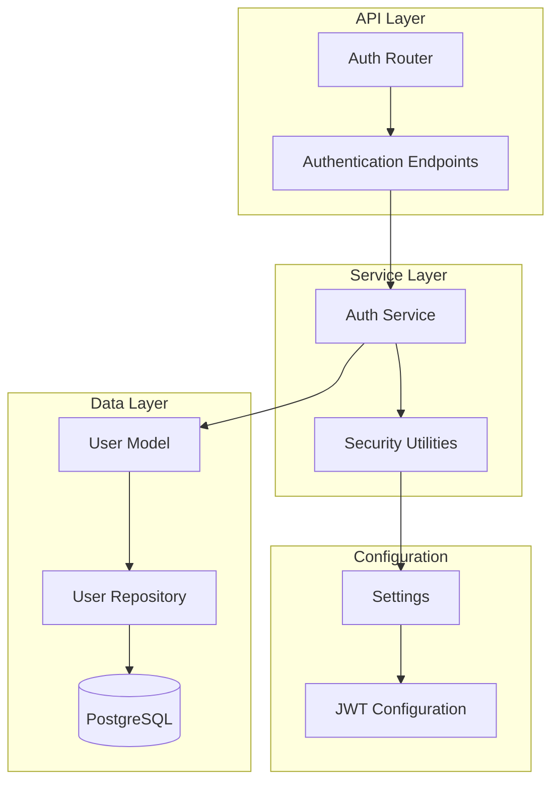
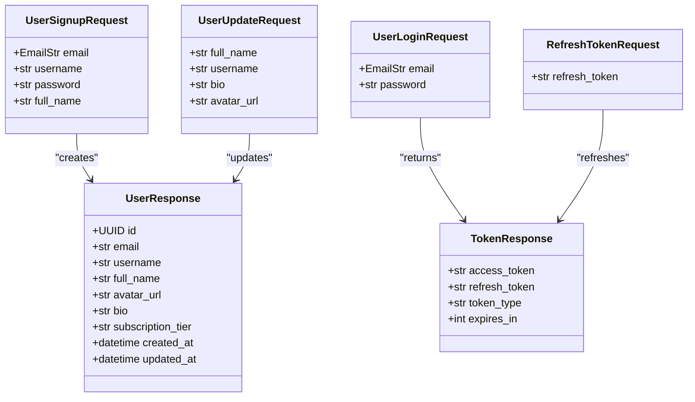
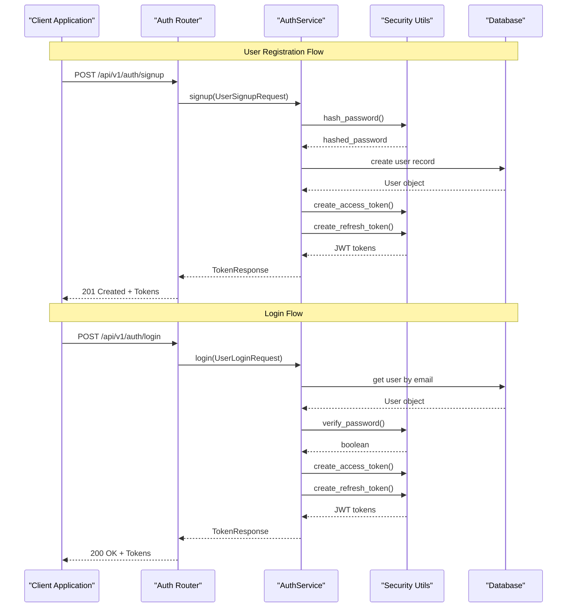
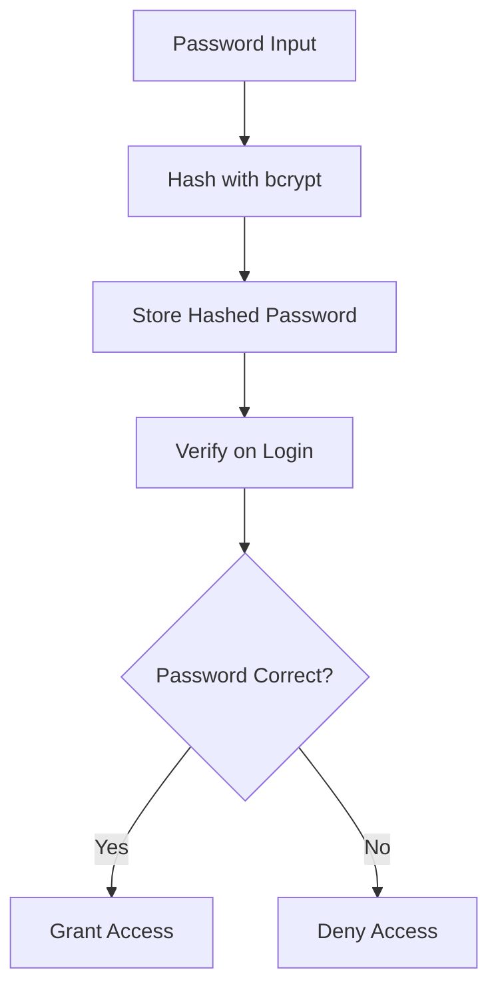
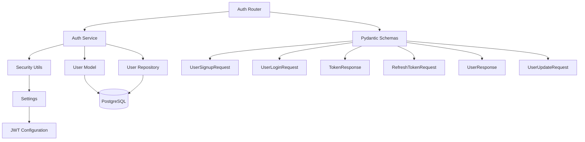

# Authentication API

<cite>
**Referenced Files in This Document**
- [auth.py](file://backend/app/routers/auth.py)
- [auth_schemas.py](file://backend/app/schemas/auth.py)
- [auth_service.py](file://backend/app/services/auth_service.py)
- [security.py](file://backend/app/core/security.py)
- [config.py](file://backend/app/config.py)
- [user_model.py](file://backend/app/models/user.py)
- [user_repository.py](file://backend/app/repositories/user_repository.py)
- [main.py](file://backend/app/main.py)
- [exceptions.py](file://backend/app/core/exceptions.py)
</cite>

## Table of Contents
1. [Introduction](#introduction)
2. [Project Structure](#project-structure)
3. [Core Components](#core-components)
4. [Architecture Overview](#architecture-overview)
5. [Detailed Component Analysis](#detailed-component-analysis)
6. [Dependency Analysis](#dependency-analysis)
7. [Performance Considerations](#performance-considerations)
8. [Troubleshooting Guide](#troubleshooting-guide)
9. [Conclusion](#conclusion)

## Introduction
This document provides comprehensive API documentation for Socialium's authentication system. It covers the complete authentication flow including user registration, login, token refresh, profile retrieval, and profile updates. The documentation includes detailed request/response schemas using Pydantic models, JWT token structure, authentication headers, error responses, practical examples with curl commands, client implementation guidelines, and security considerations including password policies and token expiration handling.

## Project Structure
The authentication system follows a layered architecture with clear separation of concerns:



**Diagram sources**
- [auth.py](file://backend/app/routers/auth.py#L1-L69)
- [auth_service.py](file://backend/app/services/auth_service.py#L1-L68)
- [security.py](file://backend/app/core/security.py#L1-L50)
- [user_model.py](file://backend/app/models/user.py#L1-L48)

**Section sources**
- [auth.py](file://backend/app/routers/auth.py#L1-L69)
- [main.py](file://backend/app/main.py#L57-L58)

## Core Components

### Authentication Endpoints
The authentication system exposes five primary endpoints under the `/api/v1/auth` prefix:

1. **POST /signup** - User registration with email, username, password, and full name
2. **POST /login** - User authentication with email and password
3. **POST /refresh** - Token refresh mechanism using refresh tokens
4. **GET /me** - Retrieve current user's profile
5. **PUT /me** - Update current user's profile

### Pydantic Schemas
All request and response data is validated using Pydantic models with strict field validation:



**Diagram sources**
- [auth_schemas.py](file://backend/app/schemas/auth.py#L9-L63)

**Section sources**
- [auth_schemas.py](file://backend/app/schemas/auth.py#L1-L63)

## Architecture Overview



**Diagram sources**
- [auth.py](file://backend/app/routers/auth.py#L20-L37)
- [auth_service.py](file://backend/app/services/auth_service.py#L21-L45)
- [security.py](file://backend/app/core/security.py#L15-L40)

## Detailed Component Analysis

### JWT Token Structure
The authentication system uses JSON Web Tokens (JWT) with standardized claims:

| Claim | Type | Description | Example |
|-------|------|-------------|---------|
| `sub` | string | Subject identifier (user ID) | `"user-uuid"` |
| `exp` | integer | Expiration timestamp (UTC) | `1700000000` |
| `type` | string | Token type (`access` or `refresh`) | `"access"` |
| `iss` | string | Issuer (optional) | `"socialium"` |
| `aud` | string | Audience (optional) | `"socialium-users"` |

#### Access Token Configuration
- **Expiration**: 30 minutes (configurable via `jwt_access_token_expire_minutes`)
- **Purpose**: API access authorization
- **Scope**: Limited-time access to protected resources

#### Refresh Token Configuration
- **Expiration**: 7 days (configurable via `jwt_refresh_token_expire_days`)
- **Purpose**: Obtain new access tokens
- **Security**: Stored securely, should be rotated

**Section sources**
- [security.py](file://backend/app/core/security.py#L25-L40)
- [config.py](file://backend/app/config.py#L32-L36)

### Password Security
The system implements robust password security measures:



**Diagram sources**
- [security.py](file://backend/app/core/security.py#L15-L22)

Password policies enforced by Pydantic models:
- **Minimum length**: 8 characters
- **Maximum length**: 128 characters
- **Username pattern**: Alphanumeric, underscore, hyphen only
- **Username length**: 3-50 characters
- **Full name**: 1-100 characters

**Section sources**
- [auth_schemas.py](file://backend/app/schemas/auth.py#L12-L15)

### Authentication Headers
All authenticated requests require the Authorization header:

```
Authorization: Bearer <access_token>
```

Header requirements:
- **Format**: `Bearer <token>`
- **Placement**: HTTP header
- **Case sensitivity**: Header name is case-insensitive
- **Token type**: Must be a valid access token (not refresh token)

**Section sources**
- [auth_schemas.py](file://backend/app/schemas/auth.py#L25-L32)

### Endpoint Specifications

#### POST /api/v1/auth/signup
**Description**: Register a new user account

**Request Body**:
- `email`: Unique email address (validated)
- `username`: Unique username (3-50 chars, alphanumeric, underscore, hyphen)
- `password`: Secure password (8-128 chars)
- `full_name`: User's full name (1-100 chars)

**Response**: `TokenResponse` on successful registration
- `access_token`: JWT access token
- `refresh_token`: JWT refresh token
- `token_type`: Always "bearer"
- `expires_in`: Access token lifetime in seconds

**Status Codes**:
- `201 Created`: Successful registration
- `400 Bad Request`: Invalid input data
- `409 Conflict`: Email or username already exists
- `422 Unprocessable Entity`: Validation errors

**Section sources**
- [auth.py](file://backend/app/routers/auth.py#L20-L27)
- [auth_service.py](file://backend/app/services/auth_service.py#L21-L33)
- [auth_schemas.py](file://backend/app/schemas/auth.py#L9-L16)

#### POST /api/v1/auth/login
**Description**: Authenticate existing user

**Request Body**:
- `email`: User's registered email
- `password`: Plain text password

**Response**: `TokenResponse` on successful authentication
- `access_token`: JWT access token
- `refresh_token`: JWT refresh token
- `token_type`: Always "bearer"
- `expires_in`: Access token lifetime in seconds

**Status Codes**:
- `200 OK`: Successful authentication
- `400 Bad Request`: Invalid credentials format
- `401 Unauthorized`: Invalid email/password combination
- `422 Unprocessable Entity`: Validation errors

**Section sources**
- [auth.py](file://backend/app/routers/auth.py#L30-L37)
- [auth_service.py](file://backend/app/services/auth_service.py#L35-L45)
- [auth_schemas.py](file://backend/app/schemas/auth.py#L18-L23)

#### POST /api/v1/auth/refresh
**Description**: Refresh expired access token

**Request Body**:
- `refresh_token`: Valid refresh token string

**Response**: New `TokenResponse` with fresh tokens
- `access_token`: New JWT access token
- `refresh_token`: New JWT refresh token
- `token_type`: Always "bearer"
- `expires_in`: New access token lifetime in seconds

**Status Codes**:
- `200 OK`: Token refreshed successfully
- `400 Bad Request`: Invalid refresh token format
- `401 Unauthorized`: Invalid or expired refresh token
- `422 Unprocessable Entity`: Validation errors

**Section sources**
- [auth.py](file://backend/app/routers/auth.py#L40-L47)
- [auth_service.py](file://backend/app/services/auth_service.py#L47-L57)
- [auth_schemas.py](file://backend/app/schemas/auth.py#L34-L37)

#### GET /api/v1/auth/me
**Description**: Retrieve current user's profile

**Response**: `UserResponse` containing user information
- `id`: Unique user identifier
- `email`: User's email address
- `username`: Unique username
- `full_name`: User's full name
- `avatar_url`: Profile avatar URL (nullable)
- `bio`: User biography (nullable)
- `subscription_tier`: Current subscription level
- `created_at`: Account creation timestamp
- `updated_at`: Last profile update timestamp

**Status Codes**:
- `200 OK`: Profile retrieved successfully
- `401 Unauthorized`: Missing or invalid authentication
- `404 Not Found`: User not found

**Section sources**
- [auth.py](file://backend/app/routers/auth.py#L50-L57)
- [auth_service.py](file://backend/app/services/auth_service.py#L59-L62)
- [auth_schemas.py](file://backend/app/schemas/auth.py#L40-L53)

#### PUT /api/v1/auth/me
**Description**: Update current user's profile

**Request Body**:
- `full_name`: Updated full name (nullable, 1-100 chars)
- `username`: Updated username (nullable, 3-50 chars, alphanumeric, underscore, hyphen)
- `bio`: Updated biography (nullable)
- `avatar_url`: Updated avatar URL (nullable)

**Response**: Updated `UserResponse` with new profile data

**Status Codes**:
- `200 OK`: Profile updated successfully
- `400 Bad Request`: Invalid update data
- `401 Unauthorized`: Missing or invalid authentication
- `409 Conflict`: Username/email conflicts
- `422 Unprocessable Entity`: Validation errors

**Section sources**
- [auth.py](file://backend/app/routers/auth.py#L60-L67)
- [auth_service.py](file://backend/app/services/auth_service.py#L64-L67)
- [auth_schemas.py](file://backend/app/schemas/auth.py#L56-L63)

### Practical Implementation Examples

#### Curl Commands
```bash
# User Registration
curl -X POST "http://localhost:8000/api/v1/auth/signup" \
  -H "Content-Type: application/json" \
  -d '{
    "email": "user@example.com",
    "username": "john_doe",
    "password": "SecurePass123!",
    "full_name": "John Doe"
  }'

# User Login
curl -X POST "http://localhost:8000/api/v1/auth/login" \
  -H "Content-Type: application/json" \
  -d '{
    "email": "user@example.com",
    "password": "SecurePass123!"
  }'

# Get Profile
curl -X GET "http://localhost:8000/api/v1/auth/me" \
  -H "Authorization: Bearer YOUR_ACCESS_TOKEN"

# Update Profile
curl -X PUT "http://localhost:8000/api/v1/auth/me" \
  -H "Authorization: Bearer YOUR_ACCESS_TOKEN" \
  -H "Content-Type: application/json" \
  -d '{
    "full_name": "Updated Name",
    "bio": "Updated bio"
  }'
```

#### Client Implementation Guidelines
1. **Token Storage**: Store refresh tokens securely (encrypted storage)
2. **Token Rotation**: Implement automatic token refresh before expiration
3. **Error Handling**: Handle 401 Unauthorized by prompting re-authentication
4. **Input Validation**: Validate all user inputs before sending requests
5. **Security**: Never log tokens or sensitive user data

**Section sources**
- [auth.py](file://backend/app/routers/auth.py#L20-L67)

## Dependency Analysis



**Diagram sources**
- [auth.py](file://backend/app/routers/auth.py#L1-L69)
- [auth_service.py](file://backend/app/services/auth_service.py#L1-L68)
- [security.py](file://backend/app/core/security.py#L1-L50)
- [user_model.py](file://backend/app/models/user.py#L1-L48)
- [user_repository.py](file://backend/app/repositories/user_repository.py#L1-L40)

**Section sources**
- [auth.py](file://backend/app/routers/auth.py#L1-L69)
- [auth_service.py](file://backend/app/services/auth_service.py#L1-L68)
- [security.py](file://backend/app/core/security.py#L1-L50)

## Performance Considerations
- **Token Expiration**: Access tokens expire quickly (30 minutes) to minimize security risk
- **Database Queries**: User lookups are indexed by email and username for optimal performance
- **Password Hashing**: bcrypt cost factor balances security and performance
- **Connection Pooling**: SQLAlchemy async connections handle concurrent authentication requests efficiently

## Troubleshooting Guide

### Common Authentication Issues

**400 Bad Request**
- Invalid JSON format in request body
- Missing required fields
- Malformed email addresses

**401 Unauthorized**
- Expired or invalid access tokens
- Missing Authorization header
- Incorrect token format

**409 Conflict**
- Duplicate email registration
- Duplicate username usage
- Username conflicts during updates

**422 Unprocessable Entity**
- Password validation failures
- Username pattern violations
- Field length constraints exceeded

### Error Response Format
All error responses follow a consistent JSON structure:
```json
{
  "error": "Error message describing the problem",
  "status_code": 400
}
```

### Security Best Practices
1. **Token Management**: Store refresh tokens securely and rotate them periodically
2. **Password Policies**: Enforce strong passwords with minimum 8 characters
3. **Rate Limiting**: Implement rate limiting on authentication endpoints
4. **Logging**: Log authentication attempts without storing sensitive data
5. **HTTPS**: Always use HTTPS in production environments

**Section sources**
- [exceptions.py](file://backend/app/core/exceptions.py#L1-L89)
- [security.py](file://backend/app/core/security.py#L1-L50)

## Conclusion
Socialium's authentication system provides a secure, scalable foundation for user management with comprehensive JWT-based token handling, strict input validation, and clear error responses. The modular architecture ensures maintainability while the Pydantic schemas guarantee data integrity. The system is designed for production use with configurable security parameters and follows industry best practices for authentication and authorization.