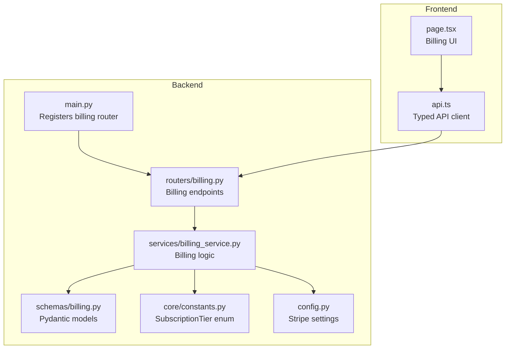
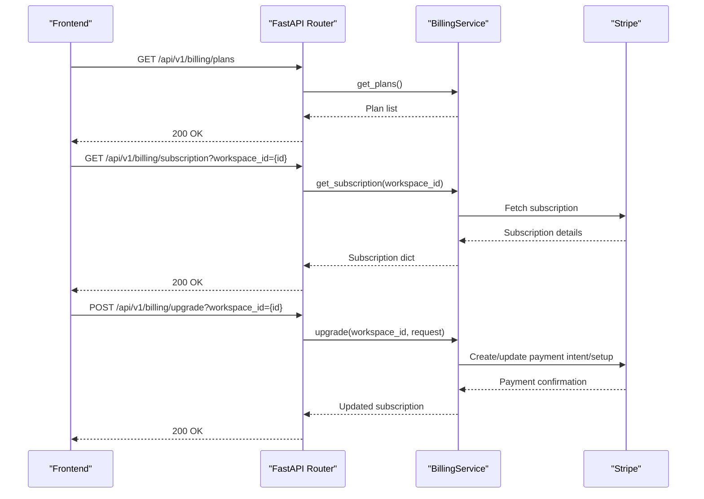
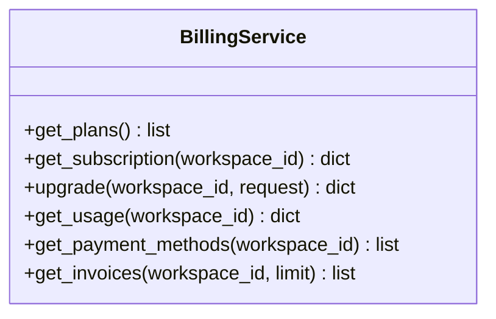
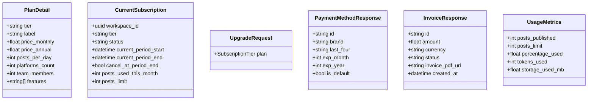
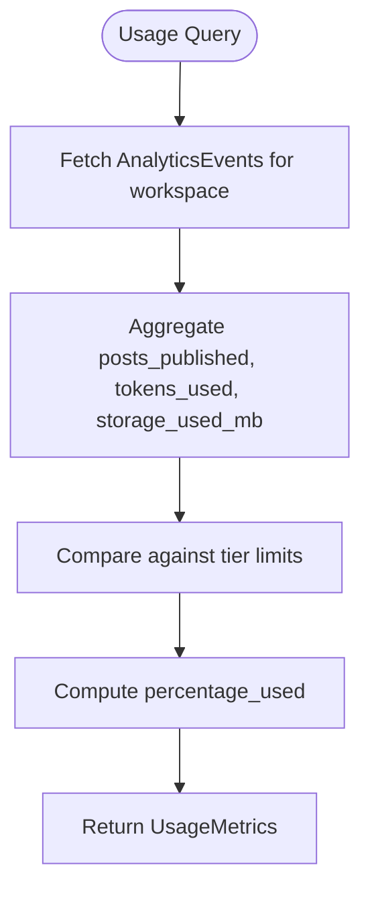
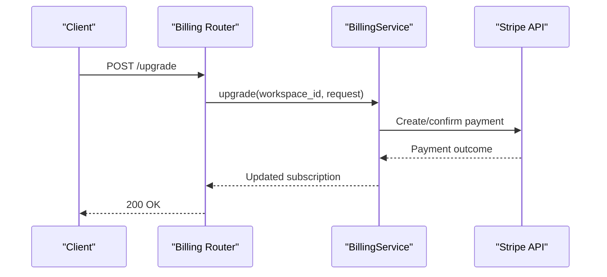
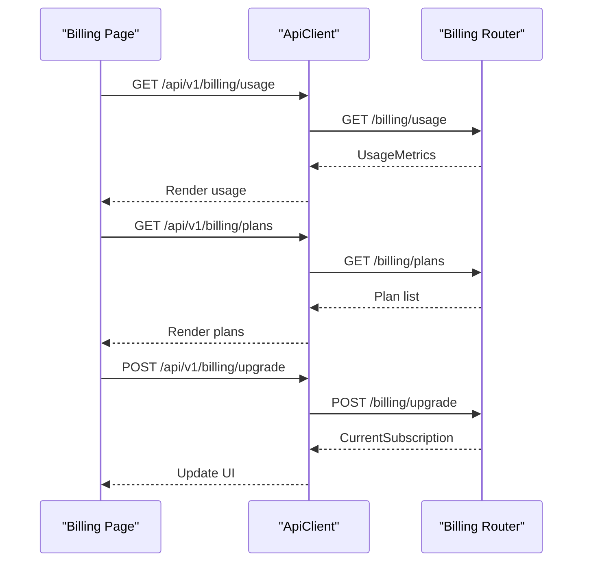
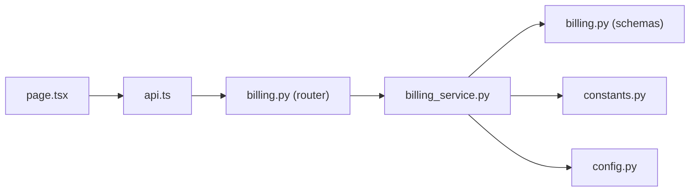

# Billing & Subscription API

<cite>
**Referenced Files in This Document**
- [billing.py](file://backend/app/routers/billing.py)
- [billing_service.py](file://backend/app/services/billing_service.py)
- [billing.py](file://backend/app/schemas/billing.py)
- [constants.py](file://backend/app/core/constants.py)
- [config.py](file://backend/app/config.py)
- [main.py](file://backend/app/main.py)
- [page.tsx](file://frontend/src/app/(dashboard)/settings/billing/page.tsx)
- [api.ts](file://frontend/src/lib/api.ts)
- [analytics.py](file://backend/app/schemas/analytics.py)
- [analytics.py](file://backend/app/models/analytics.py)
- [analytics_repository.py](file://backend/app/repositories/analytics_repository.py)
- [analytics_service.py](file://backend/app/services/analytics_service.py)
</cite>

## Table of Contents
1. [Introduction](#introduction)
2. [Project Structure](#project-structure)
3. [Core Components](#core-components)
4. [Architecture Overview](#architecture-overview)
5. [Detailed Component Analysis](#detailed-component-analysis)
6. [Dependency Analysis](#dependency-analysis)
7. [Performance Considerations](#performance-considerations)
8. [Troubleshooting Guide](#troubleshooting-guide)
9. [Conclusion](#conclusion)
10. [Appendices](#appendices)

## Introduction
This document provides comprehensive API documentation for Socialium's billing and subscription system. It covers subscription management, payment processing, usage tracking, and billing cycle management. It also documents schemas for subscription plans, payment methods, invoicing, and usage analytics. Integration with Stripe for payment handling is described conceptually, along with practical examples for subscription upgrades/downgrades, payment processing workflows, usage-based billing, and frontend integration.

## Project Structure
The billing system is implemented as a FastAPI router with associated schemas and a service layer. The backend exposes endpoints under `/api/v1/billing`, while the frontend provides a billing settings page and typed API client.

**Diagram sources**
- [main.py](file://backend/app/main.py#L76-L76)
- [billing.py](file://backend/app/routers/billing.py#L1-L77)
- [billing_service.py](file://backend/app/services/billing_service.py#L1-L80)
- [billing.py](file://backend/app/schemas/billing.py#L1-L79)
- [constants.py](file://backend/app/core/constants.py#L32-L37)
- [config.py](file://backend/app/config.py#L62-L64)
- [page.tsx](file://frontend/src/app/(dashboard)/settings/billing/page.tsx#L1-L79)
- [api.ts](file://frontend/src/lib/api.ts#L1-L69)

**Section sources**
- [main.py](file://backend/app/main.py#L76-L76)
- [billing.py](file://backend/app/routers/billing.py#L1-L77)
- [billing_service.py](file://backend/app/services/billing_service.py#L1-L80)
- [billing.py](file://backend/app/schemas/billing.py#L1-L79)
- [constants.py](file://backend/app/core/constants.py#L32-L37)
- [config.py](file://backend/app/config.py#L62-L64)
- [page.tsx](file://frontend/src/app/(dashboard)/settings/billing/page.tsx#L1-L79)
- [api.ts](file://frontend/src/lib/api.ts#L1-L69)

## Core Components
- Billing Router: Exposes endpoints for plans, subscription details, upgrades, usage metrics, payment methods, and invoices.
- Billing Service: Orchestrates subscription management, payment processing, and usage tracking. Currently stubbed for Stripe integrations.
- Pydantic Schemas: Define request/response models for plans, subscriptions, usage metrics, payment methods, and invoices.
- Constants: Provides SubscriptionTier enum and tier limits used for plan definitions.
- Configuration: Holds Stripe secrets and webhook secret for payment handling.
- Frontend: Provides a billing settings page and a typed API client for consuming the billing endpoints.

Key capabilities:
- Retrieve available subscription plans with pricing and feature sets.
- Get and update subscription status for a workspace.
- Fetch usage metrics for billing and capacity planning.
- Manage saved payment methods and invoices.

**Section sources**
- [billing.py](file://backend/app/routers/billing.py#L20-L76)
- [billing_service.py](file://backend/app/services/billing_service.py#L14-L79)
- [billing.py](file://backend/app/schemas/billing.py#L11-L79)
- [constants.py](file://backend/app/core/constants.py#L32-L76)
- [config.py](file://backend/app/config.py#L62-L64)

## Architecture Overview
The billing API follows a layered architecture:
- Router layer handles HTTP requests and delegates to the service layer.
- Service layer encapsulates business logic and integrates with external systems (Stripe).
- Schema layer validates and serializes data.
- Configuration layer supplies Stripe credentials and environment settings.
- Frontend consumes endpoints via a typed API client.

**Diagram sources**
- [billing.py](file://backend/app/routers/billing.py#L20-L45)
- [billing_service.py](file://backend/app/services/billing_service.py#L14-L79)
- [config.py](file://backend/app/config.py#L62-L64)

## Detailed Component Analysis

### Billing Router Endpoints
Endpoints exposed under `/api/v1/billing`:
- GET /plans: Returns available subscription plans.
- GET /subscription: Returns current subscription details for a workspace.
- POST /upgrade: Upgrades or changes subscription plan.
- GET /usage: Returns usage metrics for billing.
- GET /payment-methods: Lists saved payment methods.
- GET /invoices: Retrieves invoices with optional limit.

Implementation highlights:
- Uses SQLAlchemy async sessions for database-backed operations.
- Delegates business logic to BillingService.
- Responses are strongly typed via Pydantic models.

**Section sources**
- [billing.py](file://backend/app/routers/billing.py#L20-L76)

### Billing Service Layer
Responsibilities:
- Provide plan catalog.
- Retrieve and update subscription state via Stripe.
- Compute usage metrics.
- Manage payment methods and invoices via Stripe.

Notable behaviors:
- Methods raise NotImplementedError for Stripe-dependent operations, indicating pending implementation.
- Accepts optional AsyncSession for potential persistence needs.

**Diagram sources**
- [billing_service.py](file://backend/app/services/billing_service.py#L8-L79)

**Section sources**
- [billing_service.py](file://backend/app/services/billing_service.py#L14-L79)

### Pydantic Schemas
Models define request/response contracts:
- PlanDetail: Plan metadata including pricing and feature set.
- CurrentSubscription: Active subscription state and limits.
- UpgradeRequest: Target plan selection.
- PaymentMethodResponse: Saved payment method details.
- InvoiceResponse: Invoice metadata and PDF link.
- UsageMetrics: Usage indicators for billing calculations.

**Diagram sources**
- [billing.py](file://backend/app/schemas/billing.py#L11-L79)
- [constants.py](file://backend/app/core/constants.py#L32-L37)

**Section sources**
- [billing.py](file://backend/app/schemas/billing.py#L11-L79)
- [constants.py](file://backend/app/core/constants.py#L32-L37)

### Subscription Plans Catalog
The service returns a static catalog of plans with monthly and annual pricing, feature lists, and capacity limits. These align with SubscriptionTier enum values.

Integration note:
- The catalog is currently static; future implementation will sync with Stripe products and prices.

**Section sources**
- [billing_service.py](file://backend/app/services/billing_service.py#L14-L59)
- [constants.py](file://backend/app/core/constants.py#L32-L37)

### Usage Tracking and Analytics
Usage metrics for billing include:
- Posts published and limits.
- Percentage used.
- Tokens used and storage consumed.

Analytics models and repository/service indicate broader analytics capabilities:
- AnalyticsEvent model captures engagement metrics per post and platform.
- AnalyticsService and repository define methods for trends, top posts, and recommendations.

**Diagram sources**
- [analytics.py](file://backend/app/models/analytics.py#L14-L49)
- [analytics.py](file://backend/app/schemas/analytics.py#L9-L77)
- [analytics_repository.py](file://backend/app/repositories/analytics_repository.py#L6-L14)
- [analytics_service.py](file://backend/app/services/analytics_service.py#L6-L60)

**Section sources**
- [billing.py](file://backend/app/schemas/billing.py#L71-L79)
- [analytics.py](file://backend/app/models/analytics.py#L14-L49)
- [analytics.py](file://backend/app/schemas/analytics.py#L9-L77)
- [analytics_repository.py](file://backend/app/repositories/analytics_repository.py#L6-L14)
- [analytics_service.py](file://backend/app/services/analytics_service.py#L6-L60)

### Payment Processing and Stripe Integration
Configuration:
- Stripe secret key and webhook secret are configured via environment settings.

Conceptual flow:
- Upgrade endpoint triggers Stripe payment intent or subscription modification.
- Payment methods are retrieved from Stripe customer data.
- Invoices are fetched from Stripe invoice records.

**Diagram sources**
- [billing.py](file://backend/app/routers/billing.py#L37-L45)
- [billing_service.py](file://backend/app/services/billing_service.py#L65-L67)
- [config.py](file://backend/app/config.py#L62-L64)

**Section sources**
- [config.py](file://backend/app/config.py#L62-L64)
- [billing.py](file://backend/app/routers/billing.py#L37-L45)
- [billing_service.py](file://backend/app/services/billing_service.py#L65-L79)

### Frontend Integration
The billing settings page displays:
- Current usage progress and limits.
- Plan cards with upgrade actions.
- Saved payment method display.

The typed API client supports GET/POST/PUT/PATCH/DELETE with automatic JSON serialization and error handling.

**Diagram sources**
- [page.tsx](file://frontend/src/app/(dashboard)/settings/billing/page.tsx#L15-L78)
- [api.ts](file://frontend/src/lib/api.ts#L20-L65)
- [billing.py](file://backend/app/routers/billing.py#L20-L45)

**Section sources**
- [page.tsx](file://frontend/src/app/(dashboard)/settings/billing/page.tsx#L15-L78)
- [api.ts](file://frontend/src/lib/api.ts#L1-L69)
- [billing.py](file://backend/app/routers/billing.py#L20-L45)

## Dependency Analysis
- Router depends on BillingService and schemas for request/response validation.
- BillingService depends on constants for plan tiers and configuration for Stripe keys.
- Frontend depends on typed API client and router endpoints.

**Diagram sources**
- [page.tsx](file://frontend/src/app/(dashboard)/settings/billing/page.tsx#L1-L79)
- [api.ts](file://frontend/src/lib/api.ts#L1-L69)
- [billing.py](file://backend/app/routers/billing.py#L1-L77)
- [billing_service.py](file://backend/app/services/billing_service.py#L1-L80)
- [billing.py](file://backend/app/schemas/billing.py#L1-L79)
- [constants.py](file://backend/app/core/constants.py#L32-L37)
- [config.py](file://backend/app/config.py#L62-L64)

**Section sources**
- [billing.py](file://backend/app/routers/billing.py#L1-L77)
- [billing_service.py](file://backend/app/services/billing_service.py#L1-L80)
- [billing.py](file://backend/app/schemas/billing.py#L1-L79)
- [constants.py](file://backend/app/core/constants.py#L32-L37)
- [config.py](file://backend/app/config.py#L62-L64)
- [page.tsx](file://frontend/src/app/(dashboard)/settings/billing/page.tsx#L1-L79)
- [api.ts](file://frontend/src/lib/api.ts#L1-L69)

## Performance Considerations
- Use pagination for invoice retrieval via the limit parameter.
- Cache plan catalogs on the client to reduce network calls.
- Batch usage queries by workspace and time windows to minimize database load.
- Offload heavy analytics computations to background workers if needed.

## Troubleshooting Guide
Common issues and resolutions:
- Missing Stripe credentials: Ensure stripe_secret_key and stripe_webhook_secret are set in environment configuration.
- Endpoint not found: Verify the billing router is included under /api/v1/billing.
- Authentication errors: Confirm frontend API client includes required headers and tokens.
- NotImplementedError for billing operations: Implement Stripe integration in BillingService methods.

Operational checks:
- Health endpoint confirms application status.
- CORS configuration allows frontend origin.

**Section sources**
- [config.py](file://backend/app/config.py#L62-L64)
- [main.py](file://backend/app/main.py#L76-L76)
- [billing_service.py](file://backend/app/services/billing_service.py#L61-L79)
- [api.ts](file://frontend/src/lib/api.ts#L38-L44)

## Conclusion
The billing and subscription API provides a solid foundation for managing plans, usage, and payments. While Stripe integration is currently stubbed, the architecture cleanly separates concerns and offers clear extension points. The frontend integrates seamlessly via a typed API client, enabling a responsive billing experience.

## Appendices

### API Reference

- GET /api/v1/billing/plans
  - Description: Retrieve available subscription plans.
  - Response: Array of PlanDetail.

- GET /api/v1/billing/subscription?workspace_id={id}
  - Description: Get current subscription details for a workspace.
  - Response: CurrentSubscription.

- POST /api/v1/billing/upgrade?workspace_id={id}
  - Description: Upgrade or change subscription plan.
  - Request: UpgradeRequest.
  - Response: CurrentSubscription.

- GET /api/v1/billing/usage?workspace_id={id}
  - Description: Get current usage metrics.
  - Response: UsageMetrics.

- GET /api/v1/billing/payment-methods?workspace_id={id}
  - Description: List saved payment methods.
  - Response: Array of PaymentMethodResponse.

- GET /api/v1/billing/invoices?workspace_id={id}&limit={n}
  - Description: Retrieve invoices with optional limit.
  - Response: Array of InvoiceResponse.

**Section sources**
- [billing.py](file://backend/app/routers/billing.py#L20-L76)
- [billing.py](file://backend/app/schemas/billing.py#L11-L79)

### Example Workflows

- Subscription Upgrade
  - Client sends UpgradeRequest with target plan.
  - Server invokes BillingService.upgrade and returns updated subscription.

- Payment Processing
  - Client initiates upgrade; server creates/updates Stripe payment intent.
  - On confirmation, server returns updated subscription.

- Usage-Based Billing
  - Client queries /usage to compute percentage_used against tier limits.
  - AnalyticsService can provide deeper insights for recommendations.

**Section sources**
- [billing.py](file://backend/app/routers/billing.py#L37-L45)
- [billing_service.py](file://backend/app/services/billing_service.py#L65-L71)
- [analytics_service.py](file://backend/app/services/analytics_service.py#L16-L22)