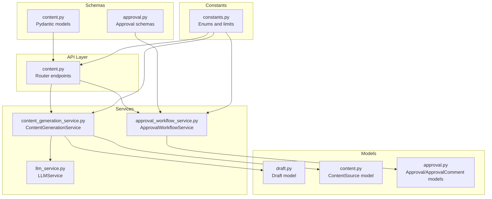
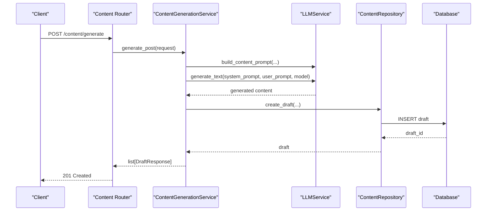
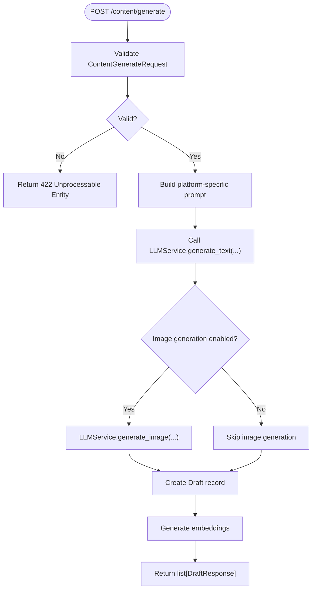
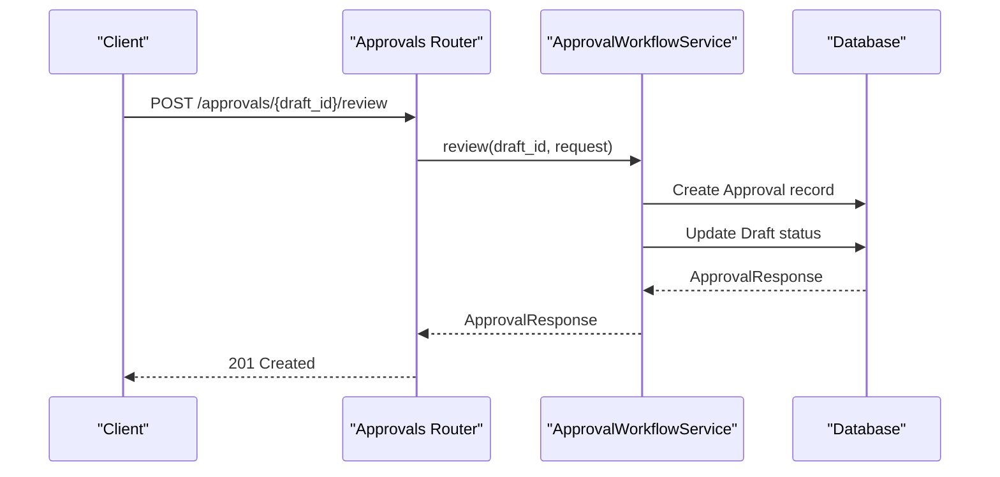
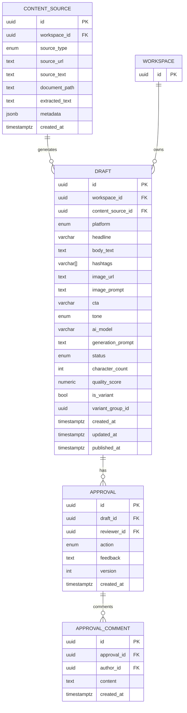
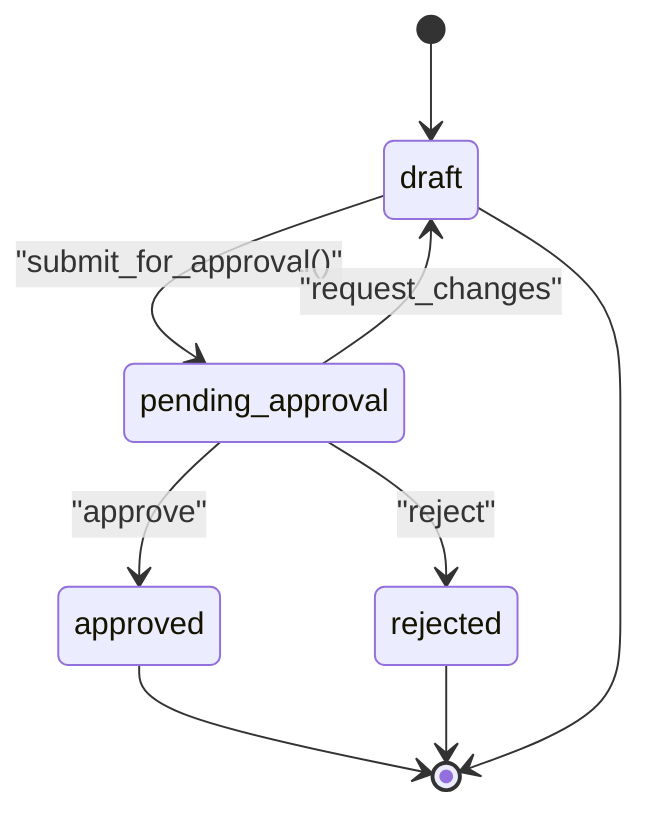
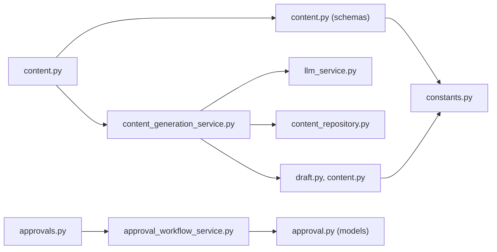

# Content Management API

<cite>
**Referenced Files in This Document**
- [content.py](file://backend/app/routers/content.py)
- [content.py](file://backend/app/schemas/content.py)
- [content_generation_service.py](file://backend/app/services/content_generation_service.py)
- [constants.py](file://backend/app/core/constants.py)
- [draft.py](file://backend/app/models/draft.py)
- [content.py](file://backend/app/models/content.py)
- [content_repository.py](file://backend/app/repositories/content_repository.py)
- [approvals.py](file://backend/app/routers/approvals.py)
- [approval.py](file://backend/app/schemas/approval.py)
- [approval.py](file://backend/app/models/approval.py)
- [approval_workflow_service.py](file://backend/app/services/approval_workflow_service.py)
- [llm_service.py](file://backend/app/services/llm_service.py)
- [exceptions.py](file://backend/app/core/exceptions.py)
</cite>

## Table of Contents
1. [Introduction](#introduction)
2. [Project Structure](#project-structure)
3. [Core Components](#core-components)
4. [Architecture Overview](#architecture-overview)
5. [Detailed Component Analysis](#detailed-component-analysis)
6. [Dependency Analysis](#dependency-analysis)
7. [Performance Considerations](#performance-considerations)
8. [Troubleshooting Guide](#troubleshooting-guide)
9. [Conclusion](#conclusion)

## Introduction
This document provides comprehensive API documentation for Socialium’s content management endpoints. It covers content generation, draft management, content optimization, and variant creation. It also documents request and response schemas for AI content generation, content templates, brand voice settings, and content approval workflows. Examples illustrate content creation requests, platform-specific formatting, content variants, and integration with the approval system. Error handling for AI service failures and content validation errors is included.

## Project Structure
The content management API is implemented as a FastAPI router with Pydantic schemas and a service layer. Supporting components include constants for platform and status enums, database models for drafts and content sources, and an approval workflow subsystem.

**Diagram sources**
- [content.py](file://backend/app/routers/content.py#L1-L94)
- [content.py](file://backend/app/schemas/content.py#L1-L82)
- [content_generation_service.py](file://backend/app/services/content_generation_service.py#L1-L98)
- [constants.py](file://backend/app/core/constants.py#L1-L85)
- [draft.py](file://backend/app/models/draft.py#L1-L71)
- [content.py](file://backend/app/models/content.py#L1-L42)
- [approval_workflow_service.py](file://backend/app/services/approval_workflow_service.py#L1-L48)
- [approval.py](file://backend/app/schemas/approval.py#L1-L69)
- [approval.py](file://backend/app/models/approval.py#L1-L69)
- [llm_service.py](file://backend/app/services/llm_service.py#L1-L73)

**Section sources**
- [content.py](file://backend/app/routers/content.py#L1-L94)
- [content.py](file://backend/app/schemas/content.py#L1-L82)
- [content_generation_service.py](file://backend/app/services/content_generation_service.py#L1-L98)
- [constants.py](file://backend/app/core/constants.py#L1-L85)
- [draft.py](file://backend/app/models/draft.py#L1-L71)
- [content.py](file://backend/app/models/content.py#L1-L42)
- [approval_workflow_service.py](file://backend/app/services/approval_workflow_service.py#L1-L48)
- [approval.py](file://backend/app/schemas/approval.py#L1-L69)
- [approval.py](file://backend/app/models/approval.py#L1-L69)
- [llm_service.py](file://backend/app/services/llm_service.py#L1-L73)

## Core Components
- Content Generation Router: Exposes endpoints for generating content, creating variants, and managing drafts.
- Content Generation Service: Orchestrates AI content generation, variant creation, and draft lifecycle operations.
- Approval Workflow Router and Service: Manages approval requests, comments, and state transitions.
- LLM Service: Provides unified interface to OpenAI and Anthropic APIs with prompt engineering.
- Pydantic Schemas: Define request/response contracts for content generation, variants, and approvals.
- Database Models: Represent drafts, content sources, and approval/comment records.

Key responsibilities:
- Generate platform-specific content using AI with brand voice and formatting constraints.
- Create A/B variants of existing drafts.
- Manage draft lifecycle (create, update, status change, delete).
- Integrate with approval workflows for human-in-the-loop review.
- Enforce platform-specific limits and content validation.

**Section sources**
- [content.py](file://backend/app/routers/content.py#L1-L94)
- [content.py](file://backend/app/schemas/content.py#L1-L82)
- [content_generation_service.py](file://backend/app/services/content_generation_service.py#L1-L98)
- [approvals.py](file://backend/app/routers/approvals.py#L1-L61)
- [approval_workflow_service.py](file://backend/app/services/approval_workflow_service.py#L1-L48)
- [llm_service.py](file://backend/app/services/llm_service.py#L1-L73)

## Architecture Overview
The content management API follows a layered architecture:
- Router layer validates requests and delegates to services.
- Service layer encapsulates business logic and coordinates external integrations.
- Schema layer enforces data contracts and validation.
- Model layer persists data and maintains relationships.
- Constants layer centralizes enums and platform limits.

**Diagram sources**
- [content.py](file://backend/app/routers/content.py#L20-L27)
- [content_generation_service.py](file://backend/app/services/content_generation_service.py#L23-L40)
- [llm_service.py](file://backend/app/services/llm_service.py#L49-L64)
- [content_repository.py](file://backend/app/repositories/content_repository.py#L14-L15)
- [draft.py](file://backend/app/models/draft.py#L15-L71)

## Detailed Component Analysis

### Content Generation Endpoints
- POST /content/generate
  - Purpose: Generate content for selected platforms using AI.
  - Request: ContentGenerateRequest
  - Response: list[DraftResponse]
  - Status: 201 Created
  - Notes: Creates one draft per platform with platform-specific formatting and optional image generation.

- POST /content/variants
  - Purpose: Generate A/B variants of an existing draft.
  - Request: ContentVariantRequest
  - Response: list[DraftResponse]
  - Status: 201 Created
  - Notes: Produces multiple variants with different hooks/CTAs while preserving original context.

- GET /content/drafts
  - Purpose: List drafts with optional filtering and pagination.
  - Query params: workspace_id, status, platform, page, page_size
  - Response: DraftListResponse

- GET /content/drafts/{draft_id}
  - Purpose: Retrieve a single draft by ID.
  - Response: DraftResponse

- PUT /content/drafts/{draft_id}
  - Purpose: Update an existing draft’s content (human edits before approval).
  - Request: DraftUpdateRequest
  - Response: DraftResponse

- PATCH /content/drafts/{draft_id}/status
  - Purpose: Update the status of a draft (e.g., draft → pending_approval).
  - Request: DraftStatusUpdateRequest
  - Response: DraftResponse

- DELETE /content/drafts/{draft_id}
  - Purpose: Permanently delete a draft.
  - Status: 204 No Content

**Diagram sources**
- [content.py](file://backend/app/routers/content.py#L20-L27)
- [content.py](file://backend/app/schemas/content.py#L12-L24)
- [content_generation_service.py](file://backend/app/services/content_generation_service.py#L23-L40)
- [llm_service.py](file://backend/app/services/llm_service.py#L21-L37)

**Section sources**
- [content.py](file://backend/app/routers/content.py#L20-L94)
- [content.py](file://backend/app/schemas/content.py#L12-L82)
- [content_generation_service.py](file://backend/app/services/content_generation_service.py#L23-L98)

### Approval Workflow Endpoints
- GET /approvals/pending
  - Purpose: List drafts pending approval in a workspace.
  - Query params: workspace_id, page, page_size
  - Response: ApprovalListResponse

- GET /approvals/history
  - Purpose: Get approval history for a draft.
  - Query params: draft_id
  - Response: list[ApprovalResponse]

- POST /approvals/{draft_id}/review
  - Purpose: Submit an approval action (approve/reject/request changes).
  - Request: ApprovalRequest
  - Response: ApprovalResponse
  - Status: 201 Created

- POST /approvals/{approval_id}/comments
  - Purpose: Add a comment to an approval.
  - Request: ApprovalCommentRequest
  - Response: ApprovalCommentResponse
  - Status: 201 Created

**Diagram sources**
- [approvals.py](file://backend/app/routers/approvals.py#L41-L49)
- [approval_workflow_service.py](file://backend/app/services/approval_workflow_service.py#L25-L39)
- [approval.py](file://backend/app/models/approval.py#L14-L43)
- [draft.py](file://backend/app/models/draft.py#L15-L71)

**Section sources**
- [approvals.py](file://backend/app/routers/approvals.py#L1-L61)
- [approval.py](file://backend/app/schemas/approval.py#L11-L69)
- [approval_workflow_service.py](file://backend/app/services/approval_workflow_service.py#L1-L48)
- [approval.py](file://backend/app/models/approval.py#L1-L69)
- [draft.py](file://backend/app/models/draft.py#L1-L71)

### Data Models and Relationships

**Diagram sources**
- [content.py](file://backend/app/models/content.py#L14-L42)
- [draft.py](file://backend/app/models/draft.py#L15-L71)
- [approval.py](file://backend/app/models/approval.py#L14-L69)

**Section sources**
- [content.py](file://backend/app/models/content.py#L1-L42)
- [draft.py](file://backend/app/models/draft.py#L1-L71)
- [approval.py](file://backend/app/models/approval.py#L1-L69)

### Request and Response Schemas

#### Content Generation Request
- ContentGenerateRequest
  - Fields: source_text, platforms, tone, creativity, length, include_hashtags, include_emojis, ai_model, workspace_id
  - Constraints: source_text min/max length, platforms non-empty, creativity 0–1, length in predefined set, workspace_id required

#### Content Variant Request
- ContentVariantRequest
  - Fields: draft_id, count (default 2, min 1, max 5)

#### Draft Response
- DraftResponse
  - Fields: id, workspace_id, platform, headline, body_text, hashtags, image_url, image_prompt, cta, tone, ai_model, status, character_count, quality_score, is_variant, variant_group_id, created_at, updated_at, published_at

#### Draft List Response
- DraftListResponse
  - Fields: items (list of DraftResponse), total, page, page_size

#### Draft Update Request
- DraftUpdateRequest
  - Fields: headline, body_text, hashtags, cta, tone

#### Draft Status Update Request
- DraftStatusUpdateRequest
  - Fields: status (values from ContentStatus)

#### Approval Request
- ApprovalRequest
  - Fields: action (from ApprovalAction), feedback (optional, max length 2000)

#### Approval Comment Request
- ApprovalCommentRequest
  - Fields: content (min length 1, max length 1000)

**Section sources**
- [content.py](file://backend/app/schemas/content.py#L12-L82)
- [approval.py](file://backend/app/schemas/approval.py#L11-L69)
- [constants.py](file://backend/app/core/constants.py#L14-L30)

### Platform-Specific Formatting and Brand Voice
- Platform limits: Character limits, max images, and max hashtags vary by platform.
- Brand voice: Integrated via MemoryService in the generation pipeline; prompts incorporate brand voice for consistency.
- Tone presets: Professional, casual, funny, inspirational, educational, persuasive.
- AI models: Configured providers and labels for OpenAI and Anthropic.

**Section sources**
- [constants.py](file://backend/app/core/constants.py#L63-L85)
- [content_generation_service.py](file://backend/app/services/content_generation_service.py#L23-L40)
- [llm_service.py](file://backend/app/services/llm_service.py#L49-L64)

### Content Optimization Endpoint
- POST /content/optimize/{draft_id}
  - Purpose: Run AI optimization on an existing draft to improve quality score.
  - Steps: Analyze draft against brand voice and platform best practices, generate improvement suggestions, apply optimizations, return updated draft with quality_score.
  - Notes: Implemented in ContentGenerationService.optimize_content.

**Section sources**
- [content_generation_service.py](file://backend/app/services/content_generation_service.py#L88-L98)

### Approval Workflow State Machine
- States: draft → pending_approval → approved | rejected | changes_requested
- Actions: approve, reject, request_changes
- Comments: Append comments to approvals for collaborative review.

**Diagram sources**
- [approval_workflow_service.py](file://backend/app/services/approval_workflow_service.py#L25-L39)
- [constants.py](file://backend/app/core/constants.py#L14-L22)

**Section sources**
- [approval_workflow_service.py](file://backend/app/services/approval_workflow_service.py#L1-L48)
- [constants.py](file://backend/app/core/constants.py#L14-L30)

## Dependency Analysis
- Router depends on schemas and services.
- Service orchestrates LLMService, MemoryService, and ContentRepository.
- Models define relationships and constraints enforced by the database.
- Constants centralize enums and limits used across schemas and services.

**Diagram sources**
- [content.py](file://backend/app/routers/content.py#L1-L94)
- [content.py](file://backend/app/schemas/content.py#L1-L82)
- [content_generation_service.py](file://backend/app/services/content_generation_service.py#L1-L98)
- [llm_service.py](file://backend/app/services/llm_service.py#L1-L73)
- [content_repository.py](file://backend/app/repositories/content_repository.py#L1-L31)
- [draft.py](file://backend/app/models/draft.py#L1-L71)
- [content.py](file://backend/app/models/content.py#L1-L42)
- [constants.py](file://backend/app/core/constants.py#L1-L85)
- [approvals.py](file://backend/app/routers/approvals.py#L1-L61)
- [approval_workflow_service.py](file://backend/app/services/approval_workflow_service.py#L1-L48)
- [approval.py](file://backend/app/models/approval.py#L1-L69)

**Section sources**
- [content.py](file://backend/app/routers/content.py#L1-L94)
- [content_generation_service.py](file://backend/app/services/content_generation_service.py#L1-L98)
- [constants.py](file://backend/app/core/constants.py#L1-L85)
- [draft.py](file://backend/app/models/draft.py#L1-L71)
- [content.py](file://backend/app/models/content.py#L1-L42)
- [approvals.py](file://backend/app/routers/approvals.py#L1-L61)
- [approval_workflow_service.py](file://backend/app/services/approval_workflow_service.py#L1-L48)
- [approval.py](file://backend/app/models/approval.py#L1-L69)
- [llm_service.py](file://backend/app/services/llm_service.py#L1-L73)
- [content_repository.py](file://backend/app/repositories/content_repository.py#L1-L31)

## Performance Considerations
- Batch generation: Generate one draft per platform concurrently to reduce latency.
- Prompt caching: Reuse brand voice and platform-specific prompts to minimize token usage.
- Pagination: Use page/page_size for listing drafts to avoid large payloads.
- Embeddings: Generate embeddings asynchronously after draft creation.
- Rate limiting: Respect platform limits and subscription tier caps.

## Troubleshooting Guide
Common errors and resolutions:
- Validation errors (422): Ensure request fields meet schema constraints (length limits, enums, required fields).
- Not found (404): Verify resource IDs exist before retrieving or updating.
- External service errors (502): Retry with exponential backoff when AI provider is unavailable.
- Rate limit exceeded (429): Throttle requests according to tier limits.

Error handling:
- Custom exceptions: SocialiumException, ValidationException, NotFoundException, ExternalServiceException, RateLimitException.
- Handlers: Register exception handlers to return structured JSON with error messages and status codes.

**Section sources**
- [exceptions.py](file://backend/app/core/exceptions.py#L7-L90)

## Conclusion
Socialium’s content management API provides a robust foundation for AI-powered content creation, variant experimentation, and collaborative approval workflows. By leveraging platform-specific constraints, brand voice integration, and a clear approval state machine, teams can efficiently produce high-quality, on-brand content across multiple channels.