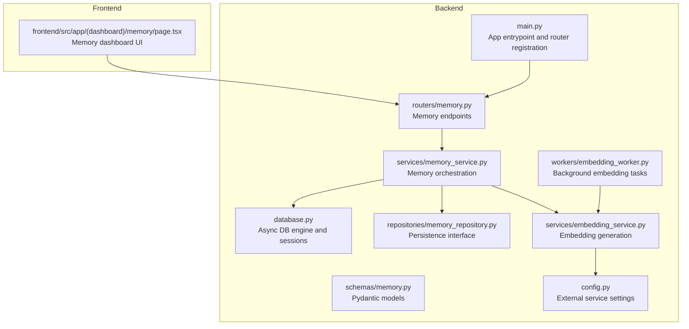
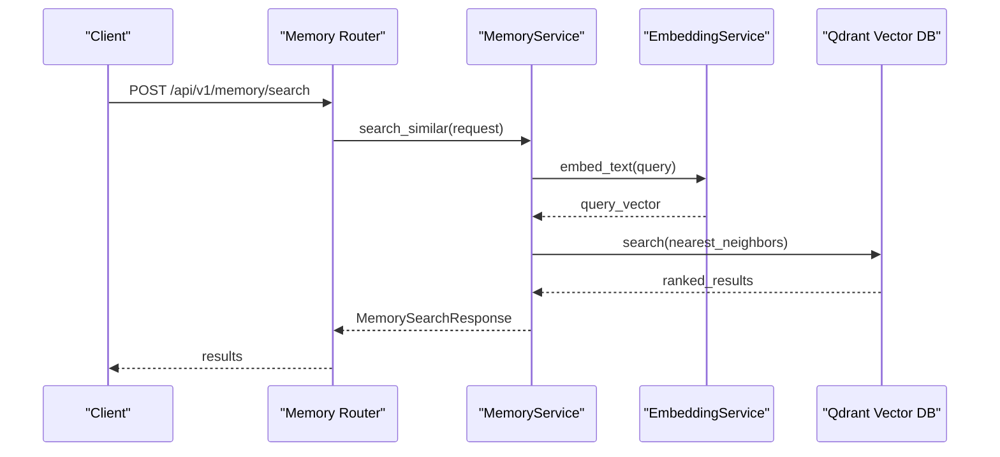
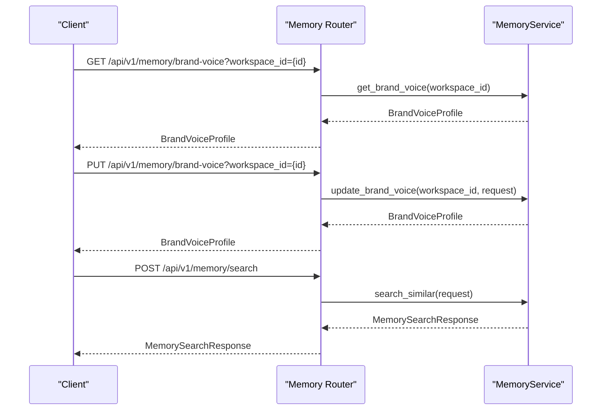
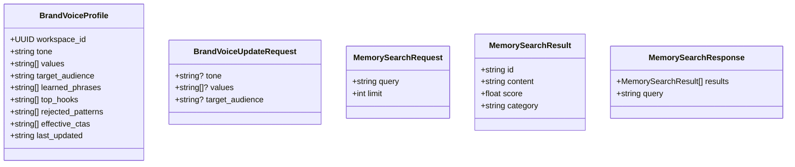
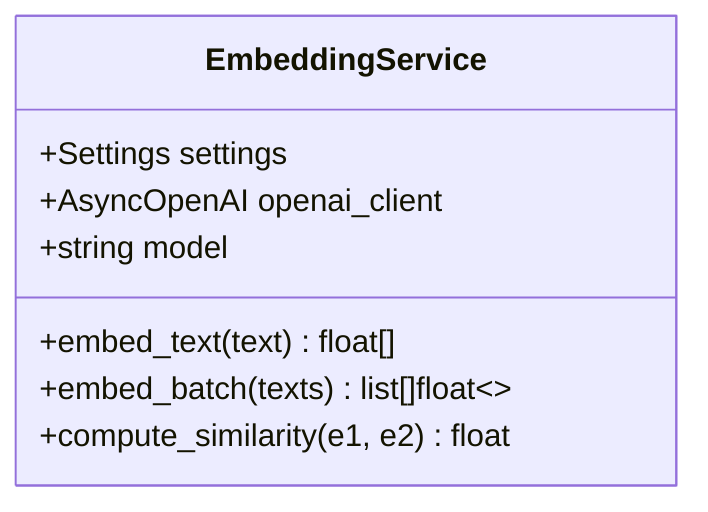
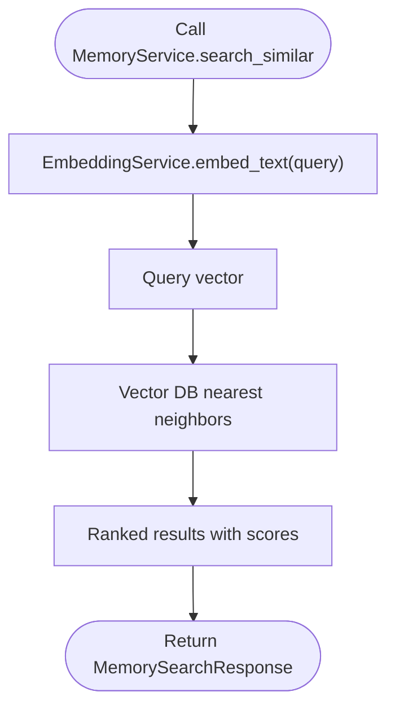
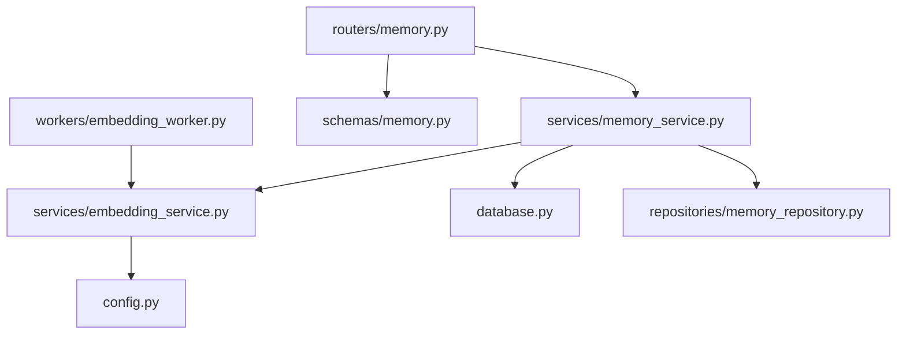

# Memory & Vector API

<cite>
**Referenced Files in This Document**
- [main.py](file://backend/app/main.py)
- [memory.py](file://backend/app/routers/memory.py)
- [memory.py](file://backend/app/schemas/memory.py)
- [memory_service.py](file://backend/app/services/memory_service.py)
- [memory_repository.py](file://backend/app/repositories/memory_repository.py)
- [embedding_service.py](file://backend/app/services/embedding_service.py)
- [embedding_worker.py](file://backend/app/workers/embedding_worker.py)
- [config.py](file://backend/app/config.py)
- [database.py](file://backend/app/database.py)
- [content.py](file://backend/app/schemas/content.py)
- [content_generation_service.py](file://backend/app/services/content_generation_service.py)
- [page.tsx](file://frontend/src/app/(dashboard)/memory/page.tsx)
</cite>

## Table of Contents
1. [Introduction](#introduction)
2. [Project Structure](#project-structure)
3. [Core Components](#core-components)
4. [Architecture Overview](#architecture-overview)
5. [Detailed Component Analysis](#detailed-component-analysis)
6. [Dependency Analysis](#dependency-analysis)
7. [Performance Considerations](#performance-considerations)
8. [Troubleshooting Guide](#troubleshooting-guide)
9. [Conclusion](#conclusion)
10. [Appendices](#appendices)

## Introduction
This document provides comprehensive API documentation for Socialium’s memory and vector storage endpoints. It covers vector embedding operations, semantic search capabilities, brand voice learning, and memory management. It also documents schemas for vector storage, similarity search, memory indexing, and content categorization. Finally, it includes practical examples of semantic search queries, vector embedding creation, memory optimization, and integration with content generation workflows.

## Project Structure
The memory and vector functionality is implemented as part of the backend FastAPI application. Key components include:
- Router exposing memory endpoints
- Pydantic schemas defining request/response contracts
- Services orchestrating embedding generation and semantic search
- Workers for background embedding tasks
- Configuration for external services (OpenAI, Qdrant)
- Database session management and base models

**Diagram sources**
- [main.py](file://backend/app/main.py#L57-L76)
- [memory.py](file://backend/app/routers/memory.py#L1-L47)
- [memory.py](file://backend/app/schemas/memory.py#L1-L51)
- [memory_service.py](file://backend/app/services/memory_service.py#L1-L66)
- [memory_repository.py](file://backend/app/repositories/memory_repository.py#L1-L13)
- [embedding_service.py](file://backend/app/services/embedding_service.py#L1-L47)
- [embedding_worker.py](file://backend/app/workers/embedding_worker.py#L1-L7)
- [config.py](file://backend/app/config.py#L1-L83)
- [database.py](file://backend/app/database.py#L1-L43)
- [page.tsx](file://frontend/src/app/(dashboard)/memory/page.tsx#L1-L40)

**Section sources**
- [main.py](file://backend/app/main.py#L57-L76)
- [memory.py](file://backend/app/routers/memory.py#L1-L47)
- [memory.py](file://backend/app/schemas/memory.py#L1-L51)
- [memory_service.py](file://backend/app/services/memory_service.py#L1-L66)
- [memory_repository.py](file://backend/app/repositories/memory_repository.py#L1-L13)
- [embedding_service.py](file://backend/app/services/embedding_service.py#L1-L47)
- [embedding_worker.py](file://backend/app/workers/embedding_worker.py#L1-L7)
- [config.py](file://backend/app/config.py#L1-L83)
- [database.py](file://backend/app/database.py#L1-L43)
- [page.tsx](file://frontend/src/app/(dashboard)/memory/page.tsx#L1-L40)

## Core Components
- Memory Router: Exposes GET /brand-voice, PUT /brand-voice, and POST /search endpoints.
- Memory Service: Orchestrates embedding generation, semantic search, brand voice retrieval/update, and learning from engagement.
- Embedding Service: Generates vectors using OpenAI text-embedding-3-large and computes similarities.
- Memory Repository: Defines persistence interface for brand voice and pattern storage.
- Configuration: Provides OpenAI and Qdrant settings used by embedding and memory services.
- Database Session Management: Async SQLAlchemy engine and session factory.

**Section sources**
- [memory.py](file://backend/app/routers/memory.py#L18-L46)
- [memory_service.py](file://backend/app/services/memory_service.py#L8-L66)
- [embedding_service.py](file://backend/app/services/embedding_service.py#L8-L47)
- [memory_repository.py](file://backend/app/repositories/memory_repository.py#L6-L13)
- [config.py](file://backend/app/config.py#L38-L51)
- [database.py](file://backend/app/database.py#L12-L43)

## Architecture Overview
The memory and vector architecture integrates FastAPI endpoints with asynchronous services and external systems:
- FastAPI routes delegate to MemoryService
- MemoryService uses EmbeddingService to generate vectors
- Qdrant is configured for vector storage and similarity search
- Background workers handle embedding tasks asynchronously
- Configuration centralizes API keys and service endpoints

**Diagram sources**
- [memory.py](file://backend/app/routers/memory.py#L39-L46)
- [memory_service.py](file://backend/app/services/memory_service.py#L29-L37)
- [embedding_service.py](file://backend/app/services/embedding_service.py#L20-L29)
- [config.py](file://backend/app/config.py#L47-L51)

## Detailed Component Analysis

### Memory Endpoints
- GET /api/v1/memory/brand-voice
  - Purpose: Retrieve the learned brand voice profile for a workspace.
  - Path parameters: workspace_id (string).
  - Response: BrandVoiceProfile.
- PUT /api/v1/memory/brand-voice
  - Purpose: Update brand voice settings.
  - Path parameters: workspace_id (string).
  - Request body: BrandVoiceUpdateRequest.
  - Response: BrandVoiceProfile.
- POST /api/v1/memory/search
  - Purpose: Search semantic memory for similar content patterns.
  - Request body: MemorySearchRequest.
  - Response: MemorySearchResponse.

**Diagram sources**
- [memory.py](file://backend/app/routers/memory.py#L18-L46)
- [memory_service.py](file://backend/app/services/memory_service.py#L39-L61)

**Section sources**
- [memory.py](file://backend/app/routers/memory.py#L18-L46)
- [memory.py](file://backend/app/schemas/memory.py#L8-L51)
- [memory_service.py](file://backend/app/services/memory_service.py#L8-L66)

### Memory Schemas
- BrandVoiceProfile
  - Fields: workspace_id (UUID), tone (string), values (list of strings), target_audience (string), learned_phrases (list of strings), top_hooks (list of strings), rejected_patterns (list of strings), effective_ctas (list of strings), last_updated (string).
- BrandVoiceUpdateRequest
  - Optional fields: tone (string), values (list of strings), target_audience (string).
- MemorySearchRequest
  - Required fields: query (string, min_length=3, max_length=500), limit (integer, default=10, range 1–50).
- MemorySearchResult
  - Fields: id (string), content (string), score (float), category (string).
- MemorySearchResponse
  - Fields: results (list of MemorySearchResult), query (string).

**Diagram sources**
- [memory.py](file://backend/app/schemas/memory.py#L8-L51)

**Section sources**
- [memory.py](file://backend/app/schemas/memory.py#L8-L51)

### Embedding Service
- embed_text(text: str) -> list[float]
  - Generates a vector embedding for a single text using OpenAI text-embedding-3-large.
- embed_batch(texts: list[str]) -> list[list[float]]
  - Efficiently generates embeddings for multiple texts in one call.
- compute_similarity(embedding1: list[float], embedding2: list[float]) -> float
  - Computes cosine similarity between two embeddings (0.0 to 1.0).

**Diagram sources**
- [embedding_service.py](file://backend/app/services/embedding_service.py#L8-L47)
- [config.py](file://backend/app/config.py#L38-L42)

**Section sources**
- [embedding_service.py](file://backend/app/services/embedding_service.py#L8-L47)
- [config.py](file://backend/app/config.py#L38-L42)

### Memory Service Operations
- store_embedding(content: str, metadata: dict) -> str
  - Generates embedding and stores/upserts into vector database; returns point ID.
- search_similar(request: MemorySearchRequest) -> dict
  - Embeds query and retrieves nearest neighbors from vector database.
- get_brand_voice(workspace_id: str) -> dict
  - Retrieves learned brand voice profile.
- update_brand_voice(workspace_id: str, request: BrandVoiceUpdateRequest) -> dict
  - Updates brand voice settings and propagates to generation pipeline.
- learn_from_post(draft_id: str, engagement_data: dict) -> None
  - Feeds engagement insights back into memory for continuous learning.
- get_trending_patterns(workspace_id: str) -> list
  - Identifies trending content patterns from recent successful posts.

**Diagram sources**
- [memory_service.py](file://backend/app/services/memory_service.py#L29-L37)
- [embedding_service.py](file://backend/app/services/embedding_service.py#L20-L29)

**Section sources**
- [memory_service.py](file://backend/app/services/memory_service.py#L19-L66)

### Memory Repository
Defines persistence interface methods for brand voice and pattern storage. These methods are currently placeholders and await implementation.

**Section sources**
- [memory_repository.py](file://backend/app/repositories/memory_repository.py#L6-L13)

### Background Embedding Worker
- run_embedding(content_id: str, text: str) -> None
  - Background task to generate and store embedding for content asynchronously.

**Section sources**
- [embedding_worker.py](file://backend/app/workers/embedding_worker.py#L4-L6)

### Integration with Content Generation
ContentGenerationService coordinates with MemoryService to incorporate brand voice and semantic memory during content creation. It also generates embeddings for semantic memory after content is produced.

**Section sources**
- [content_generation_service.py](file://backend/app/services/content_generation_service.py#L13-L40)
- [content.py](file://backend/app/schemas/content.py#L12-L24)

## Dependency Analysis
The memory and vector stack depends on:
- FastAPI routing and dependency injection
- Async database sessions
- External services (OpenAI, Qdrant)
- Pydantic schemas for validation

**Diagram sources**
- [memory.py](file://backend/app/routers/memory.py#L1-L47)
- [memory_service.py](file://backend/app/services/memory_service.py#L1-L66)
- [embedding_service.py](file://backend/app/services/embedding_service.py#L1-L47)
- [database.py](file://backend/app/database.py#L1-L43)
- [memory.py](file://backend/app/schemas/memory.py#L1-L51)
- [memory_repository.py](file://backend/app/repositories/memory_repository.py#L1-L13)
- [embedding_worker.py](file://backend/app/workers/embedding_worker.py#L1-L7)
- [config.py](file://backend/app/config.py#L1-L83)

**Section sources**
- [memory.py](file://backend/app/routers/memory.py#L1-L47)
- [memory_service.py](file://backend/app/services/memory_service.py#L1-L66)
- [embedding_service.py](file://backend/app/services/embedding_service.py#L1-L47)
- [database.py](file://backend/app/database.py#L1-L43)
- [memory.py](file://backend/app/schemas/memory.py#L1-L51)
- [memory_repository.py](file://backend/app/repositories/memory_repository.py#L1-L13)
- [embedding_worker.py](file://backend/app/workers/embedding_worker.py#L1-L7)
- [config.py](file://backend/app/config.py#L1-L83)

## Performance Considerations
- Batch embeddings: Prefer embed_batch for multiple texts to reduce API calls.
- Limit search results: Use the limit field in MemorySearchRequest to cap results.
- Asynchronous processing: Offload embedding generation to background workers.
- Vector DB tuning: Configure Qdrant collection and index parameters for optimal recall and latency.
- Caching: Cache frequent brand voice queries to reduce repeated computation.

## Troubleshooting Guide
- OpenAI API errors: Verify OPENAI_API_KEY and OPENAI_EMBEDDING_MODEL in configuration.
- Qdrant connectivity: Confirm QDRANT_URL, QDRANT_API_KEY, and QDRANT_COLLECTION_NAME.
- Database session issues: Ensure async database engine is initialized and sessions are properly managed.
- Validation errors: Ensure request bodies conform to schema constraints (min/max lengths, ranges).

**Section sources**
- [config.py](file://backend/app/config.py#L38-L51)
- [database.py](file://backend/app/database.py#L12-L43)
- [memory.py](file://backend/app/schemas/memory.py#L30-L35)

## Conclusion
The memory and vector subsystem provides a robust foundation for semantic search, brand voice learning, and content pattern recognition. By leveraging OpenAI embeddings and Qdrant, Socialium enables intelligent content discovery and generation workflows. The modular design allows for incremental implementation of vector storage and advanced learning features.

## Appendices

### API Definitions

- GET /api/v1/memory/brand-voice
  - Query parameters: workspace_id (string)
  - Response: BrandVoiceProfile
- PUT /api/v1/memory/brand-voice
  - Query parameters: workspace_id (string)
  - Request body: BrandVoiceUpdateRequest
  - Response: BrandVoiceProfile
- POST /api/v1/memory/search
  - Request body: MemorySearchRequest
  - Response: MemorySearchResponse

**Section sources**
- [memory.py](file://backend/app/routers/memory.py#L18-L46)
- [memory.py](file://backend/app/schemas/memory.py#L30-L51)

### Example Workflows

- Semantic search query
  - Use POST /api/v1/memory/search with a query string and limit.
  - The service embeds the query and returns ranked results with scores and categories.
- Vector embedding creation
  - Use EmbeddingService.embed_text or embed_batch to generate vectors.
  - Store embeddings via MemoryService.store_embedding for semantic search.
- Memory optimization
  - Limit search results using the limit parameter.
  - Use background workers to offload embedding tasks.
- Integration with content generation
  - Retrieve brand voice via GET /api/v1/memory/brand-voice.
  - Incorporate brand voice into generation prompts.
  - Generate embeddings for new content and store in memory for future retrieval.

**Section sources**
- [memory.py](file://backend/app/routers/memory.py#L18-L46)
- [memory_service.py](file://backend/app/services/memory_service.py#L19-L37)
- [embedding_service.py](file://backend/app/services/embedding_service.py#L20-L36)
- [content_generation_service.py](file://backend/app/services/content_generation_service.py#L23-L40)
- [page.tsx](file://frontend/src/app/(dashboard)/memory/page.tsx#L7-L32)