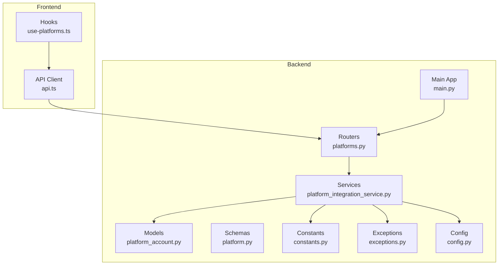
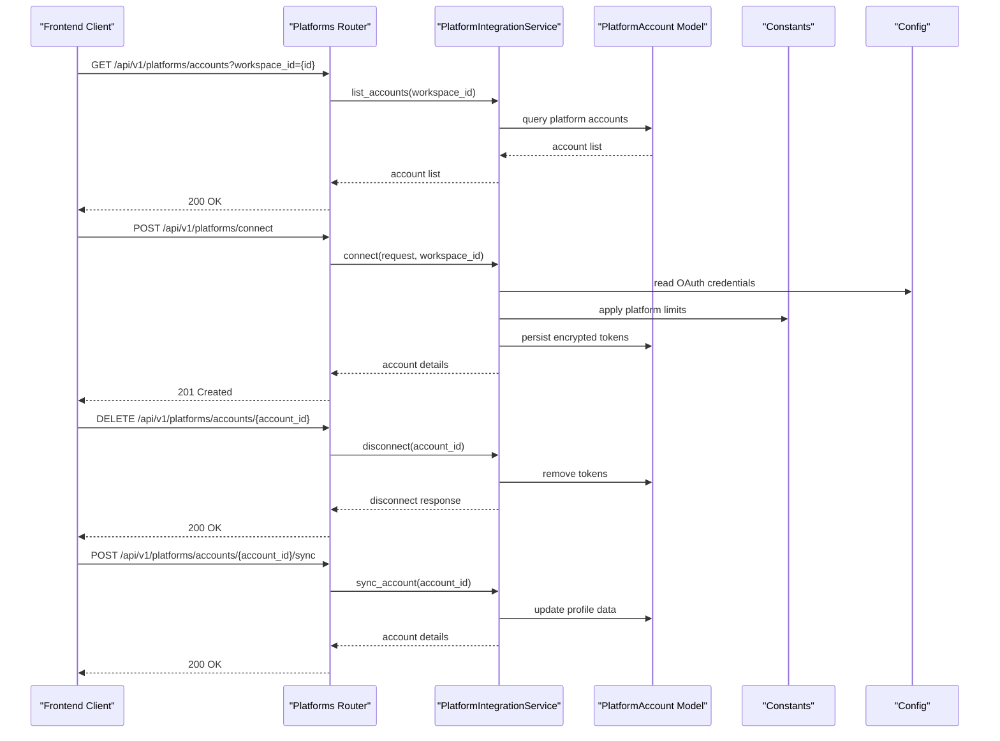
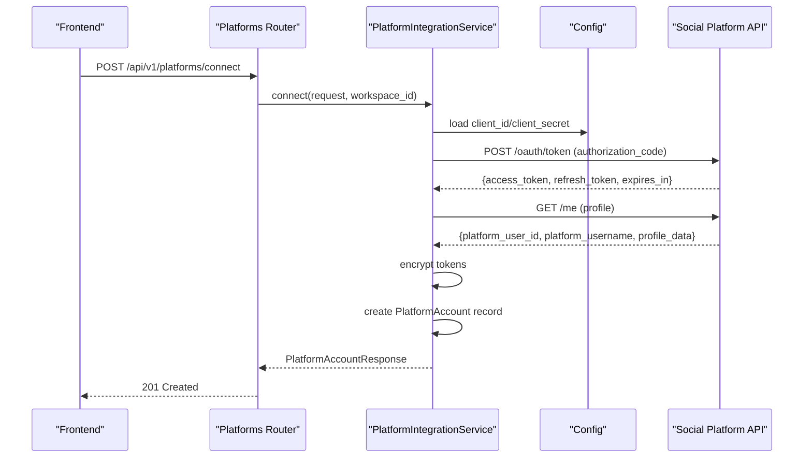
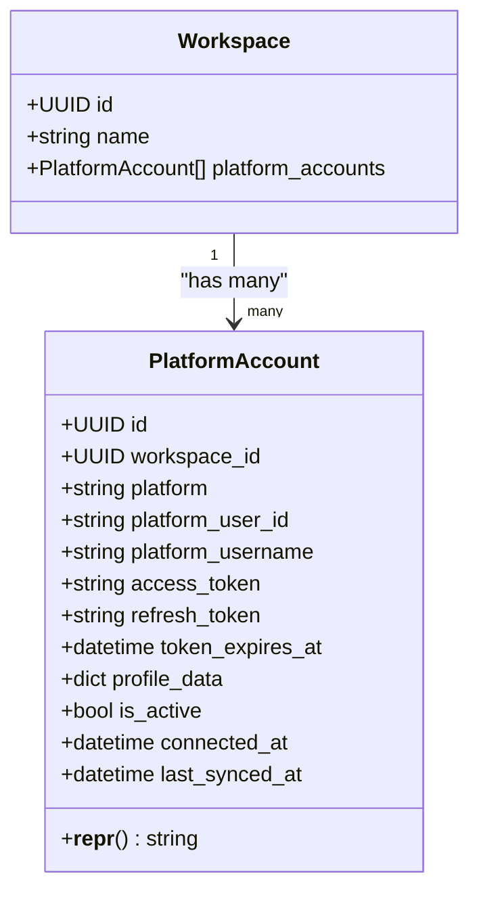
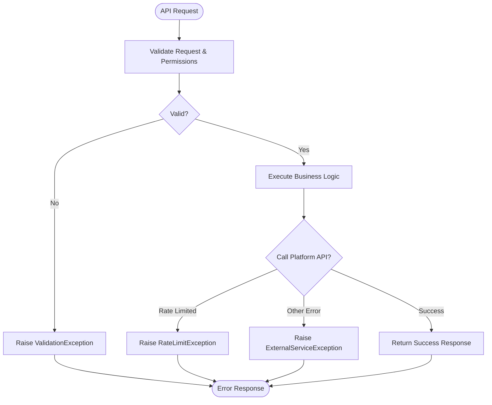
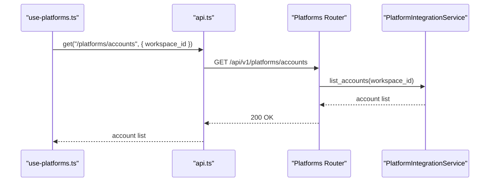
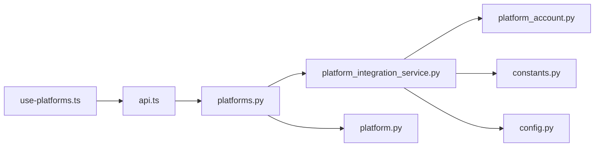

# Platform Integration API

<cite>
**Referenced Files in This Document**
- [backend/app/routers/platforms.py](file://backend/app/routers/platforms.py)
- [backend/app/schemas/platform.py](file://backend/app/schemas/platform.py)
- [backend/app/services/platform_integration_service.py](file://backend/app/services/platform_integration_service.py)
- [backend/app/models/platform_account.py](file://backend/app/models/platform_account.py)
- [backend/app/core/constants.py](file://backend/app/core/constants.py)
- [backend/app/core/exceptions.py](file://backend/app/core/exceptions.py)
- [backend/app/config.py](file://backend/app/config.py)
- [backend/app/main.py](file://backend/app/main.py)
- [frontend/src/hooks/use-platforms.ts](file://frontend/src/hooks/use-platforms.ts)
- [frontend/src/lib/api.ts](file://frontend/src/lib/api.ts)
</cite>

## Table of Contents
1. [Introduction](#introduction)
2. [Project Structure](#project-structure)
3. [Core Components](#core-components)
4. [Architecture Overview](#architecture-overview)
5. [Detailed Component Analysis](#detailed-component-analysis)
6. [Dependency Analysis](#dependency-analysis)
7. [Performance Considerations](#performance-considerations)
8. [Troubleshooting Guide](#troubleshooting-guide)
9. [Conclusion](#conclusion)

## Introduction
This document provides comprehensive API documentation for Socialium's platform integration endpoints. It covers social media account management, OAuth connection flows, platform-specific content formatting, and API credential management. Endpoints support connecting LinkedIn, Twitter/X, Instagram, and Facebook accounts, along with platform configuration, rate limiting settings, and error handling for platform-specific API limitations. Examples of OAuth flows, webhook setup, and platform-specific content adaptation are included.

## Project Structure
The platform integration functionality spans backend routers, services, schemas, models, and frontend hooks. The backend exposes REST endpoints under `/api/v1/platforms`, while the frontend integrates with these endpoints using a typed API client and React Query hooks.

**Diagram sources**
- [backend/app/routers/platforms.py](file://backend/app/routers/platforms.py#L1-L56)
- [backend/app/services/platform_integration_service.py](file://backend/app/services/platform_integration_service.py#L1-L56)
- [backend/app/models/platform_account.py](file://backend/app/models/platform_account.py#L1-L49)
- [backend/app/schemas/platform.py](file://backend/app/schemas/platform.py#L1-L40)
- [backend/app/core/constants.py](file://backend/app/core/constants.py#L1-L85)
- [backend/app/core/exceptions.py](file://backend/app/core/exceptions.py#L1-L90)
- [backend/app/config.py](file://backend/app/config.py#L1-L83)
- [backend/app/main.py](file://backend/app/main.py#L1-L83)
- [frontend/src/hooks/use-platforms.ts](file://frontend/src/hooks/use-platforms.ts#L1-L14)
- [frontend/src/lib/api.ts](file://frontend/src/lib/api.ts#L1-L69)

**Section sources**
- [backend/app/routers/platforms.py](file://backend/app/routers/platforms.py#L1-L56)
- [backend/app/main.py](file://backend/app/main.py#L57-L76)

## Core Components
- Platform Accounts Management: List, connect, disconnect, and sync platform accounts.
- OAuth Integration: Connect social media accounts using OAuth authorization codes.
- Platform-Specific Formatting: Character limits and content constraints per platform.
- Rate Limiting: Tier-based posting limits and platform constraints.
- Error Handling: Standardized exceptions for external service errors, rate limits, and validation failures.

**Section sources**
- [backend/app/routers/platforms.py](file://backend/app/routers/platforms.py#L17-L55)
- [backend/app/schemas/platform.py](file://backend/app/schemas/platform.py#L11-L39)
- [backend/app/core/constants.py](file://backend/app/core/constants.py#L63-L76)
- [backend/app/core/exceptions.py](file://backend/app/core/exceptions.py#L54-L68)

## Architecture Overview
The platform integration architecture follows a layered design:
- Routers handle HTTP requests and responses.
- Services encapsulate business logic for OAuth flows, account synchronization, and publishing.
- Models define persistent storage for platform accounts and tokens.
- Schemas validate request/response payloads.
- Constants define platform limits and tier configurations.
- Exceptions standardize error responses.
- Config centralizes OAuth credentials and API prefixes.
- Frontend integrates via a typed API client and React Query.

**Diagram sources**
- [backend/app/routers/platforms.py](file://backend/app/routers/platforms.py#L17-L55)
- [backend/app/services/platform_integration_service.py](file://backend/app/services/platform_integration_service.py#L17-L55)
- [backend/app/models/platform_account.py](file://backend/app/models/platform_account.py#L14-L48)
- [backend/app/core/constants.py](file://backend/app/core/constants.py#L63-L76)
- [backend/app/config.py](file://backend/app/config.py#L52-L61)

## Detailed Component Analysis

### Endpoints Overview
- GET /api/v1/platforms/accounts
  - Description: List all connected platform accounts for a workspace.
  - Query parameters: workspace_id (string).
  - Response: Array of PlatformAccountResponse.
- POST /api/v1/platforms/connect
  - Description: Connect a social media platform via OAuth.
  - Request body: PlatformConnectRequest.
  - Response: PlatformAccountResponse (201 Created).
- DELETE /api/v1/platforms/accounts/{account_id}
  - Description: Disconnect a social media platform.
  - Path parameter: account_id (string).
  - Response: PlatformDisconnectResponse.
- POST /api/v1/platforms/accounts/{account_id}/sync
  - Description: Sync platform account data (profile info, follower counts).
  - Path parameter: account_id (string).
  - Response: PlatformAccountResponse.

**Section sources**
- [backend/app/routers/platforms.py](file://backend/app/routers/platforms.py#L17-L55)
- [backend/app/schemas/platform.py](file://backend/app/schemas/platform.py#L19-L39)

### OAuth Connection Flow
OAuth flow for connecting a platform account:
1. Initiate OAuth with the chosen platform using configured client credentials.
2. Redirect back to the application with an authorization code.
3. Exchange the authorization code for access and refresh tokens.
4. Fetch platform user profile and encrypt tokens.
5. Persist tokens and account metadata.
6. Return connected account details.

**Diagram sources**
- [backend/app/routers/platforms.py](file://backend/app/routers/platforms.py#L27-L35)
- [backend/app/services/platform_integration_service.py](file://backend/app/services/platform_integration_service.py#L21-L31)
- [backend/app/config.py](file://backend/app/config.py#L52-L61)

### Platform Account Model
The PlatformAccount model persists encrypted tokens and metadata for each connected platform.

**Diagram sources**
- [backend/app/models/platform_account.py](file://backend/app/models/platform_account.py#L14-L48)

**Section sources**
- [backend/app/models/platform_account.py](file://backend/app/models/platform_account.py#L14-L48)

### Platform-Specific Content Formatting
Platform-specific constraints are defined centrally to guide content formatting and validation.

- Twitter/X: max_chars, max_images, max_hashtags
- LinkedIn: max_chars, max_images, max_hashtags
- Instagram: max_chars, max_images, max_hashtags
- Facebook: max_chars, max_images, max_hashtags

These limits inform content generation and publishing workflows to avoid platform-specific API rejections.

**Section sources**
- [backend/app/core/constants.py](file://backend/app/core/constants.py#L63-L69)

### Rate Limiting and Tier Configuration
Rate limits are tier-based and enforced at the application level:
- FREE: posts_per_day, platforms, team_members
- PRO: posts_per_day, platforms, team_members
- BUSINESS: posts_per_day, platforms, team_members

These configurations guide scheduling and publishing decisions to prevent exceeding daily quotas.

**Section sources**
- [backend/app/core/constants.py](file://backend/app/core/constants.py#L71-L76)

### Error Handling for Platform-Specific API Limitations
Standardized exceptions ensure consistent error responses:
- RateLimitException: Returned when rate limits are exceeded (HTTP 429).
- ExternalServiceException: Wraps platform API errors (HTTP 502).
- ValidationException: Business logic validation failures (HTTP 422).
- NotFoundException, UnauthorizedException, ForbiddenException: Resource and access errors.

**Diagram sources**
- [backend/app/core/exceptions.py](file://backend/app/core/exceptions.py#L54-L68)

**Section sources**
- [backend/app/core/exceptions.py](file://backend/app/core/exceptions.py#L71-L89)

### Frontend Integration
Frontend hooks and API client integrate with platform endpoints:
- use-platforms hook queries platform accounts for a workspace.
- api client performs HTTP requests with JSON serialization and error handling.

**Diagram sources**
- [frontend/src/hooks/use-platforms.ts](file://frontend/src/hooks/use-platforms.ts#L7-L12)
- [frontend/src/lib/api.ts](file://frontend/src/lib/api.ts#L47-L53)
- [backend/app/routers/platforms.py](file://backend/app/routers/platforms.py#L17-L24)

**Section sources**
- [frontend/src/hooks/use-platforms.ts](file://frontend/src/hooks/use-platforms.ts#L1-L14)
- [frontend/src/lib/api.ts](file://frontend/src/lib/api.ts#L1-L69)

## Dependency Analysis
The platform integration module exhibits clear separation of concerns:
- Routers depend on Services for business logic.
- Services depend on Models for persistence, Constants for platform limits, and Config for OAuth credentials.
- Frontend depends on Backend endpoints via the API client.

**Diagram sources**
- [backend/app/routers/platforms.py](file://backend/app/routers/platforms.py#L1-L56)
- [backend/app/services/platform_integration_service.py](file://backend/app/services/platform_integration_service.py#L1-L56)
- [backend/app/models/platform_account.py](file://backend/app/models/platform_account.py#L1-L49)
- [backend/app/schemas/platform.py](file://backend/app/schemas/platform.py#L1-L40)
- [backend/app/core/constants.py](file://backend/app/core/constants.py#L1-L85)
- [backend/app/config.py](file://backend/app/config.py#L1-L83)
- [frontend/src/hooks/use-platforms.ts](file://frontend/src/hooks/use-platforms.ts#L1-L14)
- [frontend/src/lib/api.ts](file://frontend/src/lib/api.ts#L1-L69)

**Section sources**
- [backend/app/main.py](file://backend/app/main.py#L57-L76)

## Performance Considerations
- Token Encryption: Store encrypted access and refresh tokens to minimize risk and reduce exposure during API calls.
- Batch Operations: Group account listings and syncing to reduce network overhead.
- Caching: Cache profile data updates with appropriate TTL to avoid frequent platform API calls.
- Retry Logic: Implement exponential backoff for transient platform API failures.
- Pagination: For large workspaces, paginate account listings and implement cursor-based pagination for sync operations.

## Troubleshooting Guide
Common issues and resolutions:
- OAuth Authorization Failures: Verify client credentials and redirect URI configuration in environment settings.
- Rate Limit Exceeded: Implement retry-after handling and queue posts according to tier-based limits.
- Token Expiration: Rotate refresh tokens and handle token expiration gracefully during API calls.
- Platform API Errors: Wrap external errors with ExternalServiceException and surface actionable messages to clients.
- Validation Errors: Ensure request payloads conform to PlatformConnectRequest schema before submission.

**Section sources**
- [backend/app/core/exceptions.py](file://backend/app/core/exceptions.py#L54-L68)
- [backend/app/config.py](file://backend/app/config.py#L52-L61)
- [backend/app/core/constants.py](file://backend/app/core/constants.py#L71-L76)

## Conclusion
Socialium's platform integration API provides a robust foundation for managing social media accounts across LinkedIn, Twitter/X, Instagram, and Facebook. The modular architecture ensures maintainability, while centralized constants and exceptions standardize behavior. By adhering to platform-specific constraints and tier-based rate limits, applications can reliably automate social media publishing and engagement workflows.