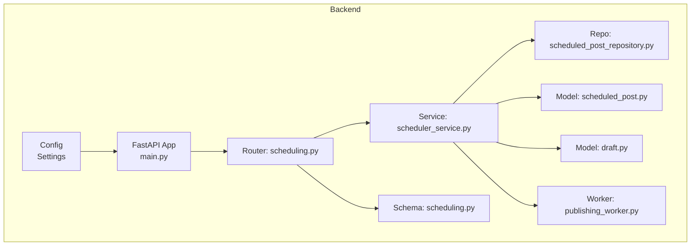
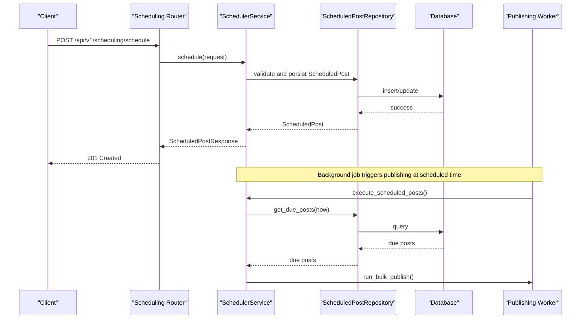
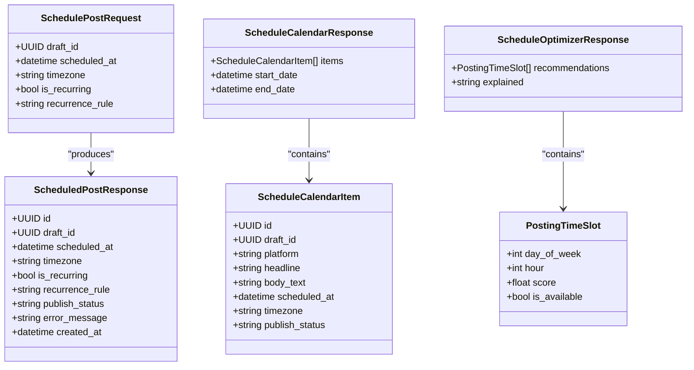

# Scheduling & Publishing API

<cite>
**Referenced Files in This Document**
- [backend/app/main.py](file://backend/app/main.py)
- [backend/app/config.py](file://backend/app/config.py)
- [backend/app/routers/scheduling.py](file://backend/app/routers/scheduling.py)
- [backend/app/schemas/scheduling.py](file://backend/app/schemas/scheduling.py)
- [backend/app/models/scheduled_post.py](file://backend/app/models/scheduled_post.py)
- [backend/app/models/draft.py](file://backend/app/models/draft.py)
- [backend/app/services/scheduler_service.py](file://backend/app/services/scheduler_service.py)
- [backend/app/repositories/scheduled_post_repository.py](file://backend/app/repositories/scheduled_post_repository.py)
- [backend/app/workers/publishing_worker.py](file://backend/app/workers/publishing_worker.py)
- [frontend/src/app/(dashboard)/scheduling/page.tsx](file://frontend/src/app/(dashboard)/scheduling/page.tsx)
- [frontend/src/lib/api.ts](file://frontend/src/lib/api.ts)
</cite>

## Table of Contents
1. [Introduction](#introduction)
2. [Project Structure](#project-structure)
3. [Core Components](#core-components)
4. [Architecture Overview](#architecture-overview)
5. [Detailed Component Analysis](#detailed-component-analysis)
6. [Dependency Analysis](#dependency-analysis)
7. [Performance Considerations](#performance-considerations)
8. [Troubleshooting Guide](#troubleshooting-guide)
9. [Conclusion](#conclusion)
10. [Appendices](#appendices)

## Introduction
This document provides comprehensive API documentation for Socialium’s scheduling and publishing endpoints. It covers:
- Publishing schedule management (create, reschedule, cancel)
- Recurring post configuration
- Intelligent timing recommendations powered by analytics
- Calendar views and status tracking
- Worker integration for automated publishing
- Request/response schemas, timezone handling, and batch operations

The API is organized under the base path defined by the application configuration and exposed via FastAPI routers.

## Project Structure
The scheduling system spans routers, schemas, models, services, repositories, and workers. The backend registers the scheduling router under the configured API version prefix.

**Diagram sources**
- [backend/app/main.py](file://backend/app/main.py#L57-L76)
- [backend/app/routers/scheduling.py](file://backend/app/routers/scheduling.py#L1-L69)
- [backend/app/services/scheduler_service.py](file://backend/app/services/scheduler_service.py#L1-L59)
- [backend/app/repositories/scheduled_post_repository.py](file://backend/app/repositories/scheduled_post_repository.py#L1-L14)
- [backend/app/workers/publishing_worker.py](file://backend/app/workers/publishing_worker.py#L1-L12)
- [backend/app/models/scheduled_post.py](file://backend/app/models/scheduled_post.py#L1-L56)
- [backend/app/models/draft.py](file://backend/app/models/draft.py#L1-L71)
- [backend/app/schemas/scheduling.py](file://backend/app/schemas/scheduling.py#L1-L70)
- [backend/app/config.py](file://backend/app/config.py#L18-L27)

**Section sources**
- [backend/app/main.py](file://backend/app/main.py#L57-L76)
- [backend/app/config.py](file://backend/app/config.py#L18-L27)

## Core Components
- Router: Exposes endpoints for scheduling, calendar retrieval, rescheduling, cancellation, and optimization.
- Service: Orchestrates scheduling logic, recurrence, timezone handling, and optimization.
- Repository: Abstracts persistence operations for scheduled posts.
- Models: Define database schema for drafts and scheduled posts, including status and recurrence fields.
- Schemas: Define request/response shapes for scheduling APIs.
- Workers: Background tasks for publishing and bulk publishing.

Key responsibilities:
- Validate draft state and approval
- Normalize scheduling time to UTC with timezone-aware storage
- Enforce recurrence rules and optional quiet hours
- Provide calendar view and optimization recommendations
- Trigger publishing via workers

**Section sources**
- [backend/app/routers/scheduling.py](file://backend/app/routers/scheduling.py#L1-L69)
- [backend/app/services/scheduler_service.py](file://backend/app/services/scheduler_service.py#L1-L59)
- [backend/app/repositories/scheduled_post_repository.py](file://backend/app/repositories/scheduled_post_repository.py#L1-L14)
- [backend/app/models/scheduled_post.py](file://backend/app/models/scheduled_post.py#L1-L56)
- [backend/app/models/draft.py](file://backend/app/models/draft.py#L1-L71)
- [backend/app/schemas/scheduling.py](file://backend/app/schemas/scheduling.py#L1-L70)
- [backend/app/workers/publishing_worker.py](file://backend/app/workers/publishing_worker.py#L1-L12)

## Architecture Overview
The scheduling API follows a layered architecture:
- HTTP layer: FastAPI router
- Service layer: Business logic for scheduling, rescheduling, cancellation, and optimization
- Persistence layer: SQLAlchemy ORM models and repository abstractions
- Worker layer: Background tasks for publishing and bulk publishing
- Analytics integration: Optimization leverages historical engagement data

**Diagram sources**
- [backend/app/routers/scheduling.py](file://backend/app/routers/scheduling.py#L18-L25)
- [backend/app/services/scheduler_service.py](file://backend/app/services/scheduler_service.py#L18-L27)
- [backend/app/repositories/scheduled_post_repository.py](file://backend/app/repositories/scheduled_post_repository.py#L10-L13)
- [backend/app/workers/publishing_worker.py](file://backend/app/workers/publishing_worker.py#L9-L11)

## Detailed Component Analysis

### API Endpoints

#### POST /api/v1/scheduling/schedule
- Purpose: Schedule a post for future publication.
- Request body: [SchedulePostRequest](file://backend/app/schemas/scheduling.py#L9-L17)
- Response: [ScheduledPostResponse](file://backend/app/schemas/scheduling.py#L19-L32)
- Status codes: 201 Created, 422 Unprocessable Entity, 500 Internal Server Error

Processing steps (service-level):
- Validate draft existence and approval state
- Normalize scheduled time to UTC considering timezone
- Persist ScheduledPost record with recurrence and quiet hours options
- Register trigger for automated publishing

**Section sources**
- [backend/app/routers/scheduling.py](file://backend/app/routers/scheduling.py#L18-L25)
- [backend/app/schemas/scheduling.py](file://backend/app/schemas/scheduling.py#L9-L17)
- [backend/app/schemas/scheduling.py](file://backend/app/schemas/scheduling.py#L19-L32)
- [backend/app/services/scheduler_service.py](file://backend/app/services/scheduler_service.py#L18-L27)

#### GET /api/v1/scheduling/calendar
- Purpose: Retrieve scheduled posts for a workspace within a date range for calendar display.
- Query parameters:
  - workspace_id: string
  - start_date: string (ISO 8601 date)
  - end_date: string (ISO 8601 date)
- Response: [ScheduleCalendarResponse](file://backend/app/schemas/scheduling.py#L48-L54)

Response items:
- [ScheduleCalendarItem](file://backend/app/schemas/scheduling.py#L35-L46) includes platform, headline, body preview, scheduled time, timezone, and publish status.

**Section sources**
- [backend/app/routers/scheduling.py](file://backend/app/routers/scheduling.py#L28-L37)
- [backend/app/schemas/scheduling.py](file://backend/app/schemas/scheduling.py#L35-L54)

#### PUT /api/v1/scheduling/{scheduled_id}/reschedule
- Purpose: Reschedule an existing scheduled post.
- Path parameter: scheduled_id: string
- Request body: [SchedulePostRequest](file://backend/app/schemas/scheduling.py#L9-L17)
- Response: [ScheduledPostResponse](file://backend/app/schemas/scheduling.py#L19-L32)

**Section sources**
- [backend/app/routers/scheduling.py](file://backend/app/routers/scheduling.py#L40-L48)
- [backend/app/schemas/scheduling.py](file://backend/app/schemas/scheduling.py#L9-L17)
- [backend/app/schemas/scheduling.py](file://backend/app/schemas/scheduling.py#L19-L32)

#### DELETE /api/v1/scheduling/{scheduled_id}
- Purpose: Cancel a scheduled post.
- Path parameter: scheduled_id: string
- Response: 204 No Content

**Section sources**
- [backend/app/routers/scheduling.py](file://backend/app/routers/scheduling.py#L51-L58)

#### GET /api/v1/scheduling/optimize
- Purpose: Get AI-recommended optimal posting times for a workspace.
- Query parameters:
  - workspace_id: string
- Response: [ScheduleOptimizerResponse](file://backend/app/schemas/scheduling.py#L65-L69)

Recommendations include:
- [PostingTimeSlot](file://backend/app/schemas/scheduling.py#L56-L63): day_of_week, hour, score, is_available
- explained: string (explanation for recommendations)

**Section sources**
- [backend/app/routers/scheduling.py](file://backend/app/routers/scheduling.py#L61-L68)
- [backend/app/schemas/scheduling.py](file://backend/app/schemas/scheduling.py#L56-L69)

### Schemas

#### SchedulePostRequest
- Fields:
  - draft_id: UUID
  - scheduled_at: datetime (timezone-aware)
  - timezone: string (default: UTC)
  - is_recurring: bool (default: false)
  - recurrence_rule: string | null (values: daily, weekly, monthly)

**Section sources**
- [backend/app/schemas/scheduling.py](file://backend/app/schemas/scheduling.py#L9-L17)

#### ScheduledPostResponse
- Fields:
  - id: UUID
  - draft_id: UUID
  - scheduled_at: datetime
  - timezone: string
  - is_recurring: bool
  - recurrence_rule: string | null
  - publish_status: string (pending, published, failed, cancelled)
  - error_message: string | null
  - created_at: datetime

**Section sources**
- [backend/app/schemas/scheduling.py](file://backend/app/schemas/scheduling.py#L19-L32)

#### ScheduleCalendarItem
- Fields:
  - id: UUID
  - draft_id: UUID
  - platform: string
  - headline: string | null
  - body_text: string
  - scheduled_at: datetime
  - timezone: string
  - publish_status: string

**Section sources**
- [backend/app/schemas/scheduling.py](file://backend/app/schemas/scheduling.py#L35-L46)

#### ScheduleCalendarResponse
- Fields:
  - items: list[ScheduleCalendarItem]
  - start_date: datetime
  - end_date: datetime

**Section sources**
- [backend/app/schemas/scheduling.py](file://backend/app/schemas/scheduling.py#L48-L54)

#### PostingTimeSlot
- Fields:
  - day_of_week: int
  - hour: int
  - score: float
  - is_available: bool

**Section sources**
- [backend/app/schemas/scheduling.py](file://backend/app/schemas/scheduling.py#L56-L63)

#### ScheduleOptimizerResponse
- Fields:
  - recommendations: list[PostingTimeSlot]
  - explained: string

**Section sources**
- [backend/app/schemas/scheduling.py](file://backend/app/schemas/scheduling.py#L65-L69)

### Models

#### ScheduledPost
- Columns:
  - id: UUID (PK)
  - draft_id: UUID (FK to drafts)
  - workspace_id: UUID (FK to workspaces)
  - scheduled_at: datetime (timezone-aware)
  - timezone: string (default: UTC)
  - is_recurring: bool (default: false)
  - recurrence_rule: string | null
  - recurrence_end_date: datetime | null (timezone-aware)
  - quiet_hours_enabled: bool (default: false)
  - quiet_hours_start: string | null (HH:MM)
  - quiet_hours_end: string | null (HH:MM)
  - publish_status: string (default: pending)
  - error_message: string | null
  - metadata: JSONB (default: {})
  - created_at/updated_at: datetime (timezone-aware)

Relationships:
- One-to-one with Draft via scheduled_post relationship

**Section sources**
- [backend/app/models/scheduled_post.py](file://backend/app/models/scheduled_post.py#L13-L56)

#### Draft
- Columns:
  - id: UUID (PK)
  - workspace_id: UUID (FK to workspaces)
  - content_source_id: UUID | null (FK to content_sources)
  - platform: enum (Platform)
  - headline/body_text/hashtags/image_url/image_prompt/cta/tone/ai_model/generation_prompt/status/character_count/quality_score/is_variant/variant_group_id/created_at/updated_at/published_at
- Relationships:
  - One-to-one with ScheduledPost via scheduled_post relationship

**Section sources**
- [backend/app/models/draft.py](file://backend/app/models/draft.py#L15-L71)

### Service Layer

#### SchedulerService
- Methods:
  - schedule(request): orchestrates scheduling steps
  - get_calendar(workspace_id, start_date, end_date): calendar view
  - reschedule(scheduled_id, request): update scheduled time
  - cancel(scheduled_id): cancel scheduled post
  - get_optimal_times(workspace_id): AI recommendations
  - execute_scheduled_posts(): background task to publish due posts

Notes:
- The service references analytics for optimal posting time recommendations.
- Uses APScheduler for time-based triggers (conceptual note).

**Section sources**
- [backend/app/services/scheduler_service.py](file://backend/app/services/scheduler_service.py#L8-L59)

### Repository Layer

#### ScheduledPostRepository
- Methods (abstract):
  - create(**kwargs)
  - get_calendar(workspace_id, start_date, end_date)
  - cancel(scheduled_id)
  - get_due_posts(current_time)

**Section sources**
- [backend/app/repositories/scheduled_post_repository.py](file://backend/app/repositories/scheduled_post_repository.py#L6-L13)

### Worker Layer

#### Publishing Worker
- Methods:
  - run_publish(scheduled_post_id): publish a single scheduled post
  - run_bulk_publish(workspace_id): publish all due scheduled posts

Integration:
- The service’s execute_scheduled_posts method coordinates bulk publishing.

**Section sources**
- [backend/app/workers/publishing_worker.py](file://backend/app/workers/publishing_worker.py#L4-L11)

### Frontend Integration

#### Scheduling Page UI
- Displays recommended posting times with day, time, predicted engagement score, and availability.
- Demonstrates consumption of optimization recommendations.

**Section sources**
- [frontend/src/app/(dashboard)/scheduling/page.tsx](file://frontend/src/app/(dashboard)/scheduling/page.tsx#L1-L53)

#### API Client
- Provides typed HTTP client with base URL from environment.
- Supports GET, POST, PUT, PATCH, DELETE with JSON serialization and error handling.

**Section sources**
- [frontend/src/lib/api.ts](file://frontend/src/lib/api.ts#L1-L69)

## Dependency Analysis

**Diagram sources**
- [backend/app/schemas/scheduling.py](file://backend/app/schemas/scheduling.py#L9-L69)

**Section sources**
- [backend/app/schemas/scheduling.py](file://backend/app/schemas/scheduling.py#L1-L70)

## Performance Considerations
- Timezone normalization: Store scheduled_at in UTC with timezone metadata to avoid ambiguity and simplify comparisons.
- Recurrence and quiet hours: Apply constraints during scheduling to prevent overlapping or invalid configurations.
- Calendar queries: Paginate and filter by date ranges to reduce payload sizes.
- Optimization recommendations: Cache or precompute engagement predictions per workspace to minimize latency.
- Worker throughput: Batch publishing jobs and tune concurrency to match platform rate limits.

## Troubleshooting Guide
Common issues and resolutions:
- Validation errors (422): Ensure draft_id references an existing, approved draft and scheduled_at is in the future.
- Timezone mismatch: Verify timezone field matches IANA or offset format; stored UTC ensures consistency.
- Recurrence conflicts: Check recurrence_rule and recurrence_end_date to avoid infinite loops.
- Publishing failures: Inspect publish_status and error_message on ScheduledPost; reconcile with platform-specific errors.
- Worker not triggering: Confirm background task execution and queue connectivity.

Operational checks:
- Health endpoint: GET /health to verify service availability.
- API docs: Access /docs or /redoc when debug is enabled.

**Section sources**
- [backend/app/main.py](file://backend/app/main.py#L79-L83)
- [backend/app/config.py](file://backend/app/config.py#L41-L42)

## Conclusion
The Scheduling & Publishing API provides a robust foundation for managing social media posts with intelligent timing recommendations, recurrence support, and automated publishing via workers. The layered architecture separates concerns between routing, business logic, persistence, and background processing, enabling scalability and maintainability.

## Appendices

### API Base Path and Registration
- Base path: /api/v1/scheduling
- Registered in FastAPI app with tags ["Scheduling"]

**Section sources**
- [backend/app/main.py](file://backend/app/main.py#L69-L71)
- [backend/app/config.py](file://backend/app/config.py#L23)

### Example Workflows

#### Schedule Creation
- Endpoint: POST /api/v1/scheduling/schedule
- Request fields: draft_id, scheduled_at, timezone, is_recurring, recurrence_rule
- Response: ScheduledPostResponse with publish_status set to pending

**Section sources**
- [backend/app/routers/scheduling.py](file://backend/app/routers/scheduling.py#L18-L25)
- [backend/app/schemas/scheduling.py](file://backend/app/schemas/scheduling.py#L9-L17)
- [backend/app/schemas/scheduling.py](file://backend/app/schemas/scheduling.py#L19-L32)

#### Recurring Post Setup
- Set is_recurring: true and recurrence_rule: daily | weekly | monthly
- Optionally set recurrence_end_date to limit repetition

**Section sources**
- [backend/app/schemas/scheduling.py](file://backend/app/schemas/scheduling.py#L15-L16)
- [backend/app/models/scheduled_post.py](file://backend/app/models/scheduled_post.py#L32-L34)

#### Bulk Publishing Workflow
- Background task: execute_scheduled_posts() retrieves due posts and triggers run_bulk_publish()
- Worker publishes all eligible posts for the current time window

**Section sources**
- [backend/app/services/scheduler_service.py](file://backend/app/services/scheduler_service.py#L56-L58)
- [backend/app/workers/publishing_worker.py](file://backend/app/workers/publishing_worker.py#L9-L11)

#### Integration with Optimization
- Endpoint: GET /api/v1/scheduling/optimize
- Response: ScheduleOptimizerResponse with recommendations and explanation
- UI usage: Display recommended slots with availability and scores

**Section sources**
- [backend/app/routers/scheduling.py](file://backend/app/routers/scheduling.py#L61-L68)
- [backend/app/schemas/scheduling.py](file://backend/app/schemas/scheduling.py#L56-L69)
- [frontend/src/app/(dashboard)/scheduling/page.tsx](file://frontend/src/app/(dashboard)/scheduling/page.tsx#L8-L13)