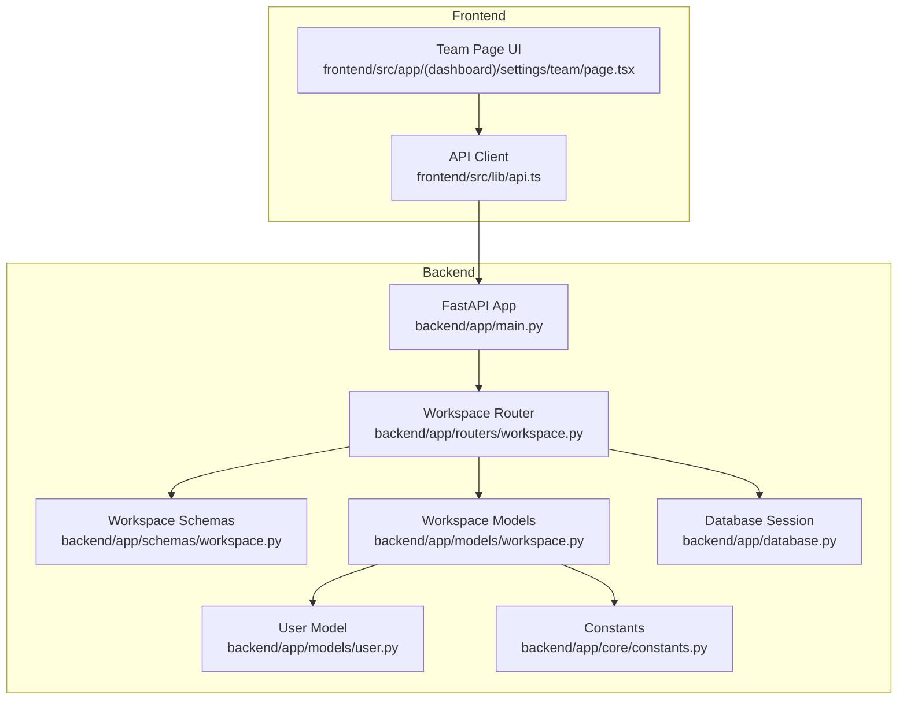
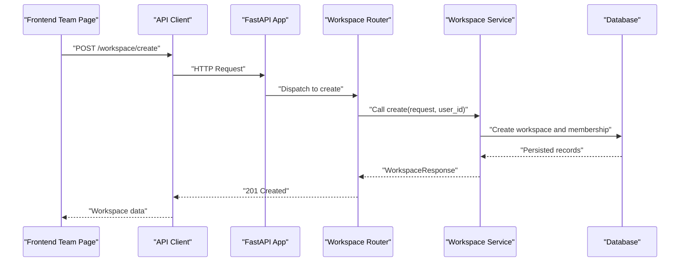
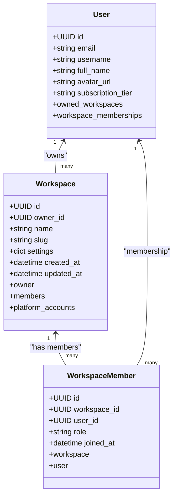
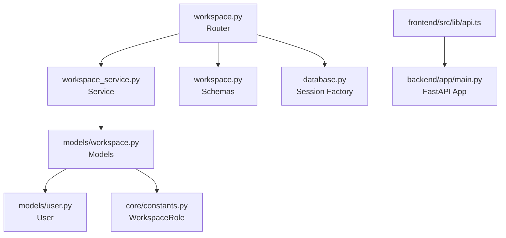

# Workspace & Collaboration API

<cite>
**Referenced Files in This Document**
- [backend/app/main.py](file://backend/app/main.py)
- [backend/app/routers/workspace.py](file://backend/app/routers/workspace.py)
- [backend/app/schemas/workspace.py](file://backend/app/schemas/workspace.py)
- [backend/app/models/workspace.py](file://backend/app/models/workspace.py)
- [backend/app/models/user.py](file://backend/app/models/user.py)
- [backend/app/core/constants.py](file://backend/app/core/constants.py)
- [backend/app/database.py](file://backend/app/database.py)
- [frontend/src/app/(dashboard)/settings/team/page.tsx](file://frontend/src/app/(dashboard)/settings/team/page.tsx)
- [frontend/src/lib/api.ts](file://frontend/src/lib/api.ts)
</cite>

## Table of Contents
1. [Introduction](#introduction)
2. [Project Structure](#project-structure)
3. [Core Components](#core-components)
4. [Architecture Overview](#architecture-overview)
5. [Detailed Component Analysis](#detailed-component-analysis)
6. [Dependency Analysis](#dependency-analysis)
7. [Performance Considerations](#performance-considerations)
8. [Troubleshooting Guide](#troubleshooting-guide)
9. [Conclusion](#conclusion)
10. [Appendices](#appendices)

## Introduction
This document provides comprehensive API documentation for Socialium's workspace and team collaboration endpoints. It covers workspace management, member invitation, role-based access control, resource sharing, and team permissions. The documentation includes endpoint definitions, request/response schemas, permission matrices, and practical examples for workspace setup and team collaboration workflows. It also outlines integration points with other platform features such as content scheduling, approvals, and platform account management.

## Project Structure
The workspace and team collaboration functionality is implemented in the backend Python application using FastAPI and SQLAlchemy, with a PostgreSQL database. The frontend Next.js application provides a team management UI that surfaces workspace member lists and invites.

**Diagram sources**
- [backend/app/main.py](file://backend/app/main.py#L57-L76)
- [backend/app/routers/workspace.py](file://backend/app/routers/workspace.py#L1-L81)
- [backend/app/schemas/workspace.py](file://backend/app/schemas/workspace.py#L1-L57)
- [backend/app/models/workspace.py](file://backend/app/models/workspace.py#L1-L73)
- [backend/app/models/user.py](file://backend/app/models/user.py#L1-L48)
- [backend/app/core/constants.py](file://backend/app/core/constants.py#L39-L44)
- [backend/app/database.py](file://backend/app/database.py#L1-L43)
- [frontend/src/app/(dashboard)/settings/team/page.tsx](file://frontend/src/app/(dashboard)/settings/team/page.tsx#L1-L50)
- [frontend/src/lib/api.ts](file://frontend/src/lib/api.ts#L1-L69)

**Section sources**
- [backend/app/main.py](file://backend/app/main.py#L57-L76)
- [backend/app/routers/workspace.py](file://backend/app/routers/workspace.py#L1-L81)
- [backend/app/schemas/workspace.py](file://backend/app/schemas/workspace.py#L1-L57)
- [backend/app/models/workspace.py](file://backend/app/models/workspace.py#L1-L73)
- [backend/app/models/user.py](file://backend/app/models/user.py#L1-L48)
- [backend/app/core/constants.py](file://backend/app/core/constants.py#L39-L44)
- [backend/app/database.py](file://backend/app/database.py#L1-L43)
- [frontend/src/app/(dashboard)/settings/team/page.tsx](file://frontend/src/app/(dashboard)/settings/team/page.tsx#L1-L50)
- [frontend/src/lib/api.ts](file://frontend/src/lib/api.ts#L1-L69)

## Core Components
- Workspace Router: Defines endpoints for workspace creation, retrieval, updates, member listing, invitations, and removal.
- Workspace Schemas: Pydantic models for request/response bodies and member details.
- Workspace Models: SQLAlchemy ORM models representing workspaces and memberships with role enums.
- Constants: Enumerations for workspace roles and platform limits.
- Database Session: Async database session factory and base model for ORM.
- Frontend Team Page: UI for displaying members and initiating invitations.
- API Client: Frontend client for making authenticated requests to backend endpoints.

**Section sources**
- [backend/app/routers/workspace.py](file://backend/app/routers/workspace.py#L1-L81)
- [backend/app/schemas/workspace.py](file://backend/app/schemas/workspace.py#L1-L57)
- [backend/app/models/workspace.py](file://backend/app/models/workspace.py#L1-L73)
- [backend/app/core/constants.py](file://backend/app/core/constants.py#L39-L44)
- [backend/app/database.py](file://backend/app/database.py#L1-L43)
- [frontend/src/app/(dashboard)/settings/team/page.tsx](file://frontend/src/app/(dashboard)/settings/team/page.tsx#L1-L50)
- [frontend/src/lib/api.ts](file://frontend/src/lib/api.ts#L1-L69)

## Architecture Overview
The workspace module follows a layered architecture:
- Router layer handles HTTP requests and delegates to the service layer.
- Service layer orchestrates business logic and interacts with repositories/models.
- Schema layer validates and serializes data.
- Model layer persists data to the database with typed enums and relationships.
- Frontend integrates via a typed API client to the workspace endpoints.

**Diagram sources**
- [backend/app/routers/workspace.py](file://backend/app/routers/workspace.py#L19-L27)
- [backend/app/schemas/workspace.py](file://backend/app/schemas/workspace.py#L9-L14)
- [backend/app/models/workspace.py](file://backend/app/models/workspace.py#L14-L39)
- [backend/app/database.py](file://backend/app/database.py#L32-L42)
- [frontend/src/lib/api.ts](file://frontend/src/lib/api.ts#L51-L53)

## Detailed Component Analysis

### Workspace Endpoints
- POST /workspace/create
  - Purpose: Create a new workspace and add the creator as owner.
  - Authentication: Requires a user identifier (placeholder in current implementation).
  - Request Body: WorkspaceCreateRequest (name, slug).
  - Response: WorkspaceResponse (includes members).
  - Notes: Slug uniqueness is validated; owner membership is added automatically.

- GET /workspace/{workspace_id}
  - Purpose: Retrieve workspace details including members.
  - Response: WorkspaceResponse.

- PUT /workspace/{workspace_id}
  - Purpose: Update workspace settings (name or settings).
  - Request Body: WorkspaceUpdateSettingsRequest (optional name/settings).
  - Response: WorkspaceResponse.

- GET /workspace/{workspace_id}/members
  - Purpose: List all workspace members.
  - Response: Array of WorkspaceMemberResponse.

- POST /workspace/{workspace_id}/invite
  - Purpose: Invite a user by email to join the workspace.
  - Request Body: WorkspaceInviteRequest (email, role).
  - Response: WorkspaceMemberResponse.
  - Notes: Validates non-member status and assigns role.

- DELETE /workspace/{workspace_id}/members/{member_id}
  - Purpose: Remove a member from the workspace.
  - Response: No content (204).

**Section sources**
- [backend/app/routers/workspace.py](file://backend/app/routers/workspace.py#L19-L81)
- [backend/app/schemas/workspace.py](file://backend/app/schemas/workspace.py#L9-L56)

### Data Models and Relationships

**Diagram sources**
- [backend/app/models/workspace.py](file://backend/app/models/workspace.py#L14-L72)
- [backend/app/models/user.py](file://backend/app/models/user.py#L14-L48)
- [backend/app/core/constants.py](file://backend/app/core/constants.py#L39-L44)

**Section sources**
- [backend/app/models/workspace.py](file://backend/app/models/workspace.py#L14-L72)
- [backend/app/models/user.py](file://backend/app/models/user.py#L14-L48)
- [backend/app/core/constants.py](file://backend/app/core/constants.py#L39-L44)

### Role-Based Access Control
- Roles: owner, editor, viewer.
- Assignment: WorkspaceMember.role uses WorkspaceRole enum.
- Implications: Role determines member capabilities within the workspace (creation, editing, viewing).

**Section sources**
- [backend/app/core/constants.py](file://backend/app/core/constants.py#L39-L44)
- [backend/app/models/workspace.py](file://backend/app/models/workspace.py#L58-L62)

### Permission Matrix
- Owner: Full administrative rights (create, update, invite, remove).
- Editor: Can edit content and collaborate; restricted from administrative actions.
- Viewer: Read-only access to shared resources.

Note: Current implementation exposes administrative endpoints but does not enforce role-based restrictions in the service layer. Authorization checks should be implemented in the service layer.

**Section sources**
- [backend/app/routers/workspace.py](file://backend/app/routers/workspace.py#L19-L81)
- [backend/app/schemas/workspace.py](file://backend/app/schemas/workspace.py#L16-L21)

### Resource Sharing and Platform Accounts
- Workspaces own platform accounts (e.g., LinkedIn, Twitter).
- Members inherit permissions based on their role within the workspace.
- Integration: Frontend uses workspace-scoped queries for platform accounts.

**Section sources**
- [backend/app/models/workspace.py](file://backend/app/models/workspace.py#L37-L39)
- [frontend/src/hooks/use-platforms.ts](file://frontend/src/hooks/use-platforms.ts#L7-L12)

### API Definitions and Schemas

#### Workspace Creation
- Endpoint: POST /workspace/create
- Request Body: WorkspaceCreateRequest
  - name: string (1-100 chars)
  - slug: string (3-100 chars, lowercase, digits, hyphens)
- Response: WorkspaceResponse
  - id, owner_id, name, slug, settings, created_at, updated_at, members

**Section sources**
- [backend/app/routers/workspace.py](file://backend/app/routers/workspace.py#L19-L27)
- [backend/app/schemas/workspace.py](file://backend/app/schemas/workspace.py#L9-L14)
- [backend/app/schemas/workspace.py](file://backend/app/schemas/workspace.py#L37-L49)

#### Member Invitation
- Endpoint: POST /workspace/{workspace_id}/invite
- Request Body: WorkspaceInviteRequest
  - email: email address
  - role: "editor" (default) or "owner"/"viewer"
- Response: WorkspaceMemberResponse
  - id, user_id, email, full_name, avatar_url, role, joined_at

**Section sources**
- [backend/app/routers/workspace.py](file://backend/app/routers/workspace.py#L61-L69)
- [backend/app/schemas/workspace.py](file://backend/app/schemas/workspace.py#L16-L21)
- [backend/app/schemas/workspace.py](file://backend/app/schemas/workspace.py#L23-L34)

#### Member Management
- List members: GET /workspace/{workspace_id}/members → array of WorkspaceMemberResponse
- Remove member: DELETE /workspace/{workspace_id}/members/{member_id} → 204

**Section sources**
- [backend/app/routers/workspace.py](file://backend/app/routers/workspace.py#L51-L58)
- [backend/app/routers/workspace.py](file://backend/app/routers/workspace.py#L72-L80)
- [backend/app/schemas/workspace.py](file://backend/app/schemas/workspace.py#L23-L34)

#### Workspace Settings Update
- Endpoint: PUT /workspace/{workspace_id}
- Request Body: WorkspaceUpdateSettingsRequest
  - name: optional string (1-100)
  - settings: optional dict
- Response: WorkspaceResponse

**Section sources**
- [backend/app/routers/workspace.py](file://backend/app/routers/workspace.py#L40-L48)
- [backend/app/schemas/workspace.py](file://backend/app/schemas/workspace.py#L52-L56)

### Frontend Integration Examples
- Team Page UI displays members and an "Invite Member" action.
- API Client supports GET/POST/PUT/DELETE with JSON serialization and error handling.
- Platform accounts are fetched using workspace-scoped queries.

**Section sources**
- [frontend/src/app/(dashboard)/settings/team/page.tsx](file://frontend/src/app/(dashboard)/settings/team/page.tsx#L15-L49)
- [frontend/src/lib/api.ts](file://frontend/src/lib/api.ts#L20-L65)
- [frontend/src/hooks/use-platforms.ts](file://frontend/src/hooks/use-platforms.ts#L7-L12)

## Dependency Analysis

**Diagram sources**
- [backend/app/routers/workspace.py](file://backend/app/routers/workspace.py#L1-L81)
- [backend/app/schemas/workspace.py](file://backend/app/schemas/workspace.py#L1-L57)
- [backend/app/models/workspace.py](file://backend/app/models/workspace.py#L1-L73)
- [backend/app/models/user.py](file://backend/app/models/user.py#L1-L48)
- [backend/app/core/constants.py](file://backend/app/core/constants.py#L39-L44)
- [backend/app/database.py](file://backend/app/database.py#L1-L43)
- [frontend/src/lib/api.ts](file://frontend/src/lib/api.ts#L1-L69)
- [backend/app/main.py](file://backend/app/main.py#L57-L76)

**Section sources**
- [backend/app/routers/workspace.py](file://backend/app/routers/workspace.py#L1-L81)
- [backend/app/schemas/workspace.py](file://backend/app/schemas/workspace.py#L1-L57)
- [backend/app/models/workspace.py](file://backend/app/models/workspace.py#L1-L73)
- [backend/app/models/user.py](file://backend/app/models/user.py#L1-L48)
- [backend/app/core/constants.py](file://backend/app/core/constants.py#L39-L44)
- [backend/app/database.py](file://backend/app/database.py#L1-L43)
- [frontend/src/lib/api.ts](file://frontend/src/lib/api.ts#L1-L69)
- [backend/app/main.py](file://backend/app/main.py#L57-L76)

## Performance Considerations
- Asynchronous Database Sessions: Uses SQLAlchemy async sessions to handle concurrent requests efficiently.
- Relationship Loading: Select-in loading strategy is configured for workspace and user relationships to reduce N+1 queries.
- JSONB Settings: Flexible settings storage optimized for read/write patterns typical of configuration data.
- Pagination: Consider adding pagination for member listing in future iterations to scale to large teams.

[No sources needed since this section provides general guidance]

## Troubleshooting Guide
- 404 Not Found: Workspace ID or member ID invalid or not found.
- 400 Bad Request: Validation errors in request body (e.g., invalid slug, missing fields).
- 409 Conflict: Slug uniqueness violation during workspace creation.
- 500 Internal Server Error: Database or service layer exceptions; verify session commit/rollback behavior.
- Frontend API Errors: The API client throws descriptive errors when HTTP responses are unsuccessful.

**Section sources**
- [frontend/src/lib/api.ts](file://frontend/src/lib/api.ts#L38-L44)
- [backend/app/database.py](file://backend/app/database.py#L32-L42)

## Conclusion
The workspace and team collaboration module provides a solid foundation for managing teams, roles, and shared resources. While the router and schema layers are implemented, the service layer currently contains placeholder implementations requiring full feature development. Authorization enforcement, comprehensive error handling, and role-based restrictions should be implemented to secure the endpoints. Integrations with content, approvals, and platform accounts are already present and ready for expanded use.

[No sources needed since this section summarizes without analyzing specific files]

## Appendices

### Endpoint Reference Summary
- POST /workspace/create → Create workspace
- GET /workspace/{workspace_id} → Get workspace
- PUT /workspace/{workspace_id} → Update settings
- GET /workspace/{workspace_id}/members → List members
- POST /workspace/{workspace_id}/invite → Invite member
- DELETE /workspace/{workspace_id}/members/{member_id} → Remove member

**Section sources**
- [backend/app/routers/workspace.py](file://backend/app/routers/workspace.py#L19-L81)

### Example Workflows

#### Workspace Setup
- Create workspace with a unique slug and name.
- Creator becomes the owner automatically.
- Configure initial settings via update endpoint.

**Section sources**
- [backend/app/routers/workspace.py](file://backend/app/routers/workspace.py#L19-L27)
- [backend/app/routers/workspace.py](file://backend/app/routers/workspace.py#L40-L48)

#### Team Collaboration Workflow
- Invite members with specific roles.
- List members to verify invitations.
- Remove members when necessary.

**Section sources**
- [backend/app/routers/workspace.py](file://backend/app/routers/workspace.py#L61-L69)
- [backend/app/routers/workspace.py](file://backend/app/routers/workspace.py#L51-L58)
- [backend/app/routers/workspace.py](file://backend/app/routers/workspace.py#L72-L80)

#### Role-Based Restrictions
- Owner: Full access to administrative endpoints.
- Editor: Limited to collaborative tasks.
- Viewer: Read-only access.

**Section sources**
- [backend/app/core/constants.py](file://backend/app/core/constants.py#L39-L44)
- [backend/app/routers/workspace.py](file://backend/app/routers/workspace.py#L19-L81)