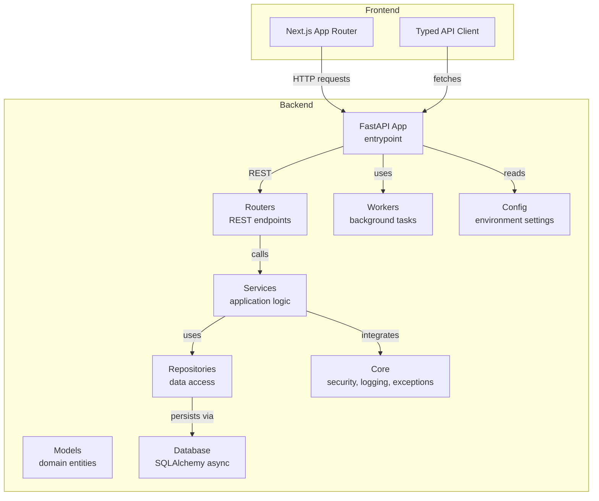
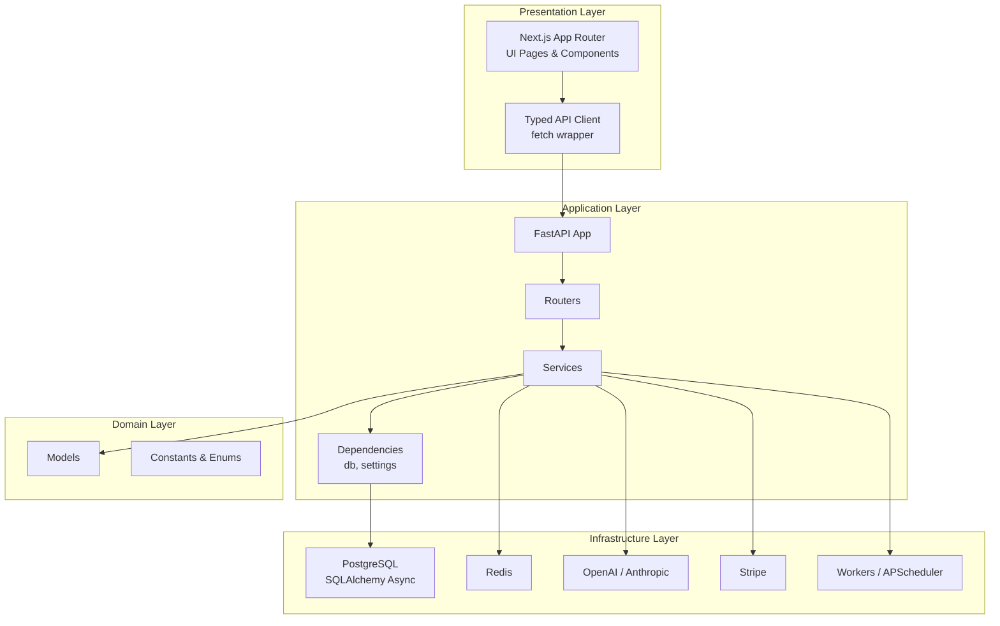
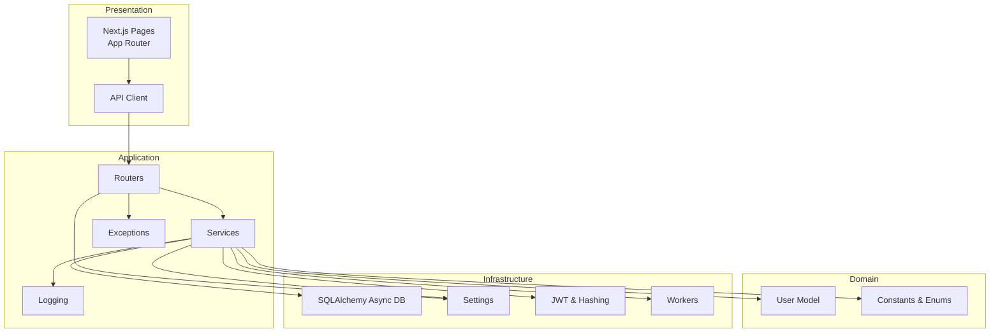
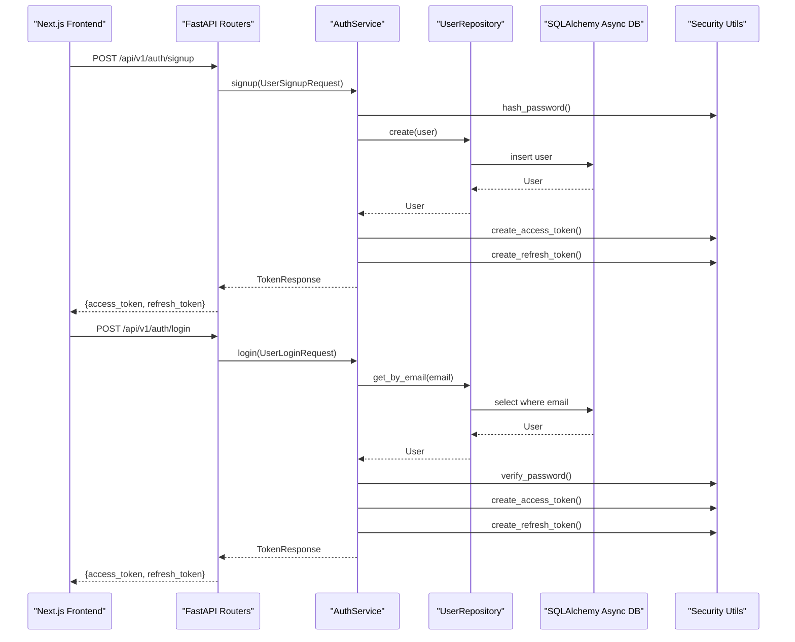
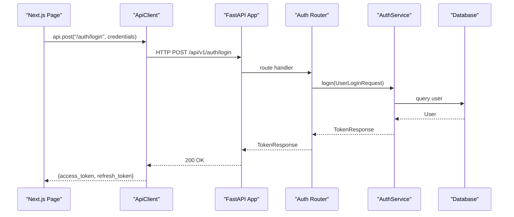
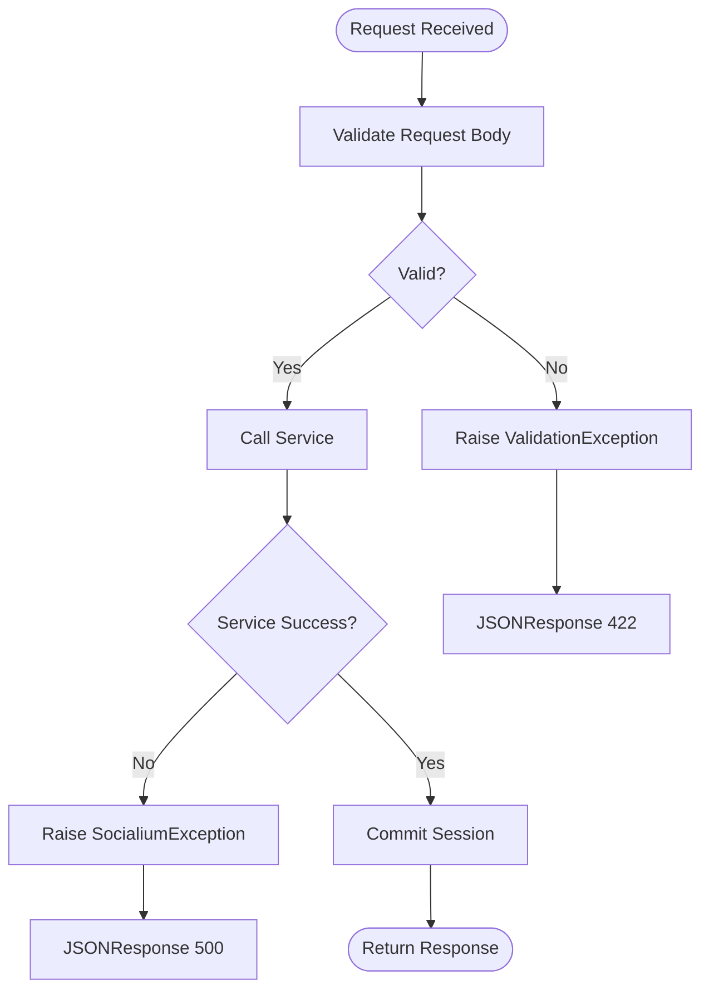
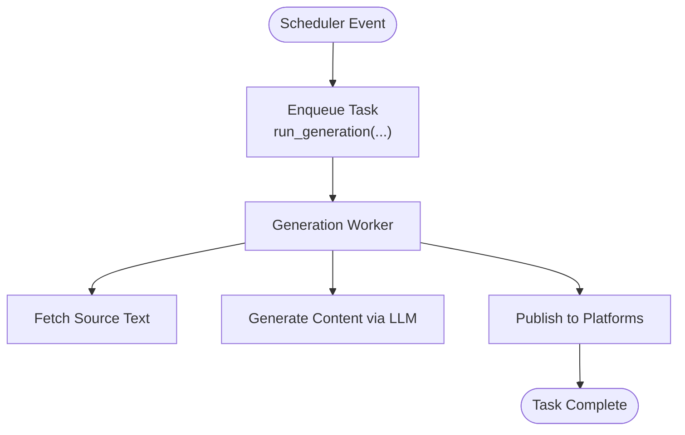
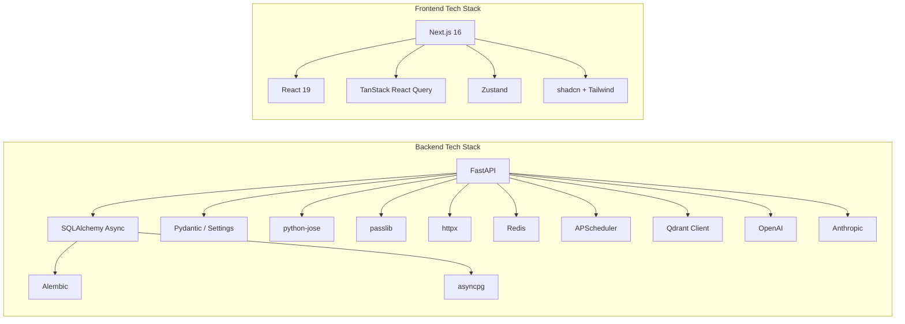
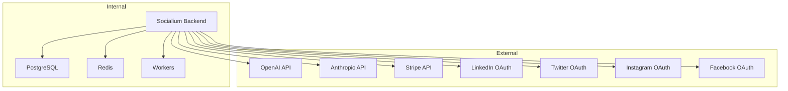
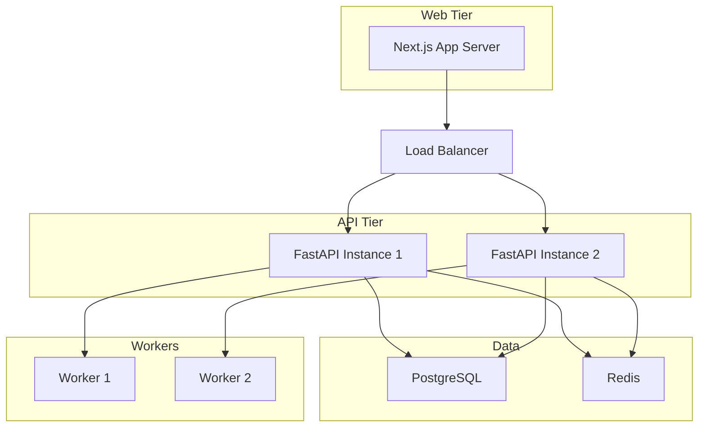

# Architecture

<cite>
**Referenced Files in This Document**
- [backend/app/main.py](file://backend/app/main.py)
- [backend/app/config.py](file://backend/app/config.py)
- [backend/app/database.py](file://backend/app/database.py)
- [backend/app/core/security.py](file://backend/app/core/security.py)
- [backend/app/core/logging.py](file://backend/app/core/logging.py)
- [backend/app/core/exceptions.py](file://backend/app/core/exceptions.py)
- [backend/app/dependencies.py](file://backend/app/dependencies.py)
- [backend/app/core/constants.py](file://backend/app/core/constants.py)
- [backend/app/models/user.py](file://backend/app/models/user.py)
- [backend/app/repositories/user_repository.py](file://backend/app/repositories/user_repository.py)
- [backend/app/services/auth_service.py](file://backend/app/services/auth_service.py)
- [backend/app/routers/auth.py](file://backend/app/routers/auth.py)
- [backend/app/workers/generation_worker.py](file://backend/app/workers/generation_worker.py)
- [backend/pyproject.toml](file://backend/pyproject.toml)
- [frontend/src/lib/api.ts](file://frontend/src/lib/api.ts)
- [frontend/package.json](file://frontend/package.json)
</cite>

## Table of Contents
1. [Introduction](#introduction)
2. [Project Structure](#project-structure)
3. [Core Components](#core-components)
4. [Architecture Overview](#architecture-overview)
5. [Detailed Component Analysis](#detailed-component-analysis)
6. [Dependency Analysis](#dependency-analysis)
7. [Performance Considerations](#performance-considerations)
8. [Troubleshooting Guide](#troubleshooting-guide)
9. [Conclusion](#conclusion)
10. [Appendices](#appendices)

## Introduction
This document describes the architecture of Socialium, an AI-powered social media automation platform. The system follows a clean architecture pattern with distinct layers:
- Presentation: Next.js frontend with App Router
- Application: FastAPI backend with RESTful API design
- Domain: Business entities and core logic
- Infrastructure: Database, external integrations, and cross-cutting services

It covers component interactions, data flows, security (JWT), logging, monitoring, error handling, scalability, deployment topology, and technology stack rationale.

## Project Structure
The repository is organized into two primary directories:
- backend: FastAPI application implementing REST endpoints, services, repositories, models, and infrastructure integrations
- frontend: Next.js application using App Router for routing and UI composition

**Diagram sources**
- [backend/app/main.py](file://backend/app/main.py#L36-L82)
- [backend/app/routers/auth.py](file://backend/app/routers/auth.py#L17-L68)
- [backend/app/services/auth_service.py](file://backend/app/services/auth_service.py#L14-L67)
- [backend/app/repositories/user_repository.py](file://backend/app/repositories/user_repository.py#L11-L39)
- [backend/app/models/user.py](file://backend/app/models/user.py#L14-L47)
- [backend/app/database.py](file://backend/app/database.py#L12-L42)
- [backend/app/workers/generation_worker.py](file://backend/app/workers/generation_worker.py#L4-L6)
- [backend/app/core/security.py](file://backend/app/core/security.py#L25-L40)
- [backend/app/core/logging.py](file://backend/app/core/logging.py#L7-L24)
- [backend/app/core/exceptions.py](file://backend/app/core/exceptions.py#L71-L89)
- [backend/app/config.py](file://backend/app/config.py#L9-L76)
- [frontend/src/lib/api.ts](file://frontend/src/lib/api.ts#L3-L68)

**Section sources**
- [backend/app/main.py](file://backend/app/main.py#L36-L82)
- [frontend/src/lib/api.ts](file://frontend/src/lib/api.ts#L3-L68)

## Core Components
- FastAPI backend
  - Entry point initializes lifespan, CORS, exception handlers, and registers routers under a versioned prefix
  - Health check endpoint exposed for operational monitoring
- Configuration
  - Centralized settings via Pydantic BaseSettings with environment-driven values for database, Redis, JWT, AI providers, OAuth clients, Stripe, and monitoring
- Database layer
  - Async SQLAlchemy engine and session factory with connection pooling and automatic rollback/commit semantics
- Security
  - Password hashing with bcrypt and JWT utilities for access/refresh tokens and token decoding
- Logging and exceptions
  - Structured logging configuration and centralized exception handlers for consistent error responses
- Constants and enums
  - Platform types, content status, approval actions, subscription tiers, roles, tones, and limits
- Services and repositories
  - Example: AuthService orchestrates authentication flows; UserRepository defines data access contracts
- Workers
  - Background task scaffolding for content generation workflows

**Section sources**
- [backend/app/main.py](file://backend/app/main.py#L26-L82)
- [backend/app/config.py](file://backend/app/config.py#L9-L76)
- [backend/app/database.py](file://backend/app/database.py#L12-L42)
- [backend/app/core/security.py](file://backend/app/core/security.py#L15-L49)
- [backend/app/core/logging.py](file://backend/app/core/logging.py#L7-L24)
- [backend/app/core/exceptions.py](file://backend/app/core/exceptions.py#L7-L89)
- [backend/app/core/constants.py](file://backend/app/core/constants.py#L6-L84)
- [backend/app/repositories/user_repository.py](file://backend/app/repositories/user_repository.py#L11-L39)
- [backend/app/services/auth_service.py](file://backend/app/services/auth_service.py#L14-L67)
- [backend/app/workers/generation_worker.py](file://backend/app/workers/generation_worker.py#L4-L6)

## Architecture Overview
Socialium implements a layered clean architecture:
- Presentation layer (Next.js App Router) consumes REST endpoints and renders UI
- Application layer (FastAPI) exposes REST endpoints, validates requests, and coordinates services
- Domain layer (models and constants) encapsulates business rules and entities
- Infrastructure layer (database, external services, workers) provides persistence and integrations

**Diagram sources**
- [frontend/src/lib/api.ts](file://frontend/src/lib/api.ts#L3-L68)
- [backend/app/main.py](file://backend/app/main.py#L36-L76)
- [backend/app/routers/auth.py](file://backend/app/routers/auth.py#L17-L68)
- [backend/app/services/auth_service.py](file://backend/app/services/auth_service.py#L14-L67)
- [backend/app/dependencies.py](file://backend/app/dependencies.py#L11-L13)
- [backend/app/models/user.py](file://backend/app/models/user.py#L14-L47)
- [backend/app/core/constants.py](file://backend/app/core/constants.py#L6-L84)
- [backend/app/database.py](file://backend/app/database.py#L12-L42)
- [backend/app/config.py](file://backend/app/config.py#L25-L64)

## Detailed Component Analysis

### Clean Architecture Layers

**Diagram sources**
- [frontend/src/lib/api.ts](file://frontend/src/lib/api.ts#L3-L68)
- [backend/app/routers/auth.py](file://backend/app/routers/auth.py#L17-L68)
- [backend/app/services/auth_service.py](file://backend/app/services/auth_service.py#L14-L67)
- [backend/app/models/user.py](file://backend/app/models/user.py#L14-L47)
- [backend/app/core/constants.py](file://backend/app/core/constants.py#L6-L84)
- [backend/app/database.py](file://backend/app/database.py#L12-L42)
- [backend/app/config.py](file://backend/app/config.py#L9-L76)
- [backend/app/core/security.py](file://backend/app/core/security.py#L15-L49)
- [backend/app/core/exceptions.py](file://backend/app/core/exceptions.py#L71-L89)
- [backend/app/core/logging.py](file://backend/app/core/logging.py#L7-L24)

**Section sources**
- [backend/app/main.py](file://backend/app/main.py#L36-L76)
- [backend/app/core/exceptions.py](file://backend/app/core/exceptions.py#L71-L89)
- [backend/app/core/logging.py](file://backend/app/core/logging.py#L7-L24)
- [backend/app/core/security.py](file://backend/app/core/security.py#L15-L49)
- [backend/app/config.py](file://backend/app/config.py#L9-L76)
- [backend/app/models/user.py](file://backend/app/models/user.py#L14-L47)
- [backend/app/core/constants.py](file://backend/app/core/constants.py#L6-L84)

### Authentication Flow (JWT)

**Diagram sources**
- [backend/app/routers/auth.py](file://backend/app/routers/auth.py#L20-L47)
- [backend/app/services/auth_service.py](file://backend/app/services/auth_service.py#L21-L57)
- [backend/app/repositories/user_repository.py](file://backend/app/repositories/user_repository.py#L17-L39)
- [backend/app/database.py](file://backend/app/database.py#L32-L42)
- [backend/app/core/security.py](file://backend/app/core/security.py#L15-L40)

**Section sources**
- [backend/app/routers/auth.py](file://backend/app/routers/auth.py#L20-L47)
- [backend/app/services/auth_service.py](file://backend/app/services/auth_service.py#L21-L57)
- [backend/app/core/security.py](file://backend/app/core/security.py#L15-L40)
- [backend/app/database.py](file://backend/app/database.py#L32-L42)

### Data Flow Between Frontend and Backend

**Diagram sources**
- [frontend/src/lib/api.ts](file://frontend/src/lib/api.ts#L20-L45)
- [backend/app/main.py](file://backend/app/main.py#L58-L76)
- [backend/app/routers/auth.py](file://backend/app/routers/auth.py#L30-L37)
- [backend/app/services/auth_service.py](file://backend/app/services/auth_service.py#L35-L45)
- [backend/app/database.py](file://backend/app/database.py#L32-L42)

**Section sources**
- [frontend/src/lib/api.ts](file://frontend/src/lib/api.ts#L3-L68)
- [backend/app/main.py](file://backend/app/main.py#L58-L76)

### Error Handling and Exceptions

**Diagram sources**
- [backend/app/core/exceptions.py](file://backend/app/core/exceptions.py#L71-L89)

**Section sources**
- [backend/app/core/exceptions.py](file://backend/app/core/exceptions.py#L7-L89)

### Background Workflows (Content Generation)

**Diagram sources**
- [backend/app/workers/generation_worker.py](file://backend/app/workers/generation_worker.py#L4-L6)

**Section sources**
- [backend/app/workers/generation_worker.py](file://backend/app/workers/generation_worker.py#L4-L6)

## Dependency Analysis
- Backend dependencies include FastAPI, SQLAlchemy asyncio, Alembic, asyncpg, Pydantic, Pydantic Settings, python-jose, passlib, httpx, Redis, APScheduler, Qdrant client, OpenAI, Anthropic, python-dotenv, and email-validator
- Frontend dependencies include Next.js, React 19, TanStack React Query, shadcn/ui, Tailwind, zustand, and related UI libraries

**Diagram sources**
- [backend/pyproject.toml](file://backend/pyproject.toml#L6-L25)
- [frontend/package.json](file://frontend/package.json#L11-L32)

**Section sources**
- [backend/pyproject.toml](file://backend/pyproject.toml#L6-L25)
- [frontend/package.json](file://frontend/package.json#L11-L32)

## Performance Considerations
- Asynchronous database operations with connection pooling reduce latency and improve throughput
- Centralized settings enable environment-aware tuning (e.g., database echo, JWT expiry)
- Workers offload long-running tasks (generation, publishing) from request threads
- Caching and vector storage (Redis/Qdrant) support embeddings and retrieval-augmented generation
- Rate limiting and tier-based quotas prevent abuse and ensure fair usage

[No sources needed since this section provides general guidance]

## Troubleshooting Guide
- Health checks
  - Use the health endpoint to verify service availability
- Logging
  - Configure logging levels and suppress noisy third-party logs
- Exception handling
  - Centralized handlers return structured JSON errors with appropriate HTTP status codes
- Database sessions
  - Sessions commit on success, roll back on exceptions, and close after use

**Section sources**
- [backend/app/main.py](file://backend/app/main.py#L78-L82)
- [backend/app/core/logging.py](file://backend/app/core/logging.py#L7-L24)
- [backend/app/core/exceptions.py](file://backend/app/core/exceptions.py#L71-L89)
- [backend/app/database.py](file://backend/app/database.py#L32-L42)

## Conclusion
Socialium’s architecture cleanly separates concerns across presentation, application, domain, and infrastructure layers. The FastAPI backend provides a robust REST foundation with strong security (JWT), structured logging, and centralized exception handling. The Next.js frontend integrates seamlessly via a typed API client. Integrations with AI providers, social platforms, and payment processors are configured through environment settings, enabling flexible deployments across development, staging, and production environments.

[No sources needed since this section summarizes without analyzing specific files]

## Appendices

### System Context Diagram (External Integrations)

**Diagram sources**
- [backend/app/config.py](file://backend/app/config.py#L52-L64)
- [backend/app/config.py](file://backend/app/config.py#L38-L46)
- [backend/app/config.py](file://backend/app/config.py#L62-L64)

### Security Considerations
- JWT-based authentication with configurable expiration and signing algorithm
- Password hashing with bcrypt
- CORS configured to allowlist the frontend origin
- Environment-driven secrets for all external integrations

**Section sources**
- [backend/app/core/security.py](file://backend/app/core/security.py#L25-L49)
- [backend/app/config.py](file://backend/app/config.py#L32-L36)
- [backend/app/main.py](file://backend/app/main.py#L45-L52)

### Deployment Topology (Conceptual)

[No sources needed since this diagram shows conceptual deployment topology]