# Application Structure

<cite>
**Referenced Files in This Document**
- [backend/app/main.py](file://backend/app/main.py)
- [backend/app/config.py](file://backend/app/config.py)
- [backend/app/database.py](file://backend/app/database.py)
- [backend/app/dependencies.py](file://backend/app/dependencies.py)
- [backend/app/core/exceptions.py](file://backend/app/core/exceptions.py)
- [backend/app/routers/__init__.py](file://backend/app/routers/__init__.py)
- [backend/app/routers/auth.py](file://backend/app/routers/auth.py)
- [backend/app/routers/content.py](file://backend/app/routers/content.py)
- [backend/app/routers/workspace.py](file://backend/app/routers/workspace.py)
- [backend/app/services/__init__.py](file://backend/app/services/__init__.py)
- [backend/app/services/auth_service.py](file://backend/app/services/auth_service.py)
- [backend/app/services/content_generation_service.py](file://backend/app/services/content_generation_service.py)
- [backend/app/models/__init__.py](file://backend/app/models/__init__.py)
- [backend/app/models/user.py](file://backend/app/models/user.py)
- [backend/app/models/workspace.py](file://backend/app/models/workspace.py)
- [backend/app/models/content.py](file://backend/app/models/content.py)
</cite>

## Table of Contents
1. [Introduction](#introduction)
2. [Project Structure](#project-structure)
3. [Core Components](#core-components)
4. [Architecture Overview](#architecture-overview)
5. [Detailed Component Analysis](#detailed-component-analysis)
6. [Dependency Analysis](#dependency-analysis)
7. [Performance Considerations](#performance-considerations)
8. [Troubleshooting Guide](#troubleshooting-guide)
9. [Conclusion](#conclusion)
10. [Appendices](#appendices)

## Introduction
This document explains the clean architecture implementation of Socialium’s FastAPI backend. The application follows a layered structure:
- Presentation (Routers): Define HTTP endpoints and request/response contracts.
- Application (Services): Encapsulate business logic and orchestrate operations.
- Domain (Models): Represent persistent entities and relationships.
- Infrastructure (Database, External Services): Provide persistence and third-party integrations.

It also documents application initialization (lifespan), router registration, API versioning, dependency injection, configuration via environment variables, middleware (CORS, exception handling), and the end-to-end request flow.

## Project Structure
The backend is organized by layers and features:
- app/main.py: Application entry point, lifespan, middleware, and router registration.
- app/config.py: Centralized settings loaded from environment variables.
- app/database.py: Asynchronous SQLAlchemy engine, session factory, and base model.
- app/dependencies.py: Shared dependency type aliases for DI.
- app/core/exceptions.py: Custom exceptions and global exception handlers.
- app/routers/: Feature-based HTTP endpoints grouped by domain.
- app/services/: Business logic services consumed by routers.
- app/models/: SQLAlchemy declarative models forming the domain layer.
- app/repositories/: Not shown here but implied as the persistence boundary for services.
- app/schemas/: Pydantic models for request/response validation.
- app/workers/: Background job processors (not covered in depth here).

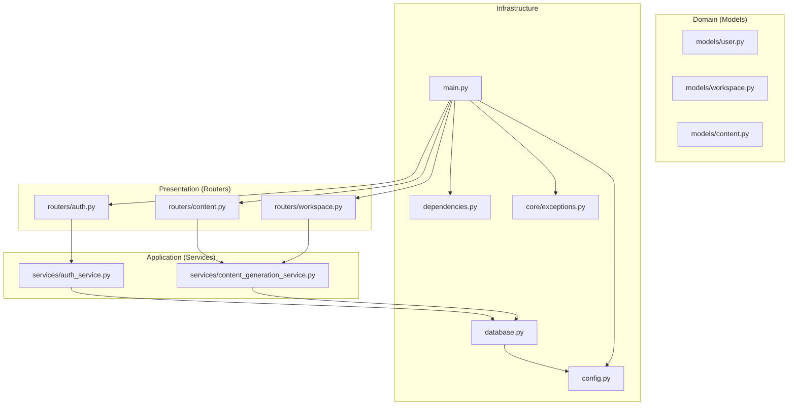

**Diagram sources**
- [backend/app/main.py](file://backend/app/main.py#L1-L83)
- [backend/app/config.py](file://backend/app/config.py#L1-L83)
- [backend/app/database.py](file://backend/app/database.py#L1-L43)
- [backend/app/dependencies.py](file://backend/app/dependencies.py#L1-L14)
- [backend/app/core/exceptions.py](file://backend/app/core/exceptions.py#L1-L90)
- [backend/app/routers/auth.py](file://backend/app/routers/auth.py#L1-L69)
- [backend/app/routers/content.py](file://backend/app/routers/content.py#L1-L94)
- [backend/app/routers/workspace.py](file://backend/app/routers/workspace.py#L1-L81)
- [backend/app/services/auth_service.py](file://backend/app/services/auth_service.py#L1-L68)
- [backend/app/services/content_generation_service.py](file://backend/app/services/content_generation_service.py#L1-L98)
- [backend/app/models/user.py](file://backend/app/models/user.py#L1-L48)
- [backend/app/models/workspace.py](file://backend/app/models/workspace.py#L1-L73)
- [backend/app/models/content.py](file://backend/app/models/content.py#L1-L42)

**Section sources**
- [backend/app/main.py](file://backend/app/main.py#L1-L83)
- [backend/app/config.py](file://backend/app/config.py#L1-L83)
- [backend/app/database.py](file://backend/app/database.py#L1-L43)
- [backend/app/dependencies.py](file://backend/app/dependencies.py#L1-L14)
- [backend/app/core/exceptions.py](file://backend/app/core/exceptions.py#L1-L90)
- [backend/app/routers/__init__.py](file://backend/app/routers/__init__.py#L1-L2)
- [backend/app/routers/auth.py](file://backend/app/routers/auth.py#L1-L69)
- [backend/app/routers/content.py](file://backend/app/routers/content.py#L1-L94)
- [backend/app/routers/workspace.py](file://backend/app/routers/workspace.py#L1-L81)
- [backend/app/services/__init__.py](file://backend/app/services/__init__.py#L1-L2)
- [backend/app/services/auth_service.py](file://backend/app/services/auth_service.py#L1-L68)
- [backend/app/services/content_generation_service.py](file://backend/app/services/content_generation_service.py#L1-L98)
- [backend/app/models/__init__.py](file://backend/app/models/__init__.py#L1-L24)
- [backend/app/models/user.py](file://backend/app/models/user.py#L1-L48)
- [backend/app/models/workspace.py](file://backend/app/models/workspace.py#L1-L73)
- [backend/app/models/content.py](file://backend/app/models/content.py#L1-L42)

## Core Components
- Application entry and lifecycle:
  - Lifespan manages startup and shutdown hooks.
  - FastAPI app configured with title, description, version, and conditional docs URLs.
  - CORS middleware configured from settings.
  - Global exception handlers registered.
  - Routers registered under a versioned prefix with tags.

- Configuration:
  - Settings loaded from .env with pydantic-settings.
  - Environment-driven toggles for debug, docs visibility, database URL, Redis, JWT, external APIs, OAuth clients, Stripe, frontend origin, and monitoring keys.

- Database and DI:
  - Async SQLAlchemy engine and session factory.
  - Session dependency yields a scoped async session with automatic commit/rollback and close.
  - Dependency aliases for type-safe DI across routers.

- Exception handling:
  - Custom exceptions for common scenarios.
  - Global handlers convert exceptions to JSON responses with appropriate status codes.

**Section sources**
- [backend/app/main.py](file://backend/app/main.py#L26-L83)
- [backend/app/config.py](file://backend/app/config.py#L9-L83)
- [backend/app/database.py](file://backend/app/database.py#L12-L43)
- [backend/app/dependencies.py](file://backend/app/dependencies.py#L11-L14)
- [backend/app/core/exceptions.py](file://backend/app/core/exceptions.py#L71-L90)

## Architecture Overview
The system adheres to clean architecture with clear boundaries:
- Presentation depends on Application.
- Application depends on Domain abstractions (schemas) and Infrastructure.
- Domain depends on Infrastructure for persistence.
- Infrastructure encapsulates external systems (database, Redis, LLMs, OAuth, payment providers).

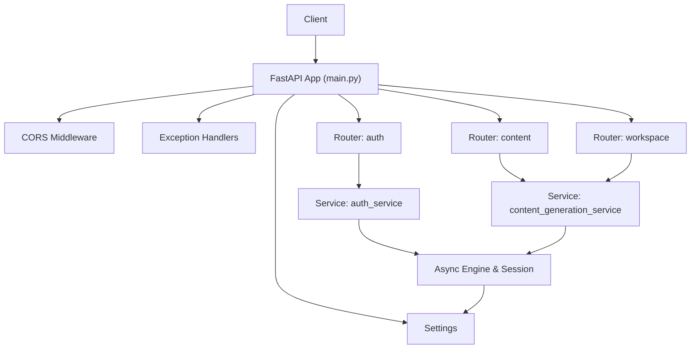

**Diagram sources**
- [backend/app/main.py](file://backend/app/main.py#L36-L77)
- [backend/app/core/exceptions.py](file://backend/app/core/exceptions.py#L71-L90)
- [backend/app/routers/auth.py](file://backend/app/routers/auth.py#L17-L69)
- [backend/app/routers/content.py](file://backend/app/routers/content.py#L17-L94)
- [backend/app/routers/workspace.py](file://backend/app/routers/workspace.py#L16-L81)
- [backend/app/services/auth_service.py](file://backend/app/services/auth_service.py#L15-L68)
- [backend/app/services/content_generation_service.py](file://backend/app/services/content_generation_service.py#L13-L98)
- [backend/app/database.py](file://backend/app/database.py#L12-L43)
- [backend/app/config.py](file://backend/app/config.py#L9-L83)

## Detailed Component Analysis

### Application Initialization and Lifecycle
- Lifespan:
  - Prints startup and shutdown messages.
  - Ensures resources are initialized before serving requests and released after shutdown.
- FastAPI configuration:
  - Title, description, version set from settings.
  - Docs and Redoc exposed conditionally based on debug flag.
- Middleware:
  - CORS configured from frontend URL setting.
- Exception handling:
  - Registers handlers for custom exceptions and generic exceptions.
- Router registration:
  - All feature routers included under a versioned prefix with descriptive tags.

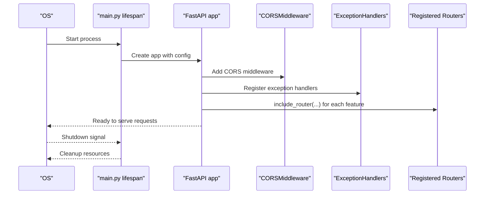

**Diagram sources**
- [backend/app/main.py](file://backend/app/main.py#L26-L83)
- [backend/app/core/exceptions.py](file://backend/app/core/exceptions.py#L71-L90)

**Section sources**
- [backend/app/main.py](file://backend/app/main.py#L26-L83)

### Router Registration and API Versioning
- Versioning strategy:
  - All routers mounted under a versioned prefix from settings.
  - Tags applied for grouping in docs.
- Endpoint organization:
  - Feature-based routers: auth, content, analytics, approvals, platforms, scheduling, memory, workspace, billing.
- Example registration pattern:
  - Authentication endpoints under the versioned auth prefix.
  - Content endpoints under the versioned content prefix.
  - Workspace endpoints under the versioned workspace prefix.

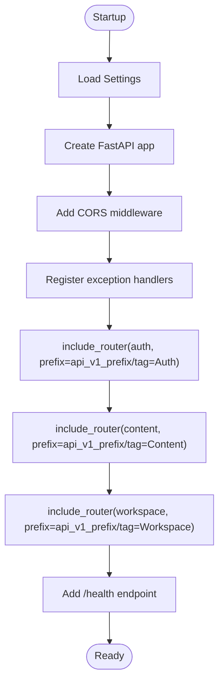

**Diagram sources**
- [backend/app/main.py](file://backend/app/main.py#L57-L77)
- [backend/app/config.py](file://backend/app/config.py#L23-L23)

**Section sources**
- [backend/app/main.py](file://backend/app/main.py#L57-L77)
- [backend/app/config.py](file://backend/app/config.py#L23-L23)

### Dependency Injection Setup
- Database dependency:
  - Provides an async session with commit/rollback semantics and cleanup.
- DI aliases:
  - DatabaseDep and SettingsDep enable concise type hints in routers.
- Typical usage:
  - Routers accept AsyncSession via Depends(get_db).
  - Services receive the session in their constructors.

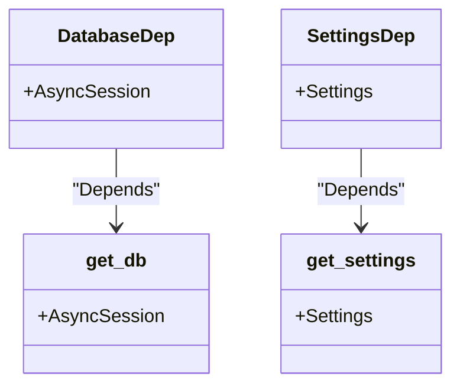

**Diagram sources**
- [backend/app/dependencies.py](file://backend/app/dependencies.py#L11-L14)
- [backend/app/database.py](file://backend/app/database.py#L32-L43)
- [backend/app/config.py](file://backend/app/config.py#L79-L83)

**Section sources**
- [backend/app/dependencies.py](file://backend/app/dependencies.py#L11-L14)
- [backend/app/database.py](file://backend/app/database.py#L32-L43)

### Configuration Management
- Settings class centralizes environment variables:
  - Application identity, environment, debug, API prefix.
  - Database and Redis connections.
  - JWT configuration.
  - External service credentials (OpenAI, Anthropic, Qdrant).
  - OAuth client credentials for social platforms.
  - Payment provider credentials (Stripe).
  - Frontend origin for CORS.
  - Monitoring keys.
- Caching:
  - Settings are cached via a factory function.

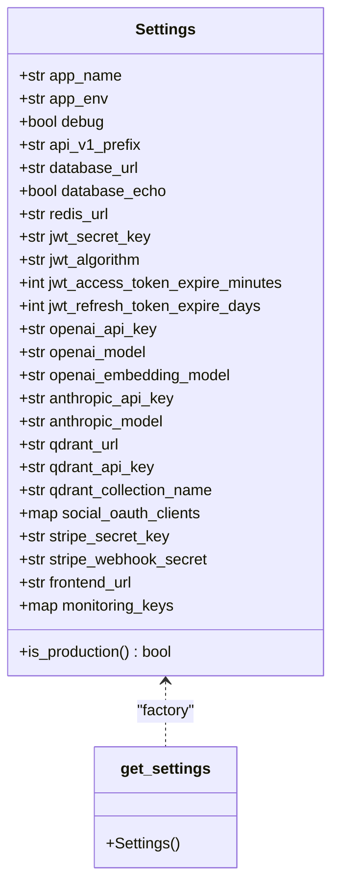

**Diagram sources**
- [backend/app/config.py](file://backend/app/config.py#L9-L83)

**Section sources**
- [backend/app/config.py](file://backend/app/config.py#L9-L83)

### Middleware Configuration
- CORS:
  - Origins configured from frontend URL setting.
  - Credentials, methods, and headers allowed broadly.
- Exception handling:
  - Custom exceptions mapped to appropriate HTTP status codes.
  - Generic handler ensures uncaught errors return a standardized 500 response.

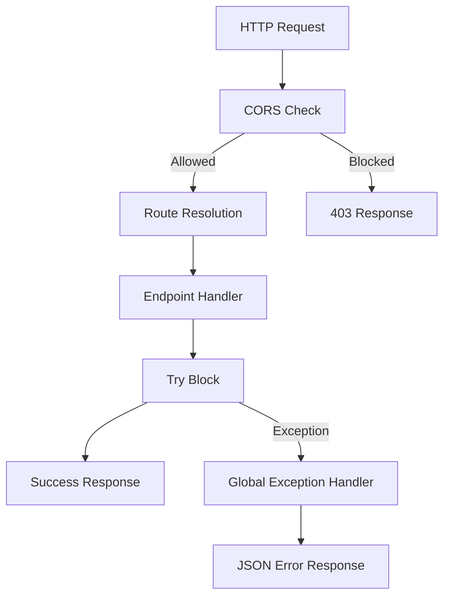

**Diagram sources**
- [backend/app/main.py](file://backend/app/main.py#L45-L55)
- [backend/app/core/exceptions.py](file://backend/app/core/exceptions.py#L71-L90)

**Section sources**
- [backend/app/main.py](file://backend/app/main.py#L45-L55)
- [backend/app/core/exceptions.py](file://backend/app/core/exceptions.py#L71-L90)

### Router Layer: Examples and Interactions
- Authentication router:
  - Endpoints for sign-up, login, token refresh, and current user profile.
  - Uses AuthService injected with AsyncSession.
- Content router:
  - Endpoints for generating content, variants, listing and managing drafts.
  - Uses ContentGenerationService injected with AsyncSession.
- Workspace router:
  - Endpoints for creating, retrieving, updating workspaces, listing members, inviting, and removing members.
  - Uses ContentGenerationService (shared for workspace-scoped content operations).

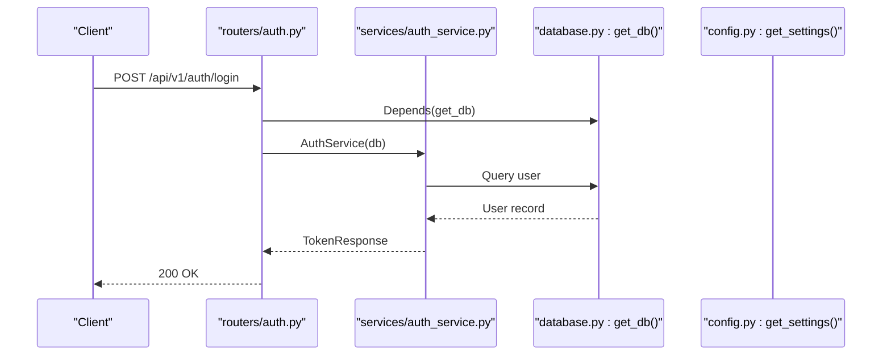

**Diagram sources**
- [backend/app/routers/auth.py](file://backend/app/routers/auth.py#L30-L37)
- [backend/app/services/auth_service.py](file://backend/app/services/auth_service.py#L35-L45)
- [backend/app/database.py](file://backend/app/database.py#L32-L43)
- [backend/app/config.py](file://backend/app/config.py#L79-L83)

**Section sources**
- [backend/app/routers/auth.py](file://backend/app/routers/auth.py#L1-L69)
- [backend/app/services/auth_service.py](file://backend/app/services/auth_service.py#L1-L68)
- [backend/app/routers/content.py](file://backend/app/routers/content.py#L1-L94)
- [backend/app/services/content_generation_service.py](file://backend/app/services/content_generation_service.py#L1-L98)
- [backend/app/routers/workspace.py](file://backend/app/routers/workspace.py#L1-L81)

### Domain Layer: Models and Relationships
- Users:
  - Identity, authentication, subscription tier, activity flags, timestamps.
  - Relationships to owned workspaces and workspace memberships.
- Workspaces:
  - Organization container with owner, slug, settings, and members.
  - Relationships to owner and members.
- Content sources:
  - Inputs for content generation with type, URL/text, extraction, and metadata.
  - Relationship to drafts.

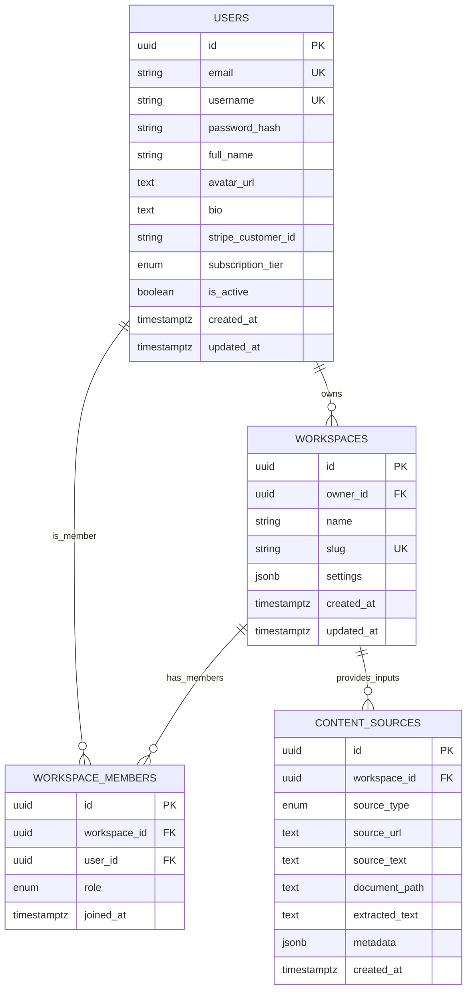

**Diagram sources**
- [backend/app/models/user.py](file://backend/app/models/user.py#L14-L48)
- [backend/app/models/workspace.py](file://backend/app/models/workspace.py#L14-L73)
- [backend/app/models/content.py](file://backend/app/models/content.py#L14-L42)

**Section sources**
- [backend/app/models/user.py](file://backend/app/models/user.py#L1-L48)
- [backend/app/models/workspace.py](file://backend/app/models/workspace.py#L1-L73)
- [backend/app/models/content.py](file://backend/app/models/content.py#L1-L42)

### Application Layer: Services
- AuthService:
  - Handles user registration, login, token refresh, current user retrieval, and updates.
  - Intended to use UserRepository via AsyncSession.
- ContentGenerationService:
  - Orchestrates multi-agent content creation, variants, draft lifecycle, and optimization.
  - Coordinates with LLM, Embedding, and Memory services conceptually.

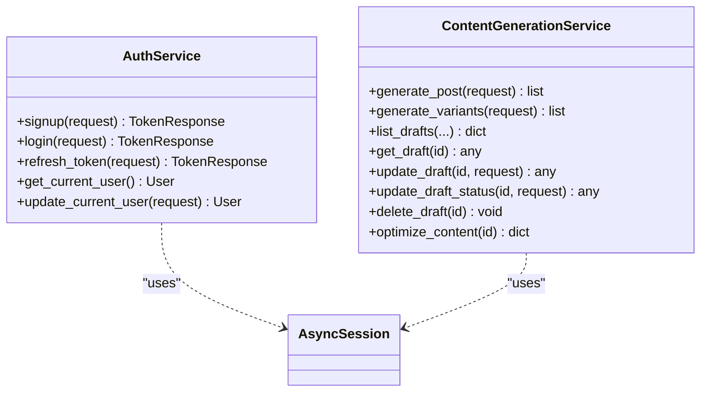

**Diagram sources**
- [backend/app/services/auth_service.py](file://backend/app/services/auth_service.py#L15-L68)
- [backend/app/services/content_generation_service.py](file://backend/app/services/content_generation_service.py#L13-L98)

**Section sources**
- [backend/app/services/auth_service.py](file://backend/app/services/auth_service.py#L1-L68)
- [backend/app/services/content_generation_service.py](file://backend/app/services/content_generation_service.py#L1-L98)

### Infrastructure Layer: Database and External Services
- Database:
  - Async engine with connection pooling and pre-ping.
  - Session factory with expiration policy.
  - Base declarative class for models.
- External services:
  - OpenAI, Anthropic, Qdrant, OAuth clients, Stripe, Redis, and monitoring keys configured via settings.

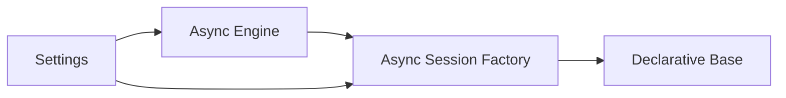

**Diagram sources**
- [backend/app/database.py](file://backend/app/database.py#L12-L30)
- [backend/app/config.py](file://backend/app/config.py#L25-L73)

**Section sources**
- [backend/app/database.py](file://backend/app/database.py#L1-L43)
- [backend/app/config.py](file://backend/app/config.py#L1-L83)

## Dependency Analysis
- Coupling and cohesion:
  - Routers depend on Services; Services depend on AsyncSession abstraction.
  - Models define domain contracts; Repositories would mediate persistence behind Services.
  - Configuration is a singleton accessed via a factory.
- External dependencies:
  - FastAPI, SQLAlchemy Async, Pydantic settings, and environment variables.
- Potential circular dependencies:
  - None observed among main modules; routers import services, services import database, and database does not import routers.

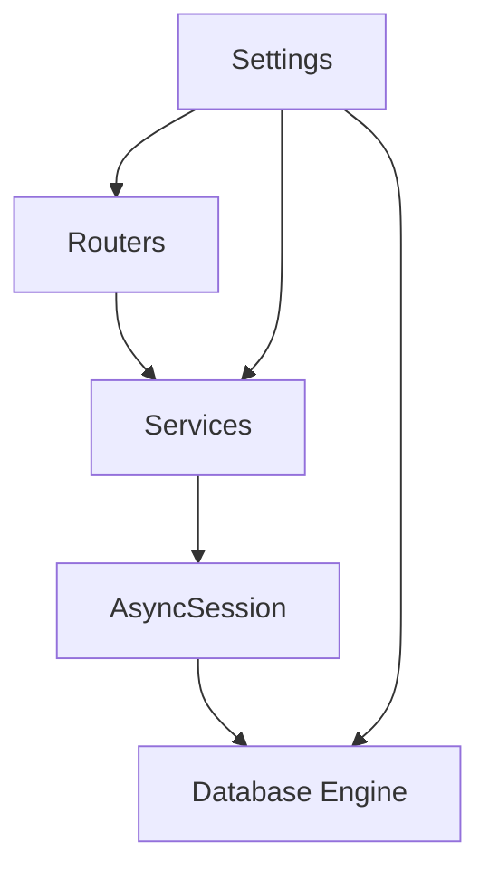

**Diagram sources**
- [backend/app/main.py](file://backend/app/main.py#L57-L77)
- [backend/app/services/auth_service.py](file://backend/app/services/auth_service.py#L18-L19)
- [backend/app/services/content_generation_service.py](file://backend/app/services/content_generation_service.py#L20-L21)
- [backend/app/database.py](file://backend/app/database.py#L12-L24)
- [backend/app/config.py](file://backend/app/config.py#L79-L83)

**Section sources**
- [backend/app/main.py](file://backend/app/main.py#L57-L77)
- [backend/app/services/auth_service.py](file://backend/app/services/auth_service.py#L18-L19)
- [backend/app/services/content_generation_service.py](file://backend/app/services/content_generation_service.py#L20-L21)
- [backend/app/database.py](file://backend/app/database.py#L12-L24)
- [backend/app/config.py](file://backend/app/config.py#L79-L83)

## Performance Considerations
- Asynchronous I/O:
  - Use of async SQLAlchemy sessions avoids blocking during I/O-bound operations.
- Connection pooling:
  - Engine configured with explicit pool size and overflow to handle concurrent requests efficiently.
- Session lifecycle:
  - Automatic commit on success, rollback on failure, and session closure reduce resource leaks.
- Recommendations:
  - Prefer selectin loading for relationships to minimize N+1 queries.
  - Use pagination and filtering in endpoints (already present in content/workspace routers).
  - Monitor external service latency and add timeouts for LLM and embedding calls.

[No sources needed since this section provides general guidance]

## Troubleshooting Guide
- Health check:
  - Use the /health endpoint to verify application readiness and environment.
- CORS issues:
  - Ensure frontend URL matches the configured origin.
- Exception handling:
  - Custom exceptions return structured JSON with status codes; generic exceptions return 500.
- Database connectivity:
  - Verify database URL and credentials; check logs for startup/shutdown messages.

**Section sources**
- [backend/app/main.py](file://backend/app/main.py#L79-L83)
- [backend/app/core/exceptions.py](file://backend/app/core/exceptions.py#L71-L90)
- [backend/app/config.py](file://backend/app/config.py#L25-L27)

## Conclusion
Socialium’s backend implements a clean, layered architecture with clear separation of concerns. The presentation layer exposes feature-based endpoints, the application layer encapsulates business logic, the domain layer defines persistent models, and the infrastructure layer provides database and external service integrations. Lifespan management, DI, configuration via environment variables, CORS, and centralized exception handling form a robust foundation. The modular router structure and versioned API prefix support scalable evolution.

[No sources needed since this section summarizes without analyzing specific files]

## Appendices
- Extending the application:
  - Add a new router under app/routers/ with endpoints and response models.
  - Implement a service in app/services/ to encapsulate business logic.
  - Define or reuse models in app/models/ and add repositories behind services if needed.
  - Register the router in app/main.py with the versioned prefix and tags.
  - Add environment variables to app/config.py and use SettingsDep where applicable.

[No sources needed since this section provides general guidance]