# Backend Architecture

<cite>
**Referenced Files in This Document**
- [backend/app/main.py](file://backend/app/main.py)
- [backend/app/config.py](file://backend/app/config.py)
- [backend/app/database.py](file://backend/app/database.py)
- [backend/app/dependencies.py](file://backend/app/dependencies.py)
- [backend/app/core/security.py](file://backend/app/core/security.py)
- [backend/app/core/exceptions.py](file://backend/app/core/exceptions.py)
- [backend/app/core/logging.py](file://backend/app/core/logging.py)
- [backend/app/core/constants.py](file://backend/app/core/constants.py)
- [backend/app/routers/auth.py](file://backend/app/routers/auth.py)
- [backend/app/routers/content.py](file://backend/app/routers/content.py)
- [backend/app/schemas/auth.py](file://backend/app/schemas/auth.py)
- [backend/app/services/auth_service.py](file://backend/app/services/auth_service.py)
- [backend/app/services/content_generation_service.py](file://backend/app/services/content_generation_service.py)
- [backend/app/models/user.py](file://backend/app/models/user.py)
- [backend/app/models/content.py](file://backend/app/models/content.py)
- [backend/app/repositories/user_repository.py](file://backend/app/repositories/user_repository.py)
- [backend/pyproject.toml](file://backend/pyproject.toml)
</cite>

## Table of Contents
1. [Introduction](#introduction)
2. [Project Structure](#project-structure)
3. [Core Components](#core-components)
4. [Architecture Overview](#architecture-overview)
5. [Detailed Component Analysis](#detailed-component-analysis)
6. [Dependency Analysis](#dependency-analysis)
7. [Performance Considerations](#performance-considerations)
8. [Troubleshooting Guide](#troubleshooting-guide)
9. [Conclusion](#conclusion)
10. [Appendices](#appendices)

## Introduction
This document describes the backend architecture of Socialium’s FastAPI application. It explains how the system follows a clean architecture pattern with clear separation between:
- Presentation (routers)
- Application (services)
- Domain (models)
- Infrastructure (database, external services)

It also documents application initialization, dependency injection, middleware configuration, routing and request/response flow, error handling, security (JWT, CORS), database integration (SQLAlchemy ORM, connection pooling, transactions), logging, monitoring, and cross-cutting concerns such as validation and rate limiting.

## Project Structure
The backend is organized into layered packages:
- app.main: Application entrypoint, lifespan, middleware, and router registration
- app.config: Centralized settings management using Pydantic Settings
- app.dependencies: Dependency injection type aliases
- app.database: Async SQLAlchemy engine, session factory, base model
- app.core: Security utilities, exception handlers, logging, constants
- app.models: SQLAlchemy ORM models
- app.repositories: Data access abstractions
- app.schemas: Pydantic request/response models
- app.services: Business logic orchestration
- app.routers: FastAPI route handlers
- app.workers: Background job coordination (future extension)

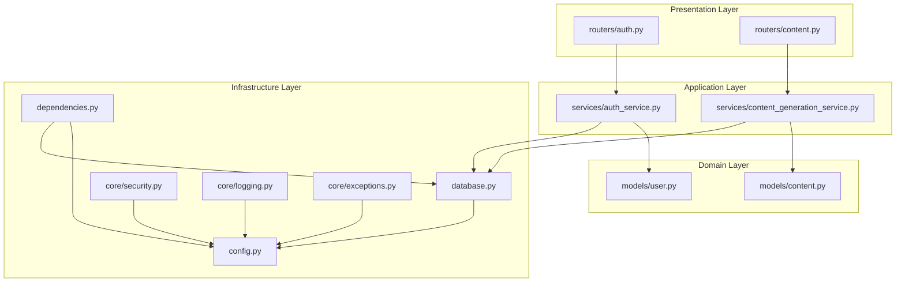

**Diagram sources**
- [backend/app/main.py](file://backend/app/main.py#L1-L83)
- [backend/app/config.py](file://backend/app/config.py#L1-L83)
- [backend/app/database.py](file://backend/app/database.py#L1-L43)
- [backend/app/dependencies.py](file://backend/app/dependencies.py#L1-L14)
- [backend/app/core/security.py](file://backend/app/core/security.py#L1-L50)
- [backend/app/core/exceptions.py](file://backend/app/core/exceptions.py#L1-L90)
- [backend/app/core/logging.py](file://backend/app/core/logging.py#L1-L25)
- [backend/app/routers/auth.py](file://backend/app/routers/auth.py#L1-L69)
- [backend/app/routers/content.py](file://backend/app/routers/content.py#L1-L94)
- [backend/app/services/auth_service.py](file://backend/app/services/auth_service.py#L1-L68)
- [backend/app/services/content_generation_service.py](file://backend/app/services/content_generation_service.py#L1-L98)
- [backend/app/models/user.py](file://backend/app/models/user.py#L1-L48)
- [backend/app/models/content.py](file://backend/app/models/content.py#L1-L42)

**Section sources**
- [backend/app/main.py](file://backend/app/main.py#L1-L83)
- [backend/app/config.py](file://backend/app/config.py#L1-L83)
- [backend/app/database.py](file://backend/app/database.py#L1-L43)
- [backend/app/dependencies.py](file://backend/app/dependencies.py#L1-L14)
- [backend/app/core/security.py](file://backend/app/core/security.py#L1-L50)
- [backend/app/core/exceptions.py](file://backend/app/core/exceptions.py#L1-L90)
- [backend/app/core/logging.py](file://backend/app/core/logging.py#L1-L25)
- [backend/app/routers/auth.py](file://backend/app/routers/auth.py#L1-L69)
- [backend/app/routers/content.py](file://backend/app/routers/content.py#L1-L94)
- [backend/app/services/auth_service.py](file://backend/app/services/auth_service.py#L1-L68)
- [backend/app/services/content_generation_service.py](file://backend/app/services/content_generation_service.py#L1-L98)
- [backend/app/models/user.py](file://backend/app/models/user.py#L1-L48)
- [backend/app/models/content.py](file://backend/app/models/content.py#L1-L42)

## Core Components
- Application entrypoint and lifecycle: Initializes FastAPI app, sets lifespan, registers middleware, exception handlers, and includes routers.
- Configuration: Centralized settings via Pydantic Settings with environment variable loading and caching.
- Dependency injection: Typed dependency aliases for database sessions and settings.
- Database: Async SQLAlchemy engine with connection pooling and automatic commit/rollback.
- Security: JWT utilities for token creation/refresh/verification and password hashing.
- Exceptions: Custom exception hierarchy and global handlers returning structured JSON responses.
- Logging: Structured logging configuration with leveled output and suppressed noisy loggers.
- Constants: Enumerations and platform limits used across services and schemas.

**Section sources**
- [backend/app/main.py](file://backend/app/main.py#L1-L83)
- [backend/app/config.py](file://backend/app/config.py#L1-L83)
- [backend/app/dependencies.py](file://backend/app/dependencies.py#L1-L14)
- [backend/app/database.py](file://backend/app/database.py#L1-L43)
- [backend/app/core/security.py](file://backend/app/core/security.py#L1-L50)
- [backend/app/core/exceptions.py](file://backend/app/core/exceptions.py#L1-L90)
- [backend/app/core/logging.py](file://backend/app/core/logging.py#L1-L25)
- [backend/app/core/constants.py](file://backend/app/core/constants.py#L1-L85)

## Architecture Overview
The system follows a layered clean architecture:
- Presentation (routers) accept requests and delegate to services.
- Application (services) encapsulate business logic and coordinate repositories/models.
- Domain (models) define persistent entities and relationships.
- Infrastructure (database, external services) provides persistence and integrations.

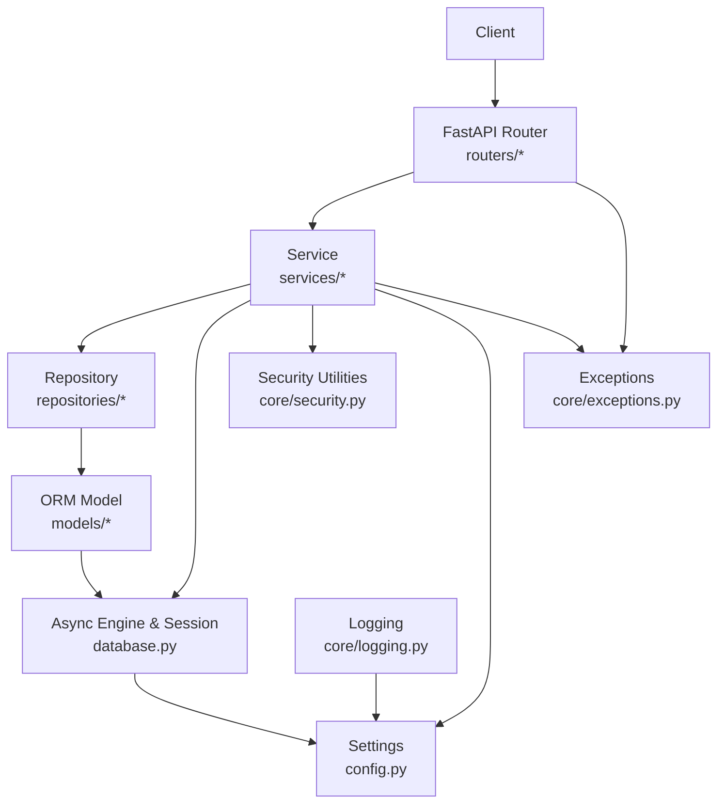

**Diagram sources**
- [backend/app/main.py](file://backend/app/main.py#L1-L83)
- [backend/app/routers/auth.py](file://backend/app/routers/auth.py#L1-L69)
- [backend/app/routers/content.py](file://backend/app/routers/content.py#L1-L94)
- [backend/app/services/auth_service.py](file://backend/app/services/auth_service.py#L1-L68)
- [backend/app/services/content_generation_service.py](file://backend/app/services/content_generation_service.py#L1-L98)
- [backend/app/repositories/user_repository.py](file://backend/app/repositories/user_repository.py#L1-L40)
- [backend/app/models/user.py](file://backend/app/models/user.py#L1-L48)
- [backend/app/models/content.py](file://backend/app/models/content.py#L1-L42)
- [backend/app/database.py](file://backend/app/database.py#L1-L43)
- [backend/app/config.py](file://backend/app/config.py#L1-L83)
- [backend/app/core/security.py](file://backend/app/core/security.py#L1-L50)
- [backend/app/core/logging.py](file://backend/app/core/logging.py#L1-L25)
- [backend/app/core/exceptions.py](file://backend/app/core/exceptions.py#L1-L90)

## Detailed Component Analysis

### Application Initialization and Lifecycle
- Lifespan: Startup/shutdown hooks print environment info and allow cleanup.
- Middleware: CORS configured for frontend origin with credentials, methods, and headers.
- Exception handlers: Global handlers for custom exceptions and generic errors.
- Router registration: Includes routers under a versioned prefix with tags.

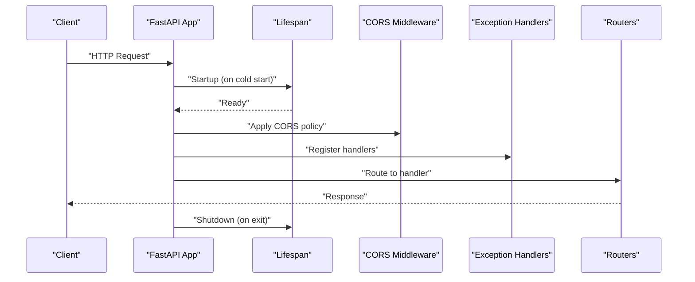

**Diagram sources**
- [backend/app/main.py](file://backend/app/main.py#L26-L58)

**Section sources**
- [backend/app/main.py](file://backend/app/main.py#L1-L83)

### Dependency Injection Setup
- Typed dependencies: DatabaseDep and SettingsDep enable consistent injection across routers and services.
- Session lifecycle: get_db yields a scoped AsyncSession, commits on success, rolls back on exceptions, and closes the session.

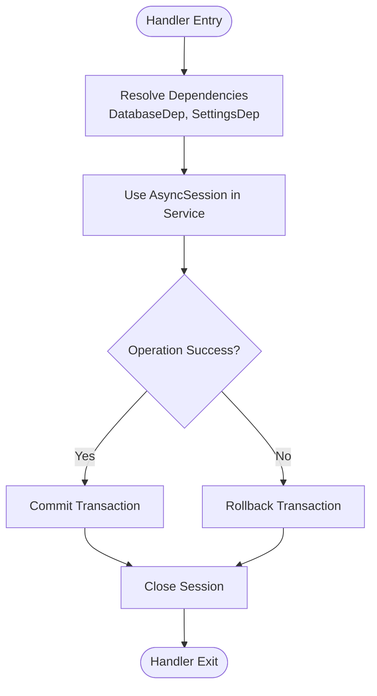

**Diagram sources**
- [backend/app/dependencies.py](file://backend/app/dependencies.py#L1-L14)
- [backend/app/database.py](file://backend/app/database.py#L32-L42)

**Section sources**
- [backend/app/dependencies.py](file://backend/app/dependencies.py#L1-L14)
- [backend/app/database.py](file://backend/app/database.py#L1-L43)

### Routing Structure and Request/Response Flow
- Routers define endpoints under a versioned prefix and tag groups.
- Handlers depend on get_db and construct service instances to process requests.
- Responses are Pydantic models validated automatically by FastAPI.

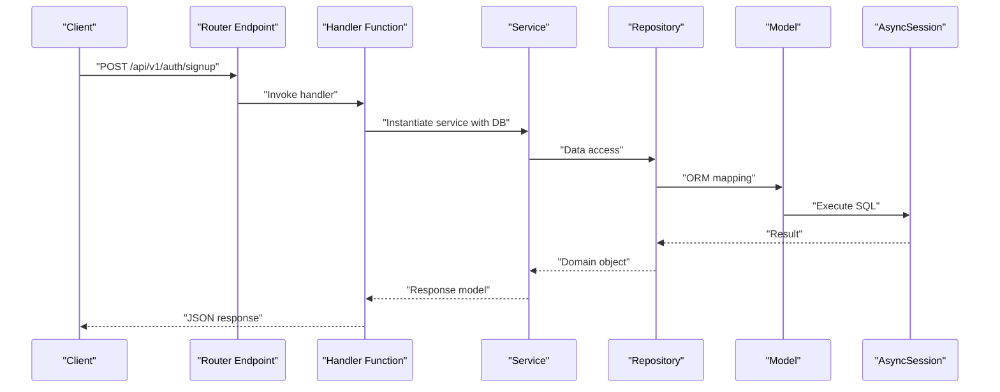

**Diagram sources**
- [backend/app/routers/auth.py](file://backend/app/routers/auth.py#L19-L27)
- [backend/app/services/auth_service.py](file://backend/app/services/auth_service.py#L21-L33)
- [backend/app/repositories/user_repository.py](file://backend/app/repositories/user_repository.py#L17-L19)
- [backend/app/models/user.py](file://backend/app/models/user.py#L14-L44)
- [backend/app/database.py](file://backend/app/database.py#L32-L42)

**Section sources**
- [backend/app/routers/auth.py](file://backend/app/routers/auth.py#L1-L69)
- [backend/app/routers/content.py](file://backend/app/routers/content.py#L1-L94)
- [backend/app/schemas/auth.py](file://backend/app/schemas/auth.py#L1-L63)
- [backend/app/services/auth_service.py](file://backend/app/services/auth_service.py#L1-L68)
- [backend/app/services/content_generation_service.py](file://backend/app/services/content_generation_service.py#L1-L98)

### Error Handling Mechanisms
- Custom exceptions: SocialiumException and specialized subclasses for common scenarios.
- Global handlers: Catch-all for SocialiumException and generic Python exceptions, returning structured JSON with status codes.

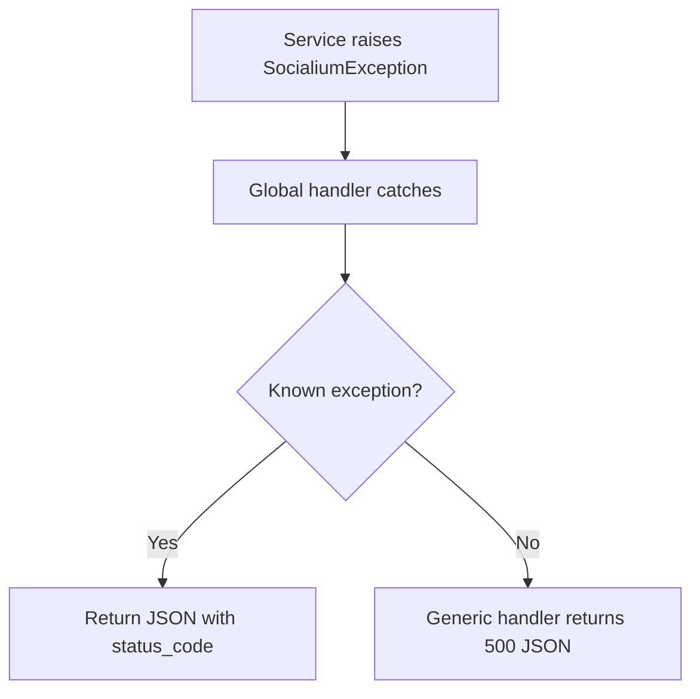

**Diagram sources**
- [backend/app/core/exceptions.py](file://backend/app/core/exceptions.py#L71-L89)

**Section sources**
- [backend/app/core/exceptions.py](file://backend/app/core/exceptions.py#L1-L90)

### Security Architecture: JWT Authentication and Authorization
- JWT utilities: Create access/refresh tokens with expiration, decode and validate tokens.
- Password hashing: bcrypt-based hashing and verification.
- Authorization pattern: Handlers instantiate services; JWT decoding is planned for extracting user identity (placeholder in current implementation).

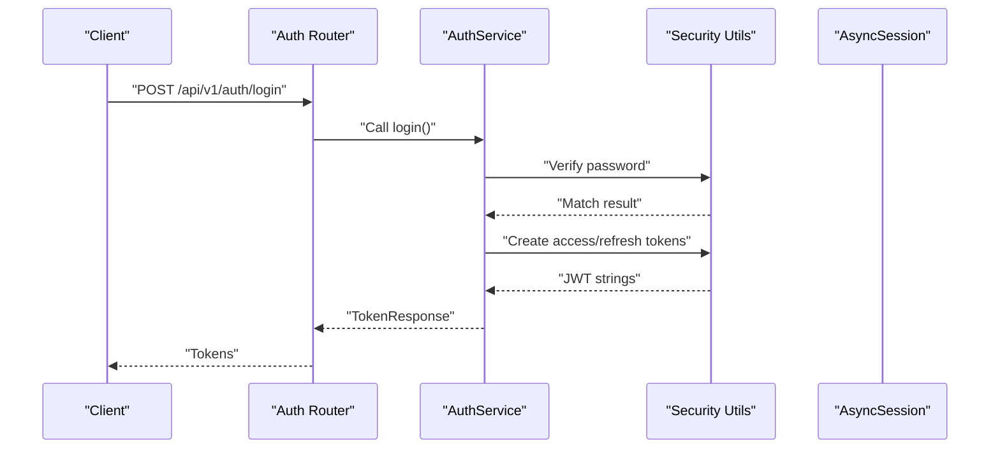

**Diagram sources**
- [backend/app/routers/auth.py](file://backend/app/routers/auth.py#L30-L37)
- [backend/app/services/auth_service.py](file://backend/app/services/auth_service.py#L35-L45)
- [backend/app/core/security.py](file://backend/app/core/security.py#L15-L49)

**Section sources**
- [backend/app/core/security.py](file://backend/app/core/security.py#L1-L50)
- [backend/app/routers/auth.py](file://backend/app/routers/auth.py#L1-L69)
- [backend/app/services/auth_service.py](file://backend/app/services/auth_service.py#L1-L68)

### CORS Configuration
- Configured during app initialization with origins from settings, allowing credentials, all methods, and headers.

**Section sources**
- [backend/app/main.py](file://backend/app/main.py#L45-L52)
- [backend/app/config.py](file://backend/app/config.py#L66-L67)

### Database Integration: SQLAlchemy ORM, Pooling, Transactions
- Engine: Async PostgreSQL engine with pre-ping, pool size, and overflow.
- Session factory: AsyncSession with expire_on_commit disabled for performance.
- Base model: Declarative base for ORM models.
- Session dependency: Provides a session per request, committing on success, rolling back on exceptions, and closing the session.

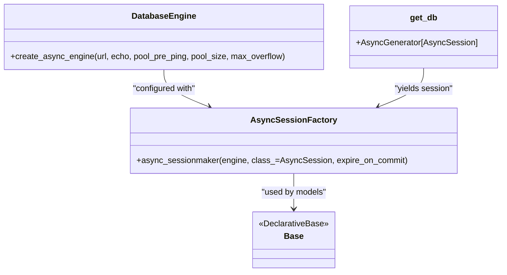

**Diagram sources**
- [backend/app/database.py](file://backend/app/database.py#L12-L24)
- [backend/app/database.py](file://backend/app/database.py#L27-L29)
- [backend/app/database.py](file://backend/app/database.py#L32-L42)

**Section sources**
- [backend/app/database.py](file://backend/app/database.py#L1-L43)
- [backend/app/models/user.py](file://backend/app/models/user.py#L1-L48)
- [backend/app/models/content.py](file://backend/app/models/content.py#L1-L42)

### Logging Architecture and Monitoring
- Logging: Structured format with timestamps, levels, and module names; noisy loggers suppressed.
- Monitoring keys: Langfuse and PostHog keys present in settings for observability.

**Section sources**
- [backend/app/core/logging.py](file://backend/app/core/logging.py#L1-L25)
- [backend/app/config.py](file://backend/app/config.py#L69-L72)

### Cross-Cutting Concerns: Validation and Rate Limiting
- Validation: Pydantic models define request/response schemas with field constraints.
- Rate limiting: Placeholder exception class exists; implementation is pending.

**Section sources**
- [backend/app/schemas/auth.py](file://backend/app/schemas/auth.py#L1-L63)
- [backend/app/core/exceptions.py](file://backend/app/core/exceptions.py#L54-L58)
- [backend/app/core/constants.py](file://backend/app/core/constants.py#L71-L76)

### Examples of Service Composition and Dependency Resolution
- Router to service: Handlers instantiate services with injected AsyncSession.
- Service orchestration: Services compose repositories and models to fulfill business logic.
- Configuration-driven behavior: Services rely on settings for external provider keys and limits.

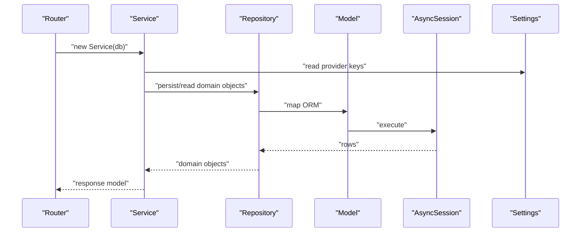

**Diagram sources**
- [backend/app/routers/content.py](file://backend/app/routers/content.py#L20-L27)
- [backend/app/services/content_generation_service.py](file://backend/app/services/content_generation_service.py#L23-L40)
- [backend/app/repositories/user_repository.py](file://backend/app/repositories/user_repository.py#L17-L19)
- [backend/app/models/content.py](file://backend/app/models/content.py#L14-L38)
- [backend/app/database.py](file://backend/app/database.py#L32-L42)
- [backend/app/config.py](file://backend/app/config.py#L38-L46)

**Section sources**
- [backend/app/routers/content.py](file://backend/app/routers/content.py#L1-L94)
- [backend/app/services/content_generation_service.py](file://backend/app/services/content_generation_service.py#L1-L98)
- [backend/app/repositories/user_repository.py](file://backend/app/repositories/user_repository.py#L1-L40)
- [backend/app/models/content.py](file://backend/app/models/content.py#L1-L42)
- [backend/app/config.py](file://backend/app/config.py#L1-L83)

## Dependency Analysis
- External libraries: FastAPI, Uvicorn, SQLAlchemy asyncio, Alembic, asyncpg, Pydantic, Pydantic Settings, python-jose, passlib, httpx, redis, APScheduler, Qdrant client, OpenAI, Anthropic, python-dotenv, email-validator.
- Internal dependencies: Routers depend on services; services depend on repositories and models; repositories depend on AsyncSession; services and routers depend on settings; security utilities depend on settings.

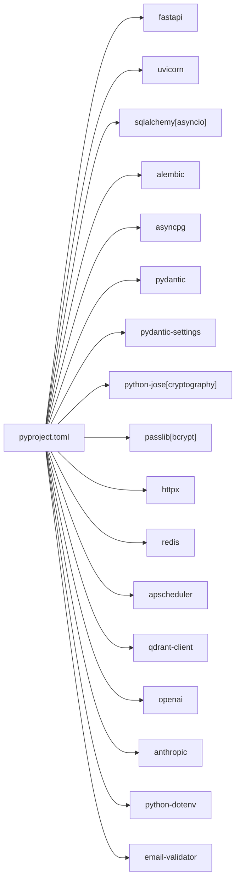

**Diagram sources**
- [backend/pyproject.toml](file://backend/pyproject.toml#L6-L25)

**Section sources**
- [backend/pyproject.toml](file://backend/pyproject.toml#L1-L49)

## Performance Considerations
- Async database: Uses SQLAlchemy asyncio for non-blocking IO.
- Connection pooling: Pre-ping enabled and tunable pool sizes reduce stale connections.
- Session lifecycle: Per-request sessions with automatic commit/rollback minimize long-lived transactions.
- Logging: Suppression of noisy third-party loggers reduces overhead.
- Recommendations: Use pagination for large lists, avoid N+1 queries with eager loading, and consider caching for repeated reads.

[No sources needed since this section provides general guidance]

## Troubleshooting Guide
- Health check: GET /health returns app status and environment.
- Exception handling: Global handlers return structured JSON with status codes; inspect logs for stack traces.
- CORS issues: Verify frontend URL in settings matches the origin making requests.
- Database connectivity: Confirm DATABASE_URL and credentials; check pool settings and timeouts.
- JWT problems: Ensure secret key and algorithm match; verify token expiration and claims.

**Section sources**
- [backend/app/main.py](file://backend/app/main.py#L78-L82)
- [backend/app/core/exceptions.py](file://backend/app/core/exceptions.py#L71-L89)
- [backend/app/config.py](file://backend/app/config.py#L25-L30)
- [backend/app/core/security.py](file://backend/app/core/security.py#L35-L39)

## Conclusion
Socialium’s backend implements a clean architecture with clear layer separation, robust dependency injection, and modular components. The design supports scalability, maintainability, and extensibility while providing strong foundations for authentication, persistence, and cross-cutting concerns. Future work includes implementing repository methods, completing JWT-based authorization, and adding rate limiting and background job orchestration.

[No sources needed since this section summarizes without analyzing specific files]

## Appendices

### Configuration Management Patterns
- Centralized settings via Pydantic Settings with environment file loading and caching.
- Environment-specific toggles for debug, docs URLs, and production readiness.

**Section sources**
- [backend/app/config.py](file://backend/app/config.py#L1-L83)

### Data Models Overview
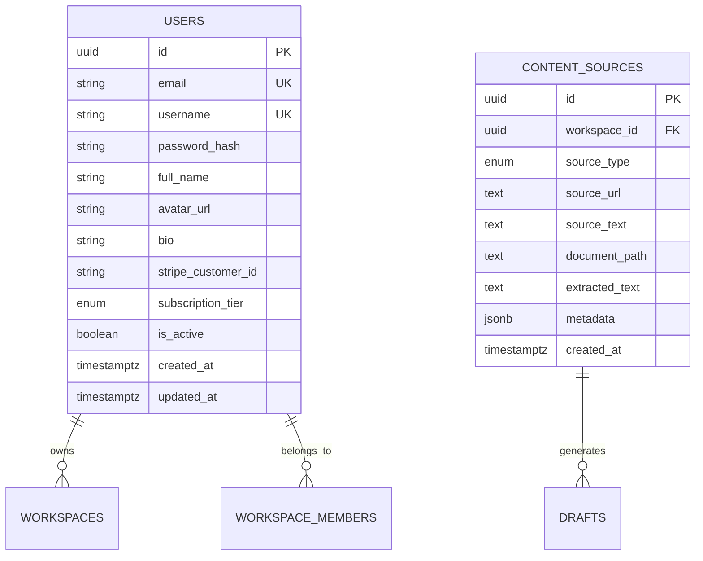

**Diagram sources**
- [backend/app/models/user.py](file://backend/app/models/user.py#L14-L44)
- [backend/app/models/content.py](file://backend/app/models/content.py#L14-L38)