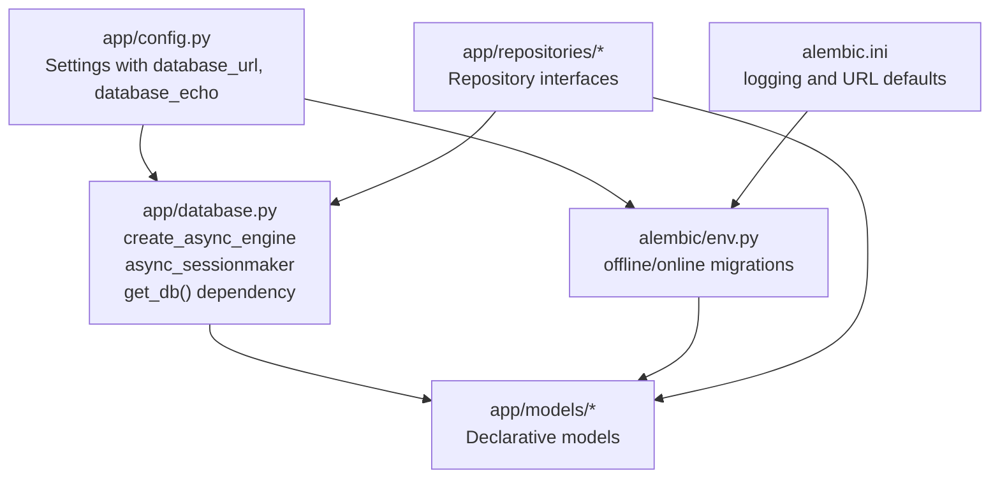
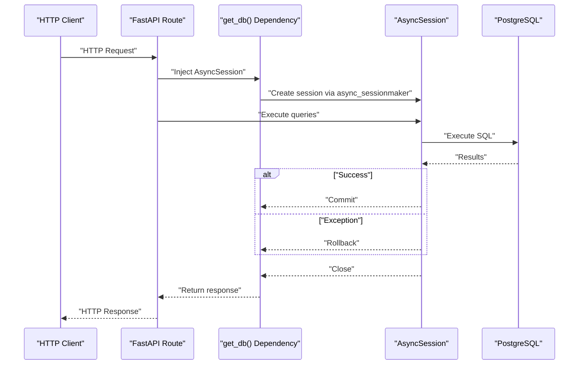
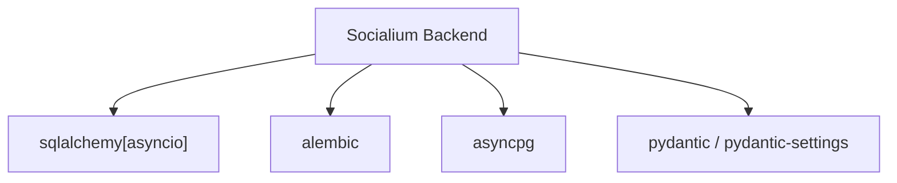

# Database Integration

<cite>
**Referenced Files in This Document**
- [backend/app/database.py](file://backend/app/database.py)
- [backend/app/config.py](file://backend/app/config.py)
- [backend/alembic/env.py](file://backend/alembic/env.py)
- [backend/alembic.ini](file://backend/alembic.ini)
- [backend/pyproject.toml](file://backend/pyproject.toml)
- [backend/app/models/__init__.py](file://backend/app/models/__init__.py)
- [backend/app/models/user.py](file://backend/app/models/user.py)
- [backend/app/models/workspace.py](file://backend/app/models/workspace.py)
- [backend/app/models/platform_account.py](file://backend/app/models/platform_account.py)
- [backend/app/models/content.py](file://backend/app/models/content.py)
- [backend/app/models/draft.py](file://backend/app/models/draft.py)
- [backend/app/models/approval.py](file://backend/app/models/approval.py)
- [backend/app/models/scheduled_post.py](file://backend/app/models/scheduled_post.py)
- [backend/app/repositories/user_repository.py](file://backend/app/repositories/user_repository.py)
</cite>

## Table of Contents
1. [Introduction](#introduction)
2. [Project Structure](#project-structure)
3. [Core Components](#core-components)
4. [Architecture Overview](#architecture-overview)
5. [Detailed Component Analysis](#detailed-component-analysis)
6. [Dependency Analysis](#dependency-analysis)
7. [Performance Considerations](#performance-considerations)
8. [Troubleshooting Guide](#troubleshooting-guide)
9. [Conclusion](#conclusion)
10. [Appendices](#appendices)

## Introduction
This document explains Socialium’s database integration built on SQLAlchemy 2.x with asynchronous PostgreSQL support. It covers connection management and pooling, async session lifecycle, the repository pattern for data access, model relationships and constraints, Alembic migrations, schema evolution, and operational best practices for security, backups, and monitoring.

## Project Structure
The backend organizes database concerns into cohesive modules:
- Configuration and environment-driven settings
- Async engine and session factory
- SQLAlchemy declarative base and models
- Alembic configuration for migrations
- Repository interfaces for data access



**Diagram sources**
- [backend/app/config.py](file://backend/app/config.py#L25-L27)
- [backend/app/database.py](file://backend/app/database.py#L12-L24)
- [backend/alembic/env.py](file://backend/alembic/env.py#L20-L22)
- [backend/alembic.ini](file://backend/alembic.ini#L6-L6)
- [backend/app/models/__init__.py](file://backend/app/models/__init__.py#L1-L24)

**Section sources**
- [backend/app/config.py](file://backend/app/config.py#L25-L27)
- [backend/app/database.py](file://backend/app/database.py#L12-L24)
- [backend/alembic/env.py](file://backend/alembic/env.py#L20-L22)
- [backend/alembic.ini](file://backend/alembic.ini#L6-L6)
- [backend/app/models/__init__.py](file://backend/app/models/__init__.py#L1-L24)

## Core Components
- Async engine and session factory configured with connection pooling and pre-ping
- Dependency provider yields sessions per request with automatic commit/rollback/close
- Alembic environment loads settings and registers all models for autogenerate
- Pydantic-based settings class centralizes environment-driven configuration

Key behaviors:
- Connection pooling: pre-ping enabled, pool size and overflow set for concurrency
- Session lifecycle: commit on success, rollback on exception, close in finally
- Migration environment: supports offline and online modes with async engine

**Section sources**
- [backend/app/database.py](file://backend/app/database.py#L12-L24)
- [backend/app/database.py](file://backend/app/database.py#L32-L42)
- [backend/alembic/env.py](file://backend/alembic/env.py#L44-L58)
- [backend/app/config.py](file://backend/app/config.py#L25-L27)

## Architecture Overview
The async database architecture integrates FastAPI dependency injection with SQLAlchemy AsyncSession. Requests receive a session via a dependency, which is committed on success or rolled back on errors.



**Diagram sources**
- [backend/app/database.py](file://backend/app/database.py#L32-L42)

**Section sources**
- [backend/app/database.py](file://backend/app/database.py#L32-L42)

## Detailed Component Analysis

### Connection Management and Pooling
- Engine creation uses an async PostgreSQL driver with:
  - Echo toggle for SQL logging
  - Pre-ping to validate connections before use
  - Pool sizing tuned for concurrent workloads
- Session factory disables expiration on commit to reduce overhead
- Dependency provider ensures proper transaction lifecycle

Operational notes:
- Adjust pool size and overflow according to database capacity and workload
- Enable echo only during development or targeted debugging

**Section sources**
- [backend/app/database.py](file://backend/app/database.py#L12-L18)
- [backend/app/database.py](file://backend/app/database.py#L20-L24)
- [backend/app/database.py](file://backend/app/database.py#L32-L42)
- [backend/app/config.py](file://backend/app/config.py#L25-L27)

### Alembic Migration System
- Environment loads settings and sets the SQLAlchemy URL for migrations
- Supports offline mode for deterministic migrations
- Online mode uses an async engine and runs within a transaction
- Imports all models to enable autogenerate detection of schema changes

Best practices:
- Run migrations in CI/CD pipelines before deployments
- Use offline mode for reproducible local testing
- Keep migrations reversible where feasible

**Section sources**
- [backend/alembic/env.py](file://backend/alembic/env.py#L20-L22)
- [backend/alembic/env.py](file://backend/alembic/env.py#L25-L35)
- [backend/alembic/env.py](file://backend/alembic/env.py#L44-L58)
- [backend/alembic.ini](file://backend/alembic.ini#L6-L6)

### Repository Pattern Implementation
- Repository interfaces define the contract for data access operations
- Current implementations are placeholders and require concrete persistence logic
- Sessions are injected into repositories to encapsulate data operations

Recommended implementation approach:
- Implement CRUD methods inside each repository using AsyncSession
- Centralize query logic and leverage relationships defined in models
- Wrap operations in transactions and handle exceptions appropriately

**Section sources**
- [backend/app/repositories/user_repository.py](file://backend/app/repositories/user_repository.py#L11-L39)

### Model Relationships, Constraints, and Indexing
Models define relationships and constraints that shape the schema:

- Users
  - Unique indexes on email and username
  - Back-populated relationships to owned workspaces and memberships
- Workspaces
  - Foreign keys to users (owner)
  - Unique index on slug
  - Relationships to members and platform accounts
- WorkspaceMembers
  - Composite foreign keys to workspace and user
  - Role enumeration with defaults
- PlatformAccounts
  - Foreign key to workspace
  - Encrypted tokens stored as text
- ContentSources
  - Foreign key to workspace with cascade delete
  - JSONB metadata storage
- Drafts
  - Foreign keys to workspace and optional content source
  - Enumerations for platform, tone, and status
  - Array of hashtags and numeric quality score
- Approvals and ApprovalComments
  - Foreign keys to draft and optional reviewers
  - Comments relationship with cascade delete
- ScheduledPosts
  - Unique constraint on draft_id
  - Foreign keys to draft and workspace
  - Recurrence and quiet hours configuration

Indexing highlights:
- Unique constraints enforce entity uniqueness
- Indexes on frequently filtered columns improve query performance
- JSONB fields can benefit from GIN or custom indexes depending on usage patterns

**Section sources**
- [backend/app/models/user.py](file://backend/app/models/user.py#L22-L23)
- [backend/app/models/workspace.py](file://backend/app/models/workspace.py#L26-L26)
- [backend/app/models/workspace.py](file://backend/app/models/workspace.py#L52-L56)
- [backend/app/models/platform_account.py](file://backend/app/models/platform_account.py#L22-L23)
- [backend/app/models/content.py](file://backend/app/models/content.py#L22-L24)
- [backend/app/models/draft.py](file://backend/app/models/draft.py#L23-L28)
- [backend/app/models/approval.py](file://backend/app/models/approval.py#L22-L27)
- [backend/app/models/scheduled_post.py](file://backend/app/models/scheduled_post.py#L21-L23)

### Transaction Management
- The dependency provider commits on success and rolls back on exceptions
- Ensures consistent state and prevents partial writes
- Closes the session in all cases to free resources

Guidelines:
- Keep long-running operations outside of single transactions
- Use nested transactions or savepoints for complex workflows
- Log transaction outcomes for observability

**Section sources**
- [backend/app/database.py](file://backend/app/database.py#L32-L42)

### Query Patterns and Optimization
Common patterns supported by the schema:
- Filtering by unique identifiers (UUID)
- Join-based retrieval leveraging relationships
- Aggregation and filtering on JSONB fields
- Enum-based filtering for statuses and roles

Optimization strategies:
- Add indexes on filter columns not covered by unique constraints
- Use selective fetching and eager loading where appropriate
- Prefer batch operations for bulk updates or inserts
- Monitor slow queries and add composite indexes as needed

[No sources needed since this section provides general guidance]

### Security Considerations
- Sensitive data handling
  - Tokens and encrypted fields are modeled as text; ensure encryption at rest and in transit
- Secrets management
  - Database credentials and API keys are environment-driven; avoid hardcoding
- Access control
  - Enforce workspace-level access checks in service layers
- Input validation
  - Validate and sanitize inputs before constructing queries

**Section sources**
- [backend/app/models/platform_account.py](file://backend/app/models/platform_account.py#L30-L31)
- [backend/app/config.py](file://backend/app/config.py#L25-L27)

### Backup and Monitoring Strategies
- Backups
  - Schedule regular logical backups of the PostgreSQL database
  - Test restore procedures periodically
- Monitoring
  - Track query latency and failure rates
  - Observe connection pool saturation and timeouts
  - Log slow queries and long transactions

[No sources needed since this section provides general guidance]

## Dependency Analysis
External dependencies relevant to database integration:
- SQLAlchemy 2.x with asyncio support
- Alembic for migrations
- asyncpg as the PostgreSQL driver
- Pydantic and pydantic-settings for configuration



**Diagram sources**
- [backend/pyproject.toml](file://backend/pyproject.toml#L9-L11)
- [backend/pyproject.toml](file://backend/pyproject.toml#L13-L13)
- [backend/pyproject.toml](file://backend/pyproject.toml#L6-L25)

**Section sources**
- [backend/pyproject.toml](file://backend/pyproject.toml#L6-L25)

## Performance Considerations
- Connection pooling
  - Tune pool size and overflow based on observed concurrency and database limits
  - Use pre-ping to avoid stale connections
- Query optimization
  - Add indexes on high-cardinality filter columns
  - Use EXPLAIN/ANALYZE to identify bottlenecks
- Batch operations
  - Prefer bulk inserts/updates for large datasets
- Caching
  - Cache read-heavy, stable data to reduce database load

[No sources needed since this section provides general guidance]

## Troubleshooting Guide
- Connection failures
  - Verify database URL and credentials in environment settings
  - Check network connectivity and firewall rules
- Migration issues
  - Confirm Alembic configuration and that all models are imported for autogenerate
  - Run migrations in offline mode to reproduce locally
- Transaction errors
  - Inspect dependency provider logs for exceptions and ensure rollback occurs
- Slow queries
  - Review query plans and add missing indexes
  - Consider partitioning large tables if applicable

**Section sources**
- [backend/app/config.py](file://backend/app/config.py#L25-L27)
- [backend/alembic/env.py](file://backend/alembic/env.py#L20-L22)
- [backend/app/database.py](file://backend/app/database.py#L32-L42)

## Conclusion
Socialium’s database layer leverages SQLAlchemy’s async capabilities with a clean separation of concerns: configuration, engine/session management, models, repositories, and migrations. By adhering to the outlined patterns—proper transaction lifecycle, thoughtful indexing, secure handling of sensitive data, and robust migration practices—the system can scale reliably in production while remaining maintainable.

## Appendices

### Data Model Diagram
```mermaid
erDiagram
USERS {
uuid id PK
string email UK
string username UK
string password_hash
string full_name
text avatar_url
text bio
string stripe_customer_id
enum subscription_tier
boolean is_active
timestamptz created_at
timestamptz updated_at
}
WORKSPACES {
uuid id PK
uuid owner_id FK
string name
string slug UK
jsonb settings
timestamptz created_at
timestamptz updated_at
}
WORKSPACE_MEMBERS {
uuid id PK
uuid workspace_id FK
uuid user_id FK
enum role
timestamptz joined_at
}
PLATFORM_ACCOUNTS {
uuid id PK
uuid workspace_id FK
enum platform
string platform_user_id
string platform_username
text access_token
text refresh_token
timestamptz token_expires_at
jsonb profile_data
boolean is_active
timestamptz connected_at
timestamptz last_synced_at
}
CONTENT_SOURCES {
uuid id PK
uuid workspace_id FK
enum source_type
text source_url
text source_text
text document_path
text extracted_text
jsonb metadata
timestamptz created_at
}
DRAFTS {
uuid id PK
uuid workspace_id FK
uuid content_source_id FK
enum platform
string headline
text body_text
string[] hashtags
text image_url
text image_prompt
string cta
enum tone
string ai_model
text generation_prompt
enum status
int character_count
numeric quality_score
boolean is_variant
uuid variant_group_id
timestamptz created_at
timestamptz updated_at
timestamptz published_at
}
APPROVALS {
uuid id PK
uuid draft_id FK
uuid reviewer_id FK
enum action
text feedback
int version
timestamptz created_at
}
APPROVAL_COMMENTS {
uuid id PK
uuid approval_id FK
uuid author_id FK
text content
timestamptz created_at
}
SCHEDULED_POSTS {
uuid id PK
uuid draft_id FK UK
uuid workspace_id FK
timestamptz scheduled_at
string timezone
boolean is_recurring
string recurrence_rule
timestamptz recurrence_end_date
boolean quiet_hours_enabled
string quiet_hours_start
string quiet_hours_end
string publish_status
text error_message
jsonb metadata
timestamptz created_at
timestamptz updated_at
}
USERS ||--o{ WORKSPACES : "owns"
USERS ||--o{ WORKSPACE_MEMBERS : "member_of"
WORKSPACES ||--o{ WORKSPACE_MEMBERS : "has"
WORKSPACES ||--o{ PLATFORM_ACCOUNTS : "has"
WORKSPACES ||--o{ CONTENT_SOURCES : "sources"
WORKSPACES ||--o{ DRAFTS : "generates"
CONTENT_SOURCES ||--o{ DRAFTS : "produces"
DRAFTS ||--o{ APPROVALS : "subject_of"
APPROVALS ||--o{ APPROVAL_COMMENTS : "commented_on"
DRAFTS ||--|| SCHEDULED_POSTS : "scheduled_for"
WORKSPACES ||--o{ SCHEDULED_POSTS : "hosts"
```

**Diagram sources**
- [backend/app/models/user.py](file://backend/app/models/user.py#L14-L47)
- [backend/app/models/workspace.py](file://backend/app/models/workspace.py#L14-L72)
- [backend/app/models/platform_account.py](file://backend/app/models/platform_account.py#L14-L48)
- [backend/app/models/content.py](file://backend/app/models/content.py#L14-L41)
- [backend/app/models/draft.py](file://backend/app/models/draft.py#L15-L70)
- [backend/app/models/approval.py](file://backend/app/models/approval.py#L14-L68)
- [backend/app/models/scheduled_post.py](file://backend/app/models/scheduled_post.py#L13-L55)