# Security & Authentication

<cite>
**Referenced Files in This Document**
- [backend/app/core/security.py](file://backend/app/core/security.py)
- [backend/app/core/exceptions.py](file://backend/app/core/exceptions.py)
- [backend/app/routers/auth.py](file://backend/app/routers/auth.py)
- [backend/app/services/auth_service.py](file://backend/app/services/auth_service.py)
- [backend/app/schemas/auth.py](file://backend/app/schemas/auth.py)
- [backend/app/models/user.py](file://backend/app/models/user.py)
- [backend/app/models/workspace.py](file://backend/app/models/workspace.py)
- [backend/app/core/constants.py](file://backend/app/core/constants.py)
- [backend/app/config.py](file://backend/app/config.py)
- [backend/app/main.py](file://backend/app/main.py)
- [backend/app/dependencies.py](file://backend/app/dependencies.py)
- [backend/app/repositories/user_repository.py](file://backend/app/repositories/user_repository.py)
- [backend/pyproject.toml](file://backend/pyproject.toml)
</cite>

## Table of Contents
1. [Introduction](#introduction)
2. [Project Structure](#project-structure)
3. [Core Components](#core-components)
4. [Architecture Overview](#architecture-overview)
5. [Detailed Component Analysis](#detailed-component-analysis)
6. [Dependency Analysis](#dependency-analysis)
7. [Performance Considerations](#performance-considerations)
8. [Troubleshooting Guide](#troubleshooting-guide)
9. [Conclusion](#conclusion)
10. [Appendices](#appendices)

## Introduction
This document provides comprehensive security and authentication documentation for Socialium’s backend. It explains the JWT-based authentication system, token generation and validation, refresh token management, password hashing, and session management. It also covers authorization patterns including role-based access control (RBAC), workspace-level permissions, and multi-tenant security boundaries. Additionally, it documents the exception handling architecture for security-related errors, CORS configuration, and outlines best practices for protecting a social media automation platform from common vulnerabilities.

## Project Structure
The security and authentication subsystem is organized around:
- Configuration and settings
- Core security utilities (JWT and password hashing)
- Authentication router and service
- Data models for users and workspaces
- Constants for roles and permissions
- Exception handling and CORS middleware
- Dependency injection for DI and typed dependencies

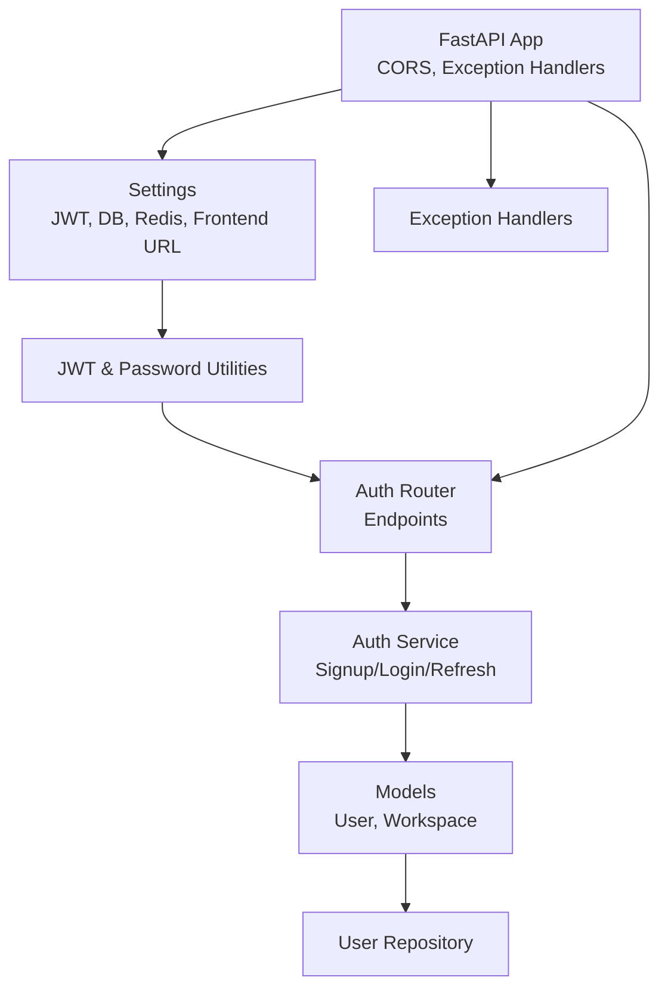

**Diagram sources**
- [backend/app/config.py](file://backend/app/config.py#L9-L76)
- [backend/app/core/security.py](file://backend/app/core/security.py#L1-L50)
- [backend/app/routers/auth.py](file://backend/app/routers/auth.py#L1-L69)
- [backend/app/services/auth_service.py](file://backend/app/services/auth_service.py#L1-L68)
- [backend/app/models/user.py](file://backend/app/models/user.py#L1-L48)
- [backend/app/models/workspace.py](file://backend/app/models/workspace.py#L1-L73)
- [backend/app/core/exceptions.py](file://backend/app/core/exceptions.py#L71-L90)
- [backend/app/main.py](file://backend/app/main.py#L45-L52)

**Section sources**
- [backend/app/main.py](file://backend/app/main.py#L1-L83)
- [backend/app/config.py](file://backend/app/config.py#L1-L83)

## Core Components
- JWT utilities: Access and refresh token creation, decoding/validation, and password hashing/verification.
- Authentication router: Exposes endpoints for sign-up, login, token refresh, and current user profile.
- Authentication service: Orchestrates business logic for authentication flows and token lifecycle.
- Data models: User and Workspace with relationships enabling RBAC and tenant isolation.
- Constants: Workspace roles and enums used for authorization checks.
- Exception handling: Centralized handlers for security-related exceptions.
- CORS: Middleware configured with frontend origin and credentials support.

**Section sources**
- [backend/app/core/security.py](file://backend/app/core/security.py#L1-L50)
- [backend/app/routers/auth.py](file://backend/app/routers/auth.py#L1-L69)
- [backend/app/services/auth_service.py](file://backend/app/services/auth_service.py#L1-L68)
- [backend/app/models/user.py](file://backend/app/models/user.py#L1-L48)
- [backend/app/models/workspace.py](file://backend/app/models/workspace.py#L1-L73)
- [backend/app/core/constants.py](file://backend/app/core/constants.py#L39-L44)
- [backend/app/core/exceptions.py](file://backend/app/core/exceptions.py#L71-L90)
- [backend/app/main.py](file://backend/app/main.py#L45-L52)

## Architecture Overview
The authentication architecture follows a layered design:
- Presentation layer: FastAPI router exposes endpoints.
- Service layer: Auth service encapsulates business logic.
- Persistence layer: SQLAlchemy ORM models and repository interface.
- Security utilities: JWT and password hashing utilities.
- Configuration: Pydantic settings for secrets and algorithms.
- Middleware: CORS and centralized exception handling.

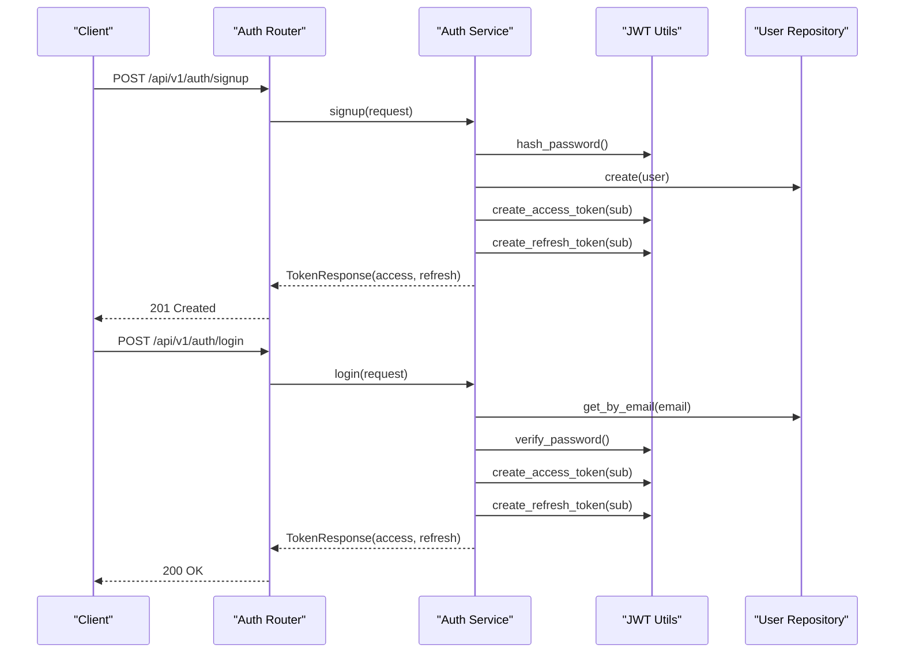

**Diagram sources**
- [backend/app/routers/auth.py](file://backend/app/routers/auth.py#L20-L37)
- [backend/app/services/auth_service.py](file://backend/app/services/auth_service.py#L21-L45)
- [backend/app/core/security.py](file://backend/app/core/security.py#L15-L40)
- [backend/app/repositories/user_repository.py](file://backend/app/repositories/user_repository.py#L17-L19)

## Detailed Component Analysis

### JWT-Based Authentication System
- Access token: Short-lived token with “access” type and expiration derived from settings.
- Refresh token: Long-lived token with “refresh” type and expiration derived from settings.
- Token decoding: Validates signature and algorithm, returning payload or None on failure.
- Secret and algorithm: Loaded from settings for signing and verification.

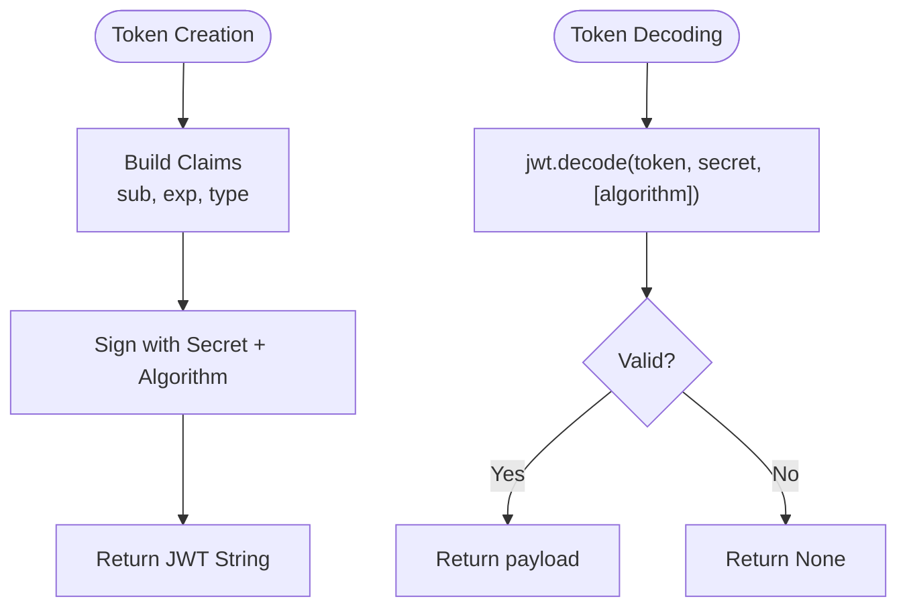

**Diagram sources**
- [backend/app/core/security.py](file://backend/app/core/security.py#L25-L40)
- [backend/app/core/security.py](file://backend/app/core/security.py#L43-L49)
- [backend/app/config.py](file://backend/app/config.py#L32-L36)

**Section sources**
- [backend/app/core/security.py](file://backend/app/core/security.py#L1-L50)
- [backend/app/config.py](file://backend/app/config.py#L32-L36)

### Password Hashing Implementation
- Uses bcrypt via passlib CryptContext.
- Hashing occurs during user creation.
- Verification compares plain password against stored hash.

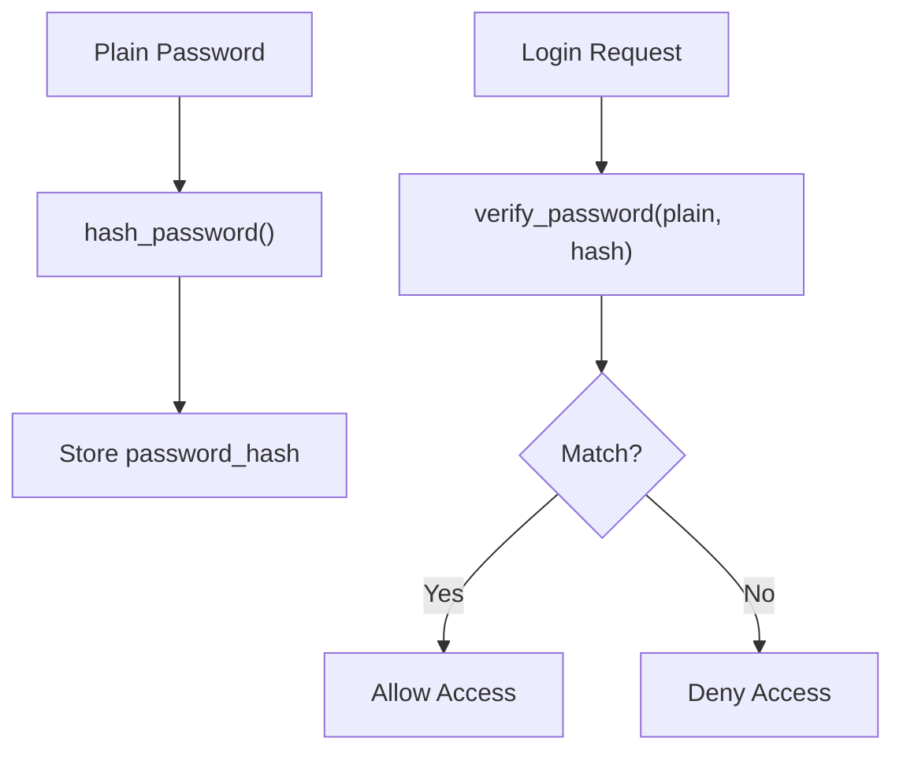

**Diagram sources**
- [backend/app/core/security.py](file://backend/app/core/security.py#L15-L22)

**Section sources**
- [backend/app/core/security.py](file://backend/app/core/security.py#L12-L22)

### Token Generation and Validation Processes
- Access token generation sets expiration minutes from settings.
- Refresh token generation sets expiration days from settings.
- Decoding validates algorithm and secret; returns None on failure.

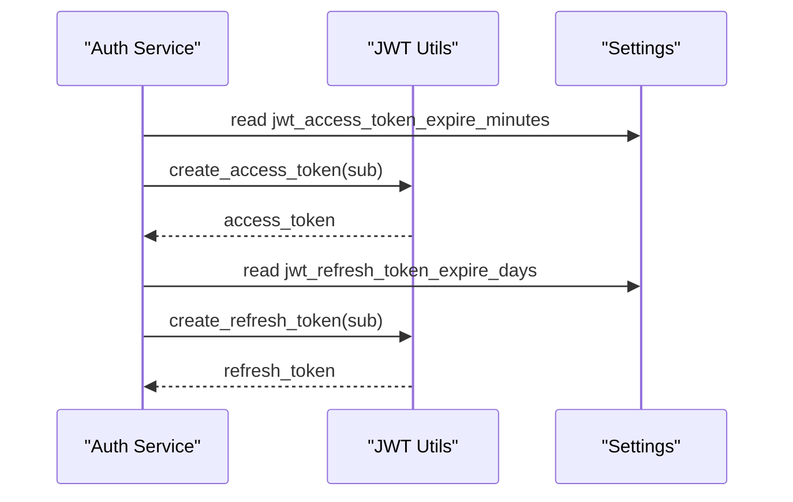

**Diagram sources**
- [backend/app/services/auth_service.py](file://backend/app/services/auth_service.py#L35-L57)
- [backend/app/core/security.py](file://backend/app/core/security.py#L25-L40)
- [backend/app/config.py](file://backend/app/config.py#L35-L36)

**Section sources**
- [backend/app/services/auth_service.py](file://backend/app/services/auth_service.py#L35-L57)
- [backend/app/core/security.py](file://backend/app/core/security.py#L25-L40)
- [backend/app/config.py](file://backend/app/config.py#L35-L36)

### Refresh Token Management
- Endpoint accepts refresh_token in request body.
- Service must decode and validate the refresh token, confirm user existence and activity, then issue new token pair.

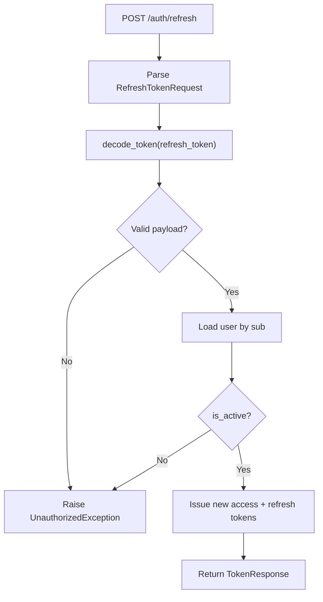

**Diagram sources**
- [backend/app/routers/auth.py](file://backend/app/routers/auth.py#L40-L47)
- [backend/app/services/auth_service.py](file://backend/app/services/auth_service.py#L47-L57)
- [backend/app/core/security.py](file://backend/app/core/security.py#L43-L49)
- [backend/app/core/exceptions.py](file://backend/app/core/exceptions.py#L26-L30)

**Section sources**
- [backend/app/routers/auth.py](file://backend/app/routers/auth.py#L40-L47)
- [backend/app/services/auth_service.py](file://backend/app/services/auth_service.py#L47-L57)
- [backend/app/core/security.py](file://backend/app/core/security.py#L43-L49)
- [backend/app/core/exceptions.py](file://backend/app/core/exceptions.py#L26-L30)

### Authorization Patterns: RBAC and Workspace-Level Permissions
- Workspace roles define membership permissions.
- Multi-tenant boundary: Workspaces isolate resources; access requires membership and appropriate role.
- Authorization checks should be enforced at service/router boundaries using workspace membership queries.

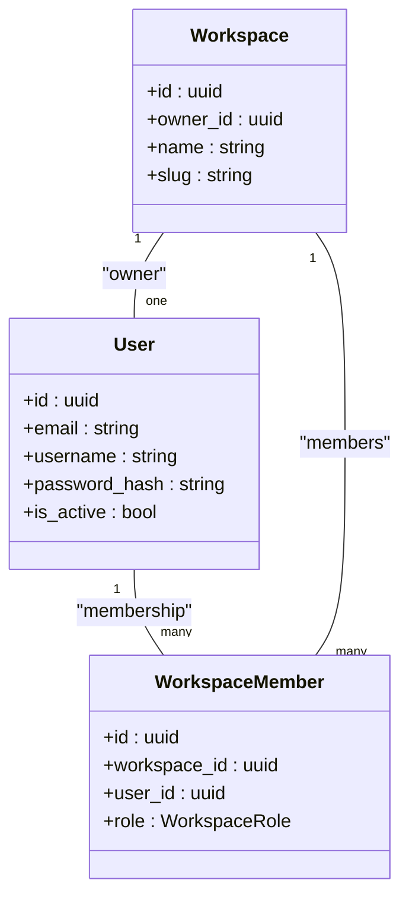

**Diagram sources**
- [backend/app/models/user.py](file://backend/app/models/user.py#L14-L44)
- [backend/app/models/workspace.py](file://backend/app/models/workspace.py#L14-L72)
- [backend/app/core/constants.py](file://backend/app/core/constants.py#L39-L44)

**Section sources**
- [backend/app/models/user.py](file://backend/app/models/user.py#L1-L48)
- [backend/app/models/workspace.py](file://backend/app/models/workspace.py#L1-L73)
- [backend/app/core/constants.py](file://backend/app/core/constants.py#L39-L44)

### Protected Endpoints and Authentication Middleware Usage
- Current user endpoints: GET /api/v1/auth/me and PUT /api/v1/auth/me are declared but not yet wired to extract user from JWT.
- Authentication middleware: Not implemented in the backend; JWT verification is pending in service methods.
- Recommendation: Add a dependency that extracts user_id from access token claims and injects the current user into handlers.

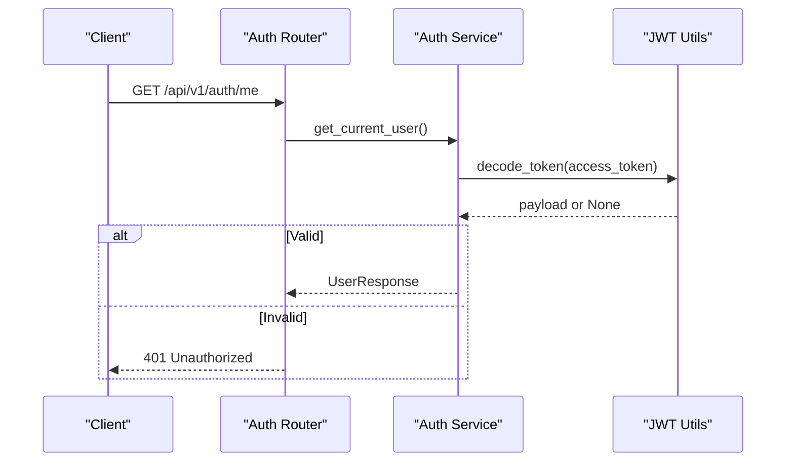

**Diagram sources**
- [backend/app/routers/auth.py](file://backend/app/routers/auth.py#L50-L67)
- [backend/app/services/auth_service.py](file://backend/app/services/auth_service.py#L59-L62)
- [backend/app/core/security.py](file://backend/app/core/security.py#L43-L49)
- [backend/app/core/exceptions.py](file://backend/app/core/exceptions.py#L26-L30)

**Section sources**
- [backend/app/routers/auth.py](file://backend/app/routers/auth.py#L50-L67)
- [backend/app/services/auth_service.py](file://backend/app/services/auth_service.py#L59-L62)
- [backend/app/core/security.py](file://backend/app/core/security.py#L43-L49)
- [backend/app/core/exceptions.py](file://backend/app/core/exceptions.py#L26-L30)

### Secure Cookie Handling and Session Management
- Current implementation uses bearer tokens in HTTP responses and does not set cookies.
- For cookie-based sessions, configure SameSite, Secure, HttpOnly flags, and domain/path carefully.
- Consider rotating refresh tokens and maintaining blacklists or short-lived refresh windows.

[No sources needed since this section provides general guidance]

### Exception Handling Architecture for Security-Related Errors
- Centralized exception handlers convert custom exceptions to JSON responses with appropriate status codes.
- Security-related exceptions: UnauthorizedException (401), ForbiddenException (403), RateLimitException (429).

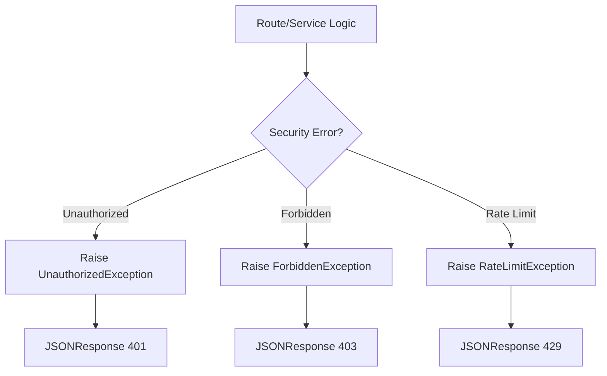

**Diagram sources**
- [backend/app/core/exceptions.py](file://backend/app/core/exceptions.py#L71-L89)
- [backend/app/core/exceptions.py](file://backend/app/core/exceptions.py#L26-L37)
- [backend/app/core/exceptions.py](file://backend/app/core/exceptions.py#L54-L58)

**Section sources**
- [backend/app/core/exceptions.py](file://backend/app/core/exceptions.py#L1-L90)

### CORS Configuration
- CORS allows credentials and all methods/headers from the configured frontend URL.
- Ensure frontend_url matches the deployed frontend origin.

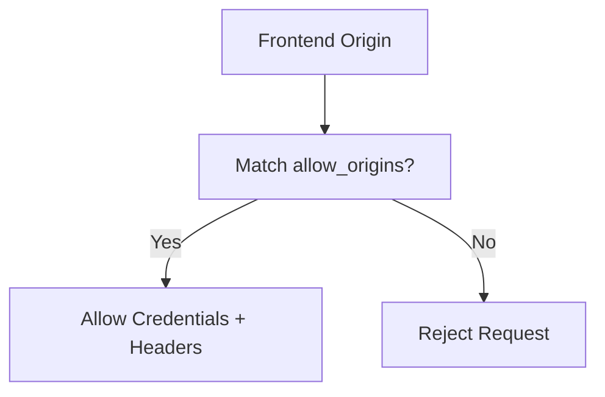

**Diagram sources**
- [backend/app/main.py](file://backend/app/main.py#L45-L52)
- [backend/app/config.py](file://backend/app/config.py#L67-L67)

**Section sources**
- [backend/app/main.py](file://backend/app/main.py#L45-L52)
- [backend/app/config.py](file://backend/app/config.py#L67-L67)

### Rate Limiting Mechanisms
- No explicit rate limiting middleware is present in the backend.
- Recommended: Integrate a rate limiting library to protect sensitive endpoints (login, refresh, signup) and enforce per-tier limits.

[No sources needed since this section provides general guidance]

## Dependency Analysis
- External libraries include FastAPI, python-jose for JWT, passlib for bcrypt, and pydantic-settings for configuration.
- Internal dependencies: settings, security utilities, routers, services, models, and exceptions.

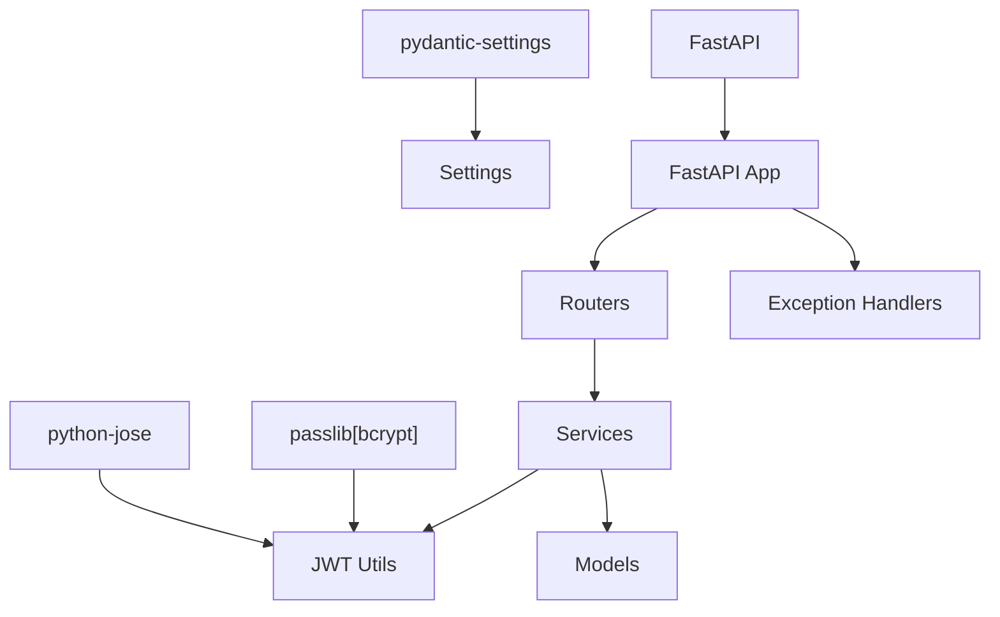

**Diagram sources**
- [backend/pyproject.toml](file://backend/pyproject.toml#L6-L25)
- [backend/app/main.py](file://backend/app/main.py#L1-L83)
- [backend/app/core/security.py](file://backend/app/core/security.py#L1-L50)
- [backend/app/config.py](file://backend/app/config.py#L1-L83)
- [backend/app/core/exceptions.py](file://backend/app/core/exceptions.py#L71-L90)

**Section sources**
- [backend/pyproject.toml](file://backend/pyproject.toml#L1-L49)
- [backend/app/main.py](file://backend/app/main.py#L1-L83)

## Performance Considerations
- Keep token lifetimes minimal for access tokens and refresh tokens to reduce exposure windows.
- Offload token validation to CPU-optimized libraries and avoid unnecessary decoding.
- Cache user roles and permissions per request when possible to minimize database round-trips.

[No sources needed since this section provides general guidance]

## Troubleshooting Guide
- 401 Unauthorized on protected endpoints: Verify access token presence and validity; ensure token type is “access” and not expired.
- 403 Forbidden: Confirm user has required workspace role and permissions.
- 429 Too Many Requests: Implement rate limiting for login/signup endpoints.
- CORS failures: Ensure frontend_url matches the origin and credentials are enabled.

**Section sources**
- [backend/app/core/exceptions.py](file://backend/app/core/exceptions.py#L26-L37)
- [backend/app/core/exceptions.py](file://backend/app/core/exceptions.py#L54-L58)
- [backend/app/main.py](file://backend/app/main.py#L45-L52)
- [backend/app/config.py](file://backend/app/config.py#L67-L67)

## Conclusion
Socialium’s backend establishes a solid foundation for authentication and security using JWT, bcrypt-based password hashing, and structured configuration. The current implementation provides endpoints and utilities for sign-up, login, and refresh flows, with models and constants supporting RBAC and workspace-level permissions. To harden the system for production, integrate authentication middleware, implement robust rate limiting, and enforce authorization checks at service boundaries. Apply secure cookie practices if adopting cookie-based sessions and continuously audit for common vulnerabilities in social media automation contexts.

## Appendices

### Best Practices Checklist
- Enforce HTTPS and secure headers.
- Rotate secrets regularly and restrict JWT secret storage.
- Sanitize and validate all inputs; apply rate limiting.
- Use least privilege for workspace roles and enforce RBAC.
- Log security-relevant events without storing sensitive data.
- Audit token lifecycle and refresh token rotation.

[No sources needed since this section provides general guidance]