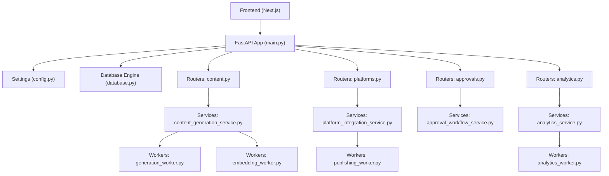
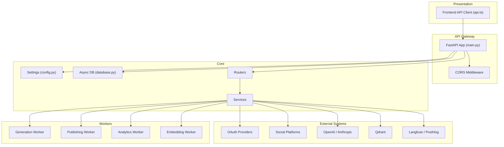
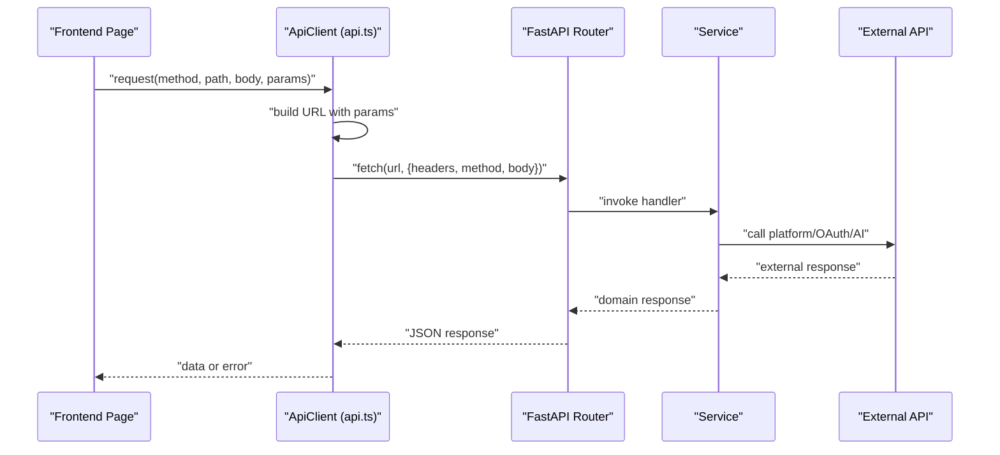
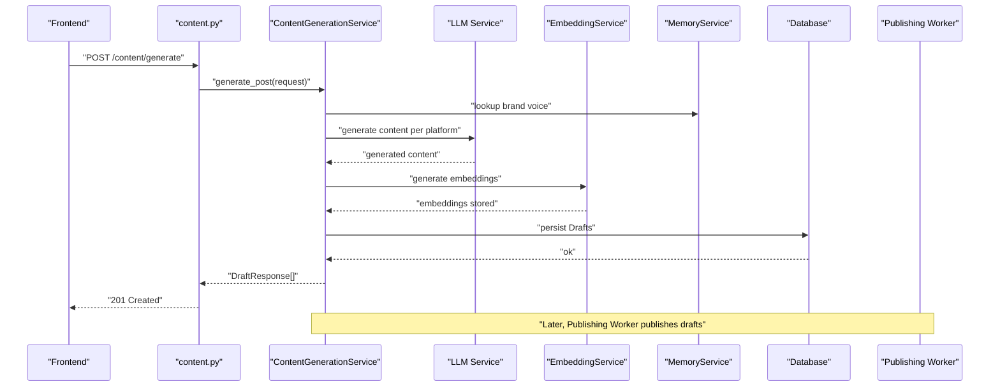
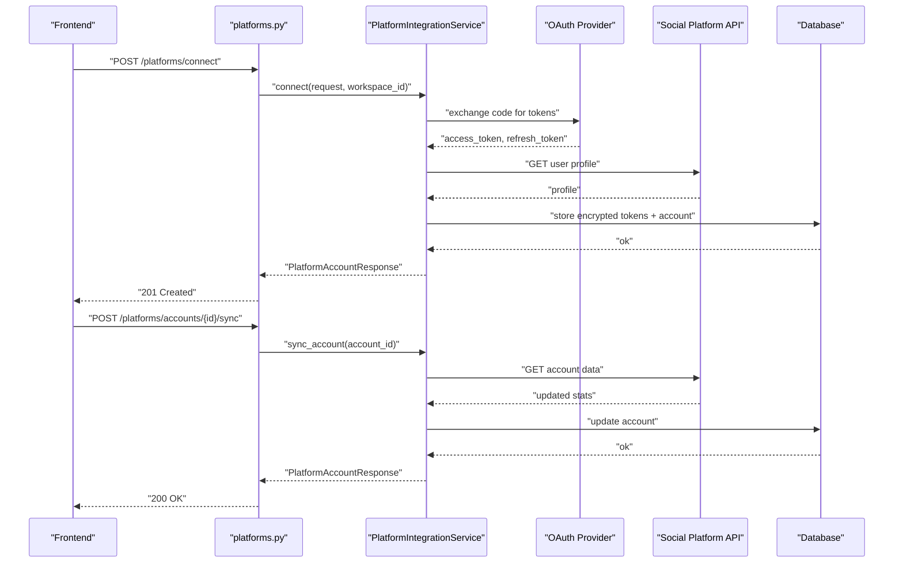
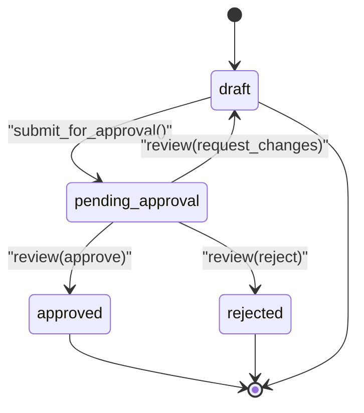
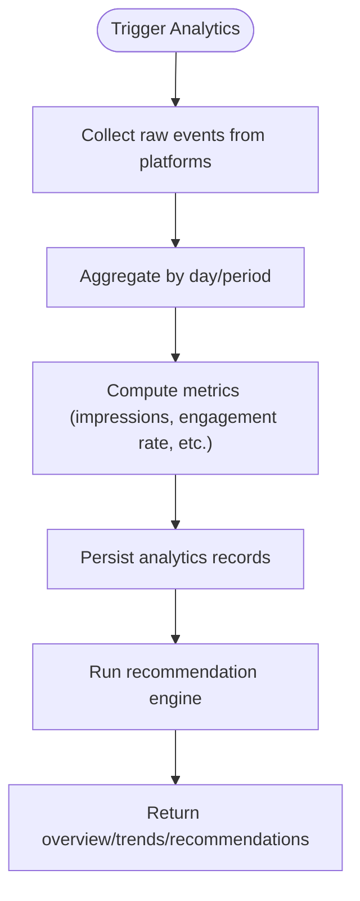
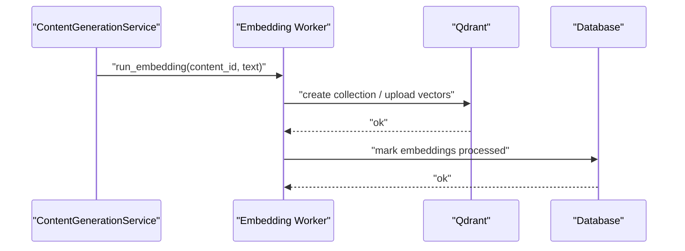
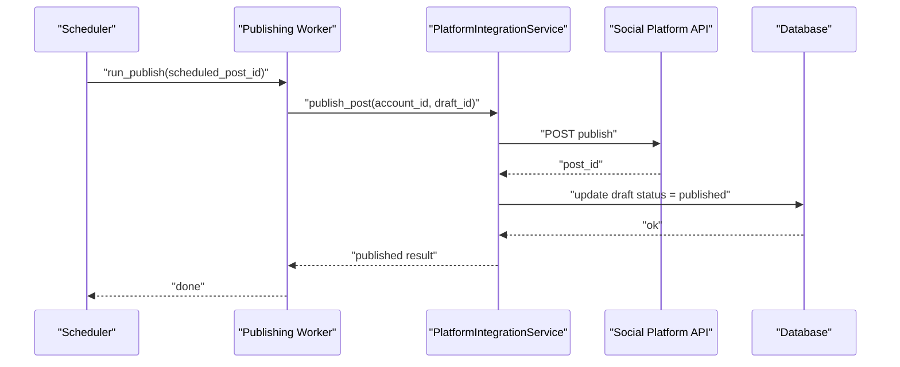
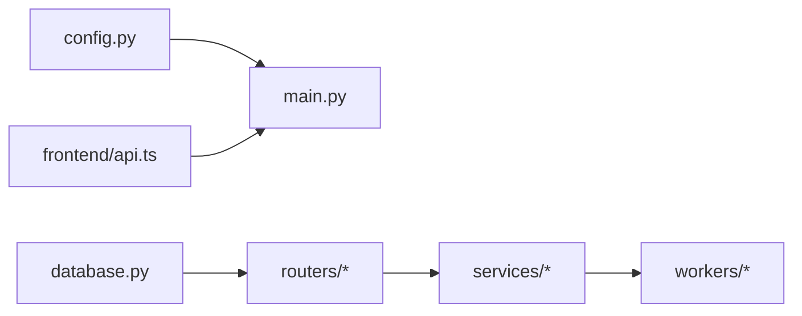

# Data Flow and Integration

<cite>
**Referenced Files in This Document**
- [backend/app/main.py](file://backend/app/main.py)
- [backend/app/config.py](file://backend/app/config.py)
- [backend/app/database.py](file://backend/app/database.py)
- [frontend/src/lib/api.ts](file://frontend/src/lib/api.ts)
- [backend/app/routers/content.py](file://backend/app/routers/content.py)
- [backend/app/routers/platforms.py](file://backend/app/routers/platforms.py)
- [backend/app/routers/approvals.py](file://backend/app/routers/approvals.py)
- [backend/app/routers/analytics.py](file://backend/app/routers/analytics.py)
- [backend/app/services/content_generation_service.py](file://backend/app/services/content_generation_service.py)
- [backend/app/services/platform_integration_service.py](file://backend/app/services/platform_integration_service.py)
- [backend/app/services/approval_workflow_service.py](file://backend/app/services/approval_workflow_service.py)
- [backend/app/services/analytics_service.py](file://backend/app/services/analytics_service.py)
- [backend/app/workers/generation_worker.py](file://backend/app/workers/generation_worker.py)
- [backend/app/workers/publishing_worker.py](file://backend/app/workers/publishing_worker.py)
- [backend/app/workers/analytics_worker.py](file://backend/app/workers/analytics_worker.py)
- [backend/app/workers/embedding_worker.py](file://backend/app/workers/embedding_worker.py)
</cite>

## Table of Contents
1. [Introduction](#introduction)
2. [Project Structure](#project-structure)
3. [Core Components](#core-components)
4. [Architecture Overview](#architecture-overview)
5. [Detailed Component Analysis](#detailed-component-analysis)
6. [Dependency Analysis](#dependency-analysis)
7. [Performance Considerations](#performance-considerations)
8. [Troubleshooting Guide](#troubleshooting-guide)
9. [Conclusion](#conclusion)
10. [Appendices](#appendices)

## Introduction
This document describes the end-to-end data flow for Socialium’s integrated system. It covers how frontend user interactions propagate through FastAPI routers and services to backend workers and external platform APIs. It documents request-response patterns, data transformations, validation flows, OAuth integrations, webhooks, rate limiting, content generation pipeline, approval workflows, notifications, analytics collection, performance metrics aggregation, recommendation engine processing, memory system semantics, and error propagation with retry mechanisms.

## Project Structure
The system is split into:
- Backend (FastAPI): Routers, Services, Workers, Models, Repositories, Schemas, and configuration.
- Frontend (Next.js): API client, pages, hooks, and UI components.

**Diagram sources**
- [backend/app/main.py](file://backend/app/main.py#L36-L76)
- [backend/app/config.py](file://backend/app/config.py#L9-L76)
- [backend/app/database.py](file://backend/app/database.py#L12-L24)
- [backend/app/routers/content.py](file://backend/app/routers/content.py#L17-L94)
- [backend/app/routers/platforms.py](file://backend/app/routers/platforms.py#L14-L56)
- [backend/app/routers/approvals.py](file://backend/app/routers/approvals.py#L16-L61)
- [backend/app/routers/analytics.py](file://backend/app/routers/analytics.py#L10-L44)
- [backend/app/services/content_generation_service.py](file://backend/app/services/content_generation_service.py#L13-L98)
- [backend/app/services/platform_integration_service.py](file://backend/app/services/platform_integration_service.py#L8-L56)
- [backend/app/services/approval_workflow_service.py](file://backend/app/services/approval_workflow_service.py#L8-L48)
- [backend/app/services/analytics_service.py](file://backend/app/services/analytics_service.py#L6-L60)
- [backend/app/workers/generation_worker.py](file://backend/app/workers/generation_worker.py#L4-L6)
- [backend/app/workers/publishing_worker.py](file://backend/app/workers/publishing_worker.py#L4-L11)
- [backend/app/workers/analytics_worker.py](file://backend/app/workers/analytics_worker.py#L4-L6)
- [backend/app/workers/embedding_worker.py](file://backend/app/workers/embedding_worker.py#L4-L6)

**Section sources**
- [backend/app/main.py](file://backend/app/main.py#L36-L76)
- [backend/app/config.py](file://backend/app/config.py#L9-L76)
- [backend/app/database.py](file://backend/app/database.py#L12-L24)

## Core Components
- Configuration: Centralized settings for environment, database, Redis, JWT, AI providers, OAuth clients, Stripe, frontend origin, and monitoring keys.
- Database: Async SQLAlchemy engine and session factory with connection pooling and automatic rollback on errors.
- Routers: API endpoints for content, platforms, approvals, and analytics, each delegating to respective services.
- Services: Orchestration layer implementing business logic, validation, and coordination with external systems.
- Workers: Background tasks for generation, publishing, analytics collection, and embeddings.

Key responsibilities:
- Content Generation Service: Orchestrates multi-agent content creation, brand voice alignment, platform-specific formatting, optional image generation, and semantic embeddings.
- Platform Integration Service: Manages OAuth connections, account sync, and publishing to supported platforms.
- Approval Workflow Service: Implements state machine for draft lifecycle and human review.
- Analytics Service: Aggregates metrics, computes trends, and produces recommendations.
- Workers: Asynchronous processing for heavy tasks and periodic jobs.

**Section sources**
- [backend/app/config.py](file://backend/app/config.py#L9-L76)
- [backend/app/database.py](file://backend/app/database.py#L12-L43)
- [backend/app/routers/content.py](file://backend/app/routers/content.py#L17-L94)
- [backend/app/routers/platforms.py](file://backend/app/routers/platforms.py#L14-L56)
- [backend/app/routers/approvals.py](file://backend/app/routers/approvals.py#L16-L61)
- [backend/app/routers/analytics.py](file://backend/app/routers/analytics.py#L10-L44)
- [backend/app/services/content_generation_service.py](file://backend/app/services/content_generation_service.py#L13-L98)
- [backend/app/services/platform_integration_service.py](file://backend/app/services/platform_integration_service.py#L8-L56)
- [backend/app/services/approval_workflow_service.py](file://backend/app/services/approval_workflow_service.py#L8-L48)
- [backend/app/services/analytics_service.py](file://backend/app/services/analytics_service.py#L6-L60)
- [backend/app/workers/generation_worker.py](file://backend/app/workers/generation_worker.py#L4-L6)
- [backend/app/workers/publishing_worker.py](file://backend/app/workers/publishing_worker.py#L4-L11)
- [backend/app/workers/analytics_worker.py](file://backend/app/workers/analytics_worker.py#L4-L6)
- [backend/app/workers/embedding_worker.py](file://backend/app/workers/embedding_worker.py#L4-L6)

## Architecture Overview
The system follows a layered architecture:
- Presentation: Next.js frontend interacts with FastAPI via a typed client.
- API Layer: Routers define endpoints and depend on database sessions.
- Business Logic: Services encapsulate workflows and integrate with external APIs.
- Persistence: Async database sessions with commit/rollback semantics.
- Background Processing: Workers handle long-running tasks.

**Diagram sources**
- [backend/app/main.py](file://backend/app/main.py#L36-L76)
- [backend/app/config.py](file://backend/app/config.py#L9-L76)
- [backend/app/database.py](file://backend/app/database.py#L12-L24)
- [frontend/src/lib/api.ts](file://frontend/src/lib/api.ts#L3-L68)
- [backend/app/workers/generation_worker.py](file://backend/app/workers/generation_worker.py#L4-L6)
- [backend/app/workers/publishing_worker.py](file://backend/app/workers/publishing_worker.py#L4-L11)
- [backend/app/workers/analytics_worker.py](file://backend/app/workers/analytics_worker.py#L4-L6)
- [backend/app/workers/embedding_worker.py](file://backend/app/workers/embedding_worker.py#L4-L6)

## Detailed Component Analysis

### Frontend API Client
- Provides a typed client with base URL from environment, JSON headers, and error handling.
- Supports GET, POST, PUT, PATCH, DELETE with optional query parameters.
- TODO: Add auth token injection.

**Diagram sources**
- [frontend/src/lib/api.ts](file://frontend/src/lib/api.ts#L20-L45)
- [backend/app/routers/content.py](file://backend/app/routers/content.py#L20-L27)
- [backend/app/services/content_generation_service.py](file://backend/app/services/content_generation_service.py#L23-L40)

**Section sources**
- [frontend/src/lib/api.ts](file://frontend/src/lib/api.ts#L3-L68)

### Content Generation Pipeline
End-to-end flow from user request to published posts:
- Request: ContentGenerateRequest
- Steps:
  1) Extract and process source content
  2) Look up brand voice from MemoryService (via Semantic Memory)
  3) For each selected platform:
     - Construct platform-specific prompt
     - Call LLM for content generation
     - Optionally generate image via DALL-E
     - Create Draft record
  4) Generate embeddings for semantic memory
  5) Return list of DraftResponse objects

**Diagram sources**
- [backend/app/routers/content.py](file://backend/app/routers/content.py#L20-L27)
- [backend/app/services/content_generation_service.py](file://backend/app/services/content_generation_service.py#L23-L40)
- [backend/app/workers/publishing_worker.py](file://backend/app/workers/publishing_worker.py#L4-L6)

**Section sources**
- [backend/app/services/content_generation_service.py](file://backend/app/services/content_generation_service.py#L13-L98)
- [backend/app/routers/content.py](file://backend/app/routers/content.py#L20-L27)

### Platform Integration and OAuth
- Connect: Exchanges OAuth code for access tokens, fetches platform user profile, encrypts tokens, creates PlatformAccount.
- Sync: Refreshes account metadata (followers, profile info).
- Publish: Formats content per platform, uploads media if needed, calls platform publish API, updates draft status.
- Disconnect: Revokes tokens and removes account.

**Diagram sources**
- [backend/app/routers/platforms.py](file://backend/app/routers/platforms.py#L27-L35)
- [backend/app/services/platform_integration_service.py](file://backend/app/services/platform_integration_service.py#L21-L31)
- [backend/app/routers/platforms.py](file://backend/app/routers/platforms.py#L48-L55)
- [backend/app/services/platform_integration_service.py](file://backend/app/services/platform_integration_service.py#L37-L39)

**Section sources**
- [backend/app/services/platform_integration_service.py](file://backend/app/services/platform_integration_service.py#L8-L56)
- [backend/app/routers/platforms.py](file://backend/app/routers/platforms.py#L17-L55)

### Approval Workflow and Notifications
- State Machine: draft → pending_approval → approved | rejected | changes_requested
- Actions:
  - Submit for approval: move draft to pending_approval
  - Review: approve, reject, or request changes with feedback
  - Add comment: append comments to approval record
  - History: retrieve full approval timeline

**Diagram sources**
- [backend/app/services/approval_workflow_service.py](file://backend/app/services/approval_workflow_service.py#L8-L48)

**Section sources**
- [backend/app/services/approval_workflow_service.py](file://backend/app/services/approval_workflow_service.py#L8-L48)
- [backend/app/routers/approvals.py](file://backend/app/routers/approvals.py#L19-L60)

### Analytics Collection, Metrics, and Recommendations
- Overview: Aggregated dashboard metrics over a time window.
- Trends: Time-series data for a specific metric.
- Recommendations: AI-driven insights for content and scheduling.
- Best Posting Times: Derived from engagement data.

**Diagram sources**
- [backend/app/routers/analytics.py](file://backend/app/routers/analytics.py#L13-L43)
- [backend/app/services/analytics_service.py](file://backend/app/services/analytics_service.py#L16-L59)

**Section sources**
- [backend/app/services/analytics_service.py](file://backend/app/services/analytics_service.py#L6-L60)
- [backend/app/routers/analytics.py](file://backend/app/routers/analytics.py#L13-L43)

### Memory System for Semantic Search and Brand Voice Learning
- Embedding Worker generates vector embeddings for content.
- Qdrant is configured for semantic storage and retrieval.
- Memory Service integrates embeddings into semantic memory for brand voice and context.

**Diagram sources**
- [backend/app/workers/embedding_worker.py](file://backend/app/workers/embedding_worker.py#L4-L6)
- [backend/app/config.py](file://backend/app/config.py#L47-L50)
- [backend/app/services/content_generation_service.py](file://backend/app/services/content_generation_service.py#L34-L35)

**Section sources**
- [backend/app/workers/embedding_worker.py](file://backend/app/workers/embedding_worker.py#L4-L6)
- [backend/app/config.py](file://backend/app/config.py#L47-L50)

### Publishing Pipeline
- Scheduled posts are published by Publishing Worker.
- For each post, retrieve draft and platform account, format content, upload media if needed, call platform publish API, and update status.

**Diagram sources**
- [backend/app/workers/publishing_worker.py](file://backend/app/workers/publishing_worker.py#L4-L6)
- [backend/app/services/platform_integration_service.py](file://backend/app/services/platform_integration_service.py#L41-L51)

**Section sources**
- [backend/app/workers/publishing_worker.py](file://backend/app/workers/publishing_worker.py#L4-L11)
- [backend/app/services/platform_integration_service.py](file://backend/app/services/platform_integration_service.py#L41-L56)

### Rate Limiting and Retry Mechanisms
- External API rate limiting: Implement per-platform backoff and retry policies in Platform Integration Service.
- Database retries: Session rollback on exceptions; callers should retry idempotent operations.
- Worker retries: Use queue-based workers with dead-letter exchanges and exponential backoff for transient failures.

[No sources needed since this section provides general guidance]

### Error Propagation and Validation
- Frontend API client throws on non-OK responses with error payload.
- Routers depend on AsyncSession; database session commits on success, rolls back on exceptions.
- Services raise NotImplementedError placeholders indicating missing implementations.

**Section sources**
- [frontend/src/lib/api.ts](file://frontend/src/lib/api.ts#L38-L41)
- [backend/app/database.py](file://backend/app/database.py#L32-L42)
- [backend/app/services/content_generation_service.py](file://backend/app/services/content_generation_service.py#L40-L41)

## Dependency Analysis
- Routers depend on database sessions via dependency provider.
- Services depend on AsyncSession and coordinate with external systems.
- Workers are invoked by services or schedulers for background tasks.
- Configuration drives database, Redis, JWT, AI providers, OAuth clients, and monitoring.

**Diagram sources**
- [backend/app/main.py](file://backend/app/main.py#L57-L76)
- [backend/app/config.py](file://backend/app/config.py#L9-L76)
- [backend/app/database.py](file://backend/app/database.py#L12-L24)
- [frontend/src/lib/api.ts](file://frontend/src/lib/api.ts#L3-L68)

**Section sources**
- [backend/app/main.py](file://backend/app/main.py#L57-L76)
- [backend/app/config.py](file://backend/app/config.py#L9-L76)
- [backend/app/database.py](file://backend/app/database.py#L12-L24)

## Performance Considerations
- Use async database sessions and connection pooling to minimize latency.
- Offload heavy workloads to workers to keep API responses fast.
- Cache frequently accessed configuration and tokens.
- Monitor and instrument analytics and recommendations for performance.

[No sources needed since this section provides general guidance]

## Troubleshooting Guide
- Health check endpoint: Verify application availability.
- Database connectivity: Confirm async engine configuration and pool settings.
- OAuth failures: Validate client credentials and callback URLs.
- Publishing errors: Inspect platform API responses and logs; implement retries.
- Analytics gaps: Ensure workers are running and event collection is enabled.

**Section sources**
- [backend/app/main.py](file://backend/app/main.py#L79-L82)
- [backend/app/database.py](file://backend/app/database.py#L12-L24)
- [backend/app/config.py](file://backend/app/config.py#L52-L64)

## Conclusion
Socialium’s architecture cleanly separates concerns across routers, services, workers, and persistence. The data flows from frontend interactions through validated API endpoints into orchestrated services that integrate with external platforms, AI providers, and semantic memory. Background workers handle heavy and periodic tasks, while configuration centralizes environment-specific settings. The approval workflow and analytics components provide governance and insights. Robust error handling, rate limiting, and retry strategies are essential for production stability.

## Appendices
- API Endpoints Overview:
  - Content: generate, variants, drafts list/get/update/status/delete
  - Platforms: accounts list/connect/disconnect/sync
  - Approvals: pending list, history, review, add comment
  - Analytics: overview, trends, recommendations

**Section sources**
- [backend/app/routers/content.py](file://backend/app/routers/content.py#L20-L94)
- [backend/app/routers/platforms.py](file://backend/app/routers/platforms.py#L17-L55)
- [backend/app/routers/approvals.py](file://backend/app/routers/approvals.py#L19-L60)
- [backend/app/routers/analytics.py](file://backend/app/routers/analytics.py#L13-L43)