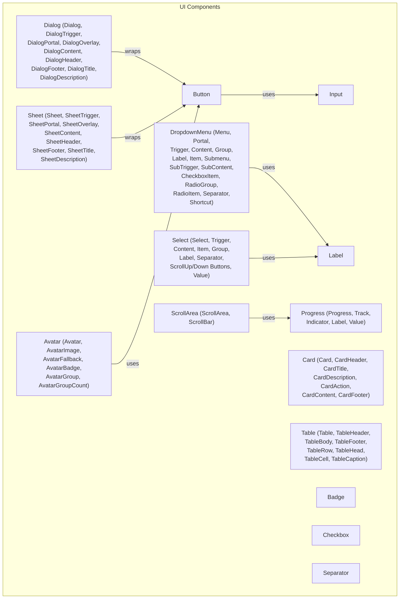
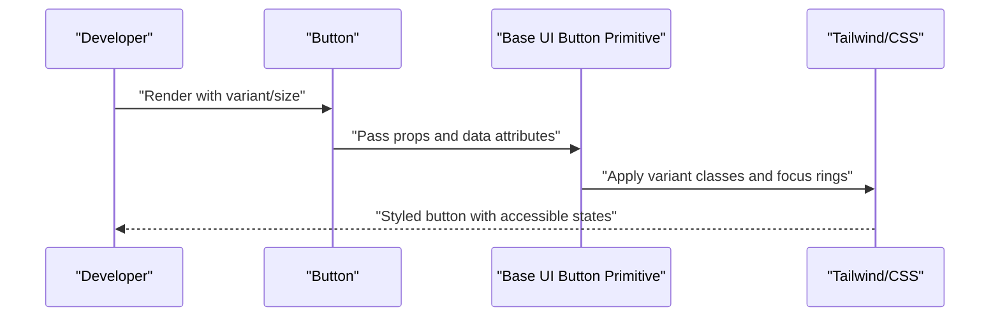
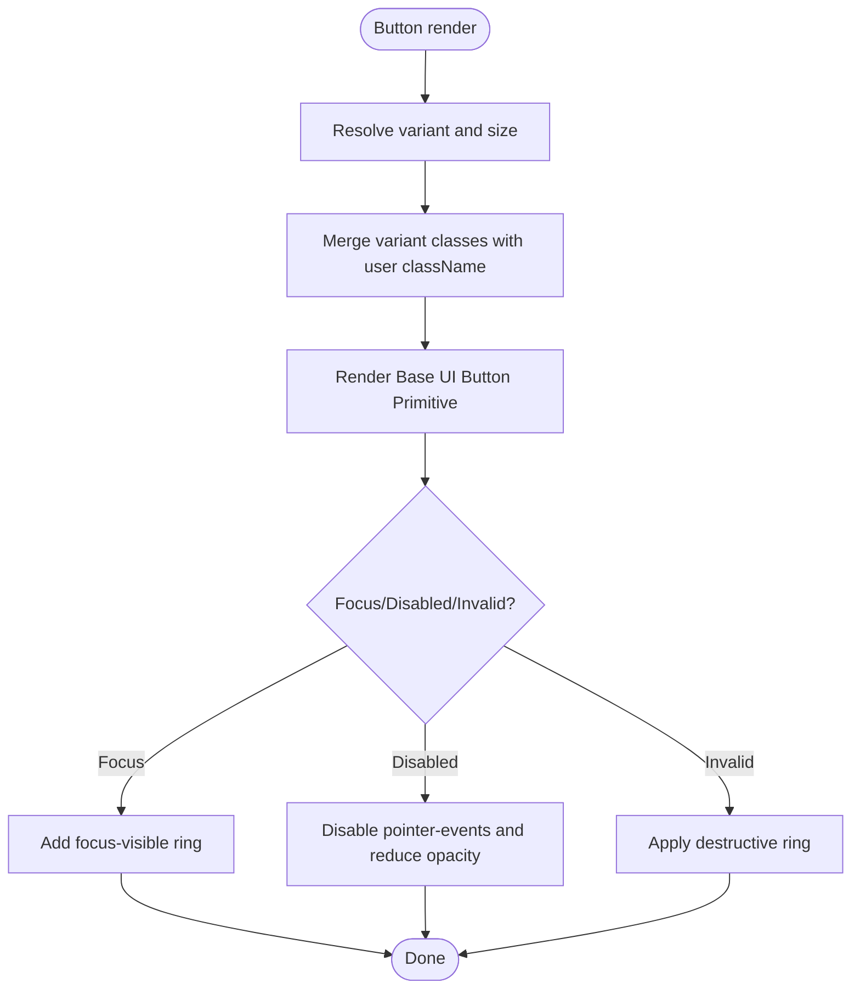
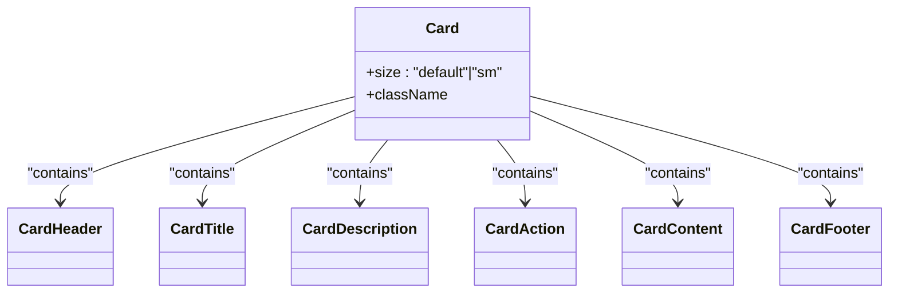
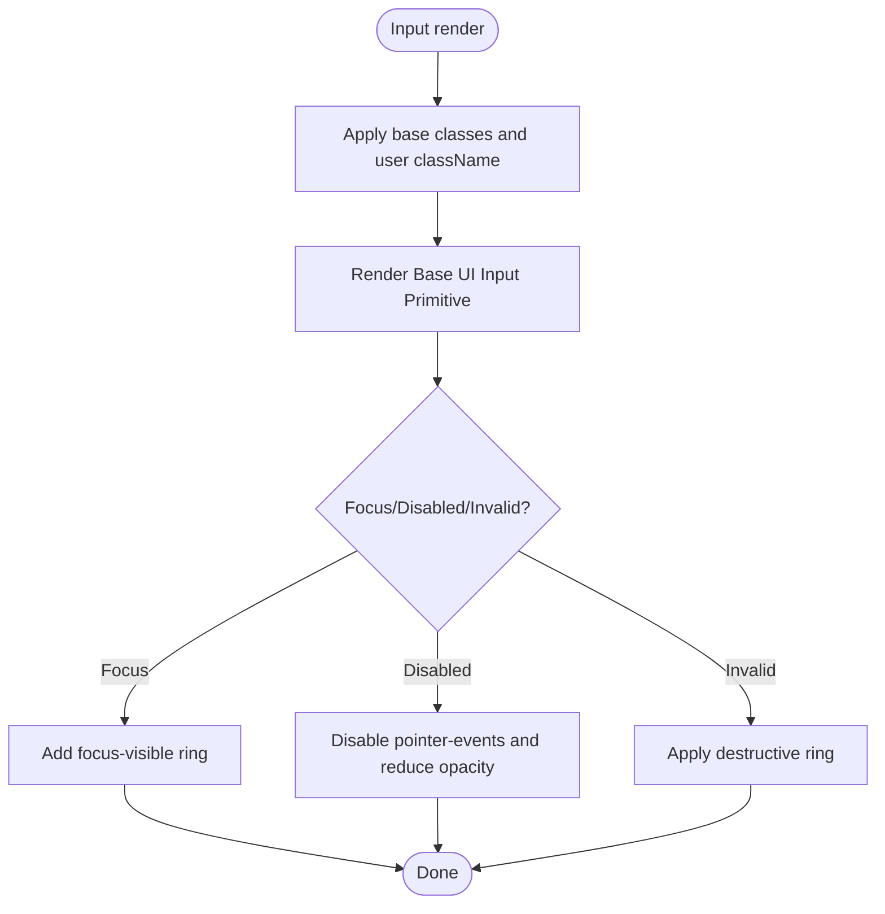
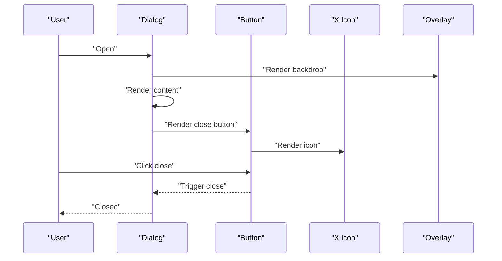
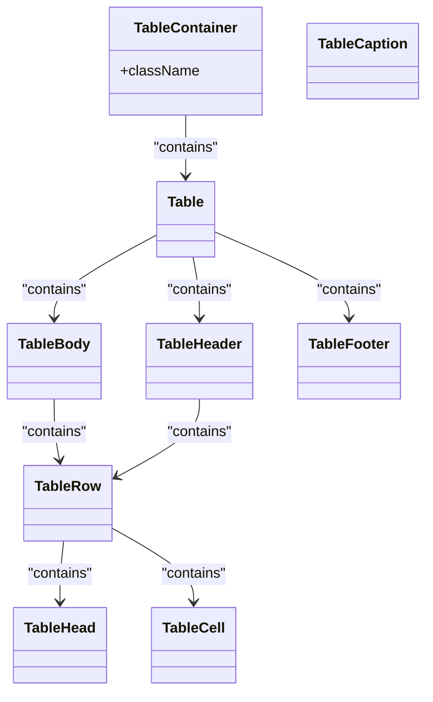
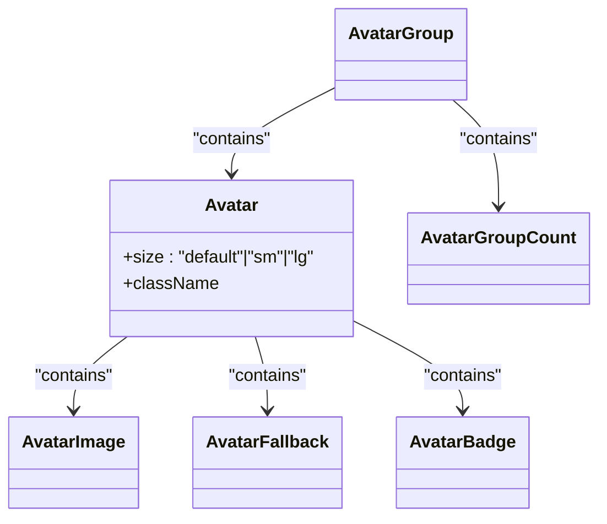
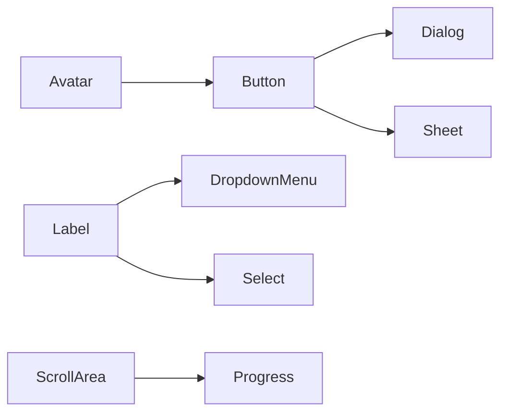

# Component Library

<cite>
**Referenced Files in This Document**
- [button.tsx](file://frontend/src/components/ui/button.tsx)
- [card.tsx](file://frontend/src/components/ui/card.tsx)
- [input.tsx](file://frontend/src/components/ui/input.tsx)
- [dialog.tsx](file://frontend/src/components/ui/dialog.tsx)
- [table.tsx](file://frontend/src/components/ui/table.tsx)
- [avatar.tsx](file://frontend/src/components/ui/avatar.tsx)
- [badge.tsx](file://frontend/src/components/ui/badge.tsx)
- [checkbox.tsx](file://frontend/src/components/ui/checkbox.tsx)
- [dropdown-menu.tsx](file://frontend/src/components/ui/dropdown-menu.tsx)
- [label.tsx](file://frontend/src/components/ui/label.tsx)
- [progress.tsx](file://frontend/src/components/ui/progress.tsx)
- [scroll-area.tsx](file://frontend/src/components/ui/scroll-area.tsx)
- [select.tsx](file://frontend/src/components/ui/select.tsx)
- [separator.tsx](file://frontend/src/components/ui/separator.tsx)
- [sheet.tsx](file://frontend/src/components/ui/sheet.tsx)
</cite>

## Table of Contents
1. [Introduction](#introduction)
2. [Project Structure](#project-structure)
3. [Core Components](#core-components)
4. [Architecture Overview](#architecture-overview)
5. [Detailed Component Analysis](#detailed-component-analysis)
6. [Dependency Analysis](#dependency-analysis)
7. [Performance Considerations](#performance-considerations)
8. [Troubleshooting Guide](#troubleshooting-guide)
9. [Conclusion](#conclusion)

## Introduction
This document describes Socialium’s custom UI component library built on shadcn/ui primitives. It focuses on the component composition model, design system integration, and usage patterns for Button, Card, Input, Dialog, Table, Avatar, and additional interactive components such as Badge, Checkbox, DropdownMenu, Label, Progress, ScrollArea, Select, Separator, and Sheet. It also covers variants, props, accessibility attributes, responsive design, and theming behavior.

## Project Structure
The UI components live under frontend/src/components/ui and are thin wrappers around Base UI primitives. They apply design tokens via Tailwind classes and data attributes, and expose a consistent API surface for consumers.

**Diagram sources**
- [button.tsx](file://frontend/src/components/ui/button.tsx#L1-L59)
- [card.tsx](file://frontend/src/components/ui/card.tsx#L1-L104)
- [input.tsx](file://frontend/src/components/ui/input.tsx#L1-L21)
- [dialog.tsx](file://frontend/src/components/ui/dialog.tsx#L1-L161)
- [table.tsx](file://frontend/src/components/ui/table.tsx#L1-L117)
- [avatar.tsx](file://frontend/src/components/ui/avatar.tsx#L1-L110)
- [badge.tsx](file://frontend/src/components/ui/badge.tsx#L1-L53)
- [checkbox.tsx](file://frontend/src/components/ui/checkbox.tsx#L1-L30)
- [dropdown-menu.tsx](file://frontend/src/components/ui/dropdown-menu.tsx#L1-L269)
- [label.tsx](file://frontend/src/components/ui/label.tsx#L1-L21)
- [progress.tsx](file://frontend/src/components/ui/progress.tsx#L1-L84)
- [scroll-area.tsx](file://frontend/src/components/ui/scroll-area.tsx#L1-L56)
- [select.tsx](file://frontend/src/components/ui/select.tsx#L1-L202)
- [separator.tsx](file://frontend/src/components/ui/separator.tsx#L1-L26)
- [sheet.tsx](file://frontend/src/components/ui/sheet.tsx#L1-L139)

**Section sources**
- [button.tsx](file://frontend/src/components/ui/button.tsx#L1-L59)
- [card.tsx](file://frontend/src/components/ui/card.tsx#L1-L104)
- [input.tsx](file://frontend/src/components/ui/input.tsx#L1-L21)
- [dialog.tsx](file://frontend/src/components/ui/dialog.tsx#L1-L161)
- [table.tsx](file://frontend/src/components/ui/table.tsx#L1-L117)
- [avatar.tsx](file://frontend/src/components/ui/avatar.tsx#L1-L110)
- [badge.tsx](file://frontend/src/components/ui/badge.tsx#L1-L53)
- [checkbox.tsx](file://frontend/src/components/ui/checkbox.tsx#L1-L30)
- [dropdown-menu.tsx](file://frontend/src/components/ui/dropdown-menu.tsx#L1-L269)
- [label.tsx](file://frontend/src/components/ui/label.tsx#L1-L21)
- [progress.tsx](file://frontend/src/components/ui/progress.tsx#L1-L84)
- [scroll-area.tsx](file://frontend/src/components/ui/scroll-area.tsx#L1-L56)
- [select.tsx](file://frontend/src/components/ui/select.tsx#L1-L202)
- [separator.tsx](file://frontend/src/components/ui/separator.tsx#L1-L26)
- [sheet.tsx](file://frontend/src/components/ui/sheet.tsx#L1-L139)

## Core Components
This section summarizes the primary components and their roles in the design system.

- Button
  - Purpose: Action primatives with variants and sizes.
  - Variants: default, outline, secondary, ghost, destructive, link.
  - Sizes: default, xs, sm, lg, icon, icon-xs, icon-sm, icon-lg.
  - Accessibility: Focus-visible ring, disabled states, aria-invalid support.
  - Composition: Wraps a Base UI button primitive; applies design tokens and variants.

- Card
  - Purpose: Surface containers with header/title/content/footer slots.
  - Sizes: default, sm.
  - Slots: card-header, card-title, card-description, card-action, card-content, card-footer.
  - Composition: Uses data attributes to coordinate layout and spacing.

- Input
  - Purpose: Text field with focus/ring states and invalid states.
  - Accessibility: Focus-visible ring, disabled states, aria-invalid support.
  - Composition: Wraps a Base UI input primitive.

- Dialog
  - Purpose: Modal overlay with close controls and optional footer/header.
  - Composition: Composes Base UI Dialog with internal Button and X icon for close.

- Table
  - Purpose: Scrollable table container with semantic rows and cells.
  - Composition: Wraps native table inside a scroll container.

- Avatar
  - Purpose: User identity with image/fallback and badges/groups.
  - Sizes: default, sm, lg.
  - Composition: Wraps Base UI Avatar with group/count helpers.

- Additional interactive components
  - Badge, Checkbox, DropdownMenu, Label, Progress, ScrollArea, Select, Separator, Sheet.

**Section sources**
- [button.tsx](file://frontend/src/components/ui/button.tsx#L6-L41)
- [card.tsx](file://frontend/src/components/ui/card.tsx#L5-L93)
- [input.tsx](file://frontend/src/components/ui/input.tsx#L6-L18)
- [dialog.tsx](file://frontend/src/components/ui/dialog.tsx#L10-L81)
- [table.tsx](file://frontend/src/components/ui/table.tsx#L7-L105)
- [avatar.tsx](file://frontend/src/components/ui/avatar.tsx#L8-L100)
- [badge.tsx](file://frontend/src/components/ui/badge.tsx#L7-L28)
- [checkbox.tsx](file://frontend/src/components/ui/checkbox.tsx#L8-L27)
- [dropdown-menu.tsx](file://frontend/src/components/ui/dropdown-menu.tsx#L9-L50)
- [label.tsx](file://frontend/src/components/ui/label.tsx#L7-L17)
- [progress.tsx](file://frontend/src/components/ui/progress.tsx#L7-L52)
- [scroll-area.tsx](file://frontend/src/components/ui/scroll-area.tsx#L8-L53)
- [select.tsx](file://frontend/src/components/ui/select.tsx#L9-L96)
- [separator.tsx](file://frontend/src/components/ui/separator.tsx#L7-L22)
- [sheet.tsx](file://frontend/src/components/ui/sheet.tsx#L10-L81)

## Architecture Overview
The library follows a composition pattern:
- Each component wraps a Base UI primitive to add design system semantics.
- Data attributes (e.g., data-slot, data-size) carry state and enable theme-aware styles.
- Variants and sizes are generated via class variance authority (CVA) for Button and Badge.
- Theming adapts to light/dark modes through Tailwind color classes and pseudo-states.

**Diagram sources**
- [button.tsx](file://frontend/src/components/ui/button.tsx#L43-L56)

## Detailed Component Analysis

### Button
- Props
  - className: Optional tailwind classes.
  - variant: One of default, outline, secondary, ghost, destructive, link.
  - size: One of default, xs, sm, lg, icon, icon-xs, icon-sm, icon-lg.
  - Rest of props pass through to the primitive.
- Variants and sizes
  - Implemented via CVA with defaultVariant set to default/default.
  - Focus-visible ring and disabled states included.
- Accessibility
  - Focus-visible ring classes applied.
  - Disabled pointer-events and reduced opacity.
  - aria-invalid integrates with destructive styling.
- Usage patterns
  - Icon buttons use icon sizes; text buttons use text sizes.
  - Combine with icons by placing SVG inside the button element.

**Diagram sources**
- [button.tsx](file://frontend/src/components/ui/button.tsx#L6-L41)
- [button.tsx](file://frontend/src/components/ui/button.tsx#L43-L56)

**Section sources**
- [button.tsx](file://frontend/src/components/ui/button.tsx#L6-L41)
- [button.tsx](file://frontend/src/components/ui/button.tsx#L43-L56)

### Card
- Props
  - size: default or sm.
  - className and other div props.
- Composition
  - Card is the container; child slots coordinate layout.
  - CardHeader supports grid layout with action and description.
  - Footer adds a bordered area for actions.
- Responsive/mobile
  - Uses rem-based paddings and reduced spacing for small size.

**Diagram sources**
- [card.tsx](file://frontend/src/components/ui/card.tsx#L5-L93)

**Section sources**
- [card.tsx](file://frontend/src/components/ui/card.tsx#L5-L93)

### Input
- Props
  - className and standard input props (type, etc.).
- Behavior
  - Focus-visible ring and disabled states.
  - aria-invalid integrates destructive styling.
- Accessibility
  - Proper focus management and disabled state handling.

**Diagram sources**
- [input.tsx](file://frontend/src/components/ui/input.tsx#L6-L18)

**Section sources**
- [input.tsx](file://frontend/src/components/ui/input.tsx#L6-L18)

### Dialog
- Composition
  - Dialog composes Base UI Dialog with internal Button and X icon for close.
  - Overlay and content animate in/out; content centers on screen.
  - Optional close button and footer/header slots.
- Props
  - showCloseButton: toggles close button rendering.
  - Other props pass through to underlying primitives.
- Accessibility
  - Uses sr-only for close button text.
  - Portal ensures overlay is rendered outside normal DOM flow.

**Diagram sources**
- [dialog.tsx](file://frontend/src/components/ui/dialog.tsx#L10-L81)

**Section sources**
- [dialog.tsx](file://frontend/src/components/ui/dialog.tsx#L10-L81)

### Table
- Composition
  - Wraps a native table inside a horizontally scrollable container.
  - Provides semantic subcomponents for header/body/footer/row/cell.
- Behavior
  - Hover and selection states via data attributes and transitions.
- Accessibility
  - Uses aria-expanded for expanded rows.

**Diagram sources**
- [table.tsx](file://frontend/src/components/ui/table.tsx#L7-L105)

**Section sources**
- [table.tsx](file://frontend/src/components/ui/table.tsx#L7-L105)

### Avatar
- Props
  - size: default, sm, lg.
  - className and primitive props.
- Composition
  - Root, Image, Fallback, Badge, Group, and GroupCount components.
  - Group applies negative spacing and ring borders between avatars.
- Theming
  - Mix-blend modes adapt to light/dark backgrounds.

**Diagram sources**
- [avatar.tsx](file://frontend/src/components/ui/avatar.tsx#L8-L100)

**Section sources**
- [avatar.tsx](file://frontend/src/components/ui/avatar.tsx#L8-L100)

### Additional Interactive Components

#### Badge
- Props
  - variant: default, secondary, destructive, outline, ghost, link.
  - className and render prop.
- Implementation
  - Uses CVA for variants and Base UI render composition.

**Section sources**
- [badge.tsx](file://frontend/src/components/ui/badge.tsx#L7-L28)
- [badge.tsx](file://frontend/src/components/ui/badge.tsx#L30-L50)

#### Checkbox
- Props
  - className and primitive props.
- Behavior
  - Renders check indicator; integrates focus-visible and disabled states.

**Section sources**
- [checkbox.tsx](file://frontend/src/components/ui/checkbox.tsx#L8-L27)

#### DropdownMenu
- Composition
  - Menu, Portal, Trigger, Positioner, Popup, Group, Label, Item, Submenu, Checkbox/Radio items, Separator, Shortcut.
- Props
  - Alignment and offsets configurable per content and sub-content.
- Accessibility
  - Keyboard navigation and focus management via Base UI.

**Section sources**
- [dropdown-menu.tsx](file://frontend/src/components/ui/dropdown-menu.tsx#L9-L50)
- [dropdown-menu.tsx](file://frontend/src/components/ui/dropdown-menu.tsx#L76-L97)
- [dropdown-menu.tsx](file://frontend/src/components/ui/dropdown-menu.tsx#L148-L180)

#### Label
- Props
  - className and label props.
- Behavior
  - Adjusts for disabled states and peer-disabled states.

**Section sources**
- [label.tsx](file://frontend/src/components/ui/label.tsx#L7-L17)

#### Progress
- Composition
  - Root, Track, Indicator, Label, Value.
- Props
  - value and children; renders track and indicator automatically.

**Section sources**
- [progress.tsx](file://frontend/src/components/ui/progress.tsx#L7-L52)
- [progress.tsx](file://frontend/src/components/ui/progress.tsx#L64-L75)

#### ScrollArea
- Composition
  - Root, Viewport, Scrollbar, Thumb, Corner.
- Props
  - orientation for scrollbar direction.

**Section sources**
- [scroll-area.tsx](file://frontend/src/components/ui/scroll-area.tsx#L8-L53)

#### Select
- Composition
  - Root, Trigger, Value, Content, List, Group, Label, Item, Separator, ScrollUp/Down buttons.
- Props
  - Size, alignment, offsets, and trigger alignment.
- Behavior
  - Integrates icons and indicators; supports grouped options.

**Section sources**
- [select.tsx](file://frontend/src/components/ui/select.tsx#L9-L96)
- [select.tsx](file://frontend/src/components/ui/select.tsx#L111-L137)
- [select.tsx](file://frontend/src/components/ui/select.tsx#L152-L188)

#### Separator
- Props
  - orientation: horizontal or vertical.

**Section sources**
- [separator.tsx](file://frontend/src/components/ui/separator.tsx#L7-L22)

#### Sheet
- Composition
  - Sheet, SheetTrigger, SheetPortal, SheetOverlay, SheetContent, SheetHeader, SheetFooter, SheetTitle, SheetDescription.
- Props
  - side: top, right, bottom, left; showCloseButton.
- Behavior
  - Animates in from the selected side; overlay backdrop blur support.

**Section sources**
- [sheet.tsx](file://frontend/src/components/ui/sheet.tsx#L10-L81)
- [sheet.tsx](file://frontend/src/components/ui/sheet.tsx#L83-L127)

## Dependency Analysis
- Component coupling
  - Dialog and Sheet depend on Button for close controls.
  - DropdownMenu and Select depend on Label for accessible associations.
  - Avatar depends on Button indirectly via its close button usage.
- Cohesion
  - Each component encapsulates a single responsibility and composes primitives.
- External dependencies
  - Base UI primitives for interactivity and accessibility.
  - class-variance-authority for variants.
  - Tailwind classes for design tokens and responsive behavior.

**Diagram sources**
- [dialog.tsx](file://frontend/src/components/ui/dialog.tsx#L6-L7)
- [sheet.tsx](file://frontend/src/components/ui/sheet.tsx#L6-L7)
- [dropdown-menu.tsx](file://frontend/src/components/ui/dropdown-menu.tsx#L6-L7)
- [select.tsx](file://frontend/src/components/ui/select.tsx#L6-L7)
- [avatar.tsx](file://frontend/src/components/ui/avatar.tsx#L1-L10)
- [progress.tsx](file://frontend/src/components/ui/progress.tsx#L5-L6)
- [scroll-area.tsx](file://frontend/src/components/ui/scroll-area.tsx#L6-L7)

**Section sources**
- [dialog.tsx](file://frontend/src/components/ui/dialog.tsx#L6-L7)
- [sheet.tsx](file://frontend/src/components/ui/sheet.tsx#L6-L7)
- [dropdown-menu.tsx](file://frontend/src/components/ui/dropdown-menu.tsx#L6-L7)
- [select.tsx](file://frontend/src/components/ui/select.tsx#L6-L7)
- [avatar.tsx](file://frontend/src/components/ui/avatar.tsx#L1-L10)
- [progress.tsx](file://frontend/src/components/ui/progress.tsx#L5-L6)
- [scroll-area.tsx](file://frontend/src/components/ui/scroll-area.tsx#L6-L7)

## Performance Considerations
- Prefer variant props over dynamic className concatenation to leverage CVA caching.
- Use minimal DOM nesting in composite components (e.g., Dialog, Sheet) to reduce reflows.
- Avoid unnecessary re-renders by passing stable refs and memoized callbacks to primitives.
- Keep animations scoped to overlay portals to minimize layout thrashing.

## Troubleshooting Guide
- Focus ring not visible
  - Ensure focus-visible ring classes are present and not overridden by global resets.
  - Verify the component receives focus via keyboard navigation.
- Disabled state not applying
  - Confirm disabled prop is passed to the primitive and that disabled classes are not overridden.
- Invalid state styling not appearing
  - Ensure aria-invalid is set; destructive variants rely on this attribute.
- Dialog/Sheet close not working
  - Confirm the close button is rendered and that the portal mounts the overlay and content.
- Scrollbar visibility
  - Check that ScrollArea is sized appropriately and that thumb classes are applied.

**Section sources**
- [button.tsx](file://frontend/src/components/ui/button.tsx#L7-L8)
- [input.tsx](file://frontend/src/components/ui/input.tsx#L12-L14)
- [dialog.tsx](file://frontend/src/components/ui/dialog.tsx#L62-L77)
- [sheet.tsx](file://frontend/src/components/ui/sheet.tsx#L62-L77)
- [scroll-area.tsx](file://frontend/src/components/ui/scroll-area.tsx#L41-L51)

## Conclusion
Socialium’s UI library standardizes shadcn/ui primitives into a cohesive design system. Components expose clear variants and sizes, integrate accessibility out of the box, and adapt to light/dark themes through Tailwind classes. The composition model enables predictable usage patterns, consistent styling, and maintainable extensions.