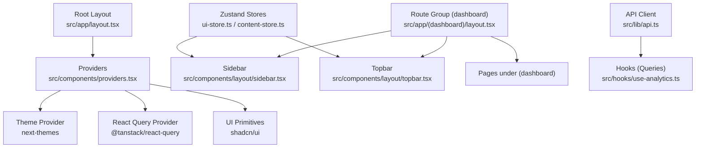
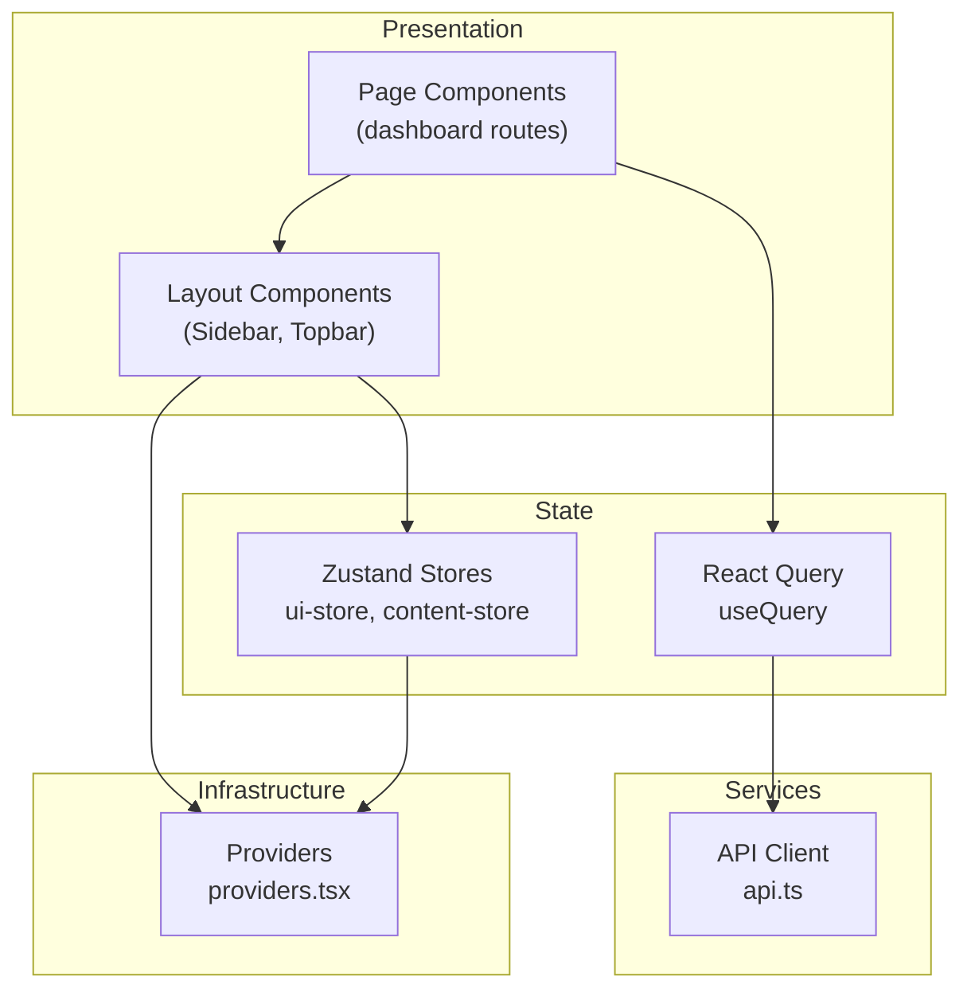
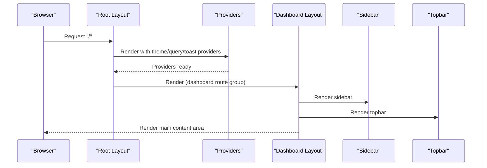
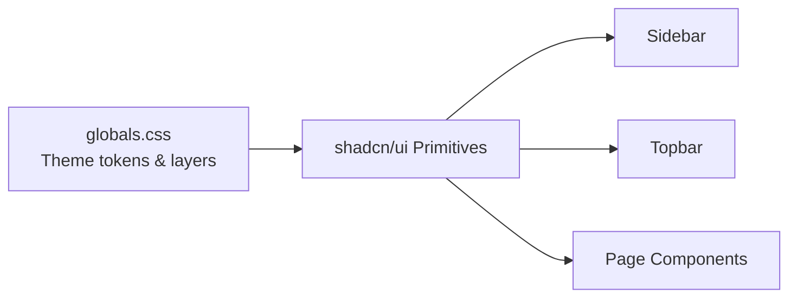
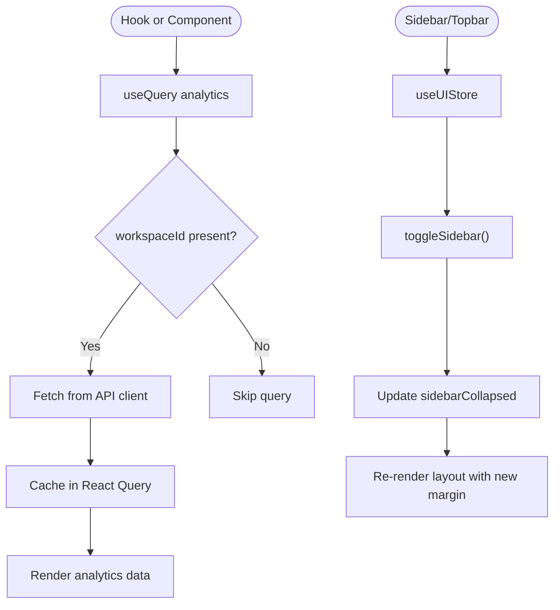
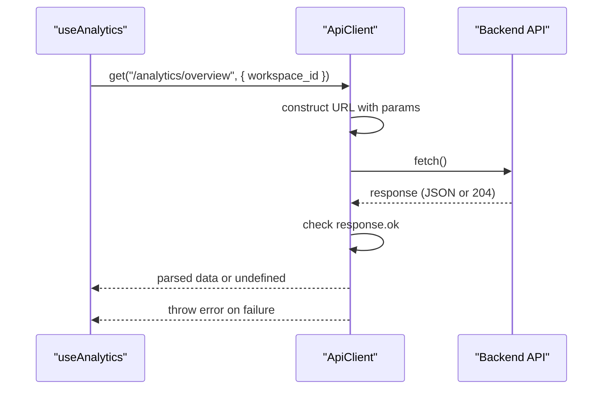
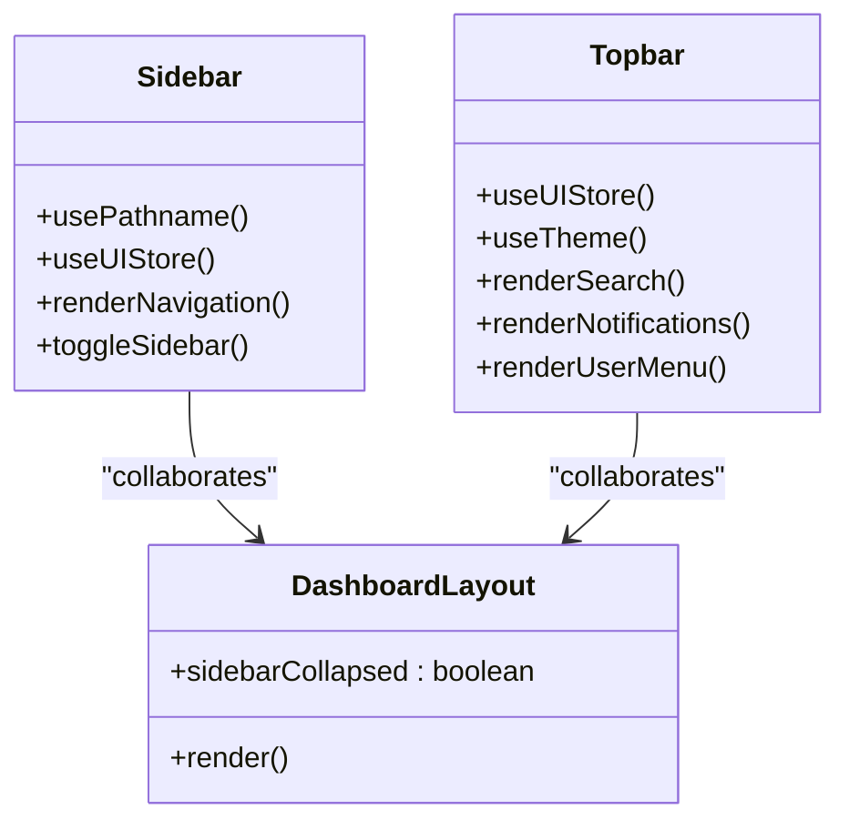
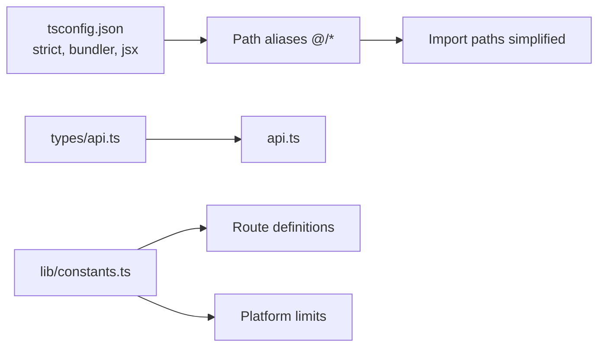
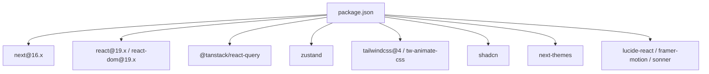

# Frontend Architecture

<cite>
**Referenced Files in This Document**
- [package.json](file://frontend/package.json)
- [next.config.ts](file://frontend/next.config.ts)
- [tsconfig.json](file://frontend/tsconfig.json)
- [src/app/layout.tsx](file://frontend/src/app/layout.tsx)
- [src/app/globals.css](file://frontend/src/app/globals.css)
- [src/components/providers.tsx](file://frontend/src/components/providers.tsx)
- [src/components/layout/sidebar.tsx](file://frontend/src/components/layout/sidebar.tsx)
- [src/components/layout/topbar.tsx](file://frontend/src/components/layout/topbar.tsx)
- [src/app/(dashboard)/layout.tsx](file://frontend/src/app/(dashboard)/layout.tsx)
- [src/lib/api.ts](file://frontend/src/lib/api.ts)
- [src/lib/constants.ts](file://frontend/src/lib/constants.ts)
- [src/hooks/use-analytics.ts](file://frontend/src/hooks/use-analytics.ts)
- [src/stores/ui-store.ts](file://frontend/src/stores/ui-store.ts)
- [src/stores/content-store.ts](file://frontend/src/stores/content-store.ts)
- [src/types/api.ts](file://frontend/src/types/api.ts)
</cite>

## Table of Contents
1. [Introduction](#introduction)
2. [Project Structure](#project-structure)
3. [Core Components](#core-components)
4. [Architecture Overview](#architecture-overview)
5. [Detailed Component Analysis](#detailed-component-analysis)
6. [Dependency Analysis](#dependency-analysis)
7. [Performance Considerations](#performance-considerations)
8. [Troubleshooting Guide](#troubleshooting-guide)
9. [Conclusion](#conclusion)
10. [Appendices](#appendices)

## Introduction
This document describes the frontend architecture of Socialium’s Next.js 16 application. It focuses on the App Router-based structure with route groups, nested layouts, and dynamic routing patterns; the component hierarchy including layout components, UI primitives, and page-level components; state management via React hooks, custom hooks, and Zustand stores; the API integration layer with HTTP client configuration, authentication handling, and error management; the design system implementation with shadcn/ui components, theme provider setup, and responsive design patterns; TypeScript integration and type safety patterns; and build configuration, asset optimization, and deployment pipeline considerations. It also covers performance optimization techniques, code splitting strategies, and SEO considerations.

## Project Structure
The frontend is organized under the Next.js App Router convention with route groups and nested layouts. The root layout defines global metadata, fonts, and the Providers wrapper. Route groups such as (dashboard) encapsulate authenticated pages and shared layout scaffolding. UI primitives are implemented as shadcn/ui components, styled via Tailwind CSS and a custom theme. State is managed through React Query for server state and Zustand for UI/application state. API requests are centralized through a typed client with error handling.

**Diagram sources**
- [src/app/layout.tsx](file://frontend/src/app/layout.tsx#L1-L38)
- [src/components/providers.tsx](file://frontend/src/components/providers.tsx#L1-L33)
- [src/app/(dashboard)/layout.tsx](file://frontend/src/app/(dashboard)/layout.tsx#L1-L24)
- [src/components/layout/sidebar.tsx](file://frontend/src/components/layout/sidebar.tsx#L1-L123)
- [src/components/layout/topbar.tsx](file://frontend/src/components/layout/topbar.tsx#L1-L76)
- [src/lib/api.ts](file://frontend/src/lib/api.ts#L1-L69)
- [src/hooks/use-analytics.ts](file://frontend/src/hooks/use-analytics.ts#L1-L14)
- [src/stores/ui-store.ts](file://frontend/src/stores/ui-store.ts#L1-L16)
- [src/stores/content-store.ts](file://frontend/src/stores/content-store.ts#L1-L62)

**Section sources**
- [src/app/layout.tsx](file://frontend/src/app/layout.tsx#L1-L38)
- [src/app/globals.css](file://frontend/src/app/globals.css#L1-L130)
- [src/app/(dashboard)/layout.tsx](file://frontend/src/app/(dashboard)/layout.tsx#L1-L24)

## Core Components
- Root layout and metadata: Defines global fonts, metadata, and wraps children with Providers.
- Providers: Initializes React Query with caching and retry defaults, sets up theme switching, and wires tooltips and toast notifications.
- Dashboard layout: Composes Sidebar and Topbar and manages responsive margins based on sidebar state.
- UI primitives: Reusable components (button, input, avatar, dropdown, tooltip, etc.) built with shadcn/ui and styled via Tailwind.
- API client: Centralized HTTP client with typed methods, URL construction, and error handling.
- Hooks: React Query hooks for server state, e.g., analytics overview.
- Stores: Zustand stores for UI state (sidebar collapse) and application state (content wizard).

**Section sources**
- [src/app/layout.tsx](file://frontend/src/app/layout.tsx#L1-L38)
- [src/components/providers.tsx](file://frontend/src/components/providers.tsx#L1-L33)
- [src/app/(dashboard)/layout.tsx](file://frontend/src/app/(dashboard)/layout.tsx#L1-L24)
- [src/components/layout/sidebar.tsx](file://frontend/src/components/layout/sidebar.tsx#L1-L123)
- [src/components/layout/topbar.tsx](file://frontend/src/components/layout/topbar.tsx#L1-L76)
- [src/lib/api.ts](file://frontend/src/lib/api.ts#L1-L69)
- [src/hooks/use-analytics.ts](file://frontend/src/hooks/use-analytics.ts#L1-L14)
- [src/stores/ui-store.ts](file://frontend/src/stores/ui-store.ts#L1-L16)
- [src/stores/content-store.ts](file://frontend/src/stores/content-store.ts#L1-L62)

## Architecture Overview
The architecture follows a layered pattern:
- Presentation Layer: Pages and layout components under route groups.
- UI Primitive Layer: shadcn/ui components and shared UI utilities.
- State Management Layer: React Query for server state and Zustand for UI/application state.
- Services Layer: API client with typed requests and error handling.
- Infrastructure Layer: Providers for theme, query client, and notifications.

**Diagram sources**
- [src/app/(dashboard)/layout.tsx](file://frontend/src/app/(dashboard)/layout.tsx#L1-L24)
- [src/components/layout/sidebar.tsx](file://frontend/src/components/layout/sidebar.tsx#L1-L123)
- [src/components/layout/topbar.tsx](file://frontend/src/components/layout/topbar.tsx#L1-L76)
- [src/hooks/use-analytics.ts](file://frontend/src/hooks/use-analytics.ts#L1-L14)
- [src/stores/ui-store.ts](file://frontend/src/stores/ui-store.ts#L1-L16)
- [src/stores/content-store.ts](file://frontend/src/stores/content-store.ts#L1-L62)
- [src/lib/api.ts](file://frontend/src/lib/api.ts#L1-L69)
- [src/components/providers.tsx](file://frontend/src/components/providers.tsx#L1-L33)

## Detailed Component Analysis

### Routing and Layout Hierarchy
- Root layout defines HTML attributes, fonts, metadata, and wraps children in Providers.
- Route group (dashboard) provides a shared layout with Sidebar and Topbar, controlling responsive margins and layout flow.
- Pages under (dashboard) render inside the dashboard layout; nested routes like content creation are supported by the App Router.

**Diagram sources**
- [src/app/layout.tsx](file://frontend/src/app/layout.tsx#L1-L38)
- [src/components/providers.tsx](file://frontend/src/components/providers.tsx#L1-L33)
- [src/app/(dashboard)/layout.tsx](file://frontend/src/app/(dashboard)/layout.tsx#L1-L24)
- [src/components/layout/sidebar.tsx](file://frontend/src/components/layout/sidebar.tsx#L1-L123)
- [src/components/layout/topbar.tsx](file://frontend/src/components/layout/topbar.tsx#L1-L76)

**Section sources**
- [src/app/layout.tsx](file://frontend/src/app/layout.tsx#L1-L38)
- [src/app/(dashboard)/layout.tsx](file://frontend/src/app/(dashboard)/layout.tsx#L1-L24)

### UI Primitives and Design System
- The design system leverages shadcn/ui components integrated with Tailwind CSS and a custom theme.
- Global CSS defines CSS variables for theme tokens and applies layer styles for base elements.
- Components such as Button, Input, Avatar, DropdownMenu, Tooltip, and others are used across the layout and pages.

**Diagram sources**
- [src/app/globals.css](file://frontend/src/app/globals.css#L1-L130)
- [src/components/layout/sidebar.tsx](file://frontend/src/components/layout/sidebar.tsx#L1-L123)
- [src/components/layout/topbar.tsx](file://frontend/src/components/layout/topbar.tsx#L1-L76)

**Section sources**
- [src/app/globals.css](file://frontend/src/app/globals.css#L1-L130)
- [src/components/layout/sidebar.tsx](file://frontend/src/components/layout/sidebar.tsx#L1-L123)
- [src/components/layout/topbar.tsx](file://frontend/src/components/layout/topbar.tsx#L1-L76)

### State Management
- React Query: Centralized caching and refetching with a default stale time and retry policy. Example hook fetches analytics overview keyed by workspace ID.
- Zustand:
  - UI store controls sidebar collapse state and toggles.
  - Content store manages a multi-step content wizard with form-like state transitions.

**Diagram sources**
- [src/hooks/use-analytics.ts](file://frontend/src/hooks/use-analytics.ts#L1-L14)
- [src/lib/api.ts](file://frontend/src/lib/api.ts#L1-L69)
- [src/stores/ui-store.ts](file://frontend/src/stores/ui-store.ts#L1-L16)

**Section sources**
- [src/hooks/use-analytics.ts](file://frontend/src/hooks/use-analytics.ts#L1-L14)
- [src/stores/ui-store.ts](file://frontend/src/stores/ui-store.ts#L1-L16)
- [src/stores/content-store.ts](file://frontend/src/stores/content-store.ts#L1-L62)

### API Integration Layer
- API client encapsulates base URL, header construction, request orchestration, and error handling.
- Methods support GET, POST, PUT, PATCH, DELETE with optional body and query parameters.
- Error handling throws descriptive errors derived from response payloads or HTTP status.

**Diagram sources**
- [src/hooks/use-analytics.ts](file://frontend/src/hooks/use-analytics.ts#L1-L14)
- [src/lib/api.ts](file://frontend/src/lib/api.ts#L1-L69)

**Section sources**
- [src/lib/api.ts](file://frontend/src/lib/api.ts#L1-L69)
- [src/hooks/use-analytics.ts](file://frontend/src/hooks/use-analytics.ts#L1-L14)

### Layout Components
- Sidebar: Navigation items, active state detection based on pathname, collapsible behavior, and tooltip integration.
- Topbar: Collapsible menu trigger, search input, theme toggle, notifications, and user dropdown menu.
- Dashboard layout: Applies responsive left margin based on sidebar collapse and renders main content area.

**Diagram sources**
- [src/components/layout/sidebar.tsx](file://frontend/src/components/layout/sidebar.tsx#L1-L123)
- [src/components/layout/topbar.tsx](file://frontend/src/components/layout/topbar.tsx#L1-L76)
- [src/app/(dashboard)/layout.tsx](file://frontend/src/app/(dashboard)/layout.tsx#L1-L24)

**Section sources**
- [src/components/layout/sidebar.tsx](file://frontend/src/components/layout/sidebar.tsx#L1-L123)
- [src/components/layout/topbar.tsx](file://frontend/src/components/layout/topbar.tsx#L1-L76)
- [src/app/(dashboard)/layout.tsx](file://frontend/src/app/(dashboard)/layout.tsx#L1-L24)

### TypeScript Integration and Type Safety
- Strict compiler options enforce type safety and incremental builds.
- Path aliases simplify imports.
- API types define request/response contracts for backend integration.
- Constants module centralizes route definitions and platform limits with strong typing.

**Diagram sources**
- [tsconfig.json](file://frontend/tsconfig.json#L1-L35)
- [src/types/api.ts](file://frontend/src/types/api.ts)
- [src/lib/constants.ts](file://frontend/src/lib/constants.ts#L1-L37)
- [src/lib/api.ts](file://frontend/src/lib/api.ts#L1-L69)

**Section sources**
- [tsconfig.json](file://frontend/tsconfig.json#L1-L35)
- [src/lib/constants.ts](file://frontend/src/lib/constants.ts#L1-L37)
- [src/types/api.ts](file://frontend/src/types/api.ts)

## Dependency Analysis
External dependencies include Next.js 16, React 19, shadcn/ui ecosystem, Tailwind CSS v4, React Query, Zustand, and related UI libraries. These dependencies are declared in package.json and inform the build, runtime, and development tooling.

**Diagram sources**
- [package.json](file://frontend/package.json#L1-L45)

**Section sources**
- [package.json](file://frontend/package.json#L1-L45)

## Performance Considerations
- Code splitting: Next.js App Router naturally splits routes into separate bundles per page; keep route groups minimal and lazy-load heavy components.
- Caching: React Query default staleTime and retry reduce redundant network calls; tune per-query options based on data volatility.
- Hydration: Root layout suppresses hydration warnings where appropriate; ensure client directives are used consistently for client components.
- Asset optimization: Next.js handles static optimization and image optimization; leverage shadcn/ui primitives to minimize custom CSS overhead.
- Rendering: Prefer server-side rendering for initial page loads; use client components sparingly for interactivity.
- Bundle size: Keep UI library imports scoped; avoid importing entire libraries.

[No sources needed since this section provides general guidance]

## Troubleshooting Guide
- API errors: The API client throws descriptive errors on non-OK responses; surface messages via toasts or error boundaries.
- Authentication: Token handling is currently a TODO in the API client; integrate session tokens when available.
- Theme switching: next-themes manages theme persistence; verify attribute/class application and system preference detection.
- Query invalidation: Use React Query’s invalidate or refetch strategies after mutations to keep UI state consistent.
- Zustand state resets: Use store reset functions for multi-step wizards to prevent stale selections.

**Section sources**
- [src/lib/api.ts](file://frontend/src/lib/api.ts#L1-L69)
- [src/components/providers.tsx](file://frontend/src/components/providers.tsx#L1-L33)
- [src/stores/content-store.ts](file://frontend/src/stores/content-store.ts#L1-L62)

## Conclusion
Socialium’s frontend leverages Next.js 16’s App Router to organize authenticated experiences with route groups and nested layouts. The design system is built on shadcn/ui and Tailwind, with a robust Providers layer for theme, state, and notifications. State management combines React Query for server state and Zustand for UI/application state. The API client centralizes HTTP operations with typed methods and error handling. With strict TypeScript configuration and modular constants, the codebase balances maintainability and scalability while supporting performance and SEO best practices.

[No sources needed since this section summarizes without analyzing specific files]

## Appendices
- Build configuration: next.config.ts is minimal; rely on Next.js defaults and PostCSS/Tailwind integration.
- Environment variables: API base URL is loaded from NEXT_PUBLIC_API_URL; ensure proper environment setup in deployment.
- Deployment: Use standard Next.js build and start scripts; ensure backend CORS and authentication are configured for production.

**Section sources**
- [next.config.ts](file://frontend/next.config.ts#L1-L8)
- [src/lib/api.ts](file://frontend/src/lib/api.ts#L1-L69)
- [package.json](file://frontend/package.json#L1-L45)