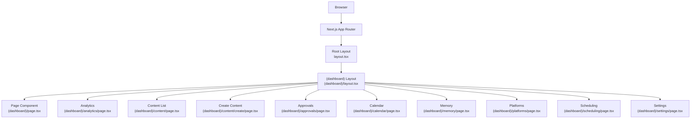
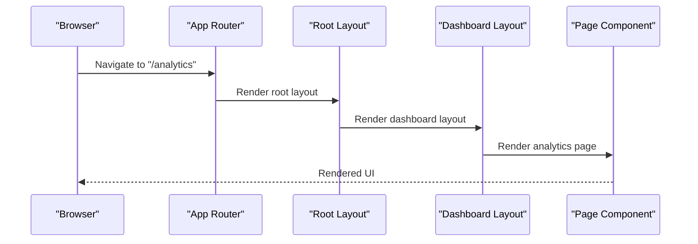
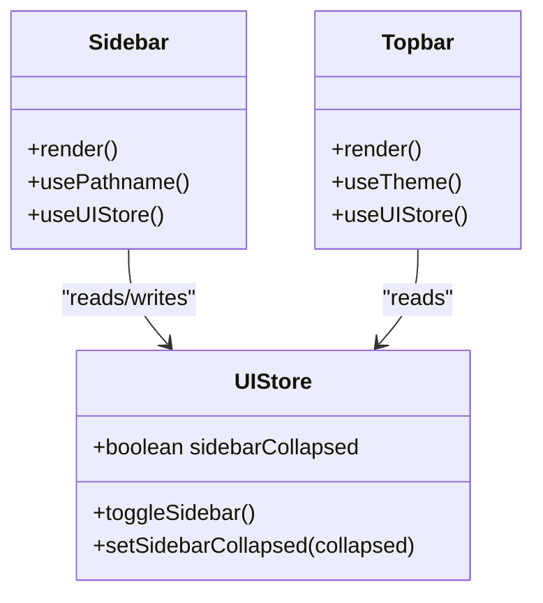
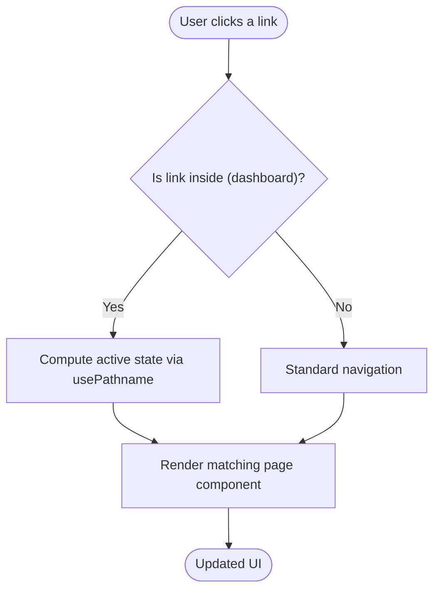
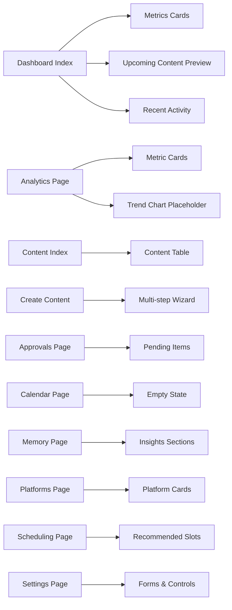
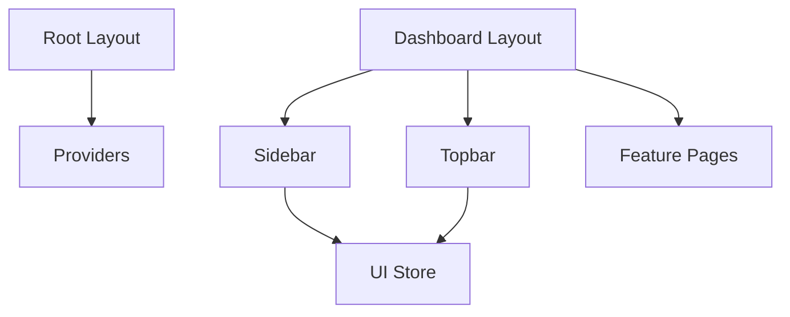

# Routing System

<cite>
**Referenced Files in This Document**
- [layout.tsx](file://frontend/src/app/layout.tsx)
- [(dashboard)/layout.tsx](file://frontend/src/app/(dashboard)/layout.tsx)
- [(dashboard)/page.tsx](file://frontend/src/app/(dashboard)/page.tsx)
- [(dashboard)/analytics/page.tsx](file://frontend/src/app/(dashboard)/analytics/page.tsx)
- [(dashboard)/content/page.tsx](file://frontend/src/app/(dashboard)/content/page.tsx)
- [(dashboard)/content/create/page.tsx](file://frontend/src/app/(dashboard)/content/create/page.tsx)
- [(dashboard)/approvals/page.tsx](file://frontend/src/app/(dashboard)/approvals/page.tsx)
- [(dashboard)/calendar/page.tsx](file://frontend/src/app/(dashboard)/calendar/page.tsx)
- [(dashboard)/memory/page.tsx](file://frontend/src/app/(dashboard)/memory/page.tsx)
- [(dashboard)/platforms/page.tsx](file://frontend/src/app/(dashboard)/platforms/page.tsx)
- [(dashboard)/scheduling/page.tsx](file://frontend/src/app/(dashboard)/scheduling/page.tsx)
- [(dashboard)/settings/page.tsx](file://frontend/src/app/(dashboard)/settings/page.tsx)
- [sidebar.tsx](file://frontend/src/components/layout/sidebar.tsx)
- [topbar.tsx](file://frontend/src/components/layout/topbar.tsx)
- [ui-store.ts](file://frontend/src/stores/ui-store.ts)
</cite>

## Table of Contents
1. [Introduction](#introduction)
2. [Project Structure](#project-structure)
3. [Core Components](#core-components)
4. [Architecture Overview](#architecture-overview)
5. [Detailed Component Analysis](#detailed-component-analysis)
6. [Dependency Analysis](#dependency-analysis)
7. [Performance Considerations](#performance-considerations)
8. [Troubleshooting Guide](#troubleshooting-guide)
9. [Conclusion](#conclusion)
10. [Appendices](#appendices)

## Introduction
This document explains Socialium’s Next.js 16 App Router-based routing system. It focuses on route groups, nested layouts, and dynamic routing patterns, with special emphasis on the (dashboard) route group that organizes the main application pages. You will learn how file-based routing maps to components, how layouts cascade from the root to nested dashboard views, and how client-side navigation works via the sidebar and links. The guide also covers best practices for organizing routes by feature and maintaining clean URL structures.

## Project Structure
Socialium’s frontend uses Next.js file-based routing under frontend/src/app. The root layout defines global HTML and provider wrapping. The (dashboard) route group encapsulates authenticated application pages and shares a common layout with sidebar and topbar.

```mermaid
graph TB
root_layout["Root Layout<br/>frontend/src/app/layout.tsx"]
dash_group["Route Group (dashboard)<br/>frontend/src/app/(dashboard)"]
dash_layout["Dashboard Layout<br/>frontend/src/app/(dashboard)/layout.tsx"]
dash_index["Dashboard Index<br/>frontend/src/app/(dashboard)/page.tsx"]
analytics["Analytics Page<br/>frontend/src/app/(dashboard)/analytics/page.tsx"]
content_index["Content Index<br/>frontend/src/app/(dashboard)/content/page.tsx"]
content_create["Create Content<br/>frontend/src/app/(dashboard)/content/create/page.tsx"]
approvals["Approvals Page<br/>frontend/src/app/(dashboard)/approvals/page.tsx"]
calendar["Calendar Page<br/>frontend/src/app/(dashboard)/calendar/page.tsx"]
memory["Memory Page<br/>frontend/src/app/(dashboard)/memory/page.tsx"]
platforms["Platforms Page<br/>frontend/src/app/(dashboard)/platforms/page.tsx"]
scheduling["Scheduling Page<br/>frontend/src/app/(dashboard)/scheduling/page.tsx"]
settings["Settings Page<br/>frontend/src/app/(dashboard)/settings/page.tsx"]
root_layout --> dash_group
dash_group --> dash_layout
dash_layout --> dash_index
dash_layout --> analytics
dash_layout --> content_index
dash_layout --> content_create
dash_layout --> approvals
dash_layout --> calendar
dash_layout --> memory
dash_layout --> platforms
dash_layout --> scheduling
dash_layout --> settings
```

**Diagram sources**
- [layout.tsx](file://frontend/src/app/layout.tsx#L1-L38)
- [(dashboard)/layout.tsx](file://frontend/src/app/(dashboard)/layout.tsx#L1-L24)
- [(dashboard)/page.tsx](file://frontend/src/app/(dashboard)/page.tsx#L1-L136)
- [(dashboard)/analytics/page.tsx](file://frontend/src/app/(dashboard)/analytics/page.tsx#L1-L53)
- [(dashboard)/content/page.tsx](file://frontend/src/app/(dashboard)/content/page.tsx#L1-L113)
- [(dashboard)/content/create/page.tsx](file://frontend/src/app/(dashboard)/content/create/page.tsx#L1-L163)
- [(dashboard)/approvals/page.tsx](file://frontend/src/app/(dashboard)/approvals/page.tsx#L1-L62)
- [(dashboard)/calendar/page.tsx](file://frontend/src/app/(dashboard)/calendar/page.tsx#L1-L28)
- [(dashboard)/memory/page.tsx](file://frontend/src/app/(dashboard)/memory/page.tsx#L1-L70)
- [(dashboard)/platforms/page.tsx](file://frontend/src/app/(dashboard)/platforms/page.tsx#L1-L62)
- [(dashboard)/scheduling/page.tsx](file://frontend/src/app/(dashboard)/scheduling/page.tsx#L1-L53)
- [(dashboard)/settings/page.tsx](file://frontend/src/app/(dashboard)/settings/page.tsx#L1-L85)

**Section sources**
- [layout.tsx](file://frontend/src/app/layout.tsx#L1-L38)
- [(dashboard)/layout.tsx](file://frontend/src/app/(dashboard)/layout.tsx#L1-L24)

## Core Components
- Root Layout: Provides global metadata, fonts, and wraps children in Providers for theme and state.
- Dashboard Layout: Adds sidebar, topbar, and responsive main area; uses Zustand for UI state.
- Pages: Feature-specific pages under (dashboard) render domain UI and handle client-side navigation.

Key behaviors:
- Route groups: The (dashboard) folder groups related pages and applies a shared layout.
- Nested layouts: The dashboard layout composes Sidebar and Topbar around page content.
- Client navigation: Links and sidebar items navigate using Next.js Link and usePathname.

**Section sources**
- [layout.tsx](file://frontend/src/app/layout.tsx#L16-L19)
- [layout.tsx](file://frontend/src/app/layout.tsx#L21-L37)
- [(dashboard)/layout.tsx](file://frontend/src/app/(dashboard)/layout.tsx#L7-L23)
- [sidebar.tsx](file://frontend/src/components/layout/sidebar.tsx#L30-L40)
- [topbar.tsx](file://frontend/src/components/layout/topbar.tsx#L18-L73)

## Architecture Overview
The routing architecture follows Next.js App Router conventions:
- File system determines URLs.
- Route groups isolate dashboard pages.
- Shared layout injects sidebar and topbar.
- Pages render feature-specific content.

**Diagram sources**
- [layout.tsx](file://frontend/src/app/layout.tsx#L21-L37)
- [(dashboard)/layout.tsx](file://frontend/src/app/(dashboard)/layout.tsx#L7-L23)
- [(dashboard)/page.tsx](file://frontend/src/app/(dashboard)/page.tsx#L31-L135)
- [(dashboard)/analytics/page.tsx](file://frontend/src/app/(dashboard)/analytics/page.tsx#L13-L52)
- [(dashboard)/content/page.tsx](file://frontend/src/app/(dashboard)/content/page.tsx#L33-L112)
- [(dashboard)/content/create/page.tsx](file://frontend/src/app/(dashboard)/content/create/page.tsx#L29-L162)
- [(dashboard)/approvals/page.tsx](file://frontend/src/app/(dashboard)/approvals/page.tsx#L15-L61)
- [(dashboard)/calendar/page.tsx](file://frontend/src/app/(dashboard)/calendar/page.tsx#L7-L27)
- [(dashboard)/memory/page.tsx](file://frontend/src/app/(dashboard)/memory/page.tsx#L34-L69)
- [(dashboard)/platforms/page.tsx](file://frontend/src/app/(dashboard)/platforms/page.tsx#L15-L61)
- [(dashboard)/scheduling/page.tsx](file://frontend/src/app/(dashboard)/scheduling/page.tsx#L15-L52)
- [(dashboard)/settings/page.tsx](file://frontend/src/app/(dashboard)/settings/page.tsx#L12-L84)

## Detailed Component Analysis

### Route Groups and Nested Layouts
- Route group (dashboard): Encapsulates authenticated pages and a shared layout.
- Layout hierarchy:
  - Root layout sets HTML metadata and wraps children in Providers.
  - Dashboard layout injects Sidebar and Topbar and renders page children.

**Diagram sources**
- [layout.tsx](file://frontend/src/app/layout.tsx#L21-L37)
- [(dashboard)/layout.tsx](file://frontend/src/app/(dashboard)/layout.tsx#L7-L23)
- [(dashboard)/analytics/page.tsx](file://frontend/src/app/(dashboard)/analytics/page.tsx#L13-L52)

**Section sources**
- [layout.tsx](file://frontend/src/app/layout.tsx#L21-L37)
- [(dashboard)/layout.tsx](file://frontend/src/app/(dashboard)/layout.tsx#L7-L23)

### Dashboard Layout Composition
- Sidebar: Renders navigation items and toggles collapse state; uses pathname to highlight active link.
- Topbar: Provides search, theme toggle, notifications, and user menu.
- UI state: Zustand store controls sidebar collapsed state and exposes toggle/setters.

**Diagram sources**
- [sidebar.tsx](file://frontend/src/components/layout/sidebar.tsx#L42-L122)
- [topbar.tsx](file://frontend/src/components/layout/topbar.tsx#L18-L75)
- [ui-store.ts](file://frontend/src/stores/ui-store.ts#L11-L15)

**Section sources**
- [sidebar.tsx](file://frontend/src/components/layout/sidebar.tsx#L42-L98)
- [topbar.tsx](file://frontend/src/components/layout/topbar.tsx#L18-L73)
- [ui-store.ts](file://frontend/src/stores/ui-store.ts#L11-L15)

### Dynamic Routing and Client Navigation
- File-based routing: URLs mirror filesystem under src/app. Example: /content/create maps to content/create/page.tsx.
- Client navigation: Pages use Next.js Link to navigate internally; sidebar items also use Link to navigate.
- Active state: Sidebar computes active link using usePathname and supports partial matches for nested routes.

**Diagram sources**
- [sidebar.tsx](file://frontend/src/components/layout/sidebar.tsx#L64-L67)
- [sidebar.tsx](file://frontend/src/components/layout/sidebar.tsx#L70-L84)
- [(dashboard)/content/create/page.tsx](file://frontend/src/app/(dashboard)/content/create/page.tsx#L35-L39)

**Section sources**
- [(dashboard)/content/create/page.tsx](file://frontend/src/app/(dashboard)/content/create/page.tsx#L35-L39)
- [sidebar.tsx](file://frontend/src/components/layout/sidebar.tsx#L64-L67)

### Feature Pages Under (dashboard)
- Dashboard index: Shows metrics and recent activity.
- Analytics: Displays engagement metrics and trends.
- Content: Lists drafts/posts with actions; nested create page for multi-step creation.
- Approvals: Shows pending content with feedback controls.
- Calendar: Placeholder for scheduled content.
- Memory: Displays learned brand insights.
- Platforms: Manages platform connections.
- Scheduling: Recommends optimal posting times.
- Settings: Manages profile, preferences, and security.

**Diagram sources**
- [(dashboard)/page.tsx](file://frontend/src/app/(dashboard)/page.tsx#L17-L29)
- [(dashboard)/page.tsx](file://frontend/src/app/(dashboard)/page.tsx#L58-L78)
- [(dashboard)/page.tsx](file://frontend/src/app/(dashboard)/page.tsx#L80-L132)
- [(dashboard)/analytics/page.tsx](file://frontend/src/app/(dashboard)/analytics/page.tsx#L6-L11)
- [(dashboard)/analytics/page.tsx](file://frontend/src/app/(dashboard)/analytics/page.tsx#L21-L37)
- [(dashboard)/content/page.tsx](file://frontend/src/app/(dashboard)/content/page.tsx#L26-L31)
- [(dashboard)/content/page.tsx](file://frontend/src/app/(dashboard)/content/page.tsx#L47-L109)
- [(dashboard)/content/create/page.tsx](file://frontend/src/app/(dashboard)/content/create/page.tsx#L29-L162)
- [(dashboard)/approvals/page.tsx](file://frontend/src/app/(dashboard)/approvals/page.tsx#L10-L13)
- [(dashboard)/approvals/page.tsx](file://frontend/src/app/(dashboard)/approvals/page.tsx#L24-L57)
- [(dashboard)/calendar/page.tsx](file://frontend/src/app/(dashboard)/calendar/page.tsx#L7-L27)
- [(dashboard)/memory/page.tsx](file://frontend/src/app/(dashboard)/memory/page.tsx#L7-L32)
- [(dashboard)/memory/page.tsx](file://frontend/src/app/(dashboard)/memory/page.tsx#L42-L66)
- [(dashboard)/platforms/page.tsx](file://frontend/src/app/(dashboard)/platforms/page.tsx#L8-L13)
- [(dashboard)/platforms/page.tsx](file://frontend/src/app/(dashboard)/platforms/page.tsx#L23-L57)
- [(dashboard)/scheduling/page.tsx](file://frontend/src/app/(dashboard)/scheduling/page.tsx#L8-L13)
- [(dashboard)/scheduling/page.tsx](file://frontend/src/app/(dashboard)/scheduling/page.tsx#L32-L47)
- [(dashboard)/settings/page.tsx](file://frontend/src/app/(dashboard)/settings/page.tsx#L12-L84)

**Section sources**
- [(dashboard)/page.tsx](file://frontend/src/app/(dashboard)/page.tsx#L31-L135)
- [(dashboard)/analytics/page.tsx](file://frontend/src/app/(dashboard)/analytics/page.tsx#L13-L52)
- [(dashboard)/content/page.tsx](file://frontend/src/app/(dashboard)/content/page.tsx#L33-L112)
- [(dashboard)/content/create/page.tsx](file://frontend/src/app/(dashboard)/content/create/page.tsx#L29-L162)
- [(dashboard)/approvals/page.tsx](file://frontend/src/app/(dashboard)/approvals/page.tsx#L15-L61)
- [(dashboard)/calendar/page.tsx](file://frontend/src/app/(dashboard)/calendar/page.tsx#L7-L27)
- [(dashboard)/memory/page.tsx](file://frontend/src/app/(dashboard)/memory/page.tsx#L34-L69)
- [(dashboard)/platforms/page.tsx](file://frontend/src/app/(dashboard)/platforms/page.tsx#L15-L61)
- [(dashboard)/scheduling/page.tsx](file://frontend/src/app/(dashboard)/scheduling/page.tsx#L15-L52)
- [(dashboard)/settings/page.tsx](file://frontend/src/app/(dashboard)/settings/page.tsx#L12-L84)

## Dependency Analysis
- Root layout depends on Providers to initialize theme and state.
- Dashboard layout depends on Sidebar and Topbar and uses UI store for state.
- Pages depend on UI primitives and icons from the shared component library.
- Sidebar depends on usePathname for active link detection and UI store for collapsing behavior.

**Diagram sources**
- [layout.tsx](file://frontend/src/app/layout.tsx#L4-L4)
- [(dashboard)/layout.tsx](file://frontend/src/app/(dashboard)/layout.tsx#L3-L5)
- [sidebar.tsx](file://frontend/src/components/layout/sidebar.tsx#L4-L6)
- [topbar.tsx](file://frontend/src/components/layout/topbar.tsx#L3-L3)
- [ui-store.ts](file://frontend/src/stores/ui-store.ts#L11-L15)

**Section sources**
- [layout.tsx](file://frontend/src/app/layout.tsx#L4-L4)
- [(dashboard)/layout.tsx](file://frontend/src/app/(dashboard)/layout.tsx#L3-L5)
- [sidebar.tsx](file://frontend/src/components/layout/sidebar.tsx#L4-L6)
- [topbar.tsx](file://frontend/src/components/layout/topbar.tsx#L3-L3)
- [ui-store.ts](file://frontend/src/stores/ui-store.ts#L11-L15)

## Performance Considerations
- Keep layout components lightweight; avoid heavy computations in shared layouts.
- Use client components sparingly; only where interactivity is required (e.g., forms, wizards).
- Prefer server-rendered pages for initial loads; leverage client navigation for subsequent transitions.
- Minimize re-renders by structuring state in small, focused stores (as seen with UI store).

## Troubleshooting Guide
- Active link highlighting: If sidebar highlights the wrong item, verify the pathname comparison logic and ensure nested routes match the intended prefix.
- Navigation not working: Confirm that Link destinations match the file-based routing structure (e.g., /content/create corresponds to content/create/page.tsx).
- Layout not applying: Ensure the (dashboard) route group exists and the dashboard layout is present; pages must be placed under this group to inherit the layout.

**Section sources**
- [sidebar.tsx](file://frontend/src/components/layout/sidebar.tsx#L64-L67)
- [sidebar.tsx](file://frontend/src/components/layout/sidebar.tsx#L70-L84)
- [(dashboard)/content/create/page.tsx](file://frontend/src/app/(dashboard)/content/create/page.tsx#L35-L39)
- [(dashboard)/layout.tsx](file://frontend/src/app/(dashboard)/layout.tsx#L7-L23)

## Conclusion
Socialium’s routing system leverages Next.js App Router to organize the application under a (dashboard) route group with a shared layout. The root layout initializes global providers, while the dashboard layout integrates sidebar and topbar. Pages are organized by feature, enabling clean URLs and predictable navigation. Client-side navigation is handled via Next.js Link and usePathname, ensuring smooth transitions and accurate active-state highlighting.

## Appendices
- Best practices:
  - Organize routes by feature under a single route group for cohesive navigation.
  - Maintain clean URLs by mirroring filesystem structure.
  - Use client components only where necessary; keep server-rendered pages for initial loads.
  - Centralize UI state (e.g., sidebar collapse) in a small store to minimize coupling.