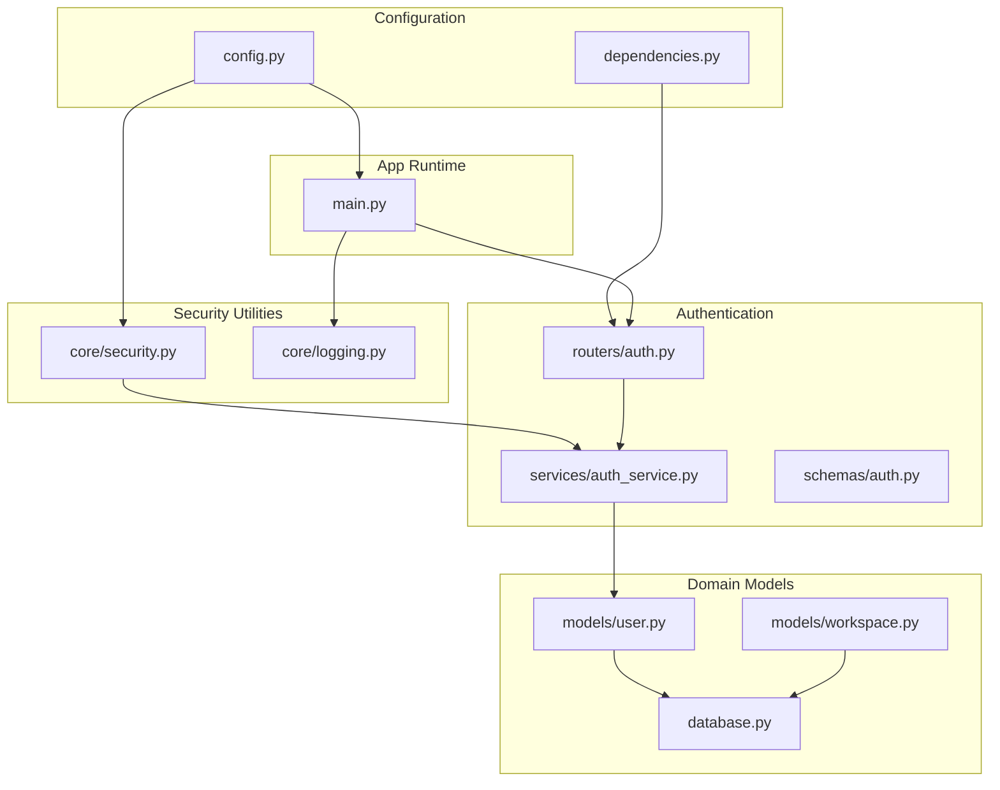
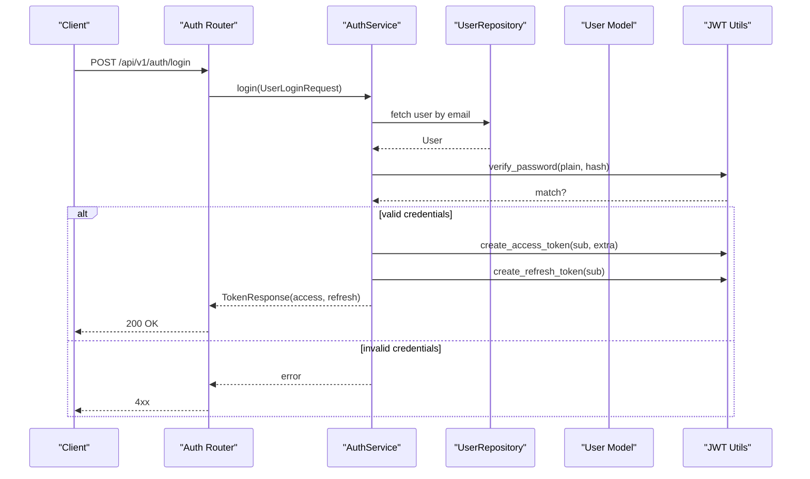
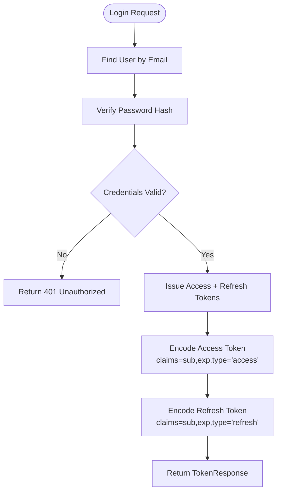
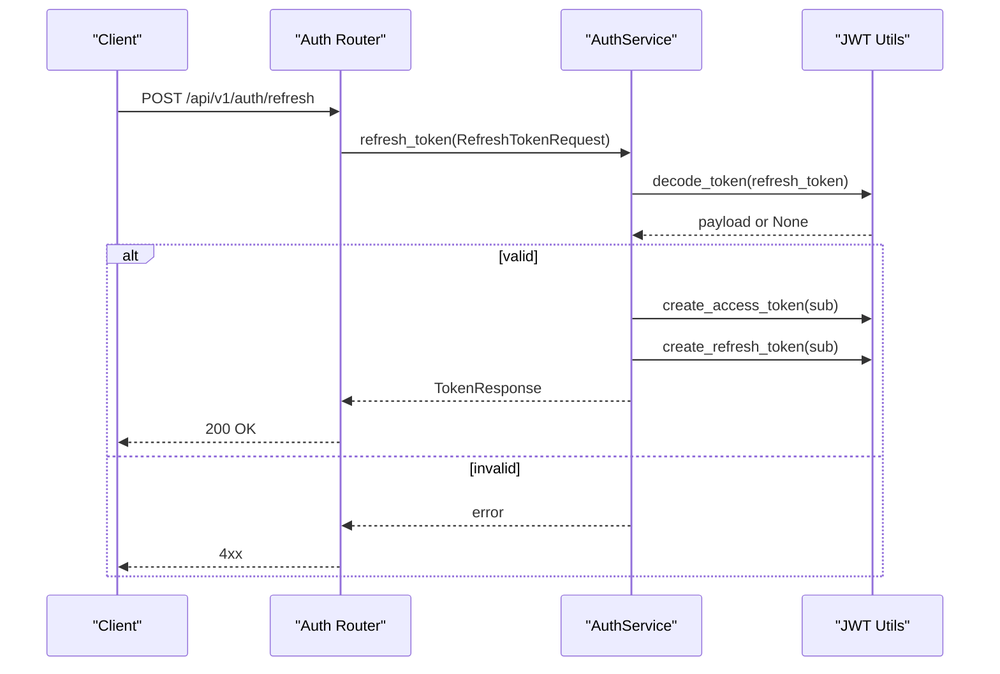
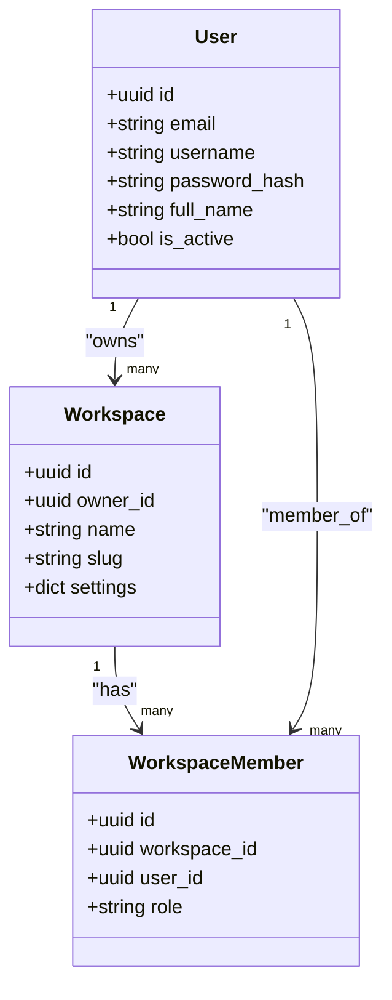
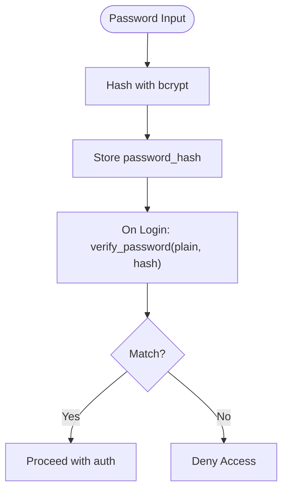
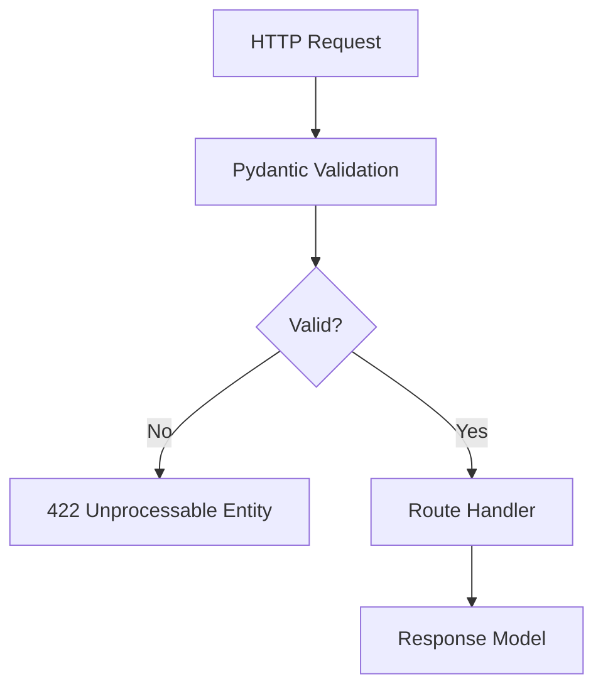
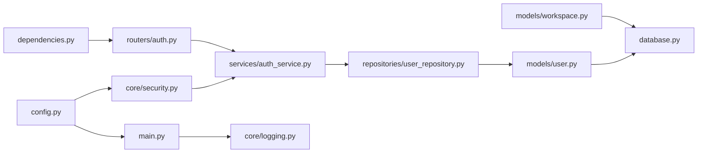

# Security Architecture

<cite>
**Referenced Files in This Document**
- [security.py](file://backend/app/core/security.py)
- [auth.py](file://backend/app/routers/auth.py)
- [auth_service.py](file://backend/app/services/auth_service.py)
- [auth.py](file://backend/app/schemas/auth.py)
- [config.py](file://backend/app/config.py)
- [constants.py](file://backend/app/core/constants.py)
- [user.py](file://backend/app/models/user.py)
- [workspace.py](file://backend/app/models/workspace.py)
- [main.py](file://backend/app/main.py)
- [logging.py](file://backend/app/core/logging.py)
- [database.py](file://backend/app/database.py)
- [user_repository.py](file://backend/app/repositories/user_repository.py)
- [dependencies.py](file://backend/app/dependencies.py)
</cite>

## Table of Contents
1. [Introduction](#introduction)
2. [Project Structure](#project-structure)
3. [Core Components](#core-components)
4. [Architecture Overview](#architecture-overview)
5. [Detailed Component Analysis](#detailed-component-analysis)
6. [Dependency Analysis](#dependency-analysis)
7. [Performance Considerations](#performance-considerations)
8. [Troubleshooting Guide](#troubleshooting-guide)
9. [Conclusion](#conclusion)
10. [Appendices](#appendices)

## Introduction
This document describes Socialium’s comprehensive security model across authentication, authorization, and data protection. It covers the JWT-based authentication system, token lifecycle management, RBAC for workspace-based permissions, password security and encryption, API security patterns, CSRF protection posture, content security policy (CSP) and secure headers configuration, monitoring and audit logging, incident response considerations, and third-party integration security.

## Project Structure
Security-critical components are organized by layer:
- Configuration and environment settings
- Core security utilities (JWT and password hashing)
- Authentication router and service
- Data models for users and workspaces
- Logging and database session management
- Middleware and CORS configuration

**Diagram sources**
- [config.py](file://backend/app/config.py#L9-L82)
- [dependencies.py](file://backend/app/dependencies.py#L1-L14)
- [security.py](file://backend/app/core/security.py#L1-L50)
- [logging.py](file://backend/app/core/logging.py#L1-L25)
- [auth.py](file://backend/app/routers/auth.py#L1-L69)
- [auth_service.py](file://backend/app/services/auth_service.py#L1-L68)
- [auth.py](file://backend/app/schemas/auth.py#L1-L63)
- [user.py](file://backend/app/models/user.py#L1-L48)
- [workspace.py](file://backend/app/models/workspace.py#L1-L73)
- [database.py](file://backend/app/database.py#L1-L43)
- [main.py](file://backend/app/main.py#L1-L83)

**Section sources**
- [config.py](file://backend/app/config.py#L9-L82)
- [main.py](file://backend/app/main.py#L1-L83)

## Core Components
- JWT utilities: password hashing, token creation, decoding, and validation
- Authentication router exposing signup, login, refresh, and profile endpoints
- Authentication service orchestrating user lifecycle and token issuance
- Pydantic schemas enforcing request/response validation
- Configuration for JWT parameters and environment variables
- RBAC constants for workspace roles
- User and Workspace models supporting ownership and memberships
- Structured logging and database session management

**Section sources**
- [security.py](file://backend/app/core/security.py#L1-L50)
- [auth.py](file://backend/app/routers/auth.py#L1-L69)
- [auth_service.py](file://backend/app/services/auth_service.py#L1-L68)
- [auth.py](file://backend/app/schemas/auth.py#L1-L63)
- [config.py](file://backend/app/config.py#L32-L36)
- [constants.py](file://backend/app/core/constants.py#L39-L44)
- [user.py](file://backend/app/models/user.py#L14-L44)
- [workspace.py](file://backend/app/models/workspace.py#L14-L72)
- [logging.py](file://backend/app/core/logging.py#L1-L25)
- [database.py](file://backend/app/database.py#L1-L43)

## Architecture Overview
The authentication flow integrates FastAPI routing, a service layer, and persistence via SQLAlchemy. JWT tokens carry identity and type claims; refresh tokens enable long-lived sessions. RBAC is enforced at the workspace level using role enums.

**Diagram sources**
- [auth.py](file://backend/app/routers/auth.py#L29-L37)
- [auth_service.py](file://backend/app/services/auth_service.py#L35-L45)
- [user_repository.py](file://backend/app/repositories/user_repository.py#L25-L27)
- [user.py](file://backend/app/models/user.py#L14-L44)
- [security.py](file://backend/app/core/security.py#L15-L49)

## Detailed Component Analysis

### JWT-Based Authentication System
- Password hashing: bcrypt via passlib
- Access token: short-lived with “access” type claim
- Refresh token: long-lived with “refresh” type claim
- Token decoding with symmetric algorithm and secret key
- Configuration-driven expiration and algorithm

**Diagram sources**
- [security.py](file://backend/app/core/security.py#L15-L49)
- [auth_service.py](file://backend/app/services/auth_service.py#L35-L45)
- [config.py](file://backend/app/config.py#L32-L36)

**Section sources**
- [security.py](file://backend/app/core/security.py#L15-L49)
- [auth.py](file://backend/app/schemas/auth.py#L25-L32)
- [config.py](file://backend/app/config.py#L32-L36)

### Token Lifecycle Management
- Access token expiry configured in minutes
- Refresh token expiry configured in days
- Decoding validates signature and algorithm
- Refresh endpoint validates refresh token and reissues token pair

**Diagram sources**
- [auth.py](file://backend/app/routers/auth.py#L40-L47)
- [auth_service.py](file://backend/app/services/auth_service.py#L47-L56)
- [security.py](file://backend/app/core/security.py#L43-L49)
- [config.py](file://backend/app/config.py#L35-L36)

**Section sources**
- [auth.py](file://backend/app/routers/auth.py#L40-L47)
- [auth_service.py](file://backend/app/services/auth_service.py#L47-L56)
- [security.py](file://backend/app/core/security.py#L35-L49)
- [config.py](file://backend/app/config.py#L35-L36)

### Role-Based Access Control (RBAC) and Workspace Permissions
- Workspace roles: owner, editor, viewer
- Workspace model links owner and members
- Member role stored as enum with defaults
- Authorization checks should be enforced at route/service boundaries using workspace membership and role

**Diagram sources**
- [user.py](file://backend/app/models/user.py#L14-L44)
- [workspace.py](file://backend/app/models/workspace.py#L14-L72)
- [constants.py](file://backend/app/core/constants.py#L39-L44)

**Section sources**
- [constants.py](file://backend/app/core/constants.py#L39-L44)
- [workspace.py](file://backend/app/models/workspace.py#L44-L69)
- [user.py](file://backend/app/models/user.py#L42-L44)

### Password Security and Encryption Practices
- Password hashing performed with bcrypt via passlib
- No plaintext password storage
- Secure credential storage via environment variables for secrets

**Diagram sources**
- [security.py](file://backend/app/core/security.py#L15-L22)
- [user.py](file://backend/app/models/user.py#L24-L24)
- [config.py](file://backend/app/config.py#L32-L36)

**Section sources**
- [security.py](file://backend/app/core/security.py#L12-L22)
- [user.py](file://backend/app/models/user.py#L24-L24)
- [config.py](file://backend/app/config.py#L32-L36)

### API Security Patterns
- Request validation via Pydantic models
- Response modeling for tokens and user profiles
- CORS enabled with origin, credentials, and headers configured from settings
- Health endpoint exposed conditionally in debug mode

**Diagram sources**
- [auth.py](file://backend/app/schemas/auth.py#L9-L16)
- [auth.py](file://backend/app/schemas/auth.py#L18-L23)
- [auth.py](file://backend/app/schemas/auth.py#L25-L32)
- [main.py](file://backend/app/main.py#L45-L52)

**Section sources**
- [auth.py](file://backend/app/schemas/auth.py#L9-L63)
- [main.py](file://backend/app/main.py#L45-L52)

### Cross-Site Request Forgery (CSRF) Protection, CSP, and Secure Headers
- CSRF protection: Not implemented in the backend; CSRF tokens are recommended for state-changing forms and cookie-based sessions
- Content Security Policy (CSP): Not configured in the backend; define CSP headers to restrict script sources and mitigate XSS
- Secure headers: Not configured in the backend; configure Strict-Transport-Security, X-Content-Type-Options, X-Frame-Options, Referrer-Policy, etc.

Note: These protections are not present in the current backend codebase and should be added via middleware or framework configuration.

[No sources needed since this section provides general guidance]

### Security Monitoring, Audit Logging, and Incident Response
- Structured logging configured with timestamps and levels
- Third-party loggers suppressed to reduce noise
- Recommendations:
  - Add audit logs for sensitive actions (login, token refresh, profile updates)
  - Integrate with centralized logging and alerting
  - Define incident response playbooks for token leaks, unauthorized access, and data exposure

**Section sources**
- [logging.py](file://backend/app/core/logging.py#L7-L24)

### Third-Party Integrations and External Services
- OAuth client credentials for LinkedIn, Twitter, Instagram, Facebook are configured in settings
- External API communication should use HTTPS, mutual TLS where applicable, and scoped tokens
- Secrets should be managed via environment variables or secret managers
- Rate limiting and circuit breakers should be considered for external APIs

**Section sources**
- [config.py](file://backend/app/config.py#L52-L60)

## Dependency Analysis
The authentication stack depends on configuration, security utilities, and persistence. The router delegates to the service, which coordinates with repositories and models.

**Diagram sources**
- [config.py](file://backend/app/config.py#L9-L82)
- [security.py](file://backend/app/core/security.py#L1-L50)
- [main.py](file://backend/app/main.py#L1-L83)
- [dependencies.py](file://backend/app/dependencies.py#L1-L14)
- [auth.py](file://backend/app/routers/auth.py#L1-L69)
- [auth_service.py](file://backend/app/services/auth_service.py#L1-L68)
- [user_repository.py](file://backend/app/repositories/user_repository.py#L1-L40)
- [user.py](file://backend/app/models/user.py#L1-L48)
- [workspace.py](file://backend/app/models/workspace.py#L1-L73)
- [database.py](file://backend/app/database.py#L1-L43)
- [logging.py](file://backend/app/core/logging.py#L1-L25)

**Section sources**
- [auth.py](file://backend/app/routers/auth.py#L1-L69)
- [auth_service.py](file://backend/app/services/auth_service.py#L1-L68)
- [user_repository.py](file://backend/app/repositories/user_repository.py#L1-L40)
- [user.py](file://backend/app/models/user.py#L1-L48)
- [workspace.py](file://backend/app/models/workspace.py#L1-L73)
- [database.py](file://backend/app/database.py#L1-L43)
- [config.py](file://backend/app/config.py#L9-L82)

## Performance Considerations
- Token operations are lightweight; avoid excessive token issuance
- Use efficient password hashing parameters appropriate for deployment
- Database queries for user lookup should leverage indexed fields (email, username)
- Consider caching user roles and permissions for frequently accessed endpoints

[No sources needed since this section provides general guidance]

## Troubleshooting Guide
- Authentication failures:
  - Verify JWT secret key and algorithm configuration
  - Confirm password hashing and verification logic
  - Check user existence and activation status
- Token validation errors:
  - Ensure token decoding uses the correct secret and algorithm
  - Validate token type claims (“access” vs “refresh”)
- CORS issues:
  - Confirm frontend URL matches allowed origins
  - Ensure credentials and headers are permitted
- Logging:
  - Adjust log levels and review structured logs for errors

**Section sources**
- [security.py](file://backend/app/core/security.py#L43-L49)
- [config.py](file://backend/app/config.py#L32-L36)
- [main.py](file://backend/app/main.py#L45-L52)
- [logging.py](file://backend/app/core/logging.py#L7-L24)

## Conclusion
Socialium’s backend establishes a strong foundation for authentication and authorization using JWT and RBAC. The current implementation provides the building blocks for secure user management, but additional controls are needed for CSRF protection, CSP, secure headers, and comprehensive audit logging. Integrating robust third-party security practices and operational monitoring will further strengthen the platform’s security posture.

[No sources needed since this section summarizes without analyzing specific files]

## Appendices
- Implementation placeholders:
  - Authentication service methods (signup, login, refresh, profile) are marked as not implemented
  - User repository methods are placeholders awaiting implementation
- Recommendations:
  - Implement CSRF protection for cookie-based sessions
  - Add CSP and secure headers middleware
  - Introduce rate limiting and input sanitization
  - Enforce RBAC checks at route/service boundaries
  - Harden third-party OAuth flows with PKCE and token scopes

[No sources needed since this section provides general guidance]