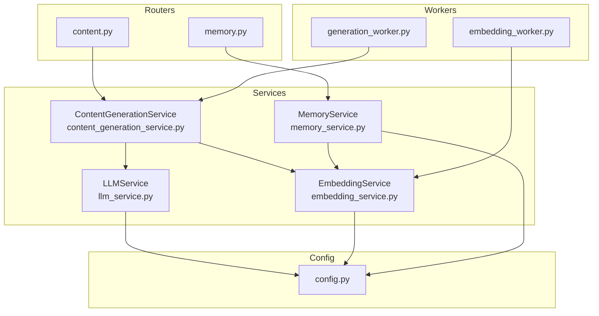
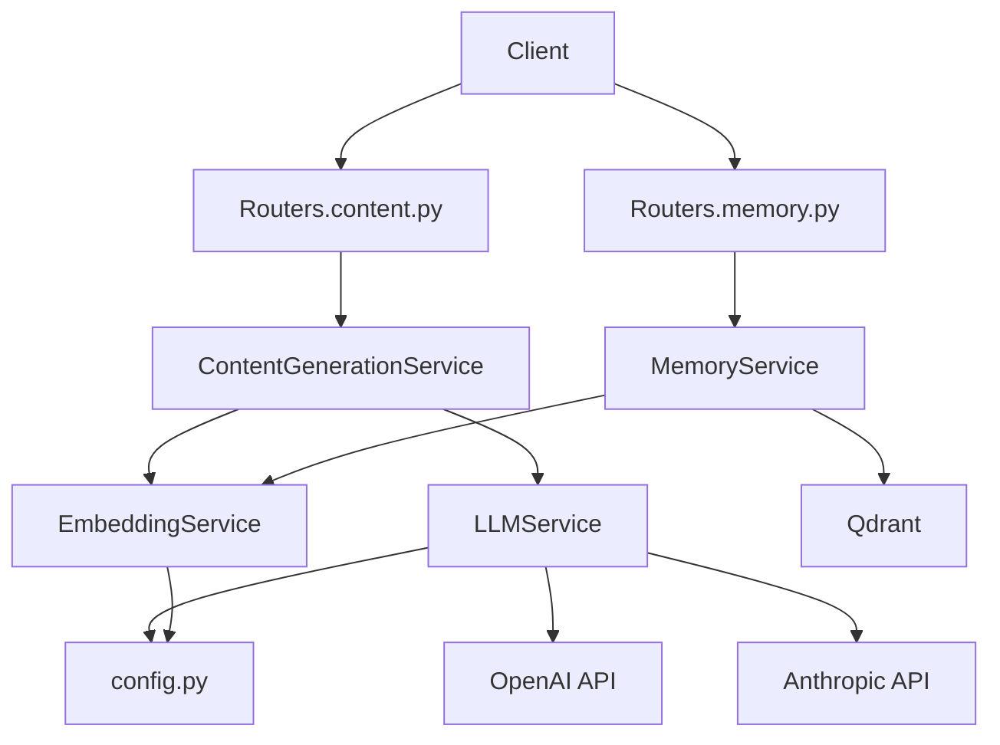
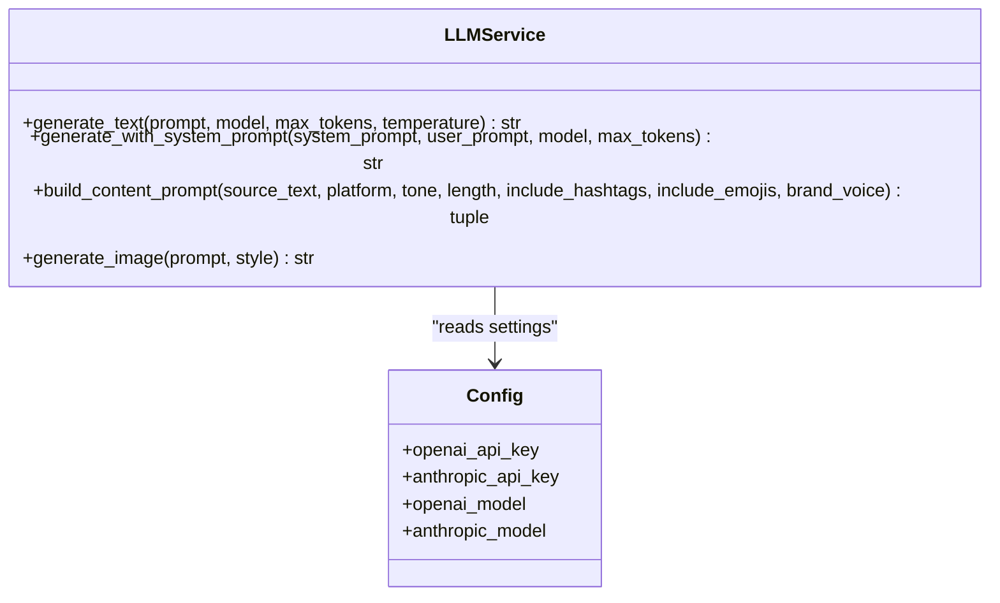
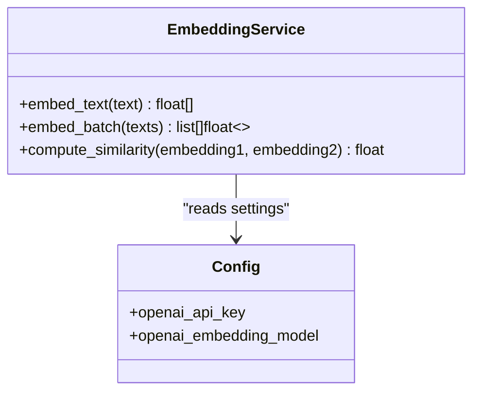
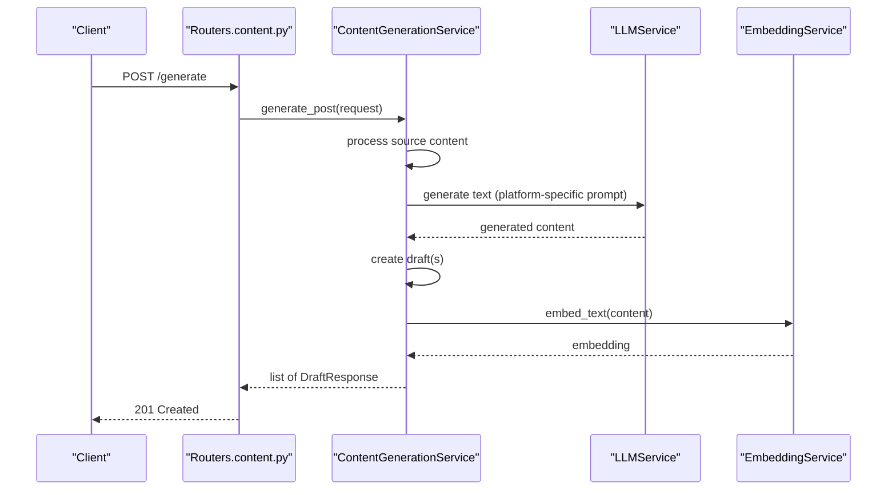
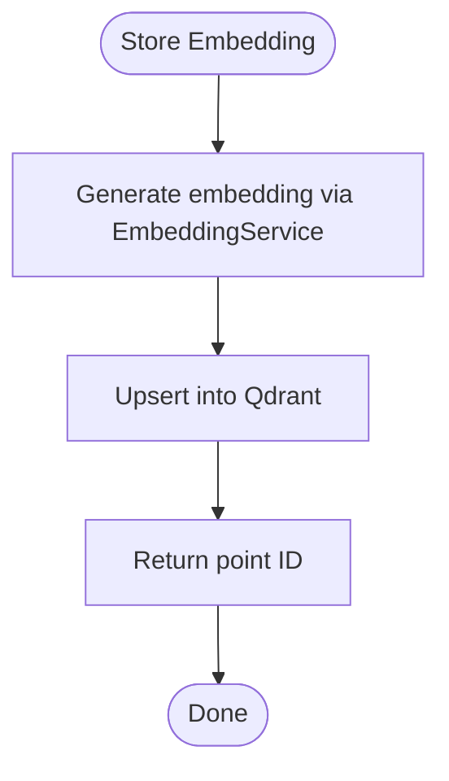
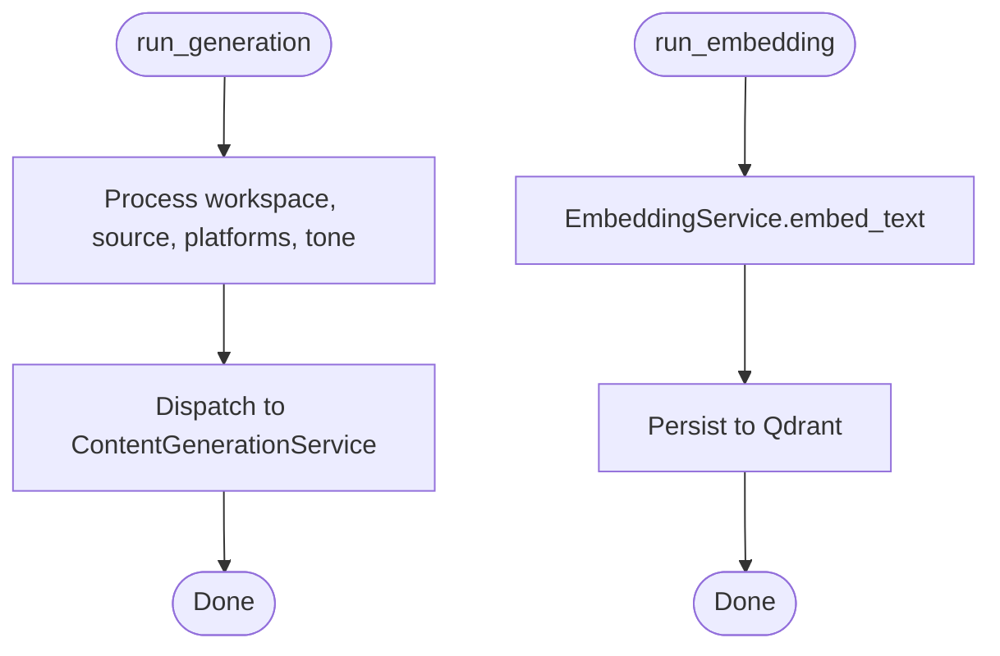
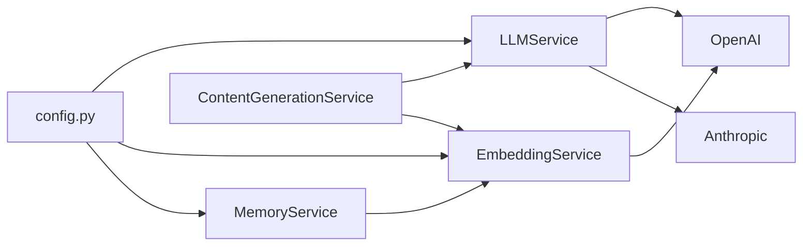

# AI Services

<cite>
**Referenced Files in This Document**
- [llm_service.py](file://backend/app/services/llm_service.py)
- [embedding_service.py](file://backend/app/services/embedding_service.py)
- [content_generation_service.py](file://backend/app/services/content_generation_service.py)
- [memory_service.py](file://backend/app/services/memory_service.py)
- [config.py](file://backend/app/config.py)
- [content.py](file://backend/app/routers/content.py)
- [memory.py](file://backend/app/routers/memory.py)
- [generation_worker.py](file://backend/app/workers/generation_worker.py)
- [embedding_worker.py](file://backend/app/workers/embedding_worker.py)
</cite>

## Table of Contents
1. [Introduction](#introduction)
2. [Project Structure](#project-structure)
3. [Core Components](#core-components)
4. [Architecture Overview](#architecture-overview)
5. [Detailed Component Analysis](#detailed-component-analysis)
6. [Dependency Analysis](#dependency-analysis)
7. [Performance Considerations](#performance-considerations)
8. [Troubleshooting Guide](#troubleshooting-guide)
9. [Conclusion](#conclusion)
10. [Appendices](#appendices)

## Introduction
This document describes the AI services layer responsible for language model orchestration and vector generation. It covers the multi-provider architecture supporting OpenAI GPT and Anthropic Claude, model selection strategies, embedding workflows, and integration patterns with content generation and memory services. It also outlines cost optimization, performance monitoring, error handling, model versioning, A/B testing, and compliance considerations.

## Project Structure
The AI services layer is organized around modular services and workers:
- LLM orchestration: LLMService (multi-provider interface)
- Embedding generation: EmbeddingService (vectorization)
- Content orchestration: ContentGenerationService (multi-agent pipeline)
- Memory and brand voice: MemoryService (semantic storage and retrieval)
- Workers: Background tasks for generation and embedding
- Routers: FastAPI endpoints exposing AI workflows
- Configuration: Centralized settings for providers and infrastructure

**Diagram sources**
- [content.py](file://backend/app/routers/content.py#L1-L94)
- [memory.py](file://backend/app/routers/memory.py#L1-L47)
- [llm_service.py](file://backend/app/services/llm_service.py#L1-L73)
- [embedding_service.py](file://backend/app/services/embedding_service.py#L1-L47)
- [content_generation_service.py](file://backend/app/services/content_generation_service.py#L1-L98)
- [memory_service.py](file://backend/app/services/memory_service.py#L1-L66)
- [generation_worker.py](file://backend/app/workers/generation_worker.py#L1-L7)
- [embedding_worker.py](file://backend/app/workers/embedding_worker.py#L1-L7)
- [config.py](file://backend/app/config.py#L1-L83)

**Section sources**
- [content.py](file://backend/app/routers/content.py#L1-L94)
- [memory.py](file://backend/app/routers/memory.py#L1-L47)
- [llm_service.py](file://backend/app/services/llm_service.py#L1-L73)
- [embedding_service.py](file://backend/app/services/embedding_service.py#L1-L47)
- [content_generation_service.py](file://backend/app/services/content_generation_service.py#L1-L98)
- [memory_service.py](file://backend/app/services/memory_service.py#L1-L66)
- [generation_worker.py](file://backend/app/workers/generation_worker.py#L1-L7)
- [embedding_worker.py](file://backend/app/workers/embedding_worker.py#L1-L7)
- [config.py](file://backend/app/config.py#L1-L83)

## Core Components
- LLMService: Unified interface for OpenAI and Anthropic with prompt engineering, token counting, and error handling. Provides text generation, system-prompt generation, image generation, and platform-specific prompt building.
- EmbeddingService: Generates vectors using OpenAI text-embedding-3-large for semantic memory and content quality scoring. Supports batch embeddings and similarity computation.
- ContentGenerationService: Multi-agent orchestration that coordinates LLMService and EmbeddingService to produce platform-optimized content, manage drafts, and support A/B testing.
- MemoryService: Manages brand voice and semantic memory using vector embeddings, integrates with Qdrant for storage and retrieval.
- Workers: Background tasks for asynchronous generation and embedding to decouple long-running AI workloads from request-response cycles.
- Configuration: Centralized settings for provider credentials, models, and infrastructure (Qdrant, monitoring).

**Section sources**
- [llm_service.py](file://backend/app/services/llm_service.py#L9-L73)
- [embedding_service.py](file://backend/app/services/embedding_service.py#L8-L47)
- [content_generation_service.py](file://backend/app/services/content_generation_service.py#L13-L98)
- [memory_service.py](file://backend/app/services/memory_service.py#L8-L66)
- [config.py](file://backend/app/config.py#L38-L50)

## Architecture Overview
The AI services layer follows a layered architecture:
- Presentation: FastAPI routers expose endpoints for content generation and memory operations.
- Orchestration: Services coordinate AI providers and internal state.
- Persistence: SQLAlchemy-backed models and Qdrant for vector storage.
- Infrastructure: Configuration-driven provider selection and resource settings.

**Diagram sources**
- [content.py](file://backend/app/routers/content.py#L1-L94)
- [memory.py](file://backend/app/routers/memory.py#L1-L47)
- [content_generation_service.py](file://backend/app/services/content_generation_service.py#L13-L98)
- [llm_service.py](file://backend/app/services/llm_service.py#L9-L73)
- [embedding_service.py](file://backend/app/services/embedding_service.py#L8-L47)
- [memory_service.py](file://backend/app/services/memory_service.py#L8-L66)
- [config.py](file://backend/app/config.py#L38-L50)

## Detailed Component Analysis

### LLMService
- Responsibilities:
  - Provider selection based on model identifiers (OpenAI GPT, Anthropic Claude).
  - Prompt engineering and system/user prompt composition.
  - Text generation, image generation via DALL-E 3, and platform-specific content formatting.
  - Error handling and retry strategies.
- Implementation notes:
  - Clients are initialized from configuration.
  - Methods are declared but not implemented in the current codebase; placeholders indicate intended behavior and steps.

**Diagram sources**
- [llm_service.py](file://backend/app/services/llm_service.py#L9-L73)
- [config.py](file://backend/app/config.py#L38-L46)

**Section sources**
- [llm_service.py](file://backend/app/services/llm_service.py#L9-L73)
- [config.py](file://backend/app/config.py#L38-L46)

### EmbeddingService
- Responsibilities:
  - Generate embeddings for single or batch texts using OpenAI text-embedding-3-large.
  - Compute cosine similarity between embeddings.
  - Integrate with MemoryService for semantic search and with ContentGenerationService for quality scoring.
- Implementation notes:
  - Model and client configured from settings.
  - Methods are placeholders indicating intended behavior.

**Diagram sources**
- [embedding_service.py](file://backend/app/services/embedding_service.py#L8-L47)
- [config.py](file://backend/app/config.py#L38-L41)

**Section sources**
- [embedding_service.py](file://backend/app/services/embedding_service.py#L8-L47)
- [config.py](file://backend/app/config.py#L38-L41)

### ContentGenerationService
- Responsibilities:
  - Multi-agent content generation across platforms.
  - Draft lifecycle management (create, list, get, update, update status, delete).
  - A/B testing via content variants.
  - Integration with LLMService and EmbeddingService.
- Implementation notes:
  - Orchestrates steps: extract source content, fetch brand voice, construct prompts, call LLM, optionally generate images, create drafts, embed content, return results.

**Diagram sources**
- [content.py](file://backend/app/routers/content.py#L20-L27)
- [content_generation_service.py](file://backend/app/services/content_generation_service.py#L23-L40)
- [llm_service.py](file://backend/app/services/llm_service.py#L21-L37)
- [embedding_service.py](file://backend/app/services/embedding_service.py#L20-L29)

**Section sources**
- [content_generation_service.py](file://backend/app/services/content_generation_service.py#L13-L98)
- [content.py](file://backend/app/routers/content.py#L20-L27)

### MemoryService
- Responsibilities:
  - Store embeddings in Qdrant and maintain brand voice profiles.
  - Semantic search for similar content patterns.
  - Continuous learning from engagement data.
- Implementation notes:
  - Integrates EmbeddingService for embeddings and Qdrant for storage.

**Diagram sources**
- [memory_service.py](file://backend/app/services/memory_service.py#L19-L27)
- [embedding_service.py](file://backend/app/services/embedding_service.py#L20-L29)

**Section sources**
- [memory_service.py](file://backend/app/services/memory_service.py#L8-L66)

### Workers
- GenerationWorker: Asynchronous task to generate content for specified platforms.
- EmbeddingWorker: Asynchronous task to generate and store embeddings for content.

**Diagram sources**
- [generation_worker.py](file://backend/app/workers/generation_worker.py#L4-L6)
- [embedding_worker.py](file://backend/app/workers/embedding_worker.py#L4-L6)
- [content_generation_service.py](file://backend/app/services/content_generation_service.py#L23-L40)
- [embedding_service.py](file://backend/app/services/embedding_service.py#L20-L29)

**Section sources**
- [generation_worker.py](file://backend/app/workers/generation_worker.py#L1-L7)
- [embedding_worker.py](file://backend/app/workers/embedding_worker.py#L1-L7)

## Dependency Analysis
- Configuration-driven provider selection:
  - LLMService and EmbeddingService depend on settings for API keys and model names.
  - MemoryService depends on Qdrant settings for vector storage.
- Service-to-service dependencies:
  - ContentGenerationService depends on LLMService and EmbeddingService.
  - MemoryService depends on EmbeddingService and Qdrant.
- Router-to-service bindings:
  - Routers instantiate services and delegate requests.

**Diagram sources**
- [config.py](file://backend/app/config.py#L38-L50)
- [llm_service.py](file://backend/app/services/llm_service.py#L16-L19)
- [embedding_service.py](file://backend/app/services/embedding_service.py#L15-L18)
- [memory_service.py](file://backend/app/services/memory_service.py#L8-L14)
- [content_generation_service.py](file://backend/app/services/content_generation_service.py#L13-L18)

**Section sources**
- [config.py](file://backend/app/config.py#L38-L50)
- [llm_service.py](file://backend/app/services/llm_service.py#L16-L19)
- [embedding_service.py](file://backend/app/services/embedding_service.py#L15-L18)
- [memory_service.py](file://backend/app/services/memory_service.py#L8-L14)
- [content_generation_service.py](file://backend/app/services/content_generation_service.py#L13-L18)

## Performance Considerations
- Batch embeddings: Prefer embed_batch for multiple texts to reduce API calls and latency.
- Model selection: Choose smaller, cheaper models for routine tasks; reserve larger models for complex reasoning.
- Prompt engineering: Keep prompts concise and structured to minimize tokens and cost.
- Caching: Cache embeddings and frequently used prompts to avoid redundant calls.
- Concurrency: Use asynchronous clients and background workers to handle bursts.
- Monitoring: Track token usage, latency, and error rates via Langfuse or PostHog settings.

[No sources needed since this section provides general guidance]

## Troubleshooting Guide
- Provider errors:
  - Validate API keys and model availability in settings.
  - Implement retries with exponential backoff for transient failures.
- Rate limits:
  - Monitor provider quotas and stagger requests.
- Embedding mismatches:
  - Ensure consistent model versions and dimensionality.
- Memory retrieval issues:
  - Verify Qdrant connectivity and collection configuration.
- Logging and observability:
  - Use centralized logging and metrics to track failures and latency.

**Section sources**
- [config.py](file://backend/app/config.py#L69-L72)
- [llm_service.py](file://backend/app/services/llm_service.py#L16-L19)
- [embedding_service.py](file://backend/app/services/embedding_service.py#L15-L18)
- [memory_service.py](file://backend/app/services/memory_service.py#L47-L51)

## Conclusion
The AI services layer provides a robust, extensible foundation for multi-provider LLM orchestration and vector generation. By centralizing configuration, integrating with memory and content services, and leveraging background workers, the system supports scalable content generation, semantic search, and continuous learning. Future enhancements should focus on implementing the placeholder methods, adding comprehensive error handling, and enabling dynamic model selection and A/B testing.

[No sources needed since this section summarizes without analyzing specific files]

## Appendices

### Model Selection and Cost Optimization Strategies
- Dynamic provider routing: Select provider based on model capability and cost.
- Temperature and token tuning: Lower temperature and cap max_tokens for deterministic, cheaper outputs.
- Prompt compression: Use summarization and keyword extraction to reduce input size.
- Batch processing: Combine multiple requests to amortize API costs.

[No sources needed since this section provides general guidance]

### A/B Testing and Versioning
- A/B variants: Use ContentGenerationService.generate_variants to compare multiple approaches.
- Model versioning: Pin provider model versions in settings; rotate gradually with canary deployments.
- Compliance: Log prompts and outputs; implement redaction and retention policies.

[No sources needed since this section provides general guidance]