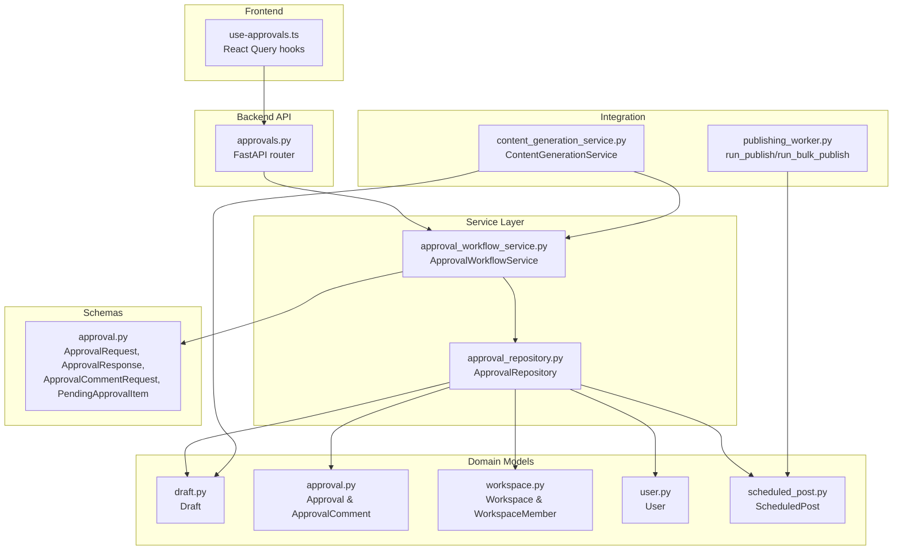
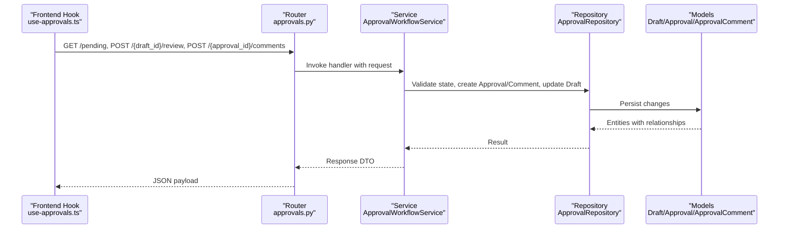
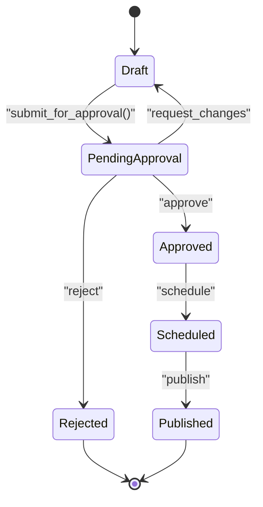
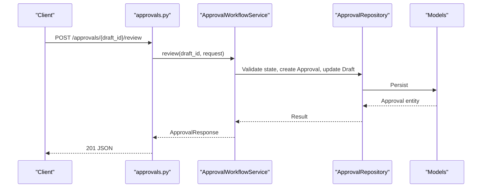
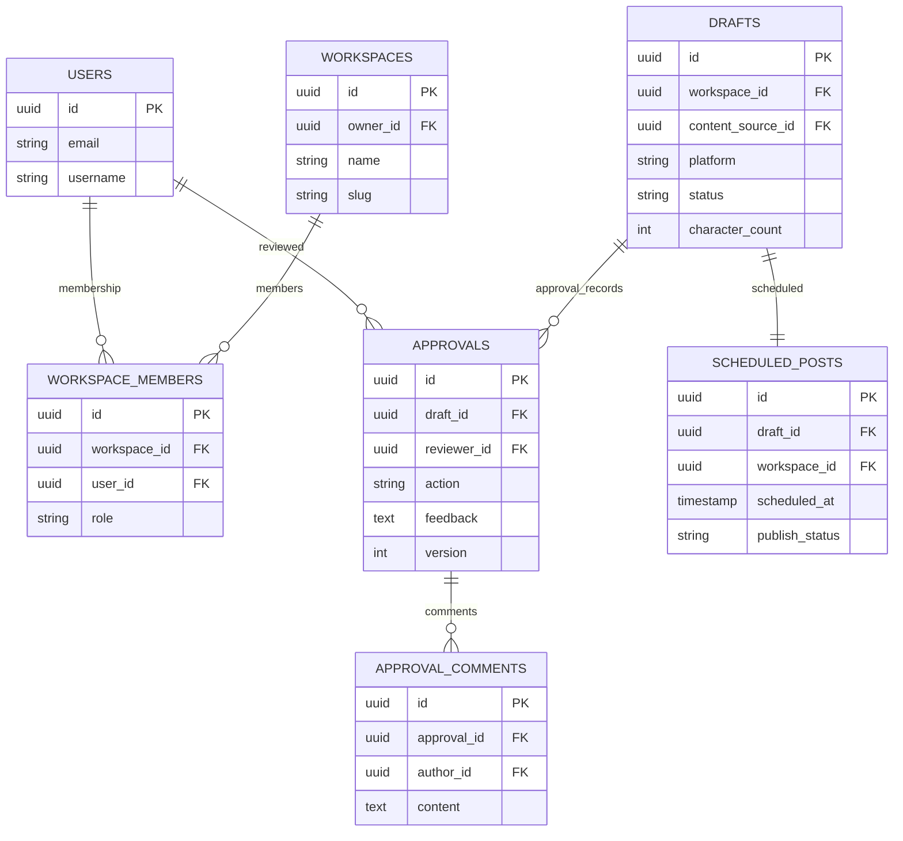
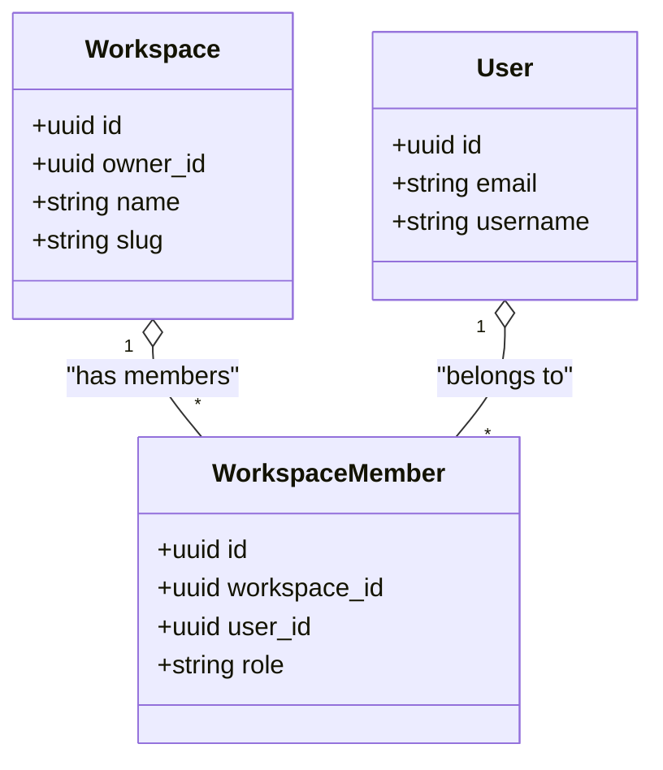
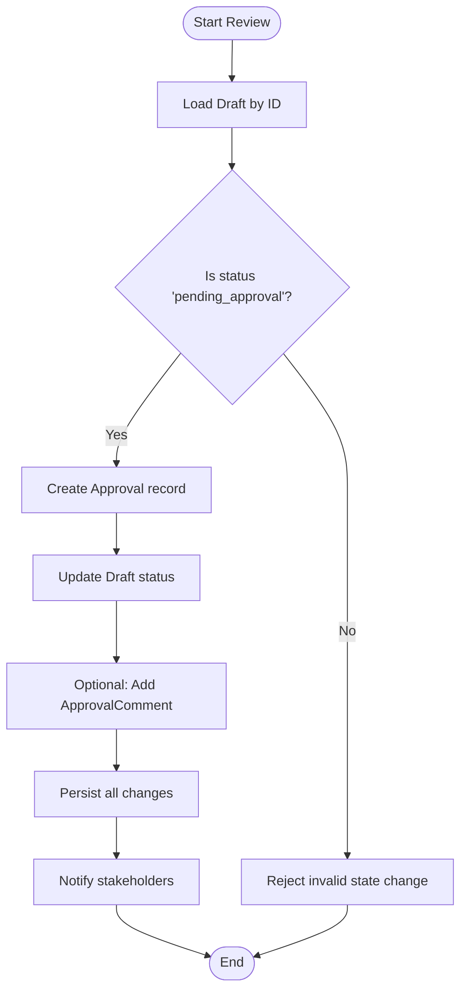
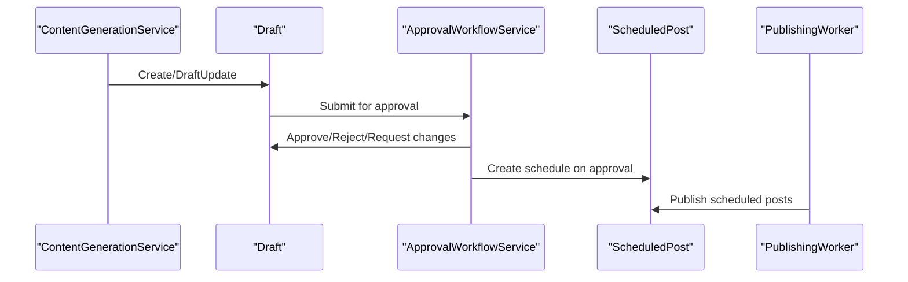
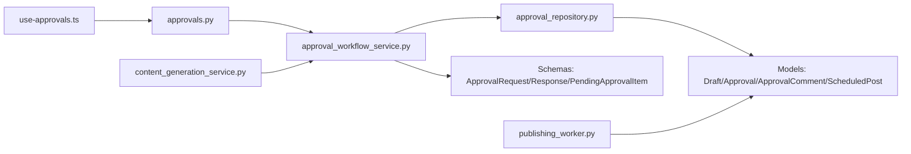

# Approval Workflow Service

<cite>
**Referenced Files in This Document**
- [approval_workflow_service.py](file://backend/app/services/approval_workflow_service.py)
- [approvals.py](file://backend/app/routers/approvals.py)
- [approval.py](file://backend/app/models/approval.py)
- [draft.py](file://backend/app/models/draft.py)
- [constants.py](file://backend/app/core/constants.py)
- [approval_repository.py](file://backend/app/repositories/approval_repository.py)
- [approval.py](file://backend/app/schemas/approval.py)
- [workspace.py](file://backend/app/models/workspace.py)
- [user.py](file://backend/app/models/user.py)
- [content_generation_service.py](file://backend/app/services/content_generation_service.py)
- [publishing_worker.py](file://backend/app/workers/publishing_worker.py)
- [scheduled_post.py](file://backend/app/models/scheduled_post.py)
- [use-approvals.ts](file://frontend/src/hooks/use-approvals.ts)
</cite>

## Table of Contents
1. [Introduction](#introduction)
2. [Project Structure](#project-structure)
3. [Core Components](#core-components)
4. [Architecture Overview](#architecture-overview)
5. [Detailed Component Analysis](#detailed-component-analysis)
6. [Dependency Analysis](#dependency-analysis)
7. [Performance Considerations](#performance-considerations)
8. [Troubleshooting Guide](#troubleshooting-guide)
9. [Conclusion](#conclusion)
10. [Appendices](#appendices)

## Introduction
This document describes the ApprovalWorkflowService that powers collaborative content review and approval. It explains the state machine for content approval, multi-level approval routing, team collaboration features, and integration with workspace-based access control and role permissions. It also documents approval request creation, assignment algorithms, decision handling, notifications, audit trails, and the relationship with the content generation and publishing workflows.

## Project Structure
The approval workflow spans routers, services, repositories, models, schemas, and frontend hooks. The backend defines the API surface and domain logic, while the frontend integrates with React Query to fetch and act on approvals.

**Diagram sources**
- [approvals.py](file://backend/app/routers/approvals.py#L1-L61)
- [approval_workflow_service.py](file://backend/app/services/approval_workflow_service.py#L1-L48)
- [approval_repository.py](file://backend/app/repositories/approval_repository.py#L1-L14)
- [draft.py](file://backend/app/models/draft.py#L1-L71)
- [approval.py](file://backend/app/models/approval.py#L1-L69)
- [workspace.py](file://backend/app/models/workspace.py#L1-L73)
- [user.py](file://backend/app/models/user.py#L1-L48)
- [scheduled_post.py](file://backend/app/models/scheduled_post.py#L1-L56)
- [approval.py](file://backend/app/schemas/approval.py#L1-L69)
- [content_generation_service.py](file://backend/app/services/content_generation_service.py#L1-L98)
- [publishing_worker.py](file://backend/app/workers/publishing_worker.py#L1-L12)
- [use-approvals.ts](file://frontend/src/hooks/use-approvals.ts#L1-L22)

**Section sources**
- [approvals.py](file://backend/app/routers/approvals.py#L1-L61)
- [approval_workflow_service.py](file://backend/app/services/approval_workflow_service.py#L1-L48)
- [approval_repository.py](file://backend/app/repositories/approval_repository.py#L1-L14)
- [draft.py](file://backend/app/models/draft.py#L1-L71)
- [approval.py](file://backend/app/models/approval.py#L1-L69)
- [workspace.py](file://backend/app/models/workspace.py#L1-L73)
- [user.py](file://backend/app/models/user.py#L1-L48)
- [scheduled_post.py](file://backend/app/models/scheduled_post.py#L1-L56)
- [approval.py](file://backend/app/schemas/approval.py#L1-L69)
- [content_generation_service.py](file://backend/app/services/content_generation_service.py#L1-L98)
- [publishing_worker.py](file://backend/app/workers/publishing_worker.py#L1-L12)
- [use-approvals.ts](file://frontend/src/hooks/use-approvals.ts#L1-L22)

## Core Components
- ApprovalWorkflowService: Orchestrates approval state transitions, creates approval records, updates draft status, and manages comments. It currently raises NotImplementedError for all methods, indicating the implementation is pending.
- ApprovalRepository: Defines repository interface methods for listing pending approvals, retrieving history, creating approvals, and creating comments.
- Models: Draft, Approval, ApprovalComment, Workspace, WorkspaceMember, User, ScheduledPost define the persistence layer and relationships.
- Schemas: ApprovalRequest, ApprovalCommentRequest, ApprovalResponse, PendingApprovalItem, ApprovalListResponse define request/response contracts.
- Routers: FastAPI endpoints expose list-pending, get-history, review, and add-comment operations.
- Frontend Hooks: use-approvals.ts integrates with the backend APIs for listing and reviewing approvals.

**Section sources**
- [approval_workflow_service.py](file://backend/app/services/approval_workflow_service.py#L8-L48)
- [approval_repository.py](file://backend/app/repositories/approval_repository.py#L6-L14)
- [draft.py](file://backend/app/models/draft.py#L15-L71)
- [approval.py](file://backend/app/models/approval.py#L14-L69)
- [workspace.py](file://backend/app/models/workspace.py#L14-L73)
- [user.py](file://backend/app/models/user.py#L14-L48)
- [scheduled_post.py](file://backend/app/models/scheduled_post.py#L13-L56)
- [approval.py](file://backend/app/schemas/approval.py#L11-L69)
- [approvals.py](file://backend/app/routers/approvals.py#L19-L61)
- [use-approvals.ts](file://frontend/src/hooks/use-approvals.ts#L7-L22)

## Architecture Overview
The approval workflow follows a state machine with Draft transitioning to Pending Approval and then to Approved, Rejected, or Changes Requested. The service coordinates with the repository to persist decisions and comments, and integrates with the content lifecycle and publishing pipeline.

**Diagram sources**
- [use-approvals.ts](file://frontend/src/hooks/use-approvals.ts#L7-L22)
- [approvals.py](file://backend/app/routers/approvals.py#L19-L61)
- [approval_workflow_service.py](file://backend/app/services/approval_workflow_service.py#L17-L48)
- [approval_repository.py](file://backend/app/repositories/approval_repository.py#L10-L13)
- [draft.py](file://backend/app/models/draft.py#L15-L71)
- [approval.py](file://backend/app/models/approval.py#L14-L69)

## Detailed Component Analysis

### State Machine and Lifecycle
The approval state machine governs Draft lifecycle transitions:
- draft → pending_approval → approved | rejected | changes_requested
- After approval, drafts move toward scheduling and publishing.

**Diagram sources**
- [constants.py](file://backend/app/core/constants.py#L14-L22)
- [draft.py](file://backend/app/models/draft.py#L43-L47)
- [approval_workflow_service.py](file://backend/app/services/approval_workflow_service.py#L25-L39)

**Section sources**
- [constants.py](file://backend/app/core/constants.py#L14-L22)
- [draft.py](file://backend/app/models/draft.py#L43-L47)
- [approval_workflow_service.py](file://backend/app/services/approval_workflow_service.py#L9-L12)

### API Endpoints and Contracts
- GET /approvals/pending: Lists drafts pending approval for a workspace with pagination.
- GET /approvals/history: Retrieves full approval history for a draft.
- POST /approvals/{draft_id}/review: Processes an approval action (approve, reject, request_changes).
- POST /approvals/{approval_id}/comments: Adds a comment to an approval.

**Diagram sources**
- [approvals.py](file://backend/app/routers/approvals.py#L41-L49)
- [approval_workflow_service.py](file://backend/app/services/approval_workflow_service.py#L25-L39)
- [approval_repository.py](file://backend/app/repositories/approval_repository.py#L12-L12)
- [approval.py](file://backend/app/models/approval.py#L14-L42)

**Section sources**
- [approvals.py](file://backend/app/routers/approvals.py#L19-L61)
- [approval.py](file://backend/app/schemas/approval.py#L11-L47)

### Data Models and Relationships
The approval domain comprises Draft, Approval, ApprovalComment, Workspace, WorkspaceMember, User, and ScheduledPost. Relationships:
- Draft has many Approvals and one ScheduledPost.
- Approval belongs to Draft and User (reviewer), and has many ApprovalComments.
- Workspace has many WorkspaceMembers and PlatformAccounts.
- User belongs to many Workspaces via WorkspaceMember.

**Diagram sources**
- [user.py](file://backend/app/models/user.py#L14-L48)
- [workspace.py](file://backend/app/models/workspace.py#L14-L73)
- [draft.py](file://backend/app/models/draft.py#L15-L71)
- [approval.py](file://backend/app/models/approval.py#L14-L69)
- [scheduled_post.py](file://backend/app/models/scheduled_post.py#L13-L56)

**Section sources**
- [user.py](file://backend/app/models/user.py#L14-L48)
- [workspace.py](file://backend/app/models/workspace.py#L14-L73)
- [draft.py](file://backend/app/models/draft.py#L15-L71)
- [approval.py](file://backend/app/models/approval.py#L14-L69)
- [scheduled_post.py](file://backend/app/models/scheduled_post.py#L13-L56)

### Access Control and Role Permissions
- WorkspaceRole defines OWNER, EDITOR, VIEWER.
- WorkspaceMember links users to workspaces with roles.
- Access control should gate who can submit, review, or comment on approvals within a workspace.

**Diagram sources**
- [workspace.py](file://backend/app/models/workspace.py#L14-L73)
- [user.py](file://backend/app/models/user.py#L14-L48)

**Section sources**
- [workspace.py](file://backend/app/models/workspace.py#L39-L72)
- [constants.py](file://backend/app/core/constants.py#L39-L44)

### Audit Trail and History Tracking
- Approval records capture reviewer, action, feedback, and timestamps.
- ApprovalComment captures collaborative commentary with author and timestamps.
- Draft maintains status history implicitly through approval actions.

**Diagram sources**
- [approval_workflow_service.py](file://backend/app/services/approval_workflow_service.py#L25-L39)
- [approval.py](file://backend/app/models/approval.py#L14-L42)
- [draft.py](file://backend/app/models/draft.py#L43-L47)

**Section sources**
- [approval.py](file://backend/app/models/approval.py#L14-L69)
- [approval.py](file://backend/app/schemas/approval.py#L24-L47)

### Multi-Level Approval Routing and Assignment
- Assignment algorithms can be implemented in the repository/service layer to select reviewers based on:
  - Workspace role hierarchy (e.g., require OWNER or EDITOR for approval).
  - Rotation or round-robin assignment.
  - Escalation policies after time thresholds.
- Routing can consider platform-specific rules or team expertise.

[No sources needed since this section proposes implementation strategies not yet present in the codebase]

### Notification Systems
- On approval decisions, notify the content creator and stakeholders.
- On comments, notify participants in the approval thread.
- Notifications can be integrated via background tasks or external services.

[No sources needed since this section proposes implementation strategies not yet present in the codebase]

### Relationship with Content Generation and Publishing
- ContentGenerationService creates Drafts that enter the approval workflow.
- Approved Drafts transition to ScheduledPost for publishing.
- PublishingWorker executes scheduled posts to platforms.

**Diagram sources**
- [content_generation_service.py](file://backend/app/services/content_generation_service.py#L23-L82)
- [draft.py](file://backend/app/models/draft.py#L15-L71)
- [approval_workflow_service.py](file://backend/app/services/approval_workflow_service.py#L45-L47)
- [scheduled_post.py](file://backend/app/models/scheduled_post.py#L13-L56)
- [publishing_worker.py](file://backend/app/workers/publishing_worker.py#L4-L11)

**Section sources**
- [content_generation_service.py](file://backend/app/services/content_generation_service.py#L23-L82)
- [scheduled_post.py](file://backend/app/models/scheduled_post.py#L13-L56)
- [publishing_worker.py](file://backend/app/workers/publishing_worker.py#L4-L11)

### Examples of Approval Scenarios
- Scenario A: Single approver approves content → status becomes approved → ready for scheduling.
- Scenario B: Approver requests changes → status reverts to draft with feedback → creator revises.
- Scenario C: Approver rejects content → status becomes rejected → no publication.

[No sources needed since this section provides conceptual examples]

### Escalation Policies and Workflow Customization
- Escalation: If no action within X hours, escalate to next level (e.g., manager).
- Customization: Allow workspace settings to configure required approvers, visibility, and retention.

[No sources needed since this section proposes implementation strategies not yet present in the codebase]

## Dependency Analysis
The service depends on the repository abstraction, which in turn depends on SQLAlchemy models. The router depends on the service and schemas. Frontend hooks depend on router endpoints.

**Diagram sources**
- [use-approvals.ts](file://frontend/src/hooks/use-approvals.ts#L7-L22)
- [approvals.py](file://backend/app/routers/approvals.py#L19-L61)
- [approval_workflow_service.py](file://backend/app/services/approval_workflow_service.py#L14-L15)
- [approval_repository.py](file://backend/app/repositories/approval_repository.py#L7-L8)
- [draft.py](file://backend/app/models/draft.py#L15-L71)
- [approval.py](file://backend/app/models/approval.py#L14-L69)
- [scheduled_post.py](file://backend/app/models/scheduled_post.py#L13-L56)
- [approval.py](file://backend/app/schemas/approval.py#L11-L69)
- [content_generation_service.py](file://backend/app/services/content_generation_service.py#L23-L82)
- [publishing_worker.py](file://backend/app/workers/publishing_worker.py#L4-L11)

**Section sources**
- [approvals.py](file://backend/app/routers/approvals.py#L19-L61)
- [approval_workflow_service.py](file://backend/app/services/approval_workflow_service.py#L14-L15)
- [approval_repository.py](file://backend/app/repositories/approval_repository.py#L7-L8)
- [approval.py](file://backend/app/schemas/approval.py#L11-L69)

## Performance Considerations
- Pagination: Use page/page_size in list_pending to avoid large result sets.
- Lazy loading: Relationship loading is configured to minimize N+1 queries.
- Asynchronous I/O: Repository and service methods are async to handle concurrent approvals efficiently.
- Indexes: Ensure database indexes on foreign keys and frequently queried fields (e.g., draft workspace_id, approval draft_id).

[No sources needed since this section provides general guidance]

## Troubleshooting Guide
- Endpoint not found: Verify router registration and endpoint paths.
- Validation errors: Ensure request bodies conform to ApprovalRequest and ApprovalCommentRequest schemas.
- Authorization failures: Confirm workspace membership and role checks before allowing review actions.
- Missing data: Check that Draft exists and is in pending_approval state before review.

**Section sources**
- [approvals.py](file://backend/app/routers/approvals.py#L19-L61)
- [approval.py](file://backend/app/schemas/approval.py#L11-L22)

## Conclusion
The ApprovalWorkflowService defines the core approval orchestration, but implementation is pending. The schema, models, and router contracts are established, enabling a clear path to implement state transitions, access control, audit trails, and integrations with content generation and publishing. Future enhancements should focus on repository implementations, assignment algorithms, escalation policies, and notification hooks.

## Appendices

### API Definitions
- GET /approvals/pending
  - Query params: workspace_id (string), page (integer, default 1), page_size (integer, default 20)
  - Response: ApprovalListResponse
- GET /approvals/history?draft_id={draft_id}
  - Response: array of ApprovalResponse
- POST /approvals/{draft_id}/review
  - Body: ApprovalRequest (action, feedback?)
  - Response: ApprovalResponse
- POST /approvals/{approval_id}/comments
  - Body: ApprovalCommentRequest (content)
  - Response: ApprovalCommentResponse

**Section sources**
- [approvals.py](file://backend/app/routers/approvals.py#L19-L61)
- [approval.py](file://backend/app/schemas/approval.py#L11-L69)