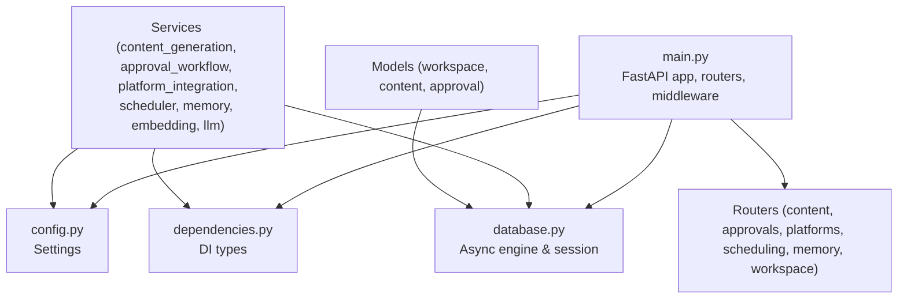
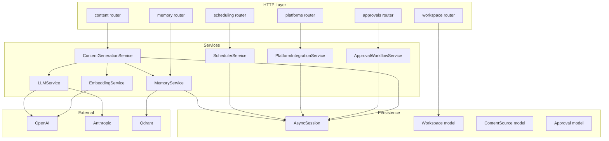
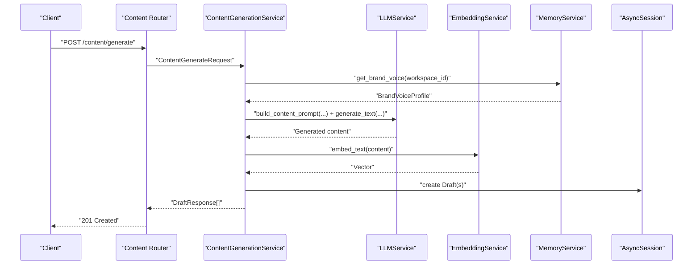
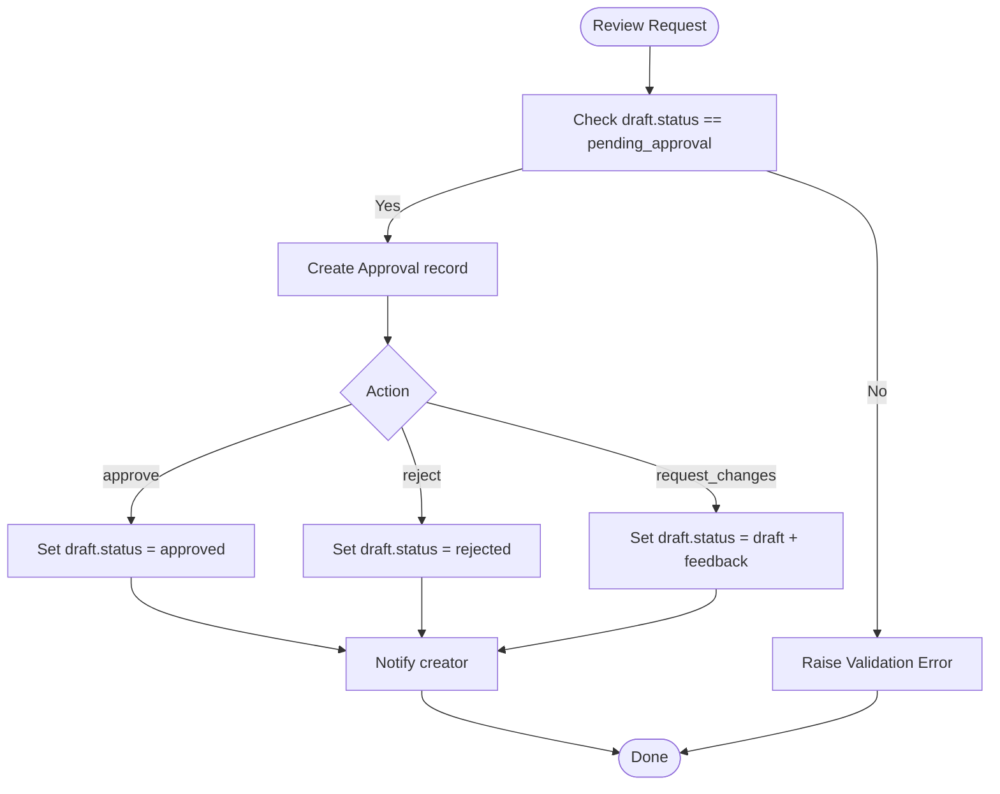
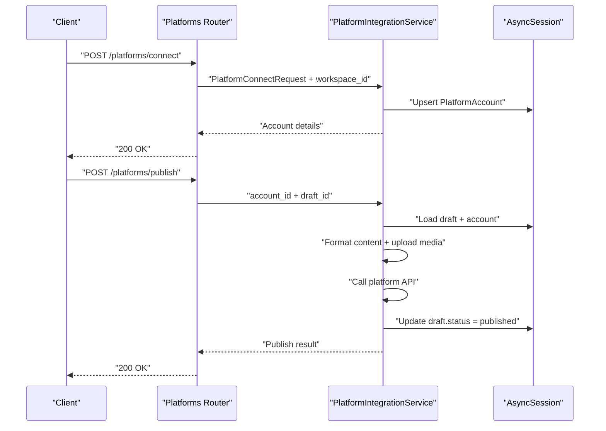
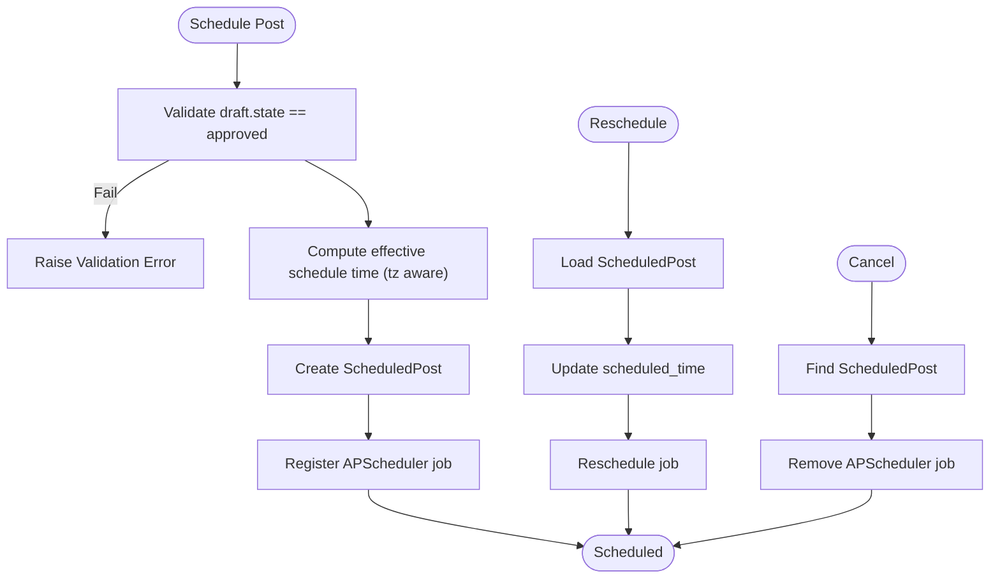
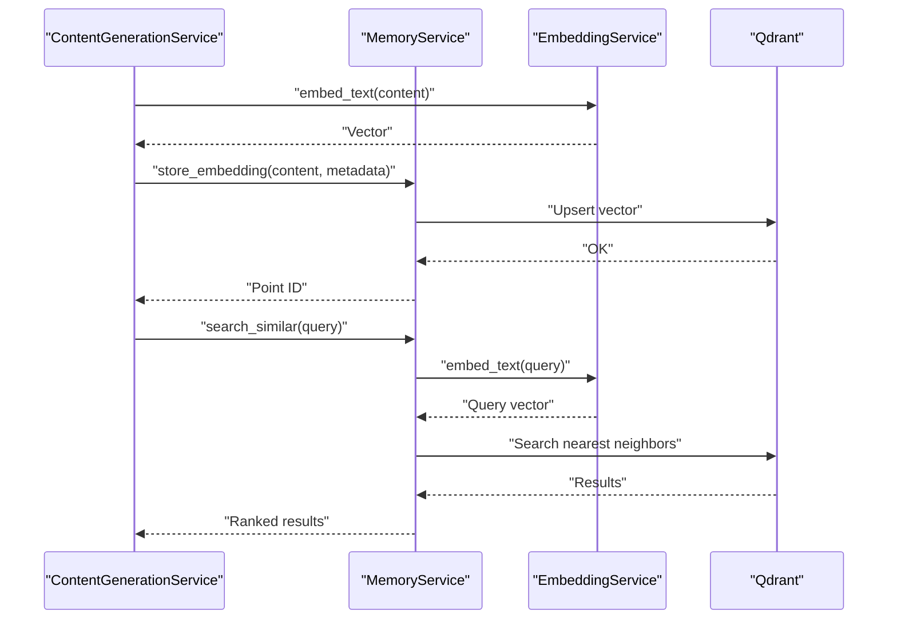
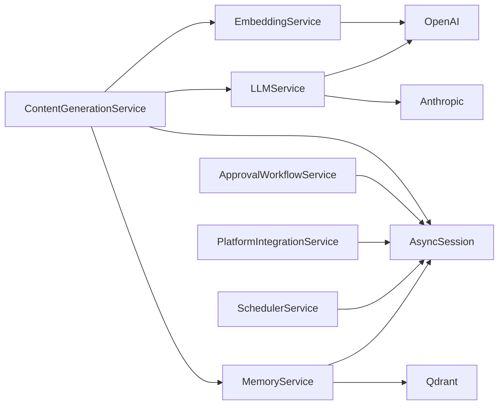
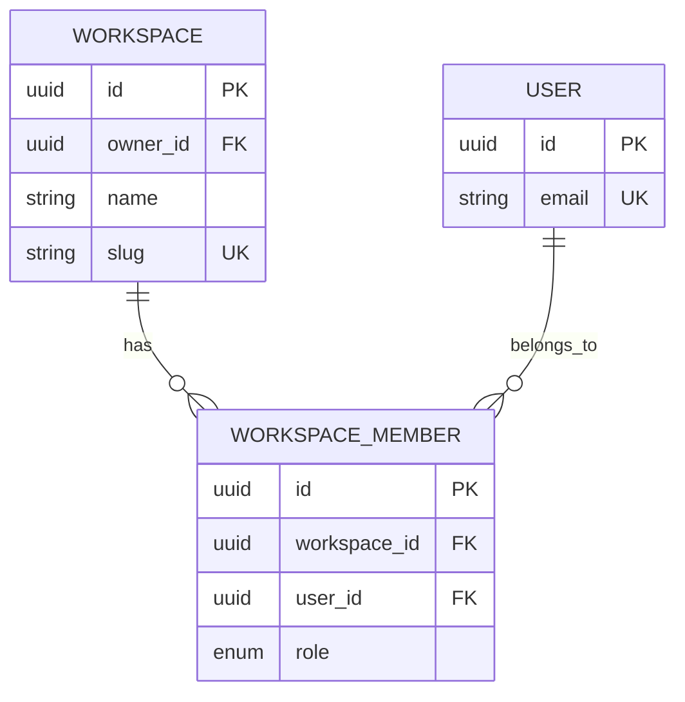

# Business Logic

<cite>
**Referenced Files in This Document**
- [backend/app/main.py](file://backend/app/main.py)
- [backend/app/config.py](file://backend/app/config.py)
- [backend/app/database.py](file://backend/app/database.py)
- [backend/app/dependencies.py](file://backend/app/dependencies.py)
- [backend/app/core/constants.py](file://backend/app/core/constants.py)
- [backend/app/services/content_generation_service.py](file://backend/app/services/content_generation_service.py)
- [backend/app/services/approval_workflow_service.py](file://backend/app/services/approval_workflow_service.py)
- [backend/app/services/platform_integration_service.py](file://backend/app/services/platform_integration_service.py)
- [backend/app/services/scheduler_service.py](file://backend/app/services/scheduler_service.py)
- [backend/app/services/memory_service.py](file://backend/app/services/memory_service.py)
- [backend/app/services/embedding_service.py](file://backend/app/services/embedding_service.py)
- [backend/app/services/llm_service.py](file://backend/app/services/llm_service.py)
- [backend/app/models/workspace.py](file://backend/app/models/workspace.py)
- [backend/app/models/content.py](file://backend/app/models/content.py)
- [backend/app/models/approval.py](file://backend/app/models/approval.py)
</cite>

## Table of Contents
1. [Introduction](#introduction)
2. [Project Structure](#project-structure)
3. [Core Components](#core-components)
4. [Architecture Overview](#architecture-overview)
5. [Detailed Component Analysis](#detailed-component-analysis)
6. [Dependency Analysis](#dependency-analysis)
7. [Performance Considerations](#performance-considerations)
8. [Troubleshooting Guide](#troubleshooting-guide)
9. [Conclusion](#conclusion)
10. [Appendices](#appendices)

## Introduction
This document describes Socialium’s business logic layer, focusing on the service architecture that powers AI content orchestration, collaborative review workflows, platform integrations, scheduling automation, and semantic memory. It explains how services compose, how dependency injection is applied, and how inter-service communication is structured. It also documents algorithmic approaches, business rule enforcement, error handling, and performance strategies, including multi-tenancy via workspaces and data consistency patterns.

## Project Structure
The backend is organized around a layered architecture:
- Application entrypoint and routing
- Configuration and dependency injection
- Database engine and session management
- Domain models (SQLAlchemy ORM)
- Services (orchestration and domain logic)
- Routers (HTTP endpoints)

**Diagram sources**
- [backend/app/main.py](file://backend/app/main.py#L1-L83)
- [backend/app/config.py](file://backend/app/config.py#L1-L83)
- [backend/app/database.py](file://backend/app/database.py#L1-L43)
- [backend/app/dependencies.py](file://backend/app/dependencies.py#L1-L14)

**Section sources**
- [backend/app/main.py](file://backend/app/main.py#L1-L83)
- [backend/app/config.py](file://backend/app/config.py#L1-L83)
- [backend/app/database.py](file://backend/app/database.py#L1-L43)
- [backend/app/dependencies.py](file://backend/app/dependencies.py#L1-L14)

## Core Components
This section outlines the principal business services and their responsibilities, along with their primary collaborators.

- ContentGenerationService: orchestrates multi-agent content creation, draft lifecycle management, and optimization.
- ApprovalWorkflowService: manages the human-in-the-loop approval state machine and comments.
- PlatformIntegrationService: handles OAuth connections, account sync, and publishing to supported platforms.
- SchedulerService: schedules posts, computes optimal times, and executes scheduled jobs.
- MemoryService: maintains brand voice and semantic memory using vector embeddings.
- EmbeddingService: generates embeddings and similarity metrics.
- LLMService: unified interface to OpenAI and Anthropic for text and image generation.

These services share a common pattern:
- They receive requests via routers and delegate to repositories/models for persistence.
- They rely on configuration for external API keys and endpoints.
- They coordinate with each other to implement cross-cutting workflows (e.g., content generation invokes LLM and Embedding services).

**Section sources**
- [backend/app/services/content_generation_service.py](file://backend/app/services/content_generation_service.py#L1-L98)
- [backend/app/services/approval_workflow_service.py](file://backend/app/services/approval_workflow_service.py#L1-L48)
- [backend/app/services/platform_integration_service.py](file://backend/app/services/platform_integration_service.py#L1-L56)
- [backend/app/services/scheduler_service.py](file://backend/app/services/scheduler_service.py#L1-L59)
- [backend/app/services/memory_service.py](file://backend/app/services/memory_service.py#L1-L66)
- [backend/app/services/embedding_service.py](file://backend/app/services/embedding_service.py#L1-L47)
- [backend/app/services/llm_service.py](file://backend/app/services/llm_service.py#L1-L73)

## Architecture Overview
The business logic layer follows a service-oriented architecture with explicit separation of concerns:
- Routers define HTTP endpoints and bind request schemas.
- Services encapsulate business rules and orchestrate operations.
- Models represent persistent state and enforce referential integrity.
- Configuration centralizes external credentials and feature flags.
- Dependency injection supplies database sessions and settings to services.

**Diagram sources**
- [backend/app/main.py](file://backend/app/main.py#L57-L76)
- [backend/app/services/content_generation_service.py](file://backend/app/services/content_generation_service.py#L13-L22)
- [backend/app/services/approval_workflow_service.py](file://backend/app/services/approval_workflow_service.py#L8-L15)
- [backend/app/services/platform_integration_service.py](file://backend/app/services/platform_integration_service.py#L8-L15)
- [backend/app/services/scheduler_service.py](file://backend/app/services/scheduler_service.py#L8-L16)
- [backend/app/services/memory_service.py](file://backend/app/services/memory_service.py#L8-L17)
- [backend/app/services/embedding_service.py](file://backend/app/services/embedding_service.py#L8-L18)
- [backend/app/services/llm_service.py](file://backend/app/services/llm_service.py#L9-L19)
- [backend/app/models/workspace.py](file://backend/app/models/workspace.py#L14-L39)
- [backend/app/models/content.py](file://backend/app/models/content.py#L14-L38)
- [backend/app/models/approval.py](file://backend/app/models/approval.py#L14-L39)

## Detailed Component Analysis

### ContentGenerationService
Responsibilities:
- Generate platform-specific content variants.
- Manage draft lifecycle (list, get, update, update status, delete).
- Optimize drafts using brand voice and platform best practices.
- Coordinate with LLMService, EmbeddingService, and MemoryService.

Key processing logic:
- Multi-agent generation pipeline: extract source content → fetch brand voice → construct platform-specific prompts → generate text/image → create drafts → generate embeddings.
- Variant generation: derive alternative prompts and produce A/B variants.
- Quality optimization: analyze and suggest improvements aligned with brand voice.

Inter-service dependencies:
- LLMService for text/image generation.
- EmbeddingService for embeddings.
- MemoryService for brand voice and semantic memory.

**Diagram sources**
- [backend/app/services/content_generation_service.py](file://backend/app/services/content_generation_service.py#L23-L40)
- [backend/app/services/llm_service.py](file://backend/app/services/llm_service.py#L39-L64)
- [backend/app/services/embedding_service.py](file://backend/app/services/embedding_service.py#L20-L29)
- [backend/app/services/memory_service.py](file://backend/app/services/memory_service.py#L39-L45)

**Section sources**
- [backend/app/services/content_generation_service.py](file://backend/app/services/content_generation_service.py#L13-L98)

### ApprovalWorkflowService
Responsibilities:
- Maintain approval state machine: draft → pending_approval → approved | rejected | changes_requested.
- Track approval history and comments.
- Submit drafts for approval and process reviewer decisions.

Processing logic:
- Validate draft eligibility (status checks).
- Create approval records with action and feedback.
- Update draft status accordingly.
- Notify stakeholders.

**Diagram sources**
- [backend/app/services/approval_workflow_service.py](file://backend/app/services/approval_workflow_service.py#L25-L39)
- [backend/app/models/approval.py](file://backend/app/models/approval.py#L14-L39)

**Section sources**
- [backend/app/services/approval_workflow_service.py](file://backend/app/services/approval_workflow_service.py#L8-L48)
- [backend/app/models/approval.py](file://backend/app/models/approval.py#L14-L69)

### PlatformIntegrationService
Responsibilities:
- Connect/disconnect social platform accounts via OAuth.
- Sync account metadata.
- Publish drafts to target platforms.
- Rollback published posts.

Processing logic:
- OAuth code exchange → fetch profile → encrypt tokens → persist PlatformAccount.
- Format content per platform → upload media if needed → call platform API → mark draft as published.

**Diagram sources**
- [backend/app/services/platform_integration_service.py](file://backend/app/services/platform_integration_service.py#L21-L31)
- [backend/app/services/platform_integration_service.py](file://backend/app/services/platform_integration_service.py#L41-L51)

**Section sources**
- [backend/app/services/platform_integration_service.py](file://backend/app/services/platform_integration_service.py#L8-L56)

### SchedulerService
Responsibilities:
- Schedule posts with timezone-aware timing.
- Recalculate/reschedule/cancel scheduled posts.
- Recommend optimal posting times using analytics insights.

Processing logic:
- Validate draft state and workspace constraints.
- Persist ScheduledPost and register APScheduler job.
- Background executor publishes posts due now.

**Diagram sources**
- [backend/app/services/scheduler_service.py](file://backend/app/services/scheduler_service.py#L18-L27)
- [backend/app/services/scheduler_service.py](file://backend/app/services/scheduler_service.py#L35-L39)
- [backend/app/services/scheduler_service.py](file://backend/app/services/scheduler_service.py#L41-L43)

**Section sources**
- [backend/app/services/scheduler_service.py](file://backend/app/services/scheduler_service.py#L8-L59)

### MemoryService
Responsibilities:
- Store and retrieve embeddings in Qdrant.
- Semantic search for similar content patterns.
- Maintain and update brand voice profiles.
- Learn from engagement to refine patterns.

Processing logic:
- Embedding generation via EmbeddingService.
- Upsert vectors into Qdrant collection.
- Search nearest neighbors and return ranked results.

**Diagram sources**
- [backend/app/services/memory_service.py](file://backend/app/services/memory_service.py#L19-L27)
- [backend/app/services/memory_service.py](file://backend/app/services/memory_service.py#L29-L37)
- [backend/app/services/embedding_service.py](file://backend/app/services/embedding_service.py#L20-L29)

**Section sources**
- [backend/app/services/memory_service.py](file://backend/app/services/memory_service.py#L8-L66)

### EmbeddingService
Responsibilities:
- Generate embeddings using OpenAI text-embedding-3-large.
- Batch embeddings for efficiency.
- Compute cosine similarity between vectors.

**Section sources**
- [backend/app/services/embedding_service.py](file://backend/app/services/embedding_service.py#L8-L47)

### LLMService
Responsibilities:
- Unified interface to OpenAI and Anthropic.
- Prompt building for platform-specific content.
- Image generation via DALL-E 3.

**Section sources**
- [backend/app/services/llm_service.py](file://backend/app/services/llm_service.py#L9-L73)

## Dependency Analysis
This section examines how services depend on each other and on shared infrastructure.

**Diagram sources**
- [backend/app/services/content_generation_service.py](file://backend/app/services/content_generation_service.py#L13-L22)
- [backend/app/services/llm_service.py](file://backend/app/services/llm_service.py#L16-L19)
- [backend/app/services/embedding_service.py](file://backend/app/services/embedding_service.py#L15-L18)
- [backend/app/services/memory_service.py](file://backend/app/services/memory_service.py#L16-L17)
- [backend/app/services/platform_integration_service.py](file://backend/app/services/platform_integration_service.py#L14-L15)
- [backend/app/services/scheduler_service.py](file://backend/app/services/scheduler_service.py#L15-L16)
- [backend/app/services/approval_workflow_service.py](file://backend/app/services/approval_workflow_service.py#L14-L15)

Coupling and cohesion:
- Services are cohesive around specific domains but loosely coupled via shared dependencies (AsyncSession, configuration).
- Cross-service calls are explicit and documented in method-level comments.

Potential circular dependencies:
- None observed among services; dependencies flow from orchestration services to utility services.

External dependencies:
- OpenAI, Anthropic, Qdrant, and platform APIs are configured centrally and accessed through typed services.

**Section sources**
- [backend/app/services/content_generation_service.py](file://backend/app/services/content_generation_service.py#L13-L22)
- [backend/app/services/llm_service.py](file://backend/app/services/llm_service.py#L16-L19)
- [backend/app/services/embedding_service.py](file://backend/app/services/embedding_service.py#L15-L18)
- [backend/app/services/memory_service.py](file://backend/app/services/memory_service.py#L16-L17)
- [backend/app/services/platform_integration_service.py](file://backend/app/services/platform_integration_service.py#L14-L15)
- [backend/app/services/scheduler_service.py](file://backend/app/services/scheduler_service.py#L15-L16)
- [backend/app/services/approval_workflow_service.py](file://backend/app/services/approval_workflow_service.py#L14-L15)

## Performance Considerations
- Asynchronous I/O: All services operate with AsyncSession to minimize blocking during IO-bound operations (external APIs, vector DB).
- Batch embeddings: EmbeddingService supports batch operations to reduce API overhead.
- Connection pooling: Database engine uses pre-ping and tuned pool sizes for reliability and throughput.
- Caching: Settings are cached via LRU to avoid repeated environment reads.
- Vector indexing: Qdrant is configured for efficient nearest-neighbor search; ensure collection settings align with expected scale.
- Retry and backoff: Implement retry with exponential backoff for external API calls (recommended at the service level).
- Pagination: Services expose pagination to handle large result sets efficiently.
- Timezone normalization: SchedulerService computes effective schedule times to avoid redundant jobs.

[No sources needed since this section provides general guidance]

## Troubleshooting Guide
Common issues and remedies:
- Authentication failures:
  - Verify API keys in configuration and ensure they match provider requirements.
  - Confirm OAuth client credentials for each platform.
- Database errors:
  - Inspect session commit/rollback behavior; ensure transactions wrap service operations.
  - Check connection pool settings and pre-ping configuration.
- External API errors:
  - Add retry with jitter and circuit breaker patterns for LLM, embedding, and platform APIs.
  - Log request IDs and response codes for tracing.
- Vector search anomalies:
  - Validate embedding dimensions and normalize metadata.
  - Re-index collection if drift is detected.
- Workflow inconsistencies:
  - Enforce state transitions via centralized validators.
  - Audit approval/comment history for audit trails.

**Section sources**
- [backend/app/database.py](file://backend/app/database.py#L32-L42)
- [backend/app/config.py](file://backend/app/config.py#L38-L60)

## Conclusion
Socialium’s business logic layer is designed around clear service boundaries, robust dependency injection, and explicit inter-service collaboration. The architecture supports multi-tenant workspaces, enforces business rules through state machines and validations, and leverages external AI and vector capabilities for intelligent content orchestration and discovery. By adhering to asynchronous patterns, batching, and resilient external API handling, the system scales while maintaining data consistency and user trust.

[No sources needed since this section summarizes without analyzing specific files]

## Appendices

### Multi-tenancy and Access Control
- Workspaces isolate resources and memberships with explicit roles.
- Models define workspace ownership and member roles for access control.
- Services should filter operations by workspace_id and enforce role-based permissions.

**Diagram sources**
- [backend/app/models/workspace.py](file://backend/app/models/workspace.py#L14-L72)

**Section sources**
- [backend/app/models/workspace.py](file://backend/app/models/workspace.py#L14-L72)
- [backend/app/core/constants.py](file://backend/app/core/constants.py#L39-L44)

### Data Consistency Patterns
- Transactional boundaries: Services wrap operations in database sessions with commit/rollback semantics.
- Idempotency: SchedulerService and PlatformIntegrationService should guard against duplicate executions and updates.
- Auditability: ApprovalWorkflowService maintains a full history of actions and comments.

**Section sources**
- [backend/app/database.py](file://backend/app/database.py#L32-L42)
- [backend/app/models/approval.py](file://backend/app/models/approval.py#L14-L69)