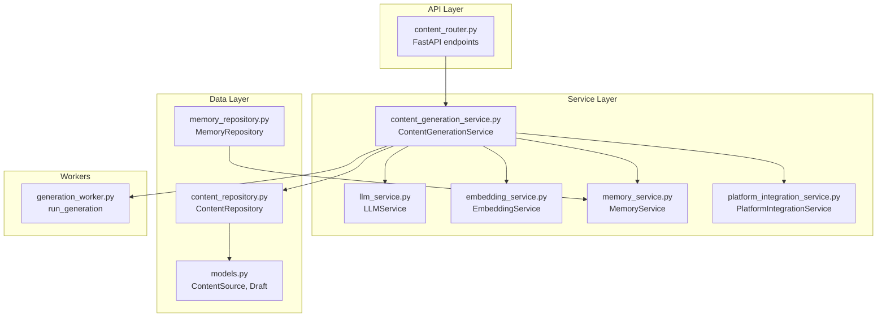
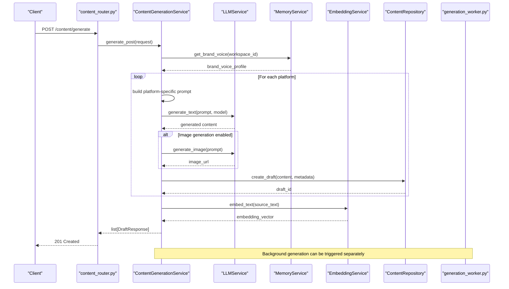
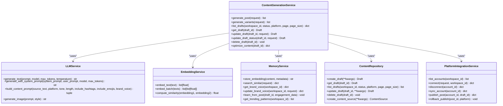
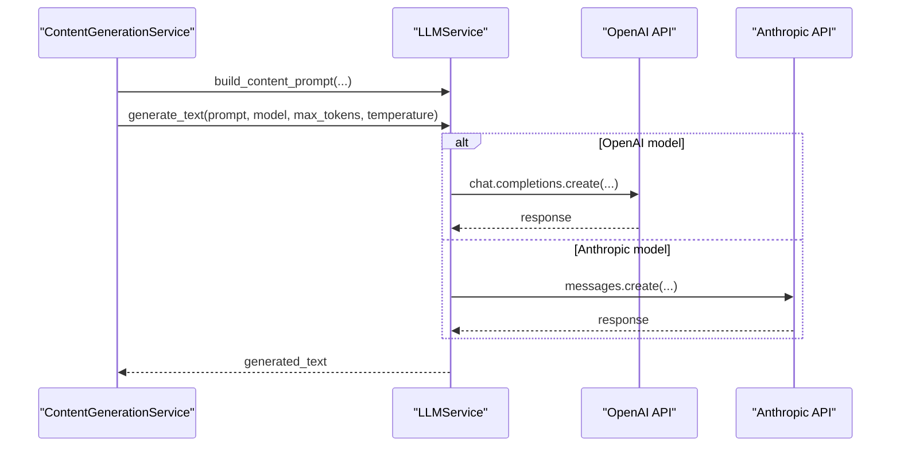
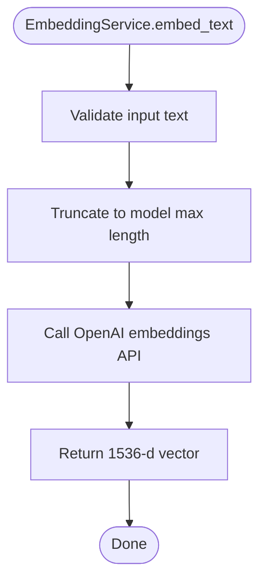
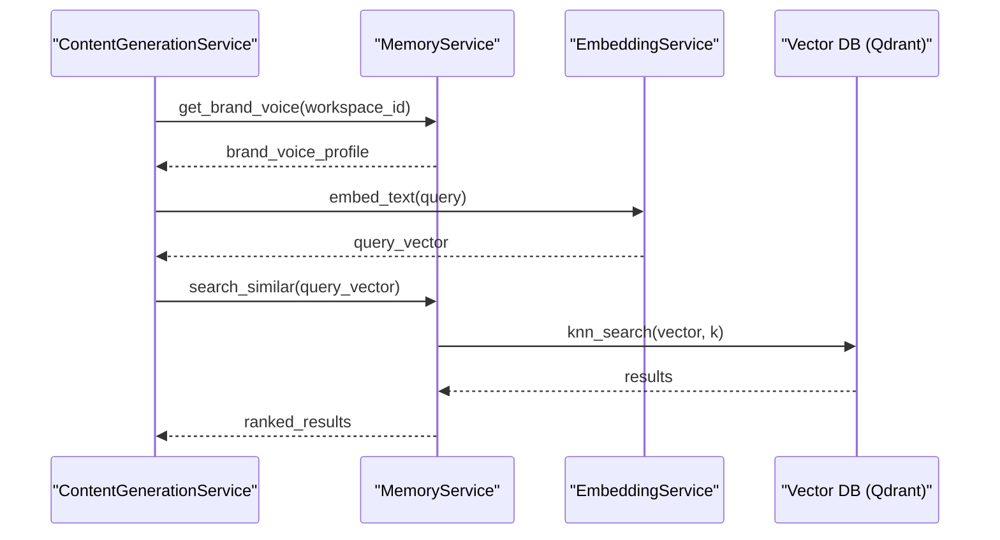
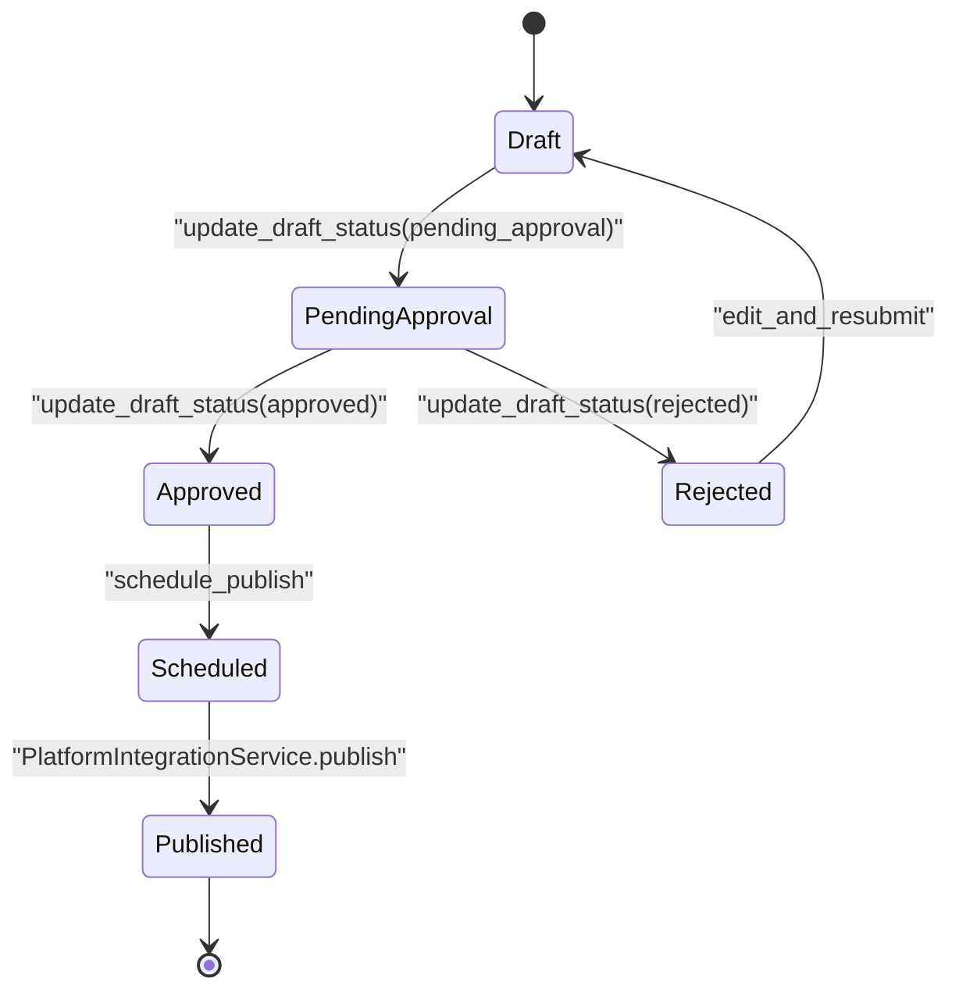
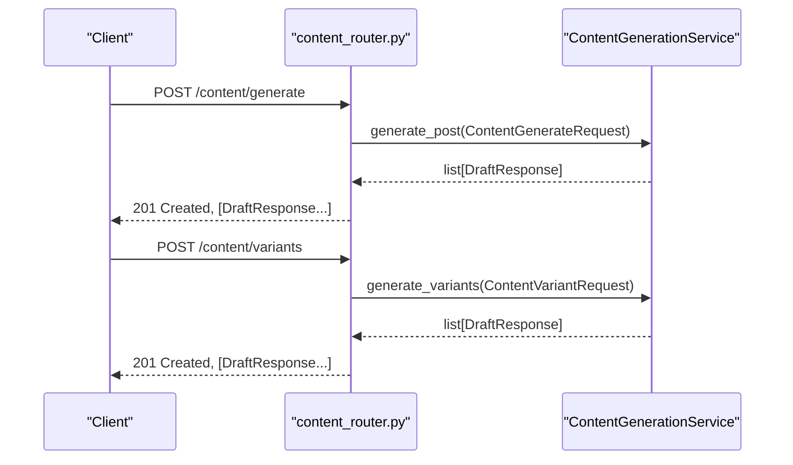
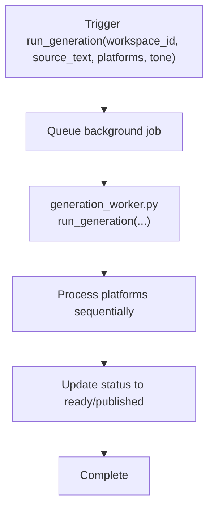
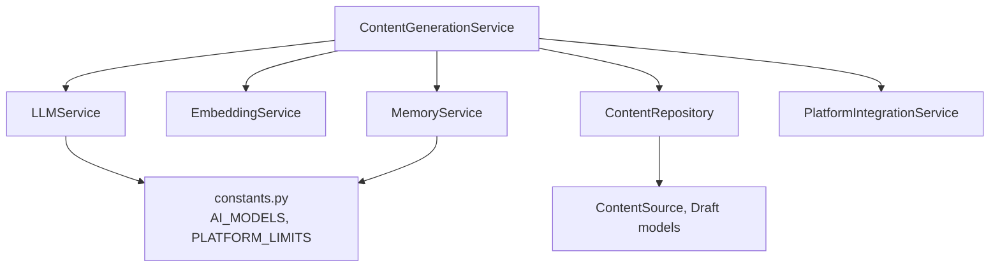

# Content Generation Service

<cite>
**Referenced Files in This Document**
- [content_generation_service.py](file://backend/app/services/content_generation_service.py)
- [llm_service.py](file://backend/app/services/llm_service.py)
- [embedding_service.py](file://backend/app/services/embedding_service.py)
- [memory_service.py](file://backend/app/services/memory_service.py)
- [content.py](file://backend/app/models/content.py)
- [draft.py](file://backend/app/models/draft.py)
- [content_schemas.py](file://backend/app/schemas/content.py)
- [memory_schemas.py](file://backend/app/schemas/memory.py)
- [content_router.py](file://backend/app/routers/content.py)
- [constants.py](file://backend/app/core/constants.py)
- [generation_worker.py](file://backend/app/workers/generation_worker.py)
- [platform_integration_service.py](file://backend/app/services/platform_integration_service.py)
- [content_repository.py](file://backend/app/repositories/content_repository.py)
- [memory_repository.py](file://backend/app/repositories/memory_repository.py)
</cite>

## Table of Contents
1. [Introduction](#introduction)
2. [Project Structure](#project-structure)
3. [Core Components](#core-components)
4. [Architecture Overview](#architecture-overview)
5. [Detailed Component Analysis](#detailed-component-analysis)
6. [Dependency Analysis](#dependency-analysis)
7. [Performance Considerations](#performance-considerations)
8. [Troubleshooting Guide](#troubleshooting-guide)
9. [Conclusion](#conclusion)

## Introduction
This document describes the ContentGenerationService responsible for orchestrating AI-powered content creation across multiple platforms. It explains the multi-agent architecture that integrates LLMService for AI generation, EmbeddingService for semantic memory, and MemoryService for brand voice learning. The service manages the full content lifecycle from generation to optimization, including draft creation, variant generation, and human-in-the-loop editing. It also documents request/response schemas, error handling strategies, and performance considerations.

## Project Structure
The content generation system is organized around a service-layer orchestration pattern with supporting services, schemas, models, repositories, and workers:

- Services: ContentGenerationService, LLMService, EmbeddingService, MemoryService, PlatformIntegrationService
- Routers: FastAPI endpoints for content generation and draft management
- Schemas: Pydantic models for request/response validation
- Models: SQLAlchemy ORM models for ContentSource and Draft persistence
- Repositories: Data access abstractions for content and memory
- Workers: Background task runner for generation jobs

**Diagram sources**
- [content_router.py](file://backend/app/routers/content.py#L1-L94)
- [content_generation_service.py](file://backend/app/services/content_generation_service.py#L1-L98)
- [llm_service.py](file://backend/app/services/llm_service.py#L1-L73)
- [embedding_service.py](file://backend/app/services/embedding_service.py#L1-L47)
- [memory_service.py](file://backend/app/services/memory_service.py#L1-L66)
- [platform_integration_service.py](file://backend/app/services/platform_integration_service.py#L1-L56)
- [content_repository.py](file://backend/app/repositories/content_repository.py#L1-L31)
- [memory_repository.py](file://backend/app/repositories/memory_repository.py#L1-L13)
- [content.py](file://backend/app/models/content.py#L1-L42)
- [draft.py](file://backend/app/models/draft.py#L1-L71)
- [generation_worker.py](file://backend/app/workers/generation_worker.py#L1-L7)

**Section sources**
- [content_generation_service.py](file://backend/app/services/content_generation_service.py#L1-L98)
- [content_router.py](file://backend/app/routers/content.py#L1-L94)
- [content_schemas.py](file://backend/app/schemas/content.py#L1-L82)
- [memory_schemas.py](file://backend/app/schemas/memory.py#L1-L51)
- [constants.py](file://backend/app/core/constants.py#L1-L85)

## Core Components
- ContentGenerationService: Orchestrates multi-agent content creation, draft lifecycle, and optimization.
- LLMService: Unified interface to OpenAI and Anthropic with prompt engineering and image generation.
- EmbeddingService: Vector embedding generation for semantic memory and quality scoring.
- MemoryService: Manages brand voice and semantic memory with Qdrant-backed storage.
- PlatformIntegrationService: Handles OAuth and publishing to supported platforms.
- ContentRepository and MemoryRepository: Data access abstractions for persistence.
- Models: ContentSource and Draft ORM models.
- Schemas: Request/response models for generation, variants, drafts, and memory.

Key responsibilities:
- Multi-platform content generation with platform-specific prompts and constraints
- Brand voice integration via MemoryService
- Variant creation for A/B testing
- Human-in-the-loop editing and status transitions
- Semantic embedding generation and similarity computation
- Publishing integration via PlatformIntegrationService

**Section sources**
- [content_generation_service.py](file://backend/app/services/content_generation_service.py#L13-L98)
- [llm_service.py](file://backend/app/services/llm_service.py#L9-L73)
- [embedding_service.py](file://backend/app/services/embedding_service.py#L8-L47)
- [memory_service.py](file://backend/app/services/memory_service.py#L8-L66)
- [platform_integration_service.py](file://backend/app/services/platform_integration_service.py#L8-L56)
- [content_repository.py](file://backend/app/repositories/content_repository.py#L8-L31)
- [memory_repository.py](file://backend/app/repositories/memory_repository.py#L6-L13)
- [content.py](file://backend/app/models/content.py#L14-L42)
- [draft.py](file://backend/app/models/draft.py#L15-L71)
- [content_schemas.py](file://backend/app/schemas/content.py#L12-L82)
- [memory_schemas.py](file://backend/app/schemas/memory.py#L8-L51)

## Architecture Overview
The ContentGenerationService implements a multi-agent architecture:
- Orchestration: ContentGenerationService coordinates generation steps
- Intelligence: LLMService generates text and images
- Memory: EmbeddingService and MemoryService provide semantic context and brand voice
- Persistence: ContentRepository and MemoryRepository handle data access
- Integration: PlatformIntegrationService publishes content to platforms
- Background: generation_worker.py executes asynchronous generation tasks

**Diagram sources**
- [content_router.py](file://backend/app/routers/content.py#L20-L27)
- [content_generation_service.py](file://backend/app/services/content_generation_service.py#L23-L40)
- [llm_service.py](file://backend/app/services/llm_service.py#L21-L47)
- [embedding_service.py](file://backend/app/services/embedding_service.py#L20-L29)
- [memory_service.py](file://backend/app/services/memory_service.py#L39-L45)
- [content_repository.py](file://backend/app/repositories/content_repository.py#L14-L15)
- [generation_worker.py](file://backend/app/workers/generation_worker.py#L4-L6)

## Detailed Component Analysis

### ContentGenerationService
Responsibilities:
- Generate platform-specific content using multi-agent orchestration
- Create A/B variants with different hooks/CTAs
- Manage draft lifecycle (list, get, update, status update, delete)
- Optimize content quality with AI suggestions
- Integrate with LLMService, EmbeddingService, and MemoryService

Implementation highlights:
- generate_post: orchestrates source processing, brand voice lookup, per-platform generation, image generation, draft creation, and embedding
- generate_variants: retrieves original draft, creates variant prompts, generates variants, and marks them as variants
- list_drafts/get_draft/update_draft/update_draft_status/delete_draft: manage draft CRUD and status transitions
- optimize_content: analyzes brand voice alignment and platform best practices, applies improvements, and updates quality_score

**Diagram sources**
- [content_generation_service.py](file://backend/app/services/content_generation_service.py#L13-L98)
- [llm_service.py](file://backend/app/services/llm_service.py#L9-L73)
- [embedding_service.py](file://backend/app/services/embedding_service.py#L8-L47)
- [memory_service.py](file://backend/app/services/memory_service.py#L8-L66)
- [content_repository.py](file://backend/app/repositories/content_repository.py#L8-L31)
- [platform_integration_service.py](file://backend/app/services/platform_integration_service.py#L8-L56)

**Section sources**
- [content_generation_service.py](file://backend/app/services/content_generation_service.py#L13-L98)

### LLMService
Capabilities:
- Unified interface to OpenAI and Anthropic
- Prompt engineering with system/user prompts
- Text generation with configurable model, tokens, and temperature
- Image generation via DALL-E 3
- Provider-specific prompt formatting and error handling

**Diagram sources**
- [llm_service.py](file://backend/app/services/llm_service.py#L21-L47)
- [constants.py](file://backend/app/core/constants.py#L78-L85)

**Section sources**
- [llm_service.py](file://backend/app/services/llm_service.py#L9-L73)
- [constants.py](file://backend/app/core/constants.py#L78-L85)

### EmbeddingService
Capabilities:
- Generate embeddings using OpenAI text-embedding-3-large
- Batch embedding for efficiency
- Cosine similarity computation
- Used for semantic memory and quality scoring

**Diagram sources**
- [embedding_service.py](file://backend/app/services/embedding_service.py#L20-L29)

**Section sources**
- [embedding_service.py](file://backend/app/services/embedding_service.py#L8-L47)

### MemoryService
Capabilities:
- Store embeddings in vector database (Qdrant)
- Semantic search for similar content patterns
- Brand voice profile retrieval and updates
- Learning from post engagement
- Trending pattern identification

**Diagram sources**
- [memory_service.py](file://backend/app/services/memory_service.py#L19-L37)
- [embedding_service.py](file://backend/app/services/embedding_service.py#L20-L29)

**Section sources**
- [memory_service.py](file://backend/app/services/memory_service.py#L8-L66)
- [memory_schemas.py](file://backend/app/schemas/memory.py#L8-L51)

### Content Models and Draft Lifecycle
Draft model fields include platform, headline, body_text, hashtags, image_url, cta, tone, ai_model, status, character_count, quality_score, is_variant, and timestamps. Status transitions follow ContentStatus enumeration.

**Diagram sources**
- [draft.py](file://backend/app/models/draft.py#L15-L71)
- [constants.py](file://backend/app/core/constants.py#L14-L22)

**Section sources**
- [draft.py](file://backend/app/models/draft.py#L15-L71)
- [content.py](file://backend/app/models/content.py#L14-L42)
- [constants.py](file://backend/app/core/constants.py#L14-L22)

### API Endpoints and Request/Response Schemas
Endpoints:
- POST /content/generate: Create content for selected platforms
- POST /content/variants: Create A/B variants of an existing draft
- GET /content/drafts: List drafts with filtering and pagination
- GET /content/drafts/{id}: Get a single draft
- PUT /content/drafts/{id}: Update draft content
- PATCH /content/drafts/{id}/status: Update draft status
- DELETE /content/drafts/{id}: Delete a draft

Request/response schemas define content generation parameters, variant counts, draft updates, and paginated lists.

**Diagram sources**
- [content_router.py](file://backend/app/routers/content.py#L20-L37)
- [content_schemas.py](file://backend/app/schemas/content.py#L12-L82)

**Section sources**
- [content_router.py](file://backend/app/routers/content.py#L1-L94)
- [content_schemas.py](file://backend/app/schemas/content.py#L12-L82)

### Background Generation Workflow
The generation worker enables asynchronous content generation tasks.

**Diagram sources**
- [generation_worker.py](file://backend/app/workers/generation_worker.py#L4-L6)

**Section sources**
- [generation_worker.py](file://backend/app/workers/generation_worker.py#L1-L7)

## Dependency Analysis
The ContentGenerationService depends on:
- LLMService for text and image generation
- EmbeddingService for embeddings and similarity
- MemoryService for brand voice and semantic memory
- ContentRepository for draft persistence
- PlatformIntegrationService for publishing
- Constants for platform limits and model options

**Diagram sources**
- [content_generation_service.py](file://backend/app/services/content_generation_service.py#L13-L22)
- [llm_service.py](file://backend/app/services/llm_service.py#L16-L19)
- [embedding_service.py](file://backend/app/services/embedding_service.py#L15-L18)
- [memory_service.py](file://backend/app/services/memory_service.py#L16-L17)
- [constants.py](file://backend/app/core/constants.py#L63-L85)
- [content_repository.py](file://backend/app/repositories/content_repository.py#L11-L12)
- [content.py](file://backend/app/models/content.py#L14-L42)
- [draft.py](file://backend/app/models/draft.py#L15-L71)

**Section sources**
- [content_generation_service.py](file://backend/app/services/content_generation_service.py#L13-L22)
- [constants.py](file://backend/app/core/constants.py#L63-L85)

## Performance Considerations
- Batch embeddings: Use embed_batch for multiple texts to reduce API calls
- Prompt caching: Cache brand voice and platform-specific prompts where safe
- Concurrency: Parallelize per-platform generation where possible
- Rate limiting: Respect platform limits and subscription tiers
- Token budgeting: Control max_tokens and temperature for cost/performance balance
- Pagination: Use page/page_size for large draft lists
- Background processing: Offload heavy generation to workers

## Troubleshooting Guide
Common issues and resolutions:
- LLM provider errors: Validate API keys and model availability; implement retry with backoff
- Embedding failures: Check text truncation and API quotas; handle partial failures
- Memory search timeouts: Increase timeout thresholds and optimize k-nearest queries
- Draft persistence errors: Verify workspace ownership and unique constraints
- Publishing failures: Validate platform credentials and content formatting per platform limits

Error handling patterns:
- Centralized exception handling in services
- Graceful degradation when optional features fail
- Logging and alerting for critical failures
- Idempotent operations for retries

**Section sources**
- [llm_service.py](file://backend/app/services/llm_service.py#L21-L47)
- [embedding_service.py](file://backend/app/services/embedding_service.py#L20-L46)
- [memory_service.py](file://backend/app/services/memory_service.py#L19-L37)
- [content_repository.py](file://backend/app/repositories/content_repository.py#L14-L31)

## Conclusion
The ContentGenerationService provides a robust, extensible framework for AI-powered content creation across platforms. Its multi-agent architecture integrates LLMService, EmbeddingService, and MemoryService to deliver contextually aware, brand-consistent content. The service supports variant creation, human-in-the-loop editing, and semantic memory learning, enabling continuous improvement. With clear request/response schemas, comprehensive draft lifecycle management, and background processing capabilities, it offers a complete solution for modern content operations.