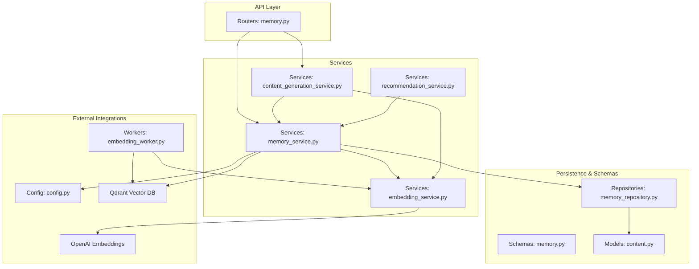
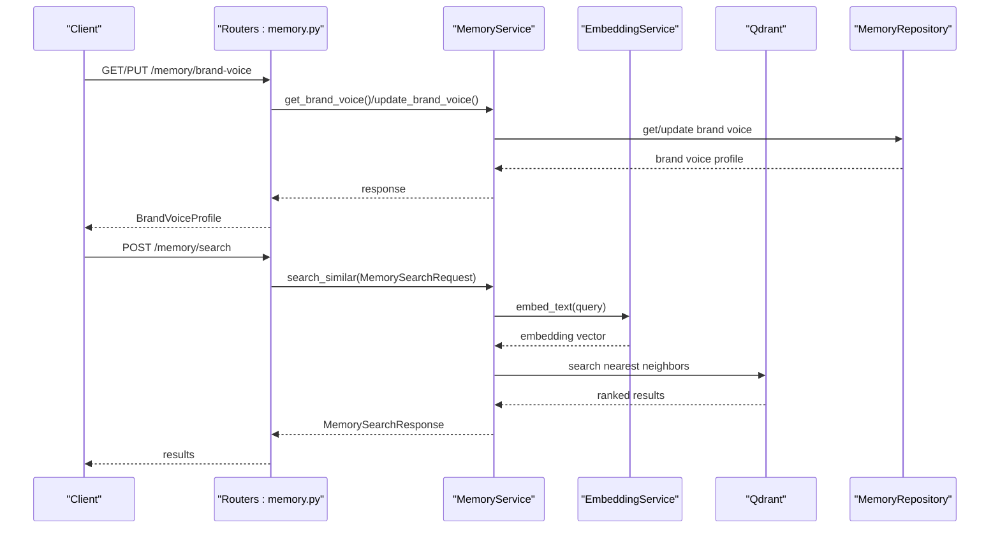
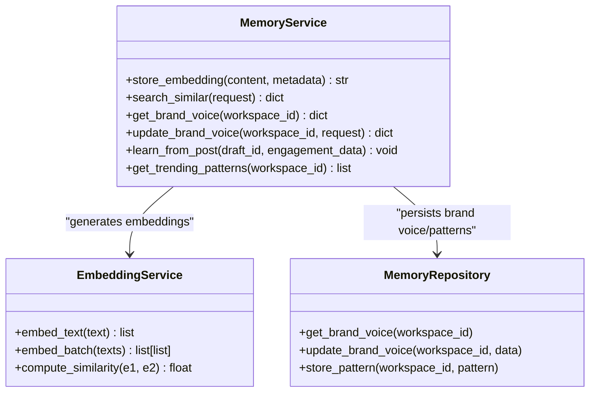
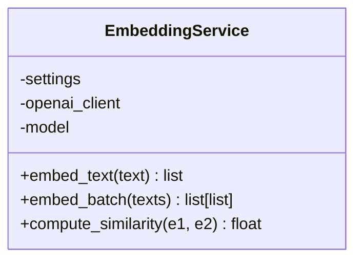
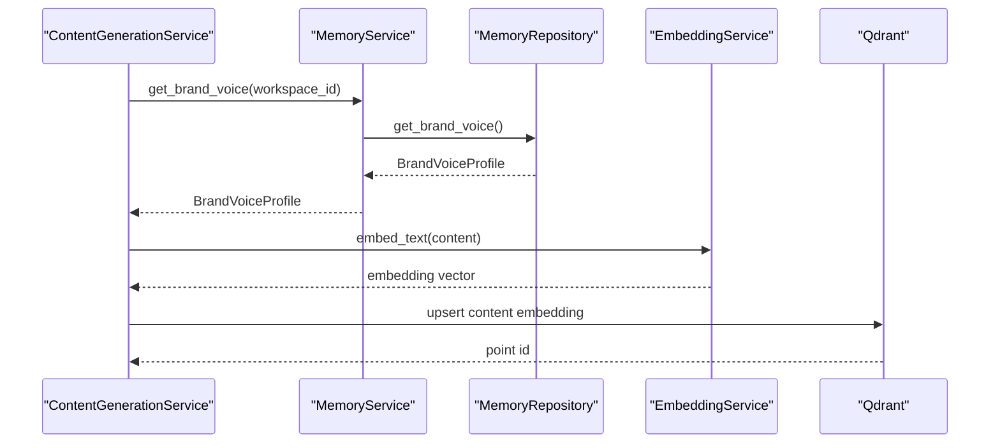
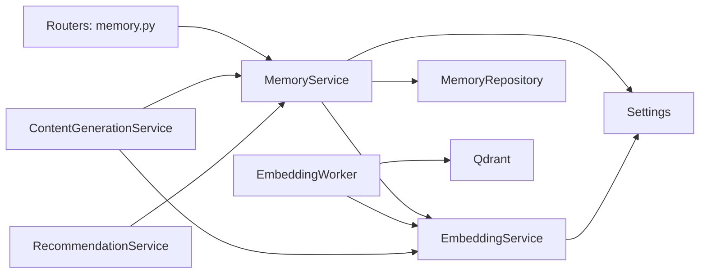

# Memory Service

<cite>
**Referenced Files in This Document**
- [memory_service.py](file://backend/app/services/memory_service.py)
- [embedding_service.py](file://backend/app/services/embedding_service.py)
- [memory_repository.py](file://backend/app/repositories/memory_repository.py)
- [memory.py](file://backend/app/schemas/memory.py)
- [memory.py](file://backend/app/routers/memory.py)
- [config.py](file://backend/app/config.py)
- [embedding_worker.py](file://backend/app/workers/embedding_worker.py)
- [content_generation_service.py](file://backend/app/services/content_generation_service.py)
- [recommendation_service.py](file://backend/app/services/recommendation_service.py)
- [content.py](file://backend/app/models/content.py)
- [content.py](file://backend/app/schemas/content.py)
</cite>

## Table of Contents
1. [Introduction](#introduction)
2. [Project Structure](#project-structure)
3. [Core Components](#core-components)
4. [Architecture Overview](#architecture-overview)
5. [Detailed Component Analysis](#detailed-component-analysis)
6. [Dependency Analysis](#dependency-analysis)
7. [Performance Considerations](#performance-considerations)
8. [Troubleshooting Guide](#troubleshooting-guide)
9. [Conclusion](#conclusion)
10. [Appendices](#appendices)

## Introduction
This document describes the MemoryService responsible for vector-based semantic memory and knowledge storage. It explains the vector embedding architecture, semantic search implementation, brand voice learning, integration with Qdrant, embedding generation workflows, memory indexing strategies, content similarity search, contextual retrieval, memory optimization, and the relationships with the content generation and recommendation services. It also covers memory update strategies, batch processing, and performance tuning for vector operations.

## Project Structure
The MemoryService is part of the backend application and integrates with FastAPI routers, SQLAlchemy repositories, Pydantic schemas, and external services such as OpenAI and Qdrant. The following diagram shows the high-level structure and relationships among the key modules involved in memory and embeddings.

**Diagram sources**
- [memory.py](file://backend/app/routers/memory.py#L1-L47)
- [memory_service.py](file://backend/app/services/memory_service.py#L1-L66)
- [embedding_service.py](file://backend/app/services/embedding_service.py#L1-L47)
- [memory_repository.py](file://backend/app/repositories/memory_repository.py#L1-L13)
- [memory.py](file://backend/app/schemas/memory.py#L1-L51)
- [content.py](file://backend/app/models/content.py#L1-L42)
- [config.py](file://backend/app/config.py#L1-L83)
- [embedding_worker.py](file://backend/app/workers/embedding_worker.py#L1-L7)
- [content_generation_service.py](file://backend/app/services/content_generation_service.py#L1-L98)
- [recommendation_service.py](file://backend/app/services/recommendation_service.py#L1-L23)

**Section sources**
- [memory_service.py](file://backend/app/services/memory_service.py#L1-L66)
- [memory.py](file://backend/app/routers/memory.py#L1-L47)
- [config.py](file://backend/app/config.py#L1-L83)

## Core Components
- MemoryService: Orchestrates vector-based semantic memory, brand voice learning, and search.
- EmbeddingService: Generates embeddings using OpenAI text-embedding-3-large and supports batch operations and similarity computation.
- MemoryRepository: Data access layer for brand voice and pattern storage.
- Memory Schemas: Define brand voice profiles, search requests/responses, and related models.
- Routers: Expose endpoints for brand voice retrieval/update and semantic search.
- Workers: Background tasks for embedding generation and persistence.
- Content Generation Service: Coordinates with MemoryService for brand voice and embeddings during content creation.
- Recommendation Service: Uses memory insights for trend detection and suggestions.

Key responsibilities:
- Vector embedding generation and storage
- Semantic search and ranking
- Brand voice profile maintenance
- Continuous learning from engagement data
- Integration with Qdrant and OpenAI
- Batch embedding processing and optimization

**Section sources**
- [memory_service.py](file://backend/app/services/memory_service.py#L8-L66)
- [embedding_service.py](file://backend/app/services/embedding_service.py#L8-L47)
- [memory_repository.py](file://backend/app/repositories/memory_repository.py#L6-L13)
- [memory.py](file://backend/app/schemas/memory.py#L8-L51)
- [memory.py](file://backend/app/routers/memory.py#L18-L46)
- [embedding_worker.py](file://backend/app/workers/embedding_worker.py#L4-L6)
- [content_generation_service.py](file://backend/app/services/content_generation_service.py#L13-L40)
- [recommendation_service.py](file://backend/app/services/recommendation_service.py#L6-L23)

## Architecture Overview
The MemoryService architecture centers around:
- Embedding generation via OpenAI
- Vector storage and retrieval via Qdrant
- Brand voice learning and pattern storage via the repository layer
- API exposure through FastAPI routers
- Background processing for scalable embedding operations

**Diagram sources**
- [memory.py](file://backend/app/routers/memory.py#L18-L46)
- [memory_service.py](file://backend/app/services/memory_service.py#L29-L51)
- [embedding_service.py](file://backend/app/services/embedding_service.py#L20-L29)
- [memory_repository.py](file://backend/app/repositories/memory_repository.py#L10-L12)

## Detailed Component Analysis

### MemoryService
Responsibilities:
- Store embeddings for content with metadata and return point identifiers
- Perform semantic similarity search with configurable limits
- Retrieve and update brand voice profiles
- Learn from engagement data to refine successful and rejected patterns
- Identify trending patterns from recent successful posts

Implementation outline:
- Embedding generation using EmbeddingService
- Upsert into Qdrant collection configured in Settings
- Persist brand voice and patterns via MemoryRepository
- Support for batch embedding via EmbeddingService.embed_batch

**Diagram sources**
- [memory_service.py](file://backend/app/services/memory_service.py#L8-L66)
- [embedding_service.py](file://backend/app/services/embedding_service.py#L8-L47)
- [memory_repository.py](file://backend/app/repositories/memory_repository.py#L6-L13)

**Section sources**
- [memory_service.py](file://backend/app/services/memory_service.py#L8-L66)

### EmbeddingService
Responsibilities:
- Generate embeddings for single or batch texts
- Compute cosine similarity between embeddings
- Integrate with OpenAI using configured model and API key

Key behaviors:
- Uses Settings for OpenAI API key and embedding model
- Returns 1536-dimensional vectors for text-embedding-3-large
- Supports batch operations for improved throughput

**Diagram sources**
- [embedding_service.py](file://backend/app/services/embedding_service.py#L8-L47)
- [config.py](file://backend/app/config.py#L38-L42)

**Section sources**
- [embedding_service.py](file://backend/app/services/embedding_service.py#L8-L47)
- [config.py](file://backend/app/config.py#L38-L42)

### MemoryRepository
Responsibilities:
- Retrieve and update brand voice settings
- Store learned patterns (successful and rejected)
- Provide interface for trending pattern extraction

Note: Methods currently raise NotImplementedError and await implementation.

**Section sources**
- [memory_repository.py](file://backend/app/repositories/memory_repository.py#L6-L13)

### Memory Schemas
Defines:
- BrandVoiceProfile: Tone, values, target audience, learned phrases, top hooks, rejected patterns, effective CTAs, last updated
- BrandVoiceUpdateRequest: Optional updates to tone, values, and target audience
- MemorySearchRequest: Query text and result limit
- MemorySearchResult and MemorySearchResponse: Individual results and aggregated response

Usage:
- Routers accept and return these schemas
- Services transform them into internal operations

**Section sources**
- [memory.py](file://backend/app/schemas/memory.py#L8-L51)
- [memory.py](file://backend/app/routers/memory.py#L7-L12)

### Routers: Memory Endpoints
Endpoints:
- GET /memory/brand-voice: Retrieve brand voice profile
- PUT /memory/brand-voice: Update brand voice settings
- POST /memory/search: Semantic similarity search

Control flow:
- Validate request bodies using Pydantic models
- Instantiate MemoryService with database session
- Delegate to service methods and return responses

**Section sources**
- [memory.py](file://backend/app/routers/memory.py#L18-L46)

### Configuration: Qdrant and OpenAI
Settings:
- Qdrant URL, API key, and collection name
- OpenAI API key and embedding model
- Database and Redis URLs
- JWT and other service keys

Implications:
- Qdrant collection name is used for vector storage
- OpenAI model determines embedding dimensionality
- Environment-based configuration enables deployment flexibility

**Section sources**
- [config.py](file://backend/app/config.py#L38-L51)
- [config.py](file://backend/app/config.py#L79-L82)

### Workers: Background Embedding Processing
EmbeddingWorker:
- Provides a placeholder for background embedding generation
- Accepts content identifier and text payload
- Aims to decouple embedding work from request-response latency

Integration points:
- Can trigger EmbeddingService.embed_text or embed_batch
- Upserts results into Qdrant collection
- Updates content records with embedding metadata

**Section sources**
- [embedding_worker.py](file://backend/app/workers/embedding_worker.py#L4-L6)

### Relationship with Content Generation Service
ContentGenerationService:
- Retrieves brand voice from MemoryService for context-aware generation
- Generates embeddings for new content to populate semantic memory
- Coordinates with EmbeddingService for quality scoring and similarity checks

**Diagram sources**
- [content_generation_service.py](file://backend/app/services/content_generation_service.py#L23-L40)
- [memory_service.py](file://backend/app/services/memory_service.py#L39-L39)
- [memory_repository.py](file://backend/app/repositories/memory_repository.py#L10-L10)
- [embedding_service.py](file://backend/app/services/embedding_service.py#L20-L29)

**Section sources**
- [content_generation_service.py](file://backend/app/services/content_generation_service.py#L13-L40)

### Relationship with Recommendation Service
RecommendationService:
- Detects trending topics and suggests content opportunities
- May leverage MemoryService’s brand voice and pattern insights
- Could integrate with MemoryService for contextual recommendations

Potential integration:
- Use MemoryService.get_trending_patterns() to inform recommendations
- Align suggested content with BrandVoiceProfile

**Section sources**
- [recommendation_service.py](file://backend/app/services/recommendation_service.py#L12-L22)
- [memory_service.py](file://backend/app/services/memory_service.py#L63-L65)

## Dependency Analysis
High-level dependencies:
- MemoryService depends on EmbeddingService, MemoryRepository, and Settings
- Routers depend on MemoryService and Pydantic schemas
- Workers depend on EmbeddingService and Qdrant
- ContentGenerationService depends on MemoryService and EmbeddingService
- RecommendationService may depend on MemoryService

**Diagram sources**
- [memory.py](file://backend/app/routers/memory.py#L1-L47)
- [memory_service.py](file://backend/app/services/memory_service.py#L1-L66)
- [embedding_service.py](file://backend/app/services/embedding_service.py#L1-L47)
- [memory_repository.py](file://backend/app/repositories/memory_repository.py#L1-L13)
- [config.py](file://backend/app/config.py#L1-L83)
- [embedding_worker.py](file://backend/app/workers/embedding_worker.py#L1-L7)
- [content_generation_service.py](file://backend/app/services/content_generation_service.py#L1-L98)
- [recommendation_service.py](file://backend/app/services/recommendation_service.py#L1-L23)

**Section sources**
- [memory_service.py](file://backend/app/services/memory_service.py#L1-L66)
- [embedding_service.py](file://backend/app/services/embedding_service.py#L1-L47)
- [memory_repository.py](file://backend/app/repositories/memory_repository.py#L1-L13)
- [memory.py](file://backend/app/routers/memory.py#L1-L47)
- [config.py](file://backend/app/config.py#L1-L83)
- [embedding_worker.py](file://backend/app/workers/embedding_worker.py#L1-L7)
- [content_generation_service.py](file://backend/app/services/content_generation_service.py#L1-L98)
- [recommendation_service.py](file://backend/app/services/recommendation_service.py#L1-L23)

## Performance Considerations
- Embedding batch processing: Use EmbeddingService.embed_batch to reduce API calls and latency.
- Qdrant indexing: Configure appropriate vector size, distance metric, and filters for efficient nearest neighbor search.
- Memory updates: Batch upserts and incremental updates minimize write amplification.
- Caching: Cache frequently accessed brand voice profiles and trending patterns.
- Asynchronous operations: Keep embedding generation and vector search asynchronous to avoid blocking.
- Rate limiting: Respect OpenAI and Qdrant rate limits; implement retries with exponential backoff.
- Dimensionality: text-embedding-3-large produces 1536-d vectors; ensure Qdrant collection matches this size.

[No sources needed since this section provides general guidance]

## Troubleshooting Guide
Common issues and resolutions:
- OpenAI API errors: Verify OPENAI_API_KEY and model name in Settings; check network connectivity.
- Qdrant connection failures: Confirm QDRANT_URL and API key; ensure collection exists and is initialized.
- Missing embeddings: Validate that EmbeddingWorker is triggered after content creation; confirm upsert logic.
- Slow semantic search: Increase limit moderately, add filters, and consider index optimization.
- Brand voice not updating: Ensure MemoryRepository.update_brand_voice is implemented and persisted correctly.
- Engagement learning not applied: Verify learn_from_post logic and that successful/rejected patterns are stored.

**Section sources**
- [config.py](file://backend/app/config.py#L38-L51)
- [embedding_worker.py](file://backend/app/workers/embedding_worker.py#L4-L6)
- [memory_repository.py](file://backend/app/repositories/memory_repository.py#L10-L12)

## Conclusion
The MemoryService provides a robust foundation for vector-based semantic memory and brand voice learning. By integrating EmbeddingService and Qdrant, it enables contextual retrieval, continuous learning, and scalable embedding operations. Its coordination with ContentGenerationService and RecommendationService ensures brand consistency and intelligent content suggestions. Future work includes implementing the MemoryService methods, persisting brand voice and patterns, and optimizing vector operations for production-scale workloads.

[No sources needed since this section summarizes without analyzing specific files]

## Appendices

### API Endpoints Summary
- GET /memory/brand-voice: Returns BrandVoiceProfile
- PUT /memory/brand-voice: Updates brand voice settings
- POST /memory/search: Returns MemorySearchResponse with ranked results

Request/response models:
- BrandVoiceUpdateRequest
- MemorySearchRequest
- MemorySearchResult
- MemorySearchResponse

**Section sources**
- [memory.py](file://backend/app/routers/memory.py#L18-L46)
- [memory.py](file://backend/app/schemas/memory.py#L22-L51)

### Data Models Overview
- BrandVoiceProfile: Core attributes for brand voice and learned patterns
- Content-related models: Source content and draft structures support content generation workflows

**Section sources**
- [memory.py](file://backend/app/schemas/memory.py#L8-L20)
- [content.py](file://backend/app/models/content.py#L14-L42)
- [content.py](file://backend/app/schemas/content.py#L12-L56)