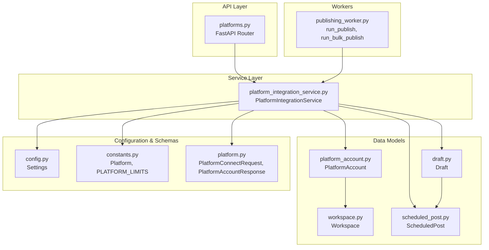
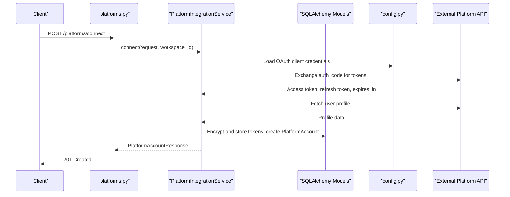
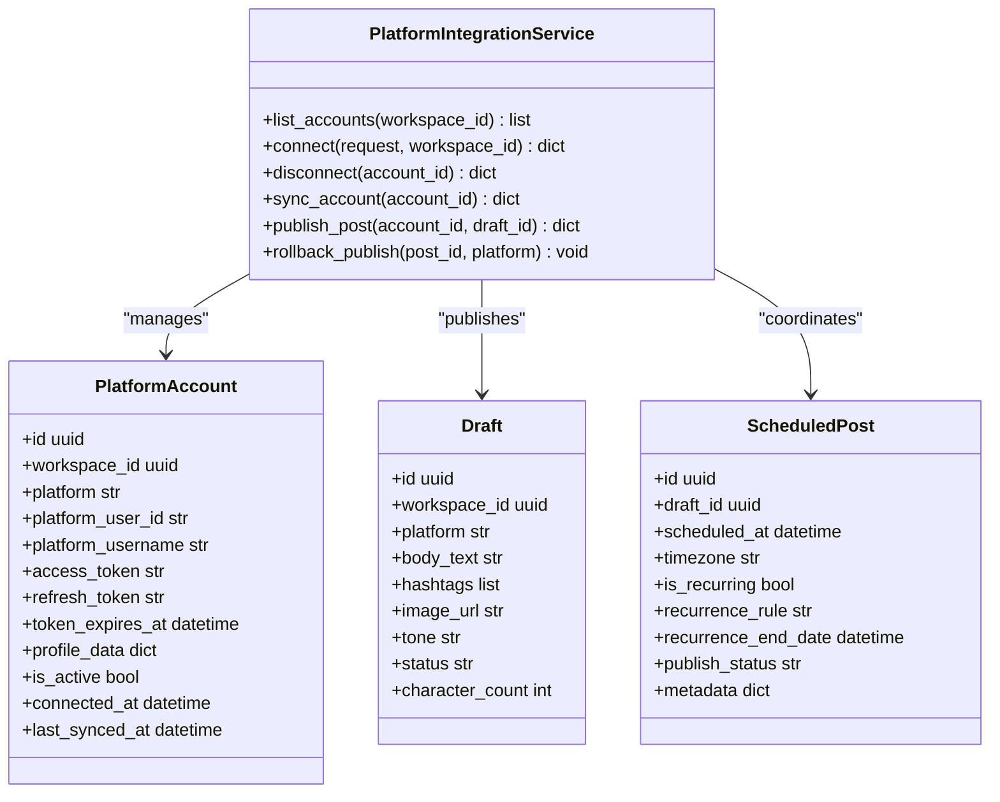
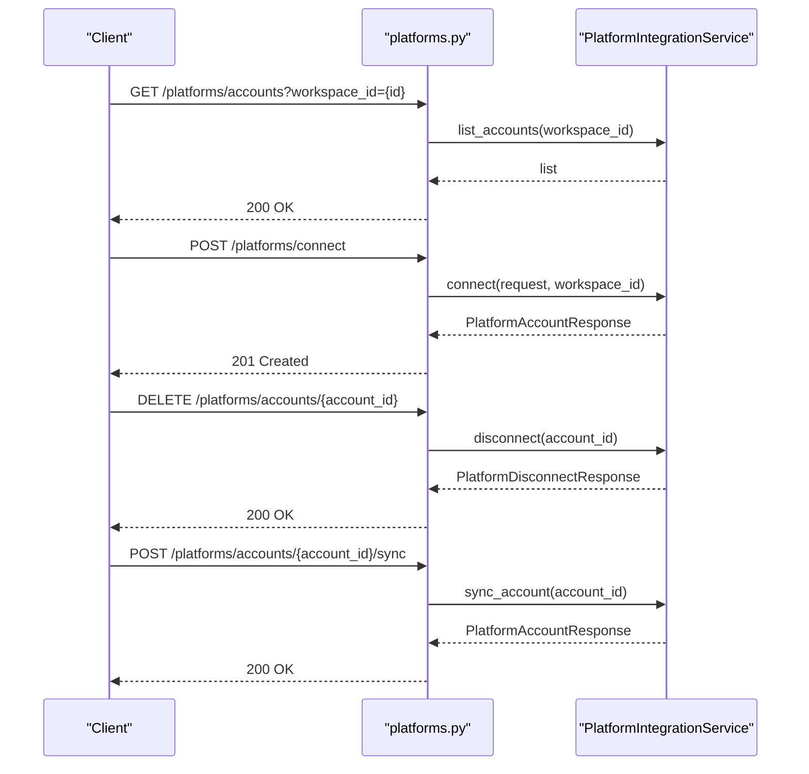
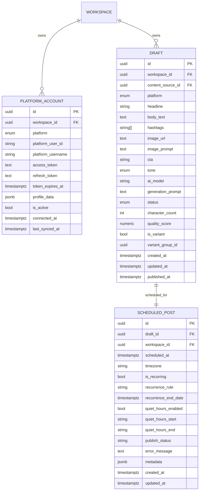
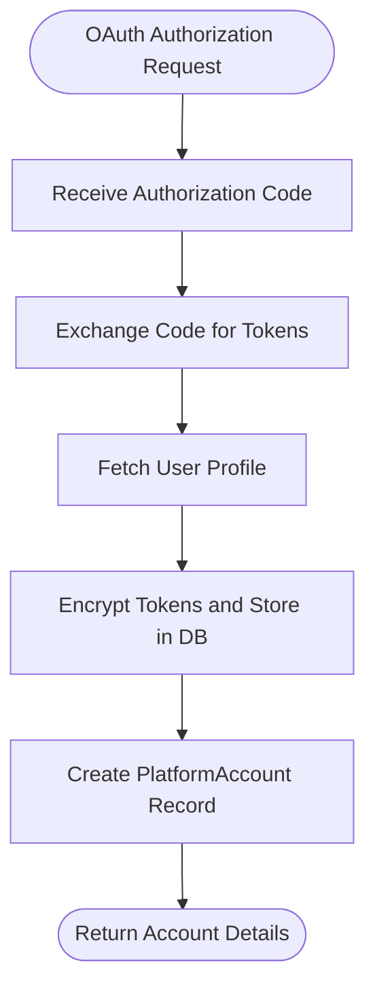
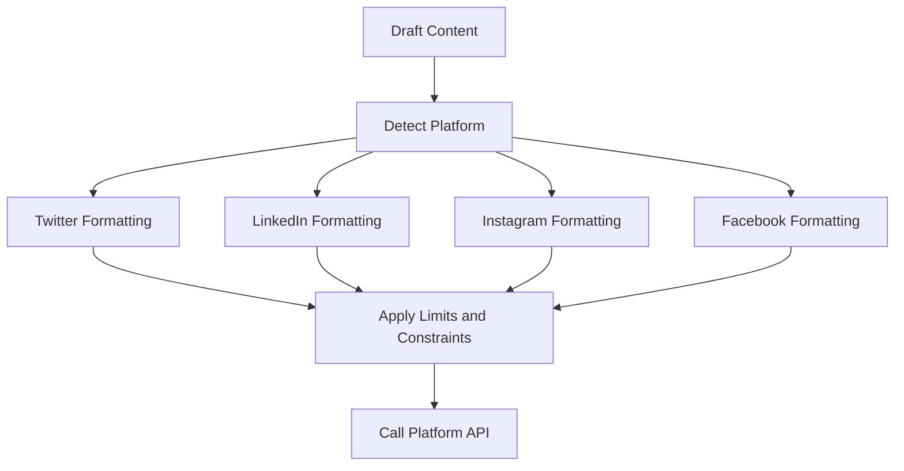
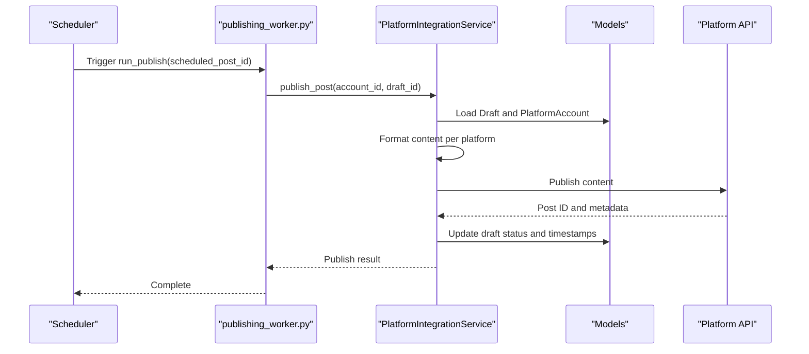
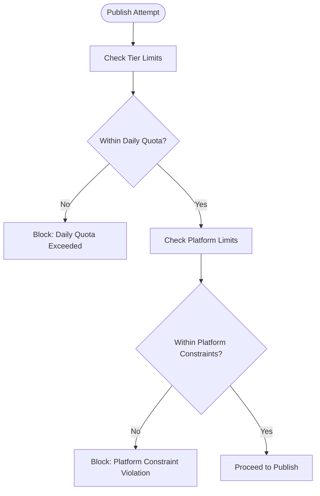
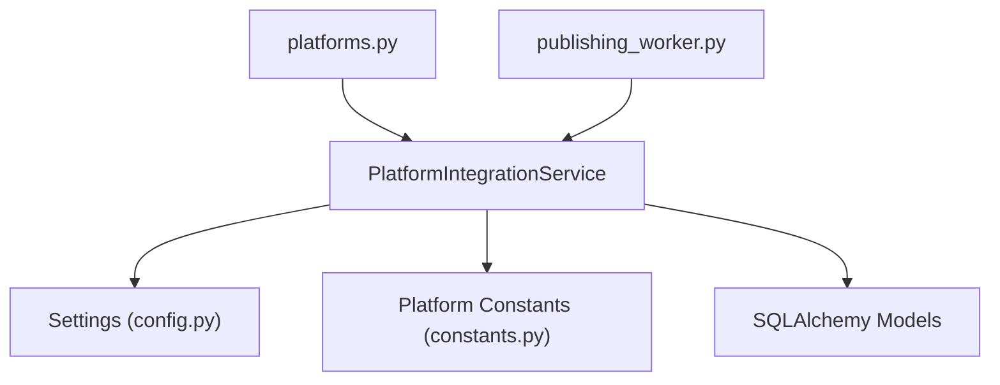

# Platform Integration Service

<cite>
**Referenced Files in This Document**
- [platform_integration_service.py](file://backend/app/services/platform_integration_service.py)
- [platforms.py](file://backend/app/routers/platforms.py)
- [platform.py](file://backend/app/schemas/platform.py)
- [platform_account.py](file://backend/app/models/platform_account.py)
- [constants.py](file://backend/app/core/constants.py)
- [config.py](file://backend/app/config.py)
- [security.py](file://backend/app/core/security.py)
- [workspace.py](file://backend/app/models/workspace.py)
- [draft.py](file://backend/app/models/draft.py)
- [scheduled_post.py](file://backend/app/models/scheduled_post.py)
- [publishing_worker.py](file://backend/app/workers/publishing_worker.py)
</cite>

## Table of Contents
1. [Introduction](#introduction)
2. [Project Structure](#project-structure)
3. [Core Components](#core-components)
4. [Architecture Overview](#architecture-overview)
5. [Detailed Component Analysis](#detailed-component-analysis)
6. [Dependency Analysis](#dependency-analysis)
7. [Performance Considerations](#performance-considerations)
8. [Troubleshooting Guide](#troubleshooting-guide)
9. [Conclusion](#conclusion)

## Introduction
This document describes the Platform Integration Service responsible for managing social media platform connections and API interactions. It covers OAuth flow implementation, credential storage, platform-specific API integrations for LinkedIn, Twitter, Instagram, and Facebook, rate limiting strategies, error handling, and retry mechanisms for external API calls. It also documents the platform account management system, connection validation, authentication token refresh, examples of platform-specific content formatting and posting workflows, error recovery procedures, and security considerations for credential management, API key rotation, and compliance requirements.

## Project Structure
The platform integration feature is organized around a service layer, FastAPI router endpoints, Pydantic schemas, SQLAlchemy models, and supporting configuration and constants. The service orchestrates OAuth flows, manages credentials, formats content per platform, and coordinates publishing through background workers.

**Diagram sources**
- [platforms.py](file://backend/app/routers/platforms.py#L1-L56)
- [platform_integration_service.py](file://backend/app/services/platform_integration_service.py#L1-L56)
- [platform_account.py](file://backend/app/models/platform_account.py#L1-L49)
- [workspace.py](file://backend/app/models/workspace.py#L1-L73)
- [draft.py](file://backend/app/models/draft.py#L1-L71)
- [scheduled_post.py](file://backend/app/models/scheduled_post.py#L1-L56)
- [config.py](file://backend/app/config.py#L1-L83)
- [constants.py](file://backend/app/core/constants.py#L1-L85)
- [platform.py](file://backend/app/schemas/platform.py#L1-L40)
- [publishing_worker.py](file://backend/app/workers/publishing_worker.py#L1-L12)

**Section sources**
- [platforms.py](file://backend/app/routers/platforms.py#L1-L56)
- [platform_integration_service.py](file://backend/app/services/platform_integration_service.py#L1-L56)
- [platform_account.py](file://backend/app/models/platform_account.py#L1-L49)
- [constants.py](file://backend/app/core/constants.py#L1-L85)
- [config.py](file://backend/app/config.py#L1-L83)
- [platform.py](file://backend/app/schemas/platform.py#L1-L40)
- [publishing_worker.py](file://backend/app/workers/publishing_worker.py#L1-L12)

## Core Components
- PlatformIntegrationService: Orchestrates OAuth connections, account synchronization, content publishing, and rollback operations. It defines the contract for connecting/disconnecting accounts, syncing profiles, publishing drafts, and rolling back published posts.
- Router endpoints: Expose REST endpoints for listing accounts, connecting platforms, disconnecting accounts, and syncing account data.
- Schemas: Define request/response models for OAuth connection and account responses.
- Models: Persist platform accounts, workspace relationships, drafts, and scheduled posts.
- Constants and configuration: Define supported platforms, platform-specific limits, subscription tiers, and OAuth client credentials.

Key responsibilities:
- OAuth flow: Exchange authorization code for access tokens, fetch user profile, encrypt and store tokens, and create PlatformAccount records.
- Publishing pipeline: Retrieve drafts, format content per platform, upload media if needed, call platform APIs, update draft status, and coordinate background publishing.
- Account management: List, connect, disconnect, and sync platform accounts; handle token expiration and refresh.
- Rate limiting and compliance: Enforce per-tier posting quotas and platform-specific content limits.

**Section sources**
- [platform_integration_service.py](file://backend/app/services/platform_integration_service.py#L8-L56)
- [platforms.py](file://backend/app/routers/platforms.py#L17-L55)
- [platform.py](file://backend/app/schemas/platform.py#L11-L39)
- [platform_account.py](file://backend/app/models/platform_account.py#L14-L48)
- [constants.py](file://backend/app/core/constants.py#L6-L76)
- [config.py](file://backend/app/config.py#L52-L61)

## Architecture Overview
The system follows a layered architecture:
- API layer: FastAPI router exposes endpoints for platform operations.
- Service layer: PlatformIntegrationService encapsulates business logic and integrates with external APIs.
- Persistence layer: SQLAlchemy models represent domain entities and relationships.
- Configuration layer: Settings provide OAuth client credentials and JWT configuration.
- Worker layer: Background tasks handle scheduled publishing.

**Diagram sources**
- [platforms.py](file://backend/app/routers/platforms.py#L27-L35)
- [platform_integration_service.py](file://backend/app/services/platform_integration_service.py#L21-L31)
- [config.py](file://backend/app/config.py#L52-L61)
- [platform_account.py](file://backend/app/models/platform_account.py#L14-L42)

## Detailed Component Analysis

### PlatformIntegrationService
The service defines asynchronous methods for platform operations. While current implementations raise NotImplementedError, the documented flow outlines the intended behavior.

**Diagram sources**
- [platform_integration_service.py](file://backend/app/services/platform_integration_service.py#L8-L56)
- [platform_account.py](file://backend/app/models/platform_account.py#L14-L48)
- [draft.py](file://backend/app/models/draft.py#L15-L71)
- [scheduled_post.py](file://backend/app/models/scheduled_post.py#L13-L56)

Implementation highlights:
- OAuth connection flow: Exchange authorization code for tokens, fetch profile, encrypt and store tokens, create PlatformAccount record, and return account details.
- Publishing workflow: Retrieve draft and platform account, format content per platform, upload media if needed, call platform publish API, and update draft status.
- Account management: List, connect, disconnect, and sync accounts; maintain token expiration and activity flags.
- Rollback capability: Delete published posts per platform.

**Section sources**
- [platform_integration_service.py](file://backend/app/services/platform_integration_service.py#L8-L56)

### Router Endpoints
The router exposes four primary endpoints:
- GET /platforms/accounts: List platform accounts for a workspace.
- POST /platforms/connect: Connect a platform via OAuth.
- DELETE /platforms/accounts/{account_id}: Disconnect a platform.
- POST /platforms/accounts/{account_id}/sync: Sync account data.

**Diagram sources**
- [platforms.py](file://backend/app/routers/platforms.py#L17-L55)

**Section sources**
- [platforms.py](file://backend/app/routers/platforms.py#L17-L55)

### Schemas
- PlatformConnectRequest: Captures platform selection, OAuth authorization code, and redirect URI.
- PlatformAccountResponse: Serializes account details for API responses.
- PlatformDisconnectResponse: Standardizes disconnection responses.

These schemas define the contract for OAuth requests and account responses.

**Section sources**
- [platform.py](file://backend/app/schemas/platform.py#L11-L39)

### Models
- PlatformAccount: Stores encrypted access and refresh tokens, profile data, and timestamps. Includes workspace relationship and platform enum.
- Workspace: Organization unit with members and platform accounts.
- Draft: Generated content with platform-specific fields and status.
- ScheduledPost: Scheduling metadata for drafts, including recurrence and quiet hours.

**Diagram sources**
- [platform_account.py](file://backend/app/models/platform_account.py#L14-L48)
- [workspace.py](file://backend/app/models/workspace.py#L14-L38)
- [draft.py](file://backend/app/models/draft.py#L15-L71)
- [scheduled_post.py](file://backend/app/models/scheduled_post.py#L13-L56)

**Section sources**
- [platform_account.py](file://backend/app/models/platform_account.py#L14-L48)
- [workspace.py](file://backend/app/models/workspace.py#L14-L38)
- [draft.py](file://backend/app/models/draft.py#L15-L71)
- [scheduled_post.py](file://backend/app/models/scheduled_post.py#L13-L56)

### OAuth Flow Implementation
The OAuth flow is designed to securely exchange an authorization code for tokens, fetch user profile data, and persist encrypted credentials.

Operational steps:
- Load platform OAuth client credentials from configuration.
- Exchange authorization code for access and refresh tokens.
- Fetch user profile to populate platform_user_id and platform_username.
- Encrypt tokens and store in PlatformAccount with token_expires_at.
- Create PlatformAccount record and return serialized response.

**Section sources**
- [platform_integration_service.py](file://backend/app/services/platform_integration_service.py#L21-L31)
- [config.py](file://backend/app/config.py#L52-L61)
- [platform_account.py](file://backend/app/models/platform_account.py#L19-L42)

### Credential Storage and Security
Credential storage considerations:
- Access and refresh tokens are stored as encrypted text in the database.
- Token expiration timestamps are persisted to support refresh workflows.
- JWT utilities exist for application tokens but are separate from platform credentials.

Security recommendations:
- Use environment-specific encryption keys for token encryption.
- Rotate OAuth client secrets periodically and update configuration.
- Enforce HTTPS and secure cookie policies for OAuth callbacks.
- Limit token scope and refresh token usage.

**Section sources**
- [platform_account.py](file://backend/app/models/platform_account.py#L30-L34)
- [security.py](file://backend/app/core/security.py#L1-L50)
- [config.py](file://backend/app/config.py#L52-L61)

### Platform-Specific API Integrations
Supported platforms: LinkedIn, Twitter, Instagram, Facebook.

Platform-specific content formatting and limits:
- Character limits and media constraints vary per platform.
- Hashtag limits differ across platforms.
- Content length and media restrictions influence formatting logic.

Formatting examples (conceptual):
- Twitter: Enforce character limits, restrict images, apply hashtag caps.
- LinkedIn: Support longer text, higher image counts, moderate hashtag limits.
- Instagram: Large caption capacity, strict media rules, generous hashtag allowance.
- Facebook: Very long text, balanced media and hashtag allowances.

**Section sources**
- [constants.py](file://backend/app/core/constants.py#L63-L69)

### Publishing Workflows
The publishing pipeline coordinates scheduled posts and draft publication.

Background publishing:
- run_publish: Handles individual scheduled post publication.
- run_bulk_publish: Processes all due scheduled posts for a workspace.

**Section sources**
- [publishing_worker.py](file://backend/app/workers/publishing_worker.py#L4-L11)
- [platform_integration_service.py](file://backend/app/services/platform_integration_service.py#L41-L51)
- [scheduled_post.py](file://backend/app/models/scheduled_post.py#L13-L56)
- [draft.py](file://backend/app/models/draft.py#L15-L71)

### Rate Limiting Strategies
Rate limiting is enforced at two levels:
- Per-tier quotas: Daily posting limits and platform allowances per subscription tier.
- Platform-specific constraints: Character limits, media counts, and hashtag caps.

Recommendations:
- Track daily publish counts per workspace and reset at UTC midnight.
- Enforce platform-specific constraints before API calls.
- Queue posts exceeding limits and retry after quota resets.

**Section sources**
- [constants.py](file://backend/app/core/constants.py#L71-L76)
- [constants.py](file://backend/app/core/constants.py#L63-L69)

### Error Handling and Retry Mechanisms
Error handling and retries should address:
- Network timeouts and transient failures.
- Platform API rate limits and throttling.
- Authentication errors and token expiration.
- Validation failures for content formatting.

Retry strategy:
- Exponential backoff for transient errors.
- Immediate retry for token expiration (refresh flow).
- Fallback to queued retry for persistent failures.

Recovery procedures:
- Mark scheduled posts as failed with error messages.
- Provide rollback capability for successfully published posts.
- Log detailed error traces for debugging.

**Section sources**
- [scheduled_post.py](file://backend/app/models/scheduled_post.py#L39-L43)

### Connection Validation and Token Refresh
Connection validation:
- Verify token expiration timestamps and activity flags.
- Attempt silent refresh using refresh tokens when available.
- Revoke tokens on disconnect and mark inactive.

Token refresh:
- Use refresh tokens to obtain new access tokens before expiration.
- Update encrypted tokens and expiration timestamps upon successful refresh.
- Fall back to re-authentication if refresh fails.

**Section sources**
- [platform_account.py](file://backend/app/models/platform_account.py#L30-L34)
- [platform_integration_service.py](file://backend/app/services/platform_integration_service.py#L33-L39)
- [security.py](file://backend/app/core/security.py#L36-L40)

### Examples of Platform-Specific Content Formatting
Examples (conceptual):
- Twitter: Truncate text to 280 characters, attach up to 4 images, limit hashtags to 5.
- LinkedIn: Support up to 3000 characters, up to 20 images, up to 10 hashtags.
- Instagram: Allow up to 2200 characters, up to 10 images, up to 30 hashtags.
- Facebook: Permit up to 63206 characters, up to 10 images, up to 30 hashtags.

Formatting logic:
- Preprocess text to meet platform constraints.
- Split content across multiple posts if necessary.
- Attach media assets and adjust captions accordingly.

**Section sources**
- [constants.py](file://backend/app/core/constants.py#L63-L69)

### Security Considerations
Credential management:
- Store encrypted tokens in the database.
- Use environment-specific encryption keys and rotate regularly.
- Restrict access to database credentials and encryption keys.

API key rotation:
- Update OAuth client secrets in configuration.
- Invalidate stale tokens and require re-authentication.

Compliance:
- Respect platform terms of service and content policies.
- Implement data retention and deletion policies.
- Ensure secure handling of user data and consent.

**Section sources**
- [platform_account.py](file://backend/app/models/platform_account.py#L30-L31)
- [config.py](file://backend/app/config.py#L52-L61)

## Dependency Analysis
The service depends on configuration settings for OAuth clients, platform constants for limits, and SQLAlchemy models for persistence. The router delegates to the service, while workers coordinate background publishing.

**Diagram sources**
- [platform_integration_service.py](file://backend/app/services/platform_integration_service.py#L1-L56)
- [config.py](file://backend/app/config.py#L52-L61)
- [constants.py](file://backend/app/core/constants.py#L63-L76)
- [platforms.py](file://backend/app/routers/platforms.py#L1-L56)
- [publishing_worker.py](file://backend/app/workers/publishing_worker.py#L1-L12)

**Section sources**
- [platform_integration_service.py](file://backend/app/services/platform_integration_service.py#L1-L56)
- [config.py](file://backend/app/config.py#L52-L61)
- [constants.py](file://backend/app/core/constants.py#L63-L76)
- [platforms.py](file://backend/app/routers/platforms.py#L1-L56)
- [publishing_worker.py](file://backend/app/workers/publishing_worker.py#L1-L12)

## Performance Considerations
- Asynchronous operations: Use async/await for database and external API calls.
- Connection pooling: Configure database and Redis connection pools appropriately.
- Caching: Cache frequently accessed account data and platform metadata.
- Backoff strategies: Implement exponential backoff for rate-limited or failing API calls.
- Batch publishing: Use bulk publishing worker to process multiple posts efficiently.

## Troubleshooting Guide
Common issues and resolutions:
- OAuth callback failures: Verify redirect URI and client credentials.
- Token expiration: Implement refresh logic and update stored tokens.
- Rate limit exceeded: Queue posts and retry after cooldown.
- Publishing failures: Capture error messages, mark as failed, and provide rollback options.
- Database connectivity: Monitor connection pool exhaustion and adjust pool size.

**Section sources**
- [platform_integration_service.py](file://backend/app/services/platform_integration_service.py#L21-L56)
- [scheduled_post.py](file://backend/app/models/scheduled_post.py#L39-L43)

## Conclusion
The Platform Integration Service provides a robust foundation for managing social media platform connections, enforcing rate limits, and coordinating publishing workflows. By implementing the documented OAuth flow, credential storage, platform-specific formatting, and error handling strategies, the system ensures secure, reliable, and scalable social media management across LinkedIn, Twitter, Instagram, and Facebook.