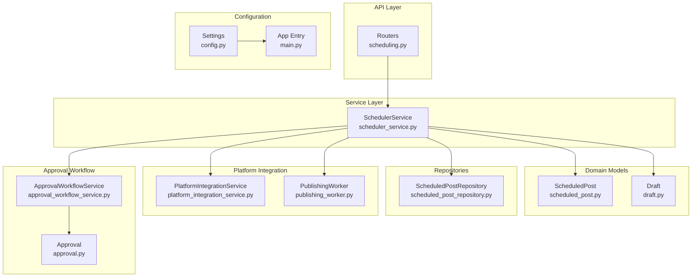
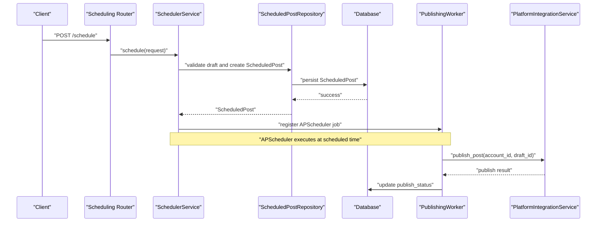
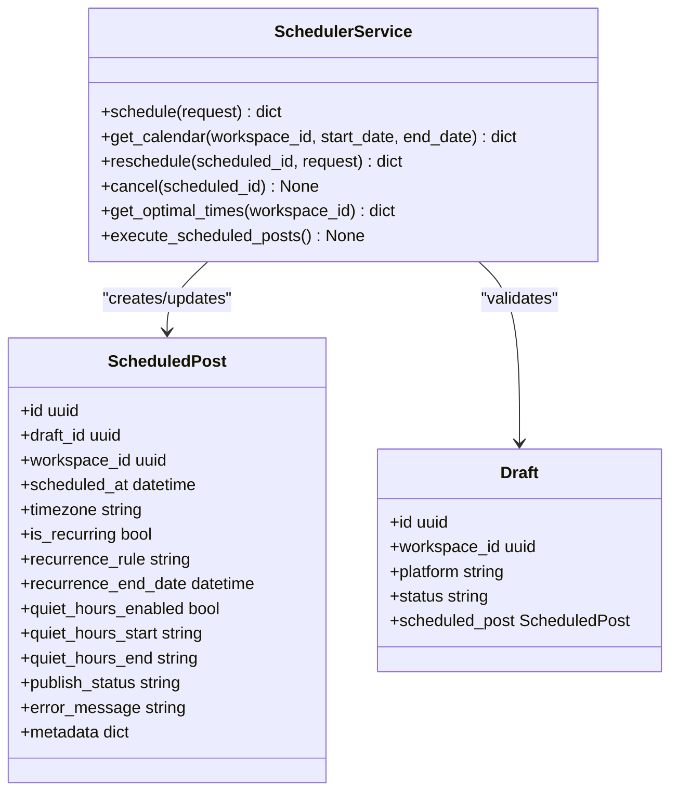
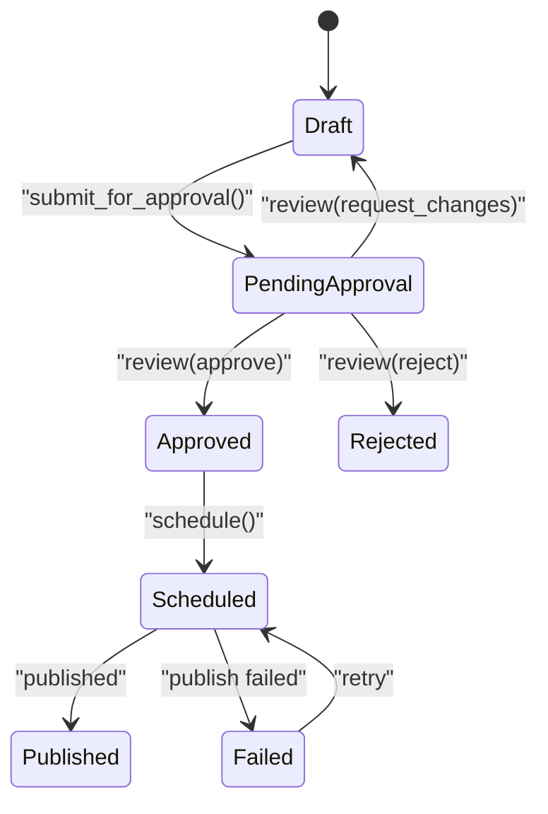
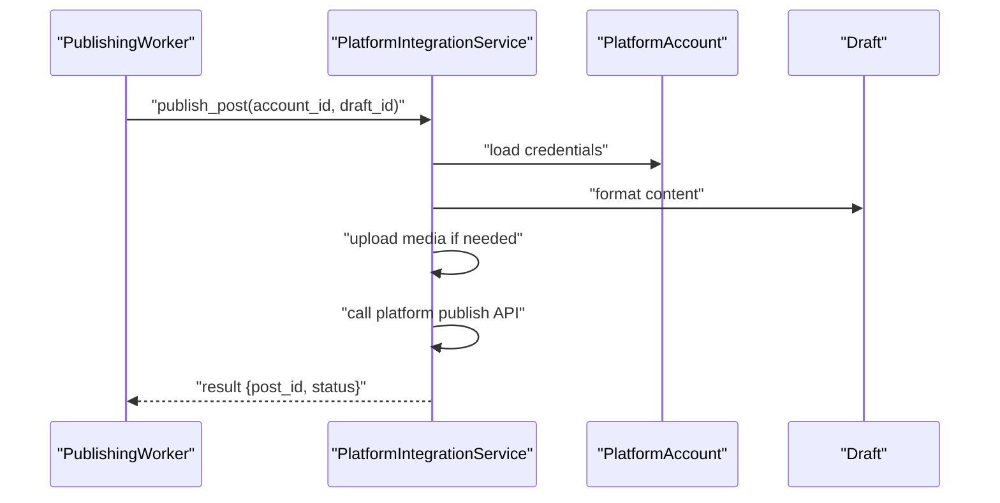
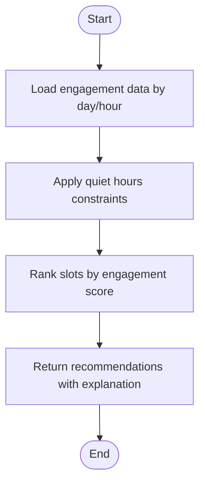
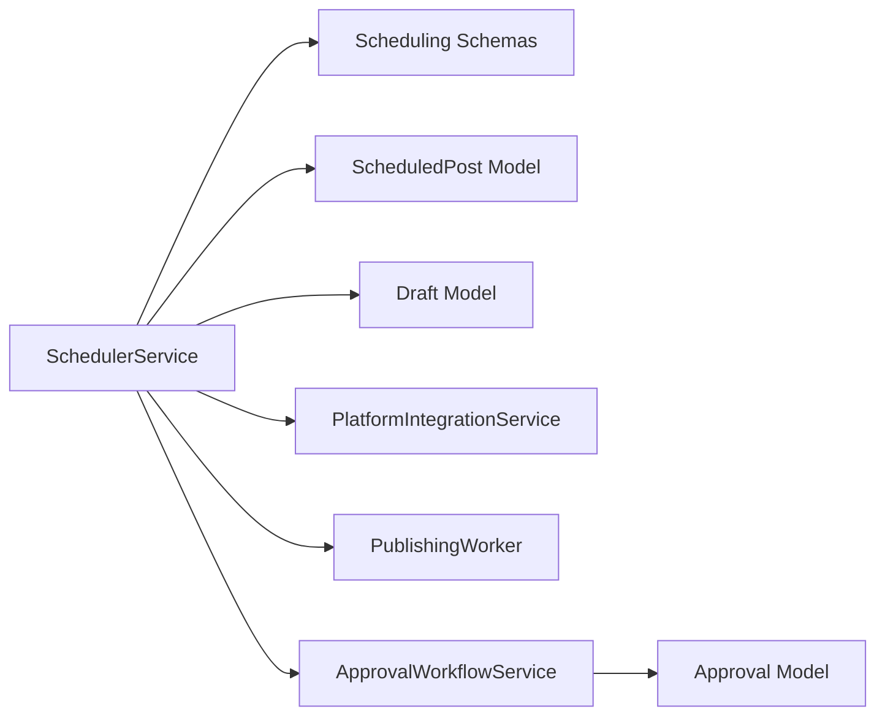

# Scheduler Service

<cite>
**Referenced Files in This Document**
- [scheduler_service.py](file://backend/app/services/scheduler_service.py)
- [scheduling.py](file://backend/app/schemas/scheduling.py)
- [scheduling.py](file://backend/app/routers/scheduling.py)
- [scheduled_post.py](file://backend/app/models/scheduled_post.py)
- [scheduled_post_repository.py](file://backend/app/repositories/scheduled_post_repository.py)
- [draft.py](file://backend/app/models/draft.py)
- [platform_integration_service.py](file://backend/app/services/platform_integration_service.py)
- [publishing_worker.py](file://backend/app/workers/publishing_worker.py)
- [approval_workflow_service.py](file://backend/app/services/approval_workflow_service.py)
- [approval.py](file://backend/app/models/approval.py)
- [constants.py](file://backend/app/core/constants.py)
- [main.py](file://backend/app/main.py)
- [config.py](file://backend/app/config.py)
</cite>

## Table of Contents
1. [Introduction](#introduction)
2. [Project Structure](#project-structure)
3. [Core Components](#core-components)
4. [Architecture Overview](#architecture-overview)
5. [Detailed Component Analysis](#detailed-component-analysis)
6. [Dependency Analysis](#dependency-analysis)
7. [Performance Considerations](#performance-considerations)
8. [Troubleshooting Guide](#troubleshooting-guide)
9. [Conclusion](#conclusion)
10. [Appendices](#appendices)

## Introduction
This document describes the SchedulerService responsible for intelligent content publishing automation. It covers the scheduling engine architecture, recurrence rule processing, batch operation management, publishing timing algorithms, timezone handling, platform-specific constraints, integration with platform APIs, error handling and retry mechanisms, complex scheduling scenarios, bulk scheduling operations, schedule modification workflows, performance optimization for large-scale scheduling, queue management, monitoring capabilities, and the relationship with approval workflows and content lifecycle management.

## Project Structure
The scheduling subsystem is organized around a service layer, API router, Pydantic schemas, SQLAlchemy models, and supporting services/workers. The service orchestrates scheduling decisions, validates inputs, persists state, and coordinates with the platform integration layer and publishing worker.

**Diagram sources**
- [scheduler_service.py](file://backend/app/services/scheduler_service.py#L8-L59)
- [scheduling.py](file://backend/app/routers/scheduling.py#L1-L69)
- [scheduled_post.py](file://backend/app/models/scheduled_post.py#L13-L56)
- [draft.py](file://backend/app/models/draft.py#L15-L71)
- [scheduled_post_repository.py](file://backend/app/repositories/scheduled_post_repository.py#L6-L14)
- [platform_integration_service.py](file://backend/app/services/platform_integration_service.py#L8-L56)
- [publishing_worker.py](file://backend/app/workers/publishing_worker.py#L4-L11)
- [approval_workflow_service.py](file://backend/app/services/approval_workflow_service.py#L8-L48)
- [approval.py](file://backend/app/models/approval.py#L14-L69)
- [config.py](file://backend/app/config.py#L9-L83)
- [main.py](file://backend/app/main.py#L11-L77)

**Section sources**
- [scheduler_service.py](file://backend/app/services/scheduler_service.py#L1-L59)
- [scheduling.py](file://backend/app/routers/scheduling.py#L1-L69)
- [scheduled_post.py](file://backend/app/models/scheduled_post.py#L1-L56)
- [draft.py](file://backend/app/models/draft.py#L1-L71)
- [scheduled_post_repository.py](file://backend/app/repositories/scheduled_post_repository.py#L1-L14)
- [platform_integration_service.py](file://backend/app/services/platform_integration_service.py#L1-L56)
- [publishing_worker.py](file://backend/app/workers/publishing_worker.py#L1-L12)
- [approval_workflow_service.py](file://backend/app/services/approval_workflow_service.py#L1-L48)
- [approval.py](file://backend/app/models/approval.py#L1-L69)
- [config.py](file://backend/app/config.py#L1-L83)
- [main.py](file://backend/app/main.py#L1-L83)

## Core Components
- SchedulerService: Orchestrates scheduling, calendar retrieval, rescheduling, cancellation, optimal time recommendations, and background execution of scheduled posts.
- Scheduling Router: Exposes endpoints for scheduling, calendar view, rescheduling, cancellation, and optimization.
- Scheduling Schemas: Define request/response shapes for scheduling operations.
- ScheduledPost Model: Persists scheduling metadata, recurrence, quiet hours, and status.
- Draft Model: Represents content to be scheduled and links to approval workflow.
- PlatformIntegrationService: Publishes content to external platforms and supports rollback.
- PublishingWorker: Executes individual and bulk publishing tasks.
- ApprovalWorkflowService and Approval Model: Enforce content approval prior to scheduling.
- Constants: Define platform enums, statuses, and platform limits.

**Section sources**
- [scheduler_service.py](file://backend/app/services/scheduler_service.py#L8-L59)
- [scheduling.py](file://backend/app/routers/scheduling.py#L1-L69)
- [scheduling.py](file://backend/app/schemas/scheduling.py#L9-L70)
- [scheduled_post.py](file://backend/app/models/scheduled_post.py#L13-L56)
- [draft.py](file://backend/app/models/draft.py#L15-L71)
- [platform_integration_service.py](file://backend/app/services/platform_integration_service.py#L8-L56)
- [publishing_worker.py](file://backend/app/workers/publishing_worker.py#L4-L11)
- [approval_workflow_service.py](file://backend/app/services/approval_workflow_service.py#L8-L48)
- [approval.py](file://backend/app/models/approval.py#L14-L69)
- [constants.py](file://backend/app/core/constants.py#L6-L85)

## Architecture Overview
The SchedulerService sits between the API layer and persistence, coordinating with the approval workflow and platform integrations. It uses APScheduler for time-based triggers and analytics-backed recommendations for optimal posting windows.

**Diagram sources**
- [scheduling.py](file://backend/app/routers/scheduling.py#L18-L25)
- [scheduler_service.py](file://backend/app/services/scheduler_service.py#L18-L27)
- [scheduled_post_repository.py](file://backend/app/repositories/scheduled_post_repository.py#L10-L13)
- [publishing_worker.py](file://backend/app/workers/publishing_worker.py#L4-L11)
- [platform_integration_service.py](file://backend/app/services/platform_integration_service.py#L41-L51)

## Detailed Component Analysis

### SchedulerService
Responsibilities:
- Validate draft existence and approval state before scheduling.
- Normalize scheduling time to UTC considering the provided timezone.
- Persist ScheduledPost with recurrence and quiet hours constraints.
- Register APScheduler jobs for single and recurring executions.
- Provide calendar view for a date range.
- Reschedule existing entries and cancel scheduled posts.
- Recommend optimal posting times using analytics and constraints.
- Execute scheduled posts in the background.

Key methods and behaviors:
- schedule(request): Validates draft and approval, computes effective schedule time, creates ScheduledPost, registers APScheduler job.
- get_calendar(workspace_id, start_date, end_date): Returns calendar items for UI display.
- reschedule(scheduled_id, request): Updates scheduled time and recurrence settings.
- cancel(scheduled_id): Cancels the APScheduler job and updates status.
- get_optimal_times(workspace_id): Analyzes engagement by day/hour, applies quiet hours constraints, ranks slots, returns recommendations with explanation.
- execute_scheduled_posts(): Background task to publish due posts.

**Diagram sources**
- [scheduler_service.py](file://backend/app/services/scheduler_service.py#L8-L59)
- [scheduled_post.py](file://backend/app/models/scheduled_post.py#L13-L56)
- [draft.py](file://backend/app/models/draft.py#L15-L71)

**Section sources**
- [scheduler_service.py](file://backend/app/services/scheduler_service.py#L8-L59)
- [scheduled_post.py](file://backend/app/models/scheduled_post.py#L13-L56)
- [draft.py](file://backend/app/models/draft.py#L15-L71)

### Scheduling Router
Endpoints:
- POST /api/v1/scheduling/schedule: Creates a new schedule.
- GET /api/v1/scheduling/calendar: Retrieves calendar items for a date range.
- PUT /api/v1/scheduling/{scheduled_id}/reschedule: Updates an existing schedule.
- DELETE /api/v1/scheduling/{scheduled_id}: Cancels a schedule.
- GET /api/v1/scheduling/optimize: Returns optimal posting times.

Validation and response modeling:
- Uses SchedulePostRequest for scheduling inputs.
- Responses modeled via ScheduledPostResponse, ScheduleCalendarResponse, and ScheduleOptimizerResponse.

**Section sources**
- [scheduling.py](file://backend/app/routers/scheduling.py#L18-L69)
- [scheduling.py](file://backend/app/schemas/scheduling.py#L9-L70)

### ScheduledPost Model
Fields:
- Identity and relationships: id, draft_id, workspace_id.
- Timing: scheduled_at (timezone-aware), timezone.
- Recurrence: is_recurring, recurrence_rule, recurrence_end_date.
- Quiet hours: quiet_hours_enabled, quiet_hours_start/end (HH:MM).
- Status and metadata: publish_status, error_message, metadata.
- Timestamps: created_at, updated_at.

Constraints:
- draft_id is unique and cascading deletes are configured on related models.

**Section sources**
- [scheduled_post.py](file://backend/app/models/scheduled_post.py#L13-L56)

### Draft Model and Approval Workflow
Lifecycle:
- Drafts progress through content lifecycle statuses including pending_approval and approved.
- ApprovalWorkflowService manages state transitions and comments.
- ScheduledPost references Draft and enforces that only approved drafts are scheduled.

**Diagram sources**
- [constants.py](file://backend/app/core/constants.py#L14-L23)
- [approval_workflow_service.py](file://backend/app/services/approval_workflow_service.py#L25-L39)
- [draft.py](file://backend/app/models/draft.py#L43-L47)
- [scheduled_post.py](file://backend/app/models/scheduled_post.py#L39-L41)

**Section sources**
- [constants.py](file://backend/app/core/constants.py#L14-L23)
- [approval_workflow_service.py](file://backend/app/services/approval_workflow_service.py#L8-L48)
- [approval.py](file://backend/app/models/approval.py#L14-L69)
- [draft.py](file://backend/app/models/draft.py#L15-L71)

### Publishing and Platform Integration
- PublishingWorker.run_publish(scheduled_post_id): Executes a single scheduled post publication.
- PublishingWorker.run_bulk_publish(workspace_id): Publishes all due posts for a workspace.
- PlatformIntegrationService.publish_post(account_id, draft_id): Formats content per platform and calls platform APIs; supports rollback via rollback_publish(post_id, platform).

**Diagram sources**
- [publishing_worker.py](file://backend/app/workers/publishing_worker.py#L4-L11)
- [platform_integration_service.py](file://backend/app/services/platform_integration_service.py#L41-L51)
- [platform_account.py](file://backend/app/models/platform_account.py#L14-L49)
- [draft.py](file://backend/app/models/draft.py#L15-L71)

**Section sources**
- [publishing_worker.py](file://backend/app/workers/publishing_worker.py#L1-L12)
- [platform_integration_service.py](file://backend/app/services/platform_integration_service.py#L8-L56)
- [platform_account.py](file://backend/app/models/platform_account.py#L14-L49)

### Optimal Time Recommendations
The SchedulerService recommends optimal posting times by:
- Analyzing historical engagement data by day/hour.
- Applying quiet hours constraints.
- Ranking time slots by predicted engagement score.
- Returning recommendations with an explanatory note.

**Diagram sources**
- [scheduler_service.py](file://backend/app/services/scheduler_service.py#L45-L54)

**Section sources**
- [scheduler_service.py](file://backend/app/services/scheduler_service.py#L45-L54)

### Calendar View and Batch Operations
- Calendar view: The get_calendar endpoint aggregates scheduled posts for a date range and returns items suitable for UI rendering.
- Bulk operations: The run_bulk_publish worker publishes all due posts for a workspace, enabling efficient batch execution.

**Section sources**
- [scheduling.py](file://backend/app/routers/scheduling.py#L28-L37)
- [publishing_worker.py](file://backend/app/workers/publishing_worker.py#L9-L11)

### Recurrence Rule Processing
- Recurrence fields: is_recurring, recurrence_rule, recurrence_end_date.
- Execution: APScheduler jobs are registered to repeat according to recurrence_rule until recurrence_end_date.
- Modification: Rescheduling updates recurrence settings and recalibrates APScheduler.

**Section sources**
- [scheduled_post.py](file://backend/app/models/scheduled_post.py#L31-L35)
- [scheduler_service.py](file://backend/app/services/scheduler_service.py#L35-L39)

### Timezone Handling
- The ScheduledPost model stores timezone alongside scheduled_at.
- The SchedulerService normalizes scheduling time to UTC for internal processing while preserving the original timezone for display and recurrence calculations.

**Section sources**
- [scheduled_post.py](file://backend/app/models/scheduled_post.py#L27-L30)
- [scheduler_service.py](file://backend/app/services/scheduler_service.py#L18-L27)

### Platform-Specific Constraints
- Platform limits and tiers are defined centrally and influence scheduling capacity and content formatting.
- PlatformIntegrationService formats content per platform and uploads media as required.

**Section sources**
- [constants.py](file://backend/app/core/constants.py#L63-L85)
- [platform_integration_service.py](file://backend/app/services/platform_integration_service.py#L41-L51)

### Error Handling and Retry Mechanisms
- ScheduledPost tracks publish_status and error_message for visibility.
- Retry loop: On failure, status moves to failed; manual intervention or automated retry can reschedule.
- Rollback support: PlatformIntegrationService.rollback_publish enables deletion of published posts.

**Section sources**
- [scheduled_post.py](file://backend/app/models/scheduled_post.py#L39-L43)
- [platform_integration_service.py](file://backend/app/services/platform_integration_service.py#L53-L55)

### Complex Scheduling Scenarios
- Recurring schedules with end dates.
- Quiet hours blocking during off-peak times.
- Mixed timezones within a workspace.
- Approval-dependent scheduling (only approved drafts are scheduled).

**Section sources**
- [scheduled_post.py](file://backend/app/models/scheduled_post.py#L31-L38)
- [draft.py](file://backend/app/models/draft.py#L43-L47)
- [scheduler_service.py](file://backend/app/services/scheduler_service.py#L18-L27)

### Schedule Modification Workflows
- Rescheduling updates scheduled_at and recurrence settings.
- Cancellation removes the APScheduler job and marks status as cancelled.

**Section sources**
- [scheduler_service.py](file://backend/app/services/scheduler_service.py#L35-L43)

## Dependency Analysis
The SchedulerService depends on:
- Pydantic schemas for request/response validation.
- SQLAlchemy models for persistence.
- PlatformIntegrationService for actual publishing.
- PublishingWorker for background execution.
- ApprovalWorkflowService for lifecycle gating.

**Diagram sources**
- [scheduler_service.py](file://backend/app/services/scheduler_service.py#L3-L6)
- [scheduling.py](file://backend/app/schemas/scheduling.py#L9-L70)
- [scheduled_post.py](file://backend/app/models/scheduled_post.py#L13-L56)
- [draft.py](file://backend/app/models/draft.py#L15-L71)
- [platform_integration_service.py](file://backend/app/services/platform_integration_service.py#L8-L56)
- [publishing_worker.py](file://backend/app/workers/publishing_worker.py#L4-L11)
- [approval_workflow_service.py](file://backend/app/services/approval_workflow_service.py#L8-L48)
- [approval.py](file://backend/app/models/approval.py#L14-L69)

**Section sources**
- [scheduler_service.py](file://backend/app/services/scheduler_service.py#L3-L6)
- [scheduling.py](file://backend/app/schemas/scheduling.py#L9-L70)
- [scheduled_post.py](file://backend/app/models/scheduled_post.py#L13-L56)
- [draft.py](file://backend/app/models/draft.py#L15-L71)
- [platform_integration_service.py](file://backend/app/services/platform_integration_service.py#L8-L56)
- [publishing_worker.py](file://backend/app/workers/publishing_worker.py#L4-L11)
- [approval_workflow_service.py](file://backend/app/services/approval_workflow_service.py#L8-L48)
- [approval.py](file://backend/app/models/approval.py#L14-L69)

## Performance Considerations
- Use APScheduler efficiently: Register only necessary jobs; avoid overlapping jobs for the same draft.
- Batch publishing: Prefer run_bulk_publish for high-volume days to reduce per-job overhead.
- Database indexing: Ensure indexes on scheduled_at, workspace_id, publish_status for calendar and due-post queries.
- Concurrency: Tune worker concurrency and queue depth to match platform rate limits.
- Memory: Cache frequently accessed platform account credentials and draft content to minimize DB round-trips.
- Monitoring: Track job execution latency, failure rates, and platform API response times.

[No sources needed since this section provides general guidance]

## Troubleshooting Guide
Common issues and resolutions:
- Post remains pending: Verify draft approval status and that SchedulerService created ScheduledPost with correct timezone and recurrence settings.
- Wrong publish time: Confirm timezone normalization and that scheduled_at matches expectations.
- Recurrence not firing: Check recurrence_rule and recurrence_end_date; ensure APScheduler job registration succeeded.
- Publishing failures: Inspect ScheduledPost.error_message and PlatformIntegrationService logs; use rollback_publish if supported.
- Calendar gaps: Validate get_calendar date range and workspace_id filtering.

**Section sources**
- [scheduled_post.py](file://backend/app/models/scheduled_post.py#L39-L43)
- [platform_integration_service.py](file://backend/app/services/platform_integration_service.py#L53-L55)
- [scheduler_service.py](file://backend/app/services/scheduler_service.py#L28-L33)

## Conclusion
The SchedulerService provides a robust foundation for intelligent content publishing automation. By integrating approval workflows, optimizing posting times, handling timezones and recurrence, and coordinating with platform APIs and background workers, it supports scalable, reliable scheduling at enterprise scale. Extending the service with concrete implementations for repository operations, APScheduler integration, and platform-specific formatting will complete the solution.

[No sources needed since this section summarizes without analyzing specific files]

## Appendices

### API Endpoints Summary
- POST /api/v1/scheduling/schedule: Create schedule.
- GET /api/v1/scheduling/calendar: Calendar view.
- PUT /api/v1/scheduling/{scheduled_id}/reschedule: Update schedule.
- DELETE /api/v1/scheduling/{scheduled_id}: Cancel schedule.
- GET /api/v1/scheduling/optimize: Optimal posting times.

**Section sources**
- [scheduling.py](file://backend/app/routers/scheduling.py#L18-L69)