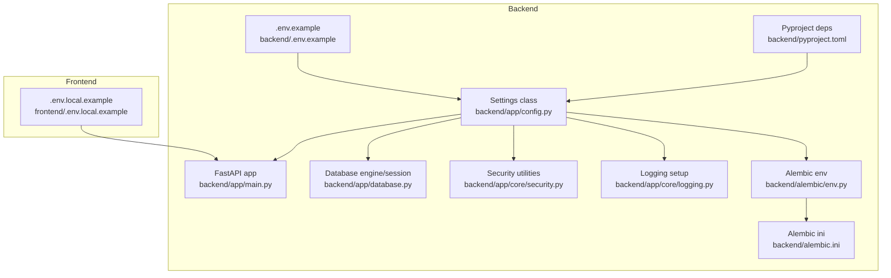
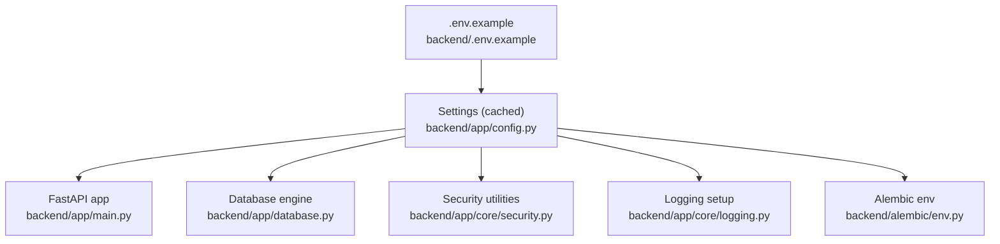
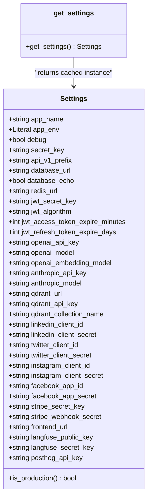
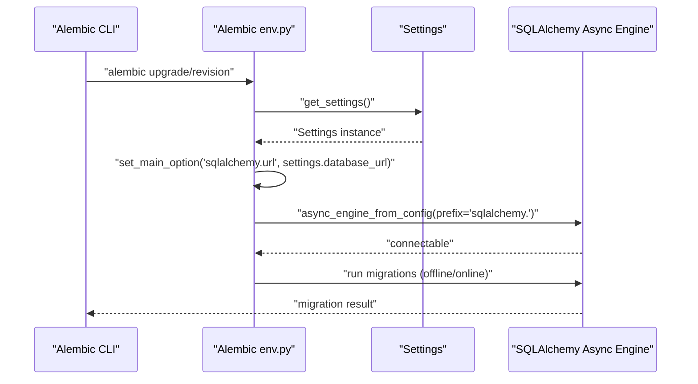
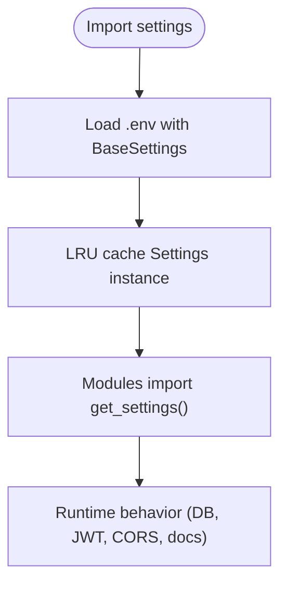
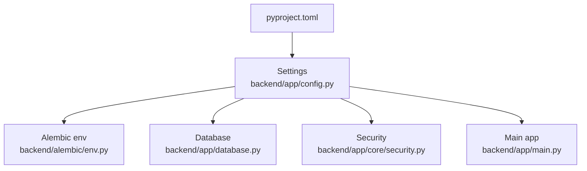

# Configuration & Environment

<cite>
**Referenced Files in This Document**
- [backend/app/config.py](file://backend/app/config.py)
- [backend/.env.example](file://backend/.env.example)
- [backend/alembic/env.py](file://backend/alembic/env.py)
- [backend/alembic.ini](file://backend/alembic.ini)
- [backend/pyproject.toml](file://backend/pyproject.toml)
- [backend/app/database.py](file://backend/app/database.py)
- [backend/app/main.py](file://backend/app/main.py)
- [backend/app/core/logging.py](file://backend/app/core/logging.py)
- [backend/app/core/security.py](file://backend/app/core/security.py)
- [frontend/.env.local.example](file://frontend/.env.local.example)
</cite>

## Table of Contents
1. [Introduction](#introduction)
2. [Project Structure](#project-structure)
3. [Core Components](#core-components)
4. [Architecture Overview](#architecture-overview)
5. [Detailed Component Analysis](#detailed-component-analysis)
6. [Dependency Analysis](#dependency-analysis)
7. [Performance Considerations](#performance-considerations)
8. [Troubleshooting Guide](#troubleshooting-guide)
9. [Conclusion](#conclusion)
10. [Appendices](#appendices)

## Introduction
This document explains Socialium’s configuration management system. It covers environment variable configuration for databases, external services, security, and application behavior; the centralized configuration class and environment-specific settings; secret management practices; database migration configuration with Alembic; development versus production settings; containerized deployment considerations; security considerations for API keys and sensitive data; logging configuration; monitoring setup; configuration validation and defaults; and troubleshooting common configuration issues. Examples for local development, staging, and production environments are included.

## Project Structure
The configuration system spans the backend Python application and related tooling:
- Centralized settings class and environment loading
- Example environment files for backend and frontend
- Alembic configuration for database migrations
- Pyproject metadata for dependencies and dev tooling
- Runtime usage across application modules (database, security, logging, main)

**Diagram sources**
- [backend/app/config.py](file://backend/app/config.py#L9-L82)
- [backend/.env.example](file://backend/.env.example#L1-L56)
- [backend/app/main.py](file://backend/app/main.py#L1-L83)
- [backend/app/database.py](file://backend/app/database.py#L1-L43)
- [backend/app/core/security.py](file://backend/app/core/security.py#L1-L50)
- [backend/app/core/logging.py](file://backend/app/core/logging.py#L1-L25)
- [backend/alembic/env.py](file://backend/alembic/env.py#L1-L65)
- [backend/alembic.ini](file://backend/alembic.ini#L1-L41)
- [backend/pyproject.toml](file://backend/pyproject.toml#L1-L49)
- [frontend/.env.local.example](file://frontend/.env.local.example#L1-L16)

**Section sources**
- [backend/app/config.py](file://backend/app/config.py#L1-L83)
- [backend/.env.example](file://backend/.env.example#L1-L56)
- [backend/alembic/env.py](file://backend/alembic/env.py#L1-L65)
- [backend/alembic.ini](file://backend/alembic.ini#L1-L41)
- [backend/pyproject.toml](file://backend/pyproject.toml#L1-L49)
- [frontend/.env.local.example](file://frontend/.env.local.example#L1-L16)

## Core Components
- Centralized Settings class: Loads environment variables from a .env file, enforces case-insensitive parsing, and exposes typed configuration fields for application behavior, database, Redis, JWT, LLM providers, vector DB, OAuth clients, billing, frontend origin, and monitoring.
- Environment-specific settings: app_env controls environment modes and influences runtime behavior such as debug flags and exposed docs endpoints.
- Caching: Settings are cached via a least-recently-used cache to avoid repeated parsing.
- Alembic integration: Alembic reads the database URL from settings for offline and online migrations.
- Logging configuration: Structured logging setup with configurable levels and suppressed noisy third-party loggers.
- Security utilities: JWT token creation and verification depend on settings for secrets and expiration.
- Database engine: Asynchronous SQLAlchemy engine configured from settings with connection pooling and echo toggles.
- Frontend integration: Frontend environment variables define API base URLs and NextAuth configuration.

Key configuration categories and representative fields:
- Application: app_name, app_env, debug, secret_key, api_v1_prefix
- Database: database_url, database_echo
- Redis: redis_url
- JWT: jwt_secret_key, jwt_algorithm, jwt_access_token_expire_minutes, jwt_refresh_token_expire_days
- LLM providers: openai_api_key, openai_model, openai_embedding_model, anthropic_api_key, anthropic_model
- Vector DB: qdrant_url, qdrant_api_key, qdrant_collection_name
- OAuth clients: linkedin_client_id/secret, twitter_client_id/secret, instagram_client_id/secret, facebook_app_id/app_secret
- Billing: stripe_secret_key, stripe_webhook_secret
- Frontend: frontend_url
- Monitoring: langfuse_public_key, langfuse_secret_key, posthog_api_key

**Section sources**
- [backend/app/config.py](file://backend/app/config.py#L9-L82)
- [backend/.env.example](file://backend/.env.example#L1-L56)
- [backend/app/core/logging.py](file://backend/app/core/logging.py#L7-L24)
- [backend/app/core/security.py](file://backend/app/core/security.py#L25-L40)
- [backend/app/database.py](file://backend/app/database.py#L12-L24)
- [backend/app/main.py](file://backend/app/main.py#L36-L52)
- [frontend/.env.local.example](file://frontend/.env.local.example#L5-L9)

## Architecture Overview
The configuration architecture ties environment variables to runtime behavior across modules. The Settings class acts as the single source of truth, consumed by the FastAPI app, database engine, security utilities, logging setup, and Alembic migration environment.

**Diagram sources**
- [backend/app/config.py](file://backend/app/config.py#L79-L82)
- [backend/app/main.py](file://backend/app/main.py#L23-L43)
- [backend/app/database.py](file://backend/app/database.py#L10-L24)
- [backend/app/core/security.py](file://backend/app/core/security.py#L10-L12)
- [backend/app/core/logging.py](file://backend/app/core/logging.py#L7-L14)
- [backend/alembic/env.py](file://backend/alembic/env.py#L10-L22)
- [backend/.env.example](file://backend/.env.example#L1-L56)

## Detailed Component Analysis

### Centralized Settings Class
- Purpose: Encapsulates all configuration fields with defaults and loads from a .env file.
- Behavior: Case-insensitive environment parsing, UTF-8 encoding, and caching via LRU cache.
- Environment modes: app_env supports development, staging, and production; a property indicates production mode.
- Validation: Uses Pydantic settings with typed fields; missing values fall back to defaults.

**Diagram sources**
- [backend/app/config.py](file://backend/app/config.py#L9-L82)
- [backend/app/config.py](file://backend/app/config.py#L79-L82)

**Section sources**
- [backend/app/config.py](file://backend/app/config.py#L9-L82)

### Environment Variable Configuration
- Backend example: A comprehensive .env.example defines all configuration groups with placeholder values and comments.
- Frontend example: A .env.local.example defines frontend API base URL and NextAuth configuration.
- Loading mechanism: Settings.load() reads from the .env file with case-insensitive keys and UTF-8 encoding.

Environment variable groups and representative keys:
- Application: APP_NAME, APP_ENV, DEBUG, SECRET_KEY, API_V1_PREFIX
- Database: DATABASE_URL, DATABASE_ECHO
- Redis: REDIS_URL
- JWT: JWT_SECRET_KEY, JWT_ALGORITHM, JWT_ACCESS_TOKEN_EXPIRE_MINUTES, JWT_REFRESH_TOKEN_EXPIRE_DAYS
- OpenAI: OPENAI_API_KEY, OPENAI_MODEL, OPENAI_EMBEDDING_MODEL
- Anthropic: ANTHROPIC_API_KEY, ANTHROPIC_MODEL
- Qdrant: QDRANT_URL, QDRANT_API_KEY, QDRANT_COLLECTION_NAME
- OAuth: LINKEDIN_CLIENT_ID, LINKEDIN_CLIENT_SECRET, TWITTER_CLIENT_ID, TWITTER_CLIENT_SECRET, INSTAGRAM_CLIENT_ID, INSTAGRAM_CLIENT_SECRET, FACEBOOK_APP_ID, FACEBOOK_APP_SECRET
- Stripe: STRIPE_SECRET_KEY, STRIPE_WEBHOOK_SECRET
- Frontend: FRONTEND_URL
- Monitoring: LANGFUSE_PUBLIC_KEY, LANGFUSE_SECRET_KEY, POSTHOG_API_KEY

**Section sources**
- [backend/.env.example](file://backend/.env.example#L1-L56)
- [frontend/.env.local.example](file://frontend/.env.local.example#L1-L16)
- [backend/app/config.py](file://backend/app/config.py#L12-L16)

### Secret Management Practices
- Do not commit secrets: The example files include empty or placeholder values for secrets.
- Environment isolation: Use separate .env files per environment (development, staging, production).
- Rotation and validation: Ensure secrets are present and valid at startup; rely on typed settings to surface missing values.
- Production hardening: Replace defaults for secret_key, jwt_secret_key, and provider API keys before deploying.

**Section sources**
- [backend/.env.example](file://backend/.env.example#L5-L64)
- [backend/app/config.py](file://backend/app/config.py#L19-L22)
- [backend/app/config.py](file://backend/app/config.py#L33-L36)

### Database Migration Configuration with Alembic
- Alembic environment: Reads settings to set the SQLAlchemy URL and imports all models for autogenerate.
- Offline and online modes: Supports both offline and online migrations using async engines.
- Logging: Alembic configuration sets logger levels for SQLAlchemy and Alembic.

**Diagram sources**
- [backend/alembic/env.py](file://backend/alembic/env.py#L10-L58)
- [backend/app/config.py](file://backend/app/config.py#L79-L82)

**Section sources**
- [backend/alembic/env.py](file://backend/alembic/env.py#L1-L65)
- [backend/alembic.ini](file://backend/alembic.ini#L1-L41)
- [backend/app/config.py](file://backend/app/config.py#L26-L27)

### Development vs Production Settings
- Environment mode: app_env selects development, staging, or production.
- Debug behavior: debug toggles docs endpoints visibility and other development features.
- Production detection: is_production property simplifies environment-aware logic.
- Defaults: conservative defaults favor local development; override in .env for each environment.

**Section sources**
- [backend/app/config.py](file://backend/app/config.py#L20-L21)
- [backend/app/config.py](file://backend/app/config.py#L75-L76)
- [backend/app/main.py](file://backend/app/main.py#L41-L42)

### Containerized Deployment Configurations
- Environment injection: Set environment variables in containers using orchestrators or deployment platforms.
- Secrets management: Mount secrets via secure volumes or secret managers; avoid embedding in images.
- Network configuration: Ensure DATABASE_URL, REDIS_URL, and external service endpoints resolve inside the cluster.
- Health checks: Use the /health endpoint for readiness/liveness probes.

[No sources needed since this section provides general guidance]

### Security Considerations for API Keys and Sensitive Data
- JWT: Configure jwt_secret_key, jwt_algorithm, and token expirations; never expose secrets in client-side code.
- LLM providers: Store provider API keys securely; restrict model usage policies.
- OAuth: Keep client IDs/secrets secret; configure allowed redirect URIs.
- Vector DB: Protect Qdrant API keys; limit network exposure.
- Billing: Secure Stripe keys and webhook secrets; validate signatures.

**Section sources**
- [backend/app/config.py](file://backend/app/config.py#L33-L36)
- [backend/app/config.py](file://backend/app/config.py#L39-L41)
- [backend/app/config.py](file://backend/app/config.py#L44-L45)
- [backend/app/config.py](file://backend/app/config.py#L49-L50)
- [backend/app/config.py](file://backend/app/config.py#L63-L64)

### Logging Configuration
- Structured logs: BasicConfig with timestamp, level, logger name, and message.
- Noise reduction: Lower log levels for noisy libraries (SQLAlchemy engine, httpx, httpcore).
- Logger naming: Use socialium.<module> pattern for consistent filtering.

**Section sources**
- [backend/app/core/logging.py](file://backend/app/core/logging.py#L7-L24)

### Monitoring Setup
- Langfuse: Public and secret keys enable tracing and observability.
- PostHog: API key enables analytics and event tracking.
- Configure per environment; disable in development if not needed.

**Section sources**
- [backend/app/config.py](file://backend/app/config.py#L70-L72)
- [backend/.env.example](file://backend/.env.example#L52-L55)

### Configuration Validation, Defaults, and Runtime Usage
- Typed fields: Pydantic settings enforce types and provide defaults.
- Caching: get_settings() caches the parsed configuration to avoid repeated IO.
- Runtime consumption: Modules import get_settings() to access configuration safely.

**Diagram sources**
- [backend/app/config.py](file://backend/app/config.py#L12-L16)
- [backend/app/config.py](file://backend/app/config.py#L79-L82)
- [backend/app/main.py](file://backend/app/main.py#L23-L43)
- [backend/app/database.py](file://backend/app/database.py#L10-L14)
- [backend/app/core/security.py](file://backend/app/core/security.py#L10-L12)

**Section sources**
- [backend/app/config.py](file://backend/app/config.py#L9-L82)
- [backend/app/main.py](file://backend/app/main.py#L23-L43)
- [backend/app/database.py](file://backend/app/database.py#L10-L14)
- [backend/app/core/security.py](file://backend/app/core/security.py#L10-L12)

## Dependency Analysis
- Settings depends on pydantic-settings for environment parsing and typing.
- Alembic env depends on Settings and imports all models for autogenerate.
- Database module depends on Settings for engine configuration.
- Security utilities depend on Settings for JWT configuration.
- Main app depends on Settings for CORS, docs, and router prefixes.
- Pyproject lists dependencies including pydantic-settings, SQLAlchemy, Alembic, and others.

**Diagram sources**
- [backend/pyproject.toml](file://backend/pyproject.toml#L6-L25)
- [backend/app/config.py](file://backend/app/config.py#L6-L7)
- [backend/alembic/env.py](file://backend/alembic/env.py#L10-L12)
- [backend/app/database.py](file://backend/app/database.py#L8-L10)
- [backend/app/core/security.py](file://backend/app/core/security.py#L8-L10)
- [backend/app/main.py](file://backend/app/main.py#L9-L11)

**Section sources**
- [backend/pyproject.toml](file://backend/pyproject.toml#L6-L25)
- [backend/app/config.py](file://backend/app/config.py#L6-L7)

## Performance Considerations
- Database pooling: The async engine uses pre-ping and tuned pool sizes; adjust based on workload.
- Echo toggle: Disable database echo in production to reduce overhead.
- Logging levels: Reduce noise and CPU overhead by setting appropriate log levels.
- Caching: Settings are cached; avoid frequent re-initialization.

**Section sources**
- [backend/app/database.py](file://backend/app/database.py#L15-L18)
- [backend/app/config.py](file://backend/app/config.py#L27-L27)
- [backend/app/core/logging.py](file://backend/app/core/logging.py#L16-L19)

## Troubleshooting Guide
Common configuration issues and resolutions:
- Missing environment variables
  - Symptom: Unexpected defaults or runtime errors.
  - Resolution: Populate .env with required keys; verify case-insensitivity and encoding.
- Incorrect database URL
  - Symptom: Connection failures during migrations or runtime.
  - Resolution: Validate DATABASE_URL format and connectivity; confirm Alembic and app use the same value.
- CORS errors
  - Symptom: Browser policy errors when calling the API from the frontend.
  - Resolution: Ensure FRONTEND_URL matches the origin used by the client.
- JWT validation failures
  - Symptom: Token decoding errors or unauthorized responses.
  - Resolution: Verify jwt_secret_key and jwt_algorithm match across services.
- Missing provider API keys
  - Symptom: Feature disabled or runtime warnings.
  - Resolution: Add provider keys (OpenAI, Anthropic, Qdrant, OAuth clients, Stripe).
- Alembic migration failures
  - Symptom: Version mismatch or connection errors.
  - Resolution: Confirm database_url in settings and Alembic configuration; run migrations with the correct environment.

**Section sources**
- [backend/.env.example](file://backend/.env.example#L8-L55)
- [backend/alembic/env.py](file://backend/alembic/env.py#L20-L20)
- [backend/app/main.py](file://backend/app/main.py#L48-L52)
- [backend/app/core/security.py](file://backend/app/core/security.py#L46-L49)

## Conclusion
Socialium’s configuration system centralizes environment-driven settings, integrates tightly with FastAPI, database, security, logging, and migrations, and supports robust secret management and environment-specific behavior. By following the outlined practices—secure secret storage, environment isolation, validation, and careful tuning—you can deploy reliably across local development, staging, and production.

## Appendices

### Environment-Specific Examples
- Local development
  - Set APP_ENV=development and DEBUG=true.
  - Use default localhost URLs for database, Redis, and frontend.
  - Enable docs endpoints for interactive API docs.
- Staging
  - Set APP_ENV=staging.
  - Provide production-like secrets and URLs; keep debug enabled cautiously.
- Production
  - Set APP_ENV=production and DEBUG=false.
  - Replace all default secrets and URLs; disable docs endpoints.
  - Ensure strict CORS origins and minimal logging verbosity.

**Section sources**
- [backend/.env.example](file://backend/.env.example#L2-L6)
- [backend/app/main.py](file://backend/app/main.py#L41-L42)
- [backend/app/config.py](file://backend/app/config.py#L20-L21)