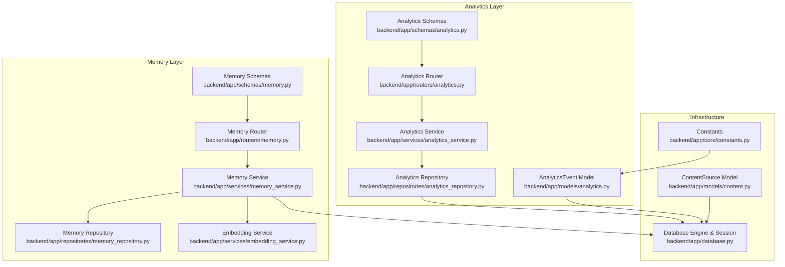
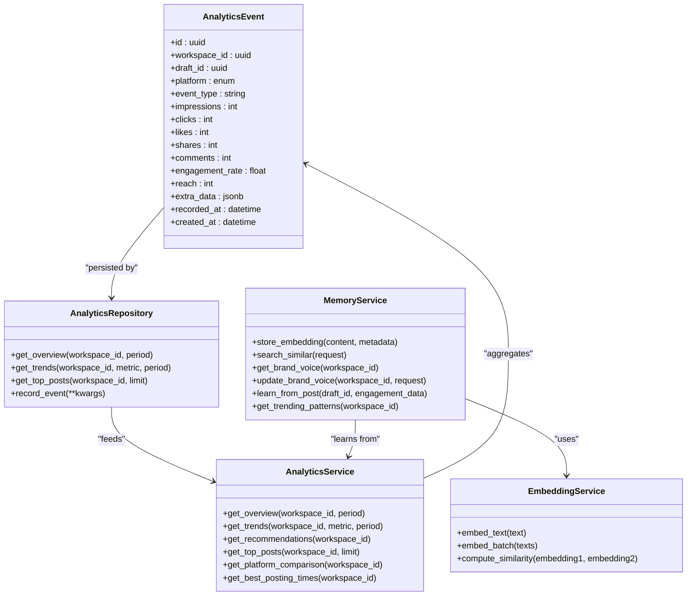
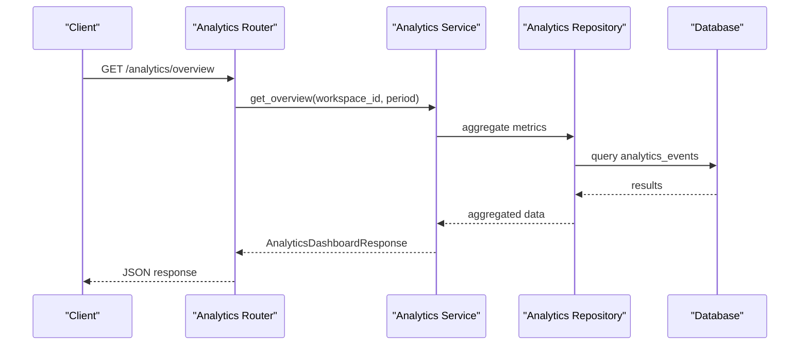
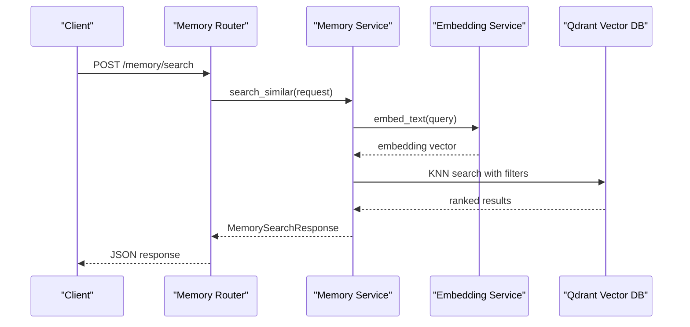
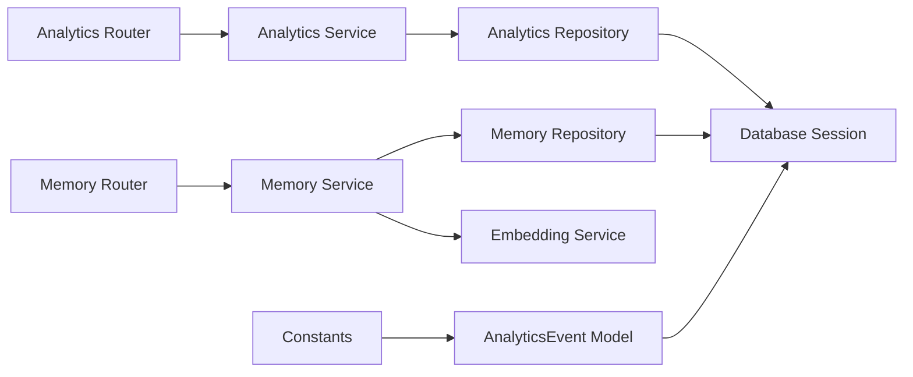

# Analytics and Memory Models

<cite>
**Referenced Files in This Document**
- [backend/app/models/analytics.py](file://backend/app/models/analytics.py)
- [backend/app/schemas/analytics.py](file://backend/app/schemas/analytics.py)
- [backend/app/repositories/analytics_repository.py](file://backend/app/repositories/analytics_repository.py)
- [backend/app/services/analytics_service.py](file://backend/app/services/analytics_service.py)
- [backend/app/routers/analytics.py](file://backend/app/routers/analytics.py)
- [backend/app/core/constants.py](file://backend/app/core/constants.py)
- [backend/app/models/content.py](file://backend/app/models/content.py)
- [backend/app/schemas/memory.py](file://backend/app/schemas/memory.py)
- [backend/app/repositories/memory_repository.py](file://backend/app/repositories/memory_repository.py)
- [backend/app/services/memory_service.py](file://backend/app/services/memory_service.py)
- [backend/app/routers/memory.py](file://backend/app/routers/memory.py)
- [backend/app/services/embedding_service.py](file://backend/app/services/embedding_service.py)
- [backend/app/database.py](file://backend/app/database.py)
</cite>

## Table of Contents
1. [Introduction](#introduction)
2. [Project Structure](#project-structure)
3. [Core Components](#core-components)
4. [Architecture Overview](#architecture-overview)
5. [Detailed Component Analysis](#detailed-component-analysis)
6. [Dependency Analysis](#dependency-analysis)
7. [Performance Considerations](#performance-considerations)
8. [Troubleshooting Guide](#troubleshooting-guide)
9. [Conclusion](#conclusion)
10. [Appendices](#appendices)

## Introduction
This document provides comprehensive data model documentation for Socialium’s analytics and memory systems. It focuses on:
- AnalyticsEvent model for performance tracking, engagement metrics, and behavioral analytics
- VectorMemory model for semantic storage with vector embeddings, similarity search, and brand voice learning
- Integration with Qdrant vector database, embedding generation, and semantic search capabilities
- Field definitions, indexing strategies, and query patterns
- Data retention policies, aggregation functions, and real-time analytics processing
- Examples of analytics reporting and memory-based content optimization

## Project Structure
The analytics and memory subsystems are implemented using a layered architecture:
- Models define persistent entities and relationships
- Schemas define request/response data contracts
- Repositories encapsulate persistence operations
- Services orchestrate business logic and integrations
- Routers expose REST endpoints
- Embedding service integrates external AI APIs for embeddings
- Database module configures async SQLAlchemy engine and sessions

**Diagram sources**
- [backend/app/models/analytics.py](file://backend/app/models/analytics.py#L14-L48)
- [backend/app/schemas/analytics.py](file://backend/app/schemas/analytics.py#L9-L76)
- [backend/app/repositories/analytics_repository.py](file://backend/app/repositories/analytics_repository.py#L6-L13)
- [backend/app/services/analytics_service.py](file://backend/app/services/analytics_service.py#L6-L59)
- [backend/app/routers/analytics.py](file://backend/app/routers/analytics.py#L10-L43)
- [backend/app/schemas/memory.py](file://backend/app/schemas/memory.py#L8-L50)
- [backend/app/repositories/memory_repository.py](file://backend/app/repositories/memory_repository.py#L6-L12)
- [backend/app/services/memory_service.py](file://backend/app/services/memory_service.py#L8-L65)
- [backend/app/routers/memory.py](file://backend/app/routers/memory.py#L15-L46)
- [backend/app/services/embedding_service.py](file://backend/app/services/embedding_service.py#L8-L46)
- [backend/app/database.py](file://backend/app/database.py#L12-L42)
- [backend/app/core/constants.py](file://backend/app/core/constants.py#L6-L12)
- [backend/app/models/content.py](file://backend/app/models/content.py#L14-L41)

**Section sources**
- [backend/app/models/analytics.py](file://backend/app/models/analytics.py#L1-L48)
- [backend/app/schemas/analytics.py](file://backend/app/schemas/analytics.py#L1-L76)
- [backend/app/repositories/analytics_repository.py](file://backend/app/repositories/analytics_repository.py#L1-L13)
- [backend/app/services/analytics_service.py](file://backend/app/services/analytics_service.py#L1-L59)
- [backend/app/routers/analytics.py](file://backend/app/routers/analytics.py#L1-L43)
- [backend/app/schemas/memory.py](file://backend/app/schemas/memory.py#L1-L50)
- [backend/app/repositories/memory_repository.py](file://backend/app/repositories/memory_repository.py#L1-L12)
- [backend/app/services/memory_service.py](file://backend/app/services/memory_service.py#L1-L65)
- [backend/app/routers/memory.py](file://backend/app/routers/memory.py#L1-L46)
- [backend/app/services/embedding_service.py](file://backend/app/services/embedding_service.py#L1-L46)
- [backend/app/database.py](file://backend/app/database.py#L1-L42)
- [backend/app/core/constants.py](file://backend/app/core/constants.py#L1-L85)
- [backend/app/models/content.py](file://backend/app/models/content.py#L1-L41)

## Core Components
This section documents the core data models and their roles in analytics and memory systems.

### AnalyticsEvent Model
AnalyticsEvent captures performance and engagement metrics for published content across platforms. It supports impression, click, like, share, and comment counts, along with derived metrics such as engagement rate and reach.

Key characteristics:
- Unique identifier and timestamps for recording and creation
- Foreign keys linking to workspace and optional draft
- Enumerated platform field constrained to supported platforms
- JSONB field for storing extra metadata
- Automatic defaults for numeric counters and timestamps

Field definitions and relationships:
- Identifier and foreign keys: workspace_id, draft_id
- Platform enumeration: platform
- Event type: event_type
- Engagement metrics: impressions, clicks, likes, shares, comments
- Derived metrics: engagement_rate, reach
- Extra data: extra_data
- Timestamps: recorded_at, created_at

Indexing and query patterns:
- Composite indexing recommended for workspace_id and recorded_at for time-series queries
- Platform filtering via ENUM index for multi-platform dashboards
- Draft association enables attribution to content drafts

Retention policy:
- Retain analytics events for at least 90–180 days for trend analysis and recommendations
- Archive older records to cold storage for cost optimization

Aggregation functions:
- Summarize impressions, clicks, likes, shares, comments by day and platform
- Compute engagement_rate as a ratio of total interactions to reach
- Derive follower_growth and post_frequency from time-series deltas

Real-time processing:
- Stream events into analytics pipeline for near-real-time dashboard updates
- Trigger recommendation engine updates after significant spikes or drops

**Section sources**
- [backend/app/models/analytics.py](file://backend/app/models/analytics.py#L14-L48)
- [backend/app/core/constants.py](file://backend/app/core/constants.py#L6-L12)

### VectorMemory Model (Conceptual)
VectorMemory represents semantic storage for brand voice learning and content pattern recall. It integrates with Qdrant for vector embeddings and similarity search.

Conceptual schema:
- Embedding vectors stored in Qdrant with metadata
- Metadata includes workspace_id, content category, source identifiers, and timestamps
- Supports KNN search for semantic similarity and hybrid retrieval

Integration with embedding service:
- Uses OpenAI text-embedding-3-large for 1536-dimensional embeddings
- Batch embedding generation for efficiency
- Cosine similarity computation for ranking

Brand voice learning:
- Stores successful content patterns and hooks
- Learns effective CTAs and rejected patterns
- Updates brand voice profile dynamically

**Section sources**
- [backend/app/services/memory_service.py](file://backend/app/services/memory_service.py#L8-L65)
- [backend/app/services/embedding_service.py](file://backend/app/services/embedding_service.py#L8-L46)
- [backend/app/schemas/memory.py](file://backend/app/schemas/memory.py#L8-L50)

## Architecture Overview
The analytics and memory systems follow a clean architecture with clear separation of concerns. Routers handle HTTP requests, services encapsulate business logic, repositories manage persistence, and models define data structures.

**Diagram sources**
- [backend/app/models/analytics.py](file://backend/app/models/analytics.py#L14-L48)
- [backend/app/repositories/analytics_repository.py](file://backend/app/repositories/analytics_repository.py#L6-L13)
- [backend/app/services/analytics_service.py](file://backend/app/services/analytics_service.py#L6-L59)
- [backend/app/services/memory_service.py](file://backend/app/services/memory_service.py#L8-L65)
- [backend/app/services/embedding_service.py](file://backend/app/services/embedding_service.py#L8-L46)

## Detailed Component Analysis

### AnalyticsEvent Data Model
AnalyticsEvent is the central entity for tracking engagement and performance. It is persisted using SQLAlchemy ORM with PostgreSQL-specific types for robustness.

Field-level details:
- Identifiers: UUID primary key; workspace_id foreign key cascading deletes; draft_id optional foreign key
- Platform: ENUM of supported platforms
- Metrics: integer counters for impressions, clicks, likes, shares, comments
- Derived metrics: engagement_rate and reach
- Metadata: JSONB for flexible extra_data
- Timestamps: recorded_at and created_at with server-side defaults

Relationships:
- Belongs to a workspace
- Optionally linked to a draft for content attribution

Indexing recommendations:
- Index on (workspace_id, recorded_at) for time-series queries
- Index on platform for multi-platform filtering
- Index on draft_id for content attribution analytics

Retention and archival:
- Maintain raw events for 90–180 days
- Aggregate daily summaries for long-term trend storage

**Section sources**
- [backend/app/models/analytics.py](file://backend/app/models/analytics.py#L14-L48)
- [backend/app/core/constants.py](file://backend/app/core/constants.py#L6-L12)

### Analytics Dashboard and Reporting
Analytics schemas define structured responses for dashboards and reports.

Key response models:
- AnalyticsOverview: totals and averages for posts, impressions, clicks, likes, shares, comments, engagement rate, follower growth, scheduled posts, and post frequency
- TrendDataPoint: date/value pairs for time-series
- PlatformComparison: per-platform metrics
- TopPostItem: top-performing post details
- PostingTimeRecommendation: optimal posting time suggestions
- AnalyticsTrendsResponse: 30-day trend series
- AnalyticsDashboardResponse: full dashboard payload

Processing logic:
- Aggregation by day and platform
- Computation of engagement_rate and derived metrics
- Recommendations based on top performers and underperformers

**Diagram sources**
- [backend/app/routers/analytics.py](file://backend/app/routers/analytics.py#L13-L21)
- [backend/app/services/analytics_service.py](file://backend/app/services/analytics_service.py#L16-L22)
- [backend/app/repositories/analytics_repository.py](file://backend/app/repositories/analytics_repository.py#L10-L12)
- [backend/app/models/analytics.py](file://backend/app/models/analytics.py#L14-L48)

**Section sources**
- [backend/app/schemas/analytics.py](file://backend/app/schemas/analytics.py#L9-L76)
- [backend/app/services/analytics_service.py](file://backend/app/services/analytics_service.py#L16-L59)
- [backend/app/routers/analytics.py](file://backend/app/routers/analytics.py#L13-L43)

### Memory and Brand Voice Learning
Memory schemas define brand voice profiles and semantic search contracts.

Brand voice profile:
- Includes workspace_id, tone, values, target_audience, learned_phrases, top_hooks, rejected_patterns, effective_ctas, and last_updated

Search contracts:
- MemorySearchRequest: query string with length constraints and result limit
- MemorySearchResult: individual match with id, content, score, and category
- MemorySearchResponse: list of results and original query

Memory service responsibilities:
- Store embeddings in vector database
- Perform similarity search
- Maintain and update brand voice
- Learn from post performance to refine patterns

**Diagram sources**
- [backend/app/routers/memory.py](file://backend/app/routers/memory.py#L39-L46)
- [backend/app/services/memory_service.py](file://backend/app/services/memory_service.py#L29-L37)
- [backend/app/services/embedding_service.py](file://backend/app/services/embedding_service.py#L20-L28)

**Section sources**
- [backend/app/schemas/memory.py](file://backend/app/schemas/memory.py#L8-L50)
- [backend/app/services/memory_service.py](file://backend/app/services/memory_service.py#L8-L65)
- [backend/app/routers/memory.py](file://backend/app/routers/memory.py#L18-L46)
- [backend/app/services/embedding_service.py](file://backend/app/services/embedding_service.py#L8-L46)

### ContentSource Model (Supporting Context)
ContentSource provides the foundation for content ingestion and extraction, which feeds into analytics and memory learning.

Key fields:
- workspace_id foreign key
- source_type enumeration
- URLs, text, and document paths
- Extracted text and metadata
- Created timestamp

Relationships:
- Back-populates drafts for content attribution

**Section sources**
- [backend/app/models/content.py](file://backend/app/models/content.py#L14-L41)

## Dependency Analysis
The system exhibits clear layering with low coupling and high cohesion:
- Routers depend on services
- Services depend on repositories and external services
- Repositories depend on database sessions
- Models depend on base declarative class and SQLAlchemy dialects
- Constants define shared enumerations and limits

**Diagram sources**
- [backend/app/routers/analytics.py](file://backend/app/routers/analytics.py#L10-L43)
- [backend/app/routers/memory.py](file://backend/app/routers/memory.py#L15-L46)
- [backend/app/services/analytics_service.py](file://backend/app/services/analytics_service.py#L6-L14)
- [backend/app/services/memory_service.py](file://backend/app/services/memory_service.py#L16-L17)
- [backend/app/repositories/analytics_repository.py](file://backend/app/repositories/analytics_repository.py#L7-L8)
- [backend/app/repositories/memory_repository.py](file://backend/app/repositories/memory_repository.py#L7-L8)
- [backend/app/services/embedding_service.py](file://backend/app/services/embedding_service.py#L15-L18)
- [backend/app/database.py](file://backend/app/database.py#L32-L42)
- [backend/app/models/analytics.py](file://backend/app/models/analytics.py#L14-L48)
- [backend/app/core/constants.py](file://backend/app/core/constants.py#L6-L12)

**Section sources**
- [backend/app/routers/analytics.py](file://backend/app/routers/analytics.py#L1-L43)
- [backend/app/routers/memory.py](file://backend/app/routers/memory.py#L1-L46)
- [backend/app/services/analytics_service.py](file://backend/app/services/analytics_service.py#L1-L59)
- [backend/app/services/memory_service.py](file://backend/app/services/memory_service.py#L1-L65)
- [backend/app/repositories/analytics_repository.py](file://backend/app/repositories/analytics_repository.py#L1-L13)
- [backend/app/repositories/memory_repository.py](file://backend/app/repositories/memory_repository.py#L1-L12)
- [backend/app/services/embedding_service.py](file://backend/app/services/embedding_service.py#L1-L46)
- [backend/app/database.py](file://backend/app/database.py#L1-L42)
- [backend/app/models/analytics.py](file://backend/app/models/analytics.py#L1-L48)
- [backend/app/core/constants.py](file://backend/app/core/constants.py#L1-L85)

## Performance Considerations
- Asynchronous database operations: Use async SQLAlchemy sessions to minimize latency and improve throughput
- Batch embedding generation: Leverage batch embedding for improved efficiency when processing multiple texts
- Indexing strategy: Add composite indexes on workspace_id and recorded_at for time-series analytics; add ENUM indexes for platform filtering
- Caching: Cache frequently accessed dashboard metrics and brand voice profiles
- Vector search optimization: Tune Qdrant collection size, distance metric, and filterable metadata to balance accuracy and speed
- Retention and archival: Archive old analytics events to reduce query load while preserving historical trends

## Troubleshooting Guide
Common issues and resolutions:
- Missing implementation errors: Several repository and service methods are placeholders and must be implemented to enable analytics and memory features
- Database connectivity: Verify async engine configuration and session factory settings
- Embedding service configuration: Ensure OpenAI API key and model settings are correctly configured
- Router dependencies: Confirm database dependency injection and proper session lifecycle management

**Section sources**
- [backend/app/repositories/analytics_repository.py](file://backend/app/repositories/analytics_repository.py#L10-L13)
- [backend/app/repositories/memory_repository.py](file://backend/app/repositories/memory_repository.py#L10-L12)
- [backend/app/services/analytics_service.py](file://backend/app/services/analytics_service.py#L22-L59)
- [backend/app/services/memory_service.py](file://backend/app/services/memory_service.py#L27-L61)
- [backend/app/services/embedding_service.py](file://backend/app/services/embedding_service.py#L15-L18)
- [backend/app/database.py](file://backend/app/database.py#L12-L24)

## Conclusion
Socialium’s analytics and memory systems are designed with scalability and modularity in mind. The AnalyticsEvent model provides a robust foundation for engagement tracking, while the memory layer leverages vector embeddings for semantic search and brand voice learning. With proper indexing, retention policies, and asynchronous processing, the system can support real-time dashboards and intelligent content optimization.

## Appendices

### Field Reference: AnalyticsEvent
- id: UUID primary key
- workspace_id: UUID foreign key to workspaces
- draft_id: UUID foreign key to drafts
- platform: ENUM of supported platforms
- event_type: string identifier for event type
- impressions/clicks/likes/shares/comments: integer counters
- engagement_rate: float derived metric
- reach: integer derived metric
- extra_data: JSONB for flexible metadata
- recorded_at/created_at: timestamps with server defaults

**Section sources**
- [backend/app/models/analytics.py](file://backend/app/models/analytics.py#L19-L45)
- [backend/app/core/constants.py](file://backend/app/core/constants.py#L6-L12)

### Field Reference: Memory Schemas
- BrandVoiceProfile: workspace_id, tone, values, target_audience, learned_phrases, top_hooks, rejected_patterns, effective_ctas, last_updated
- MemorySearchRequest: query (min length 3, max 500), limit (1–50)
- MemorySearchResult: id, content, score, category
- MemorySearchResponse: results list and query

**Section sources**
- [backend/app/schemas/memory.py](file://backend/app/schemas/memory.py#L8-L50)

### Example Workflows
- Analytics reporting: Fetch overview, trends, platform comparison, top posts, and best posting times via dedicated endpoints
- Memory-based optimization: Search semantic memory for similar patterns, update brand voice, and learn from post performance

**Section sources**
- [backend/app/routers/analytics.py](file://backend/app/routers/analytics.py#L13-L43)
- [backend/app/routers/memory.py](file://backend/app/routers/memory.py#L18-L46)
- [backend/app/services/analytics_service.py](file://backend/app/services/analytics_service.py#L16-L59)
- [backend/app/services/memory_service.py](file://backend/app/services/memory_service.py#L19-L61)