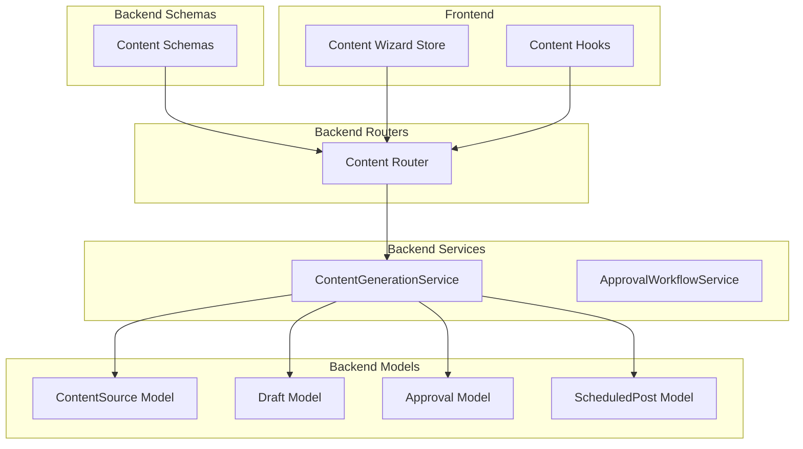
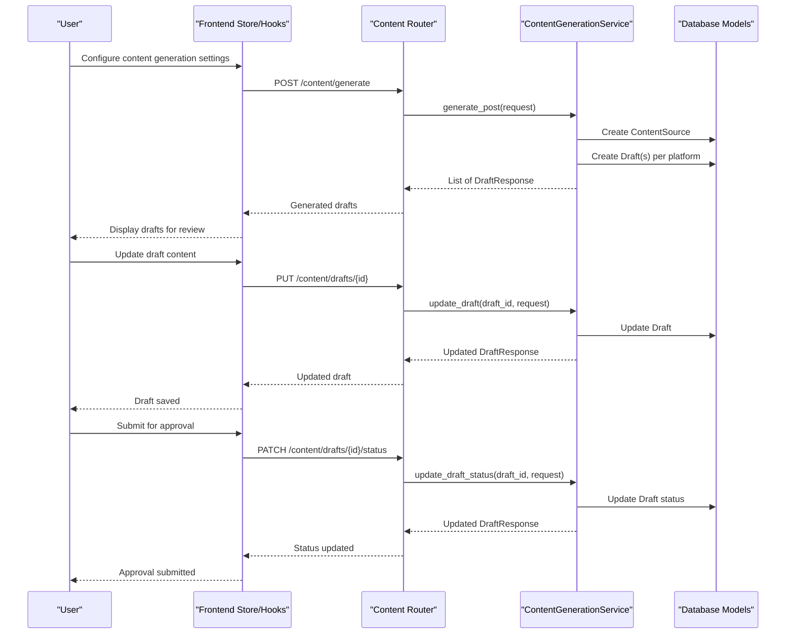
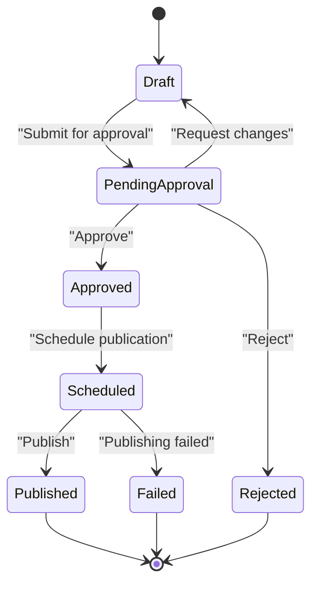
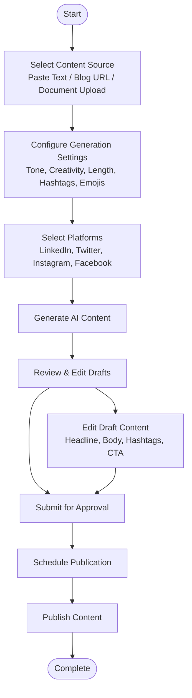
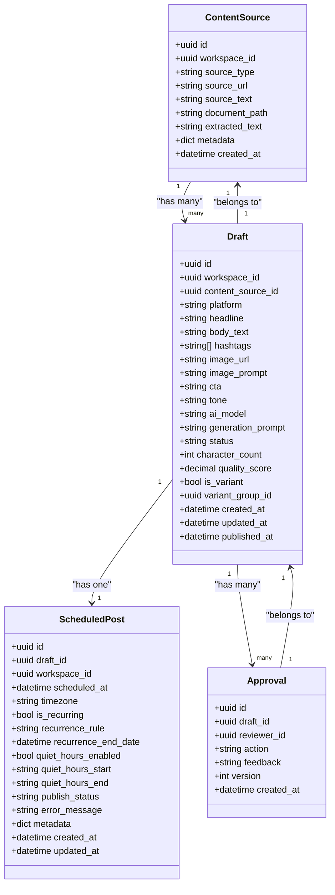

# Content Management Models

<cite>
**Referenced Files in This Document**
- [content.py](file://backend/app/models/content.py)
- [draft.py](file://backend/app/models/draft.py)
- [approval.py](file://backend/app/models/approval.py)
- [scheduled_post.py](file://backend/app/models/scheduled_post.py)
- [constants.py](file://backend/app/core/constants.py)
- [content.py](file://backend/app/schemas/content.py)
- [content.py](file://backend/app/routers/content.py)
- [content_generation_service.py](file://backend/app/services/content_generation_service.py)
- [content_store.ts](file://frontend/src/stores/content-store.ts)
- [use-content.ts](file://frontend/src/hooks/use-content.ts)
</cite>

## Table of Contents
1. [Introduction](#introduction)
2. [Project Structure](#project-structure)
3. [Core Components](#core-components)
4. [Architecture Overview](#architecture-overview)
5. [Detailed Component Analysis](#detailed-component-analysis)
6. [Dependency Analysis](#dependency-analysis)
7. [Performance Considerations](#performance-considerations)
8. [Troubleshooting Guide](#troubleshooting-guide)
9. [Conclusion](#conclusion)

## Introduction
This document provides comprehensive data model documentation for Socialium's content management system, focusing on the Content and Draft models. It explains the structure, relationships, lifecycle management, and business logic constraints for content creation, approval workflows, and platform-specific content variations. The documentation covers field definitions, validation rules, state transitions, and practical examples of content creation workflows.

## Project Structure
The content management system spans backend models, schemas, services, and frontend components:

- Backend models define the database schema for Content, Draft, Approval, and Scheduled Post entities.
- Schemas define request/response validation and serialization for content operations.
- Services orchestrate content generation, approval workflows, and lifecycle transitions.
- Frontend stores and hooks manage user interactions and state during content creation.

**Diagram sources**
- [content.py](file://backend/app/models/content.py#L14-L42)
- [draft.py](file://backend/app/models/draft.py#L15-L71)
- [approval.py](file://backend/app/models/approval.py#L14-L69)
- [scheduled_post.py](file://backend/app/models/scheduled_post.py#L13-L56)
- [content_generation_service.py](file://backend/app/services/content_generation_service.py#L13-L98)
- [content.py](file://backend/app/schemas/content.py#L12-L82)
- [content.py](file://backend/app/routers/content.py#L1-L94)
- [content_store.ts](file://frontend/src/stores/content-store.ts#L1-L62)
- [use-content.ts](file://frontend/src/hooks/use-content.ts#L1-L30)

**Section sources**
- [content.py](file://backend/app/models/content.py#L1-L42)
- [draft.py](file://backend/app/models/draft.py#L1-L71)
- [approval.py](file://backend/app/models/approval.py#L1-L69)
- [scheduled_post.py](file://backend/app/models/scheduled_post.py#L1-L56)
- [constants.py](file://backend/app/core/constants.py#L1-L85)
- [content.py](file://backend/app/schemas/content.py#L1-L82)
- [content.py](file://backend/app/routers/content.py#L1-L94)
- [content_generation_service.py](file://backend/app/services/content_generation_service.py#L1-L98)
- [content_store.ts](file://frontend/src/stores/content-store.ts#L1-L62)
- [use-content.ts](file://frontend/src/hooks/use-content.ts#L1-L30)

## Core Components
This section documents the primary data models and their relationships, focusing on Content and Draft entities.

### ContentSource Model
The ContentSource model represents source materials for content generation. It captures the origin of content (URL, pasted text, or uploaded document), extracted text, and associated metadata.

Key fields:
- id: Unique identifier for the content source
- workspace_id: Links the source to a workspace
- source_type: Enumerated type indicating the source kind
- source_url: URL of the source content (optional)
- source_text: Pasted text content (optional)
- document_path: Path to uploaded document (optional)
- extracted_text: Extracted text content used for generation
- metadata: JSONB metadata for the source
- created_at: Timestamp of creation

Relationships:
- Has many Drafts via content_source relationship

Validation and constraints:
- Foreign key constraint to workspaces with cascade deletion
- Enumerated source_type values defined in constants

**Section sources**
- [content.py](file://backend/app/models/content.py#L14-L42)
- [constants.py](file://backend/app/core/constants.py#L56-L61)

### Draft Model
The Draft model represents generated content drafts for specific platforms. It includes platform-specific formatting, publication status, and metadata.

Key fields:
- id: Unique identifier for the draft
- workspace_id: Links the draft to a workspace
- content_source_id: Optional foreign key to ContentSource
- platform: Enumerated platform (LinkedIn, Twitter, Instagram, Facebook)
- headline: Headline text (optional, max 500 characters)
- body_text: Main content body (required)
- hashtags: Array of hashtag strings (default empty)
- image_url: URL of generated image (optional)
- image_prompt: Prompt used to generate the image (optional)
- cta: Call-to-action text (optional, max 255 characters)
- tone: Enumerated content tone preset
- ai_model: Identifier of the AI model used for generation (optional)
- generation_prompt: Original prompt used for generation (optional)
- status: Enumerated lifecycle status (draft, pending_approval, approved, rejected, scheduled, published, failed)
- character_count: Character count metric (integer)
- quality_score: Quality score from AI optimization (numeric)
- is_variant: Indicates if the draft is an A/B variant
- variant_group_id: Group identifier for related variants
- created_at: Timestamp of creation
- updated_at: Timestamp of last update
- published_at: Timestamp when published (optional)

Relationships:
- Belongs to ContentSource (optional)
- Has many Approvals via approvals relationship
- Has one ScheduledPost via scheduled_post relationship

Validation and constraints:
- Foreign keys to workspaces and content_sources with appropriate deletion behaviors
- Enumerated fields for platform, tone, and status
- Array of strings for hashtags
- Numeric precision for quality_score

**Section sources**
- [draft.py](file://backend/app/models/draft.py#L15-L71)
- [constants.py](file://backend/app/core/constants.py#L6-L22)
- [constants.py](file://backend/app/core/constants.py#L46-L54)

### Approval Model
The Approval model tracks human-in-the-loop review decisions for drafts.

Key fields:
- id: Unique identifier for the approval record
- draft_id: Foreign key to Draft
- reviewer_id: Optional foreign key to user who reviewed
- action: Enumerated action (approve, reject, request_changes)
- feedback: Review feedback text (optional)
- version: Version number for approval history
- created_at: Timestamp of creation

Relationships:
- Belongs to Draft
- Has many ApprovalComments via comments relationship

**Section sources**
- [approval.py](file://backend/app/models/approval.py#L14-L69)
- [constants.py](file://backend/app/core/constants.py#L25-L29)

### ScheduledPost Model
The ScheduledPost model manages scheduled publishing of drafts.

Key fields:
- id: Unique identifier for the scheduled post
- draft_id: Foreign key to Draft (unique constraint)
- workspace_id: Links to workspace
- scheduled_at: Target publish time
- timezone: Timezone string (default UTC)
- is_recurring: Recurrence flag
- recurrence_rule: Recurrence pattern (daily, weekly, monthly)
- recurrence_end_date: End date for recurring schedules
- quiet_hours_enabled: Flag to enable quiet hours
- quiet_hours_start: Quiet hours start time (HH:MM)
- quiet_hours_end: Quiet hours end time (HH:MM)
- publish_status: Status of publishing (pending, published, failed, cancelled)
- error_message: Error message if publishing failed
- metadata: JSONB metadata for scheduling
- created_at: Timestamp of creation
- updated_at: Timestamp of last update

Relationships:
- Belongs to Draft

**Section sources**
- [scheduled_post.py](file://backend/app/models/scheduled_post.py#L13-L56)

## Architecture Overview
The content management architecture integrates frontend wizard state, backend routing, service orchestration, and database models. The system supports AI-driven content generation, human approval workflows, and scheduled publishing.

**Diagram sources**
- [content.py](file://backend/app/routers/content.py#L20-L94)
- [content_generation_service.py](file://backend/app/services/content_generation_service.py#L23-L87)
- [content.py](file://backend/app/schemas/content.py#L12-L82)
- [content_store.ts](file://frontend/src/stores/content-store.ts#L1-L62)
- [use-content.ts](file://frontend/src/hooks/use-content.ts#L1-L30)

## Detailed Component Analysis

### Content Lifecycle Management
The system implements a structured content lifecycle with explicit status transitions managed through the Draft model and approval workflows.

**Diagram sources**
- [constants.py](file://backend/app/core/constants.py#L14-L22)
- [draft.py](file://backend/app/models/draft.py#L43-L47)
- [approval.py](file://backend/app/models/approval.py#L28-L30)

Lifecycle states and transitions:
- Draft: Initial state for generated content
- PendingApproval: Awaiting human review
- Approved: Ready for scheduling
- Rejected: Returned for revision or archived
- Scheduled: Marked for future publication
- Published: Successfully posted
- Failed: Publishing encountered errors

Approval workflow actions:
- Approve: Moves content to approved state
- Reject: Returns content to rejected state
- RequestChanges: Returns content to draft with feedback

**Section sources**
- [constants.py](file://backend/app/core/constants.py#L14-L30)
- [draft.py](file://backend/app/models/draft.py#L43-L47)
- [approval.py](file://backend/app/models/approval.py#L28-L32)

### Platform-Specific Content Variations
The system supports platform-specific content generation with tailored constraints and formatting.

Platform characteristics:
- Twitter: Max 280 characters, up to 4 images, up to 5 hashtags
- LinkedIn: Max 3000 characters, up to 20 images, up to 10 hashtags
- Instagram: Max 2200 characters, up to 10 images, up to 30 hashtags
- Facebook: Max 63206 characters, up to 10 images, up to 30 hashtags

Platform-specific fields in Draft:
- headline: Platform-optimized headline (max 500 characters)
- body_text: Platform-optimized body text
- hashtags: Platform-specific hashtag limits
- image_url/image_prompt: Image generation support
- cta: Call-to-action tailored per platform

AI model options:
- GPT-4 Turbo, GPT-4o (OpenAI)
- Claude 3 Opus, Claude 3 Sonnet (Anthropic)

**Section sources**
- [constants.py](file://backend/app/core/constants.py#L64-L84)
- [draft.py](file://backend/app/models/draft.py#L29-L42)

### Content Creation Workflows
The frontend content wizard guides users through multi-step content creation:

**Diagram sources**
- [content_store.ts](file://frontend/src/stores/content-store.ts#L5-L28)
- [use-content.ts](file://frontend/src/hooks/use-content.ts#L7-L21)

Workflow steps:
1. Content Source Selection: Users choose between paste, URL, or document upload
2. Generation Settings: Configure tone, creativity, length, and platform preferences
3. Platform Selection: Choose target platforms for content distribution
4. AI Generation: System generates platform-optimized content drafts
5. Review and Editing: Human editors refine AI-generated content
6. Approval Workflow: Content moves through approval states
7. Scheduling: Approved content is scheduled for publication
8. Publishing: Content is posted to target platforms

**Section sources**
- [content_store.ts](file://frontend/src/stores/content-store.ts#L30-L61)
- [use-content.ts](file://frontend/src/hooks/use-content.ts#L15-L21)

### Validation Rules and Business Logic Constraints
The system enforces validation rules at both schema and model levels:

Schema-level validation (Pydantic):
- ContentGenerateRequest: Minimum 10 characters, maximum 50000 characters for source_text
- ContentGenerateRequest: At least one platform selection required
- ContentVariantRequest: Variant count between 1 and 5
- DraftUpdateRequest: Optional updates for headline, body_text, hashtags, cta, tone

Model-level constraints (SQLAlchemy):
- Foreign key relationships with appropriate deletion behaviors
- Enumerated fields for platform, status, tone, and approval actions
- Array fields for hashtags
- Numeric precision for quality_score
- Timestamp fields for audit trails

Business logic constraints:
- ContentSource extraction: Non-empty extracted_text field
- Draft status transitions: Controlled through approval workflow
- Platform limits: Enforced by generation service and validation
- Workspace scoping: All entities linked to workspace_id

**Section sources**
- [content.py](file://backend/app/schemas/content.py#L12-L82)
- [content.py](file://backend/app/models/content.py#L25-L32)
- [draft.py](file://backend/app/models/draft.py#L29-L62)
- [constants.py](file://backend/app/core/constants.py#L64-L84)

## Dependency Analysis
The content management system exhibits clear separation of concerns with well-defined dependencies:

**Diagram sources**
- [content.py](file://backend/app/models/content.py#L14-L42)
- [draft.py](file://backend/app/models/draft.py#L15-L71)
- [approval.py](file://backend/app/models/approval.py#L14-L69)
- [scheduled_post.py](file://backend/app/models/scheduled_post.py#L13-L56)

Dependency relationships:
- ContentSource depends on Base and SourceType enumeration
- Draft depends on Base, Platform, ContentStatus, ContentTone enumerations
- Approval depends on Base and ApprovalAction enumeration
- ScheduledPost depends on Base
- All models depend on database Base class

**Section sources**
- [content.py](file://backend/app/models/content.py#L1-L42)
- [draft.py](file://backend/app/models/draft.py#L1-L71)
- [approval.py](file://backend/app/models/approval.py#L1-L69)
- [scheduled_post.py](file://backend/app/models/scheduled_post.py#L1-L56)
- [constants.py](file://backend/app/core/constants.py#L1-L85)

## Performance Considerations
The content management system incorporates several performance considerations:

- Database indexing: UUID primary keys and foreign keys should be indexed for optimal query performance
- Relationship loading: Selectin loading strategy used for related collections to minimize N+1 queries
- JSONB fields: Efficient storage for flexible metadata and scheduling configurations
- Asynchronous operations: SQLAlchemy async session usage for concurrent operations
- Pagination: Built-in pagination support for draft listings to handle large datasets
- Enumerations: Database enums reduce storage overhead and improve query performance

## Troubleshooting Guide
Common issues and resolutions in the content management system:

### Content Generation Issues
- Symptom: Generation requests fail with validation errors
- Resolution: Verify source_text length constraints and platform selections
- Related fields: source_text min/max length, platforms list requirement

### Approval Workflow Problems
- Symptom: Approval actions not transitioning draft status
- Resolution: Ensure draft is in pending_approval state before processing actions
- Related fields: status field, approval action validation

### Scheduling Failures
- Symptom: Scheduled posts not publishing
- Resolution: Check scheduled_at timezone and recurrence settings
- Related fields: scheduled_at, timezone, recurrence_rule, publish_status

### Frontend State Management
- Symptom: Content wizard not progressing through steps
- Resolution: Verify content store state updates and form validation
- Related components: content-store.ts, use-content.ts

**Section sources**
- [content.py](file://backend/app/schemas/content.py#L12-L82)
- [draft.py](file://backend/app/models/draft.py#L43-L62)
- [scheduled_post.py](file://backend/app/models/scheduled_post.py#L27-L49)
- [content_store.ts](file://frontend/src/stores/content-store.ts#L44-L61)
- [use-content.ts](file://frontend/src/hooks/use-content.ts#L7-L29)

## Conclusion
Socialium's content management system provides a robust foundation for AI-driven content creation with comprehensive approval workflows and platform-specific optimizations. The system balances flexibility with strong validation, enabling teams to efficiently create, review, schedule, and publish content across multiple social media platforms. The modular architecture supports future enhancements while maintaining clear separation of concerns between frontend state management, backend services, and database models.