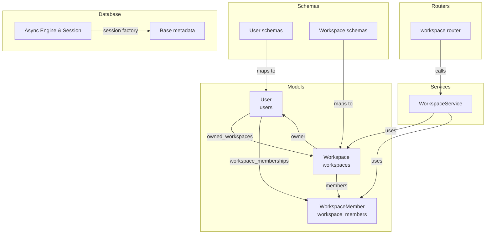
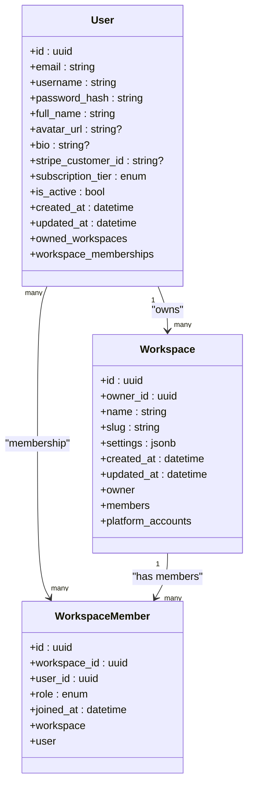
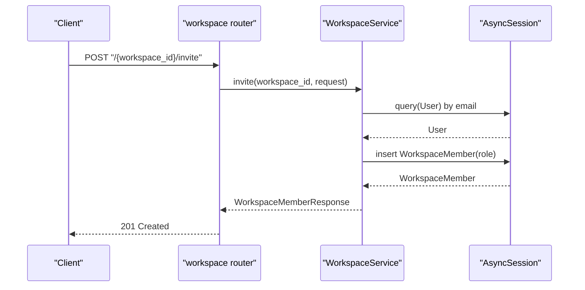
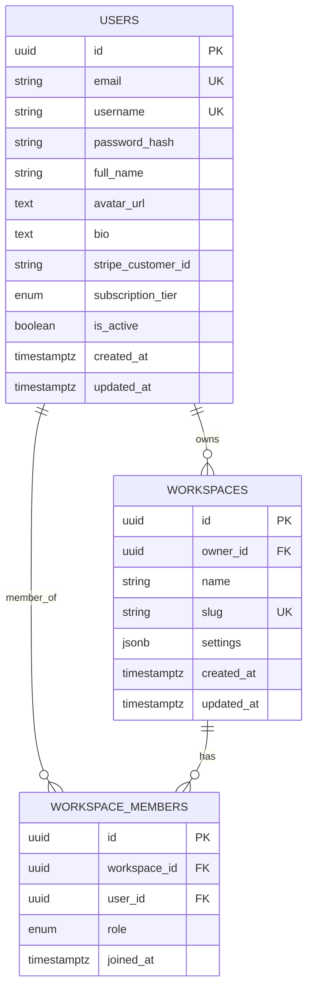
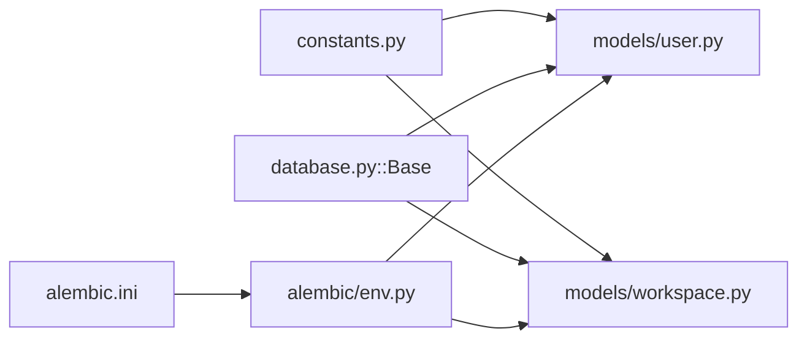

# Core Models

<cite>
**Referenced Files in This Document**
- [user.py](file://backend/app/models/user.py)
- [workspace.py](file://backend/app/models/workspace.py)
- [constants.py](file://backend/app/core/constants.py)
- [database.py](file://backend/app/database.py)
- [workspace.py](file://backend/app/schemas/workspace.py)
- [auth.py](file://backend/app/schemas/auth.py)
- [workspace.py](file://backend/app/routers/workspace.py)
- [workspace_service.py](file://backend/app/services/workspace_service.py)
- [user_repository.py](file://backend/app/repositories/user_repository.py)
- [env.py](file://backend/alembic/env.py)
- [alembic.ini](file://backend/alembic.ini)
</cite>

## Table of Contents
1. [Introduction](#introduction)
2. [Project Structure](#project-structure)
3. [Core Components](#core-components)
4. [Architecture Overview](#architecture-overview)
5. [Detailed Component Analysis](#detailed-component-analysis)
6. [Dependency Analysis](#dependency-analysis)
7. [Performance Considerations](#performance-considerations)
8. [Troubleshooting Guide](#troubleshooting-guide)
9. [Conclusion](#conclusion)
10. [Appendices](#appendices)

## Introduction
This document provides comprehensive data model documentation for Socialium’s core entities: User and Workspace. It details field definitions, data types, constraints, indexes, relationships, and business logic. It also explains the many-to-many association between Users and Workspaces via WorkspaceMember, along with referential integrity, cascading operations, and typical data access patterns.

## Project Structure
The data models are defined in the backend under the models package and integrated with schemas, services, routers, and Alembic migrations. The database base class and async engine are configured centrally.

**Diagram sources**
- [user.py](file://backend/app/models/user.py#L14-L47)
- [workspace.py](file://backend/app/models/workspace.py#L14-L72)
- [workspace.py](file://backend/app/schemas/workspace.py#L9-L56)
- [auth.py](file://backend/app/schemas/auth.py#L9-L63)
- [workspace_service.py](file://backend/app/services/workspace_service.py#L12-L58)
- [workspace.py](file://backend/app/routers/workspace.py#L1-L81)
- [database.py](file://backend/app/database.py#L12-L42)
- [env.py](file://backend/alembic/env.py#L10-L22)

**Section sources**
- [user.py](file://backend/app/models/user.py#L1-L48)
- [workspace.py](file://backend/app/models/workspace.py#L1-L73)
- [database.py](file://backend/app/database.py#L1-L43)
- [env.py](file://backend/alembic/env.py#L1-L65)

## Core Components
This section documents the User and Workspace models, their fields, constraints, indexes, and relationships.

### User Model
- Table: users
- Purpose: Stores user account information and subscription tier.

Fields and constraints:
- id: UUID, primary key, default generated
- email: String(255), unique, not null, indexed
- username: String(50), unique, not null, indexed
- password_hash: String(255), not null
- full_name: String(100), not null
- avatar_url: Text, nullable
- bio: Text, nullable
- stripe_customer_id: String(255), nullable
- subscription_tier: ENUM(SubscriptionTier), default free, server default "free"
- is_active: Boolean, default true, server default "true"
- created_at: DateTime(timezone), server default now
- updated_at: DateTime(timezone), server default now, on update now

Indexes:
- Unique index on email
- Unique index on username
- Index on email for fast lookup
- Index on username for fast lookup

Relationships:
- owned_workspaces: One-to-many to Workspace via owner relationship
- workspace_memberships: One-to-many to WorkspaceMember via user relationship

Constraints and defaults:
- Subscription tier constrained to predefined enum values
- Active flag defaults to true
- Timestamps auto-populated by server defaults and on updates

Validation rules (application-level):
- Username length and allowed characters enforced by Pydantic schema
- Password minimum length enforced by Pydantic schema
- Full name length enforced by Pydantic schema

**Section sources**
- [user.py](file://backend/app/models/user.py#L14-L47)
- [constants.py](file://backend/app/core/constants.py#L32-L37)
- [auth.py](file://backend/app/schemas/auth.py#L9-L16)

### Workspace Model
- Table: workspaces
- Purpose: Represents an organizational unit for teams.

Fields and constraints:
- id: UUID, primary key, default generated
- owner_id: UUID, foreign key to users.id with cascade delete, not null
- name: String(100), not null
- slug: String(100), unique, not null, indexed
- settings: JSONB(dict), default empty object, server default "{}"
- created_at: DateTime(timezone), server default now
- updated_at: DateTime(timezone), server default now, on update now

Indexes:
- Unique index on slug
- Index on slug for fast lookup

Relationships:
- owner: Many-to-one to User via owner relationship
- members: One-to-many to WorkspaceMember via workspace relationship
- platform_accounts: One-to-many to PlatformAccount via workspace relationship

Constraints and defaults:
- Cascade delete on owner_id ensures referential integrity
- Settings stored as JSONB for flexible configuration

**Section sources**
- [workspace.py](file://backend/app/models/workspace.py#L14-L41)
- [constants.py](file://backend/app/core/constants.py#L39-L43)

### WorkspaceMember Association
- Table: workspace_members
- Purpose: Manages many-to-many relationship between Users and Workspaces with roles.

Fields and constraints:
- id: UUID, primary key, default generated
- workspace_id: UUID, foreign key to workspaces.id with cascade delete, not null
- user_id: UUID, foreign key to users.id with cascade delete, not null
- role: ENUM(WorkspaceRole), default editor, server default "editor"
- joined_at: DateTime(timezone), server default now

Indexes:
- Composite index implied by foreign keys (no explicit declaration shown)

Relationships:
- workspace: Many-to-one to Workspace via members relationship
- user: Many-to-one to User via memberships relationship

Constraints and defaults:
- Cascade delete on both foreign keys maintains referential integrity
- Role constrained to predefined enum values

**Section sources**
- [workspace.py](file://backend/app/models/workspace.py#L44-L72)
- [constants.py](file://backend/app/core/constants.py#L39-L43)

## Architecture Overview
The data models integrate with schemas, services, and routers to form a cohesive data access layer. The async SQLAlchemy engine and session factory manage transactions and persistence.

**Diagram sources**
- [user.py](file://backend/app/models/user.py#L14-L47)
- [workspace.py](file://backend/app/models/workspace.py#L14-L72)

## Detailed Component Analysis

### User Model Fields and Constraints
- Identity: id (UUID, PK)
- Authentication: email (unique, indexed), username (unique, indexed), password_hash
- Profile: full_name, avatar_url (Text), bio (Text)
- Billing: stripe_customer_id (nullable)
- Subscription: subscription_tier (ENUM, default free)
- Lifecycle: is_active (default true), timestamps managed by server defaults

Validation and normalization:
- Application-level validation via Pydantic schemas for username, password, and full_name
- Database-level enforcement via unique and not-null constraints

**Section sources**
- [user.py](file://backend/app/models/user.py#L19-L40)
- [auth.py](file://backend/app/schemas/auth.py#L9-L16)

### Workspace Model Fields and Constraints
- Identity: id (UUID, PK)
- Ownership: owner_id (FK users.id, cascade delete)
- Metadata: name, slug (unique, indexed)
- Configuration: settings (JSONB, default empty)
- Lifecycle: timestamps managed by server defaults

Business logic:
- Slug uniqueness ensures URL-friendly identifiers
- Cascade delete on owner_id enforces cleanup when users are removed

**Section sources**
- [workspace.py](file://backend/app/models/workspace.py#L19-L33)

### WorkspaceMember Association
- Composite identity: (workspace_id, user_id) via FKs
- Role: role (ENUM, default editor)
- Membership: joined_at timestamp

Access patterns:
- Many-to-many via relationships
- Role-based permissions enforced at service level

**Section sources**
- [workspace.py](file://backend/app/models/workspace.py#L49-L69)
- [constants.py](file://backend/app/core/constants.py#L39-L43)

### Data Access Patterns and Cascading Operations
- Creation: Users and Workspaces are created with UUID defaults; WorkspaceMember records link users to workspaces
- Retrieval: Relationships are eagerly loaded via selectin to minimize N+1 queries
- Updates: Timestamps updated via server defaults and onupdate
- Deletion: Cascade deletes propagate from User to Workspace and WorkspaceMember, ensuring referential integrity

**Diagram sources**
- [workspace.py](file://backend/app/routers/workspace.py#L61-L69)
- [workspace_service.py](file://backend/app/services/workspace_service.py#L43-L54)

**Section sources**
- [workspace.py](file://backend/app/models/workspace.py#L22-L24)
- [workspace.py](file://backend/app/models/workspace.py#L52-L57)
- [user.py](file://backend/app/models/user.py#L42-L44)

### Referential Integrity and Indexes
- Foreign keys:
  - Workspace.owner_id → User.id (cascade delete)
  - WorkspaceMember.workspace_id → Workspace.id (cascade delete)
  - WorkspaceMember.user_id → User.id (cascade delete)
- Indexes:
  - User.email (unique, indexed)
  - User.username (unique, indexed)
  - Workspace.slug (unique, indexed)

**Diagram sources**
- [user.py](file://backend/app/models/user.py#L19-L40)
- [workspace.py](file://backend/app/models/workspace.py#L19-L33)
- [workspace.py](file://backend/app/models/workspace.py#L49-L69)

**Section sources**
- [user.py](file://backend/app/models/user.py#L22-L23)
- [user.py](file://backend/app/models/user.py#L25-L26)
- [workspace.py](file://backend/app/models/workspace.py#L26-L26)

## Dependency Analysis
The models depend on the shared Base class and async SQLAlchemy engine. Alembic scans all models for schema generation.

**Diagram sources**
- [constants.py](file://backend/app/core/constants.py#L32-L43)
- [user.py](file://backend/app/models/user.py#L10-L11)
- [workspace.py](file://backend/app/models/workspace.py#L10-L11)
- [database.py](file://backend/app/database.py#L27-L29)
- [env.py](file://backend/alembic/env.py#L10-L12)
- [alembic.ini](file://backend/alembic.ini#L6)

**Section sources**
- [env.py](file://backend/alembic/env.py#L10-L22)
- [alembic.ini](file://backend/alembic.ini#L1-L40)

## Performance Considerations
- Eager loading: Relationships use selectin to reduce query count during joins
- Indexes: Unique and regular indexes on frequently queried columns (email, username, slug)
- JSONB settings: Flexible storage with potential for large documents; consider partitioning or normalization if growth requires
- Cascade deletes: Prevent orphaned records but may trigger cascades on large datasets; monitor during bulk deletions

## Troubleshooting Guide
Common issues and resolutions:
- Duplicate email or username: Enforced by unique constraints; handle IntegrityError and return appropriate validation messages
- Invalid subscription tier: Ensure ENUM value matches predefined set
- Invalid workspace role: Ensure role belongs to WorkspaceRole enum
- Missing workspace slug: Slug must be unique and match pattern; validate before creation
- Cascade deletion behavior: Removing a User or Workspace removes associated WorkspaceMember entries automatically

Operational checks:
- Verify async engine configuration and session lifecycle
- Confirm Alembic metadata includes all models for schema synchronization

**Section sources**
- [user.py](file://backend/app/models/user.py#L22-L23)
- [workspace.py](file://backend/app/models/workspace.py#L26-L26)
- [constants.py](file://backend/app/core/constants.py#L32-L43)
- [database.py](file://backend/app/database.py#L12-L24)
- [env.py](file://backend/alembic/env.py#L10-L22)

## Conclusion
The User and Workspace models define a robust foundation for Socialium’s team collaboration features. The many-to-many association via WorkspaceMember enables flexible role-based access, while cascade deletes and indexes maintain referential integrity and performance. Together with schemas and services, the models support scalable data access patterns and clear business logic boundaries.

## Appendices

### Example Queries and Relationships
- Retrieve a user with owned workspaces and memberships:
  - Load User with eager relationships to Workspace and WorkspaceMember
- List workspace members with user details:
  - Join WorkspaceMember with User to fetch profile fields
- Create workspace and add owner as member:
  - Insert Workspace, then insert WorkspaceMember with role owner
- Invite user to workspace:
  - Lookup User by email, verify not member, insert WorkspaceMember with requested role

Note: Implementation details are provided by services and routers; models define the schema and relationships.

**Section sources**
- [workspace.py](file://backend/app/routers/workspace.py#L51-L80)
- [workspace_service.py](file://backend/app/services/workspace_service.py#L18-L58)
- [workspace.py](file://backend/app/schemas/workspace.py#L9-L56)
- [auth.py](file://backend/app/schemas/auth.py#L9-L63)