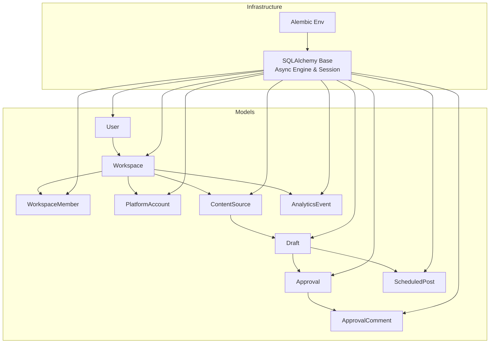
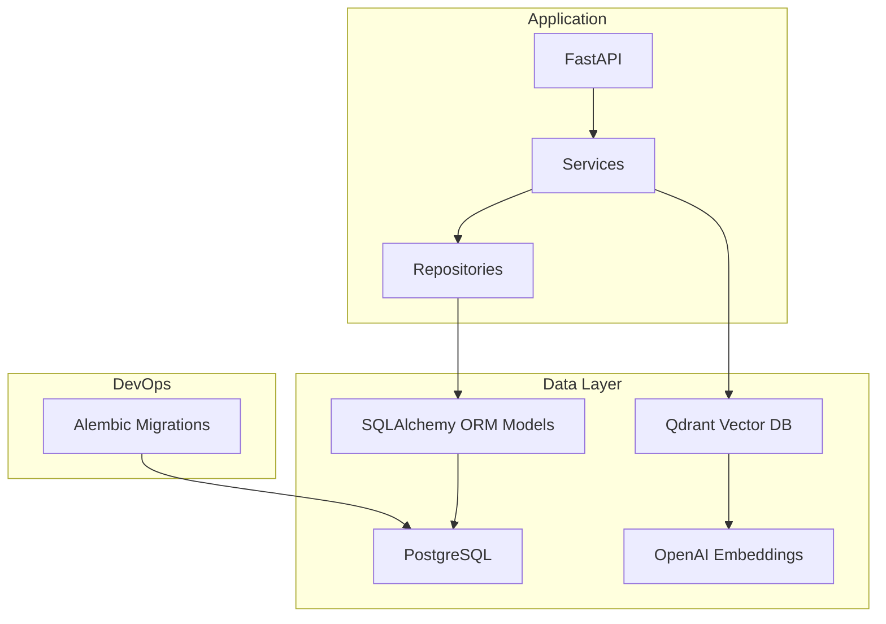
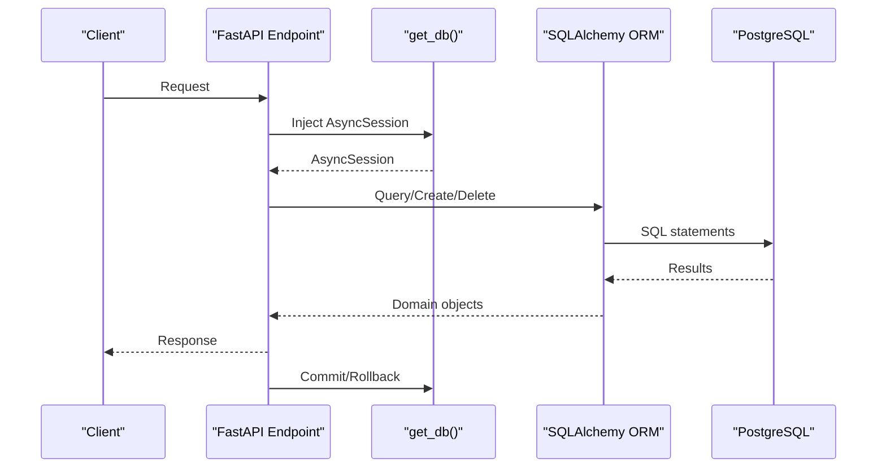
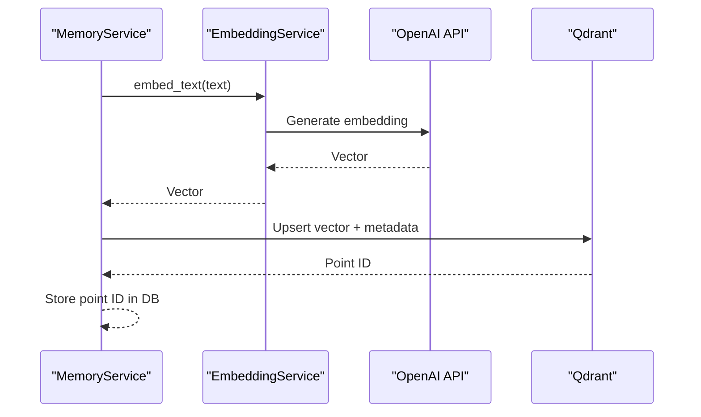
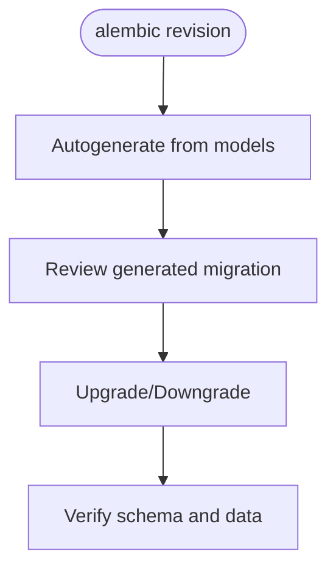
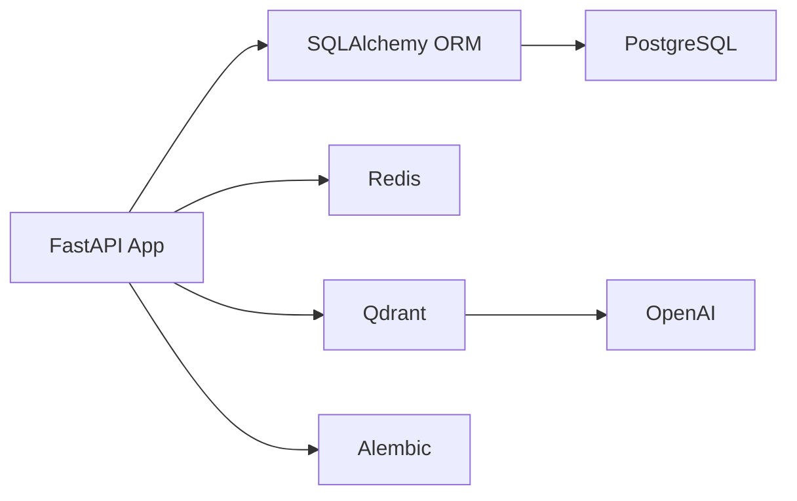

# Database Design

<cite>
**Referenced Files in This Document**
- [backend/app/models/user.py](file://backend/app/models/user.py)
- [backend/app/models/workspace.py](file://backend/app/models/workspace.py)
- [backend/app/models/content.py](file://backend/app/models/content.py)
- [backend/app/models/draft.py](file://backend/app/models/draft.py)
- [backend/app/models/approval.py](file://backend/app/models/approval.py)
- [backend/app/models/platform_account.py](file://backend/app/models/platform_account.py)
- [backend/app/models/analytics.py](file://backend/app/models/analytics.py)
- [backend/app/models/scheduled_post.py](file://backend/app/models/scheduled_post.py)
- [backend/app/models/__init__.py](file://backend/app/models/__init__.py)
- [backend/app/database.py](file://backend/app/database.py)
- [backend/app/core/constants.py](file://backend/app/core/constants.py)
- [backend/alembic/env.py](file://backend/alembic/env.py)
- [backend/pyproject.toml](file://backend/pyproject.toml)
</cite>

## Table of Contents
1. [Introduction](#introduction)
2. [Project Structure](#project-structure)
3. [Core Components](#core-components)
4. [Architecture Overview](#architecture-overview)
5. [Detailed Component Analysis](#detailed-component-analysis)
6. [Dependency Analysis](#dependency-analysis)
7. [Performance Considerations](#performance-considerations)
8. [Troubleshooting Guide](#troubleshooting-guide)
9. [Conclusion](#conclusion)
10. [Appendices](#appendices)

## Introduction
This document describes Socialium’s database design and data model. It covers entity definitions, relationships, constraints, indexes, and referential integrity enforced by PostgreSQL and SQLAlchemy. It also documents data access patterns via SQLAlchemy ORM, vector embedding storage with Qdrant, and migration management with Alembic. Security and privacy considerations are addressed alongside operational concerns such as data lifecycle and retention.

## Project Structure
The database layer is organized around SQLAlchemy declarative models grouped under a shared base class. Models are registered for Alembic autogenerate and imported into the Alembic environment. Asynchronous database sessions are configured for FastAPI integration.



**Diagram sources**
- [backend/app/models/user.py](file://backend/app/models/user.py#L14-L47)
- [backend/app/models/workspace.py](file://backend/app/models/workspace.py#L14-L72)
- [backend/app/models/content.py](file://backend/app/models/content.py#L14-L41)
- [backend/app/models/draft.py](file://backend/app/models/draft.py#L15-L70)
- [backend/app/models/approval.py](file://backend/app/models/approval.py#L14-L42)
- [backend/app/models/platform_account.py](file://backend/app/models/platform_account.py#L14-L48)
- [backend/app/models/analytics.py](file://backend/app/models/analytics.py#L14-L48)
- [backend/app/models/scheduled_post.py](file://backend/app/models/scheduled_post.py#L13-L55)
- [backend/app/database.py](file://backend/app/database.py#L27-L42)
- [backend/alembic/env.py](file://backend/alembic/env.py#L10-L22)

**Section sources**
- [backend/app/models/__init__.py](file://backend/app/models/__init__.py#L1-L24)
- [backend/app/database.py](file://backend/app/database.py#L1-L43)
- [backend/alembic/env.py](file://backend/alembic/env.py#L1-L65)

## Core Components
This section defines each core entity, including fields, data types, constraints, indexes, and relationships. Enumerations are defined centrally and reused across models.

- User
  - Purpose: Application account holder with subscription and activity tracking.
  - Primary key: id (UUID).
  - Unique fields: email, username.
  - Indexes: email, username.
  - Fields: email, username, password_hash, full_name, avatar_url, bio, stripe_customer_id, subscription_tier (ENUM), is_active, timestamps.
  - Relationships: owned_workspaces (Workspace), workspace_memberships (WorkspaceMember).
  - Constraints: Non-null for identity and credentials; default active; default subscription tier.

- Workspace
  - Purpose: Organizational unit; each belongs to a single User (owner).
  - Primary key: id (UUID).
  - Unique fields: slug.
  - Indexes: slug.
  - Foreign keys: owner_id -> users.id (CASCADE delete).
  - Fields: owner_id, name, slug, settings (JSONB), timestamps.
  - Relationships: owner (User), members (WorkspaceMember), platform_accounts (PlatformAccount).
  - Constraints: Non-null owner_id and name; default empty settings.

- WorkspaceMember
  - Purpose: Links users to workspaces with a role.
  - Primary key: id (UUID).
  - Foreign keys: workspace_id -> workspaces.id (CASCADE delete), user_id -> users.id (CASCADE delete).
  - Fields: workspace_id, user_id, role (ENUM), joined_at.
  - Relationships: workspace (Workspace), user (User).
  - Constraints: Non-null workspace_id, user_id, role; default role editor.

- PlatformAccount
  - Purpose: Connected third-party platform accounts (e.g., LinkedIn, Twitter).
  - Primary key: id (UUID).
  - Foreign keys: workspace_id -> workspaces.id (CASCADE delete).
  - Fields: workspace_id, platform (ENUM), platform_user_id, platform_username, access_token (encrypted), refresh_token (encrypted), token_expires_at, profile_data (JSONB), is_active, connected_at, last_synced_at.
  - Relationships: workspace (Workspace).
  - Constraints: Non-null identifiers and tokens; defaults for booleans and JSONB.

- ContentSource
  - Purpose: Source materials for content generation (URLs, pasted text, uploads).
  - Primary key: id (UUID).
  - Foreign keys: workspace_id -> workspaces.id (CASCADE delete).
  - Fields: workspace_id, source_type (ENUM), source_url, source_text, document_path, extracted_text (non-empty default), metadata (JSONB), created_at.
  - Relationships: drafts (Draft).
  - Constraints: Non-null source_type; default empty metadata; default empty extracted_text.

- Draft
  - Purpose: Generated content drafts scoped to a workspace and optional source.
  - Primary key: id (UUID).
  - Foreign keys: workspace_id -> workspaces.id (CASCADE delete), content_source_id -> content_sources.id (SET NULL).
  - Fields: workspace_id, content_source_id, platform (ENUM), headline, body_text (non-empty), hashtags (ARRAY), image_url, image_prompt, cta, tone (ENUM), ai_model, generation_prompt, status (ENUM), character_count, quality_score (Numeric), is_variant, variant_group_id, timestamps, published_at.
  - Relationships: content_source (ContentSource), approvals (Approval), scheduled_post (ScheduledPost).
  - Constraints: Defaults for booleans and numeric; ENUM constraints; optional variant grouping.

- Approval and ApprovalComment
  - Purpose: Workflow for reviewing drafts; optional reviewer linkage.
  - Primary key: id (UUID).
  - Foreign keys: draft_id -> drafts.id (CASCADE delete), reviewer_id -> users.id (SET NULL), approval_id -> approvals.id (CASCADE delete), author_id -> users.id (SET NULL).
  - Fields: draft_id, reviewer_id, action (ENUM), feedback, version, timestamps; ApprovalComment: content.
  - Relationships: draft (Draft), comments (ApprovalComment).
  - Constraints: Non-null action; SET NULL on user deletion; default version 1.

- AnalyticsEvent
  - Purpose: Track post performance metrics per platform and workspace.
  - Primary key: id (UUID).
  - Foreign keys: workspace_id -> workspaces.id (CASCADE delete), draft_id -> drafts.id (SET NULL).
  - Fields: workspace_id, draft_id, platform (ENUM), event_type, impressions, clicks, likes, shares, comments, engagement_rate, reach, extra_data (JSONB), recorded_at, timestamps.
  - Constraints: Defaults for counts; optional draft linkage; default empty JSONB.

- ScheduledPost
  - Purpose: Publish scheduling with recurrence and quiet hours.
  - Primary key: id (UUID), unique constraint on draft_id.
  - Foreign keys: draft_id -> drafts.id (CASCADE delete), workspace_id -> workspaces.id (CASCADE delete).
  - Fields: draft_id (unique), workspace_id, scheduled_at, timezone, is_recurring, recurrence_rule, recurrence_end_date, quiet_hours_enabled, quiet_hours_start/end, publish_status, error_message, metadata (JSONB), timestamps.
  - Relationships: draft (Draft).
  - Constraints: Non-null schedule; defaults for booleans and status; optional recurrence end date.

**Section sources**
- [backend/app/models/user.py](file://backend/app/models/user.py#L14-L47)
- [backend/app/models/workspace.py](file://backend/app/models/workspace.py#L14-L72)
- [backend/app/models/content.py](file://backend/app/models/content.py#L14-L41)
- [backend/app/models/draft.py](file://backend/app/models/draft.py#L15-L70)
- [backend/app/models/approval.py](file://backend/app/models/approval.py#L14-L68)
- [backend/app/models/platform_account.py](file://backend/app/models/platform_account.py#L14-L48)
- [backend/app/models/analytics.py](file://backend/app/models/analytics.py#L14-L48)
- [backend/app/models/scheduled_post.py](file://backend/app/models/scheduled_post.py#L13-L55)
- [backend/app/core/constants.py](file://backend/app/core/constants.py#L6-L84)

## Architecture Overview
The database architecture centers on asynchronous SQLAlchemy ORM with PostgreSQL. Enums are defined centrally to ensure consistency across models. Alembic manages schema migrations. Vector embeddings are integrated externally via Qdrant and OpenAI.



**Diagram sources**
- [backend/app/database.py](file://backend/app/database.py#L12-L29)
- [backend/alembic/env.py](file://backend/alembic/env.py#L10-L22)
- [backend/pyproject.toml](file://backend/pyproject.toml#L20-L21)

## Detailed Component Analysis

### Entity Relationship Diagram
```mermaid
erDiagram
USERS {
uuid id PK
string email UK
string username UK
string password_hash
string full_name
text avatar_url
text bio
string stripe_customer_id
enum subscription_tier
boolean is_active
timestamptz created_at
timestamptz updated_at
}
WORKSPACES {
uuid id PK
uuid owner_id FK
string name
string slug UK
jsonb settings
timestamptz created_at
timestamptz updated_at
}
WORKSPACE_MEMBERS {
uuid id PK
uuid workspace_id FK
uuid user_id FK
enum role
timestamptz joined_at
}
PLATFORM_ACCOUNTS {
uuid id PK
uuid workspace_id FK
enum platform
string platform_user_id
string platform_username
text access_token
text refresh_token
timestamptz token_expires_at
jsonb profile_data
boolean is_active
timestamptz connected_at
timestamptz last_synced_at
}
CONTENT_SOURCES {
uuid id PK
uuid workspace_id FK
enum source_type
text source_url
text source_text
text document_path
text extracted_text
jsonb metadata
timestamptz created_at
}
DRAFTS {
uuid id PK
uuid workspace_id FK
uuid content_source_id FK
enum platform
string headline
text body_text
string[] hashtags
text image_url
text image_prompt
string cta
enum tone
string ai_model
text generation_prompt
enum status
int character_count
numeric quality_score
boolean is_variant
uuid variant_group_id
timestamptz created_at
timestamptz updated_at
timestamptz published_at
}
APPROVALS {
uuid id PK
uuid draft_id FK
uuid reviewer_id FK
enum action
text feedback
int version
timestamptz created_at
}
APPROVAL_COMMENTS {
uuid id PK
uuid approval_id FK
uuid author_id FK
text content
timestamptz created_at
}
ANALYTICS_EVENTS {
uuid id PK
uuid workspace_id FK
uuid draft_id FK
enum platform
string event_type
int impressions
int clicks
int likes
int shares
int comments
float engagement_rate
int reach
jsonb extra_data
timestamptz recorded_at
timestamptz created_at
}
SCHEDULED_POSTS {
uuid id PK
uuid draft_id FK UK
uuid workspace_id FK
timestamptz scheduled_at
string timezone
boolean is_recurring
string recurrence_rule
timestamptz recurrence_end_date
boolean quiet_hours_enabled
string quiet_hours_start
string quiet_hours_end
string publish_status
text error_message
jsonb metadata
timestamptz created_at
timestamptz updated_at
}
USERS ||--o{ WORKSPACES : "owns"
WORKSPACES ||--o{ WORKSPACE_MEMBERS : "has"
USERS ||--o{ WORKSPACE_MEMBERS : "member_of"
WORKSPACES ||--o{ PLATFORM_ACCOUNTS : "connected_by"
WORKSPACES ||--o{ CONTENT_SOURCES : "sources_for"
CONTENT_SOURCES ||--o{ DRAFTS : "generates"
DRAFTS ||--o{ APPROVALS : "reviewed_in"
APPROVALS ||--o{ APPROVAL_COMMENTS : "commented_on"
WORKSPACES ||--o{ ANALYTICS_EVENTS : "measures"
DRAFTS ||--|| SCHEDULED_POSTS : "scheduled_by"
```

**Diagram sources**
- [backend/app/models/user.py](file://backend/app/models/user.py#L19-L40)
- [backend/app/models/workspace.py](file://backend/app/models/workspace.py#L19-L33)
- [backend/app/models/workspace.py](file://backend/app/models/workspace.py#L49-L65)
- [backend/app/models/platform_account.py](file://backend/app/models/platform_account.py#L19-L39)
- [backend/app/models/content.py](file://backend/app/models/content.py#L19-L35)
- [backend/app/models/draft.py](file://backend/app/models/draft.py#L20-L59)
- [backend/app/models/approval.py](file://backend/app/models/approval.py#L19-L35)
- [backend/app/models/approval.py](file://backend/app/models/approval.py#L50-L62)
- [backend/app/models/analytics.py](file://backend/app/models/analytics.py#L19-L42)
- [backend/app/models/scheduled_post.py](file://backend/app/models/scheduled_post.py#L18-L49)

### Data Access Patterns with SQLAlchemy ORM
- Async engine and session factory are configured with connection pooling and pre-ping enabled.
- A dependency provider yields an AsyncSession, committing on success, rolling back on exceptions, and closing the session in a finally block.
- Models inherit from a shared Base class, enabling declarative mapping and Alembic autogenerate discovery.



**Diagram sources**
- [backend/app/database.py](file://backend/app/database.py#L32-L42)

**Section sources**
- [backend/app/database.py](file://backend/app/database.py#L1-L43)

### Vector Embedding Storage with Qdrant and OpenAI
- Embeddings are generated using OpenAI text-embedding-3-large via an embedding service.
- MemoryService orchestrates storing and retrieving embeddings in Qdrant for semantic search and brand voice maintenance.
- EmbeddingService exposes batch embedding and similarity computation utilities.



**Diagram sources**
- [backend/app/services/memory_service.py](file://backend/app/services/memory_service.py#L8-L39)
- [backend/app/services/embedding_service.py](file://backend/app/services/embedding_service.py#L8-L46)
- [backend/pyproject.toml](file://backend/pyproject.toml#L20-L21)

**Section sources**
- [backend/app/services/memory_service.py](file://backend/app/services/memory_service.py#L1-L40)
- [backend/app/services/embedding_service.py](file://backend/app/services/embedding_service.py#L1-L46)
- [backend/pyproject.toml](file://backend/pyproject.toml#L1-L49)

### Data Validation Rules and Business Logic Constraints
- Enumerations enforce domain constraints (platforms, statuses, roles, tones, actions).
- Foreign keys and ON DELETE behaviors maintain referential integrity:
  - CASCADE deletes when owners/members are removed.
  - SET NULL for reviewers when users are deleted.
  - SET NULL for content_source_id when source is removed.
- JSONB fields store flexible metadata; defaults ensure consistent shapes.
- Array fields (hashtags) support platform-specific constraints via constants.
- Timestamps track creation, updates, and publication events.

**Section sources**
- [backend/app/core/constants.py](file://backend/app/core/constants.py#L6-L84)
- [backend/app/models/workspace.py](file://backend/app/models/workspace.py#L22-L24)
- [backend/app/models/workspace.py](file://backend/app/models/workspace.py#L52-L57)
- [backend/app/models/approval.py](file://backend/app/models/approval.py#L22-L27)
- [backend/app/models/content.py](file://backend/app/models/content.py#L22-L23)
- [backend/app/models/draft.py](file://backend/app/models/draft.py#L26-L28)

### Data Lifecycle and Retention Policies
- Creation and update timestamps are tracked across entities.
- Published content retains historical records via Draft and AnalyticsEvent.
- Scheduled posts encapsulate future-publishing lifecycle with status transitions.
- Retention and archival policies are not explicitly defined in the models; implement at application/service level as needed.

[No sources needed since this section provides general guidance]

### Migration Management with Alembic
- Alembic environment loads all models for autogenerate discovery.
- Async engine is used for online migrations.
- URL is configured from application settings.



**Diagram sources**
- [backend/alembic/env.py](file://backend/alembic/env.py#L10-L22)

**Section sources**
- [backend/alembic/env.py](file://backend/alembic/env.py#L1-L65)

## Dependency Analysis
External dependencies supporting the data layer include:
- SQLAlchemy (asyncio) for ORM and async sessions.
- Alembic for migrations.
- asyncpg for PostgreSQL connectivity.
- redis for caching (usage patterns defined in services).
- qdrant-client for vector storage.
- openai for embeddings.



**Diagram sources**
- [backend/pyproject.toml](file://backend/pyproject.toml#L9-L25)

**Section sources**
- [backend/pyproject.toml](file://backend/pyproject.toml#L1-L49)

## Performance Considerations
- Use indexes on frequently filtered fields (e.g., usernames, slugs).
- Prefer selectin loading for relationships to reduce N+1 queries.
- Batch embedding operations via EmbeddingService to minimize API calls.
- Tune connection pool sizes and pre-ping settings for async sessions.
- Consider partitioning or materialized views for analytics-heavy queries.

[No sources needed since this section provides general guidance]

## Troubleshooting Guide
- Session lifecycle: Ensure exceptions trigger rollback and sessions are closed.
- Enum mismatches: Validate enum values align with constants.
- Foreign key violations: Confirm referential actions (CASCADE/SET NULL) match intended behavior.
- Migration conflicts: Use autogenerate and review carefully; avoid manual schema drift.

**Section sources**
- [backend/app/database.py](file://backend/app/database.py#L32-L42)
- [backend/app/core/constants.py](file://backend/app/core/constants.py#L6-L84)

## Conclusion
Socialium’s database design leverages PostgreSQL with SQLAlchemy ORM for robust, typed modeling and Alembic for migrations. Centralized enums ensure consistency, while external integrations (Qdrant, OpenAI) enable advanced capabilities like semantic search and embeddings. The schema enforces referential integrity and supports scalable data access patterns.

## Appendices

### Appendix A: Enumerations Reference
- Platform: linkedin, twitter, instagram, facebook
- ContentStatus: draft, pending_approval, approved, rejected, scheduled, published, failed
- ApprovalAction: approve, reject, request_changes
- SubscriptionTier: free, pro, business
- WorkspaceRole: owner, editor, viewer
- ContentTone: professional, casual, funny, inspirational, educational, persuasive
- SourceType: blog_url, pasted_text, document_upload

**Section sources**
- [backend/app/core/constants.py](file://backend/app/core/constants.py#L6-L84)