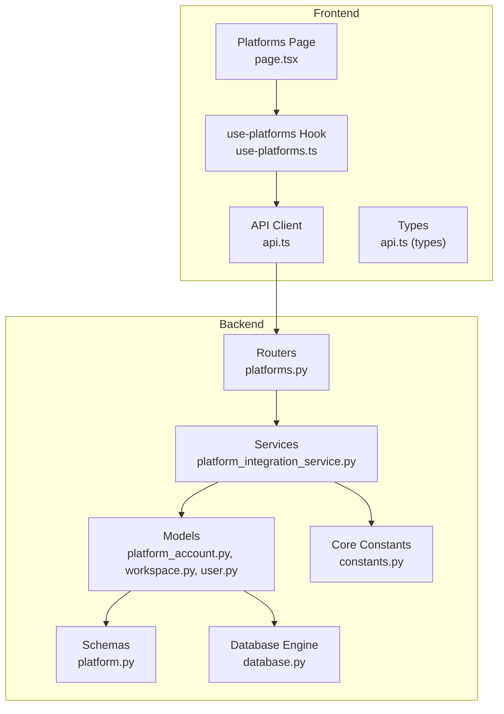
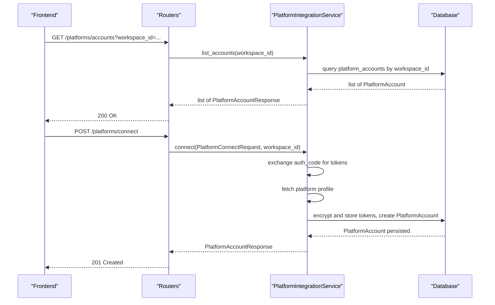
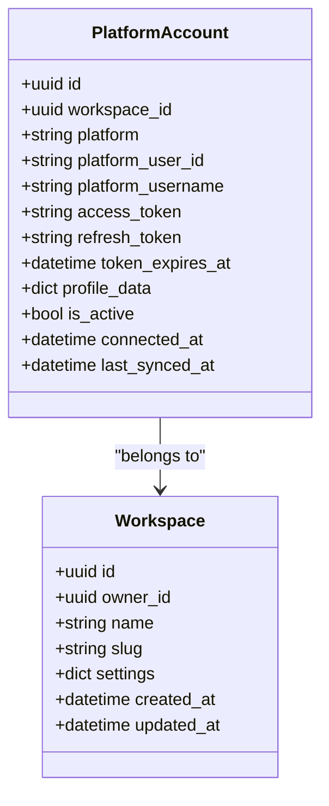
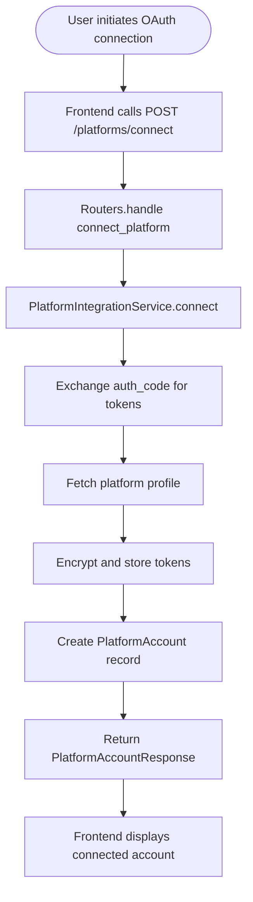
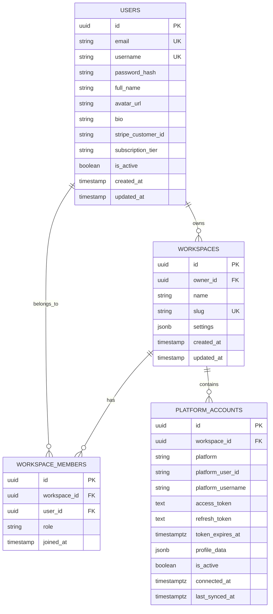
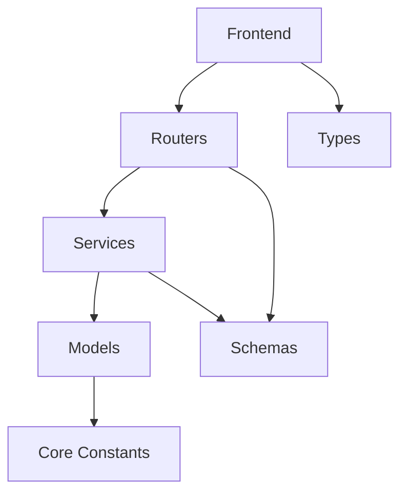

# Platform Integration Models

<cite>
**Referenced Files in This Document**
- [platform_account.py](file://backend/app/models/platform_account.py)
- [constants.py](file://backend/app/core/constants.py)
- [platform.py](file://backend/app/schemas/platform.py)
- [platform_integration_service.py](file://backend/app/services/platform_integration_service.py)
- [platforms.py](file://backend/app/routers/platforms.py)
- [workspace.py](file://backend/app/models/workspace.py)
- [user.py](file://backend/app/models/user.py)
- [database.py](file://backend/app/database.py)
- [page.tsx](file://frontend/src/app/(dashboard)/platforms/page.tsx)
- [use-platforms.ts](file://frontend/src/hooks/use-platforms.ts)
- [api.ts](file://frontend/src/lib/api.ts)
- [api.ts](file://frontend/src/types/api.ts)
</cite>

## Table of Contents
1. [Introduction](#introduction)
2. [Project Structure](#project-structure)
3. [Core Components](#core-components)
4. [Architecture Overview](#architecture-overview)
5. [Detailed Component Analysis](#detailed-component-analysis)
6. [Dependency Analysis](#dependency-analysis)
7. [Performance Considerations](#performance-considerations)
8. [Troubleshooting Guide](#troubleshooting-guide)
9. [Conclusion](#conclusion)

## Introduction
This document provides comprehensive data model documentation for Socialium's platform integration system. It focuses on the PlatformAccount model, platform-specific constants, and the relationships among users, workspaces, and platform accounts. It also covers OAuth credential storage, platform-specific configurations, authentication tokens, supported platform types, constraints, API integration requirements, credential management, token refresh mechanisms, rate limiting, security considerations, and platform-specific data transformations. Finally, it outlines the relationship between users, workspaces, and platform accounts and provides examples of OAuth flow integration and platform-specific content formatting.

## Project Structure
The platform integration system spans backend models, schemas, services, routers, and frontend components:
- Backend models define the persistent data structures for platform accounts, workspaces, and users.
- Backend schemas define request/response contracts for platform integration endpoints.
- Backend services orchestrate OAuth flows, API interactions, and content publishing.
- Backend routers expose REST endpoints for platform management.
- Frontend components render platform connections and integrate with backend APIs.

**Diagram sources**
- [platform_account.py](file://backend/app/models/platform_account.py#L14-L48)
- [workspace.py](file://backend/app/models/workspace.py#L14-L41)
- [user.py](file://backend/app/models/user.py#L14-L47)
- [platform.py](file://backend/app/schemas/platform.py#L11-L39)
- [platform_integration_service.py](file://backend/app/services/platform_integration_service.py#L8-L55)
- [platforms.py](file://backend/app/routers/platforms.py#L17-L55)
- [constants.py](file://backend/app/core/constants.py#L6-L84)
- [database.py](file://backend/app/database.py#L12-L29)
- [page.tsx](file://frontend/src/app/(dashboard)/platforms/page.tsx#L15-L61)
- [use-platforms.ts](file://frontend/src/hooks/use-platforms.ts#L7-L12)
- [api.ts](file://frontend/src/lib/api.ts#L5-L68)
- [api.ts](file://frontend/src/types/api.ts#L69-L78)

**Section sources**
- [platform_account.py](file://backend/app/models/platform_account.py#L14-L48)
- [workspace.py](file://backend/app/models/workspace.py#L14-L41)
- [user.py](file://backend/app/models/user.py#L14-L47)
- [platform.py](file://backend/app/schemas/platform.py#L11-L39)
- [platform_integration_service.py](file://backend/app/services/platform_integration_service.py#L8-L55)
- [platforms.py](file://backend/app/routers/platforms.py#L17-L55)
- [constants.py](file://backend/app/core/constants.py#L6-L84)
- [database.py](file://backend/app/database.py#L12-L29)
- [page.tsx](file://frontend/src/app/(dashboard)/platforms/page.tsx#L15-L61)
- [use-platforms.ts](file://frontend/src/hooks/use-platforms.ts#L7-L12)
- [api.ts](file://frontend/src/lib/api.ts#L5-L68)
- [api.ts](file://frontend/src/types/api.ts#L69-L78)

## Core Components
This section documents the PlatformAccount model and related platform constants and schemas.

- PlatformAccount model
  - Purpose: Stores connected social media platform accounts with OAuth credentials and metadata.
  - Key fields:
    - id: Unique identifier for the platform account.
    - workspace_id: Foreign key linking to the workspace that owns the account.
    - platform: Enumerated platform type (LinkedIn, Twitter, Instagram, Facebook).
    - platform_user_id: Platform-specific user identifier.
    - platform_username: Platform-specific username.
    - access_token: OAuth access token (encrypted).
    - refresh_token: Optional OAuth refresh token (encrypted).
    - token_expires_at: Expiration timestamp for the access token.
    - profile_data: JSONB blob containing platform-specific profile information.
    - is_active: Boolean flag indicating if the account is active.
    - connected_at: Timestamp when the account was connected.
    - last_synced_at: Timestamp of the last synchronization.
  - Relationships:
    - Back-populated relationship to Workspace via workspace_id.

- Platform constants
  - Platform enumeration defines supported platforms.
  - PLATFORM_LIMITS defines platform-specific character limits, image limits, and hashtag limits.
  - TIER_LIMITS defines rate limits per subscription tier.

- Platform schemas
  - PlatformConnectRequest: Request body for connecting a platform via OAuth.
  - PlatformAccountResponse: Response body for platform account details.
  - PlatformDisconnectResponse: Response body after disconnecting a platform.

**Section sources**
- [platform_account.py](file://backend/app/models/platform_account.py#L14-L48)
- [constants.py](file://backend/app/core/constants.py#L6-L84)
- [platform.py](file://backend/app/schemas/platform.py#L11-L39)

## Architecture Overview
The platform integration architecture follows a layered design:
- Frontend renders platform connection UI and queries backend endpoints.
- Routers handle HTTP requests and delegate to services.
- Services manage OAuth flows, API interactions, and content publishing.
- Models persist platform account data and enforce referential integrity.
- Core constants provide platform-specific constraints and limits.

**Diagram sources**
- [platforms.py](file://backend/app/routers/platforms.py#L17-L35)
- [platform_integration_service.py](file://backend/app/services/platform_integration_service.py#L17-L31)
- [platform_account.py](file://backend/app/models/platform_account.py#L14-L48)
- [platform.py](file://backend/app/schemas/platform.py#L11-L39)

## Detailed Component Analysis

### PlatformAccount Model
The PlatformAccount model encapsulates platform-specific credentials and metadata. It enforces referential integrity with the Workspace model and uses PostgreSQL-specific types for robust storage.

**Diagram sources**
- [platform_account.py](file://backend/app/models/platform_account.py#L14-L48)
- [workspace.py](file://backend/app/models/workspace.py#L14-L41)

Key implementation details:
- Enumerated platform type ensures valid platform values.
- Encrypted storage for access_token and refresh_token protects sensitive credentials.
- JSONB profile_data accommodates platform-specific profile attributes.
- Timestamps track connection and synchronization events.
- Relationship to Workspace enables multi-tenant isolation.

**Section sources**
- [platform_account.py](file://backend/app/models/platform_account.py#L14-L48)
- [workspace.py](file://backend/app/models/workspace.py#L14-L41)

### Platform Constants and Limits
Platform constants define supported platforms and constraints used for content formatting and rate limiting.

- Supported platforms: LinkedIn, Twitter, Instagram, Facebook.
- Character limits, image limits, and hashtag limits per platform.
- Tier-based rate limits for posts per day, platforms, and team members.

These constants inform content formatting and scheduling logic across the system.

**Section sources**
- [constants.py](file://backend/app/core/constants.py#L6-L84)

### Platform Schemas
Pydantic schemas define request and response contracts for platform integration endpoints.

- PlatformConnectRequest: Includes platform enum, OAuth authorization code, and redirect URI.
- PlatformAccountResponse: Includes identifiers, platform metadata, activation status, timestamps, and profile data.
- PlatformDisconnectResponse: Confirms disconnection with platform details.

These schemas ensure consistent serialization and validation across the API boundary.

**Section sources**
- [platform.py](file://backend/app/schemas/platform.py#L11-L39)

### Platform Integration Service
The PlatformIntegrationService orchestrates OAuth flows and API interactions. It defines the contract for listing accounts, connecting via OAuth, disconnecting, syncing account data, publishing posts, and rolling back published posts.

- connect(request, workspace_id): Exchanges authorization code for tokens, fetches profile, encrypts tokens, persists PlatformAccount, and returns account details.
- publish_post(account_id, draft_id): Formats content per platform, uploads media if needed, calls platform publish API, and updates draft status.

Note: The current implementation raises NotImplementedError for several methods, indicating future development.

**Section sources**
- [platform_integration_service.py](file://backend/app/services/platform_integration_service.py#L8-L55)

### API Endpoints and Frontend Integration
The backend exposes REST endpoints for platform management:
- GET /platforms/accounts: Lists platform accounts for a workspace.
- POST /platforms/connect: Initiates OAuth connection and creates a PlatformAccount.
- DELETE /platforms/accounts/{account_id}: Disconnects a platform.
- POST /platforms/accounts/{account_id}/sync: Syncs platform account data.

Frontend components:
- Platforms page renders platform cards and connection states.
- use-platforms hook fetches platform accounts for a workspace.
- API client handles HTTP requests and error responses.

**Diagram sources**
- [platforms.py](file://backend/app/routers/platforms.py#L27-L35)
- [platform_integration_service.py](file://backend/app/services/platform_integration_service.py#L21-L31)
- [platform.py](file://backend/app/schemas/platform.py#L11-L16)

**Section sources**
- [platforms.py](file://backend/app/routers/platforms.py#L17-L55)
- [page.tsx](file://frontend/src/app/(dashboard)/platforms/page.tsx#L15-L61)
- [use-platforms.ts](file://frontend/src/hooks/use-platforms.ts#L7-L12)
- [api.ts](file://frontend/src/lib/api.ts#L47-L68)

### Relationship Between Users, Workspaces, and Platform Accounts
The data model establishes a clear hierarchy:
- User: Owns and belongs to Workspaces.
- Workspace: Contains multiple PlatformAccounts and WorkspaceMembers.
- PlatformAccount: Belongs to a single Workspace and represents a connected platform account.

**Diagram sources**
- [user.py](file://backend/app/models/user.py#L14-L47)
- [workspace.py](file://backend/app/models/workspace.py#L14-L71)
- [platform_account.py](file://backend/app/models/platform_account.py#L14-L48)

**Section sources**
- [user.py](file://backend/app/models/user.py#L14-L47)
- [workspace.py](file://backend/app/models/workspace.py#L14-L71)
- [platform_account.py](file://backend/app/models/platform_account.py#L14-L48)

## Dependency Analysis
The platform integration system exhibits clean separation of concerns:
- Models depend on the Base declarative class and core constants for enums.
- Routers depend on schemas and services.
- Services depend on schemas and database sessions.
- Frontend depends on typed API responses and hooks.

**Diagram sources**
- [platform_account.py](file://backend/app/models/platform_account.py#L10-L11)
- [constants.py](file://backend/app/core/constants.py#L6-L12)
- [platforms.py](file://backend/app/routers/platforms.py#L7-L12)
- [platform.py](file://backend/app/schemas/platform.py#L6-L8)
- [platform_integration_service.py](file://backend/app/services/platform_integration_service.py#L3-L5)
- [database.py](file://backend/app/database.py#L27-L29)
- [api.ts](file://frontend/src/lib/api.ts#L3)
- [api.ts](file://frontend/src/types/api.ts#L69-L78)

**Section sources**
- [platform_account.py](file://backend/app/models/platform_account.py#L10-L11)
- [constants.py](file://backend/app/core/constants.py#L6-L12)
- [platforms.py](file://backend/app/routers/platforms.py#L7-L12)
- [platform.py](file://backend/app/schemas/platform.py#L6-L8)
- [platform_integration_service.py](file://backend/app/services/platform_integration_service.py#L3-L5)
- [database.py](file://backend/app/database.py#L27-L29)
- [api.ts](file://frontend/src/lib/api.ts#L3)
- [api.ts](file://frontend/src/types/api.ts#L69-L78)

## Performance Considerations
- Asynchronous database sessions reduce blocking and improve throughput.
- JSONB storage for profile_data allows flexible schema evolution without migrations.
- ENUM types ensure data integrity and efficient indexing.
- Consider adding indexes on frequently queried fields (e.g., workspace_id, platform, is_active).
- Token encryption adds security but may impact write performance; evaluate hardware acceleration if needed.
- Rate limiting based on tiers helps prevent abuse and ensures fair resource allocation.

[No sources needed since this section provides general guidance]

## Troubleshooting Guide
Common issues and resolutions:
- OAuth token exchange failures: Verify authorization code validity, redirect URI correctness, and platform app credentials.
- Token expiration: Implement token refresh logic using refresh_token and update token_expires_at accordingly.
- Database connectivity: Ensure async engine configuration matches deployment environment and pool settings are tuned.
- Frontend API errors: Check API client error handling and network conditions; confirm backend CORS and authentication headers.
- Data integrity: Validate ENUM values and encrypted token storage; monitor JSONB schema changes.

**Section sources**
- [platform_integration_service.py](file://backend/app/services/platform_integration_service.py#L21-L31)
- [platform_account.py](file://backend/app/models/platform_account.py#L30-L34)
- [database.py](file://backend/app/database.py#L12-L24)
- [api.ts](file://frontend/src/lib/api.ts#L38-L44)

## Conclusion
Socialium's platform integration system is designed with clear data models, robust schemas, and a layered service architecture. The PlatformAccount model centralizes platform credentials and metadata while maintaining strong relationships with users and workspaces. Platform-specific constants enable consistent content formatting and rate limiting across supported platforms. The frontend integrates seamlessly with backend endpoints to provide a cohesive user experience for managing platform connections. Future enhancements should focus on implementing the PlatformIntegrationService methods, establishing secure token refresh mechanisms, and optimizing performance for production deployments.