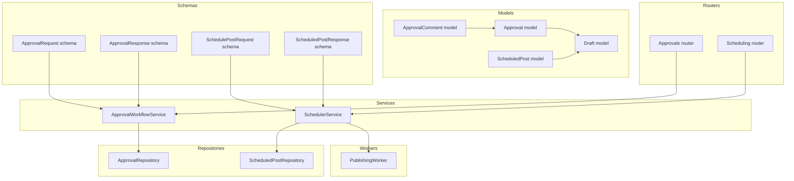
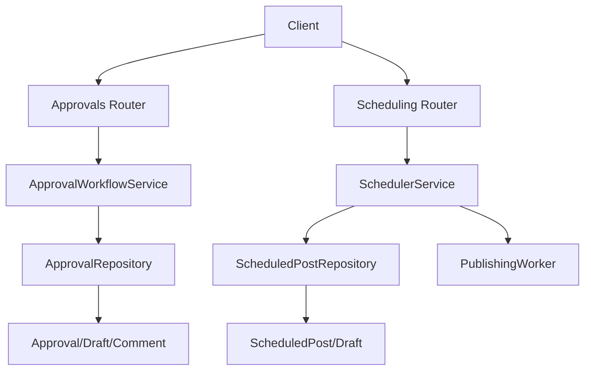
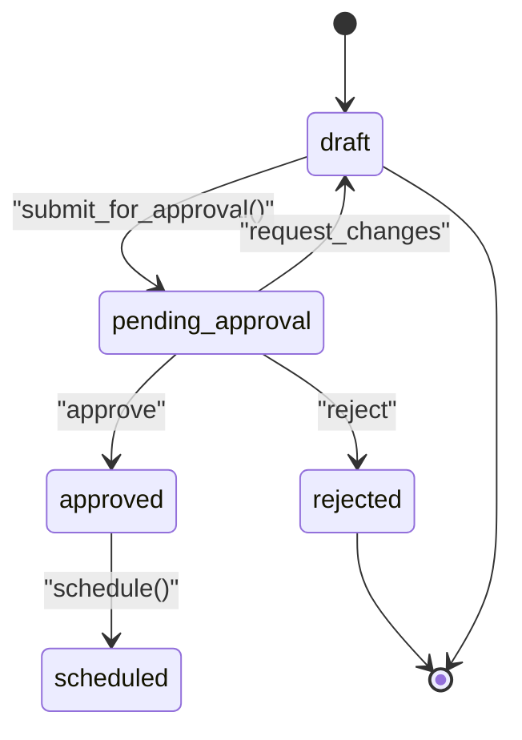
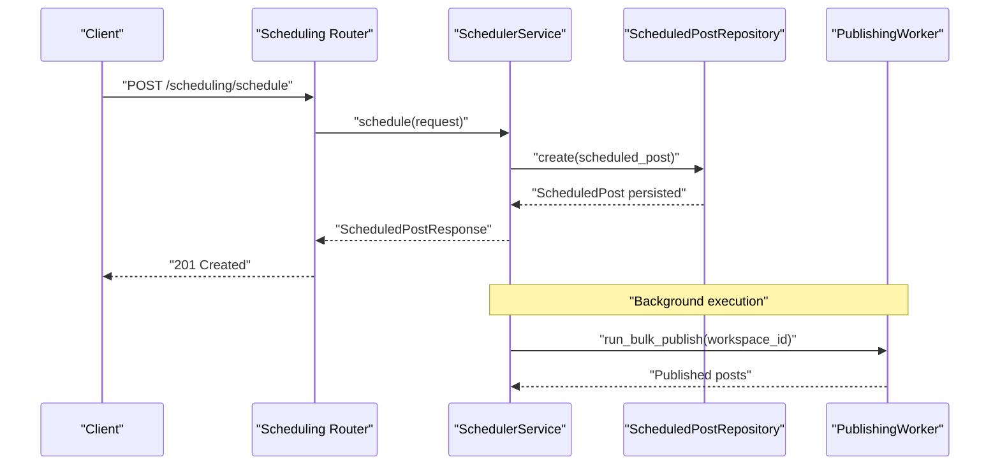
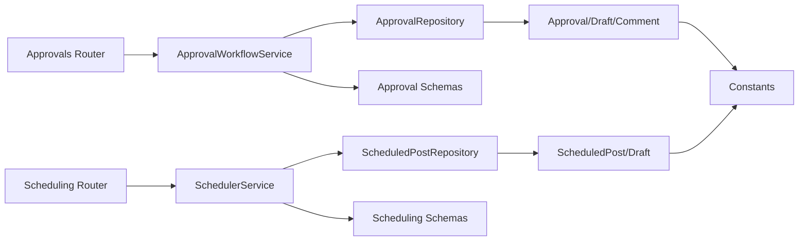

# Workflow Models

<cite>
**Referenced Files in This Document**
- [approval.py](file://backend/app/models/approval.py)
- [scheduled_post.py](file://backend/app/models/scheduled_post.py)
- [draft.py](file://backend/app/models/draft.py)
- [constants.py](file://backend/app/core/constants.py)
- [approval.py](file://backend/app/schemas/approval.py)
- [scheduling.py](file://backend/app/schemas/scheduling.py)
- [approval_workflow_service.py](file://backend/app/services/approval_workflow_service.py)
- [scheduler_service.py](file://backend/app/services/scheduler_service.py)
- [approval_repository.py](file://backend/app/repositories/approval_repository.py)
- [scheduled_post_repository.py](file://backend/app/repositories/scheduled_post_repository.py)
- [approvals.py](file://backend/app/routers/approvals.py)
- [scheduling.py](file://backend/app/routers/scheduling.py)
- [publishing_worker.py](file://backend/app/workers/publishing_worker.py)
- [main.py](file://backend/app/main.py)
</cite>

## Table of Contents
1. [Introduction](#introduction)
2. [Project Structure](#project-structure)
3. [Core Components](#core-components)
4. [Architecture Overview](#architecture-overview)
5. [Detailed Component Analysis](#detailed-component-analysis)
6. [Dependency Analysis](#dependency-analysis)
7. [Performance Considerations](#performance-considerations)
8. [Troubleshooting Guide](#troubleshooting-guide)
9. [Conclusion](#conclusion)

## Introduction
This document describes the workflow models and related services that power Socialium’s content approval and scheduling system. It focuses on:
- Approval model structure, requester/approver relationships, status tracking, comments, and decision logic
- ScheduledPost model for content publishing scheduling, including timing, recurrence rules, and platform-specific constraints
- Approval workflow state machine, multi-level approval processes, and notification mechanisms
- Scheduling logic, batch publishing capabilities, and conflict resolution strategies
- Field definitions, validation rules, and business constraints
- Examples of workflow execution and state management patterns

## Project Structure
The workflow system spans models, schemas, services, repositories, routers, and workers:
- Models define the database schema for approvals, scheduled posts, and their relationships to drafts and workspaces
- Schemas define request/response validation and serialization
- Services encapsulate workflow logic (approval decisions, scheduling, optimization)
- Repositories abstract persistence operations
- Routers expose REST endpoints for approvals and scheduling
- Workers handle background tasks such as publishing



**Diagram sources**
- [approval.py](file://backend/app/models/approval.py#L14-L68)
- [scheduled_post.py](file://backend/app/models/scheduled_post.py#L13-L55)
- [draft.py](file://backend/app/models/draft.py#L15-L70)
- [approval.py](file://backend/app/schemas/approval.py#L11-L69)
- [scheduling.py](file://backend/app/schemas/scheduling.py#L9-L70)
- [approval_workflow_service.py](file://backend/app/services/approval_workflow_service.py#L8-L48)
- [scheduler_service.py](file://backend/app/services/scheduler_service.py#L8-L59)
- [approval_repository.py](file://backend/app/repositories/approval_repository.py#L6-L14)
- [scheduled_post_repository.py](file://backend/app/repositories/scheduled_post_repository.py#L6-L14)
- [approvals.py](file://backend/app/routers/approvals.py#L1-L61)
- [scheduling.py](file://backend/app/routers/scheduling.py#L1-L69)
- [publishing_worker.py](file://backend/app/workers/publishing_worker.py#L4-L11)

**Section sources**
- [main.py](file://backend/app/main.py#L11-L76)

## Core Components
This section documents the two primary workflow models and their supporting artifacts.

### Approval Model
The Approval model tracks reviewer actions against a draft and maintains a history of decisions and comments.

Key fields and relationships:
- Identifier: UUID primary key
- Draft linkage: UUID foreign key to Draft with cascade delete
- Reviewer linkage: UUID foreign key to User with null-on-delete behavior
- Action: Enumerated action (approve, reject, request_changes)
- Feedback: Optional free-text comment
- Version: Integer version number for audit/history
- Created timestamp: Server-defaulted UTC timestamp
- Relationships:
  - Back-populated Draft relationship
  - Comments relationship to ApprovalComment with eager loading

ApprovalComment model:
- Identifier: UUID primary key
- Approval linkage: UUID foreign key to Approval with cascade delete
- Author linkage: UUID foreign key to User with null-on-delete behavior
- Content: Required free-text comment
- Created timestamp: Server-defaulted UTC timestamp
- Relationship: Back-populated Approval relationship

Validation and constraints:
- Action is constrained to predefined enumerated values
- Feedback length is validated via schema constraints
- Comment content length is validated via schema constraints
- Foreign keys enforce referential integrity with appropriate deletion behaviors

**Section sources**
- [approval.py](file://backend/app/models/approval.py#L14-L68)
- [constants.py](file://backend/app/core/constants.py#L25-L29)

### ScheduledPost Model
The ScheduledPost model captures scheduling intent and execution metadata for a draft.

Key fields and relationships:
- Identifier: UUID primary key
- Draft linkage: UUID foreign key to Draft with cascade delete; unique constraint ensures one schedule per draft
- Workspace linkage: UUID foreign key to Workspace with cascade delete
- Timing:
  - scheduled_at: Non-null datetime with timezone
  - timezone: String with default UTC
- Recurrence:
  - is_recurring: Boolean flag with default false
  - recurrence_rule: Optional string rule (e.g., daily, weekly, monthly)
  - recurrence_end_date: Optional datetime marking end of recurrence
- Quiet hours:
  - quiet_hours_enabled: Boolean flag with default false
  - quiet_hours_start/end: Optional time strings in HH:MM format
- Status and error tracking:
  - publish_status: String with default pending and server default
  - error_message: Optional text for failure details
- Metadata:
  - metadata: JSONB dictionary with defaults
- Timestamps:
  - created_at and updated_at with server defaults and update triggers

Validation and constraints:
- Unique constraint on draft_id prevents duplicate schedules
- Publish status constrained to predefined values
- Recurrence rule and quiet hours fields are optional but validated via service logic
- Timezone and time formats are validated via service logic

**Section sources**
- [scheduled_post.py](file://backend/app/models/scheduled_post.py#L13-L55)

### Draft Model Context
The Draft model provides the lifecycle context for approvals and scheduling:
- Status enum includes draft, pending_approval, approved, rejected, scheduled, published, failed
- Relationships:
  - approvals: One-to-many with Approval
  - scheduled_post: One-to-one with ScheduledPost
- Additional content fields (headline, body_text, hashtags, images, CTA, tone, etc.) support downstream publishing

**Section sources**
- [draft.py](file://backend/app/models/draft.py#L15-L70)
- [constants.py](file://backend/app/core/constants.py#L14-L22)

## Architecture Overview
The workflow system integrates models, schemas, services, repositories, routers, and workers to manage approvals and scheduling.



**Diagram sources**
- [approvals.py](file://backend/app/routers/approvals.py#L1-L61)
- [scheduling.py](file://backend/app/routers/scheduling.py#L1-L69)
- [approval_workflow_service.py](file://backend/app/services/approval_workflow_service.py#L8-L48)
- [scheduler_service.py](file://backend/app/services/scheduler_service.py#L8-L59)
- [approval_repository.py](file://backend/app/repositories/approval_repository.py#L6-L14)
- [scheduled_post_repository.py](file://backend/app/repositories/scheduled_post_repository.py#L6-L14)
- [approval.py](file://backend/app/models/approval.py#L14-L68)
- [scheduled_post.py](file://backend/app/models/scheduled_post.py#L13-L55)
- [publishing_worker.py](file://backend/app/workers/publishing_worker.py#L4-L11)

## Detailed Component Analysis

### Approval Workflow State Machine
The approval workflow enforces a deterministic state machine over Draft status:
- Initial state: draft
- Transition to: pending_approval when submitted for review
- Final outcomes:
  - approve → status becomes approved
  - reject → status becomes rejected
  - request_changes → status becomes draft (revision loop)



**Diagram sources**
- [constants.py](file://backend/app/core/constants.py#L14-L22)
- [approval_workflow_service.py](file://backend/app/services/approval_workflow_service.py#L25-L39)

Decision logic and steps:
- Validate draft is in pending_approval status
- Create Approval record with action and optional feedback
- Update Draft status based on action
- Notify content creator of decision (service-level responsibility)

Multi-level approval process:
- The model supports multiple Approval records per draft (history/versioning)
- Comments enable collaborative review and audit trails
- Future extensions can introduce hierarchical approvers and routing rules

Notification mechanisms:
- The service layer is responsible for notifying stakeholders after decisions
- Notification channels (email/webhook) are not modeled here but can be integrated in the service implementation

**Section sources**
- [approval_workflow_service.py](file://backend/app/services/approval_workflow_service.py#L8-L48)
- [approval.py](file://backend/app/models/approval.py#L14-L68)
- [constants.py](file://backend/app/core/constants.py#L14-L22)

### Scheduling Logic and Batch Publishing
Scheduling encompasses single-shot and recurring posts with time zone awareness and quiet hours constraints.



**Diagram sources**
- [scheduling.py](file://backend/app/routers/scheduling.py#L18-L25)
- [scheduler_service.py](file://backend/app/services/scheduler_service.py#L18-L27)
- [scheduled_post_repository.py](file://backend/app/repositories/scheduled_post_repository.py#L10-L13)
- [publishing_worker.py](file://backend/app/workers/publishing_worker.py#L9-L11)

Scheduling fields and constraints:
- scheduled_at and timezone drive effective scheduling
- is_recurring toggles recurrence; recurrence_rule defines cadence; recurrence_end_date bounds repetition
- quiet_hours_enable toggles quiet hours; quiet_hours_start/end define inclusive intervals
- publish_status tracks lifecycle: pending, published, failed, cancelled
- metadata stores arbitrary scheduling attributes

Optimization:
- get_optimal_times analyzes historical engagement by day/hour, applies quiet hours constraints, ranks slots, and returns recommendations with explainability

Conflict resolution:
- Unique constraint on draft_id prevents duplicate schedules
- Rescheduling updates existing record and re-registers triggers
- Cancelling sets publish_status to cancelled and removes triggers

Batch publishing:
- Background worker publishes all due posts for a workspace
- Service orchestrates bulk execution and error handling

**Section sources**
- [scheduler_service.py](file://backend/app/services/scheduler_service.py#L8-L59)
- [scheduling.py](file://backend/app/schemas/scheduling.py#L9-L70)
- [scheduled_post.py](file://backend/app/models/scheduled_post.py#L13-L55)
- [publishing_worker.py](file://backend/app/workers/publishing_worker.py#L9-L11)

### Data Models and Relationships
```mermaid
erDiagram
DRAFT {
uuid id PK
uuid workspace_id FK
uuid content_source_id FK
enum platform
string headline
text body_text
string[] hashtags
text image_url
text image_prompt
string cta
enum tone
string ai_model
text generation_prompt
enum status
int character_count
decimal quality_score
bool is_variant
uuid variant_group_id
timestamp created_at
timestamp updated_at
timestamp published_at
}
APPROVAL {
uuid id PK
uuid draft_id FK
uuid reviewer_id FK
enum action
text feedback
int version
timestamp created_at
}
APPROVAL_COMMENT {
uuid id PK
uuid approval_id FK
uuid author_id FK
text content
timestamp created_at
}
SCHEDULED_POST {
uuid id PK
uuid draft_id FK UK
uuid workspace_id FK
timestamp scheduled_at
string timezone
bool is_recurring
string recurrence_rule
timestamp recurrence_end_date
bool quiet_hours_enabled
string quiet_hours_start
string quiet_hours_end
string publish_status
text error_message
jsonb metadata
timestamp created_at
timestamp updated_at
}
DRAFT ||--o{ APPROVAL : "has many"
APPROVAL ||--o{ APPROVAL_COMMENT : "has many"
DRAFT ||--|| SCHEDULED_POST : "has one"
```

**Diagram sources**
- [draft.py](file://backend/app/models/draft.py#L15-L70)
- [approval.py](file://backend/app/models/approval.py#L14-L68)
- [scheduled_post.py](file://backend/app/models/scheduled_post.py#L13-L55)

## Dependency Analysis
The workflow system exhibits clean separation of concerns:
- Routers depend on services for business logic
- Services depend on repositories for persistence
- Repositories operate on SQLAlchemy models
- Schemas validate request/response payloads
- Constants define shared enumerations and limits



**Diagram sources**
- [approvals.py](file://backend/app/routers/approvals.py#L1-L61)
- [scheduling.py](file://backend/app/routers/scheduling.py#L1-L69)
- [approval_workflow_service.py](file://backend/app/services/approval_workflow_service.py#L8-L48)
- [scheduler_service.py](file://backend/app/services/scheduler_service.py#L8-L59)
- [approval_repository.py](file://backend/app/repositories/approval_repository.py#L6-L14)
- [scheduled_post_repository.py](file://backend/app/repositories/scheduled_post_repository.py#L6-L14)
- [approval.py](file://backend/app/models/approval.py#L14-L68)
- [scheduled_post.py](file://backend/app/models/scheduled_post.py#L13-L55)
- [constants.py](file://backend/app/core/constants.py#L1-L85)

**Section sources**
- [approvals.py](file://backend/app/routers/approvals.py#L1-L61)
- [scheduling.py](file://backend/app/routers/scheduling.py#L1-L69)
- [approval_workflow_service.py](file://backend/app/services/approval_workflow_service.py#L8-L48)
- [scheduler_service.py](file://backend/app/services/scheduler_service.py#L8-L59)

## Performance Considerations
- Indexing recommendations:
  - Approvals: index on draft_id and reviewer_id for efficient listing and filtering
  - ScheduledPosts: index on draft_id, workspace_id, scheduled_at, publish_status for calendar and executor queries
- Eager loading:
  - Use selectinload for Approval.comments to avoid N+1 queries
- Pagination:
  - Implement cursor-based pagination for large approval lists
- Concurrency:
  - Use atomic updates for status transitions and version increments
- Background jobs:
  - Batch publishing reduces per-post overhead; tune worker concurrency based on platform rate limits

## Troubleshooting Guide
Common issues and resolutions:
- Duplicate schedule creation:
  - Symptom: IntegrityError on unique constraint
  - Resolution: Check existing ScheduledPost by draft_id before creating
- Invalid approval action:
  - Symptom: Validation error on action enum
  - Resolution: Ensure action is one of approve, reject, request_changes
- Scheduling outside quiet hours:
  - Symptom: Post not published during intended time
  - Resolution: Adjust quiet hours settings or schedule outside the interval
- Recurrence misconfiguration:
  - Symptom: Posts not repeating as expected
  - Resolution: Verify recurrence_rule and recurrence_end_date values
- Publishing failures:
  - Symptom: publish_status set to failed with error_message populated
  - Resolution: Inspect error_message and retry or reschedule

Operational checks:
- Health endpoint: GET /health to verify service availability
- Calendar view: Use /scheduling/calendar to inspect upcoming posts
- Optimal times: Use /scheduling/optimize to validate recommendation logic

**Section sources**
- [scheduled_post.py](file://backend/app/models/scheduled_post.py#L22-L22)
- [constants.py](file://backend/app/core/constants.py#L25-L29)
- [scheduling.py](file://backend/app/routers/scheduling.py#L28-L37)
- [scheduler_service.py](file://backend/app/services/scheduler_service.py#L45-L54)

## Conclusion
Socialium’s workflow models provide a robust foundation for content governance and scheduling:
- Approval model captures reviewer actions, feedback, and collaborative comments with strong referential integrity
- ScheduledPost model supports precise scheduling, recurrence, and operational constraints
- Services encapsulate state transitions, validation, and background execution
- Clear separation of concerns enables maintainability and extensibility for multi-level approvals and advanced scheduling features