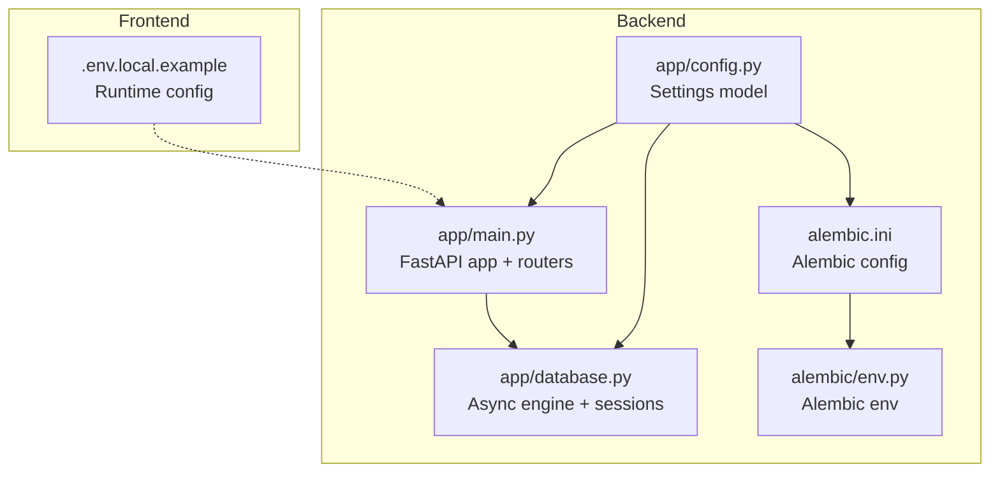
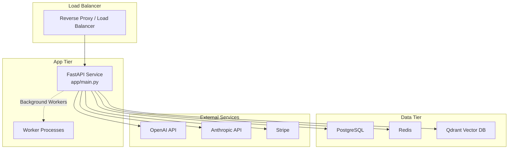
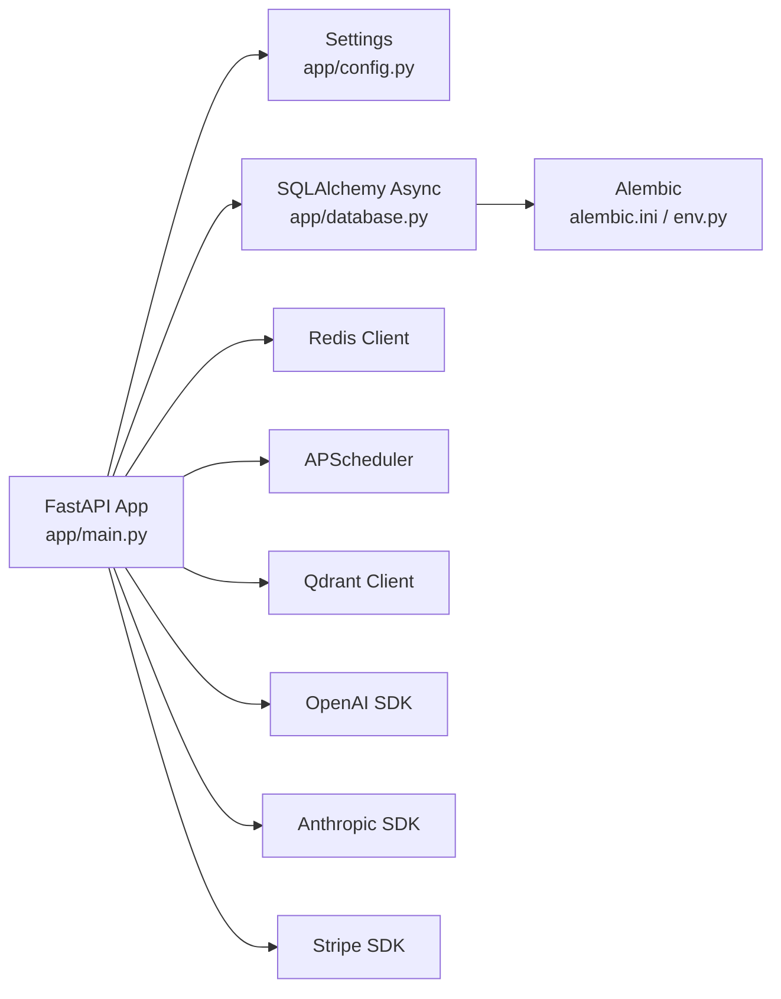
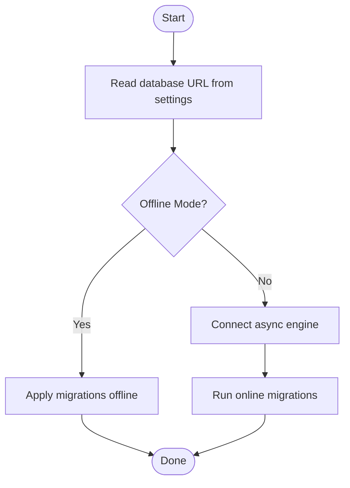

# Deployment & Operations

<cite>
**Referenced Files in This Document**
- [pyproject.toml](file://backend/pyproject.toml)
- [.env.example](file://backend/.env.example)
- [config.py](file://backend/app/config.py)
- [main.py](file://backend/app/main.py)
- [database.py](file://backend/app/database.py)
- [alembic.ini](file://backend/alembic.ini)
- [env.py](file://backend/alembic/env.py)
- [.env.local.example](file://frontend/.env.local.example)
</cite>

## Table of Contents
1. [Introduction](#introduction)
2. [Project Structure](#project-structure)
3. [Core Components](#core-components)
4. [Architecture Overview](#architecture-overview)
5. [Detailed Component Analysis](#detailed-component-analysis)
6. [Dependency Analysis](#dependency-analysis)
7. [Performance Considerations](#performance-considerations)
8. [Troubleshooting Guide](#troubleshooting-guide)
9. [Conclusion](#conclusion)
10. [Appendices](#appendices)

## Introduction
This document provides comprehensive deployment and operations guidance for Socialium. It covers containerized deployment using Docker, multi-stage build processes, infrastructure requirements, production deployment strategies, environment configuration management, secrets handling, database provisioning, external service integrations, monitoring, load balancing and scaling, backups and disaster recovery, security hardening, SSL/TLS configuration, maintenance and update procedures, rollback strategies, and operational runbooks for common production scenarios.

## Project Structure
Socialium is a full-stack platform with a Python FastAPI backend and a Next.js frontend. The backend manages application configuration via environment variables, database connectivity, Redis, vector storage (Qdrant), LLM providers (OpenAI, Anthropic), OAuth integrations, billing (Stripe), and observability integrations. The frontend exposes runtime configuration via environment variables consumed at build time.

**Diagram sources**
- [config.py](file://backend/app/config.py#L1-L83)
- [main.py](file://backend/app/main.py#L1-L83)
- [database.py](file://backend/app/database.py#L1-L43)
- [alembic.ini](file://backend/alembic.ini#L1-L40)
- [env.py](file://backend/alembic/env.py#L1-L64)
- [.env.local.example](file://frontend/.env.local.example#L1-L16)

**Section sources**
- [pyproject.toml](file://backend/pyproject.toml#L1-L49)
- [config.py](file://backend/app/config.py#L1-L83)
- [main.py](file://backend/app/main.py#L1-L83)
- [database.py](file://backend/app/database.py#L1-L43)
- [alembic.ini](file://backend/alembic.ini#L1-L40)
- [env.py](file://backend/alembic/env.py#L1-L64)
- [.env.local.example](file://frontend/.env.local.example#L1-L16)

## Core Components
- Application configuration: Centralized via a Pydantic Settings model with environment variable loading and caching.
- Web server: FastAPI application with lifespan management, CORS, and modular routers.
- Database: Asynchronous SQLAlchemy engine with connection pooling and automatic transaction lifecycle.
- Migrations: Alembic configured to use settings-driven database URL and model discovery.
- Frontend runtime configuration: Build-time environment variables for API base URL and authentication.

Key operational implications:
- Environment-driven configuration enables seamless transitions between development, staging, and production.
- Health checks and debug toggles are controlled by settings.
- Database and Redis connections are configured centrally for predictable resource usage.

**Section sources**
- [config.py](file://backend/app/config.py#L1-L83)
- [main.py](file://backend/app/main.py#L1-L83)
- [database.py](file://backend/app/database.py#L1-L43)
- [alembic.ini](file://backend/alembic.ini#L1-L40)
- [env.py](file://backend/alembic/env.py#L1-L64)
- [.env.example](file://backend/.env.example#L1-L56)
- [.env.local.example](file://frontend/.env.local.example#L1-L16)

## Architecture Overview
The deployment architecture comprises:
- Backend service: FastAPI app exposing REST APIs, with routers for authentication, content, analytics, approvals, platforms, scheduling, memory, workspace, and billing.
- Data plane: PostgreSQL for relational data, Redis for caching and task coordination, Qdrant for embeddings.
- Control plane: Alembic for schema migrations, environment configuration, and secrets management.
- Observability: Optional integrations for Langfuse, PostHog, and Stripe webhooks.
- Frontend: Next.js app consuming backend APIs and runtime configuration.

[No sources needed since this diagram shows conceptual workflow, not actual code structure]

## Detailed Component Analysis

### Containerized Deployment and Multi-Stage Builds
- Build system: Python project uses a modern build backend suitable for containerization.
- Dependencies: Core stack includes FastAPI, Uvicorn, SQLAlchemy asyncio, Alembic, asyncpg, Redis client, APScheduler, Qdrant client, OpenAI, Anthropic, and others.
- Runtime: Uvicorn serves the FastAPI app; environment variables configure host, port, and settings.

Recommended containerization approach:
- Stage 1: Install Python dependencies and build assets (if applicable).
- Stage 2: Copy only necessary runtime artifacts into a minimal base image.
- Entrypoint: Start Uvicorn with bind address and workers appropriate for the target CPU/memory.

Operational notes:
- Set environment variables for production (see Environment Configuration Management).
- Mount persistent volumes for logs and any required artifacts.
- Configure health checks using the /health endpoint.

**Section sources**
- [pyproject.toml](file://backend/pyproject.toml#L1-L49)
- [main.py](file://backend/app/main.py#L78-L83)

### Infrastructure Requirements
- Compute: Stateless backend pods behind a load balancer; workers can be scaled independently.
- Storage:
  - PostgreSQL: Persistent volume; ensure backups and replication.
  - Redis: Persistent or ephemeral depending on use; consider persistence for queues.
  - Qdrant: Persistent volume for vector indices.
- Networking: Allow outbound HTTPS to external services (OpenAI, Anthropic, Stripe).
- Secrets: Managed via environment variables or secret managers; avoid committing secrets to source.

**Section sources**
- [config.py](file://backend/app/config.py#L25-L31)
- [config.py](file://backend/app/config.py#L47-L50)
- [.env.example](file://backend/.env.example#L8-L34)

### Production Deployment Strategies
- Blue-green or rolling deployments to minimize downtime.
- Canary releases for gradual traffic shift.
- Pre-deployment checks: migrations, readiness probes, and health endpoints.
- Immutable containers with deterministic configuration via environment variables.

**Section sources**
- [main.py](file://backend/app/main.py#L78-L83)
- [alembic.ini](file://backend/alembic.ini#L1-L40)
- [env.py](file://backend/alembic/env.py#L1-L64)

### Environment Configuration Management and Secrets Handling
- Backend settings are loaded from environment files with case-insensitive keys and UTF-8 encoding.
- Example environment variables include application settings, database URL, Redis URL, JWT keys, provider credentials, OAuth client IDs/secrets, Stripe keys, frontend URL, and monitoring keys.
- Frontend runtime configuration includes API base URL and NextAuth settings.

Best practices:
- Store secrets externally (secret manager or orchestrator) and inject via environment variables.
- Rotate keys regularly; enforce minimum key lengths and strong randomness.
- Restrict access to secrets at rest and in transit.

**Section sources**
- [config.py](file://backend/app/config.py#L12-L16)
- [.env.example](file://backend/.env.example#L1-L56)
- [.env.local.example](file://frontend/.env.local.example#L1-L16)

### Database Provisioning and Migrations
- Database URL is configurable; Alembic reads the URL from settings and applies migrations offline/online.
- Models are auto-discovered for migration generation.
- Connection pooling and pre-ping are enabled for reliability.

Operational steps:
- Provision PostgreSQL with appropriate sizing and replication.
- Run migrations during deployment using Alembic with the configured database URL.
- Monitor migration failures and maintain rollback plans.

**Section sources**
- [config.py](file://backend/app/config.py#L25-L27)
- [alembic.ini](file://backend/alembic.ini#L6-L6)
- [env.py](file://backend/alembic/env.py#L20-L22)
- [env.py](file://backend/alembic/env.py#L44-L58)

### External Service Integrations Setup
- LLM providers: OpenAI and Anthropic require API keys and model identifiers.
- Vector DB: Qdrant URL and optional API key; collection name is configurable.
- OAuth: LinkedIn, Twitter, Instagram, Facebook client IDs and secrets.
- Billing: Stripe secret and webhook secrets.
- Monitoring: Langfuse public/secret keys and PostHog API key.

Integration checklist:
- Obtain credentials from respective providers.
- Configure environment variables per environment.
- Test connectivity and permissions for each service.

**Section sources**
- [config.py](file://backend/app/config.py#L38-L45)
- [config.py](file://backend/app/config.py#L47-L50)
- [config.py](file://backend/app/config.py#L52-L64)
- [config.py](file://backend/app/config.py#L69-L72)
- [.env.example](file://backend/.env.example#L21-L56)

### Monitoring Configuration
- Optional monitoring integrations include Langfuse, PostHog, and Stripe webhooks.
- Enable monitoring keys per environment and ensure secure transport.

**Section sources**
- [config.py](file://backend/app/config.py#L69-L72)
- [.env.example](file://backend/.env.example#L52-L56)

### Load Balancing and Scaling
- Horizontal scaling: Deploy multiple backend instances behind a reverse proxy/load balancer.
- Worker scaling: Separate background workers (generation, publishing, analytics, embeddings) can be scaled independently.
- Autoscaling: Use CPU/memory metrics to scale replicas; ensure stateless design.

[No sources needed since this section provides general guidance]

### Backup Procedures and Disaster Recovery
- Database: Regular logical backups with point-in-time recovery; test restore procedures.
- Secrets: Maintain encrypted backups of secrets; rotate after breach.
- Artifacts: Back up configuration and migration history; version control for infrastructure-as-code.

[No sources needed since this section provides general guidance]

### Security Hardening, SSL/TLS, and Network Security
- TLS termination: Terminate TLS at the load balancer; enforce HTTPS-only cookies.
- Secrets: Use secret managers; restrict IAM roles; audit access.
- Network: Limit egress to trusted domains; use private subnets for internal services.
- Headers: Enforce security headers; rate limiting; input validation.

[No sources needed since this section provides general guidance]

### Maintenance Procedures, Updates, and Rollback
- Maintenance windows: Perform updates during low-traffic periods.
- Rolling updates: Gradually replace pods; monitor health.
- Rollback: Keep previous image tag; revert on failure; restore DB from last known-good backup.
- Testing: Validate in staging; automated health checks and smoke tests.

[No sources needed since this section provides general guidance]

### Operational Runbooks
Common production scenarios:
- Health check failures: Inspect logs, verify database connectivity, and confirm external service availability.
- Migration errors: Review Alembic logs, fix schema discrepancies, and rerun migrations.
- OAuth failures: Validate client credentials and redirect URIs; check provider quotas.
- LLM quota limits: Monitor provider usage; implement retry/backoff; alert on sustained throttling.
- Redis/Qdrant outages: Confirm service endpoints; restart services if needed; restore from backups.

[No sources needed since this section provides general guidance]

## Dependency Analysis
The backend depends on a set of libraries for web framework, async database, migrations, caching, scheduling, vector storage, LLM clients, authentication, and validation. These dependencies define the operational footprint and upgrade cadence.

**Diagram sources**
- [main.py](file://backend/app/main.py#L1-L83)
- [config.py](file://backend/app/config.py#L1-L83)
- [database.py](file://backend/app/database.py#L1-L43)
- [alembic.ini](file://backend/alembic.ini#L1-L40)
- [env.py](file://backend/alembic/env.py#L1-L64)

**Section sources**
- [pyproject.toml](file://backend/pyproject.toml#L6-L25)

## Performance Considerations
- Database: Tune pool size and overflow based on workload; enable pre-ping; monitor slow queries.
- Caching: Use Redis for hot data; set TTLs; monitor hit ratios.
- Background work: Scale workers proportionally to queue depth; monitor task durations.
- LLM calls: Implement retries with exponential backoff; cache embeddings; batch requests.
- Observability: Enable structured logging; metrics for latency and error rates.

[No sources needed since this section provides general guidance]

## Troubleshooting Guide
- Health endpoint: Use the /health endpoint to verify service status and environment.
- Logs: Enable debug mode in development; ensure structured logs in production.
- Database: Validate connection string; check pool exhaustion; inspect migration status.
- External services: Verify API keys and model names; check provider dashboards for rate limits.
- CORS: Ensure frontend URL matches allowed origins.

**Section sources**
- [main.py](file://backend/app/main.py#L78-L83)
- [config.py](file://backend/app/config.py#L18-L23)
- [config.py](file://backend/app/config.py#L66-L67)

## Conclusion
This guide outlines a robust, scalable, and secure deployment and operations strategy for Socialium. By leveraging environment-driven configuration, containerized builds, managed infrastructure, and disciplined change management, teams can reliably operate Socialium in production while maintaining high availability, performance, and security.

## Appendices

### Appendix A: Environment Variable Reference
- Application: app_name, app_env, debug, secret_key, api_v1_prefix
- Database: database_url, database_echo
- Redis: redis_url
- JWT: jwt_secret_key, jwt_algorithm, jwt_access_token_expire_minutes, jwt_refresh_token_expire_days
- LLM Providers: openai_api_key, openai_model, openai_embedding_model, anthropic_api_key, anthropic_model
- Vector DB: qdrant_url, qdrant_api_key, qdrant_collection_name
- OAuth: linkedin_client_id, linkedin_client_secret, twitter_client_id, twitter_client_secret, instagram_client_id, instagram_client_secret, facebook_app_id, facebook_app_secret
- Billing: stripe_secret_key, stripe_webhook_secret
- Frontend: frontend_url
- Monitoring: langfuse_public_key, langfuse_secret_key, posthog_api_key

**Section sources**
- [.env.example](file://backend/.env.example#L1-L56)
- [config.py](file://backend/app/config.py#L18-L72)

### Appendix B: Database Migration Workflow

**Diagram sources**
- [env.py](file://backend/alembic/env.py#L20-L58)
- [alembic.ini](file://backend/alembic.ini#L6-L6)