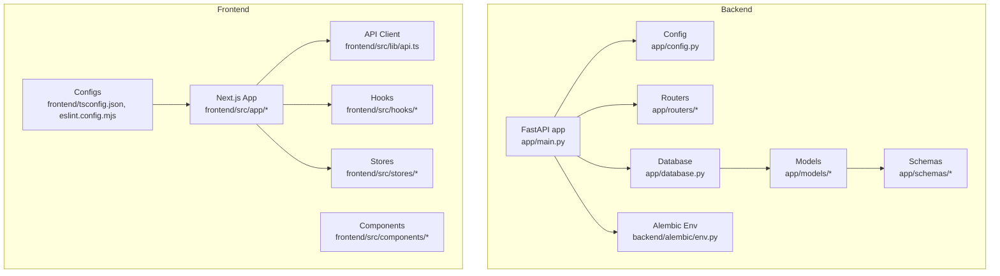
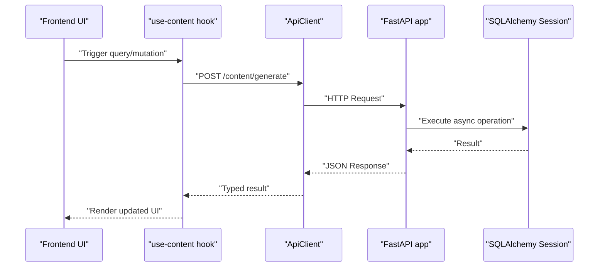
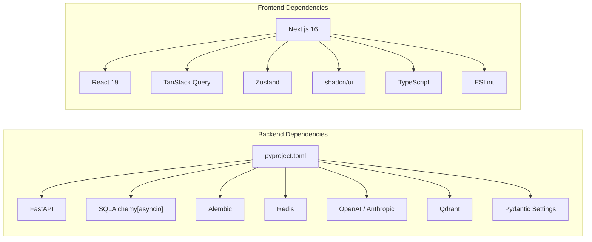

# Developer Guidelines

<cite>
**Referenced Files in This Document**
- [backend/pyproject.toml](file://backend/pyproject.toml)
- [backend/app/main.py](file://backend/app/main.py)
- [backend/app/config.py](file://backend/app/config.py)
- [backend/app/database.py](file://backend/app/database.py)
- [backend/app/core/security.py](file://backend/app/core/security.py)
- [backend/app/models/user.py](file://backend/app/models/user.py)
- [backend/app/schemas/auth.py](file://backend/app/schemas/auth.py)
- [backend/alembic/env.py](file://backend/alembic/env.py)
- [frontend/package.json](file://frontend/package.json)
- [frontend/eslint.config.mjs](file://frontend/eslint.config.mjs)
- [frontend/tsconfig.json](file://frontend/tsconfig.json)
- [frontend/src/lib/api.ts](file://frontend/src/lib/api.ts)
- [frontend/src/hooks/use-content.ts](file://frontend/src/hooks/use-content.ts)
- [frontend/src/stores/content-store.ts](file://frontend/src/stores/content-store.ts)
</cite>

## Table of Contents
1. [Introduction](#introduction)
2. [Project Structure](#project-structure)
3. [Core Components](#core-components)
4. [Architecture Overview](#architecture-overview)
5. [Detailed Component Analysis](#detailed-component-analysis)
6. [Dependency Analysis](#dependency-analysis)
7. [Performance Considerations](#performance-considerations)
8. [Troubleshooting Guide](#troubleshooting-guide)
9. [Contribution Workflow](#contribution-workflow)
10. [Development Tools Setup](#development-tools-setup)
11. [Testing Requirements](#testing-requirements)
12. [Documentation Standards](#documentation-standards)
13. [Release Procedures](#release-procedures)
14. [Conclusion](#conclusion)

## Introduction
This document provides comprehensive developer guidelines for contributing to Socialium. It covers backend Python standards (PEP 8, FastAPI best practices, SQLAlchemy patterns), frontend TypeScript/React conventions (component architecture, state management), project conventions and naming patterns, contribution workflow, development tools, debugging, performance optimization, testing, documentation, and release procedures.

## Project Structure
Socialium follows a clear separation of concerns:
- Backend: FastAPI application with async SQLAlchemy ORM, Alembic migrations, and modular routing.
- Frontend: Next.js 16 app with React 19, TypeScript strict mode, shadcn/ui components, Zustand for local state, and TanStack Query for remote data.

**Diagram sources**
- [backend/app/main.py](file://backend/app/main.py#L1-L83)
- [backend/app/config.py](file://backend/app/config.py#L1-L83)
- [backend/app/database.py](file://backend/app/database.py#L1-L43)
- [backend/alembic/env.py](file://backend/alembic/env.py#L1-L65)
- [frontend/src/lib/api.ts](file://frontend/src/lib/api.ts#L1-L69)
- [frontend/src/hooks/use-content.ts](file://frontend/src/hooks/use-content.ts#L1-L30)
- [frontend/src/stores/content-store.ts](file://frontend/src/stores/content-store.ts#L1-L62)
- [frontend/tsconfig.json](file://frontend/tsconfig.json#L1-L35)
- [frontend/eslint.config.mjs](file://frontend/eslint.config.mjs#L1-L19)

**Section sources**
- [backend/app/main.py](file://backend/app/main.py#L1-L83)
- [frontend/package.json](file://frontend/package.json#L1-L45)

## Core Components
- Backend entrypoint initializes FastAPI with lifespan, CORS, exception handlers, and router registration.
- Configuration is centralized via Pydantic Settings with environment loading and caching.
- Database uses async SQLAlchemy with a reusable session factory and Base declarative class.
- Security utilities provide password hashing and JWT token creation/verification.
- Models define domain entities with typed columns, enums, and relationships.
- Schemas define request/response contracts validated by Pydantic.
- Alembic environment integrates with app settings and models for migrations.

**Section sources**
- [backend/app/main.py](file://backend/app/main.py#L1-L83)
- [backend/app/config.py](file://backend/app/config.py#L1-L83)
- [backend/app/database.py](file://backend/app/database.py#L1-L43)
- [backend/app/core/security.py](file://backend/app/core/security.py#L1-L50)
- [backend/app/models/user.py](file://backend/app/models/user.py#L1-L48)
- [backend/app/schemas/auth.py](file://backend/app/schemas/auth.py#L1-L63)
- [backend/alembic/env.py](file://backend/alembic/env.py#L1-L65)

## Architecture Overview
The backend exposes REST endpoints grouped by feature, with async database sessions injected via dependency. The frontend consumes a typed API client, manages UI state with Zustand, and synchronizes remote data with TanStack Query.

**Diagram sources**
- [frontend/src/hooks/use-content.ts](file://frontend/src/hooks/use-content.ts#L1-L30)
- [frontend/src/lib/api.ts](file://frontend/src/lib/api.ts#L1-L69)
- [backend/app/main.py](file://backend/app/main.py#L1-L83)
- [backend/app/database.py](file://backend/app/database.py#L1-L43)

## Detailed Component Analysis

### Backend: FastAPI Application
- Lifespan manages startup/shutdown logs.
- CORS configured from frontend URL setting.
- Routers mounted under a versioned prefix with tags.
- Health endpoint returns runtime metadata.

**Section sources**
- [backend/app/main.py](file://backend/app/main.py#L1-L83)

### Backend: Configuration Management
- Centralized settings with environment file loading, case-insensitive keys, and cached retrieval.
- Includes application, database, Redis, JWT, LLM providers, OAuth clients, Stripe, frontend origin, and observability keys.

**Section sources**
- [backend/app/config.py](file://backend/app/config.py#L1-L83)

### Backend: Database Layer
- Async engine with connection pooling and pre-ping.
- Session factory with commit/rollback semantics and close in generator.
- Base class for declarative models.

**Section sources**
- [backend/app/database.py](file://backend/app/database.py#L1-L43)

### Backend: Security Utilities
- Password hashing and verification with bcrypt.
- JWT access/refresh token creation with expiration and decoding with error handling.

**Section sources**
- [backend/app/core/security.py](file://backend/app/core/security.py#L1-L50)

### Backend: Data Models
- Example: User model with UUID primary key, indexed fields, enum-backed subscription tier, timestamps, and relationships.

**Section sources**
- [backend/app/models/user.py](file://backend/app/models/user.py#L1-L48)

### Backend: Pydantic Schemas
- Authentication schemas define signup, login, token response, refresh, user response, and update requests with field constraints.

**Section sources**
- [backend/app/schemas/auth.py](file://backend/app/schemas/auth.py#L1-L63)

### Backend: Alembic Environment
- Loads settings and registers models for autogenerate.
- Supports offline and online async migrations.

**Section sources**
- [backend/alembic/env.py](file://backend/alembic/env.py#L1-L65)

### Frontend: API Client
- Typed client with base URL from environment, header injection, query param support, and error extraction from responses.

**Section sources**
- [frontend/src/lib/api.ts](file://frontend/src/lib/api.ts#L1-L69)

### Frontend: Hooks and State
- TanStack Query hooks for drafts, generation, and deletion with query invalidation.
- Zustand store for content wizard state with typed actions.

**Section sources**
- [frontend/src/hooks/use-content.ts](file://frontend/src/hooks/use-content.ts#L1-L30)
- [frontend/src/stores/content-store.ts](file://frontend/src/stores/content-store.ts#L1-L62)

### Frontend: Tooling Configurations
- ESLint configured via Next.js recommended rules with custom ignores.
- TypeScript strict mode, JSX transform, bundler module resolution, and path aliases.

**Section sources**
- [frontend/eslint.config.mjs](file://frontend/eslint.config.mjs#L1-L19)
- [frontend/tsconfig.json](file://frontend/tsconfig.json#L1-L35)

## Dependency Analysis
Backend dependencies are declared in pyproject.toml with FastAPI, async SQLAlchemy, Alembic, Redis, APScheduler, OpenAI/Anthropic, Qdrant, and Pydantic settings. Frontend dependencies include Next.js, React 19, TanStack Query, shadcn/ui, Tailwind, and TypeScript.

**Diagram sources**
- [backend/pyproject.toml](file://backend/pyproject.toml#L1-L49)
- [frontend/package.json](file://frontend/package.json#L1-L45)

**Section sources**
- [backend/pyproject.toml](file://backend/pyproject.toml#L1-L49)
- [frontend/package.json](file://frontend/package.json#L1-L45)

## Performance Considerations
- Backend
  - Use async database sessions and avoid blocking operations in request handlers.
  - Configure connection pooling appropriately for workload.
  - Leverage selective relationship loading and eager joins where needed.
  - Keep Pydantic models flat and reuse schemas to minimize serialization overhead.
- Frontend
  - Prefer controlled components and memoization for expensive computations.
  - Use TanStack Query’s query caching and background refetching policies.
  - Split large Zustand slices to reduce unnecessary re-renders.
  - Enable incremental compilation and strict TypeScript checks to catch regressions early.

[No sources needed since this section provides general guidance]

## Troubleshooting Guide
- Backend
  - Health endpoint helps verify service availability and environment configuration.
  - Alembic migrations should be run after schema changes; ensure models are imported in env for autogenerate.
  - Use structured logging and exception handlers to capture errors consistently.
- Frontend
  - Verify NEXT_PUBLIC_API_URL matches backend deployment.
  - Inspect network tab for 4xx/5xx responses and error payloads returned by the API client.
  - Check React Query Devtools for query status and stale data.

**Section sources**
- [backend/app/main.py](file://backend/app/main.py#L78-L83)
- [backend/alembic/env.py](file://backend/alembic/env.py#L1-L65)
- [frontend/src/lib/api.ts](file://frontend/src/lib/api.ts#L1-L69)

## Contribution Workflow
- Branching
  - Use feature branches prefixed with issue number (e.g., 123-add-auth).
  - Sync with upstream main before opening PRs.
- Pull Requests
  - Keep PRs focused and small; reference related issues.
  - Include a brief description of changes, rationale, and test coverage.
- Code Review
  - Expect reviews on style, correctness, performance, and maintainability.
  - Address comments promptly and update tests accordingly.
- Commit Messages
  - Use imperative mood; summarize changes in one line; link issues in description.

[No sources needed since this section describes process]

## Development Tools Setup
- Backend
  - Install dependencies via the project’s build system and dev dependencies for linting/tests.
  - Linting: Ruff configured with line length and selected rule categories.
  - Testing: PyTest with asyncio mode enabled; place tests under a conventional tests directory.
- Frontend
  - Install dependencies via package manager.
  - Linting: ESLint with Next.js recommended rules; TypeScript strict mode enabled.
  - Build and run scripts are defined in package.json.

**Section sources**
- [backend/pyproject.toml](file://backend/pyproject.toml#L27-L49)
- [frontend/package.json](file://frontend/package.json#L1-L45)
- [frontend/eslint.config.mjs](file://frontend/eslint.config.mjs#L1-L19)
- [frontend/tsconfig.json](file://frontend/tsconfig.json#L1-L35)

## Testing Requirements
- Backend
  - Write unit tests for services and repositories; mock external integrations (LLM, Redis, database) as needed.
  - Use async fixtures for database tests; ensure rollback and cleanup.
  - Validate schema serialization/deserialization and error responses.
- Frontend
  - Unit tests for hooks and stores using a testing library compatible with React 19 and Next.js.
  - Snapshot or render tests for components; verify API client behavior with mocked fetch.

[No sources needed since this section provides general guidance]

## Documentation Standards
- Inline docstrings for modules, classes, and functions explaining intent and behavior.
- README updates for new features or configuration changes.
- API documentation generated by FastAPI (enabled conditionally); keep route descriptions and schemas clear.

[No sources needed since this section provides general guidance]

## Release Procedures
- Backend
  - Tag releases and update version in project metadata; run migrations before deploying.
- Frontend
  - Build with production flags; verify bundle size and performance metrics.
- Shared
  - Communicate breaking changes; update environment variables and secrets as needed.

[No sources needed since this section provides general guidance]

## Conclusion
These guidelines consolidate Socialium’s backend and frontend conventions, tooling, and processes to streamline contributions while maintaining quality and consistency. Follow the standards outlined here to ensure smooth collaboration and reliable deployments.