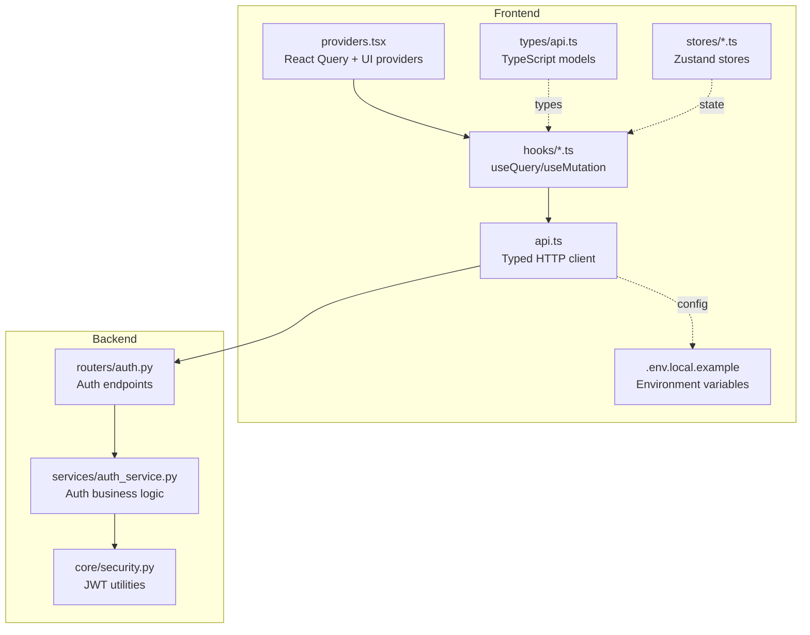
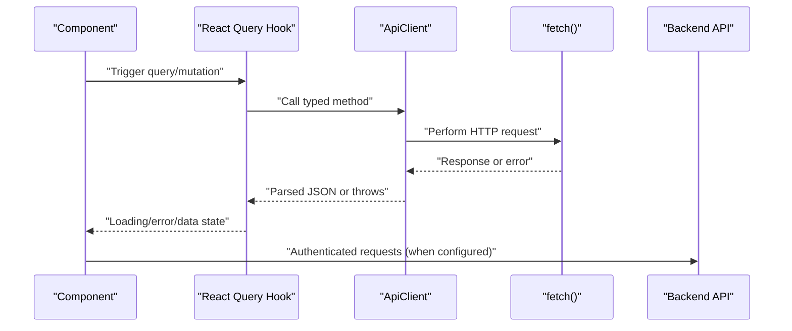
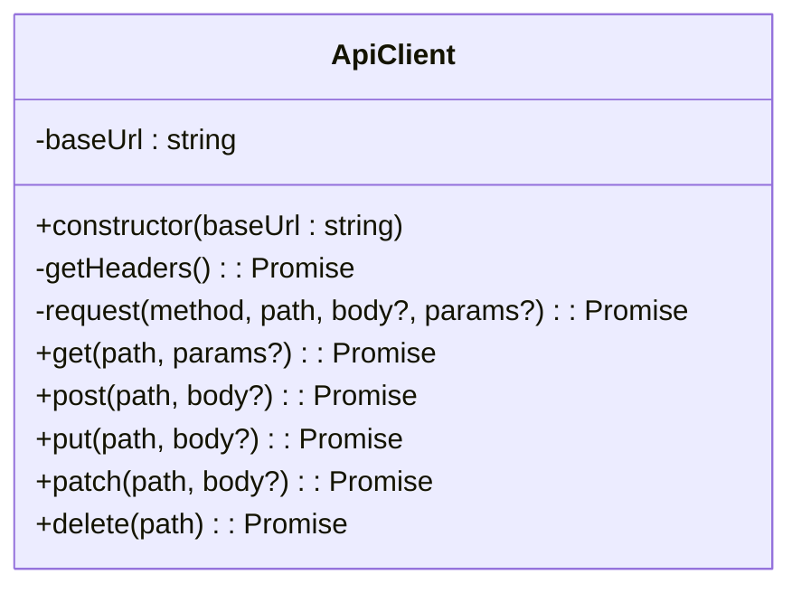
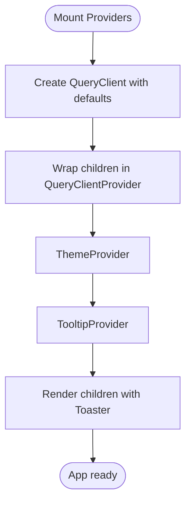
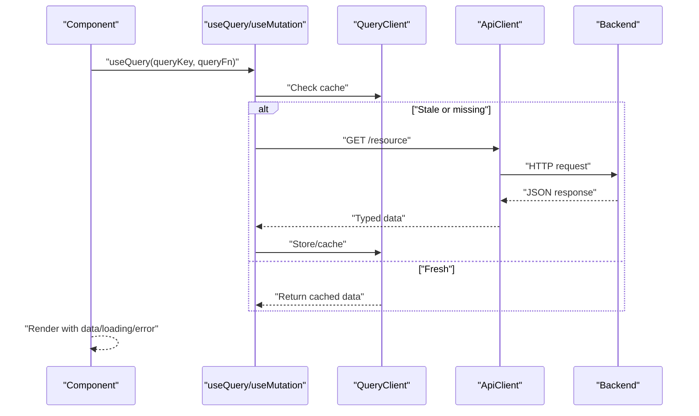
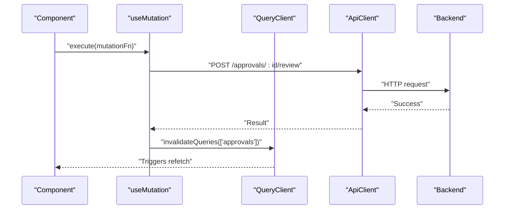
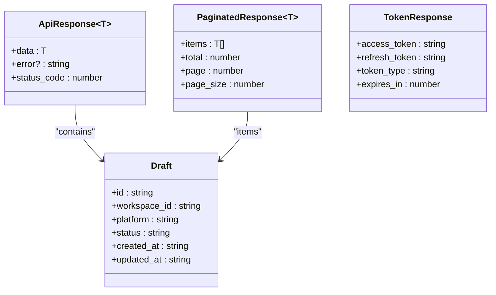
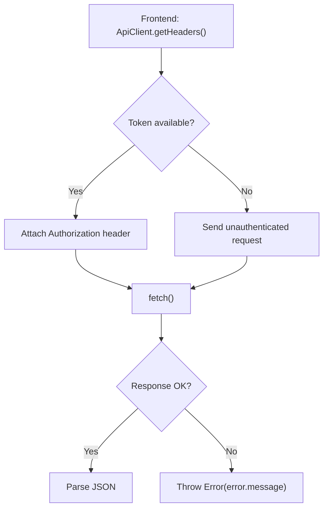
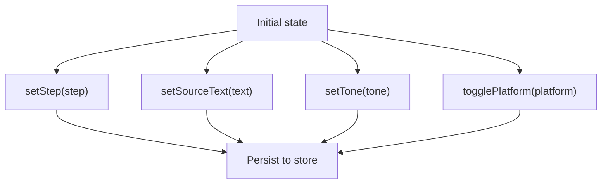
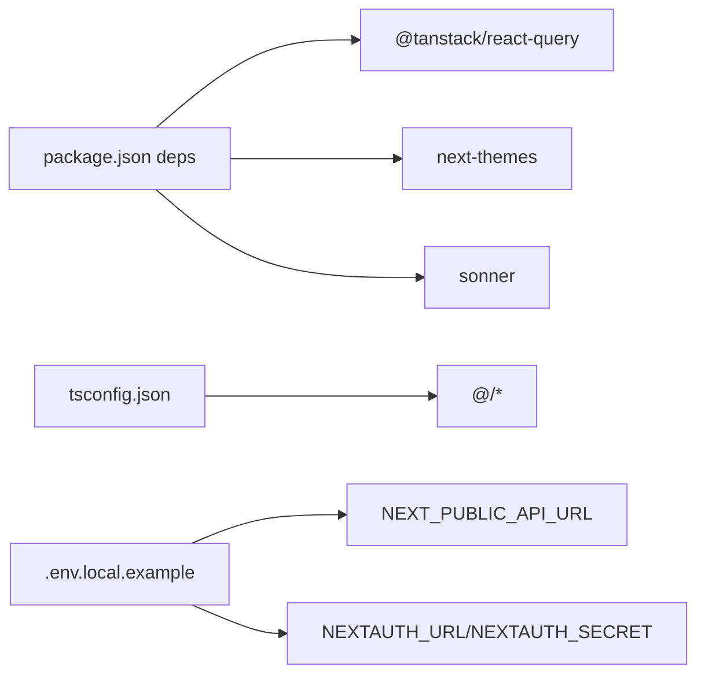

# API Integration Layer

<cite>
**Referenced Files in This Document**
- [api.ts](file://frontend/src/lib/api.ts)
- [providers.tsx](file://frontend/src/components/providers.tsx)
- [use-analytics.ts](file://frontend/src/hooks/use-analytics.ts)
- [use-approvals.ts](file://frontend/src/hooks/use-approvals.ts)
- [use-content.ts](file://frontend/src/hooks/use-content.ts)
- [use-platforms.ts](file://frontend/src/hooks/use-platforms.ts)
- [api.ts](file://frontend/src/types/api.ts)
- [.env.local.example](file://frontend/.env.local.example)
- [package.json](file://frontend/package.json)
- [tsconfig.json](file://frontend/tsconfig.json)
- [content-store.ts](file://frontend/src/stores/content-store.ts)
- [ui-store.ts](file://frontend/src/stores/ui-store.ts)
- [constants.ts](file://frontend/src/lib/constants.ts)
- [auth.py](file://backend/app/routers/auth.py)
- [auth_service.py](file://backend/app/services/auth_service.py)
- [security.py](file://backend/app/core/security.py)
</cite>

## Table of Contents
1. [Introduction](#introduction)
2. [Project Structure](#project-structure)
3. [Core Components](#core-components)
4. [Architecture Overview](#architecture-overview)
5. [Detailed Component Analysis](#detailed-component-analysis)
6. [Dependency Analysis](#dependency-analysis)
7. [Performance Considerations](#performance-considerations)
8. [Troubleshooting Guide](#troubleshooting-guide)
9. [Conclusion](#conclusion)
10. [Appendices](#appendices)

## Introduction
This document describes Socialium’s API integration layer built with a typed HTTP client and React Query. It covers client setup, authentication header injection, error handling, type safety via TypeScript interfaces, and practical patterns for queries and mutations. It also documents provider configuration for React Query, theme context, and global state management, along with debugging techniques and operational guidance.

## Project Structure
The frontend integrates the API client with React Query hooks and exposes typed models for API responses. Providers configure caching, retries, and UI contexts. Backend authentication services define token flows and JWT utilities.

**Diagram sources**
- [api.ts](file://frontend/src/lib/api.ts#L1-L69)
- [providers.tsx](file://frontend/src/components/providers.tsx#L1-L33)
- [use-analytics.ts](file://frontend/src/hooks/use-analytics.ts#L1-L14)
- [use-approvals.ts](file://frontend/src/hooks/use-approvals.ts#L1-L23)
- [use-content.ts](file://frontend/src/hooks/use-content.ts#L1-L30)
- [use-platforms.ts](file://frontend/src/hooks/use-platforms.ts#L1-L14)
- [api.ts](file://frontend/src/types/api.ts#L1-L145)
- [content-store.ts](file://frontend/src/stores/content-store.ts#L1-L62)
- [ui-store.ts](file://frontend/src/stores/ui-store.ts#L1-L16)
- [.env.local.example](file://frontend/.env.local.example#L1-L16)
- [auth.py](file://backend/app/routers/auth.py#L1-L47)
- [auth_service.py](file://backend/app/services/auth_service.py#L1-L67)
- [security.py](file://backend/app/core/security.py#L1-L49)

**Section sources**
- [api.ts](file://frontend/src/lib/api.ts#L1-L69)
- [providers.tsx](file://frontend/src/components/providers.tsx#L1-L33)
- [use-analytics.ts](file://frontend/src/hooks/use-analytics.ts#L1-L14)
- [use-approvals.ts](file://frontend/src/hooks/use-approvals.ts#L1-L23)
- [use-content.ts](file://frontend/src/hooks/use-content.ts#L1-L30)
- [use-platforms.ts](file://frontend/src/hooks/use-platforms.ts#L1-L14)
- [api.ts](file://frontend/src/types/api.ts#L1-L145)
- [content-store.ts](file://frontend/src/stores/content-store.ts#L1-L62)
- [ui-store.ts](file://frontend/src/stores/ui-store.ts#L1-L16)
- [.env.local.example](file://frontend/.env.local.example#L1-L16)
- [auth.py](file://backend/app/routers/auth.py#L1-L47)
- [auth_service.py](file://backend/app/services/auth_service.py#L1-L67)
- [security.py](file://backend/app/core/security.py#L1-L49)

## Core Components
- Typed HTTP client: Provides base URL configuration, typed request methods, query parameter encoding, and error extraction from JSON responses.
- React Query provider: Centralizes caching, staleness, and retry behavior for all queries.
- Hooks: Encapsulate query keys, query functions, and mutation handlers with optimistic updates and cache invalidation.
- Type system: Strongly typed request/response models and paginated wrappers.
- Stores: Zustand-backed UI and wizard state for content creation.
- Authentication: Backend JWT utilities and endpoints; frontend token injection placeholder.

**Section sources**
- [api.ts](file://frontend/src/lib/api.ts#L1-L69)
- [providers.tsx](file://frontend/src/components/providers.tsx#L1-L33)
- [use-analytics.ts](file://frontend/src/hooks/use-analytics.ts#L1-L14)
- [use-approvals.ts](file://frontend/src/hooks/use-approvals.ts#L1-L23)
- [use-content.ts](file://frontend/src/hooks/use-content.ts#L1-L30)
- [use-platforms.ts](file://frontend/src/hooks/use-platforms.ts#L1-L14)
- [api.ts](file://frontend/src/types/api.ts#L1-L145)
- [content-store.ts](file://frontend/src/stores/content-store.ts#L1-L62)
- [ui-store.ts](file://frontend/src/stores/ui-store.ts#L1-L16)
- [auth.py](file://backend/app/routers/auth.py#L1-L47)
- [auth_service.py](file://backend/app/services/auth_service.py#L1-L67)
- [security.py](file://backend/app/core/security.py#L1-L49)

## Architecture Overview
The frontend composes a typed HTTP client with React Query to manage data fetching, caching, and mutations. Backend endpoints expose authentication flows and resources. Environment variables supply runtime configuration.

**Diagram sources**
- [api.ts](file://frontend/src/lib/api.ts#L20-L45)
- [use-content.ts](file://frontend/src/hooks/use-content.ts#L15-L21)
- [use-approvals.ts](file://frontend/src/hooks/use-approvals.ts#L15-L22)
- [auth.py](file://backend/app/routers/auth.py#L20-L47)

## Detailed Component Analysis

### Typed HTTP Client
- Base URL resolution from environment variable.
- Header composition with JSON content type and placeholder for authentication token.
- Generic request method handles GET/POST/PUT/PATCH/DELETE, query parameters, and response parsing.
- Non-OK responses are parsed for error messages and thrown as JavaScript errors.
- Special-case handling for 204 No Content.

**Diagram sources**
- [api.ts](file://frontend/src/lib/api.ts#L5-L66)

**Section sources**
- [api.ts](file://frontend/src/lib/api.ts#L1-L69)
- [.env.local.example](file://frontend/.env.local.example#L4-L5)

### React Query Provider Setup
- Creates a singleton QueryClient with default caching and retry configuration.
- Wraps the app tree with QueryClientProvider.
- Integrates theme switching, tooltips, and toast notifications.

**Diagram sources**
- [providers.tsx](file://frontend/src/components/providers.tsx#L9-L32)

**Section sources**
- [providers.tsx](file://frontend/src/components/providers.tsx#L1-L33)
- [package.json](file://frontend/package.json#L14-L14)

### Query Patterns
- Analytics overview: keyed by workspace ID, enabled only when ID is present.
- Approvals: paginated pending drafts with review mutation.
- Content drafts: paginated list with generate and delete mutations.
- Platforms: list of connected accounts per workspace.

**Diagram sources**
- [use-analytics.ts](file://frontend/src/hooks/use-analytics.ts#L7-L13)
- [use-approvals.ts](file://frontend/src/hooks/use-approvals.ts#L7-L13)
- [use-content.ts](file://frontend/src/hooks/use-content.ts#L7-L13)
- [use-platforms.ts](file://frontend/src/hooks/use-platforms.ts#L7-L13)

**Section sources**
- [use-analytics.ts](file://frontend/src/hooks/use-analytics.ts#L1-L14)
- [use-approvals.ts](file://frontend/src/hooks/use-approvals.ts#L1-L23)
- [use-content.ts](file://frontend/src/hooks/use-content.ts#L1-L30)
- [use-platforms.ts](file://frontend/src/hooks/use-platforms.ts#L1-L14)

### Mutation Patterns
- Review draft mutation posts review actions and invalidates related queries.
- Generate content mutation posts generation request and invalidates drafts cache.
- Delete draft mutation removes a resource and refreshes the list.

**Diagram sources**
- [use-approvals.ts](file://frontend/src/hooks/use-approvals.ts#L15-L22)
- [use-content.ts](file://frontend/src/hooks/use-content.ts#L15-L21)

**Section sources**
- [use-approvals.ts](file://frontend/src/hooks/use-approvals.ts#L1-L23)
- [use-content.ts](file://frontend/src/hooks/use-content.ts#L1-L30)

### Type-Safe API Integration
- Response wrapper: generic data envelope with optional error and status code.
- Pagination model: items, totals, and pagination metadata.
- Domain models: user, token response, draft, platform account, analytics overview, approval item, scheduled post, plan detail.
- Request models: content generation request.

**Diagram sources**
- [api.ts](file://frontend/src/types/api.ts#L3-L14)
- [api.ts](file://frontend/src/types/api.ts#L29-L34)
- [api.ts](file://frontend/src/types/api.ts#L37-L54)

**Section sources**
- [api.ts](file://frontend/src/types/api.ts#L1-L145)

### Authentication Handling
- Backend JWT utilities: password hashing, token creation, and decoding.
- Auth endpoints: signup, login, and refresh token.
- Frontend client: placeholder for injecting authentication headers.

**Diagram sources**
- [api.ts](file://frontend/src/lib/api.ts#L12-L18)
- [api.ts](file://frontend/src/lib/api.ts#L38-L41)
- [security.py](file://backend/app/core/security.py#L25-L40)
- [auth.py](file://backend/app/routers/auth.py#L20-L47)

**Section sources**
- [api.ts](file://frontend/src/lib/api.ts#L12-L18)
- [api.ts](file://frontend/src/lib/api.ts#L38-L41)
- [auth.py](file://backend/app/routers/auth.py#L1-L47)
- [auth_service.py](file://backend/app/services/auth_service.py#L1-L67)
- [security.py](file://backend/app/core/security.py#L1-L49)

### Global State Management
- Content wizard state: multi-step form state persisted in a Zustand store.
- UI state: sidebar collapse toggle persisted in a Zustand store.

**Diagram sources**
- [content-store.ts](file://frontend/src/stores/content-store.ts#L30-L61)
- [ui-store.ts](file://frontend/src/stores/ui-store.ts#L11-L15)

**Section sources**
- [content-store.ts](file://frontend/src/stores/content-store.ts#L1-L62)
- [ui-store.ts](file://frontend/src/stores/ui-store.ts#L1-L16)

## Dependency Analysis
- Frontend dependencies include React Query, Next themes, Sonner, and Tailwind-based UI components.
- TypeScript configuration enables strict mode and path aliases.
- Environment variables define API and authentication URLs.

**Diagram sources**
- [package.json](file://frontend/package.json#L11-L32)
- [tsconfig.json](file://frontend/tsconfig.json#L21-L23)
- [.env.local.example](file://frontend/.env.local.example#L4-L15)

**Section sources**
- [package.json](file://frontend/package.json#L1-L45)
- [tsconfig.json](file://frontend/tsconfig.json#L1-L35)
- [.env.local.example](file://frontend/.env.local.example#L1-L16)

## Performance Considerations
- Caching and staleness: Queries are marked fresh for one minute; adjust staleTime based on data volatility.
- Retry policy: Single retry on failure; consider exponential backoff for transient errors.
- Offline support: React Query does not persist cache by default; integrate a storage layer if offline-first behavior is required.
- Rate limiting: Implement client-side throttling or queueing; backend should enforce limits and return appropriate status codes.

[No sources needed since this section provides general guidance]

## Troubleshooting Guide
- Network errors: Inspect response.ok and handle non-2xx statuses; ensure NEXT_PUBLIC_API_URL is set correctly.
- Authentication failures: Confirm token availability in headers and backend endpoint reachability.
- Type mismatches: Validate backend responses against TypeScript interfaces; refine ApiResponse wrappers.
- UI feedback: Use Sonner to surface user-friendly messages for errors.

**Section sources**
- [api.ts](file://frontend/src/lib/api.ts#L38-L41)
- [.env.local.example](file://frontend/.env.local.example#L4-L5)
- [providers.tsx](file://frontend/src/components/providers.tsx#L27-L27)

## Conclusion
Socialium’s API integration layer combines a typed HTTP client with React Query for robust data fetching, strong typing for responses, and pragmatic provider configuration. Authentication and backend token flows are defined in the backend services and JWT utilities, while the frontend client provides a foundation for adding token injection and advanced retry strategies.

[No sources needed since this section summarizes without analyzing specific files]

## Appendices

### Example Query Keys and Paths
- Analytics: ["analytics", workspaceId] → GET /analytics/overview
- Approvals: ["approvals", workspaceId] → GET /approvals/pending
- Drafts: ["drafts", params] → GET /content/drafts
- Platforms: ["platforms", workspaceId] → GET /platforms/accounts

**Section sources**
- [use-analytics.ts](file://frontend/src/hooks/use-analytics.ts#L8-L12)
- [use-approvals.ts](file://frontend/src/hooks/use-approvals.ts#L8-L12)
- [use-content.ts](file://frontend/src/hooks/use-content.ts#L8-L12)
- [use-platforms.ts](file://frontend/src/hooks/use-platforms.ts#L8-L12)

### Environment Variables Reference
- NEXT_PUBLIC_API_URL: Base URL for API requests.
- NEXTAUTH_URL: NextAuth issuer URL.
- NEXTAUTH_SECRET: Secret for session signing.
- Optional OAuth providers: GITHUB_ID/GITHUB_SECRET, GOOGLE_CLIENT_ID/GOOGLE_CLIENT_SECRET.

**Section sources**
- [.env.local.example](file://frontend/.env.local.example#L4-L15)