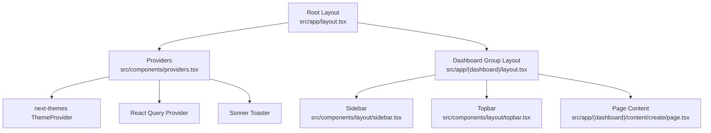
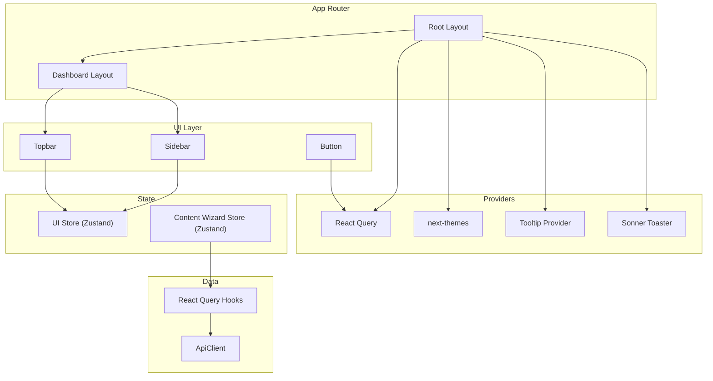
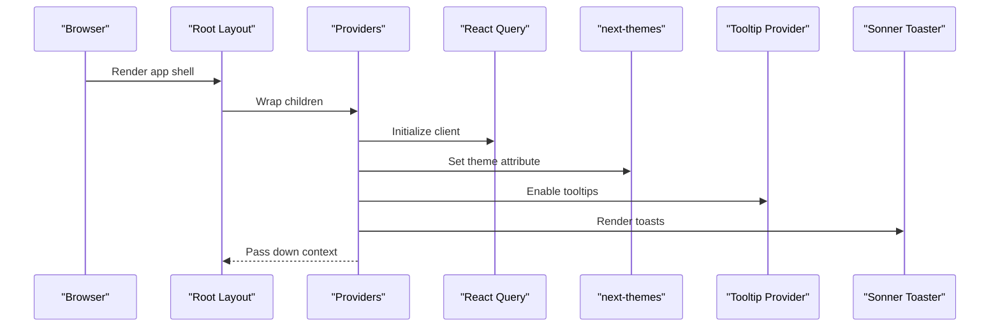
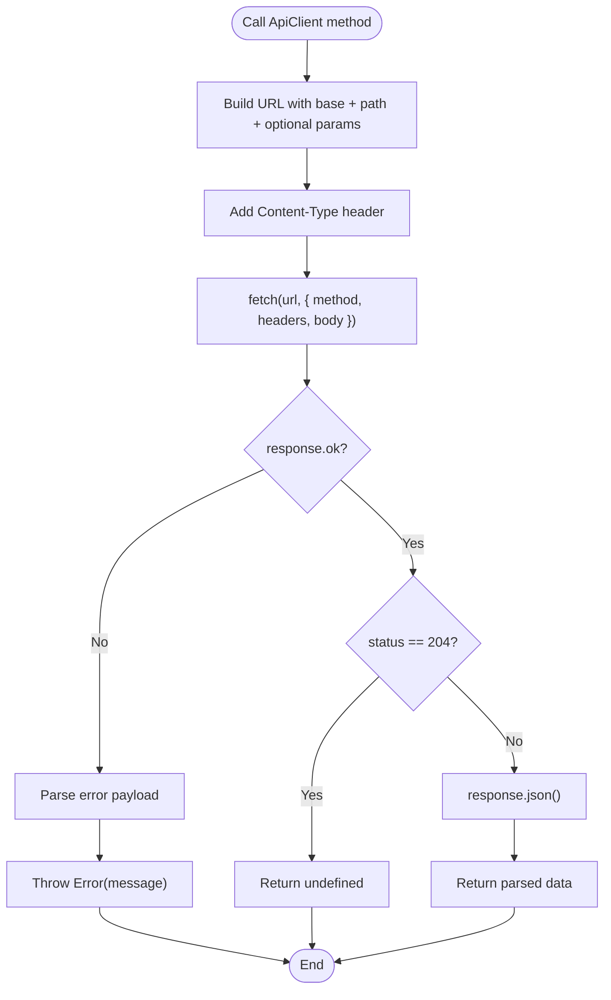
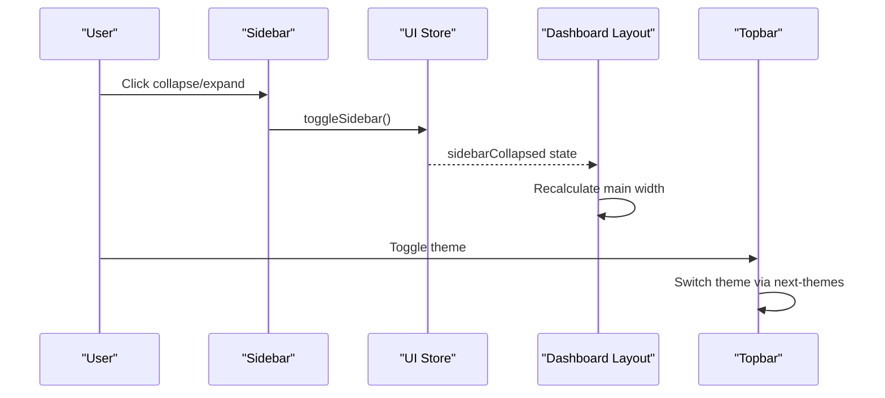
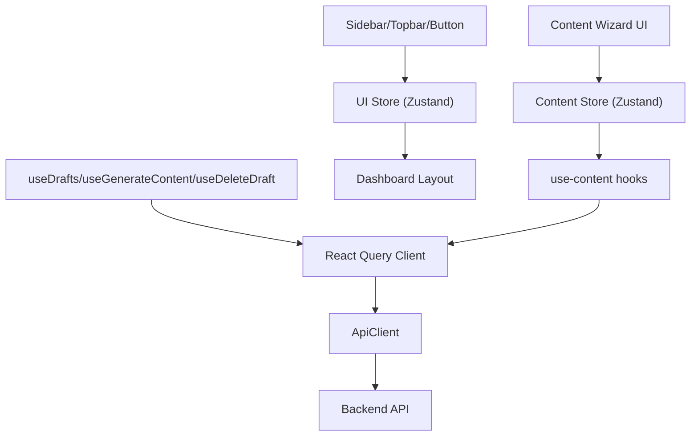
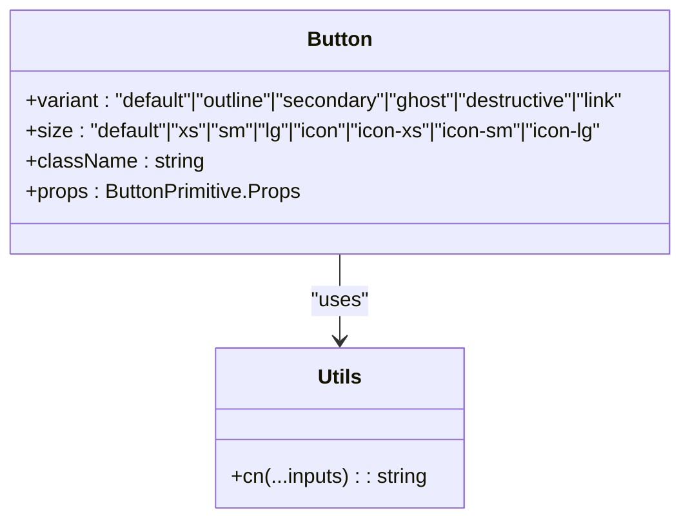
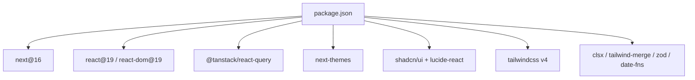

# Frontend Architecture

<cite>
**Referenced Files in This Document**
- [src/app/layout.tsx](file://src/app/layout.tsx)
- [src/app/(dashboard)/layout.tsx](file://src/app/(dashboard)/layout.tsx)
- [src/components/providers.tsx](file://src/components/providers.tsx)
- [src/lib/api.ts](file://src/lib/api.ts)
- [package.json](file://package.json)
- [next.config.ts](file://next.config.ts)
- [tsconfig.json](file://tsconfig.json)
- [src/app/globals.css](file://src/app/globals.css)
- [src/components/ui/button.tsx](file://src/components/ui/button.tsx)
- [src/hooks/use-content.ts](file://src/hooks/use-content.ts)
- [src/stores/content-store.ts](file://src/stores/content-store.ts)
- [src/stores/ui-store.ts](file://src/stores/ui-store.ts)
- [src/components/layout/sidebar.tsx](file://src/components/layout/sidebar.tsx)
- [src/components/layout/topbar.tsx](file://src/components/layout/topbar.tsx)
- [src/app/(dashboard)/content/create/page.tsx](file://src/app/(dashboard)/content/create/page.tsx)
- [src/lib/utils.ts](file://src/lib/utils.ts)
- [src/types/api.ts](file://src/types/api.ts)
</cite>

## Table of Contents
1. [Introduction](#introduction)
2. [Project Structure](#project-structure)
3. [Core Components](#core-components)
4. [Architecture Overview](#architecture-overview)
5. [Detailed Component Analysis](#detailed-component-analysis)
6. [Dependency Analysis](#dependency-analysis)
7. [Performance Considerations](#performance-considerations)
8. [Troubleshooting Guide](#troubleshooting-guide)
9. [Conclusion](#conclusion)
10. [Appendices](#appendices)

## Introduction
This document describes the frontend architecture of Socialium’s Next.js 16 application built with React 19. It covers the App Router configuration, layout hierarchy, navigation patterns, component architecture, state management, API integration, theming, responsive design, accessibility, TypeScript integration, performance optimization, and development workflow.

## Project Structure
The frontend follows Next.js App Router conventions with route groups and nested layouts. The root layout defines global metadata, fonts, and the provider wrapper. The dashboard route group composes the shared sidebar and topbar around page content. UI primitives are modularized under components/ui, while reusable layout components live under components/layout. Hooks encapsulate TanStack Query data fetching, and Zustand stores manage UI and wizard state.



**Diagram sources**
- [src/app/layout.tsx](file://src/app/layout.tsx#L1-L38)
- [src/components/providers.tsx](file://src/components/providers.tsx#L1-L33)
- [src/app/(dashboard)/layout.tsx](file://src/app/(dashboard)/layout.tsx#L1-L24)
- [src/components/layout/sidebar.tsx](file://src/components/layout/sidebar.tsx#L1-L123)
- [src/components/layout/topbar.tsx](file://src/components/layout/topbar.tsx#L1-L76)
- [src/app/(dashboard)/content/create/page.tsx](file://src/app/(dashboard)/content/create/page.tsx#L1-L163)

**Section sources**
- [src/app/layout.tsx](file://src/app/layout.tsx#L1-L38)
- [src/app/(dashboard)/layout.tsx](file://src/app/(dashboard)/layout.tsx#L1-L24)

## Core Components
- Providers: Initializes React Query with caching and retry defaults, sets up theme switching, and wraps tooltips and notifications.
- API Client: Centralized HTTP client with typed methods, header injection, and error extraction.
- UI Primitives: Reusable components like Button, Input, Card, Tabs, and others using class variance authority for variants and Tailwind utilities.
- Hooks: React Query hooks for content drafts, generation, and deletion.
- Stores: Zustand stores for UI state (sidebar collapse) and content creation wizard state.
- Layout: Sidebar with navigation and collapsible behavior; Topbar with theme toggle, search, notifications, and user menu.

**Section sources**
- [src/components/providers.tsx](file://src/components/providers.tsx#L1-L33)
- [src/lib/api.ts](file://src/lib/api.ts#L1-L69)
- [src/components/ui/button.tsx](file://src/components/ui/button.tsx#L1-L59)
- [src/hooks/use-content.ts](file://src/hooks/use-content.ts#L1-L30)
- [src/stores/ui-store.ts](file://src/stores/ui-store.ts#L1-L16)
- [src/stores/content-store.ts](file://src/stores/content-store.ts#L1-L62)
- [src/components/layout/sidebar.tsx](file://src/components/layout/sidebar.tsx#L1-L123)
- [src/components/layout/topbar.tsx](file://src/components/layout/topbar.tsx#L1-L76)

## Architecture Overview
The architecture centers on:
- App Router with nested layouts and route groups for dashboards.
- Provider pattern for global state and services.
- Component-driven UI with shadcn/ui primitives and Base UI.
- Data fetching via React Query with centralized API client.
- UI state via Zustand stores for lightweight local state.
- Theming and typography via next-themes and Google Fonts.



**Diagram sources**
- [src/app/layout.tsx](file://src/app/layout.tsx#L1-L38)
- [src/app/(dashboard)/layout.tsx](file://src/app/(dashboard)/layout.tsx#L1-L24)
- [src/components/providers.tsx](file://src/components/providers.tsx#L1-L33)
- [src/components/ui/button.tsx](file://src/components/ui/button.tsx#L1-L59)
- [src/components/layout/sidebar.tsx](file://src/components/layout/sidebar.tsx#L1-L123)
- [src/components/layout/topbar.tsx](file://src/components/layout/topbar.tsx#L1-L76)
- [src/stores/ui-store.ts](file://src/stores/ui-store.ts#L1-L16)
- [src/stores/content-store.ts](file://src/stores/content-store.ts#L1-L62)
- [src/lib/api.ts](file://src/lib/api.ts#L1-L69)
- [src/hooks/use-content.ts](file://src/hooks/use-content.ts#L1-L30)

## Detailed Component Analysis

### Providers and Global Setup
- React Query client configured with a stale time and retry policy.
- ThemeProvider supports system preference and disables transition on theme change.
- TooltipProvider and Sonner Toaster provide accessible tooltips and toast notifications.



**Diagram sources**
- [src/app/layout.tsx](file://src/app/layout.tsx#L21-L37)
- [src/components/providers.tsx](file://src/components/providers.tsx#L9-L32)

**Section sources**
- [src/components/providers.tsx](file://src/components/providers.tsx#L1-L33)
- [src/app/layout.tsx](file://src/app/layout.tsx#L1-L38)

### API Integration Layer
- Centralized ApiClient with typed methods for GET, POST, PUT, PATCH, DELETE.
- Automatic JSON serialization and deserialization.
- Error handling extracts error messages from responses and throws errors.
- Environment-based base URL for API endpoint configuration.



**Diagram sources**
- [src/lib/api.ts](file://src/lib/api.ts#L20-L45)

**Section sources**
- [src/lib/api.ts](file://src/lib/api.ts#L1-L69)

### Navigation and Layout Patterns
- Dashboard layout composes Sidebar and Topbar, dynamically adjusting main content width based on sidebar collapse state.
- Sidebar renders navigation items, highlights active routes, and supports collapsing with tooltips.
- Topbar controls sidebar toggle, theme switching, search input, notifications, and user dropdown.



**Diagram sources**
- [src/components/layout/sidebar.tsx](file://src/components/layout/sidebar.tsx#L42-L122)
- [src/stores/ui-store.ts](file://src/stores/ui-store.ts#L11-L15)
- [src/app/(dashboard)/layout.tsx](file://src/app/(dashboard)/layout.tsx#L7-L23)
- [src/components/layout/topbar.tsx](file://src/components/layout/topbar.tsx#L18-L75)

**Section sources**
- [src/app/(dashboard)/layout.tsx](file://src/app/(dashboard)/layout.tsx#L1-L24)
- [src/components/layout/sidebar.tsx](file://src/components/layout/sidebar.tsx#L1-L123)
- [src/components/layout/topbar.tsx](file://src/components/layout/topbar.tsx#L1-L76)
- [src/stores/ui-store.ts](file://src/stores/ui-store.ts#L1-L16)

### State Management Patterns
- React Query: Data fetching and mutations for content drafts, generation, and deletion with automatic cache invalidation.
- Zustand: Lightweight UI and wizard state stores for sidebar collapse and content creation steps.



**Diagram sources**
- [src/hooks/use-content.ts](file://src/hooks/use-content.ts#L7-L29)
- [src/lib/api.ts](file://src/lib/api.ts#L47-L65)
- [src/stores/ui-store.ts](file://src/stores/ui-store.ts#L11-L15)
- [src/stores/content-store.ts](file://src/stores/content-store.ts#L44-L61)
- [src/app/(dashboard)/layout.tsx](file://src/app/(dashboard)/layout.tsx#L7-L23)

**Section sources**
- [src/hooks/use-content.ts](file://src/hooks/use-content.ts#L1-L30)
- [src/stores/content-store.ts](file://src/stores/content-store.ts#L1-L62)
- [src/stores/ui-store.ts](file://src/stores/ui-store.ts#L1-L16)

### UI Component Architecture
- Button component uses class variance authority to define variants and sizes, combined with Tailwind utilities and cn helper.
- Other UI primitives (Input, Card, Tabs, Select, Checkbox, etc.) follow similar patterns for consistency and extensibility.



**Diagram sources**
- [src/components/ui/button.tsx](file://src/components/ui/button.tsx#L43-L56)
- [src/lib/utils.ts](file://src/lib/utils.ts#L4-L6)

**Section sources**
- [src/components/ui/button.tsx](file://src/components/ui/button.tsx#L1-L59)
- [src/lib/utils.ts](file://src/lib/utils.ts#L1-L7)

### Example Page: Content Creation Wizard
- Multi-step wizard with state transitions, platform selection, and generation trigger.
- Uses UI primitives and links to navigate between steps and back to the content list.

```mermaid
sequenceDiagram
participant User as "User"
participant Page as "Create Content Page"
participant UI as "UI Primitives"
participant Store as "Content Store"
participant Hooks as "use-content Hooks"
User->>Page : Open /content/create
Page->>UI : Render step indicators and forms
User->>Page : Change step
Page->>Store : Update wizard state
User->>Page : Submit generation
Page->>Hooks : Trigger useGenerateContent
Hooks->>API["ApiClient.post('/content/generate')"]
API-->>Hooks : Draft[]
Hooks-->>Page : Invalidate and refetch drafts
```

**Diagram sources**
- [src/app/(dashboard)/content/create/page.tsx](file://src/app/(dashboard)/content/create/page.tsx#L29-L162)
- [src/stores/content-store.ts](file://src/stores/content-store.ts#L44-L61)
- [src/hooks/use-content.ts](file://src/hooks/use-content.ts#L15-L21)
- [src/lib/api.ts](file://src/lib/api.ts#L51-L53)

**Section sources**
- [src/app/(dashboard)/content/create/page.tsx](file://src/app/(dashboard)/content/create/page.tsx#L1-L163)
- [src/stores/content-store.ts](file://src/stores/content-store.ts#L1-L62)
- [src/hooks/use-content.ts](file://src/hooks/use-content.ts#L1-L30)

## Dependency Analysis
External dependencies include Next.js, React 19, React Query, next-themes, shadcn/ui, Tailwind, and related utilities. The project uses bundler module resolution and path aliases for clean imports.



**Diagram sources**
- [package.json](file://package.json#L11-L32)

**Section sources**
- [package.json](file://package.json#L1-L45)
- [tsconfig.json](file://tsconfig.json#L21-L23)

## Performance Considerations
- React Query caching: staleTime reduces redundant network requests; retry avoids transient failures.
- Code splitting: Next.js App Router naturally splits pages and route groups.
- Lightweight stores: Zustand minimizes re-renders compared to heavier state libraries.
- CSS-in-JS tokens: Tailwind-based theme tokens reduce runtime style computation.
- Font optimization: Preloaded Google Fonts via next/font.
- Image optimization: Next/image available through standard usage patterns.

[No sources needed since this section provides general guidance]

## Troubleshooting Guide
- API errors: ApiClient throws on non-OK responses; inspect thrown error messages for actionable feedback.
- Authentication: Token handling is currently a TODO in the API client; ensure proper token injection when implemented.
- Hydration warnings: Root layout suppresses hydration warnings for smoother initial render.
- Theme transitions: next-themes disables transition-on-change to avoid FOUC during SSR.

**Section sources**
- [src/lib/api.ts](file://src/lib/api.ts#L38-L41)
- [src/app/layout.tsx](file://src/app/layout.tsx#L29-L29)
- [src/components/providers.tsx](file://src/components/providers.tsx#L24-L24)

## Conclusion
Socialium’s frontend leverages Next.js 16’s App Router for structured layouts, React 19 for component rendering, and a provider-first architecture for global services. React Query and Zustand deliver efficient data and UI state management, while shadcn/ui and Tailwind enable rapid, accessible UI development. The API client centralizes HTTP concerns with typed responses and robust error handling. Together, these patterns support scalability, maintainability, and a strong developer experience.

[No sources needed since this section summarizes without analyzing specific files]

## Appendices

### Theme Provider Setup and Responsive Design
- Theme tokens and variants defined in global CSS integrate with next-themes for system-aware theming.
- Tailwind utilities and CSS variables ensure responsive breakpoints and adaptive UI.

**Section sources**
- [src/app/globals.css](file://src/app/globals.css#L1-L130)
- [src/components/providers.tsx](file://src/components/providers.tsx#L24-L24)

### Accessibility Compliance Notes
- Focus-visible ring styles and outline tokens improve keyboard navigation visibility.
- TooltipProvider and aria-* attributes in UI components support assistive technologies.
- Semantic HTML and role usage in layout components enhance screen reader compatibility.

**Section sources**
- [src/components/ui/button.tsx](file://src/components/ui/button.tsx#L6-L41)
- [src/components/layout/sidebar.tsx](file://src/components/layout/sidebar.tsx#L64-L98)

### TypeScript Integration
- Path aliases simplify imports and improve DX.
- Strict compiler options and incremental builds optimize type checking performance.
- Type-safe API client and typed responses enforce correctness across modules.

**Section sources**
- [tsconfig.json](file://tsconfig.json#L21-L23)
- [src/types/api.ts](file://src/types/api.ts#L1-L145)

### Development Workflow
- Hot reload via Next.js dev server.
- ESLint and TypeScript configurations integrated for linting and type checks.
- Environment variables for API base URL and local development.

**Section sources**
- [package.json](file://package.json#L5-L10)
- [src/lib/api.ts](file://src/lib/api.ts#L3-L3)
- [next.config.ts](file://next.config.ts#L1-L8)