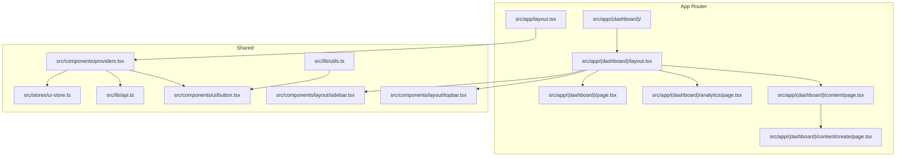
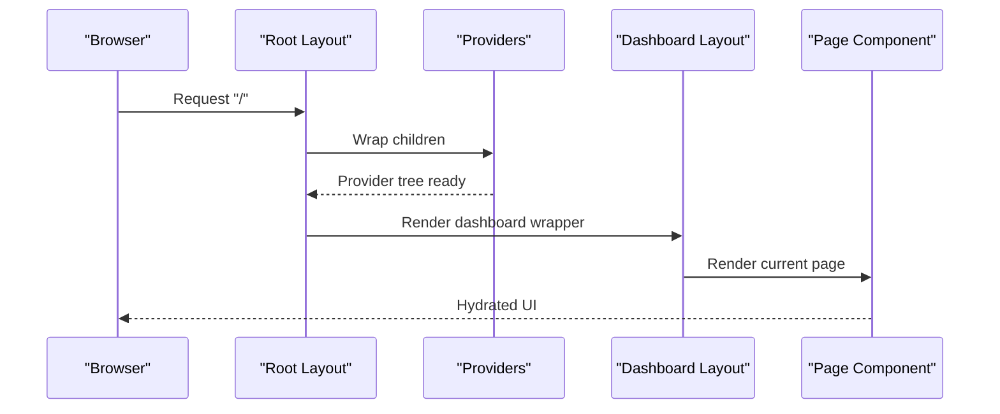
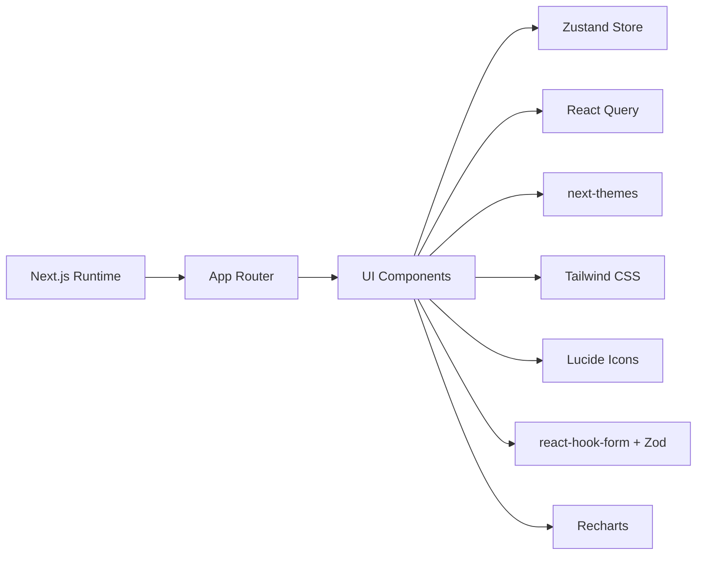

# Next.js Application Structure

<cite>
**Referenced Files in This Document**
- [package.json](file://frontend/package.json)
- [next.config.ts](file://frontend/next.config.ts)
- [tsconfig.json](file://frontend/tsconfig.json)
- [src/app/layout.tsx](file://frontend/src/app/layout.tsx)
- [src/app/(dashboard)/layout.tsx](file://frontend/src/app/(dashboard)/layout.tsx)
- [src/app/(dashboard)/page.tsx](file://frontend/src/app/(dashboard)/page.tsx)
- [src/app/(dashboard)/analytics/page.tsx](file://frontend/src/app/(dashboard)/analytics/page.tsx)
- [src/app/(dashboard)/content/page.tsx](file://frontend/src/app/(dashboard)/content/page.tsx)
- [src/app/(dashboard)/content/create/page.tsx](file://frontend/src/app/(dashboard)/content/create/page.tsx)
- [src/components/layout/sidebar.tsx](file://frontend/src/components/layout/sidebar.tsx)
- [src/components/layout/topbar.tsx](file://frontend/src/components/layout/topbar.tsx)
- [src/components/providers.tsx](file://frontend/src/components/providers.tsx)
- [src/stores/ui-store.ts](file://frontend/src/stores/ui-store.ts)
- [src/lib/utils.ts](file://frontend/src/lib/utils.ts)
- [src/lib/api.ts](file://frontend/src/lib/api.ts)
- [src/components/ui/button.tsx](file://frontend/src/components/ui/button.tsx)
</cite>

## Table of Contents
1. [Introduction](#introduction)
2. [Project Structure](#project-structure)
3. [Core Components](#core-components)
4. [Architecture Overview](#architecture-overview)
5. [Detailed Component Analysis](#detailed-component-analysis)
6. [Dependency Analysis](#dependency-analysis)
7. [Performance Considerations](#performance-considerations)
8. [Troubleshooting Guide](#troubleshooting-guide)
9. [Conclusion](#conclusion)

## Introduction
This document explains the Next.js 16 application structure for Socialium’s frontend. It covers the App Router configuration, file-based routing patterns, layout hierarchy, root layout setup with fonts and metadata, dashboard layout organization, nested routing, page component structure, build configuration, TypeScript integration, development server setup, route groups, and practical performance strategies such as automatic code splitting, static generation, dynamic imports, asset optimization, and font loading.

## Project Structure
The frontend is organized under the Next.js App Router convention. Key areas:
- Root application layout and global metadata
- Dashboard route group with nested pages
- Shared UI components and providers
- Stores and utilities for state and API access
- Tailwind CSS and TypeScript configuration

**Diagram sources**
- [src/app/layout.tsx](file://frontend/src/app/layout.tsx#L1-L38)
- [src/app/(dashboard)/layout.tsx](file://frontend/src/app/(dashboard)/layout.tsx#L1-L24)
- [src/app/(dashboard)/page.tsx](file://frontend/src/app/(dashboard)/page.tsx#L1-L136)
- [src/app/(dashboard)/analytics/page.tsx](file://frontend/src/app/(dashboard)/analytics/page.tsx#L1-L53)
- [src/app/(dashboard)/content/page.tsx](file://frontend/src/app/(dashboard)/content/page.tsx#L1-L113)
- [src/app/(dashboard)/content/create/page.tsx](file://frontend/src/app/(dashboard)/content/create/page.tsx#L1-L163)
- [src/components/providers.tsx](file://frontend/src/components/providers.tsx#L1-L33)
- [src/components/layout/sidebar.tsx](file://frontend/src/components/layout/sidebar.tsx#L1-L123)
- [src/components/layout/topbar.tsx](file://frontend/src/components/layout/topbar.tsx#L1-L76)
- [src/stores/ui-store.ts](file://frontend/src/stores/ui-store.ts#L1-L16)
- [src/lib/utils.ts](file://frontend/src/lib/utils.ts#L1-L7)
- [src/lib/api.ts](file://frontend/src/lib/api.ts#L1-L69)
- [src/components/ui/button.tsx](file://frontend/src/components/ui/button.tsx#L1-L59)

**Section sources**
- [package.json](file://frontend/package.json#L1-L45)
- [next.config.ts](file://frontend/next.config.ts#L1-L8)
- [tsconfig.json](file://frontend/tsconfig.json#L1-L35)

## Core Components
- Root layout defines HTML structure, metadata, font loading, and provider wrapping for the entire app.
- Dashboard route group encapsulates authenticated, navigable sections with a shared layout.
- Providers configure React Query, theme switching, tooltips, and toast notifications.
- UI store manages collapsible sidebar state and is consumed by layout components.
- Utilities consolidate Tailwind class merging and shared helpers.
- API client abstracts HTTP requests with typed methods and centralized error handling.

**Section sources**
- [src/app/layout.tsx](file://frontend/src/app/layout.tsx#L1-L38)
- [src/app/(dashboard)/layout.tsx](file://frontend/src/app/(dashboard)/layout.tsx#L1-L24)
- [src/components/providers.tsx](file://frontend/src/components/providers.tsx#L1-L33)
- [src/stores/ui-store.ts](file://frontend/src/stores/ui-store.ts#L1-L16)
- [src/lib/utils.ts](file://frontend/src/lib/utils.ts#L1-L7)
- [src/lib/api.ts](file://frontend/src/lib/api.ts#L1-L69)

## Architecture Overview
The application follows Next.js App Router conventions:
- Root layout sets HTML attributes, metadata, fonts, and wraps children with providers.
- Route groups segment the dashboard area, enabling nested routing without affecting URLs.
- Dashboard layout composes a persistent sidebar and topbar around page content.
- Pages render UI using shared components and local state.

**Diagram sources**
- [src/app/layout.tsx](file://frontend/src/app/layout.tsx#L21-L37)
- [src/components/providers.tsx](file://frontend/src/components/providers.tsx#L9-L32)
- [src/app/(dashboard)/layout.tsx](file://frontend/src/app/(dashboard)/layout.tsx#L7-L23)
- [src/app/(dashboard)/page.tsx](file://frontend/src/app/(dashboard)/page.tsx#L31-L135)

## Detailed Component Analysis

### Root Layout and Metadata
- Defines metadata for title and description.
- Loads Google Fonts via next/font and applies CSS variables to html element.
- Wraps children with Providers to initialize theme, query client, tooltips, and toasts.
- Suppresses hydration warnings at the root level.

**Section sources**
- [src/app/layout.tsx](file://frontend/src/app/layout.tsx#L1-L38)

### Dashboard Route Group and Nested Routing
- The route group (dashboard) organizes related pages without altering URLs.
- Nested pages include analytics, approvals, calendar, content, memory, platforms, scheduling, and settings.
- The dashboard layout composes Sidebar and Topbar and renders child pages in a main area.

**Section sources**
- [src/app/(dashboard)/layout.tsx](file://frontend/src/app/(dashboard)/layout.tsx#L1-L24)
- [src/app/(dashboard)/page.tsx](file://frontend/src/app/(dashboard)/page.tsx#L1-L136)
- [src/app/(dashboard)/analytics/page.tsx](file://frontend/src/app/(dashboard)/analytics/page.tsx#L1-L53)
- [src/app/(dashboard)/content/page.tsx](file://frontend/src/app/(dashboard)/content/page.tsx#L1-L113)
- [src/app/(dashboard)/content/create/page.tsx](file://frontend/src/app/(dashboard)/content/create/page.tsx#L1-L163)

### Dashboard Layout Composition
- Uses a client-side layout to manage sidebar collapse state via a Zustand store.
- Applies responsive width transitions based on sidebar state.
- Renders Topbar and main content area with padding and background classes.

**Section sources**
- [src/app/(dashboard)/layout.tsx](file://frontend/src/app/(dashboard)/layout.tsx#L1-L24)
- [src/stores/ui-store.ts](file://frontend/src/stores/ui-store.ts#L1-L16)

### Sidebar Navigation
- Renders navigation items with icons and labels.
- Highlights active item based on pathname and supports collapsed mode with tooltips.
- Integrates with the UI store to toggle sidebar state.

**Section sources**
- [src/components/layout/sidebar.tsx](file://frontend/src/components/layout/sidebar.tsx#L1-L123)
- [src/stores/ui-store.ts](file://frontend/src/stores/ui-store.ts#L1-L16)

### Topbar Controls
- Provides search input, theme toggle, notifications, and user menu.
- Uses next-themes for theme switching and dropdown menus for account actions.

**Section sources**
- [src/components/layout/topbar.tsx](file://frontend/src/components/layout/topbar.tsx#L1-L76)

### Providers and Global State
- Initializes React Query with default caching and retry policies.
- Wraps the app with ThemeProvider for light/dark/system themes.
- Enables TooltipProvider for UI affordances and renders Toaster for notifications.
- Exposes a shared API client instance for typed HTTP requests.

**Section sources**
- [src/components/providers.tsx](file://frontend/src/components/providers.tsx#L1-L33)
- [src/lib/api.ts](file://frontend/src/lib/api.ts#L1-L69)

### Utility and Component Libraries
- Utility function merges Tailwind classes safely.
- Base button component uses variant and size styles with class variance authority.
- Shared UI components are used across pages for forms, tables, cards, and inputs.

**Section sources**
- [src/lib/utils.ts](file://frontend/src/lib/utils.ts#L1-L7)
- [src/components/ui/button.tsx](file://frontend/src/components/ui/button.tsx#L1-L59)

### Build Configuration and TypeScript Integration
- Next.js 16 is configured via next.config.ts (empty default).
- TypeScript compiler options target modern JS, strict checks, bundler resolution, and path aliases.
- Scripts define dev, build, start, and lint commands.

**Section sources**
- [next.config.ts](file://frontend/next.config.ts#L1-L8)
- [tsconfig.json](file://frontend/tsconfig.json#L1-L35)
- [package.json](file://frontend/package.json#L5-L10)

### Development Server Setup
- Dev command starts Next.js dev server.
- Environment variables are loaded from .env.local.example; production builds use NEXT_PUBLIC_* for client consumption.

**Section sources**
- [package.json](file://frontend/package.json#L5-L10)

### Route Groups, Parallel Routes, and Intercepting Routes
- Route groups: The (dashboard) group segments dashboard pages without changing URLs.
- Parallel routes: Not implemented in the current structure.
- Intercepting routes: Not implemented in the current structure.

**Section sources**
- [src/app/(dashboard)/layout.tsx](file://frontend/src/app/(dashboard)/layout.tsx#L1-L24)

### Page Component Structure Examples
- Dashboard root page displays metrics, upcoming content preview, and recent activity.
- Analytics page shows KPI cards and a placeholder chart area.
- Content library page lists posts with status badges and action dropdowns.
- Create content page implements a multi-step wizard with tabs and platform selection.

**Section sources**
- [src/app/(dashboard)/page.tsx](file://frontend/src/app/(dashboard)/page.tsx#L1-L136)
- [src/app/(dashboard)/analytics/page.tsx](file://frontend/src/app/(dashboard)/analytics/page.tsx#L1-L53)
- [src/app/(dashboard)/content/page.tsx](file://frontend/src/app/(dashboard)/content/page.tsx#L1-L113)
- [src/app/(dashboard)/content/create/page.tsx](file://frontend/src/app/(dashboard)/content/create/page.tsx#L1-L163)

## Dependency Analysis
The application leverages a cohesive set of libraries:
- Next.js runtime and App Router
- UI primitives and design system components
- State management via Zustand
- Data fetching via React Query
- Theming via next-themes
- Styling via Tailwind CSS and class merging utilities
- Icons via Lucide React
- Form handling via react-hook-form and Zod
- Charts via Recharts

**Diagram sources**
- [package.json](file://frontend/package.json#L11-L32)

**Section sources**
- [package.json](file://frontend/package.json#L11-L32)

## Performance Considerations
- Automatic code splitting: Next.js splits routes by default; route groups and nested pages benefit from this without manual configuration.
- Static generation: Pages can opt into static generation or server-side rendering depending on data needs; current pages are client-rendered.
- Dynamic imports: Use dynamic imports for heavy components or charts to reduce initial bundle size.
- Asset optimization: Next.js Image component and optimized static assets are recommended for images.
- Font loading: next/font preloads fonts; avoid extra font loads in pages.
- Client components: Mark only interactive components as "use client" to minimize server rendering overhead.
- Caching: Configure React Query cache policies and stale times appropriately.

[No sources needed since this section provides general guidance]

## Troubleshooting Guide
- Hydration mismatch: Occurs when SSR vs client markup differs; suppress only at root when necessary and ensure consistent server/client rendering.
- API errors: Centralized API client throws on non-OK responses; check network tab and server logs.
- Theme switching: Verify next-themes provider is initialized and attribute is set to class.
- Navigation highlighting: Ensure pathname comparisons match expected routes; adjust sidebar logic if URL structure changes.
- Missing environment variables: Confirm NEXT_PUBLIC_API_URL is present in the runtime environment.

**Section sources**
- [src/app/layout.tsx](file://frontend/src/app/layout.tsx#L27-L30)
- [src/lib/api.ts](file://frontend/src/lib/api.ts#L38-L44)
- [src/components/providers.tsx](file://frontend/src/components/providers.tsx#L24-L24)
- [src/components/layout/sidebar.tsx](file://frontend/src/components/layout/sidebar.tsx#L65-L68)

## Conclusion
Socialium’s Next.js application follows modern App Router conventions with a clear separation between root layout, route groups, and page components. The dashboard layout composes persistent UI elements with nested pages, while providers and stores manage global state and data fetching. With next/font for typography, React Query for caching, and Tailwind for styling, the app balances developer productivity and performance. Extending the structure with static generation, dynamic imports, and optimized assets will further improve performance and scalability.