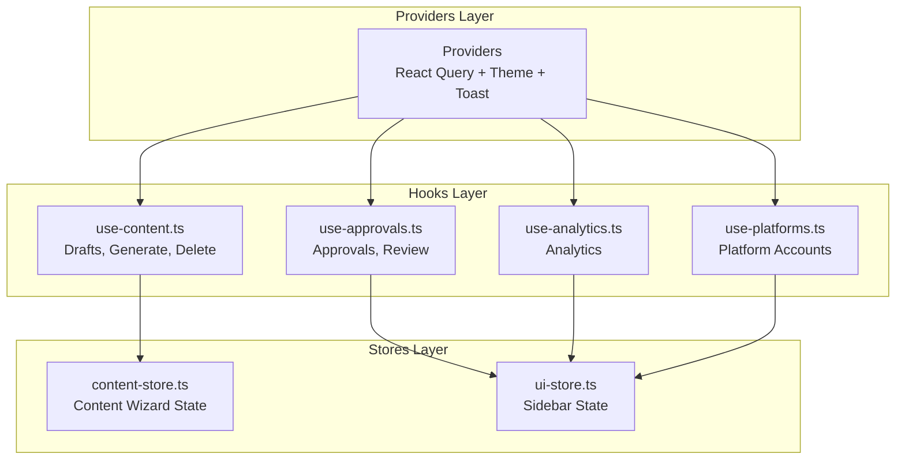
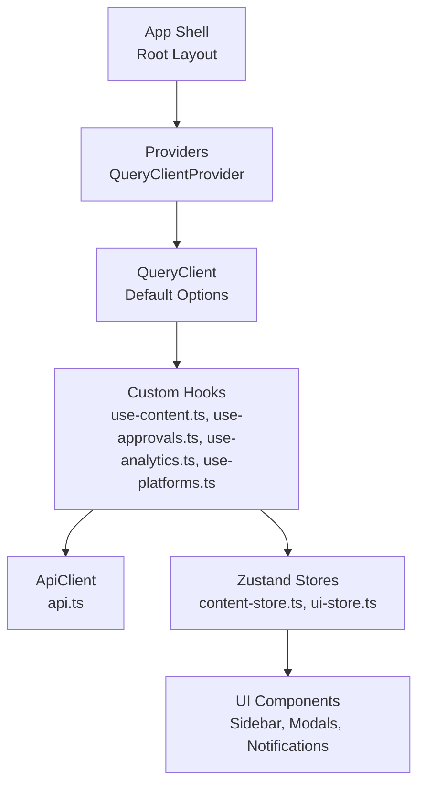
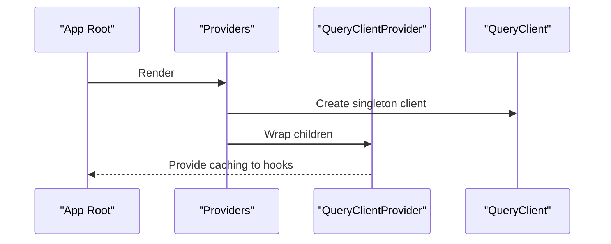
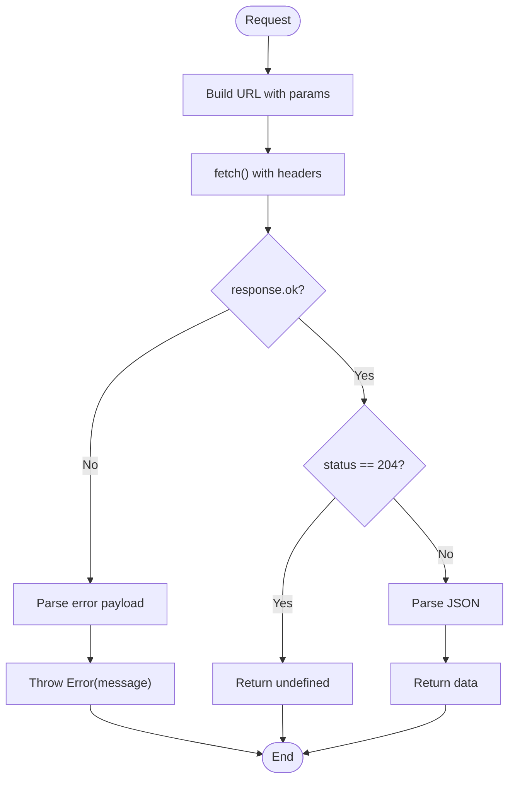
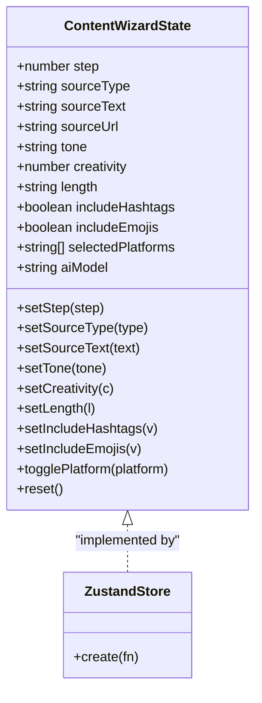
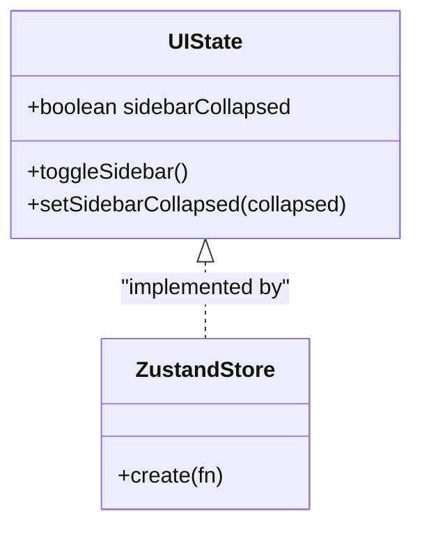
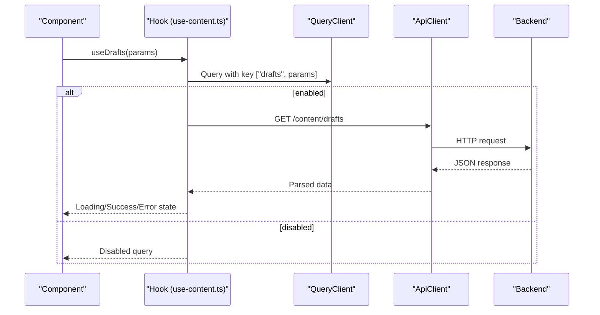
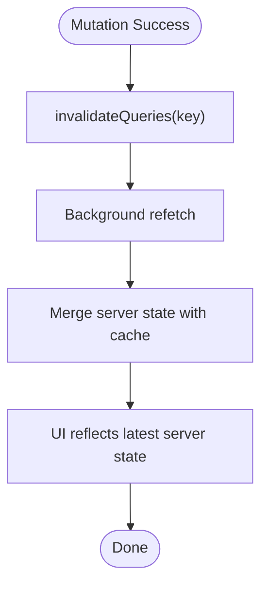
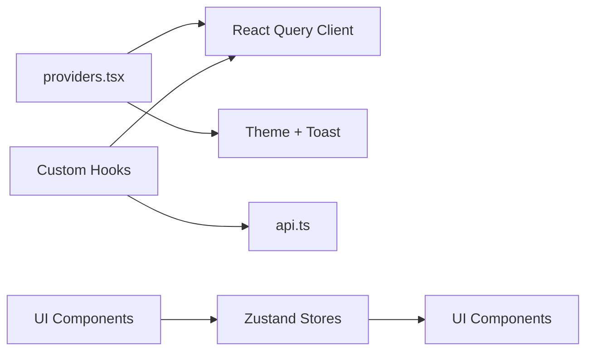

# State Management Patterns

<cite>
**Referenced Files in This Document**
- [providers.tsx](file://frontend/src/components/providers.tsx)
- [api.ts](file://frontend/src/lib/api.ts)
- [content-store.ts](file://frontend/src/stores/content-store.ts)
- [ui-store.ts](file://frontend/src/stores/ui-store.ts)
- [use-content.ts](file://frontend/src/hooks/use-content.ts)
- [use-analytics.ts](file://frontend/src/hooks/use-analytics.ts)
- [use-approvals.ts](file://frontend/src/hooks/use-approvals.ts)
- [use-platforms.ts](file://frontend/src/hooks/use-platforms.ts)
- [layout.tsx](file://frontend/src/app/layout.tsx)
- [page.tsx](file://frontend/src/app/(dashboard)/content/create/page.tsx)
- [page.tsx](file://frontend/src/app/(dashboard)/content/page.tsx)
- [api.ts](file://frontend/src/types/api.ts)
</cite>

## Table of Contents
1. [Introduction](#introduction)
2. [Project Structure](#project-structure)
3. [Core Components](#core-components)
4. [Architecture Overview](#architecture-overview)
5. [Detailed Component Analysis](#detailed-component-analysis)
6. [Dependency Analysis](#dependency-analysis)
7. [Performance Considerations](#performance-considerations)
8. [Troubleshooting Guide](#troubleshooting-guide)
9. [Conclusion](#conclusion)

## Introduction
This document explains Socialium’s state management approach, which combines React Query for server state and custom Zustand stores for client state. It focuses on:
- The content store for managing AI-generated content and drafts with optimistic updates and conflict resolution
- The UI store for application-wide UI state (modals, notifications, layout preferences)
- Custom hooks for data fetching, caching, and real-time updates
- React Query configuration, caching strategies, and error handling
- Examples of optimistic updates, background refetching, and cache invalidation patterns
- State synchronization between local and server state, performance optimization via selective re-renders, and debugging techniques

## Project Structure
The frontend organizes state management across three layers:
- Providers layer initializes React Query and global UI providers
- Hooks layer encapsulates TanStack React Query queries and mutations
- Stores layer encapsulates Zustand-based client-side state

**Diagram sources**
- [providers.tsx](file://frontend/src/components/providers.tsx#L9-L32)
- [use-content.ts](file://frontend/src/hooks/use-content.ts#L7-L30)
- [use-approvals.ts](file://frontend/src/hooks/use-approvals.ts#L7-L23)
- [use-analytics.ts](file://frontend/src/hooks/use-analytics.ts#L7-L14)
- [use-platforms.ts](file://frontend/src/hooks/use-platforms.ts#L7-L14)
- [content-store.ts](file://frontend/src/stores/content-store.ts#L44-L62)
- [ui-store.ts](file://frontend/src/stores/ui-store.ts#L11-L16)

**Section sources**
- [providers.tsx](file://frontend/src/components/providers.tsx#L9-L32)
- [layout.tsx](file://frontend/src/app/layout.tsx#L21-L37)

## Core Components
- React Query Provider with default caching and retry policies
- Typed API client for robust request/response handling
- Content wizard store for authoring AI content
- UI store for layout preferences and toggles

Key responsibilities:
- React Query provider centralizes caching, retries, and background refetching
- API client enforces typed requests and standardized error handling
- Content store manages multi-step authoring flow and platform selection
- UI store manages sidebar state and other UI preferences

**Section sources**
- [providers.tsx](file://frontend/src/components/providers.tsx#L10-L20)
- [api.ts](file://frontend/src/lib/api.ts#L5-L69)
- [content-store.ts](file://frontend/src/stores/content-store.ts#L5-L62)
- [ui-store.ts](file://frontend/src/stores/ui-store.ts#L5-L16)

## Architecture Overview
The state architecture separates concerns:
- Server state: managed by React Query with automatic caching and invalidation
- Client state: managed by Zustand stores for fast, granular updates
- UI state: centralized in the UI store for consistent layout behavior
- Data fetching: encapsulated in dedicated hooks for reuse and testability

**Diagram sources**
- [layout.tsx](file://frontend/src/app/layout.tsx#L21-L37)
- [providers.tsx](file://frontend/src/components/providers.tsx#L9-L32)
- [use-content.ts](file://frontend/src/hooks/use-content.ts#L7-L30)
- [use-approvals.ts](file://frontend/src/hooks/use-approvals.ts#L7-L23)
- [use-analytics.ts](file://frontend/src/hooks/use-analytics.ts#L7-L14)
- [use-platforms.ts](file://frontend/src/hooks/use-platforms.ts#L7-L14)
- [api.ts](file://frontend/src/lib/api.ts#L5-L69)
- [content-store.ts](file://frontend/src/stores/content-store.ts#L44-L62)
- [ui-store.ts](file://frontend/src/stores/ui-store.ts#L11-L16)

## Detailed Component Analysis

### React Query Provider and Configuration
- Initializes a singleton QueryClient with default options
- Sets staleTime and retry policies for efficient caching and resilience
- Wraps the app tree to enable query/mutation caching across components

**Diagram sources**
- [providers.tsx](file://frontend/src/components/providers.tsx#L9-L32)

**Section sources**
- [providers.tsx](file://frontend/src/components/providers.tsx#L10-L20)

### Typed API Client
- Centralized HTTP client with typed methods for GET, POST, PUT, PATCH, DELETE
- Builds URLs with query parameters and attaches JSON headers
- Handles non-OK responses by parsing error messages and throwing errors
- Supports 204 No Content responses

**Diagram sources**
- [api.ts](file://frontend/src/lib/api.ts#L20-L69)

**Section sources**
- [api.ts](file://frontend/src/lib/api.ts#L5-L69)

### Content Store (Authoring Wizard)
- Manages multi-step authoring flow for AI-generated content
- Tracks step, source type, source text/url, tone, creativity, length, hashtags, emojis, selected platforms, and AI model
- Provides setters for each field and a reset function
- Toggle helper for platform selection

**Diagram sources**
- [content-store.ts](file://frontend/src/stores/content-store.ts#L5-L62)

**Section sources**
- [content-store.ts](file://frontend/src/stores/content-store.ts#L5-L62)
- [page.tsx](file://frontend/src/app/(dashboard)/content/create/page.tsx#L29-L163)

### UI Store (Layout and Preferences)
- Tracks whether the sidebar is collapsed
- Provides toggle and setter functions for sidebar state

**Diagram sources**
- [ui-store.ts](file://frontend/src/stores/ui-store.ts#L5-L16)

**Section sources**
- [ui-store.ts](file://frontend/src/stores/ui-store.ts#L5-L16)

### Custom Hooks for Data Fetching and Mutations
- useDrafts: paginated drafts with enabled guard and query key
- useGenerateContent: mutation to generate content; invalidates drafts on success
- useDeleteDraft: mutation to delete a draft; invalidates drafts on success
- useApprovals: pending approvals with enabled guard and query key; review mutation with invalidation
- useAnalytics: analytics overview keyed by workspace
- usePlatforms: platform accounts keyed by workspace

**Diagram sources**
- [use-content.ts](file://frontend/src/hooks/use-content.ts#L7-L13)
- [api.ts](file://frontend/src/lib/api.ts#L47-L69)

**Section sources**
- [use-content.ts](file://frontend/src/hooks/use-content.ts#L7-L30)
- [use-approvals.ts](file://frontend/src/hooks/use-approvals.ts#L7-L23)
- [use-analytics.ts](file://frontend/src/hooks/use-analytics.ts#L7-L14)
- [use-platforms.ts](file://frontend/src/hooks/use-platforms.ts#L7-L14)
- [api.ts](file://frontend/src/lib/api.ts#L5-L69)
- [api.ts](file://frontend/src/types/api.ts#L36-L66)

### Optimistic Updates and Conflict Resolution
- Optimistic updates pattern:
  - On successful mutation, invalidate the affected query keys to trigger background refetch
  - Local UI reflects immediate change; server reconciliation occurs on next fetch
- Conflict resolution:
  - After invalidation, React Query refetches data; server state supersedes local optimistic updates if diverged

Recommended patterns:
- For create/update/delete operations, call invalidateQueries on the affected resource key
- Use enabled guards to prevent unnecessary network calls until dependencies are ready

**Section sources**
- [use-content.ts](file://frontend/src/hooks/use-content.ts#L17-L21)
- [use-content.ts](file://frontend/src/hooks/use-content.ts#L23-L29)
- [use-approvals.ts](file://frontend/src/hooks/use-approvals.ts#L15-L22)

### Background Refetching and Cache Invalidation
- Stale-time policy ensures fresh data without blocking UI
- Retry policy handles transient failures gracefully
- Invalidate specific query keys to force refetch after mutations

**Diagram sources**
- [providers.tsx](file://frontend/src/components/providers.tsx#L14-L18)
- [use-content.ts](file://frontend/src/hooks/use-content.ts#L19-L20)

**Section sources**
- [providers.tsx](file://frontend/src/components/providers.tsx#L14-L18)
- [use-content.ts](file://frontend/src/hooks/use-content.ts#L17-L21)

### Real-Time Updates and State Synchronization
- Real-time updates are not implemented in the current codebase
- Recommended approach:
  - Use polling or SSE for live updates
  - Combine with cache invalidation to keep UI synchronized
  - Prefer targeted invalidation to minimize unnecessary refetches

[No sources needed since this section provides general guidance]

### UI State Management (Modals, Notifications, Layout)
- Sidebar state managed centrally to avoid prop drilling
- Toast notifications provided globally via Toaster
- Theme switching handled by ThemeProvider

**Section sources**
- [ui-store.ts](file://frontend/src/stores/ui-store.ts#L11-L16)
- [providers.tsx](file://frontend/src/components/providers.tsx#L22-L31)

## Dependency Analysis
- Providers depend on React Query and UI providers
- Hooks depend on the API client and QueryClient
- Stores are independent of server state and only manage client UI state
- Components consume hooks and stores for rendering and state updates

**Diagram sources**
- [providers.tsx](file://frontend/src/components/providers.tsx#L9-L32)
- [use-content.ts](file://frontend/src/hooks/use-content.ts#L7-L30)
- [api.ts](file://frontend/src/lib/api.ts#L5-L69)
- [content-store.ts](file://frontend/src/stores/content-store.ts#L44-L62)
- [ui-store.ts](file://frontend/src/stores/ui-store.ts#L11-L16)

**Section sources**
- [providers.tsx](file://frontend/src/components/providers.tsx#L9-L32)
- [use-content.ts](file://frontend/src/hooks/use-content.ts#L7-L30)
- [api.ts](file://frontend/src/lib/api.ts#L5-L69)
- [content-store.ts](file://frontend/src/stores/content-store.ts#L44-L62)
- [ui-store.ts](file://frontend/src/stores/ui-store.ts#L11-L16)

## Performance Considerations
- Use staleTime to balance freshness and performance
- Use enabled guards to avoid unnecessary queries
- Invalidate only affected query keys to reduce network load
- Keep UI store updates granular to minimize re-renders
- Prefer selective re-renders by consuming only required slices of state

[No sources needed since this section provides general guidance]

## Troubleshooting Guide
- Network errors: Inspect thrown errors from the API client and surface via toasts
- Query not fetching: Verify enabled conditions and query keys
- Stale data: Adjust staleTime or manually invalidate queries
- UI not updating: Ensure mutations call invalidateQueries with correct keys
- Debugging state: Use React DevTools to inspect React Query cache and Zustand store state

**Section sources**
- [api.ts](file://frontend/src/lib/api.ts#L38-L44)
- [providers.tsx](file://frontend/src/components/providers.tsx#L14-L18)
- [use-content.ts](file://frontend/src/hooks/use-content.ts#L19-L20)

## Conclusion
Socialium’s state management blends React Query for robust server state caching and mutations with Zustand for efficient client UI state. The approach emphasizes:
- Clear separation of concerns between server and client state
- Predictable caching and invalidation patterns
- Granular UI state for responsive interactions
- Typed APIs and hooks for reliability and maintainability

Future enhancements could include real-time updates and advanced conflict resolution strategies for collaborative editing scenarios.