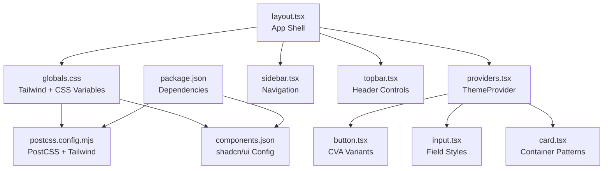
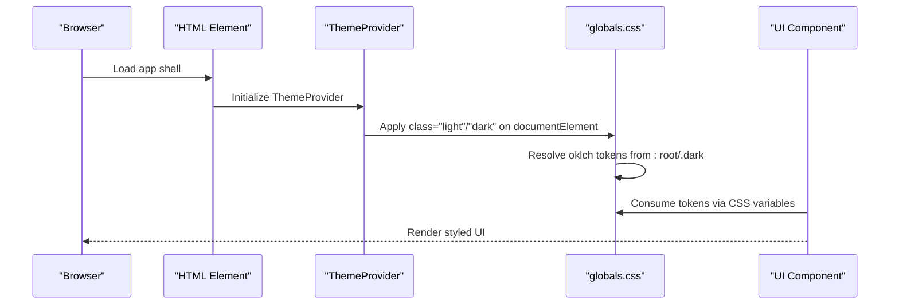
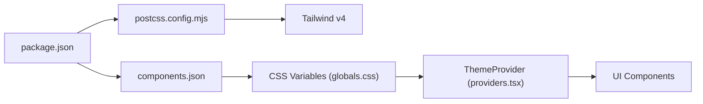

# Theme and Design System

<cite>
**Referenced Files in This Document**
- [globals.css](file://frontend/src/app/globals.css)
- [layout.tsx](file://frontend/src/app/layout.tsx)
- [providers.tsx](file://frontend/src/components/providers.tsx)
- [button.tsx](file://frontend/src/components/ui/button.tsx)
- [input.tsx](file://frontend/src/components/ui/input.tsx)
- [card.tsx](file://frontend/src/components/ui/card.tsx)
- [sidebar.tsx](file://frontend/src/components/layout/sidebar.tsx)
- [topbar.tsx](file://frontend/src/components/layout/topbar.tsx)
- [utils.ts](file://frontend/src/lib/utils.ts)
- [postcss.config.mjs](file://frontend/postcss.config.mjs)
- [package.json](file://frontend/package.json)
- [components.json](file://frontend/components.json)
</cite>

## Table of Contents
1. [Introduction](#introduction)
2. [Project Structure](#project-structure)
3. [Core Components](#core-components)
4. [Architecture Overview](#architecture-overview)
5. [Detailed Component Analysis](#detailed-component-analysis)
6. [Dependency Analysis](#dependency-analysis)
7. [Performance Considerations](#performance-considerations)
8. [Accessibility Compliance](#accessibility-compliance)
9. [Extending the Design System](#extending-the-design-system)
10. [Troubleshooting Guide](#troubleshooting-guide)
11. [Conclusion](#conclusion)

## Introduction
This document describes Socialium’s design system and theming implementation. It covers Tailwind CSS configuration, the custom oklch-based color palette, typography scale, spacing system, and radius tokens. It explains light/dark mode via CSS variables and automatic system preference detection, component styling patterns using a utility-first approach, and responsive design practices. It also documents the font system using Geist Sans and Geist Mono, font loading strategies, and variable font usage. Finally, it outlines design tokens, CSS architecture, component patterns, and guidelines for extending the design system while maintaining consistency and accessibility.

## Project Structure
The design system is primarily configured in the global stylesheet and Next.js app shell, with theme management provided by a React provider. UI primitives are implemented as reusable components that apply design tokens consistently.

**Diagram sources**
- [layout.tsx](file://frontend/src/app/layout.tsx#L1-L38)
- [globals.css](file://frontend/src/app/globals.css#L1-L130)
- [providers.tsx](file://frontend/src/components/providers.tsx#L1-L33)
- [button.tsx](file://frontend/src/components/ui/button.tsx#L1-L59)
- [input.tsx](file://frontend/src/components/ui/input.tsx#L1-L21)
- [card.tsx](file://frontend/src/components/ui/card.tsx#L1-L104)
- [sidebar.tsx](file://frontend/src/components/layout/sidebar.tsx#L1-L123)
- [topbar.tsx](file://frontend/src/components/layout/topbar.tsx#L1-L76)
- [postcss.config.mjs](file://frontend/postcss.config.mjs#L1-L8)
- [components.json](file://frontend/components.json#L1-L26)
- [package.json](file://frontend/package.json#L1-L45)

**Section sources**
- [layout.tsx](file://frontend/src/app/layout.tsx#L1-L38)
- [globals.css](file://frontend/src/app/globals.css#L1-L130)
- [providers.tsx](file://frontend/src/components/providers.tsx#L1-L33)
- [postcss.config.mjs](file://frontend/postcss.config.mjs#L1-L8)
- [components.json](file://frontend/components.json#L1-L26)
- [package.json](file://frontend/package.json#L1-L45)

## Core Components
- Tailwind + CSS Variables: The global stylesheet imports Tailwind, animation helpers, and shadcn’s Tailwind CSS, then defines a theme block that maps design tokens to CSS variables. These variables are populated in :root and .dark selectors for light and dark modes respectively.
- Theme Provider: The ThemeProvider sets the theme attribute on the document element, enabling system preference detection and switching between light and dark modes.
- Font System: Geist Sans and Geist Mono are loaded via Next.js fonts and exposed as CSS variables for consistent typography.
- Utility-first Components: UI primitives use class composition with class merging utilities and variant systems to maintain consistency.

Key implementation references:
- Theme variables and tokens: [globals.css](file://frontend/src/app/globals.css#L7-L49)
- Light/dark values: [globals.css](file://frontend/src/app/globals.css#L51-L118)
- Theme provider setup: [providers.tsx](file://frontend/src/components/providers.tsx#L24-L24)
- Fonts in app shell: [layout.tsx](file://frontend/src/app/layout.tsx#L6-L14)
- Utilities for class merging: [utils.ts](file://frontend/src/lib/utils.ts#L1-L7)

**Section sources**
- [globals.css](file://frontend/src/app/globals.css#L1-L130)
- [providers.tsx](file://frontend/src/components/providers.tsx#L1-L33)
- [layout.tsx](file://frontend/src/app/layout.tsx#L1-L38)
- [utils.ts](file://frontend/src/lib/utils.ts#L1-L7)

## Architecture Overview
The design system architecture centers on CSS variables for theme tokens, a theme provider for mode switching, and component primitives that consume these tokens. The PostCSS pipeline integrates Tailwind v4, and shadcn/ui is configured to use CSS variables.

**Diagram sources**
- [layout.tsx](file://frontend/src/app/layout.tsx#L27-L30)
- [providers.tsx](file://frontend/src/components/providers.tsx#L24-L24)
- [globals.css](file://frontend/src/app/globals.css#L51-L118)
- [button.tsx](file://frontend/src/components/ui/button.tsx#L43-L56)

**Section sources**
- [layout.tsx](file://frontend/src/app/layout.tsx#L1-L38)
- [providers.tsx](file://frontend/src/components/providers.tsx#L1-L33)
- [globals.css](file://frontend/src/app/globals.css#L1-L130)
- [button.tsx](file://frontend/src/components/ui/button.tsx#L1-L59)

## Detailed Component Analysis

### Color Palette and Tokens
- Color Model: oklch is used for perceptually uniform lightness and chroma, with hue for color identity.
- Token Names: Tokens include background, foreground, primary, secondary, muted, accent, destructive, border, input, ring, popover, card, chart series, and sidebar variants.
- Light Mode Defaults: Defined in :root with oklch values for each token.
- Dark Mode Overrides: Defined in .dark with adjusted oklch values for contrast and readability.
- Theme Mapping: The @theme block maps CSS variables to Tailwind tokens, enabling utilities like bg-primary, text-primary-foreground, ring-ring, etc.

References:
- Tokens and mappings: [globals.css](file://frontend/src/app/globals.css#L7-L49)
- Light defaults: [globals.css](file://frontend/src/app/globals.css#L51-L84)
- Dark overrides: [globals.css](file://frontend/src/app/globals.css#L86-L118)

**Section sources**
- [globals.css](file://frontend/src/app/globals.css#L1-L130)

### Typography Scale and Font System
- Fonts: Geist Sans (sans-serif) and Geist Mono (monospace) are loaded via Next.js fonts and exposed as CSS variables (--font-geist-sans, --font-geist-mono).
- Headings and Body: html applies the sans font, and base layer styles target body and borders using tokens.
- Variable Fonts: Next.js font declarations expose font variables for dynamic axis usage.

References:
- Font declarations: [layout.tsx](file://frontend/src/app/layout.tsx#L6-L14)
- Base layer font application: [globals.css](file://frontend/src/app/globals.css#L127-L129)

**Section sources**
- [layout.tsx](file://frontend/src/app/layout.tsx#L1-L38)
- [globals.css](file://frontend/src/app/globals.css#L1-L130)

### Spacing and Radius System
- Spacing: Used implicitly in components via Tailwind utilities (e.g., padding, margin, gap). Design tokens are applied via CSS variables for consistent sizing.
- Radius Tokens: Custom radius tokens are defined and scaled for small, medium, large, extra-large, and larger sizes. Components reference these tokens for consistent corner radii.

References:
- Radius tokens: [globals.css](file://frontend/src/app/globals.css#L42-L48)

**Section sources**
- [globals.css](file://frontend/src/app/globals.css#L1-L130)

### Component Styling Patterns
- Utility-first: Components compose Tailwind utilities with design tokens (e.g., bg-primary, text-primary-foreground, ring-ring).
- Variant Systems: Buttons use class-variance-authority (CVA) to define variants and sizes with consistent focus, hover, and disabled states.
- Focus States: Components consistently apply focus-visible:border-ring and focus-visible:ring-ring/50 for keyboard accessibility.
- Icons: SVG icons receive consistent sizing and pointer event handling.

References:
- Button variants and sizes: [button.tsx](file://frontend/src/components/ui/button.tsx#L6-L41)
- Button usage: [button.tsx](file://frontend/src/components/ui/button.tsx#L43-L56)
- Input focus and invalid states: [input.tsx](file://frontend/src/components/ui/input.tsx#L11-L14)

**Section sources**
- [button.tsx](file://frontend/src/components/ui/button.tsx#L1-L59)
- [input.tsx](file://frontend/src/components/ui/input.tsx#L1-L21)

### Responsive Design and Breakpoints
- Mobile-first: Components use mobile-first utilities and introduce responsive modifiers at larger breakpoints (e.g., md:).
- Breakpoint Usage: Inputs and buttons apply responsive text sizes and spacing adjustments at md: and similar breakpoints.

References:
- Responsive text and spacing: [button.tsx](file://frontend/src/components/ui/button.tsx#L22-L34)
- Responsive input sizing: [input.tsx](file://frontend/src/components/ui/input.tsx#L11-L14)

**Section sources**
- [button.tsx](file://frontend/src/components/ui/button.tsx#L1-L59)
- [input.tsx](file://frontend/src/components/ui/input.tsx#L1-L21)

### Dark/Light Mode Implementation
- Automatic Detection: ThemeProvider uses defaultTheme="system" to follow OS preference.
- CSS Variables: Tokens update based on .dark class applied to the document element.
- Toggle Control: The topbar includes a theme toggle that switches between light and dark.

References:
- ThemeProvider configuration: [providers.tsx](file://frontend/src/components/providers.tsx#L24-L24)
- Theme toggler: [topbar.tsx](file://frontend/src/components/layout/topbar.tsx#L39-L46)
- Tokens resolution: [globals.css](file://frontend/src/app/globals.css#L51-L118)

**Section sources**
- [providers.tsx](file://frontend/src/components/providers.tsx#L1-L33)
- [topbar.tsx](file://frontend/src/components/layout/topbar.tsx#L1-L76)
- [globals.css](file://frontend/src/app/globals.css#L1-L130)

### Navigation and Layout Components
- Sidebar: Fixed-position navigation with collapsible behavior, hover states, and active indicators using tokens for backgrounds and text.
- Topbar: Header controls including search, notifications, theme toggle, and user menu, styled with tokens and consistent spacing.

References:
- Sidebar layout and states: [sidebar.tsx](file://frontend/src/components/layout/sidebar.tsx#L42-L122)
- Topbar controls: [topbar.tsx](file://frontend/src/components/layout/topbar.tsx#L18-L76)

**Section sources**
- [sidebar.tsx](file://frontend/src/components/layout/sidebar.tsx#L1-L123)
- [topbar.tsx](file://frontend/src/components/layout/topbar.tsx#L1-L76)

## Dependency Analysis
The design system relies on Tailwind v4 via PostCSS, CSS variables for theming, and shadcn/ui configuration. The theme provider integrates with the app shell to propagate mode changes.

**Diagram sources**
- [package.json](file://frontend/package.json#L1-L45)
- [postcss.config.mjs](file://frontend/postcss.config.mjs#L1-L8)
- [components.json](file://frontend/components.json#L1-L26)
- [globals.css](file://frontend/src/app/globals.css#L1-L130)
- [providers.tsx](file://frontend/src/components/providers.tsx#L1-L33)

**Section sources**
- [package.json](file://frontend/package.json#L1-L45)
- [postcss.config.mjs](file://frontend/postcss.config.mjs#L1-L8)
- [components.json](file://frontend/components.json#L1-L26)
- [globals.css](file://frontend/src/app/globals.css#L1-L130)
- [providers.tsx](file://frontend/src/components/providers.tsx#L1-L33)

## Performance Considerations
- CSS Variables: Using CSS variables for tokens reduces duplication and enables efficient theme switching without re-rendering components.
- Utility-first: Tailwind utilities minimize custom CSS and leverage compiled classes for performance.
- Font Loading: Next.js font variables reduce layout shift risk by exposing font metadata early.
- Component Composition: Reusing primitives avoids redundant styles and improves maintainability.

[No sources needed since this section provides general guidance]

## Accessibility Compliance
- Contrast Ratios: oklch tokens are tuned for sufficient contrast in both light and dark modes. Verify WCAG AA/AAA ratios for critical text and interactive elements.
- Focus States: Components consistently apply focus-visible:border-ring and focus-visible:ring-ring/50 to ensure keyboard navigation visibility.
- Screen Reader Support: Components use semantic roles and attributes; ensure ARIA attributes are added where needed for complex widgets.
- Reduced Motion: Consider adding reduced-motion-safe transitions and disabling heavy animations for users who prefer minimal motion.

[No sources needed since this section provides general guidance]

## Extending the Design System
Guidelines for adding new tokens, components, and patterns:
- Add Tokens
  - Define new oklch values in :root and .dark with meaningful names.
  - Map tokens to CSS variables in the @theme block.
  - Reference tokens in components via CSS variables.
  References:
  - [globals.css](file://frontend/src/app/globals.css#L7-L49)
  - [globals.css](file://frontend/src/app/globals.css#L51-L118)

- Create Variants
  - Use CVA to define variants and sizes for new components.
  - Keep focus, hover, active, and disabled states consistent.
  References:
  - [button.tsx](file://frontend/src/components/ui/button.tsx#L6-L41)

- Compose Utilities
  - Merge classes with the utility function to avoid conflicts.
  References:
  - [utils.ts](file://frontend/src/lib/utils.ts#L1-L7)

- Maintain Consistency
  - Prefer tokens over hardcoded values.
  - Use responsive utilities at appropriate breakpoints.
  - Keep component APIs minimal and consistent across the library.

[No sources needed since this section provides general guidance]

## Troubleshooting Guide
Common issues and resolutions:
- Theme Not Switching
  - Ensure the ThemeProvider attribute is set to "class" and defaultTheme is "system".
  - Confirm the .dark selector updates CSS variables.
  References:
  - [providers.tsx](file://frontend/src/components/providers.tsx#L24-L24)
  - [globals.css](file://frontend/src/app/globals.css#L86-L118)

- Fonts Not Applied
  - Verify Next.js font variables are attached to html and that CSS consumes --font-geist-* variables.
  References:
  - [layout.tsx](file://frontend/src/app/layout.tsx#L6-L14)
  - [globals.css](file://frontend/src/app/globals.css#L10-L12)

- Focus Ring Not Visible
  - Ensure focus-visible:border-ring and focus-visible:ring-ring/50 are present on interactive elements.
  References:
  - [button.tsx](file://frontend/src/components/ui/button.tsx#L7-L7)
  - [input.tsx](file://frontend/src/components/ui/input.tsx#L11-L14)

**Section sources**
- [providers.tsx](file://frontend/src/components/providers.tsx#L1-L33)
- [globals.css](file://frontend/src/app/globals.css#L1-L130)
- [layout.tsx](file://frontend/src/app/layout.tsx#L1-L38)
- [button.tsx](file://frontend/src/components/ui/button.tsx#L1-L59)
- [input.tsx](file://frontend/src/components/ui/input.tsx#L1-L21)

## Conclusion
Socialium’s design system leverages Tailwind v4, CSS variables, and shadcn/ui to deliver a cohesive, themeable interface. The oklch-based color palette ensures perceptual consistency across modes, while Geist Sans and Geist Mono provide a modern, variable-font-ready typography stack. Components follow a utility-first pattern with variant systems, consistent focus states, and responsive behavior. By adhering to the documented patterns and extending via tokens and CVA, teams can maintain design consistency and accessibility across the application.

[No sources needed since this section summarizes without analyzing specific files]