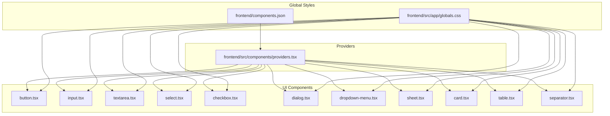
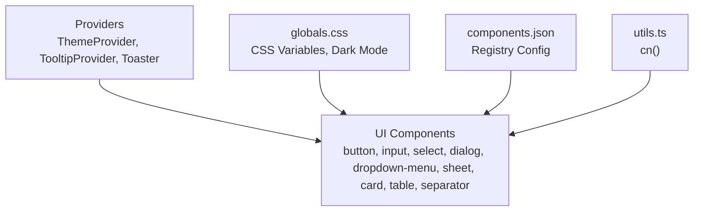
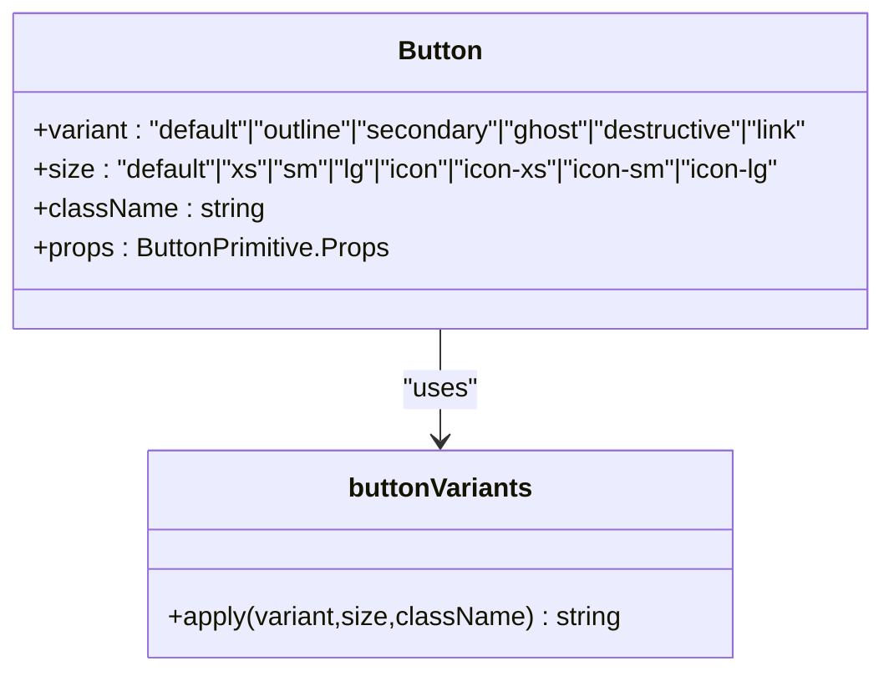
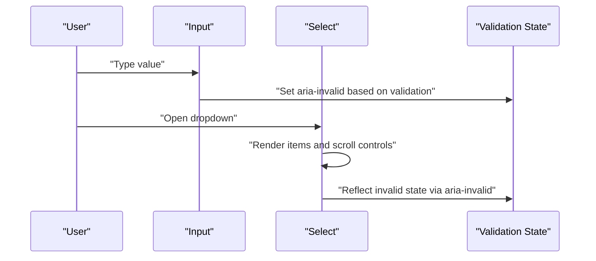
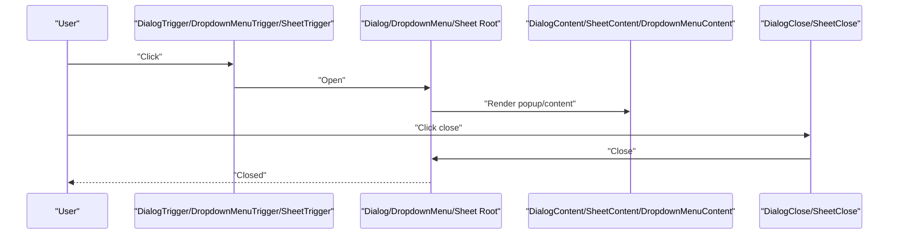
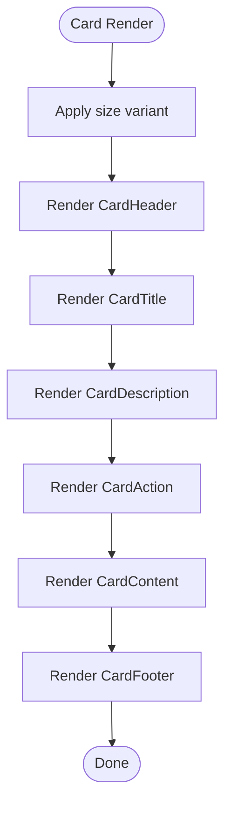
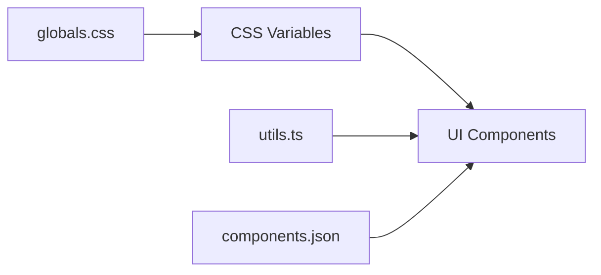

# UI Component Library

<cite>
**Referenced Files in This Document**
- [button.tsx](file://frontend/src/components/ui/button.tsx)
- [input.tsx](file://frontend/src/components/ui/input.tsx)
- [textarea.tsx](file://frontend/src/components/ui/textarea.tsx)
- [select.tsx](file://frontend/src/components/ui/select.tsx)
- [checkbox.tsx](file://frontend/src/components/ui/checkbox.tsx)
- [dialog.tsx](file://frontend/src/components/ui/dialog.tsx)
- [dropdown-menu.tsx](file://frontend/src/components/ui/dropdown-menu.tsx)
- [sheet.tsx](file://frontend/src/components/ui/sheet.tsx)
- [card.tsx](file://frontend/src/components/ui/card.tsx)
- [table.tsx](file://frontend/src/components/ui/table.tsx)
- [separator.tsx](file://frontend/src/components/ui/separator.tsx)
- [providers.tsx](file://frontend/src/components/providers.tsx)
- [globals.css](file://frontend/src/app/globals.css)
- [components.json](file://frontend/components.json)
- [utils.ts](file://frontend/src/lib/utils.ts)
</cite>

## Table of Contents
1. [Introduction](#introduction)
2. [Project Structure](#project-structure)
3. [Core Components](#core-components)
4. [Architecture Overview](#architecture-overview)
5. [Detailed Component Analysis](#detailed-component-analysis)
6. [Dependency Analysis](#dependency-analysis)
7. [Performance Considerations](#performance-considerations)
8. [Troubleshooting Guide](#troubleshooting-guide)
9. [Conclusion](#conclusion)
10. [Appendices](#appendices)

## Introduction
This document describes Socialium’s custom UI component library built on shadcn/ui primitives. It covers component APIs, styling and variant systems, accessibility attributes, responsive patterns, and integration with theme and validation. It also provides usage guidelines for forms, dialogs, dropdowns, sheets, cards, tables, and separators, along with TypeScript prop definitions and best practices for consistency, dark mode, and cross-browser compatibility.

## Project Structure
The UI components live under the frontend/src/components/ui directory and are composed with Tailwind CSS, class-variance-authority (CVA), and shadcn/ui primitives. Global styles and theme variables are defined in the global CSS file, while the component registry configuration is managed via components.json.

**Diagram sources**
- [globals.css](file://frontend/src/app/globals.css#L1-L130)
- [components.json](file://frontend/components.json#L1-L26)
- [providers.tsx](file://frontend/src/components/providers.tsx#L1-L33)
- [button.tsx](file://frontend/src/components/ui/button.tsx#L1-L59)
- [input.tsx](file://frontend/src/components/ui/input.tsx#L1-L21)
- [textarea.tsx](file://frontend/src/components/ui/textarea.tsx#L1-L19)
- [select.tsx](file://frontend/src/components/ui/select.tsx#L1-L202)
- [checkbox.tsx](file://frontend/src/components/ui/checkbox.tsx#L1-L30)
- [dialog.tsx](file://frontend/src/components/ui/dialog.tsx#L1-L161)
- [dropdown-menu.tsx](file://frontend/src/components/ui/dropdown-menu.tsx#L1-L269)
- [sheet.tsx](file://frontend/src/components/ui/sheet.tsx#L1-L139)
- [card.tsx](file://frontend/src/components/ui/card.tsx#L1-L104)
- [table.tsx](file://frontend/src/components/ui/table.tsx#L1-L117)
- [separator.tsx](file://frontend/src/components/ui/separator.tsx#L1-L26)

**Section sources**
- [globals.css](file://frontend/src/app/globals.css#L1-L130)
- [components.json](file://frontend/components.json#L1-L26)
- [providers.tsx](file://frontend/src/components/providers.tsx#L1-L33)

## Core Components
This section documents the primary UI building blocks and their capabilities.

- Button
  - Variants: default, outline, secondary, ghost, destructive, link
  - Sizes: default, xs, sm, lg, icon, icon-xs, icon-sm, icon-lg
  - States: focus-visible ring, disabled opacity, aria-invalid highlighting, pressed transform
  - Props: className, variant, size, plus primitive props
  - Accessibility: inherits focus-visible ring and aria-expanded semantics
  - Example usage: see Button usage in Dialog and Sheet content areas

- Input
  - Base primitive with focus-visible ring, disabled states, and aria-invalid highlighting
  - Responsive text sizing and dark mode variants
  - Props: className, type, plus primitive props

- Textarea
  - Same focus-visible ring and disabled states as Input
  - Props: className, plus primitive props

- Select
  - Root, Trigger, Value, Content, Portal, Positioner, Popup, List, Item, ItemText, ItemIndicator, Group, GroupLabel, Separator, ScrollUpArrow, ScrollDownArrow
  - Trigger supports size variants (sm, default)
  - Content supports alignment and positioning props
  - Props: className, plus primitive props per component

- Checkbox
  - Primitive root with indicator and check icon
  - Focus-visible ring, disabled states, aria-invalid highlighting
  - Props: className, plus primitive props

- Dialog
  - Root, Portal, Overlay, Popup, Header, Footer, Title, Description, Trigger, Close
  - Optional close button rendering
  - Props: className, showCloseButton, plus primitive props

- Dropdown Menu
  - Root, Portal, Trigger, Content, Positioner, Popup, Group, GroupLabel, Item, Submenu, SubTrigger, SubContent, CheckboxItem, RadioGroup, RadioItem, Separator, Shortcut
  - Supports inset labels and destructive items
  - Props: className, inset, variant, side, sideOffset, align, alignOffset, plus primitive props

- Sheet
  - Root, Portal, Overlay, Popup, Header, Footer, Title, Description, Trigger, Close
  - Side placement: top, right, bottom, left
  - Optional close button rendering
  - Props: className, side, showCloseButton, plus primitive props

- Card
  - Card, CardHeader, CardTitle, CardDescription, CardAction, CardContent, CardFooter
  - Size variants: default, sm
  - Props: className, size, plus container props

- Table
  - Table container wrapper, Table, TableHeader, TableBody, TableFooter, TableRow, TableHead, TableCell, TableCaption
  - Responsive horizontal scrolling container
  - Props: className, plus table element props

- Separator
  - Primitive with orientation support (horizontal, vertical)
  - Props: className, orientation, plus primitive props

**Section sources**
- [button.tsx](file://frontend/src/components/ui/button.tsx#L1-L59)
- [input.tsx](file://frontend/src/components/ui/input.tsx#L1-L21)
- [textarea.tsx](file://frontend/src/components/ui/textarea.tsx#L1-L19)
- [select.tsx](file://frontend/src/components/ui/select.tsx#L1-L202)
- [checkbox.tsx](file://frontend/src/components/ui/checkbox.tsx#L1-L30)
- [dialog.tsx](file://frontend/src/components/ui/dialog.tsx#L1-L161)
- [dropdown-menu.tsx](file://frontend/src/components/ui/dropdown-menu.tsx#L1-L269)
- [sheet.tsx](file://frontend/src/components/ui/sheet.tsx#L1-L139)
- [card.tsx](file://frontend/src/components/ui/card.tsx#L1-L104)
- [table.tsx](file://frontend/src/components/ui/table.tsx#L1-L117)
- [separator.tsx](file://frontend/src/components/ui/separator.tsx#L1-L26)

## Architecture Overview
The UI components are thin wrappers around shadcn/ui primitives, styled with Tailwind and variant logic via CVA. Providers set up theme switching, tooltips, and global notifications. Global CSS defines theme tokens and dark mode variants.

**Diagram sources**
- [providers.tsx](file://frontend/src/components/providers.tsx#L1-L33)
- [globals.css](file://frontend/src/app/globals.css#L1-L130)
- [components.json](file://frontend/components.json#L1-L26)
- [utils.ts](file://frontend/src/lib/utils.ts#L1-L7)

## Detailed Component Analysis

### Button
- Variants and sizes are defined via CVA and applied through a variant resolver. Focus-visible rings and destructive states are handled with aria-invalid utilities.
- Composition: Button wraps a base UI button primitive and merges variant classes with incoming className.
- Accessibility: Inherits focus-visible ring and aria-expanded semantics; icons inside inherit pointer-events behavior.

**Diagram sources**
- [button.tsx](file://frontend/src/components/ui/button.tsx#L6-L41)

**Section sources**
- [button.tsx](file://frontend/src/components/ui/button.tsx#L1-L59)

### Form Components: Input, Textarea, Select, Checkbox
- Input and Textarea share focus-visible ring, disabled states, and aria-invalid highlighting. They use a consistent text sizing scale and dark mode backgrounds.
- Select composes a full menu system with trigger, content, items, and scroll controls. It supports grouped options, labels, separators, and scroll buttons.
- Checkbox integrates with focus-visible ring and destructive highlighting.

**Diagram sources**
- [input.tsx](file://frontend/src/components/ui/input.tsx#L1-L21)
- [textarea.tsx](file://frontend/src/components/ui/textarea.tsx#L1-L19)
- [select.tsx](file://frontend/src/components/ui/select.tsx#L1-L202)
- [checkbox.tsx](file://frontend/src/components/ui/checkbox.tsx#L1-L30)

**Section sources**
- [input.tsx](file://frontend/src/components/ui/input.tsx#L1-L21)
- [textarea.tsx](file://frontend/src/components/ui/textarea.tsx#L1-L19)
- [select.tsx](file://frontend/src/components/ui/select.tsx#L1-L202)
- [checkbox.tsx](file://frontend/src/components/ui/checkbox.tsx#L1-L30)

### Interactive Components: Dialog, Dropdown Menu, Sheet
- Dialog: Full-featured modal with overlay animation, optional close button, header/footer slots, and title/description primitives.
- Dropdown Menu: Hierarchical menu with submenus, checkboxes, radios, shortcuts, and destructive variants.
- Sheet: Slide-out panel with side-specific animations and optional close button.

**Diagram sources**
- [dialog.tsx](file://frontend/src/components/ui/dialog.tsx#L1-L161)
- [dropdown-menu.tsx](file://frontend/src/components/ui/dropdown-menu.tsx#L1-L269)
- [sheet.tsx](file://frontend/src/components/ui/sheet.tsx#L1-L139)

**Section sources**
- [dialog.tsx](file://frontend/src/components/ui/dialog.tsx#L1-L161)
- [dropdown-menu.tsx](file://frontend/src/components/ui/dropdown-menu.tsx#L1-L269)
- [sheet.tsx](file://frontend/src/components/ui/sheet.tsx#L1-L139)

### Layout Components: Card, Table, Separator
- Card: Flexible container with optional action area, size variants, and footer spacing. Uses grid and container queries for responsive layouts.
- Table: Wraps a scrollable container and applies hover/selected states to rows. Supports captions and responsive padding.
- Separator: Primitive with orientation support for horizontal/vertical dividers.

**Diagram sources**
- [card.tsx](file://frontend/src/components/ui/card.tsx#L1-L104)

**Section sources**
- [card.tsx](file://frontend/src/components/ui/card.tsx#L1-L104)
- [table.tsx](file://frontend/src/components/ui/table.tsx#L1-L117)
- [separator.tsx](file://frontend/src/components/ui/separator.tsx#L1-L26)

## Dependency Analysis
- Theme and styling: Global CSS defines CSS variables and dark mode tokens; components consume these tokens for consistent colors and radii.
- Utilities: cn() merges and deduplicates Tailwind classes.
- Registry: components.json configures shadcn/ui style, TSX usage, and aliases for imports.

**Diagram sources**
- [globals.css](file://frontend/src/app/globals.css#L1-L130)
- [utils.ts](file://frontend/src/lib/utils.ts#L1-L7)
- [components.json](file://frontend/components.json#L1-L26)

**Section sources**
- [globals.css](file://frontend/src/app/globals.css#L1-L130)
- [utils.ts](file://frontend/src/lib/utils.ts#L1-L7)
- [components.json](file://frontend/components.json#L1-L26)

## Performance Considerations
- Prefer variant props over ad-hoc className overrides to keep styles predictable and scoped.
- Use minimal conditional rendering for overlays and popovers to avoid layout thrashing.
- Keep icon sizes consistent to reduce reflows; rely on size utilities rather than dynamic scaling.
- Leverage CSS variables for theme transitions to minimize repaint costs.

## Troubleshooting Guide
- Dark mode not applying:
  - Ensure the ThemeProvider is mounted at the root and attribute is set to class.
  - Verify dark mode tokens are present in the global CSS.
- Focus rings not visible:
  - Confirm focus-visible ring utilities are included in component classes.
- Select/Menu misalignment:
  - Adjust side, sideOffset, align, and alignOffset props on content components.
- Disabled states not working:
  - Ensure disabled props are passed to primitives and aria-invalid states are toggled by validation logic.

**Section sources**
- [providers.tsx](file://frontend/src/components/providers.tsx#L1-L33)
- [globals.css](file://frontend/src/app/globals.css#L1-L130)

## Conclusion
Socialium’s UI library leverages shadcn/ui primitives with a consistent variant and size system, robust accessibility attributes, and theme-aware styling. Components are designed for composability, responsive behavior, and predictable validation feedback. By following the documented patterns and using the provided providers and utilities, teams can maintain visual and behavioral consistency across the application.

## Appendices

### TypeScript Prop Definitions (by file)
- Button
  - variant: "default" | "outline" | "secondary" | "ghost" | "destructive" | "link"
  - size: "default" | "xs" | "sm" | "lg" | "icon" | "icon-xs" | "icon-sm" | "icon-lg"
  - className?: string
  - Additional primitive props

- Input
  - className?: string
  - type?: string
  - Additional primitive props

- Textarea
  - className?: string
  - Additional primitive props

- Select
  - Trigger: size?: "sm" | "default"
  - Content: align?, alignOffset?, side?, sideOffset?, alignItemWithTrigger?
  - GroupLabel: inset?: boolean
  - Item: inset?: boolean, variant?: "default" | "destructive"
  - SubTrigger: inset?: boolean
  - RadioItem/CheckboxItem: inset?: boolean
  - Additional primitive props

- Checkbox
  - className?: string
  - Additional primitive props

- Dialog
  - showCloseButton?: boolean
  - Additional primitive props

- Dropdown Menu
  - variant?: "default" | "destructive"
  - inset?: boolean
  - side?, sideOffset?, align?, alignOffset?
  - Additional primitive props

- Sheet
  - side?: "top" | "right" | "bottom" | "left"
  - showCloseButton?: boolean
  - Additional primitive props

- Card
  - size?: "default" | "sm"
  - Additional container props

- Table
  - Additional table element props

- Separator
  - orientation?: "horizontal" | "vertical"
  - Additional primitive props

**Section sources**
- [button.tsx](file://frontend/src/components/ui/button.tsx#L43-L56)
- [input.tsx](file://frontend/src/components/ui/input.tsx#L6-L18)
- [textarea.tsx](file://frontend/src/components/ui/textarea.tsx#L5-L16)
- [select.tsx](file://frontend/src/components/ui/select.tsx#L36-L72)
- [checkbox.tsx](file://frontend/src/components/ui/checkbox.tsx#L8-L27)
- [dialog.tsx](file://frontend/src/components/ui/dialog.tsx#L47-L78)
- [dropdown-menu.tsx](file://frontend/src/components/ui/dropdown-menu.tsx#L82-L96)
- [sheet.tsx](file://frontend/src/components/ui/sheet.tsx#L45-L78)
- [card.tsx](file://frontend/src/components/ui/card.tsx#L5-L21)
- [table.tsx](file://frontend/src/components/ui/table.tsx#L7-L20)
- [separator.tsx](file://frontend/src/components/ui/separator.tsx#L7-L23)