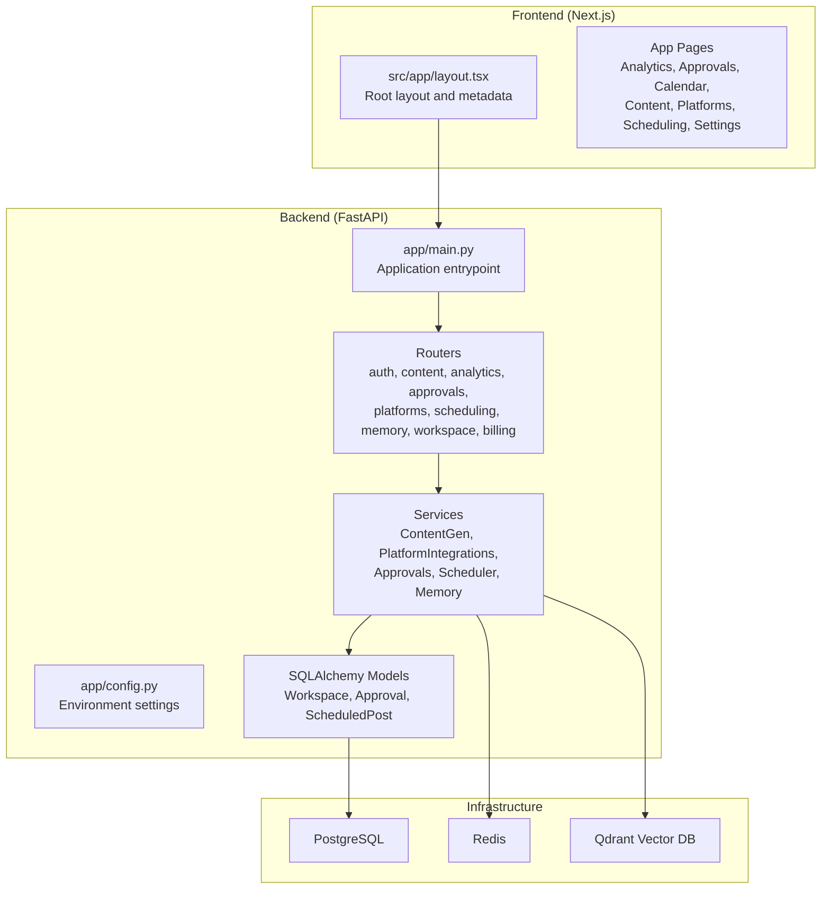
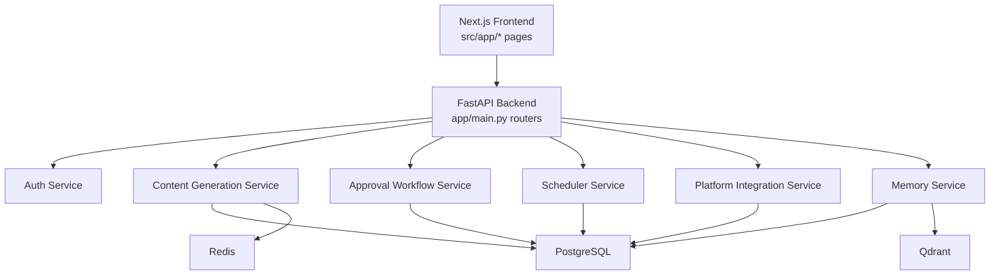
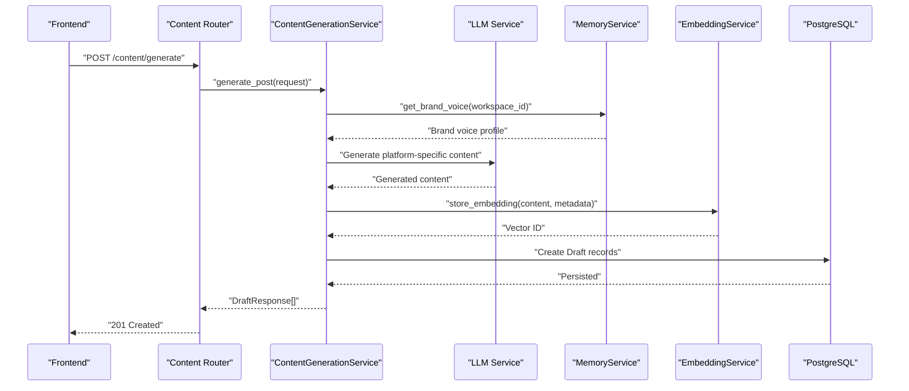
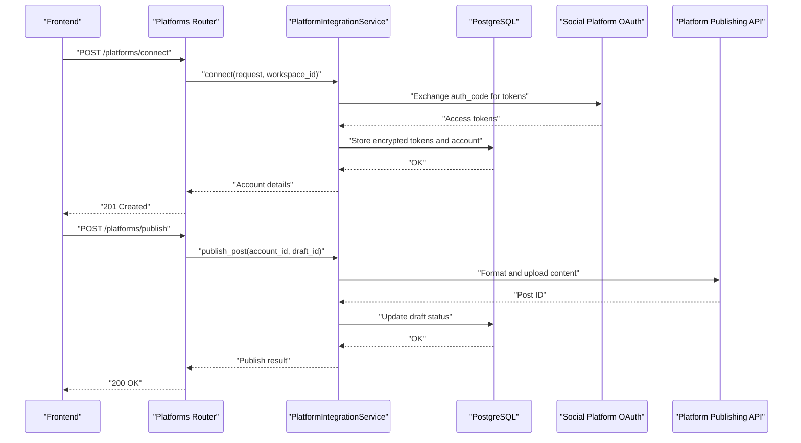
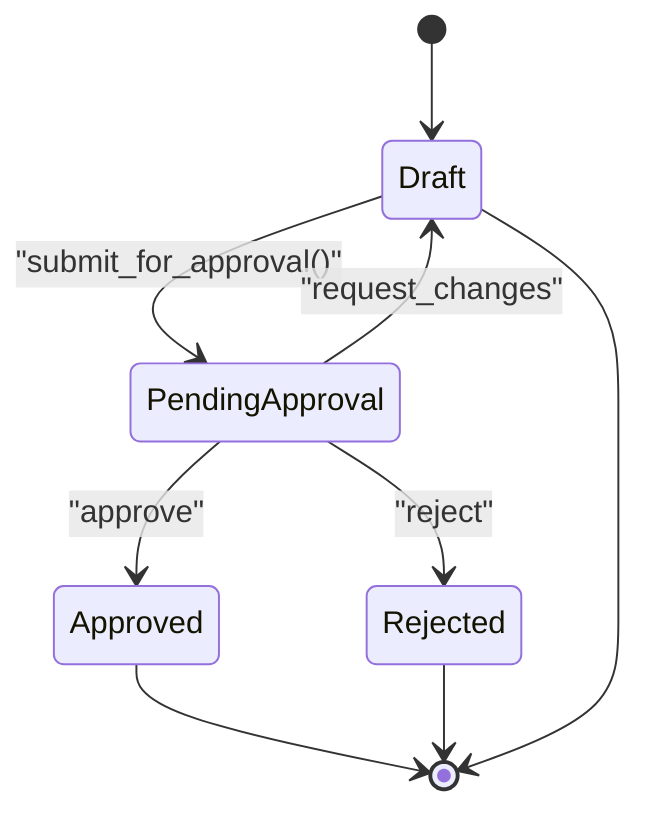
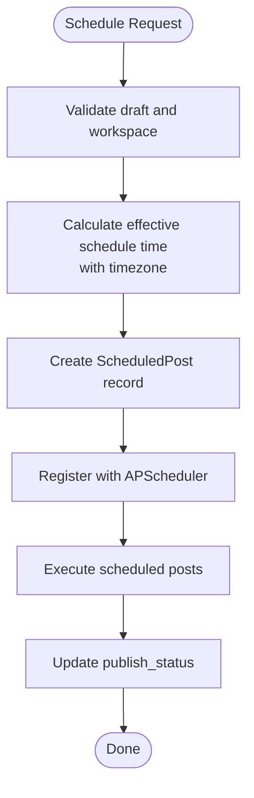
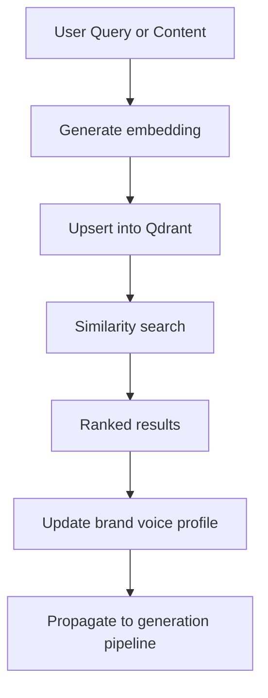
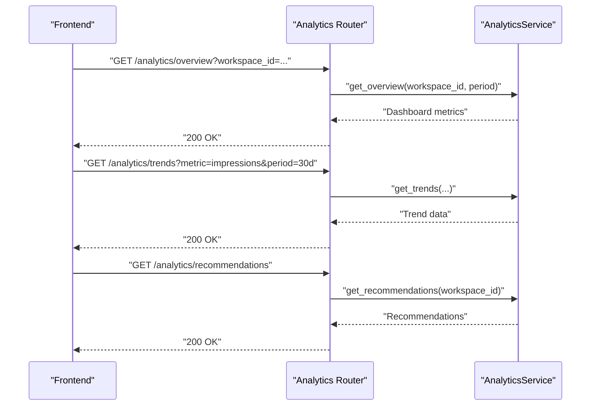
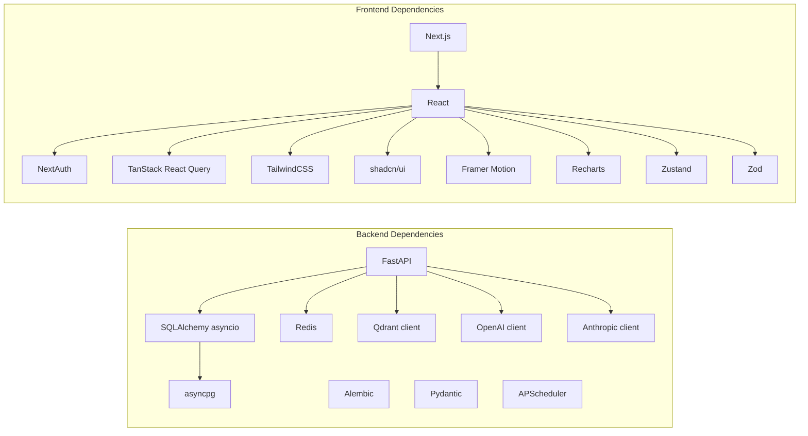

# Project Overview

<cite>
**Referenced Files in This Document**
- [backend/app/main.py](file://backend/app/main.py)
- [backend/app/config.py](file://backend/app/config.py)
- [backend/pyproject.toml](file://backend/pyproject.toml)
- [frontend/package.json](file://frontend/package.json)
- [frontend/src/app/layout.tsx](file://frontend/src/app/layout.tsx)
- [backend/app/services/content_generation_service.py](file://backend/app/services/content_generation_service.py)
- [backend/app/services/platform_integration_service.py](file://backend/app/services/platform_integration_service.py)
- [backend/app/services/approval_workflow_service.py](file://backend/app/services/approval_workflow_service.py)
- [backend/app/services/scheduler_service.py](file://backend/app/services/scheduler_service.py)
- [backend/app/services/memory_service.py](file://backend/app/services/memory_service.py)
- [backend/app/models/workspace.py](file://backend/app/models/workspace.py)
- [backend/app/models/approval.py](file://backend/app/models/approval.py)
- [backend/app/models/scheduled_post.py](file://backend/app/models/scheduled_post.py)
- [backend/app/routers/analytics.py](file://backend/app/routers/analytics.py)
</cite>

## Table of Contents
1. [Introduction](#introduction)
2. [Project Structure](#project-structure)
3. [Core Components](#core-components)
4. [Architecture Overview](#architecture-overview)
5. [Detailed Component Analysis](#detailed-component-analysis)
6. [Dependency Analysis](#dependency-analysis)
7. [Performance Considerations](#performance-considerations)
8. [Troubleshooting Guide](#troubleshooting-guide)
9. [Conclusion](#conclusion)
10. [Appendices](#appendices)

## Introduction
Socialium is an AI-powered social media automation platform designed to help teams scale their content creation, approval, and publishing workflows while maintaining brand consistency. Its core value proposition centers on intelligent content generation, seamless multi-platform publishing, robust approval workflows, and actionable analytics — all unified under a modern workspace model.

Key differentiators:
- AI-first content lifecycle: From ideation to publication, with human-in-the-loop controls.
- Semantic memory and brand voice learning powered by vector embeddings.
- Multi-agent orchestration for platform-specific content generation.
- Intelligent scheduling with engagement-based optimization.
- Secure, extensible workspace management with role-based access.

Target audience:
- Marketing teams, agencies, and brands seeking scalable social media operations.
- Teams needing governance and approval processes for consistent brand messaging.
- Organizations wanting to leverage AI for content ideation and optimization.

Common use cases:
- Generate platform-specific social posts from a single prompt, iterate with variants, and publish after internal approval.
- Schedule recurring posts with optimal timing recommendations and monitor performance.
- Learn and refine brand voice over time using semantic memory and engagement signals.

## Project Structure
The project follows a clear separation of concerns:
- Backend: FastAPI application exposing REST APIs, organized by feature domains (authentication, content, analytics, approvals, platforms, scheduling, memory, workspace, billing).
- Frontend: Next.js application providing the admin dashboard and user-facing views.
- Data and infrastructure: PostgreSQL for relational persistence, Redis for caching, and Qdrant for vector embeddings.

**Diagram sources**
- [backend/app/main.py](file://backend/app/main.py#L36-L77)
- [backend/app/config.py](file://backend/app/config.py#L25-L51)
- [frontend/src/app/layout.tsx](file://frontend/src/app/layout.tsx#L16-L19)

**Section sources**
- [backend/app/main.py](file://backend/app/main.py#L1-L83)
- [backend/app/config.py](file://backend/app/config.py#L1-L83)
- [frontend/src/app/layout.tsx](file://frontend/src/app/layout.tsx#L1-L38)

## Core Components
- AI Content Generation Service: Orchestrates multi-agent content creation, variant generation, draft lifecycle, and optimization using LLMs and embeddings.
- Platform Integration Service: Manages OAuth connections and publishes content to LinkedIn, Twitter/X, Instagram, and Facebook.
- Approval Workflow Service: Implements a state machine for draft review and approval with comments and history.
- Scheduler Service: Handles scheduling, rescheduling, cancellation, and optimal time recommendations using analytics.
- Memory Service: Stores and retrieves semantic embeddings for brand voice and content patterns.
- Workspace Model: Supports multi-user teams with roles and shared resources.

**Section sources**
- [backend/app/services/content_generation_service.py](file://backend/app/services/content_generation_service.py#L1-L98)
- [backend/app/services/platform_integration_service.py](file://backend/app/services/platform_integration_service.py#L1-L56)
- [backend/app/services/approval_workflow_service.py](file://backend/app/services/approval_workflow_service.py#L1-L48)
- [backend/app/services/scheduler_service.py](file://backend/app/services/scheduler_service.py#L1-L59)
- [backend/app/services/memory_service.py](file://backend/app/services/memory_service.py#L1-L66)
- [backend/app/models/workspace.py](file://backend/app/models/workspace.py#L14-L42)

## Architecture Overview
Socialium’s architecture is layered:
- Presentation Layer: Next.js frontend with pages for analytics, approvals, content, platforms, scheduling, and settings.
- API Layer: FastAPI routers expose domain-specific endpoints; CORS is configured to allow the frontend origin.
- Domain Services: Feature-focused services coordinate business logic, integrate external APIs, and manage persistence.
- Persistence Layer: SQLAlchemy ORM models map to PostgreSQL; Redis is used for caching; Qdrant stores vector embeddings.

**Diagram sources**
- [backend/app/main.py](file://backend/app/main.py#L58-L76)
- [backend/app/config.py](file://backend/app/config.py#L25-L51)
- [frontend/src/app/layout.tsx](file://frontend/src/app/layout.tsx#L16-L19)

## Detailed Component Analysis

### AI Content Generation
The content generation service orchestrates:
- Source content processing and brand voice retrieval from memory.
- Platform-specific prompt construction and LLM-driven generation.
- Optional image generation and draft creation.
- Embedding storage for semantic memory.
- Draft lifecycle management and optimization.

**Diagram sources**
- [backend/app/services/content_generation_service.py](file://backend/app/services/content_generation_service.py#L23-L40)
- [backend/app/services/memory_service.py](file://backend/app/services/memory_service.py#L39-L45)
- [backend/app/main.py](file://backend/app/main.py#L59-L59)

**Section sources**
- [backend/app/services/content_generation_service.py](file://backend/app/services/content_generation_service.py#L13-L98)

### Multi-Platform Social Media Integration
The platform integration service manages OAuth connections and publishes content across supported networks. It supports listing accounts, connecting/disconnecting OAuth, syncing account data, publishing posts, and rollback capabilities.

**Diagram sources**
- [backend/app/services/platform_integration_service.py](file://backend/app/services/platform_integration_service.py#L21-L51)
- [backend/app/main.py](file://backend/app/main.py#L67-L67)

**Section sources**
- [backend/app/services/platform_integration_service.py](file://backend/app/services/platform_integration_service.py#L8-L56)

### Approval Workflows
The approval workflow enforces a structured review process with state transitions and auditability. It supports listing pending items, reviewing actions, adding comments, and tracking history.

**Diagram sources**
- [backend/app/services/approval_workflow_service.py](file://backend/app/services/approval_workflow_service.py#L8-L47)
- [backend/app/models/approval.py](file://backend/app/models/approval.py#L14-L42)

**Section sources**
- [backend/app/services/approval_workflow_service.py](file://backend/app/services/approval_workflow_service.py#L8-L48)
- [backend/app/models/approval.py](file://backend/app/models/approval.py#L14-L69)

### Scheduling and Optimization
The scheduler service handles scheduling, rescheduling, cancellation, and optimal posting time recommendations. It integrates with analytics to propose engagement-optimized windows.

**Diagram sources**
- [backend/app/services/scheduler_service.py](file://backend/app/services/scheduler_service.py#L18-L27)
- [backend/app/models/scheduled_post.py](file://backend/app/models/scheduled_post.py#L13-L56)

**Section sources**
- [backend/app/services/scheduler_service.py](file://backend/app/services/scheduler_service.py#L8-L59)
- [backend/app/models/scheduled_post.py](file://backend/app/models/scheduled_post.py#L13-L56)

### Memory and Brand Voice Learning
The memory service maintains brand voice and content patterns using vector embeddings. It supports storing embeddings, semantic search, brand voice updates, and learning from engagement.

**Diagram sources**
- [backend/app/services/memory_service.py](file://backend/app/services/memory_service.py#L19-L37)
- [backend/app/config.py](file://backend/app/config.py#L47-L50)

**Section sources**
- [backend/app/services/memory_service.py](file://backend/app/services/memory_service.py#L8-L66)
- [backend/app/config.py](file://backend/app/config.py#L47-L50)

### Analytics Dashboard
The analytics router exposes endpoints for overview dashboards, trend metrics, and AI-powered recommendations, enabling data-driven decisions for content and scheduling.

**Diagram sources**
- [backend/app/routers/analytics.py](file://backend/app/routers/analytics.py#L13-L43)

**Section sources**
- [backend/app/routers/analytics.py](file://backend/app/routers/analytics.py#L1-L44)

## Dependency Analysis
Technology stack and integrations:
- Backend: FastAPI, SQLAlchemy asyncio, Alembic, asyncpg, Pydantic, Redis, APScheduler, Qdrant client, OpenAI/Anthropic clients, python-dotenv, httpx, email-validator.
- Frontend: Next.js 16, React 19, NextAuth v5, TanStack React Query, TailwindCSS, shadcn/ui, Framer Motion, Recharts, Zustand, Zod.

**Diagram sources**
- [backend/pyproject.toml](file://backend/pyproject.toml#L6-L25)
- [frontend/package.json](file://frontend/package.json#L11-L33)

**Section sources**
- [backend/pyproject.toml](file://backend/pyproject.toml#L1-L49)
- [frontend/package.json](file://frontend/package.json#L1-L45)

## Performance Considerations
- Asynchronous I/O: Use of SQLAlchemy asyncio and FastAPI ensures non-blocking IO for database operations.
- Caching: Redis is available for session storage, rate limiting, and caching hot data.
- Vector indexing: Qdrant optimizes similarity search for brand voice and content patterns.
- Background tasks: APScheduler handles scheduling and periodic tasks efficiently.
- Frontend responsiveness: Next.js App Router and React Query enable efficient data fetching and UI updates.

[No sources needed since this section provides general guidance]

## Troubleshooting Guide
- Health checks: The backend exposes a health endpoint to verify service availability.
- Environment configuration: Ensure environment variables for database, Redis, OpenAI/Anthropic, Qdrant, OAuth clients, and frontend URL are set correctly.
- CORS: Verify frontend URL matches the configured origin to avoid cross-origin errors.
- Database migrations: Use Alembic to manage schema changes and keep the database synchronized.

**Section sources**
- [backend/app/main.py](file://backend/app/main.py#L79-L83)
- [backend/app/config.py](file://backend/app/config.py#L18-L73)

## Conclusion
Socialium combines modern web technologies with AI-driven workflows to deliver a cohesive social media automation platform. Its modular backend, intuitive frontend, and integrated vector memory position it to scale content operations while preserving brand identity and governance.

[No sources needed since this section summarizes without analyzing specific files]

## Appendices

### System Requirements
- Python 3.12+
- Node.js 18+ (for frontend development)
- PostgreSQL 13+ (for relational data)
- Redis 6+ (for caching)
- Qdrant 1.7+ (for vector storage)
- Docker (optional, for containerized deployment)

[No sources needed since this section provides general guidance]

### Licensing Information
- Backend: See project license in the backend repository.
- Frontend: See project license in the frontend repository.

[No sources needed since this section provides general guidance]

### Deployment Model
- Backend: FastAPI app served with Uvicorn; configure environment variables and run the ASGI server.
- Frontend: Build and serve Next.js in production mode; configure environment variables for API base URLs.
- Infrastructure: Run PostgreSQL, Redis, and Qdrant as separate services or containers; ensure network connectivity.

[No sources needed since this section provides general guidance]

### Roadmap Overview
- Enhanced AI agents for richer content generation and multilingual support.
- Expanded platform integrations and advanced analytics.
- Advanced approval collaboration with real-time comments and notifications.
- Improved scheduling with predictive analytics and A/B testing.
- Workspace customization and governance features.

[No sources needed since this section provides general guidance]