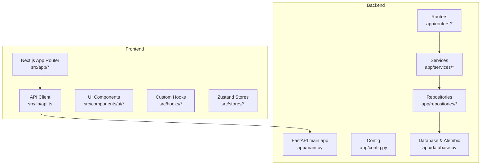
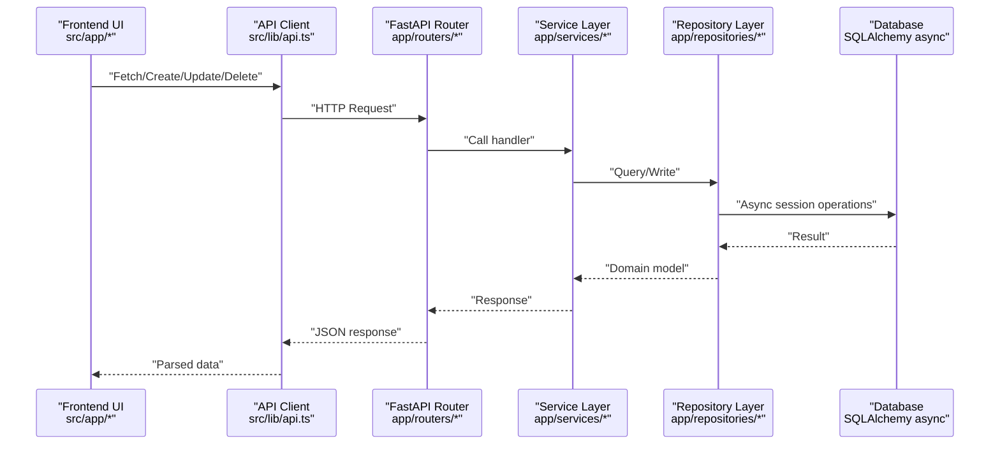
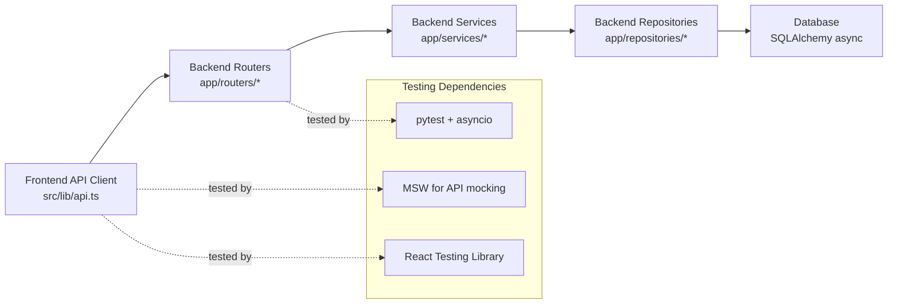

# Testing Strategy

<cite>
**Referenced Files in This Document**
- [pyproject.toml](file://backend/pyproject.toml)
- [main.py](file://backend/app/main.py)
- [config.py](file://backend/app/config.py)
- [database.py](file://backend/app/database.py)
- [auth.py](file://backend/app/routers/auth.py)
- [auth_service.py](file://backend/app/services/auth_service.py)
- [user_repository.py](file://backend/app/repositories/user_repository.py)
- [content.py](file://backend/app/routers/content.py)
- [content_repository.py](file://backend/app/repositories/content_repository.py)
- [analytics.py](file://backend/app/routers/analytics.py)
- [analytics_service.py](file://backend/app/services/analytics_service.py)
- [platform_integration_service.py](file://backend/app/services/platform_integration_service.py)
- [scheduler_service.py](file://backend/app/services/scheduler_service.py)
- [embedding_service.py](file://backend/app/services/embedding_service.py)
- [llm_service.py](file://backend/app/services/llm_service.py)
- [api.ts](file://frontend/src/lib/api.ts)
- [layout.tsx](file://frontend/src/app/layout.tsx)
- [providers.tsx](file://frontend/src/components/providers.tsx)
- [use-content.ts](file://frontend/src/hooks/use-content.ts)
- [content-store.ts](file://frontend/src/stores/content-store.ts)
- [page.tsx](file://frontend/src/app/(dashboard)/content/create/page.tsx)
- [page.tsx](file://frontend/src/app/(dashboard)/content/page.tsx)
- [page.tsx](file://frontend/src/app/(dashboard)/analytics/page.tsx)
- [page.tsx](file://frontend/src/app/(dashboard)/approvals/page.tsx)
- [page.tsx](file://frontend/src/app/(dashboard)/scheduling/page.tsx)
- [page.tsx](file://frontend/src/app/(dashboard)/memory/page.tsx)
- [page.tsx](file://frontend/src/app/(dashboard)/platforms/page.tsx)
- [page.tsx](file://frontend/src/app/(dashboard)/settings/billing/page.tsx)
- [page.tsx](file://frontend/src/app/(dashboard)/settings/team/page.tsx)
- [page.tsx](file://frontend/src/app/(dashboard)/settings/page.tsx)
- [page.tsx](file://frontend/src/app/(dashboard)/calendar/page.tsx)
- [page.tsx](file://frontend/src/app/(dashboard)/page.tsx)
- [package.json](file://frontend/package.json)
</cite>

## Table of Contents
1. [Introduction](#introduction)
2. [Project Structure](#project-structure)
3. [Core Components](#core-components)
4. [Architecture Overview](#architecture-overview)
5. [Detailed Component Analysis](#detailed-component-analysis)
6. [Dependency Analysis](#dependency-analysis)
7. [Performance Considerations](#performance-considerations)
8. [Troubleshooting Guide](#troubleshooting-guide)
9. [Conclusion](#conclusion)
10. [Appendices](#appendices)

## Introduction
This document defines Socialium’s testing strategy across backend Python and frontend TypeScript/React. It covers framework setup, unit and integration testing patterns, mocks for external services, testing utilities, test data management, CI considerations, and best practices for APIs, services, React components, and database operations. It also addresses authentication flows, external API interactions, and performance testing approaches, along with debugging and quality gates.

## Project Structure
The repository is split into backend and frontend:
- Backend: FastAPI application with SQLAlchemy async ORM, Alembic migrations, Pydantic models, and modular services and repositories.
- Frontend: Next.js 16 app with React 19, TypeScript, TanStack Query for data fetching, Zustand for state, and shadcn/ui components.

**Diagram sources**
- [main.py](file://backend/app/main.py)
- [config.py](file://backend/app/config.py)
- [database.py](file://backend/app/database.py)
- [auth.py](file://backend/app/routers/auth.py)
- [api.ts](file://frontend/src/lib/api.ts)

**Section sources**
- [pyproject.toml](file://backend/pyproject.toml)
- [package.json](file://frontend/package.json)

## Core Components
- Backend testing framework: pytest with asyncio mode configured via pyproject.toml. Async database sessions and router/service isolation enable unit and integration tests.
- Frontend testing ecosystem: Next.js and React Testing Library are commonly used in similar setups; configure test environments and mocking for TanStack Query and API clients.
- External service integration: OpenAI, Anthropic, Redis, Qdrant, and platform APIs are integrated via dedicated services. Mocking and stubbing are essential for deterministic tests.
- Authentication: NextAuth integration in frontend and FastAPI auth routers/services in backend. Tests should validate JWT issuance, refresh flows, and protected endpoints.

Key testing entry points:
- Backend: pytest discovery under a tests/ directory (configured in pyproject.toml).
- Frontend: Jest/RTL or Vitest/RTL patterns are typical for Next.js apps; configure environment variables and MSW for API mocking.

**Section sources**
- [pyproject.toml](file://backend/pyproject.toml)
- [package.json](file://frontend/package.json)

## Architecture Overview
End-to-end testing spans frontend UI, API layer, business services, repositories, and persistence.

**Diagram sources**
- [api.ts](file://frontend/src/lib/api.ts)
- [auth.py](file://backend/app/routers/auth.py)
- [content.py](file://backend/app/routers/content.py)
- [analytics.py](file://backend/app/routers/analytics.py)
- [auth_service.py](file://backend/app/services/auth_service.py)
- [content_repository.py](file://backend/app/repositories/content_repository.py)
- [database.py](file://backend/app/database.py)

## Detailed Component Analysis

### Backend Testing Setup and Patterns
- Framework: pytest with asyncio mode enabled via pyproject.toml. Use async fixtures for database sessions and FastAPI test client.
- Isolation: Test routers by injecting mocked services; test services by injecting mocked repositories; test repositories with an isolated async database session.
- External services: Wrap OpenAI, Anthropic, Redis, Qdrant behind service abstractions so they can be patched/mocked during tests.

Recommended patterns:
- Unit tests for services: Patch repositories and external clients; assert domain logic correctness.
- Integration tests for routers: Use a test FastAPI app with a test database; assert HTTP status codes, response shapes, and side effects.
- Database tests: Use Alembic to stamp a test migration environment; seed minimal data per test; rollback after each test.

Mocking external services:
- OpenAI/Anthropic: Patch client calls in llm_service.py and embedding_service.py.
- Redis/Qdrant: Use local containers or in-memory mocks; inject via service configuration.
- Platform APIs: Stub platform_integration_service.py to return deterministic responses.

Test data management:
- Use factories or Pydantic models to construct test entities.
- Seed a small set of users, workspaces, and content for integration scenarios.
- Keep tests idempotent and independent; reset state between runs.

Authentication testing:
- Validate JWT creation and verification in auth_service.py.
- Test protected routes in routers by simulating authenticated requests.
- Verify refresh token flows and session invalidation.

Best practices:
- Prefer deterministic randomness seeds for embedding and LLM calls.
- Snapshot or golden testing for content generation outputs.
- Use parametric tests for boundary conditions and error paths.

**Section sources**
- [pyproject.toml](file://backend/pyproject.toml)
- [auth_service.py](file://backend/app/services/auth_service.py)
- [auth.py](file://backend/app/routers/auth.py)
- [user_repository.py](file://backend/app/repositories/user_repository.py)
- [content_repository.py](file://backend/app/repositories/content_repository.py)
- [llm_service.py](file://backend/app/services/llm_service.py)
- [embedding_service.py](file://backend/app/services/embedding_service.py)
- [platform_integration_service.py](file://backend/app/services/platform_integration_service.py)

### Frontend Testing Setup and Patterns
- Framework: Configure Jest or Vitest with React Testing Library for component tests; use MSW for API mocking.
- Data fetching: Wrap TanStack Query queries and mutations; mock queryClient in tests to simulate success/error states.
- UI components: Test shadcn/ui components with theme providers and form libraries; assert rendering and interaction behaviors.
- Routing and navigation: Use Next.js app dir testing utilities; mock providers and layout wrappers.

Recommended patterns:
- Unit tests for hooks: Mock queryClient and API client; test state transitions and refetch behavior.
- Component tests: Render with providers.tsx and layout.tsx; simulate user interactions and assert DOM updates.
- Store tests: Test Zustand stores with mocked API responses; verify state updates and derived selectors.

Mocking:
- API client: Mock src/lib/api.ts to return controlled responses or errors.
- NextAuth: Mock session and callbacks; test protected routes and UI visibility.
- External integrations: Mock third-party SDKs used by hooks or stores.

Best practices:
- Keep tests focused on behavior, not implementation details.
- Use deterministic data and avoid relying on network flakiness.
- Snapshot test stable UI renders; prefer interaction tests for dynamic behavior.

**Section sources**
- [api.ts](file://frontend/src/lib/api.ts)
- [providers.tsx](file://frontend/src/components/providers.tsx)
- [layout.tsx](file://frontend/src/app/layout.tsx)
- [use-content.ts](file://frontend/src/hooks/use-content.ts)
- [content-store.ts](file://frontend/src/stores/content-store.ts)
- [page.tsx](file://frontend/src/app/(dashboard)/content/create/page.tsx)
- [page.tsx](file://frontend/src/app/(dashboard)/content/page.tsx)
- [page.tsx](file://frontend/src/app/(dashboard)/analytics/page.tsx)
- [page.tsx](file://frontend/src/app/(dashboard)/approvals/page.tsx)
- [page.tsx](file://frontend/src/app/(dashboard)/scheduling/page.tsx)
- [page.tsx](file://frontend/src/app/(dashboard)/memory/page.tsx)
- [page.tsx](file://frontend/src/app/(dashboard)/platforms/page.tsx)
- [page.tsx](file://frontend/src/app/(dashboard)/settings/billing/page.tsx)
- [page.tsx](file://frontend/src/app/(dashboard)/settings/team/page.tsx)
- [page.tsx](file://frontend/src/app/(dashboard)/settings/page.tsx)
- [page.tsx](file://frontend/src/app/(dashboard)/calendar/page.tsx)
- [page.tsx](file://frontend/src/app/(dashboard)/page.tsx)

### API Endpoint Testing Strategies
- Coverage: Aim for >80% branch coverage on routers and services; prioritize critical paths (authentication, content creation, scheduling, analytics).
- Scenarios: Test happy path, validation errors, permission denied, rate limits, and upstream failures.
- Assertions: Validate status codes, JSON schemas, pagination, and error messages.
- Fixtures: Reuse authenticated clients and seeded data across tests.

**Section sources**
- [auth.py](file://backend/app/routers/auth.py)
- [content.py](file://backend/app/routers/content.py)
- [analytics.py](file://backend/app/routers/analytics.py)

### Business Logic Services Testing
- Strategy: Inject mocked repositories and external clients; assert side effects and return values.
- Examples: Scheduler service for cron-like tasks, recommendation service for deterministic outputs, embedding service for vector operations.
- Edge cases: Empty inputs, malformed data, partial failures from external APIs.

**Section sources**
- [scheduler_service.py](file://backend/app/services/scheduler_service.py)
- [recommendation_service.py](file://backend/app/services/recommendation_service.py)
- [embedding_service.py](file://backend/app/services/embedding_service.py)

### React Components and Hooks Testing
- Strategy: Render with providers, mock queryClient and API client, and simulate user actions.
- Focus areas: Forms with react-hook-form and zod resolvers, data tables, modals, and dialogs.
- State: Test Zustand stores with realistic payloads and verify UI reactions.

**Section sources**
- [use-content.ts](file://frontend/src/hooks/use-content.ts)
- [content-store.ts](file://frontend/src/stores/content-store.ts)
- [providers.tsx](file://frontend/src/components/providers.tsx)
- [page.tsx](file://frontend/src/app/(dashboard)/content/create/page.tsx)
- [page.tsx](file://frontend/src/app/(dashboard)/content/page.tsx)

### Database Operations Testing
- Strategy: Use async database sessions per test; seed minimal data; rollback after each test.
- Migrations: Run Alembic in test mode to ensure schema alignment.
- Assertions: Query raw records, count rows, and verify foreign keys and constraints.

**Section sources**
- [database.py](file://backend/app/database.py)
- [user_repository.py](file://backend/app/repositories/user_repository.py)
- [content_repository.py](file://backend/app/repositories/content_repository.py)

### Authentication Flow Testing
- Backend: Validate token issuance, expiration, refresh, and protected route enforcement.
- Frontend: Test NextAuth callbacks, session persistence, and UI behavior under various auth states.

**Section sources**
- [auth_service.py](file://backend/app/services/auth_service.py)
- [auth.py](file://backend/app/routers/auth.py)
- [layout.tsx](file://frontend/src/app/layout.tsx)
- [providers.tsx](file://frontend/src/components/providers.tsx)

### External API Interactions Testing
- Strategy: Use service abstractions to wrap external SDKs; patch calls in tests; simulate latency and failure modes.
- Examples: llm_service.py, embedding_service.py, platform_integration_service.py.

**Section sources**
- [llm_service.py](file://backend/app/services/llm_service.py)
- [embedding_service.py](file://backend/app/services/embedding_service.py)
- [platform_integration_service.py](file://backend/app/services/platform_integration_service.py)

### Performance Testing Approaches
- Backend: Use pytest-benchmark or locust against routers/services; measure throughput and latency under load.
- Frontend: Use Lighthouse or Web Vitals instrumentation; test hydration and initial payload sizes.
- Database: Benchmark repository queries with realistic datasets; monitor connection pooling.

[No sources needed since this section provides general guidance]

## Dependency Analysis
Backend and frontend testing depend on shared configuration and environment variables. Backend relies on async database sessions and service abstractions; frontend depends on TanStack Query and provider wrappers.

**Diagram sources**
- [api.ts](file://frontend/src/lib/api.ts)
- [auth.py](file://backend/app/routers/auth.py)
- [content.py](file://backend/app/routers/content.py)
- [database.py](file://backend/app/database.py)

**Section sources**
- [pyproject.toml](file://backend/pyproject.toml)
- [package.json](file://frontend/package.json)

## Performance Considerations
- Favor deterministic mocks for external services to avoid flaky performance tests.
- Use small, synthetic datasets for database benchmarks.
- Profile frontend bundles and lazy-load chunks to reduce initial payload.
- Monitor query caching effectiveness with TanStack Query Devtools.

[No sources needed since this section provides general guidance]

## Troubleshooting Guide
Common issues and resolutions:
- Async test hangs: Ensure asyncio mode is auto and all async fixtures properly await database teardown.
- Database contention: Use separate test databases or transactions per test; avoid global state.
- Mock not applied: Verify mock patches occur before imports; use pytest monkeypatch or unittest.mock.
- Frontend flakiness: Mock network requests with MSW; stabilize timers and randomization.
- CI instability: Cache dependencies, run tests in parallel, and enforce deterministic builds.

**Section sources**
- [pyproject.toml](file://backend/pyproject.toml)
- [api.ts](file://frontend/src/lib/api.ts)

## Conclusion
Socialium’s testing approach emphasizes layered testing: unit tests for services and hooks, integration tests for routers and repositories, and end-to-end tests for critical flows. By leveraging async fixtures, service abstractions, and robust mocking, teams can maintain high confidence while iterating quickly. Establishing CI quality gates around coverage, linting, and test execution ensures consistent quality.

[No sources needed since this section summarizes without analyzing specific files]

## Appendices

### Continuous Integration Pipeline Guidance
- Backend:
  - Install dev dependencies and run pytest with coverage.
  - Lint with ruff; type-check with mypy if added.
  - Run database migrations in CI using Alembic.
- Frontend:
  - Install dependencies, run ESLint, build, and test.
  - Snapshot or visual regression testing for key pages.
- Quality gates:
  - Minimum coverage thresholds per module.
  - Fail on lint errors and test failures.

**Section sources**
- [pyproject.toml](file://backend/pyproject.toml)
- [package.json](file://frontend/package.json)