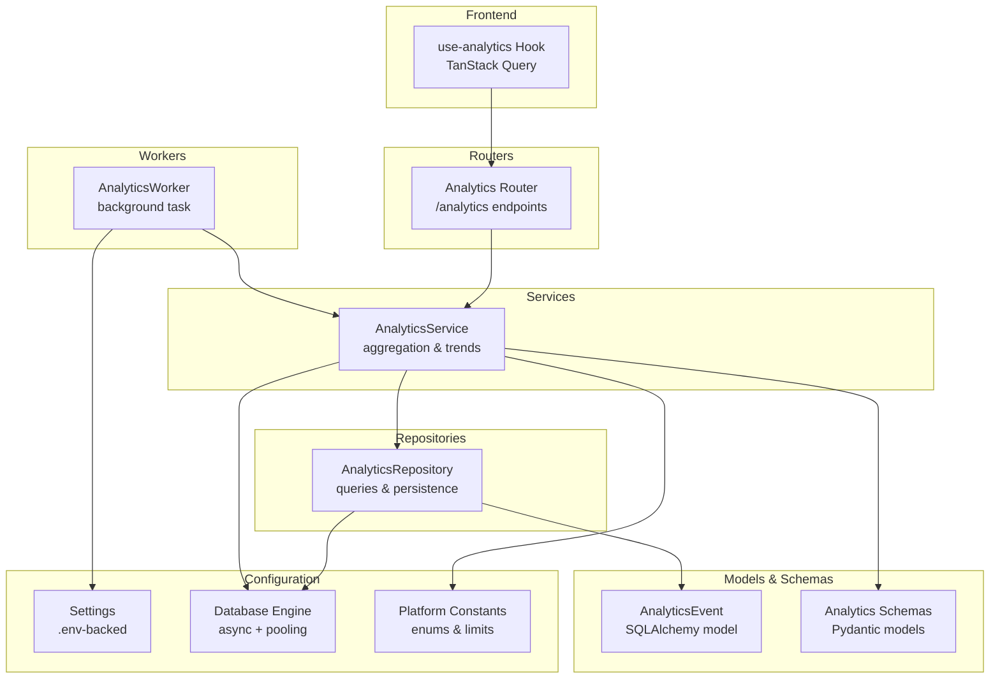
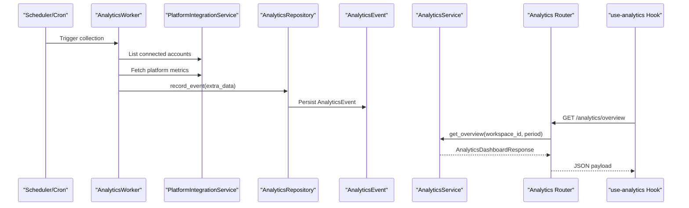
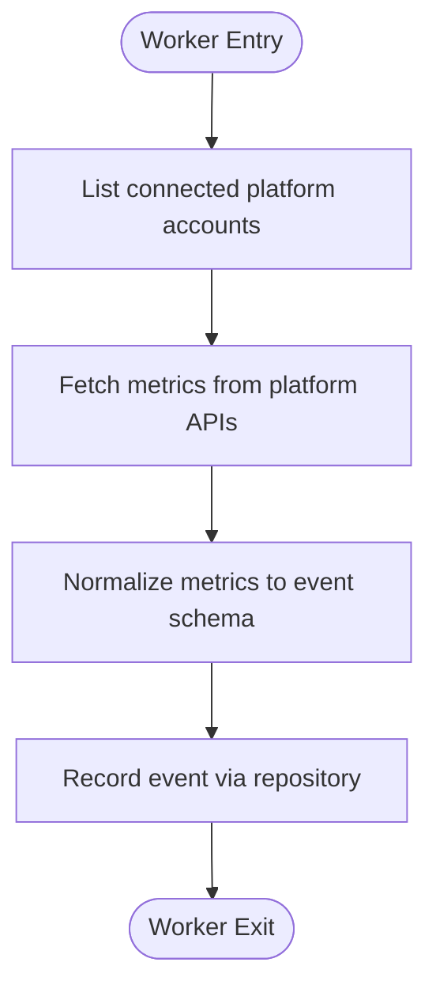
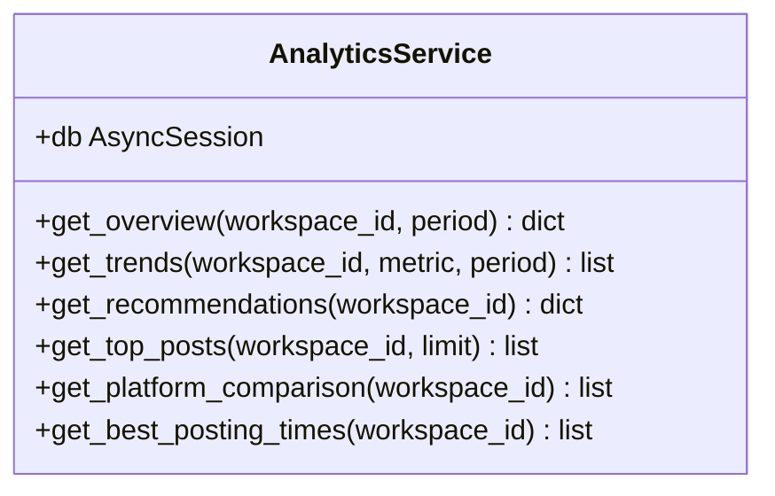
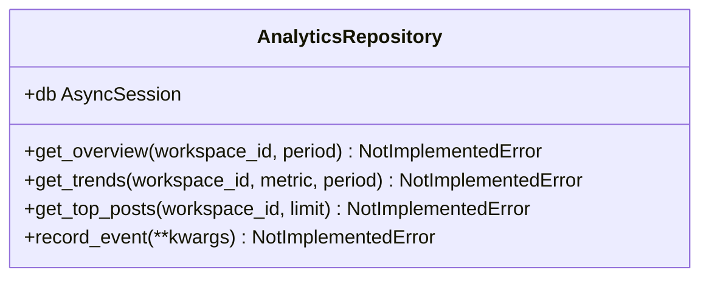
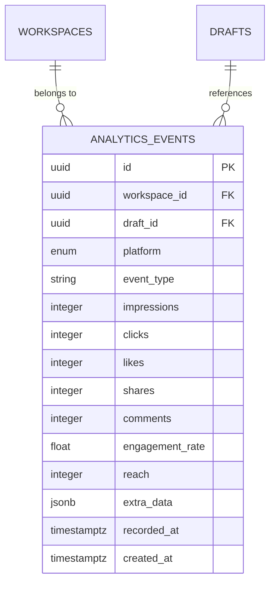
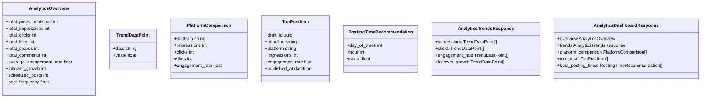
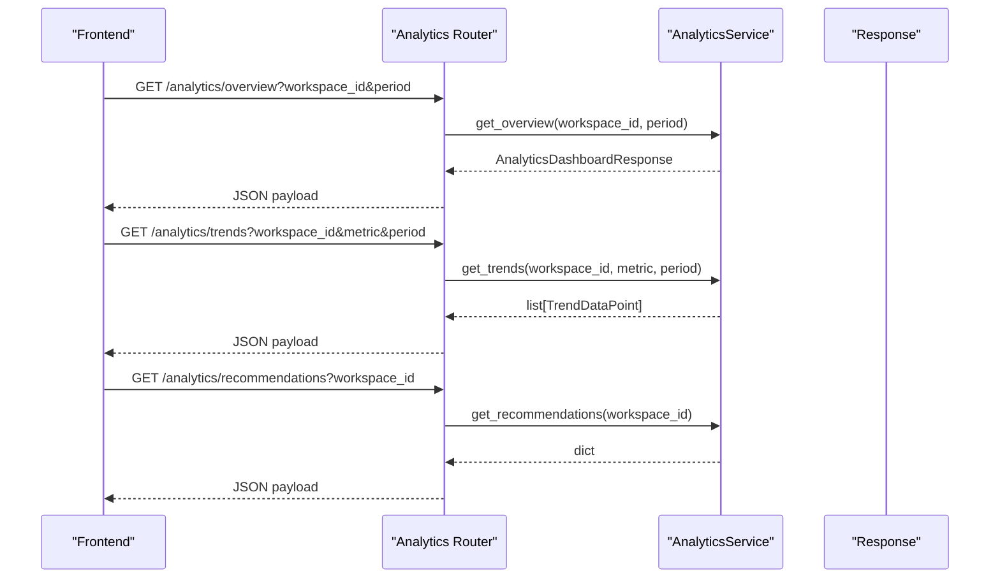
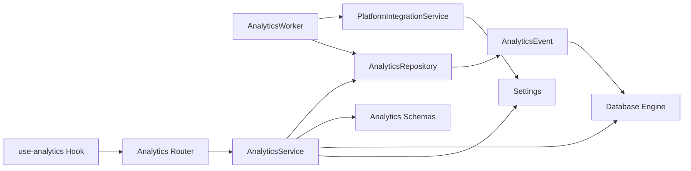

# Analytics Worker

<cite>
**Referenced Files in This Document**
- [analytics_worker.py](file://backend/app/workers/analytics_worker.py)
- [analytics_service.py](file://backend/app/services/analytics_service.py)
- [analytics_repository.py](file://backend/app/repositories/analytics_repository.py)
- [analytics.py](file://backend/app/models/analytics.py)
- [analytics.py](file://backend/app/schemas/analytics.py)
- [analytics.py](file://backend/app/routers/analytics.py)
- [config.py](file://backend/app/config.py)
- [database.py](file://backend/app/database.py)
- [constants.py](file://backend/app/core/constants.py)
- [platform_integration_service.py](file://backend/app/services/platform_integration_service.py)
- [use-analytics.ts](file://frontend/src/hooks/use-analytics.ts)
</cite>

## Table of Contents
1. [Introduction](#introduction)
2. [Project Structure](#project-structure)
3. [Core Components](#core-components)
4. [Architecture Overview](#architecture-overview)
5. [Detailed Component Analysis](#detailed-component-analysis)
6. [Dependency Analysis](#dependency-analysis)
7. [Performance Considerations](#performance-considerations)
8. [Troubleshooting Guide](#troubleshooting-guide)
9. [Conclusion](#conclusion)
10. [Appendices](#appendices)

## Introduction
This document describes the AnalyticsWorker and the broader analytics subsystem responsible for collecting, processing, and delivering social media performance insights. It explains the worker's role in gathering performance metrics from connected platforms, transforming raw analytics events, aggregating metrics, and exposing them through APIs and dashboards. It also documents configuration options, error handling strategies, and scalability considerations for high-volume analytics processing.

## Project Structure
The analytics subsystem is organized around a clear separation of concerns:
- Workers: Background tasks orchestrating data collection from platform APIs.
- Services: Business logic for analytics aggregation, trend calculation, and recommendations.
- Repositories: Data access layer for analytics queries and persistence.
- Models/Schemas: Data structures for analytics events and API responses.
- Routers: Public endpoints for analytics dashboards and reports.
- Configuration: Environment-driven settings for platform integrations and monitoring.
- Frontend Hooks: Client-side analytics data fetching and caching.

**Diagram sources**
- [analytics_worker.py](file://backend/app/workers/analytics_worker.py#L1-L7)
- [analytics_service.py](file://backend/app/services/analytics_service.py#L1-L60)
- [analytics_repository.py](file://backend/app/repositories/analytics_repository.py#L1-L14)
- [analytics.py](file://backend/app/models/analytics.py#L1-L49)
- [analytics.py](file://backend/app/schemas/analytics.py#L1-L77)
- [analytics.py](file://backend/app/routers/analytics.py#L1-L44)
- [config.py](file://backend/app/config.py#L1-L83)
- [database.py](file://backend/app/database.py#L1-L43)
- [constants.py](file://backend/app/core/constants.py#L1-L85)
- [use-analytics.ts](file://frontend/src/hooks/use-analytics.ts#L1-L13)

**Section sources**
- [analytics_worker.py](file://backend/app/workers/analytics_worker.py#L1-L7)
- [analytics_service.py](file://backend/app/services/analytics_service.py#L1-L60)
- [analytics_repository.py](file://backend/app/repositories/analytics_repository.py#L1-L14)
- [analytics.py](file://backend/app/models/analytics.py#L1-L49)
- [analytics.py](file://backend/app/schemas/analytics.py#L1-L77)
- [analytics.py](file://backend/app/routers/analytics.py#L1-L44)
- [config.py](file://backend/app/config.py#L1-L83)
- [database.py](file://backend/app/database.py#L1-L43)
- [constants.py](file://backend/app/core/constants.py#L1-L85)
- [use-analytics.ts](file://frontend/src/hooks/use-analytics.ts#L1-L13)

## Core Components
- AnalyticsWorker: Background task placeholder for collecting analytics from connected platforms. Currently raises a not-implemented error and awaits implementation.
- AnalyticsService: Orchestrates analytics aggregation, trend computation, recommendations, top posts, platform comparison, and best posting times.
- AnalyticsRepository: Defines repository methods for overview, trends, top posts, and event recording; currently raises not-implemented errors.
- AnalyticsEvent Model: SQLAlchemy model representing analytics events with metrics (impressions, clicks, likes, shares, comments), engagement rate, reach, platform, and timestamps.
- Analytics Schemas: Pydantic models for dashboard overview, trend data points, platform comparison, top posts, and recommendations.
- Analytics Router: FastAPI endpoints for overview, trends, and recommendations.
- Configuration: Settings for database, Redis, OpenAI/Anthropic, Qdrant, platform OAuth credentials, and monitoring integrations.
- Frontend Hook: TanStack Query hook to fetch analytics overview for a workspace.

**Section sources**
- [analytics_worker.py](file://backend/app/workers/analytics_worker.py#L1-L7)
- [analytics_service.py](file://backend/app/services/analytics_service.py#L1-L60)
- [analytics_repository.py](file://backend/app/repositories/analytics_repository.py#L1-L14)
- [analytics.py](file://backend/app/models/analytics.py#L1-L49)
- [analytics.py](file://backend/app/schemas/analytics.py#L1-L77)
- [analytics.py](file://backend/app/routers/analytics.py#L1-L44)
- [config.py](file://backend/app/config.py#L1-L83)
- [use-analytics.ts](file://frontend/src/hooks/use-analytics.ts#L1-L13)

## Architecture Overview
The analytics pipeline integrates platform APIs, event recording, aggregation, and reporting:
- Platform APIs: Connected accounts are managed by the platform integration service. The AnalyticsWorker would orchestrate periodic collection from these APIs.
- Event Recording: Analytics events are persisted via the repository and model layer.
- Aggregation & Trends: AnalyticsService computes dashboard metrics, time-series trends, and recommendations.
- Reporting: FastAPI endpoints expose analytics data; the frontend consumes these endpoints via a React Query hook.

**Diagram sources**
- [analytics_worker.py](file://backend/app/workers/analytics_worker.py#L1-L7)
- [platform_integration_service.py](file://backend/app/services/platform_integration_service.py#L1-L56)
- [analytics_repository.py](file://backend/app/repositories/analytics_repository.py#L1-L14)
- [analytics.py](file://backend/app/models/analytics.py#L1-L49)
- [analytics_service.py](file://backend/app/services/analytics_service.py#L1-L60)
- [analytics.py](file://backend/app/routers/analytics.py#L1-L44)
- [use-analytics.ts](file://frontend/src/hooks/use-analytics.ts#L1-L13)

## Detailed Component Analysis

### AnalyticsWorker
- Role: Background task to collect analytics from all connected platforms for a given workspace.
- Current state: Placeholder implementation raises a not-implemented error; awaiting integration with platform APIs and event recording.
- Responsibilities (planned):
  - Enumerate connected platform accounts per workspace.
  - Poll platform APIs for recent performance metrics.
  - Normalize metrics into standardized event records.
  - Persist events via repository and model.
  - Schedule periodic runs based on configuration.

**Diagram sources**
- [analytics_worker.py](file://backend/app/workers/analytics_worker.py#L1-L7)
- [platform_integration_service.py](file://backend/app/services/platform_integration_service.py#L1-L56)
- [analytics_repository.py](file://backend/app/repositories/analytics_repository.py#L1-L14)
- [analytics.py](file://backend/app/models/analytics.py#L1-L49)

**Section sources**
- [analytics_worker.py](file://backend/app/workers/analytics_worker.py#L1-L7)

### AnalyticsService
- Role: Aggregates metrics and computes trends, recommendations, top posts, platform comparisons, and best posting times.
- Methods (planned):
  - get_overview: Dashboard overview metrics aggregated over a time period.
  - get_trends: Time-series trend data grouped by day and aggregated by metric.
  - get_recommendations: AI-powered insights and recommendations.
  - get_top_posts: Top-performing posts by engagement rate.
  - get_platform_comparison: Performance breakdown by platform.
  - get_best_posting_times: Best posting times identified from historical engagement.

**Diagram sources**
- [analytics_service.py](file://backend/app/services/analytics_service.py#L1-L60)

**Section sources**
- [analytics_service.py](file://backend/app/services/analytics_service.py#L1-L60)

### AnalyticsRepository
- Role: Data access interface for analytics queries and event recording.
- Methods (planned):
  - get_overview: Retrieve overview metrics for a workspace and period.
  - get_trends: Retrieve trend data for a metric and period.
  - get_top_posts: Retrieve top posts by engagement rate.
  - record_event: Persist an analytics event.

**Diagram sources**
- [analytics_repository.py](file://backend/app/repositories/analytics_repository.py#L1-L14)

**Section sources**
- [analytics_repository.py](file://backend/app/repositories/analytics_repository.py#L1-L14)

### AnalyticsEvent Model
- Role: Represents a single analytics event with metrics and metadata.
- Key attributes:
  - Identifiers: workspace_id, draft_id (optional), platform.
  - Metrics: impressions, clicks, likes, shares, comments, engagement_rate, reach.
  - Timestamps: recorded_at, created_at.
  - Extra data: JSONB for flexible platform-specific fields.
- Relationships: Foreign keys to workspace and draft tables.

**Diagram sources**
- [analytics.py](file://backend/app/models/analytics.py#L1-L49)

**Section sources**
- [analytics.py](file://backend/app/models/analytics.py#L1-L49)

### Analytics Schemas
- Role: Define API response structures for analytics dashboards and reports.
- Types:
  - AnalyticsOverview: Totals and averages for posts, impressions, clicks, likes, shares, comments, engagement rate, follower growth, scheduled posts, and post frequency.
  - TrendDataPoint: Single data point with date and value.
  - PlatformComparison: Per-platform metrics including impressions, clicks, likes, and engagement rate.
  - TopPostItem: Top-performing post with draft_id, headline, platform, impressions, engagement_rate, and published_at.
  - PostingTimeRecommendation: Recommended day/hour with engagement score.
  - AnalyticsTrendsResponse: Lists of trend data points for impressions, clicks, engagement_rate, and follower_growth.
  - AnalyticsDashboardResponse: Complete dashboard payload combining overview, trends, platform comparison, top posts, and best posting times.

**Diagram sources**
- [analytics.py](file://backend/app/schemas/analytics.py#L1-L77)

**Section sources**
- [analytics.py](file://backend/app/schemas/analytics.py#L1-L77)

### Analytics Router
- Role: Exposes analytics endpoints for overview, trends, and recommendations.
- Endpoints:
  - GET /overview: Returns AnalyticsDashboardResponse.
  - GET /trends: Returns time-series trend data for a specified metric and period.
  - GET /recommendations: Returns AI-powered recommendations.

**Diagram sources**
- [analytics.py](file://backend/app/routers/analytics.py#L1-L44)
- [analytics_service.py](file://backend/app/services/analytics_service.py#L1-L60)

**Section sources**
- [analytics.py](file://backend/app/routers/analytics.py#L1-L44)

### Configuration
- Database: Async PostgreSQL engine with connection pooling and pre-ping enabled.
- Redis: URL for caching and queue backends.
- Platform OAuth: Credentials for LinkedIn, Twitter/X, Instagram, and Facebook.
- AI Providers: OpenAI and Anthropic keys and model names.
- Qdrant: Vector store configuration for embeddings.
- Monitoring: Langfuse and PostHog keys for observability.
- Frontend URL: Origin for CORS and frontend integration.

**Section sources**
- [config.py](file://backend/app/config.py#L1-L83)
- [database.py](file://backend/app/database.py#L1-L43)

### Frontend Integration
- use-analytics Hook: Fetches analytics overview for a workspace using TanStack Query, enabling automatic caching and refetching.

**Section sources**
- [use-analytics.ts](file://frontend/src/hooks/use-analytics.ts#L1-L13)

## Dependency Analysis
- AnalyticsWorker depends on PlatformIntegrationService for account enumeration and platform API access.
- AnalyticsService depends on AnalyticsRepository for data access and on database sessions for transactions.
- AnalyticsRepository depends on the database engine and models for persistence.
- AnalyticsEvent model depends on the base ORM class and platform enums.
- Router depends on AnalyticsService and FastAPI for endpoint handling.
- Frontend hook depends on the analytics router endpoints.

**Diagram sources**
- [analytics_worker.py](file://backend/app/workers/analytics_worker.py#L1-L7)
- [platform_integration_service.py](file://backend/app/services/platform_integration_service.py#L1-L56)
- [analytics_repository.py](file://backend/app/repositories/analytics_repository.py#L1-L14)
- [analytics.py](file://backend/app/models/analytics.py#L1-L49)
- [analytics_service.py](file://backend/app/services/analytics_service.py#L1-L60)
- [analytics.py](file://backend/app/schemas/analytics.py#L1-L77)
- [analytics.py](file://backend/app/routers/analytics.py#L1-L44)
- [database.py](file://backend/app/database.py#L1-L43)
- [config.py](file://backend/app/config.py#L1-L83)
- [use-analytics.ts](file://frontend/src/hooks/use-analytics.ts#L1-L13)

**Section sources**
- [analytics_worker.py](file://backend/app/workers/analytics_worker.py#L1-L7)
- [platform_integration_service.py](file://backend/app/services/platform_integration_service.py#L1-L56)
- [analytics_repository.py](file://backend/app/repositories/analytics_repository.py#L1-L14)
- [analytics.py](file://backend/app/models/analytics.py#L1-L49)
- [analytics_service.py](file://backend/app/services/analytics_service.py#L1-L60)
- [analytics.py](file://backend/app/schemas/analytics.py#L1-L77)
- [analytics.py](file://backend/app/routers/analytics.py#L1-L44)
- [database.py](file://backend/app/database.py#L1-L43)
- [config.py](file://backend/app/config.py#L1-L83)
- [use-analytics.ts](file://frontend/src/hooks/use-analytics.ts#L1-L13)

## Performance Considerations
- Asynchronous I/O: Use async database sessions and repository methods to minimize blocking during analytics queries.
- Connection Pooling: Configure database pool size and overflow to handle concurrent analytics requests.
- Batch Writes: Persist analytics events in batches to reduce write overhead.
- Indexing: Add database indexes on frequently queried columns (workspace_id, recorded_at, platform).
- Caching: Use Redis for caching dashboard responses and trend data to reduce repeated computations.
- Pagination and Limits: Apply pagination and reasonable limits for top posts and trend series.
- Parallelization: Run platform API calls in parallel per account and batch process results.
- Trend Aggregation: Pre-aggregate daily metrics to avoid expensive time-series computations on every request.

[No sources needed since this section provides general guidance]

## Troubleshooting Guide
- Platform API Failures:
  - Implement retries with exponential backoff for platform API calls.
  - Log detailed error messages and include platform-specific error codes.
  - Fallback to cached data when APIs are unavailable.
- Data Validation:
  - Validate event payloads before persistence; reject malformed or missing fields.
  - Normalize platform-specific metrics to standardized fields.
- Error Handling in Services:
  - Wrap analytics computations in try-catch blocks and return structured error responses.
  - Rollback database transactions on failure.
- Monitoring:
  - Integrate Langfuse and PostHog for tracing and analytics on analytics endpoints.
  - Track worker execution duration and failure rates.

**Section sources**
- [config.py](file://backend/app/config.py#L69-L77)
- [analytics_service.py](file://backend/app/services/analytics_service.py#L1-L60)
- [analytics_repository.py](file://backend/app/repositories/analytics_repository.py#L1-L14)

## Conclusion
The AnalyticsWorker and supporting components form a modular analytics pipeline designed to collect, normalize, aggregate, and report social media performance metrics. While the worker and repository/service methods are placeholders, the underlying models, schemas, router, and configuration provide a solid foundation for implementing robust analytics processing, including platform API integration, event persistence, trend analysis, and scalable reporting.

[No sources needed since this section summarizes without analyzing specific files]

## Appendices

### Example Workflows

- Analytics Event Processing:
  - Worker enumerates connected accounts.
  - Worker polls platform APIs for recent metrics.
  - Worker normalizes metrics and persists via repository.
  - Router exposes overview and trends to the frontend.

- Performance Monitoring Integration:
  - Use Langfuse and PostHog keys from settings to instrument analytics endpoints and worker execution.

- Reporting Generation:
  - Router endpoints return AnalyticsDashboardResponse, which includes overview, trends, platform comparison, top posts, and best posting times.

**Section sources**
- [analytics_worker.py](file://backend/app/workers/analytics_worker.py#L1-L7)
- [analytics.py](file://backend/app/routers/analytics.py#L1-L44)
- [analytics.py](file://backend/app/schemas/analytics.py#L1-L77)
- [config.py](file://backend/app/config.py#L69-L77)