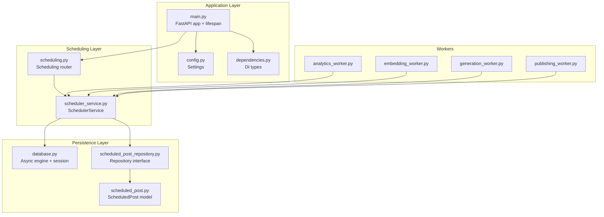
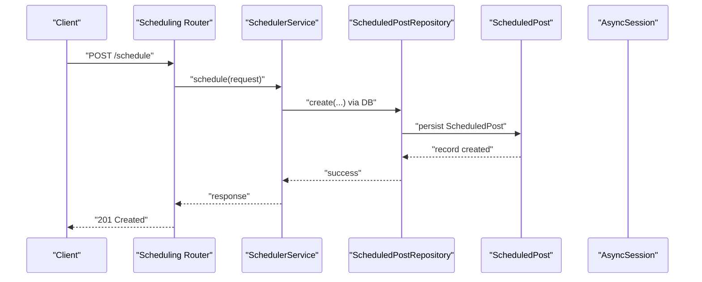
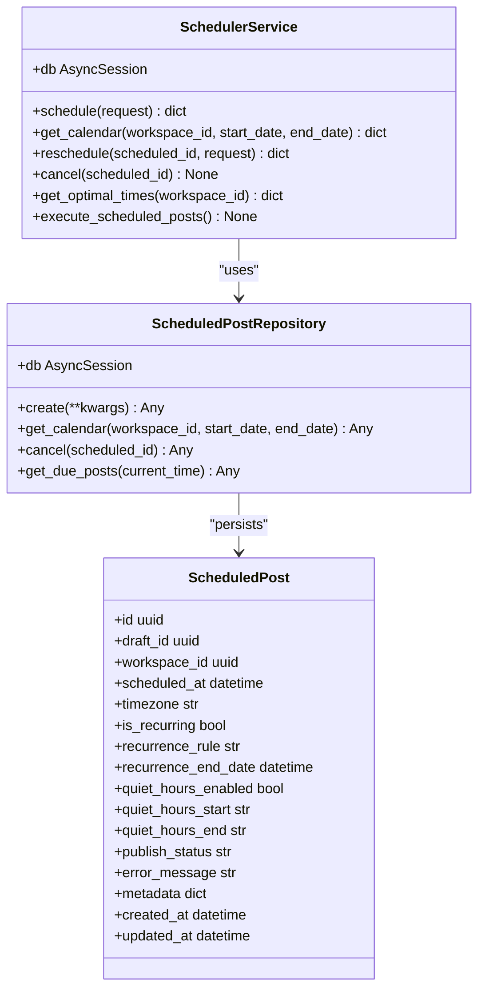
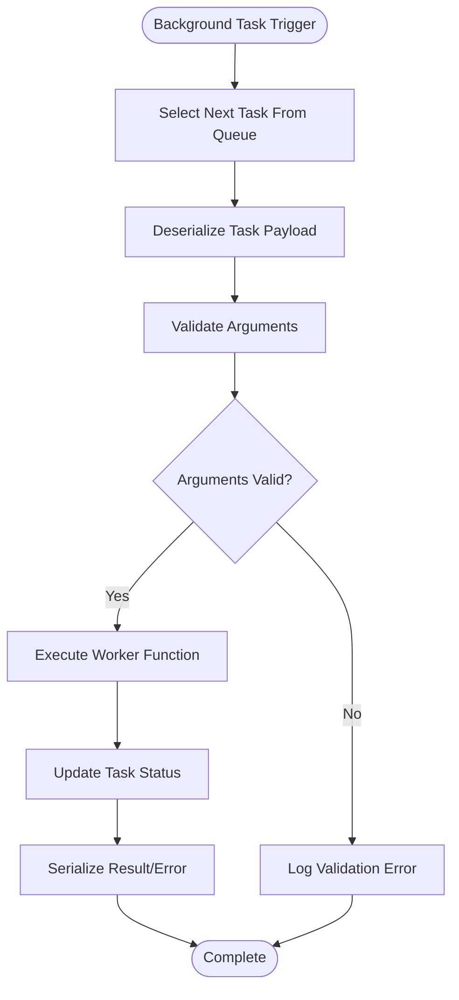
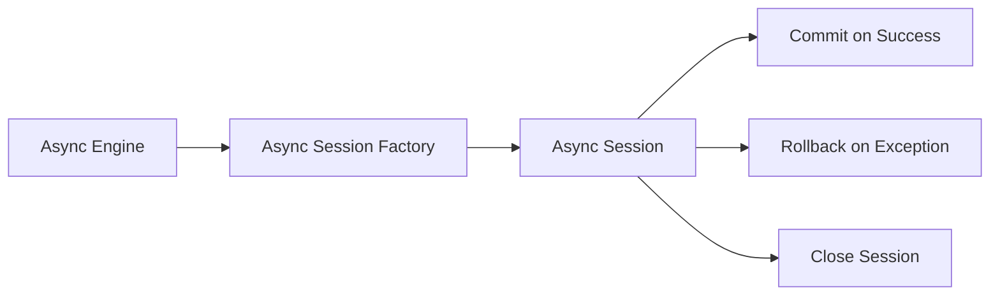
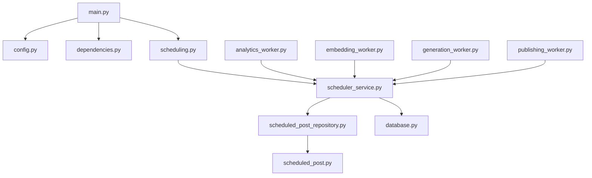

# Background Task Architecture

<cite>
**Referenced Files in This Document**
- [main.py](file://backend/app/main.py)
- [config.py](file://backend/app/config.py)
- [dependencies.py](file://backend/app/dependencies.py)
- [database.py](file://backend/app/database.py)
- [scheduler_service.py](file://backend/app/services/scheduler_service.py)
- [scheduling.py](file://backend/app/routers/scheduling.py)
- [scheduled_post.py](file://backend/app/models/scheduled_post.py)
- [scheduled_post_repository.py](file://backend/app/repositories/scheduled_post_repository.py)
- [analytics_worker.py](file://backend/app/workers/analytics_worker.py)
- [embedding_worker.py](file://backend/app/workers/embedding_worker.py)
- [generation_worker.py](file://backend/app/workers/generation_worker.py)
- [publishing_worker.py](file://backend/app/workers/publishing_worker.py)
</cite>

## Table of Contents
1. [Introduction](#introduction)
2. [Project Structure](#project-structure)
3. [Core Components](#core-components)
4. [Architecture Overview](#architecture-overview)
5. [Detailed Component Analysis](#detailed-component-analysis)
6. [Dependency Analysis](#dependency-analysis)
7. [Performance Considerations](#performance-considerations)
8. [Troubleshooting Guide](#troubleshooting-guide)
9. [Conclusion](#conclusion)

## Introduction
This document explains Socialium’s background task architecture with emphasis on task scheduling, worker lifecycle, and asynchronous execution patterns. The system integrates FastAPI for the main application, SQLAlchemy for persistence, and APScheduler for time-based task scheduling. Workers are defined as async functions under a dedicated package and are intended to be orchestrated by a task queue and executor. The document also outlines configuration options, dependency injection patterns, and recommended approaches for task serialization, inter-worker communication, and cleanup.

## Project Structure
The background task architecture spans several layers:
- Application entrypoint and lifecycle management
- Configuration and dependency injection
- Persistence layer (SQLAlchemy models and repositories)
- Scheduling service and router
- Worker definitions for analytics, embeddings, generation, and publishing

**Diagram sources**
- [main.py](file://backend/app/main.py#L1-L83)
- [config.py](file://backend/app/config.py#L1-L83)
- [dependencies.py](file://backend/app/dependencies.py#L1-L14)
- [database.py](file://backend/app/database.py#L1-L43)
- [scheduled_post.py](file://backend/app/models/scheduled_post.py#L1-L56)
- [scheduled_post_repository.py](file://backend/app/repositories/scheduled_post_repository.py#L1-L14)
- [scheduler_service.py](file://backend/app/services/scheduler_service.py#L1-L58)
- [scheduling.py](file://backend/app/routers/scheduling.py#L1-L68)
- [analytics_worker.py](file://backend/app/workers/analytics_worker.py#L1-L7)
- [embedding_worker.py](file://backend/app/workers/embedding_worker.py#L1-L7)
- [generation_worker.py](file://backend/app/workers/generation_worker.py#L1-L7)
- [publishing_worker.py](file://backend/app/workers/publishing_worker.py#L1-L12)

**Section sources**
- [main.py](file://backend/app/main.py#L1-L83)
- [config.py](file://backend/app/config.py#L1-L83)
- [dependencies.py](file://backend/app/dependencies.py#L1-L14)
- [database.py](file://backend/app/database.py#L1-L43)
- [scheduled_post.py](file://backend/app/models/scheduled_post.py#L1-L56)
- [scheduled_post_repository.py](file://backend/app/repositories/scheduled_post_repository.py#L1-L14)
- [scheduler_service.py](file://backend/app/services/scheduler_service.py#L1-L58)
- [scheduling.py](file://backend/app/routers/scheduling.py#L1-L68)
- [analytics_worker.py](file://backend/app/workers/analytics_worker.py#L1-L7)
- [embedding_worker.py](file://backend/app/workers/embedding_worker.py#L1-L7)
- [generation_worker.py](file://backend/app/workers/generation_worker.py#L1-L7)
- [publishing_worker.py](file://backend/app/workers/publishing_worker.py#L1-L12)

## Core Components
- Application entrypoint and lifespan manage startup/shutdown hooks and routing registration.
- Configuration centralizes environment-driven settings including database, Redis, LLM providers, and monitoring.
- Dependency injection defines typed dependencies for database sessions and settings.
- Persistence layer provides async SQLAlchemy engine, session management, and the ScheduledPost model.
- Scheduling service encapsulates scheduling logic and interacts with repositories and the database.
- Workers define async task signatures for analytics, embeddings, generation, and publishing.

Key implementation patterns:
- Async FastAPI lifespan for resource lifecycle.
- Pydantic settings with environment loading and caching.
- SQLAlchemy async engine with connection pooling and automatic transaction handling.
- Typed dependency injection via Annotated types.
- Worker functions declared as async with explicit parameter contracts.

**Section sources**
- [main.py](file://backend/app/main.py#L26-L34)
- [config.py](file://backend/app/config.py#L9-L82)
- [dependencies.py](file://backend/app/dependencies.py#L11-L13)
- [database.py](file://backend/app/database.py#L12-L42)
- [scheduler_service.py](file://backend/app/services/scheduler_service.py#L8-L16)
- [scheduled_post.py](file://backend/app/models/scheduled_post.py#L13-L49)
- [analytics_worker.py](file://backend/app/workers/analytics_worker.py#L4-L6)
- [embedding_worker.py](file://backend/app/workers/embedding_worker.py#L4-L6)
- [generation_worker.py](file://backend/app/workers/generation_worker.py#L4-L6)
- [publishing_worker.py](file://backend/app/workers/publishing_worker.py#L4-L11)

## Architecture Overview
The background task architecture follows a layered design:
- HTTP requests enter via FastAPI routers and are handled by services.
- The SchedulerService coordinates scheduling decisions and delegates persistence to the ScheduledPostRepository.
- The ScheduledPost model persists scheduling metadata, including recurrence and quiet hours.
- Workers are invoked asynchronously to perform long-running tasks such as analytics collection, embedding generation, content generation, and post publishing.

**Diagram sources**
- [scheduling.py](file://backend/app/routers/scheduling.py#L18-L25)
- [scheduler_service.py](file://backend/app/services/scheduler_service.py#L18-L27)
- [scheduled_post_repository.py](file://backend/app/repositories/scheduled_post_repository.py#L10-L10)
- [scheduled_post.py](file://backend/app/models/scheduled_post.py#L13-L49)
- [database.py](file://backend/app/database.py#L32-L42)

## Detailed Component Analysis

### SchedulerService and Scheduling Router
- SchedulerService orchestrates scheduling, calendar retrieval, rescheduling, cancellation, and optimal time recommendations. It is initialized with an AsyncSession and is designed to integrate with APScheduler for time-based triggers.
- The scheduling router exposes endpoints for creating schedules, retrieving calendars, rescheduling, canceling, and optimizing posting times.

Implementation highlights:
- The service docstring explicitly mentions APScheduler usage for time-based triggers.
- The router depends on get_db for database access and constructs SchedulerService per-request.

**Diagram sources**
- [scheduler_service.py](file://backend/app/services/scheduler_service.py#L8-L58)
- [scheduled_post_repository.py](file://backend/app/repositories/scheduled_post_repository.py#L6-L13)
- [scheduled_post.py](file://backend/app/models/scheduled_post.py#L13-L49)

**Section sources**
- [scheduler_service.py](file://backend/app/services/scheduler_service.py#L8-L58)
- [scheduling.py](file://backend/app/routers/scheduling.py#L18-L68)
- [scheduled_post_repository.py](file://backend/app/repositories/scheduled_post_repository.py#L6-L13)
- [scheduled_post.py](file://backend/app/models/scheduled_post.py#L13-L49)

### Worker Definitions and Execution Patterns
Workers are defined as async functions under the workers package. They represent background tasks for:
- Analytics collection
- Embedding generation
- Content generation
- Publishing scheduled posts

Execution pattern:
- Each worker function is declared async and accepts typed parameters suitable for task arguments.
- The functions currently raise NotImplementedError, indicating they are placeholders awaiting implementation.

**Diagram sources**
- [analytics_worker.py](file://backend/app/workers/analytics_worker.py#L4-L6)
- [embedding_worker.py](file://backend/app/workers/embedding_worker.py#L4-L6)
- [generation_worker.py](file://backend/app/workers/generation_worker.py#L4-L6)
- [publishing_worker.py](file://backend/app/workers/publishing_worker.py#L4-L11)

**Section sources**
- [analytics_worker.py](file://backend/app/workers/analytics_worker.py#L4-L6)
- [embedding_worker.py](file://backend/app/workers/embedding_worker.py#L4-L6)
- [generation_worker.py](file://backend/app/workers/generation_worker.py#L4-L6)
- [publishing_worker.py](file://backend/app/workers/publishing_worker.py#L4-L11)

### Database and Session Management
- The async engine is configured with connection pooling and pre-ping enabled.
- Sessions are managed as an async generator, committing on success, rolling back on exceptions, and ensuring closure in the finally block.
- The Base declarative base is used for ORM models.

**Diagram sources**
- [database.py](file://backend/app/database.py#L12-L42)

**Section sources**
- [database.py](file://backend/app/database.py#L12-L42)

### Configuration Options
Settings include application metadata, database URL, Redis URL, JWT configuration, external provider keys (OpenAI, Anthropic), vector store configuration (Qdrant), OAuth credentials for social platforms, payment provider (Stripe), frontend origin, and monitoring keys. These settings are loaded from environment files and cached via an LRU cache.

Recommended usage:
- Use settings.is_production to gate production-specific behavior.
- Load provider keys and URLs from environment variables for security.

**Section sources**
- [config.py](file://backend/app/config.py#L9-L82)

### Dependency Injection Patterns
- DatabaseDep and SettingsDep are annotated types that FastAPI’s Depends resolves to AsyncSession and Settings instances respectively.
- These types are imported and used in routers and services to ensure consistent dependency resolution.

**Section sources**
- [dependencies.py](file://backend/app/dependencies.py#L11-L13)
- [scheduling.py](file://backend/app/routers/scheduling.py#L19-L25)

## Dependency Analysis
The following diagram shows key dependencies among components:

**Diagram sources**
- [main.py](file://backend/app/main.py#L1-L83)
- [config.py](file://backend/app/config.py#L1-L83)
- [dependencies.py](file://backend/app/dependencies.py#L1-L14)
- [database.py](file://backend/app/database.py#L1-L43)
- [scheduling.py](file://backend/app/routers/scheduling.py#L1-L68)
- [scheduler_service.py](file://backend/app/services/scheduler_service.py#L1-L58)
- [scheduled_post_repository.py](file://backend/app/repositories/scheduled_post_repository.py#L1-L14)
- [scheduled_post.py](file://backend/app/models/scheduled_post.py#L1-L56)
- [analytics_worker.py](file://backend/app/workers/analytics_worker.py#L1-L7)
- [embedding_worker.py](file://backend/app/workers/embedding_worker.py#L1-L7)
- [generation_worker.py](file://backend/app/workers/generation_worker.py#L1-L7)
- [publishing_worker.py](file://backend/app/workers/publishing_worker.py#L1-L12)

**Section sources**
- [main.py](file://backend/app/main.py#L1-L83)
- [config.py](file://backend/app/config.py#L1-L83)
- [dependencies.py](file://backend/app/dependencies.py#L1-L14)
- [database.py](file://backend/app/database.py#L1-L43)
- [scheduling.py](file://backend/app/routers/scheduling.py#L1-L68)
- [scheduler_service.py](file://backend/app/services/scheduler_service.py#L1-L58)
- [scheduled_post_repository.py](file://backend/app/repositories/scheduled_post_repository.py#L1-L14)
- [scheduled_post.py](file://backend/app/models/scheduled_post.py#L1-L56)
- [analytics_worker.py](file://backend/app/workers/analytics_worker.py#L1-L7)
- [embedding_worker.py](file://backend/app/workers/embedding_worker.py#L1-L7)
- [generation_worker.py](file://backend/app/workers/generation_worker.py#L1-L7)
- [publishing_worker.py](file://backend/app/workers/publishing_worker.py#L1-L12)

## Performance Considerations
- Use async I/O throughout to avoid blocking the event loop.
- Configure database pool size and overflow according to workload and database capacity.
- Implement batching for bulk operations (e.g., bulk publishing) to reduce overhead.
- Apply exponential backoff and retry policies for external API calls.
- Monitor APScheduler job execution latency and adjust worker concurrency accordingly.
- Keep task payloads minimal and serialize only necessary fields.

## Troubleshooting Guide
Common issues and resolutions:
- Database session errors: Ensure proper commit/rollback semantics and session closure in async generators.
- Missing implementation: Workers currently raise NotImplementedError; implement each function with proper error handling and logging.
- Scheduling inconsistencies: Verify timezone handling and quiet hours constraints when calculating effective schedule times.
- Dependency resolution failures: Confirm that dependency injection types are correctly annotated and that get_db is properly included in routers/services.

**Section sources**
- [database.py](file://backend/app/database.py#L32-L42)
- [analytics_worker.py](file://backend/app/workers/analytics_worker.py#L4-L6)
- [embedding_worker.py](file://backend/app/workers/embedding_worker.py#L4-L6)
- [generation_worker.py](file://backend/app/workers/generation_worker.py#L4-L6)
- [publishing_worker.py](file://backend/app/workers/publishing_worker.py#L4-L11)
- [scheduler_service.py](file://backend/app/services/scheduler_service.py#L18-L27)

## Conclusion
Socialium’s background task architecture leverages FastAPI, SQLAlchemy, and APScheduler to support scheduling and asynchronous execution. The design separates concerns across routers, services, repositories, models, and workers. While worker implementations are placeholders, the architecture supports robust task orchestration, dependency injection, and persistence. Extending the system involves implementing worker functions, integrating a task queue and executor, and configuring scheduling and resource allocation to match workload demands.