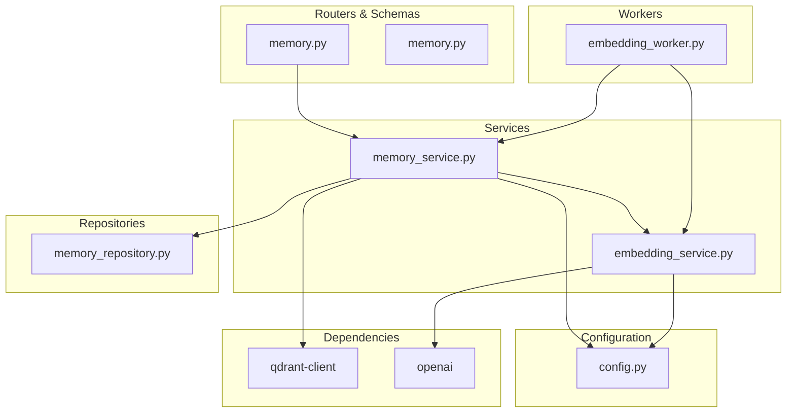
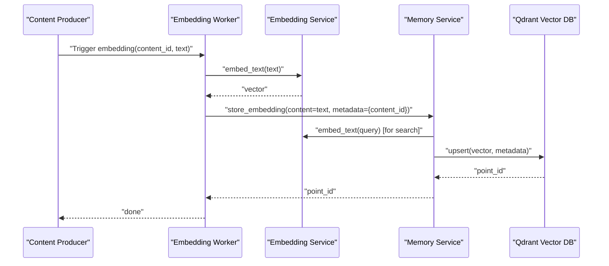
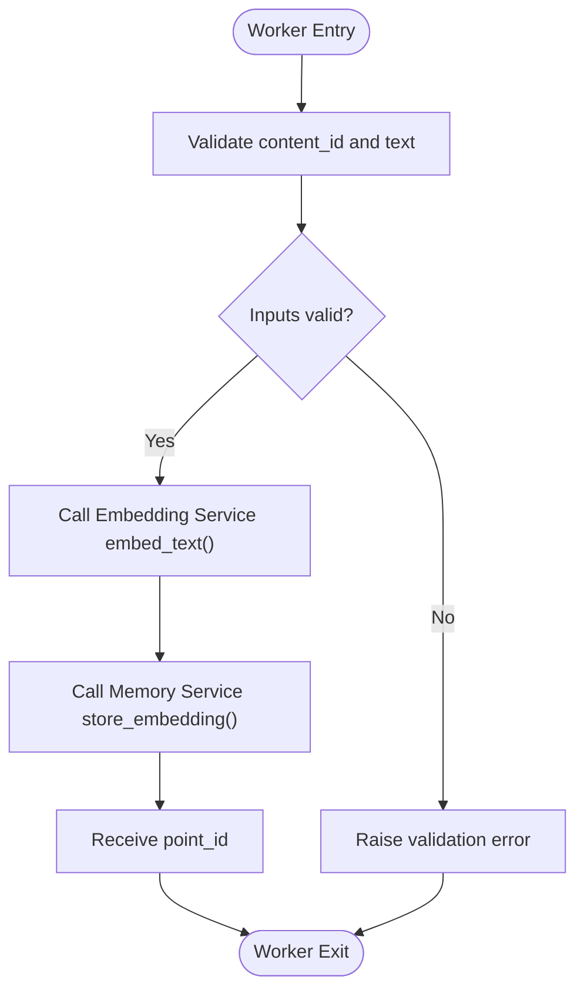
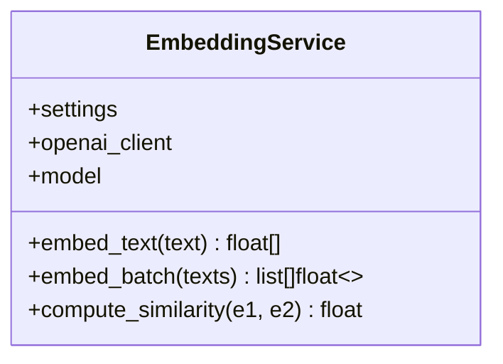
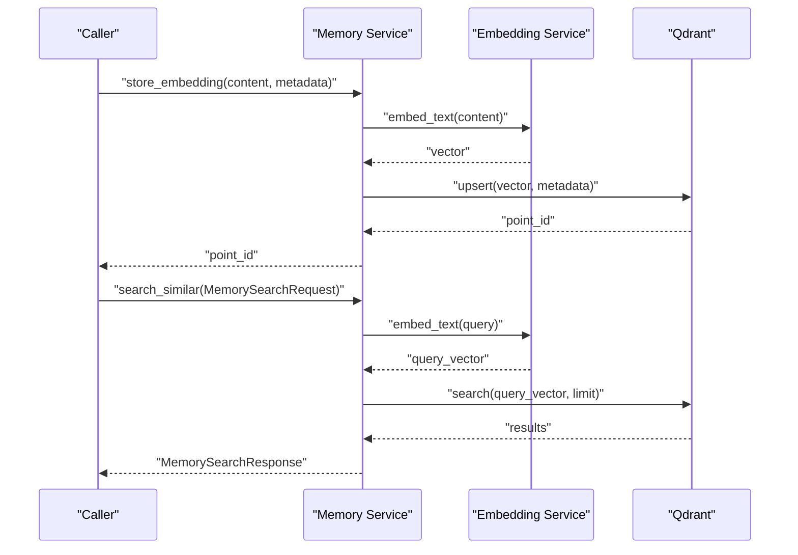
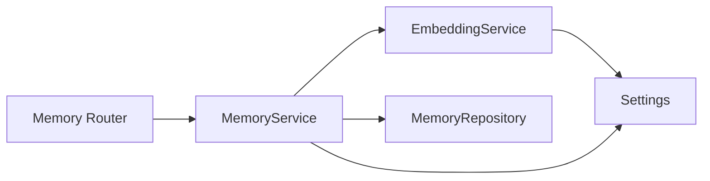

# Embedding Worker

<cite>
**Referenced Files in This Document**
- [embedding_worker.py](file://backend/app/workers/embedding_worker.py)
- [embedding_service.py](file://backend/app/services/embedding_service.py)
- [memory_service.py](file://backend/app/services/memory_service.py)
- [memory_repository.py](file://backend/app/repositories/memory_repository.py)
- [memory.py](file://backend/app/routers/memory.py)
- [memory.py](file://backend/app/schemas/memory.py)
- [config.py](file://backend/app/config.py)
- [pyproject.toml](file://backend/pyproject.toml)
</cite>

## Table of Contents
1. [Introduction](#introduction)
2. [Project Structure](#project-structure)
3. [Core Components](#core-components)
4. [Architecture Overview](#architecture-overview)
5. [Detailed Component Analysis](#detailed-component-analysis)
6. [Dependency Analysis](#dependency-analysis)
7. [Performance Considerations](#performance-considerations)
8. [Troubleshooting Guide](#troubleshooting-guide)
9. [Conclusion](#conclusion)
10. [Appendices](#appendices)

## Introduction
This document describes the Embedding Worker and the broader embedding pipeline responsible for generating vector embeddings, storing them in Qdrant, and enabling semantic search and brand voice learning. It explains the worker’s role in processing content for semantic understanding, outlines the embedding pipeline (preprocessing, vector generation, batch operations), and documents configuration, error handling, memory optimization, and monitoring strategies. It also provides examples of content embedding workflows, semantic search integration, and brand voice learning processes.

## Project Structure
The embedding system spans several modules:
- Workers: Background task orchestration for embedding generation.
- Services: Business logic for embedding generation, vector storage, and semantic search.
- Repositories: Persistence interfaces for memory-related data.
- Routers and Schemas: API surface and request/response contracts for memory operations.
- Configuration: Externalized settings for OpenAI, Qdrant, and other integrations.
- Dependencies: Third-party libraries including Qdrant client and OpenAI SDK.

**Diagram sources**
- [embedding_worker.py](file://backend/app/workers/embedding_worker.py#L1-L7)
- [embedding_service.py](file://backend/app/services/embedding_service.py#L1-L47)
- [memory_service.py](file://backend/app/services/memory_service.py#L1-L66)
- [memory_repository.py](file://backend/app/repositories/memory_repository.py#L1-L13)
- [memory.py](file://backend/app/routers/memory.py#L1-L47)
- [memory.py](file://backend/app/schemas/memory.py#L1-L51)
- [config.py](file://backend/app/config.py#L1-L83)
- [pyproject.toml](file://backend/pyproject.toml#L1-L49)

**Section sources**
- [embedding_worker.py](file://backend/app/workers/embedding_worker.py#L1-L7)
- [embedding_service.py](file://backend/app/services/embedding_service.py#L1-L47)
- [memory_service.py](file://backend/app/services/memory_service.py#L1-L66)
- [memory_repository.py](file://backend/app/repositories/memory_repository.py#L1-L13)
- [memory.py](file://backend/app/routers/memory.py#L1-L47)
- [memory.py](file://backend/app/schemas/memory.py#L1-L51)
- [config.py](file://backend/app/config.py#L1-L83)
- [pyproject.toml](file://backend/pyproject.toml#L1-L49)

## Core Components
- Embedding Worker: Orchestrates background embedding tasks for content. It accepts a content identifier and text payload and is designed to generate and persist embeddings asynchronously.
- Embedding Service: Provides embedding generation and similarity computation using OpenAI. It initializes an async OpenAI client from application settings and exposes methods for single and batch embeddings.
- Memory Service: Manages semantic memory, including storing embeddings, performing similarity searches, retrieving and updating brand voice profiles, and learning from engagement data.
- Memory Repository: Defines persistence interfaces for brand voice and pattern storage.
- Routers and Schemas: Expose API endpoints for brand voice retrieval/update and semantic memory search, with typed request/response models.
- Configuration: Centralizes environment-driven settings for OpenAI, Qdrant, and other integrations.
- Dependencies: Declares Qdrant client and OpenAI SDK as required packages.

Key responsibilities:
- Text preprocessing: Truncation to model limits is handled internally by the embedding provider.
- Vector generation: Uses OpenAI text-embedding-3-large to produce 1536-dimensional vectors.
- Batch processing: Supports batch embedding to reduce API overhead.
- Vector storage: Upserts embeddings into Qdrant collection configured via settings.
- Semantic search: Embeds queries and retrieves nearest neighbors from Qdrant.
- Brand voice learning: Aggregates successful patterns and engagement signals to refine brand voice.

**Section sources**
- [embedding_worker.py](file://backend/app/workers/embedding_worker.py#L1-L7)
- [embedding_service.py](file://backend/app/services/embedding_service.py#L1-L47)
- [memory_service.py](file://backend/app/services/memory_service.py#L1-L66)
- [memory_repository.py](file://backend/app/repositories/memory_repository.py#L1-L13)
- [memory.py](file://backend/app/routers/memory.py#L1-L47)
- [memory.py](file://backend/app/schemas/memory.py#L1-L51)
- [config.py](file://backend/app/config.py#L38-L51)
- [pyproject.toml](file://backend/pyproject.toml#L19-L22)

## Architecture Overview
The embedding pipeline integrates asynchronous workers, embedding generation, and vector storage:

**Diagram sources**
- [embedding_worker.py](file://backend/app/workers/embedding_worker.py#L4-L6)
- [embedding_service.py](file://backend/app/services/embedding_service.py#L20-L29)
- [memory_service.py](file://backend/app/services/memory_service.py#L19-L27)

## Detailed Component Analysis

### Embedding Worker
Role:
- Accepts a content identifier and raw text.
- Generates embeddings and persists them to the vector store.
- Designed for asynchronous background processing.

Processing logic outline:
- Validate inputs (identifier and text).
- Delegate embedding generation to the Embedding Service.
- Persist the embedding with associated metadata.
- Return the vector point identifier for downstream use.

**Diagram sources**
- [embedding_worker.py](file://backend/app/workers/embedding_worker.py#L4-L6)
- [embedding_service.py](file://backend/app/services/embedding_service.py#L20-L29)
- [memory_service.py](file://backend/app/services/memory_service.py#L19-L27)

**Section sources**
- [embedding_worker.py](file://backend/app/workers/embedding_worker.py#L1-L7)

### Embedding Service
Responsibilities:
- Initialize async OpenAI client from settings.
- Generate embeddings for single and batch texts.
- Compute cosine similarity between embeddings.

Configuration:
- Model name is sourced from settings.
- API key is sourced from settings.

Batching benefits:
- Reduces network overhead and latency by grouping requests.

**Diagram sources**
- [embedding_service.py](file://backend/app/services/embedding_service.py#L8-L46)
- [config.py](file://backend/app/config.py#L38-L42)

**Section sources**
- [embedding_service.py](file://backend/app/services/embedding_service.py#L1-L47)
- [config.py](file://backend/app/config.py#L38-L42)

### Memory Service
Responsibilities:
- Store embeddings in Qdrant after generating vectors.
- Perform semantic search using query embeddings.
- Manage brand voice profiles and learning from engagement.

Workflow highlights:
- store_embedding: Embed text, upsert into Qdrant, return point ID.
- search_similar: Embed query, search nearest neighbors, return ranked results.
- get_brand_voice and update_brand_voice: Retrieve/update brand voice profile.
- learn_from_post: Incorporate engagement feedback into memory.

**Diagram sources**
- [memory_service.py](file://backend/app/services/memory_service.py#L19-L37)
- [embedding_service.py](file://backend/app/services/embedding_service.py#L20-L29)
- [memory.py](file://backend/app/schemas/memory.py#L30-L50)

**Section sources**
- [memory_service.py](file://backend/app/services/memory_service.py#L1-L66)
- [memory.py](file://backend/app/schemas/memory.py#L1-L51)

### Memory Repository
Interfaces:
- get_brand_voice(workspace_id)
- update_brand_voice(workspace_id, data)
- store_pattern(workspace_id, pattern)

These methods are placeholders and will be implemented to persist brand voice and pattern data.

**Section sources**
- [memory_repository.py](file://backend/app/repositories/memory_repository.py#L1-L13)

### API Surface (Routers and Schemas)
Endpoints:
- GET /memory/brand-voice: Retrieve brand voice profile.
- PUT /memory/brand-voice: Update brand voice settings.
- POST /memory/search: Semantic search over memory.

Request/Response models:
- BrandVoiceProfile: Brand voice attributes and learned phrases.
- BrandVoiceUpdateRequest: Fields for tone, values, and target audience.
- MemorySearchRequest: Query string and result limit.
- MemorySearchResponse: Ranked results with scores.

**Section sources**
- [memory.py](file://backend/app/routers/memory.py#L1-L47)
- [memory.py](file://backend/app/schemas/memory.py#L1-L51)

## Dependency Analysis
External dependencies:
- Qdrant client: Vector database operations.
- OpenAI SDK: Embedding generation.
- Pydantic settings: Environment-driven configuration.

Internal dependencies:
- Embedding Service depends on Settings for OpenAI credentials and model.
- Memory Service depends on Embedding Service for embeddings and Settings for Qdrant configuration.
- Routers depend on Memory Service for business logic.

**Diagram sources**
- [embedding_service.py](file://backend/app/services/embedding_service.py#L15-L18)
- [memory_service.py](file://backend/app/services/memory_service.py#L16-L18)
- [memory.py](file://backend/app/routers/memory.py#L13-L46)
- [memory_repository.py](file://backend/app/repositories/memory_repository.py#L6-L12)
- [config.py](file://backend/app/config.py#L38-L51)

**Section sources**
- [pyproject.toml](file://backend/pyproject.toml#L19-L22)
- [config.py](file://backend/app/config.py#L38-L51)
- [embedding_service.py](file://backend/app/services/embedding_service.py#L15-L18)
- [memory_service.py](file://backend/app/services/memory_service.py#L16-L18)
- [memory.py](file://backend/app/routers/memory.py#L13-L46)

## Performance Considerations
- Batch embeddings: Prefer batch embedding for multiple texts to minimize API round trips.
- Asynchronous processing: Use async embedding and vector operations to avoid blocking.
- Vector dimensionality: text-embedding-3-large produces 1536-d vectors; ensure indexing and search parameters are tuned accordingly.
- Qdrant optimization: Configure collection vectors configuration, distance metric, and index parameters per Qdrant documentation.
- Rate limiting: Respect OpenAI rate limits; implement retries with exponential backoff.
- Memory footprint: Limit batch sizes and chunk sizes; stream or paginate large datasets.
- Caching: Cache frequent queries or embeddings where appropriate to reduce repeated computations.

[No sources needed since this section provides general guidance]

## Troubleshooting Guide
Common issues and resolutions:
- OpenAI API errors: Validate API key and model name in settings; implement retry logic with backoff.
- Qdrant connectivity: Verify URL and collection name; ensure collection exists and is properly initialized.
- Missing implementations: Worker and service methods currently raise NotImplementedError; implement according to the documented workflows.
- Validation errors: Ensure query length constraints and metadata completeness for embedding storage.
- Batch failures: Split batches and handle partial failures; log failed items for reprocessing.

Monitoring:
- Track embedding generation latency and success rates.
- Monitor Qdrant upsert and search latencies.
- Log embedding similarity scores for quality checks.

**Section sources**
- [config.py](file://backend/app/config.py#L38-L51)
- [embedding_worker.py](file://backend/app/workers/embedding_worker.py#L4-L6)
- [embedding_service.py](file://backend/app/services/embedding_service.py#L20-L46)
- [memory_service.py](file://backend/app/services/memory_service.py#L19-L37)

## Conclusion
The Embedding Worker and supporting services form a cohesive pipeline for semantic understanding and memory optimization. By leveraging batched embeddings, asynchronous processing, and Qdrant-backed vector storage, the system enables scalable semantic search and brand voice learning. Future work involves implementing the placeholder methods and integrating robust error handling, monitoring, and performance tuning.

[No sources needed since this section summarizes without analyzing specific files]

## Appendices

### Configuration Reference
- OpenAI
  - openai_api_key: Secret key for OpenAI.
  - openai_model: LLM model used elsewhere; embedding model is configured separately.
  - openai_embedding_model: Embedding model name (default: text-embedding-3-large).
- Qdrant
  - qdrant_url: Vector database endpoint.
  - qdrant_api_key: Optional API key.
  - qdrant_collection_name: Collection name for semantic memory.

**Section sources**
- [config.py](file://backend/app/config.py#L38-L51)

### Example Workflows

- Content embedding workflow
  - Producer triggers the worker with content_id and text.
  - Worker delegates to Embedding Service for vectorization.
  - Worker delegates to Memory Service to upsert into Qdrant.
  - Returns point_id for downstream usage.

- Semantic search integration
  - Client sends a query via the memory search endpoint.
  - Memory Service embeds the query and searches Qdrant.
  - Results are returned with scores and categories.

- Brand voice learning process
  - Engagement data is fed back into Memory Service.
  - Successful patterns are embedded and stored.
  - Brand voice profile is updated and propagated to generation pipeline.

**Section sources**
- [embedding_worker.py](file://backend/app/workers/embedding_worker.py#L4-L6)
- [memory_service.py](file://backend/app/services/memory_service.py#L19-L66)
- [memory.py](file://backend/app/routers/memory.py#L18-L46)
- [memory.py](file://backend/app/schemas/memory.py#L30-L50)