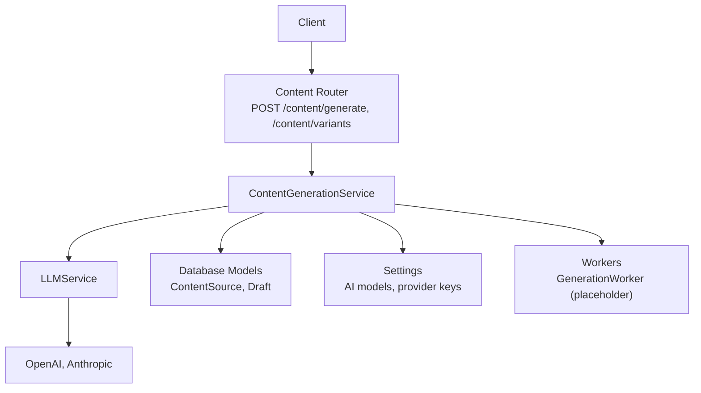
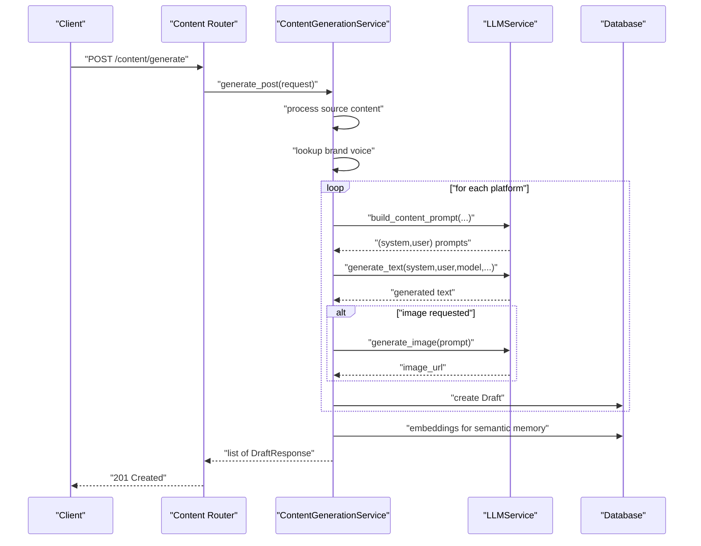
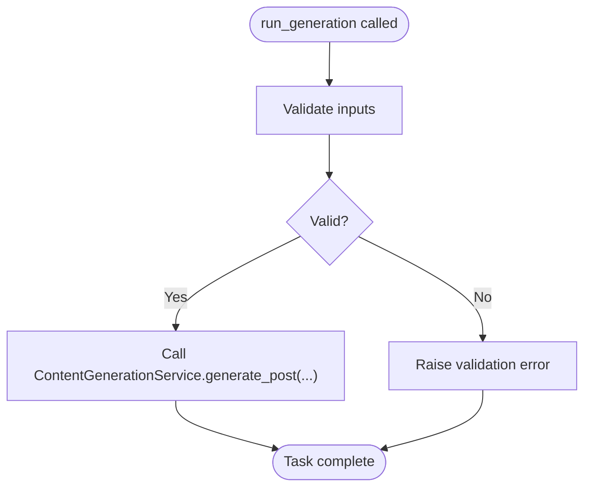
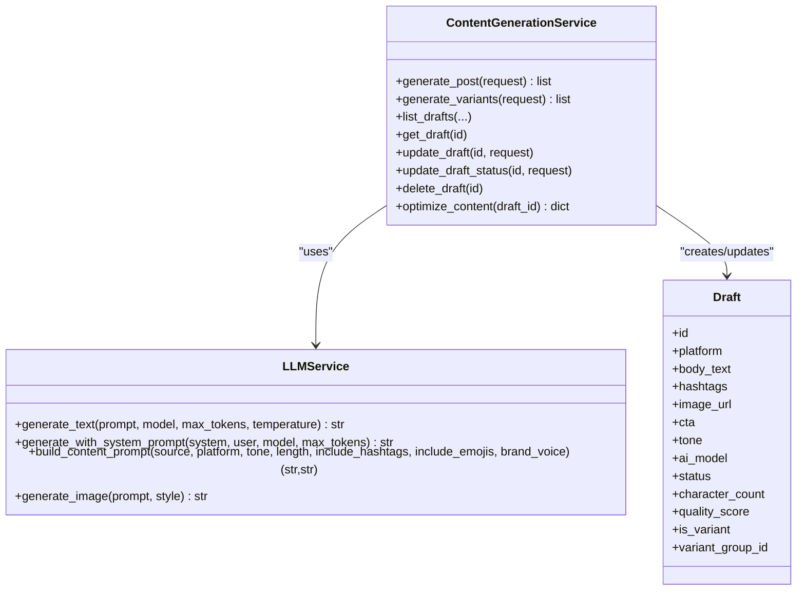
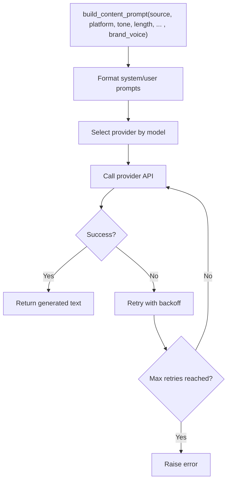
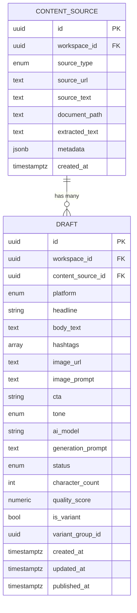
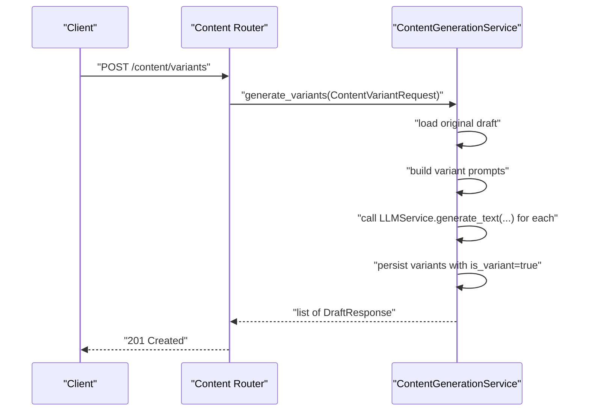
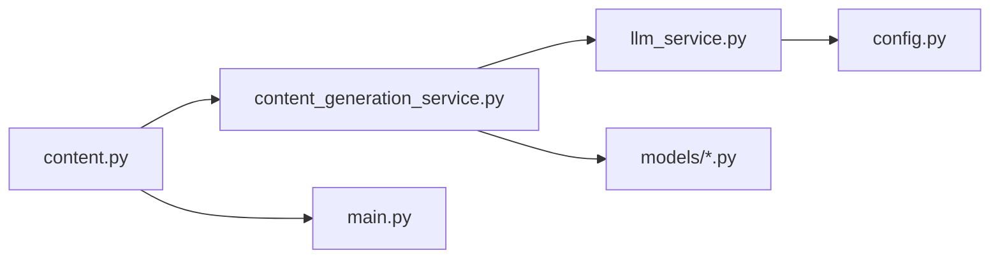

# Generation Worker

<cite>
**Referenced Files in This Document**
- [generation_worker.py](file://backend/app/workers/generation_worker.py)
- [content_generation_service.py](file://backend/app/services/content_generation_service.py)
- [llm_service.py](file://backend/app/services/llm_service.py)
- [content.py](file://backend/app/schemas/content.py)
- [constants.py](file://backend/app/core/constants.py)
- [config.py](file://backend/app/config.py)
- [content.py](file://backend/app/models/content.py)
- [draft.py](file://backend/app/models/draft.py)
- [content.py](file://backend/app/routers/content.py)
- [main.py](file://backend/app/main.py)
</cite>

## Table of Contents
1. [Introduction](#introduction)
2. [Project Structure](#project-structure)
3. [Core Components](#core-components)
4. [Architecture Overview](#architecture-overview)
5. [Detailed Component Analysis](#detailed-component-analysis)
6. [Dependency Analysis](#dependency-analysis)
7. [Performance Considerations](#performance-considerations)
8. [Troubleshooting Guide](#troubleshooting-guide)
9. [Conclusion](#conclusion)

## Introduction
This document describes the Generation Worker and the broader content creation pipeline. It explains how AI content is orchestrated, how variants are produced, and how generated content is optimized. It also documents configuration for AI model selection, generation parameters, quality thresholds, error handling, validation, retry mechanisms, and performance/cost considerations for concurrent generation tasks.

## Project Structure
The Generation Worker sits at the intersection of:
- API surface for content generation and variant creation
- A service layer that orchestrates multi-agent generation
- An LLM service that abstracts provider-specific calls
- Data models for content sources and drafts
- Configuration for AI providers and platform limits

**Diagram sources**
- [content.py](file://backend/app/routers/content.py#L20-L37)
- [content_generation_service.py](file://backend/app/services/content_generation_service.py#L13-L40)
- [llm_service.py](file://backend/app/services/llm_service.py#L9-L37)
- [content.py](file://backend/app/models/content.py#L14-L38)
- [draft.py](file://backend/app/models/draft.py#L15-L67)
- [config.py](file://backend/app/config.py#L38-L50)

**Section sources**
- [main.py](file://backend/app/main.py#L58-L76)
- [content.py](file://backend/app/routers/content.py#L20-L37)

## Core Components
- Generation Worker: Background task entry point for generating content for specified platforms. Currently a placeholder awaiting implementation.
- ContentGenerationService: Orchestrates multi-agent generation, variant creation, draft lifecycle, and optimization.
- LLMService: Unified interface to OpenAI and Anthropic with prompt engineering, token handling, and error/retry logic.
- Schemas: Define requests, responses, and draft structures for generation and variants.
- Models: Persist content sources and drafts, including variant grouping and quality metrics.
- Configuration: Provider credentials, default models, and platform limits.

**Section sources**
- [generation_worker.py](file://backend/app/workers/generation_worker.py#L1-L7)
- [content_generation_service.py](file://backend/app/services/content_generation_service.py#L13-L98)
- [llm_service.py](file://backend/app/services/llm_service.py#L9-L73)
- [content.py](file://backend/app/schemas/content.py#L12-L82)
- [content.py](file://backend/app/models/content.py#L14-L42)
- [draft.py](file://backend/app/models/draft.py#L15-L71)
- [config.py](file://backend/app/config.py#L38-L50)
- [constants.py](file://backend/app/core/constants.py#L64-L84)

## Architecture Overview
The generation pipeline follows a multi-agent orchestration:
- Input: ContentGenerateRequest with source text, platforms, tone, creativity, length, and optional model override.
- Orchestration: ContentGenerationService extracts source content, retrieves brand voice, constructs platform-specific prompts, calls LLMService, optionally generates images, persists drafts, and stores embeddings.
- Variants: ContentVariantRequest triggers variant generation with varied hooks/CTAs.
- Optimization: optimize_content improves quality using brand voice and platform best practices.

**Diagram sources**
- [content.py](file://backend/app/routers/content.py#L20-L27)
- [content_generation_service.py](file://backend/app/services/content_generation_service.py#L23-L40)
- [llm_service.py](file://backend/app/services/llm_service.py#L21-L47)
- [draft.py](file://backend/app/models/draft.py#L15-L67)

## Detailed Component Analysis

### Generation Worker
- Role: Background task runner for content generation across platforms.
- Inputs: workspace_id, source_text, platforms, tone.
- Current state: Placeholder with NotImplementedError.
- Future responsibilities:
  - Enqueue generation tasks
  - Manage concurrency and rate limits
  - Integrate with ContentGenerationService
  - Emit metrics and handle partial failures

**Diagram sources**
- [generation_worker.py](file://backend/app/workers/generation_worker.py#L4-L6)

**Section sources**
- [generation_worker.py](file://backend/app/workers/generation_worker.py#L1-L7)

### ContentGenerationService
- Responsibilities:
  - generate_post: Multi-agent pipeline with prompt construction, LLM calls, optional image generation, draft creation, and embeddings.
  - generate_variants: Create A/B variants grouped by variant_group_id.
  - list/get/update/update_status/delete drafts.
  - optimize_content: Improve quality using brand voice and platform best practices.
- Data contracts:
  - ContentGenerateRequest: source_text, platforms, tone, creativity, length, include_hashtags/include_emojis, ai_model override, workspace_id.
  - ContentVariantRequest: draft_id, count.
  - DraftResponse: comprehensive fields including quality_score, is_variant, variant_group_id.

**Diagram sources**
- [content_generation_service.py](file://backend/app/services/content_generation_service.py#L13-L98)
- [llm_service.py](file://backend/app/services/llm_service.py#L9-L73)
- [draft.py](file://backend/app/models/draft.py#L15-L71)

**Section sources**
- [content_generation_service.py](file://backend/app/services/content_generation_service.py#L13-L98)
- [content.py](file://backend/app/schemas/content.py#L12-L82)
- [draft.py](file://backend/app/models/draft.py#L15-L71)

### LLMService
- Unified provider interface supporting OpenAI and Anthropic.
- Prompt engineering helpers:
  - generate_text: provider selection, formatting, API call, error handling, retries.
  - generate_with_system_prompt: system + user prompt composition.
  - build_content_prompt: platform-specific prompt construction with brand voice.
  - generate_image: DALL-E 3 image generation.
- Configuration:
  - Keys and default models from Settings.
  - Model options registry maps model names to providers and labels.

**Diagram sources**
- [llm_service.py](file://backend/app/services/llm_service.py#L21-L47)
- [llm_service.py](file://backend/app/services/llm_service.py#L49-L64)
- [config.py](file://backend/app/config.py#L38-L50)
- [constants.py](file://backend/app/core/constants.py#L78-L84)

**Section sources**
- [llm_service.py](file://backend/app/services/llm_service.py#L9-L73)
- [config.py](file://backend/app/config.py#L38-L50)
- [constants.py](file://backend/app/core/constants.py#L78-L84)

### Data Models and Schemas
- ContentSource: Stores source materials and relates to Drafts.
- Draft: Persists generated content per platform, variant flags, quality metrics, and status.
- Schemas: Strong typing for requests/responses, including DraftResponse fields and DraftUpdate/DraftStatusUpdate requests.

**Diagram sources**
- [content.py](file://backend/app/models/content.py#L14-L42)
- [draft.py](file://backend/app/models/draft.py#L15-L71)

**Section sources**
- [content.py](file://backend/app/models/content.py#L14-L42)
- [draft.py](file://backend/app/models/draft.py#L15-L71)
- [content.py](file://backend/app/schemas/content.py#L33-L56)

### Configuration and Quality Thresholds
- AI model selection:
  - Default models for OpenAI and Anthropic.
  - Override via ContentGenerateRequest.ai_model.
  - Registry of supported models with provider mapping.
- Generation parameters:
  - creativity mapped to temperature.
  - length controls prompt constraints.
  - include_hashtags/include_emojis toggles.
- Quality thresholds:
  - quality_score stored on Draft; optimize_content returns updated score.
- Platform limits:
  - Character limits and media constraints per platform.

**Section sources**
- [config.py](file://backend/app/config.py#L38-L50)
- [constants.py](file://backend/app/core/constants.py#L78-L84)
- [content.py](file://backend/app/schemas/content.py#L12-L24)
- [draft.py](file://backend/app/models/draft.py#L48-L49)
- [constants.py](file://backend/app/core/constants.py#L63-L76)

### API Workflows
- Generate content:
  - Endpoint: POST /content/generate
  - Request: ContentGenerateRequest
  - Response: list of DraftResponse
- Generate variants:
  - Endpoint: POST /content/variants
  - Request: ContentVariantRequest
  - Response: list of DraftResponse (variants)
- Draft lifecycle:
  - GET /content/drafts
  - GET /content/drafts/{id}
  - PUT /content/drafts/{id}
  - PATCH /content/drafts/{id}/status
  - DELETE /content/drafts/{id}

**Diagram sources**
- [content.py](file://backend/app/routers/content.py#L30-L37)
- [content_generation_service.py](file://backend/app/services/content_generation_service.py#L42-L52)

**Section sources**
- [content.py](file://backend/app/routers/content.py#L20-L94)
- [content_generation_service.py](file://backend/app/services/content_generation_service.py#L23-L52)

## Dependency Analysis
- ContentGenerationService depends on:
  - LLMService for text/image generation
  - Database models for persistence
  - Configuration for provider keys and defaults
- LLMService depends on:
  - Settings for provider credentials
  - Provider SDKs (OpenAI, Anthropic)
- Router depends on:
  - ContentGenerationService
  - SQLAlchemy session for DB access

**Diagram sources**
- [content.py](file://backend/app/routers/content.py#L15-L15)
- [content_generation_service.py](file://backend/app/services/content_generation_service.py#L20-L21)
- [llm_service.py](file://backend/app/services/llm_service.py#L16-L19)
- [config.py](file://backend/app/config.py#L79-L82)
- [main.py](file://backend/app/main.py#L58-L76)

**Section sources**
- [content.py](file://backend/app/routers/content.py#L15-L15)
- [content_generation_service.py](file://backend/app/services/content_generation_service.py#L20-L21)
- [llm_service.py](file://backend/app/services/llm_service.py#L16-L19)
- [config.py](file://backend/app/config.py#L79-L82)
- [main.py](file://backend/app/main.py#L58-L76)

## Performance Considerations
- Concurrency and batching:
  - Use worker queues to parallelize per-platform generation.
  - Batch small tasks to reduce overhead.
- Rate limiting:
  - Respect provider rate limits; implement backoff and jitter.
  - Enforce workspace-level quotas using TIER_LIMITS.
- Cost optimization:
  - Prefer smaller, cheaper models for initial drafts; use higher-capability models for optimization.
  - Cache prompts and brand voice to avoid repeated recomputation.
- Memory and embeddings:
  - Store embeddings asynchronously after draft creation.
  - Limit embedding sizes and reuse cached vectors.
- Platform constraints:
  - Enforce PLATFORM_LIMITS to avoid wasted tokens on oversized content.

[No sources needed since this section provides general guidance]

## Troubleshooting Guide
- AI service failures:
  - LLMService.generate_text should implement retries with exponential backoff and circuit breaker logic.
  - Log provider errors and return structured error responses.
- Content validation:
  - Validate ContentGenerateRequest fields (length, tone, platforms).
  - Ensure DraftUpdateRequest fields are sanitized before persistence.
- Retry mechanisms:
  - Implement retry for transient provider errors.
  - On persistent failures, mark draft status as failed and notify operators.
- Observability:
  - Track generation latency, token usage, and error rates.
  - Expose metrics for model performance and cost per workspace.

**Section sources**
- [llm_service.py](file://backend/app/services/llm_service.py#L21-L37)
- [content.py](file://backend/app/schemas/content.py#L12-L24)
- [draft.py](file://backend/app/models/draft.py#L43-L47)

## Conclusion
The Generation Worker and ContentGenerationService define a robust, extensible pipeline for AI-driven content creation. With unified provider abstraction, strong schemas, and platform-aware constraints, the system supports scalable generation, variant experimentation, and continuous optimization. Implementation of the Generation Worker and LLMService methods will complete the end-to-end solution, enabling efficient, cost-conscious, and high-quality content production at scale.