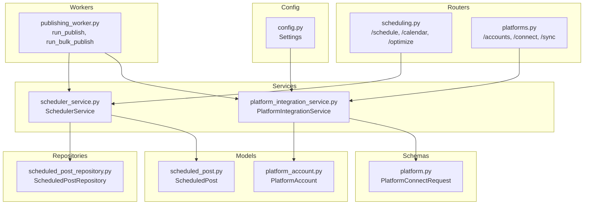
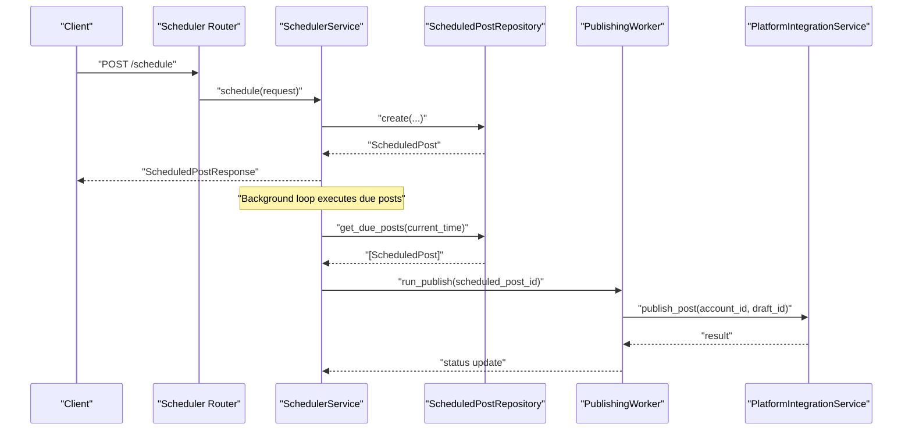
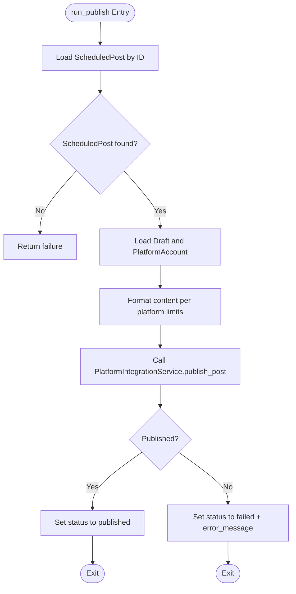
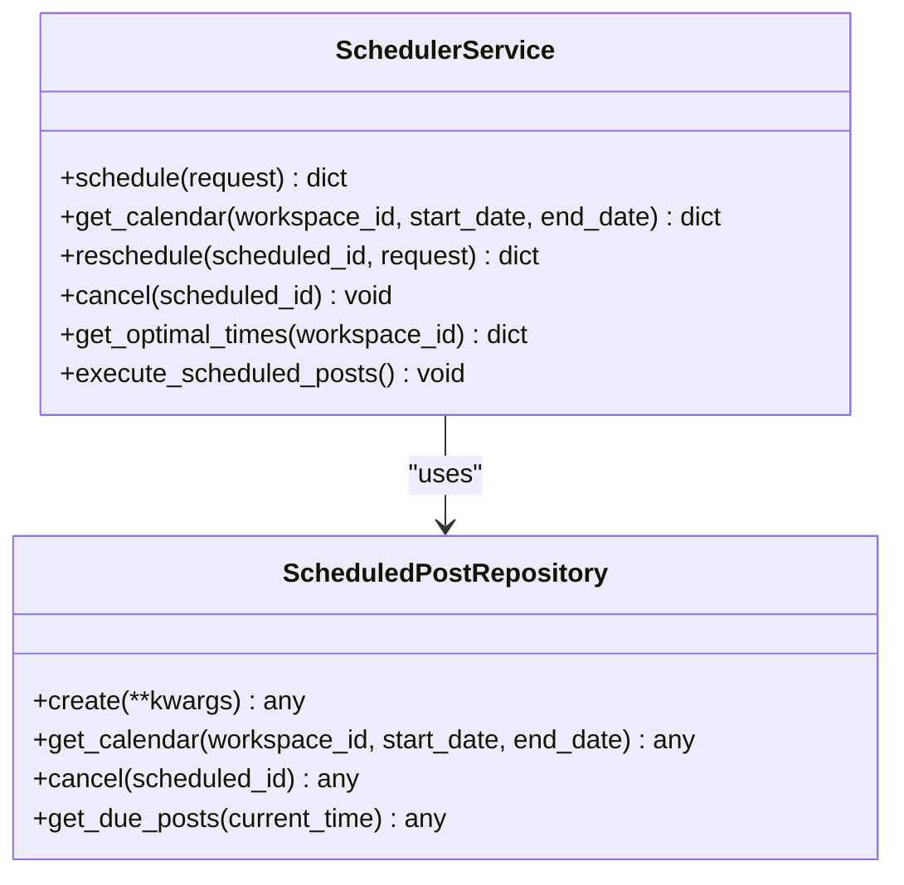
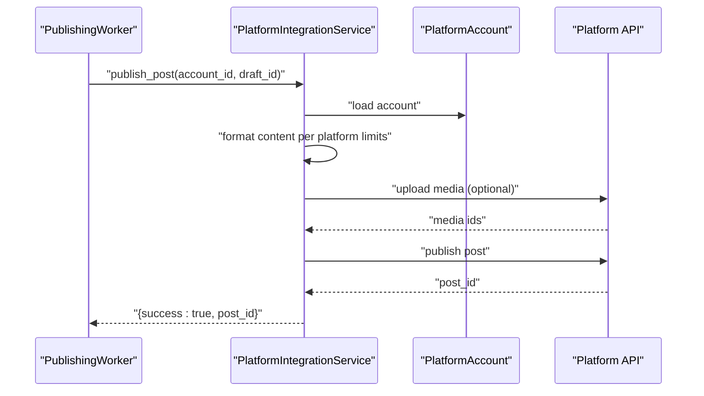
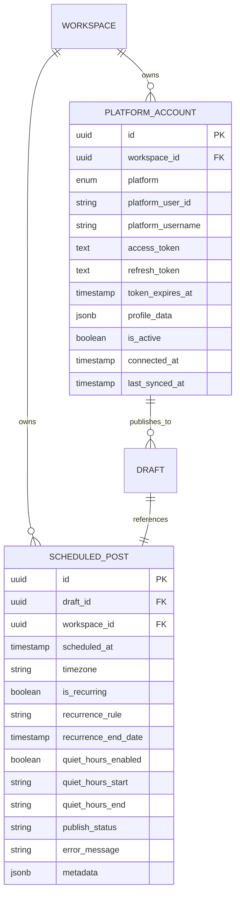
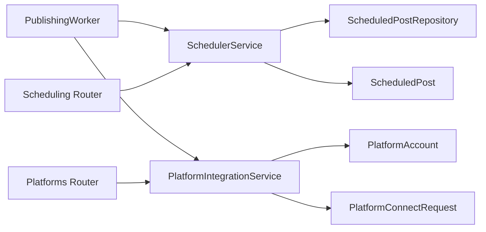

# Publishing Worker

<cite>
**Referenced Files in This Document**
- [publishing_worker.py](file://backend/app/workers/publishing_worker.py)
- [scheduler_service.py](file://backend/app/services/scheduler_service.py)
- [platform_integration_service.py](file://backend/app/services/platform_integration_service.py)
- [scheduled_post.py](file://backend/app/models/scheduled_post.py)
- [scheduled_post_repository.py](file://backend/app/repositories/scheduled_post_repository.py)
- [platform_account.py](file://backend/app/models/platform_account.py)
- [constants.py](file://backend/app/core/constants.py)
- [platform.py](file://backend/app/schemas/platform.py)
- [scheduling.py](file://backend/app/routers/scheduling.py)
- [platforms.py](file://backend/app/routers/platforms.py)
- [config.py](file://backend/app/config.py)
</cite>

## Table of Contents
1. [Introduction](#introduction)
2. [Project Structure](#project-structure)
3. [Core Components](#core-components)
4. [Architecture Overview](#architecture-overview)
5. [Detailed Component Analysis](#detailed-component-analysis)
6. [Dependency Analysis](#dependency-analysis)
7. [Performance Considerations](#performance-considerations)
8. [Troubleshooting Guide](#troubleshooting-guide)
9. [Conclusion](#conclusion)
10. [Appendices](#appendices)

## Introduction
This document describes the PublishingWorker responsible for platform-specific content publishing and batch operations. It explains how scheduled posts are executed, how platform API interactions are managed, and how the publishing workflow is orchestrated. It also documents configuration for publishing schedules, platform-specific constraints, rate limiting, error handling, retry mechanisms, failure recovery, monitoring, compliance handling, and operational troubleshooting.

## Project Structure
The publishing system spans workers, services, repositories, models, schemas, routers, and configuration. The worker functions are declared but not implemented, while services and models define the core data and orchestration logic.

**Diagram sources**
- [publishing_worker.py](file://backend/app/workers/publishing_worker.py#L1-L12)
- [scheduler_service.py](file://backend/app/services/scheduler_service.py#L1-L59)
- [platform_integration_service.py](file://backend/app/services/platform_integration_service.py#L1-L56)
- [scheduled_post_repository.py](file://backend/app/repositories/scheduled_post_repository.py#L1-L14)
- [scheduled_post.py](file://backend/app/models/scheduled_post.py#L1-L56)
- [platform_account.py](file://backend/app/models/platform_account.py#L1-L49)
- [platform.py](file://backend/app/schemas/platform.py#L1-L40)
- [scheduling.py](file://backend/app/routers/scheduling.py#L1-L69)
- [platforms.py](file://backend/app/routers/platforms.py#L1-L56)
- [config.py](file://backend/app/config.py#L1-L83)

**Section sources**
- [publishing_worker.py](file://backend/app/workers/publishing_worker.py#L1-L12)
- [scheduler_service.py](file://backend/app/services/scheduler_service.py#L1-L59)
- [platform_integration_service.py](file://backend/app/services/platform_integration_service.py#L1-L56)
- [scheduled_post_repository.py](file://backend/app/repositories/scheduled_post_repository.py#L1-L14)
- [scheduled_post.py](file://backend/app/models/scheduled_post.py#L1-L56)
- [platform_account.py](file://backend/app/models/platform_account.py#L1-L49)
- [platform.py](file://backend/app/schemas/platform.py#L1-L40)
- [scheduling.py](file://backend/app/routers/scheduling.py#L1-L69)
- [platforms.py](file://backend/app/routers/platforms.py#L1-L56)
- [config.py](file://backend/app/config.py#L1-L83)

## Core Components
- PublishingWorker: Declares two async tasks for single and bulk publishing. These are placeholders awaiting implementation.
- SchedulerService: Manages scheduling, rescheduling, cancellation, calendar retrieval, optimal time recommendations, and execution of due posts.
- PlatformIntegrationService: Manages platform connections, account sync, and publishing to supported platforms.
- ScheduledPost model: Stores scheduling metadata, recurrence, quiet hours, status, and errors.
- ScheduledPostRepository: Provides repository methods for scheduled post operations.
- PlatformAccount model: Stores platform credentials, tokens, and profile data.
- Constants: Defines supported platforms, limits, and tier-based rate caps.
- Schemas: Define request/response shapes for platform connections.
- Routers: Expose endpoints for scheduling and platform management.
- Config: Centralized settings for OAuth clients and monitoring.

**Section sources**
- [publishing_worker.py](file://backend/app/workers/publishing_worker.py#L1-L12)
- [scheduler_service.py](file://backend/app/services/scheduler_service.py#L1-L59)
- [platform_integration_service.py](file://backend/app/services/platform_integration_service.py#L1-L56)
- [scheduled_post.py](file://backend/app/models/scheduled_post.py#L1-L56)
- [scheduled_post_repository.py](file://backend/app/repositories/scheduled_post_repository.py#L1-L14)
- [platform_account.py](file://backend/app/models/platform_account.py#L1-L49)
- [constants.py](file://backend/app/core/constants.py#L1-L85)
- [platform.py](file://backend/app/schemas/platform.py#L1-L40)
- [scheduling.py](file://backend/app/routers/scheduling.py#L1-L69)
- [platforms.py](file://backend/app/routers/platforms.py#L1-L56)
- [config.py](file://backend/app/config.py#L1-L83)

## Architecture Overview
The publishing pipeline orchestrates scheduling, platform integration, and batch execution. The worker functions are entry points for background publishing tasks. The scheduler service coordinates due posts and delegates to the platform integration service for actual API calls.

**Diagram sources**
- [scheduling.py](file://backend/app/routers/scheduling.py#L18-L25)
- [scheduler_service.py](file://backend/app/services/scheduler_service.py#L18-L27)
- [scheduled_post_repository.py](file://backend/app/repositories/scheduled_post_repository.py#L10-L13)
- [publishing_worker.py](file://backend/app/workers/publishing_worker.py#L4-L6)
- [platform_integration_service.py](file://backend/app/services/platform_integration_service.py#L41-L51)

## Detailed Component Analysis

### PublishingWorker
- Responsibilities:
  - Execute a single scheduled post publication.
  - Execute a batch of due scheduled posts for a workspace.
- Implementation status: Functions are declared but not implemented.
- Expected behavior:
  - Resolve ScheduledPost by ID or workspace.
  - Load associated Draft and PlatformAccount.
  - Format content per platform constraints.
  - Publish via PlatformIntegrationService.
  - Update status and handle errors.

**Diagram sources**
- [publishing_worker.py](file://backend/app/workers/publishing_worker.py#L4-L6)
- [scheduled_post.py](file://backend/app/models/scheduled_post.py#L13-L56)
- [platform_integration_service.py](file://backend/app/services/platform_integration_service.py#L41-L51)

**Section sources**
- [publishing_worker.py](file://backend/app/workers/publishing_worker.py#L1-L12)

### SchedulerService
- Responsibilities:
  - Schedule posts with timezone-aware times.
  - Recalculate/optimize posting windows using analytics.
  - Manage recurring posts and quiet hours.
  - Execute due posts in bulk.
- Methods:
  - schedule, get_calendar, reschedule, cancel, get_optimal_times, execute_scheduled_posts.
- Integration points:
  - Uses ScheduledPostRepository for persistence.
  - Interacts with PublishingWorker for execution.

**Diagram sources**
- [scheduler_service.py](file://backend/app/services/scheduler_service.py#L8-L59)
- [scheduled_post_repository.py](file://backend/app/repositories/scheduled_post_repository.py#L6-L13)

**Section sources**
- [scheduler_service.py](file://backend/app/services/scheduler_service.py#L1-L59)
- [scheduled_post_repository.py](file://backend/app/repositories/scheduled_post_repository.py#L1-L14)

### PlatformIntegrationService
- Responsibilities:
  - Connect/disconnect platforms via OAuth.
  - Sync account data.
  - Publish drafts to target platforms.
  - Rollback published posts.
- Supported platforms: LinkedIn, Twitter/X, Instagram, Facebook.
- Publishing steps:
  - Retrieve draft and platform account.
  - Format content for platform.
  - Upload media if needed.
  - Call platform publish API.
  - Update draft status to published.

**Diagram sources**
- [platform_integration_service.py](file://backend/app/services/platform_integration_service.py#L41-L51)
- [platform_account.py](file://backend/app/models/platform_account.py#L14-L49)
- [constants.py](file://backend/app/core/constants.py#L63-L69)

**Section sources**
- [platform_integration_service.py](file://backend/app/services/platform_integration_service.py#L1-L56)
- [platform_account.py](file://backend/app/models/platform_account.py#L1-L49)
- [constants.py](file://backend/app/core/constants.py#L6-L12)

### Data Models and Constraints
- ScheduledPost:
  - Unique draft linkage, scheduled time with timezone, recurrence, quiet hours, status, error tracking, and metadata.
- Draft:
  - Platform-specific content fields, hashtags, images, CTA, tone, and status.
- PlatformAccount:
  - Encrypted tokens, profile data, and platform identifiers.

**Diagram sources**
- [scheduled_post.py](file://backend/app/models/scheduled_post.py#L13-L56)
- [platform_account.py](file://backend/app/models/platform_account.py#L14-L49)

**Section sources**
- [scheduled_post.py](file://backend/app/models/scheduled_post.py#L1-L56)
- [platform_account.py](file://backend/app/models/platform_account.py#L1-L49)

### Configuration and Rate Limiting
- Platform limits:
  - Character limits, max images, max hashtags per platform.
- Tier-based rate caps:
  - Posts per day, number of platforms, and team members per tier.
- OAuth clients:
  - Client IDs/secrets for LinkedIn, Twitter/X, Instagram, Facebook.
- Monitoring keys:
  - Langfuse and PostHog credentials.

**Section sources**
- [constants.py](file://backend/app/core/constants.py#L63-L76)
- [config.py](file://backend/app/config.py#L52-L64)
- [config.py](file://backend/app/config.py#L69-L73)

### API and Workflow Examples
- Single post publishing:
  - Client calls scheduler endpoint to schedule.
  - Background loop detects due posts and invokes PublishingWorker.
  - Worker formats content and publishes via PlatformIntegrationService.
- Batch publishing:
  - PublishingWorker.run_bulk_publish iterates due posts for a workspace and publishes each.
- Multi-platform publishing:
  - PlatformAccount records enable publishing to multiple platforms.
  - Platform limits are enforced during content formatting.

**Section sources**
- [scheduling.py](file://backend/app/routers/scheduling.py#L18-L25)
- [publishing_worker.py](file://backend/app/workers/publishing_worker.py#L9-L11)
- [platforms.py](file://backend/app/routers/platforms.py#L17-L24)
- [platform_integration_service.py](file://backend/app/services/platform_integration_service.py#L41-L51)

## Dependency Analysis
The worker depends on the scheduler service and platform integration service. The scheduler service depends on the repository and models. Platform integration depends on models and schemas.

**Diagram sources**
- [publishing_worker.py](file://backend/app/workers/publishing_worker.py#L1-L12)
- [scheduler_service.py](file://backend/app/services/scheduler_service.py#L1-L59)
- [platform_integration_service.py](file://backend/app/services/platform_integration_service.py#L1-L56)
- [scheduled_post_repository.py](file://backend/app/repositories/scheduled_post_repository.py#L1-L14)
- [scheduled_post.py](file://backend/app/models/scheduled_post.py#L1-L56)
- [platform_account.py](file://backend/app/models/platform_account.py#L1-L49)
- [platform.py](file://backend/app/schemas/platform.py#L1-L40)
- [scheduling.py](file://backend/app/routers/scheduling.py#L1-L69)
- [platforms.py](file://backend/app/routers/platforms.py#L1-L56)

**Section sources**
- [publishing_worker.py](file://backend/app/workers/publishing_worker.py#L1-L12)
- [scheduler_service.py](file://backend/app/services/scheduler_service.py#L1-L59)
- [platform_integration_service.py](file://backend/app/services/platform_integration_service.py#L1-L56)
- [scheduled_post_repository.py](file://backend/app/repositories/scheduled_post_repository.py#L1-L14)
- [scheduled_post.py](file://backend/app/models/scheduled_post.py#L1-L56)
- [platform_account.py](file://backend/app/models/platform_account.py#L1-L49)
- [platform.py](file://backend/app/schemas/platform.py#L1-L40)
- [scheduling.py](file://backend/app/routers/scheduling.py#L1-L69)
- [platforms.py](file://backend/app/routers/platforms.py#L1-L56)

## Performance Considerations
- Concurrency and batching:
  - Use bulk operations to minimize round trips.
  - Implement per-platform rate limiting to avoid throttling.
- Retry and backoff:
  - Implement exponential backoff for transient platform API failures.
- Idempotency:
  - Ensure publish operations are idempotent to prevent duplicates.
- Monitoring:
  - Track success/failure rates per platform and per workspace.
  - Log latency and error categories for observability.

## Troubleshooting Guide
- Common issues:
  - Platform API errors: Inspect error_message on ScheduledPost and logs.
  - Token expiration: Rotate tokens via refresh flows and reattempt.
  - Content violations: Enforce platform limits before publishing.
- Recovery strategies:
  - Retry failed posts after a delay.
  - Rollback published posts if needed via PlatformIntegrationService.rollback_publish.
  - Adjust quiet hours and recurrence rules to avoid conflicts.
- Operational checks:
  - Verify OAuth client credentials in configuration.
  - Confirm platform account connectivity and sync status.
  - Review scheduler logs for due post execution.

**Section sources**
- [scheduled_post.py](file://backend/app/models/scheduled_post.py#L39-L43)
- [platform_integration_service.py](file://backend/app/services/platform_integration_service.py#L53-L55)
- [config.py](file://backend/app/config.py#L52-L64)

## Conclusion
The PublishingWorker is the core orchestrator for scheduled and batch publishing across platforms. While currently unimplemented, it will integrate tightly with the scheduler service and platform integration service, leveraging models and schemas to enforce platform constraints, manage retries, and maintain compliance. Configuration supports OAuth, rate limits, and monitoring to ensure reliable operations.

## Appendices
- Example flows:
  - Single post: schedule → due detection → worker → platform publish.
  - Batch: worker bulk scan → per-post publish → status updates.
  - Multi-platform: multiple PlatformAccount records with per-platform formatting.