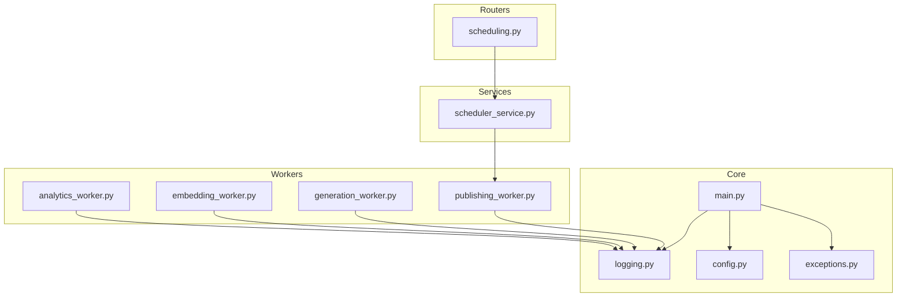
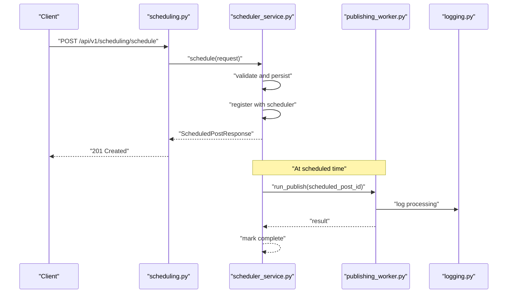
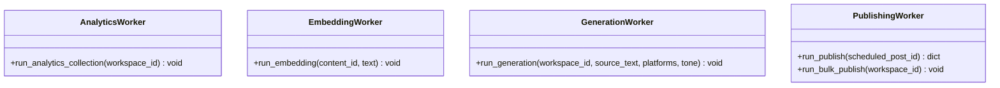
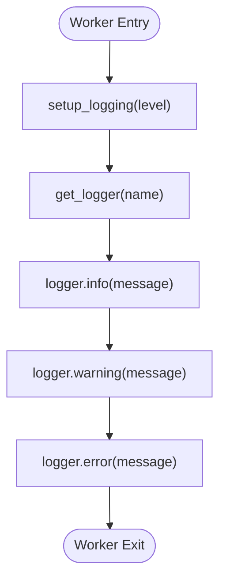
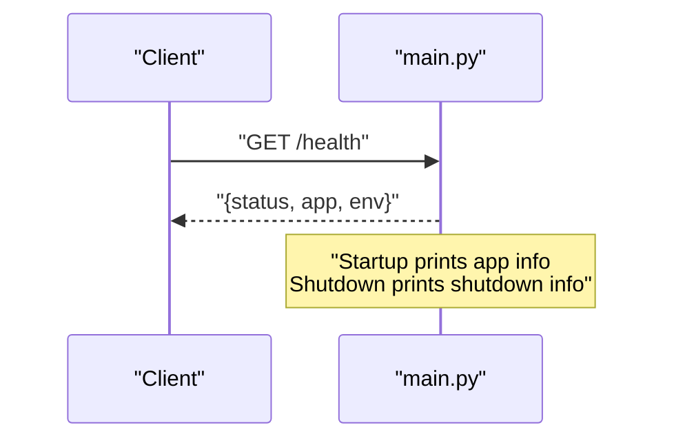
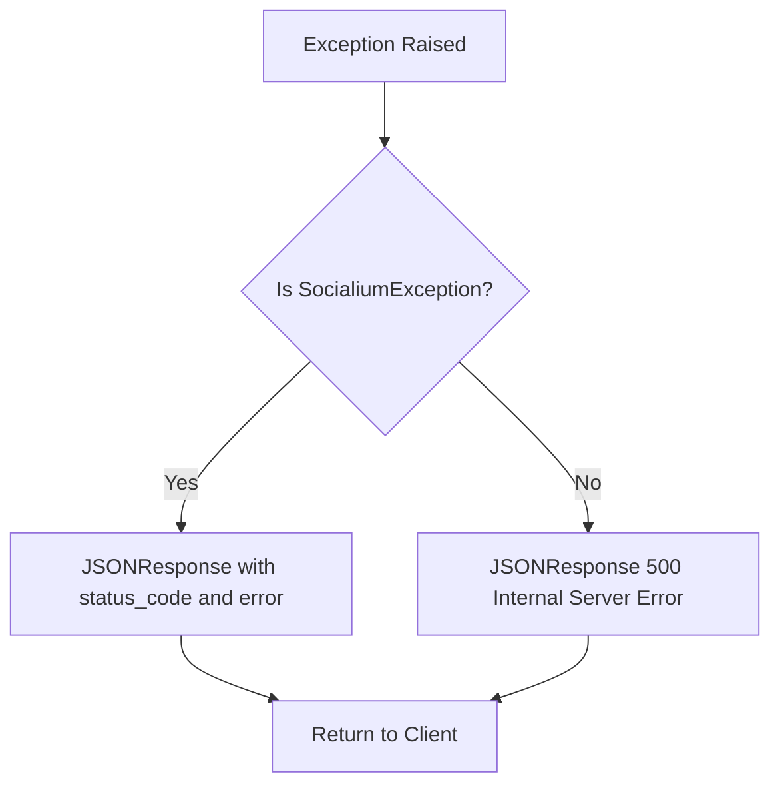
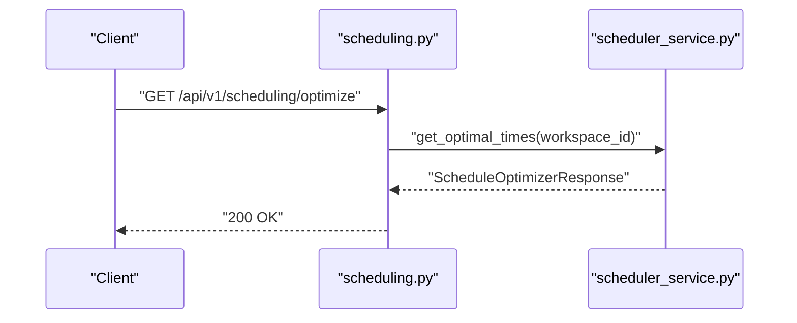
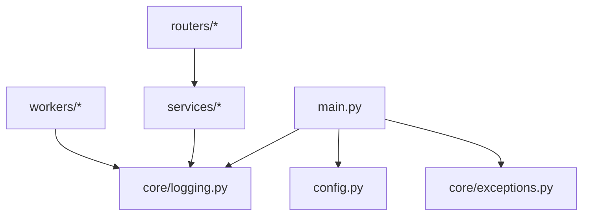

# Worker Monitoring and Management

<cite>
**Referenced Files in This Document**
- [backend/app/workers/__init__.py](file://backend/app/workers/__init__.py)
- [backend/app/workers/analytics_worker.py](file://backend/app/workers/analytics_worker.py)
- [backend/app/workers/embedding_worker.py](file://backend/app/workers/embedding_worker.py)
- [backend/app/workers/generation_worker.py](file://backend/app/workers/generation_worker.py)
- [backend/app/workers/publishing_worker.py](file://backend/app/workers/publishing_worker.py)
- [backend/app/core/logging.py](file://backend/app/core/logging.py)
- [backend/app/config.py](file://backend/app/config.py)
- [backend/app/main.py](file://backend/app/main.py)
- [backend/app/services/scheduler_service.py](file://backend/app/services/scheduler_service.py)
- [backend/app/routers/scheduling.py](file://backend/app/routers/scheduling.py)
- [backend/app/core/exceptions.py](file://backend/app/core/exceptions.py)
</cite>

## Table of Contents
1. [Introduction](#introduction)
2. [Project Structure](#project-structure)
3. [Core Components](#core-components)
4. [Architecture Overview](#architecture-overview)
5. [Detailed Component Analysis](#detailed-component-analysis)
6. [Dependency Analysis](#dependency-analysis)
7. [Performance Considerations](#performance-considerations)
8. [Troubleshooting Guide](#troubleshooting-guide)
9. [Conclusion](#conclusion)
10. [Appendices](#appendices)

## Introduction
This document provides comprehensive guidance for monitoring and managing background workers across all worker types in the system. It explains monitoring strategies, logging patterns, operational visibility for background tasks, health checks, performance metrics collection, alerting mechanisms, supervision configuration, automatic restart procedures, graceful shutdown processes, debugging techniques, error tracking, troubleshooting workflows, dashboard examples, log analysis patterns, performance optimization strategies, scaling worker processes, resource allocation, and capacity planning.

## Project Structure
Workers are organized under a dedicated package and are currently placeholders. They are intended to integrate with services and routers that orchestrate background work. Logging and configuration are centralized to support observability and runtime behavior.

**Diagram sources**
- [backend/app/workers/analytics_worker.py](file://backend/app/workers/analytics_worker.py#L1-L7)
- [backend/app/workers/embedding_worker.py](file://backend/app/workers/embedding_worker.py#L1-L7)
- [backend/app/workers/generation_worker.py](file://backend/app/workers/generation_worker.py#L1-L7)
- [backend/app/workers/publishing_worker.py](file://backend/app/workers/publishing_worker.py#L1-L12)
- [backend/app/services/scheduler_service.py](file://backend/app/services/scheduler_service.py#L1-L59)
- [backend/app/routers/scheduling.py](file://backend/app/routers/scheduling.py#L1-L69)
- [backend/app/core/logging.py](file://backend/app/core/logging.py#L1-L25)
- [backend/app/config.py](file://backend/app/config.py#L1-L83)
- [backend/app/main.py](file://backend/app/main.py#L1-L83)
- [backend/app/core/exceptions.py](file://backend/app/core/exceptions.py#L1-L90)

**Section sources**
- [backend/app/workers/__init__.py](file://backend/app/workers/__init__.py#L1-L2)
- [backend/app/workers/analytics_worker.py](file://backend/app/workers/analytics_worker.py#L1-L7)
- [backend/app/workers/embedding_worker.py](file://backend/app/workers/embedding_worker.py#L1-L7)
- [backend/app/workers/generation_worker.py](file://backend/app/workers/generation_worker.py#L1-L7)
- [backend/app/workers/publishing_worker.py](file://backend/app/workers/publishing_worker.py#L1-L12)
- [backend/app/core/logging.py](file://backend/app/core/logging.py#L1-L25)
- [backend/app/config.py](file://backend/app/config.py#L1-L83)
- [backend/app/main.py](file://backend/app/main.py#L1-L83)
- [backend/app/services/scheduler_service.py](file://backend/app/services/scheduler_service.py#L1-L59)
- [backend/app/routers/scheduling.py](file://backend/app/routers/scheduling.py#L1-L69)
- [backend/app/core/exceptions.py](file://backend/app/core/exceptions.py#L1-L90)

## Core Components
- Workers: Asynchronous background tasks for analytics collection, embeddings, generation, and publishing. They are currently placeholders and require implementation to process real workloads.
- Logging: Structured logging configuration with standardized formatting and suppressed noisy third-party loggers.
- Configuration: Centralized settings via Pydantic settings with environment-driven configuration for monitoring integrations.
- Health Checks: Basic health endpoint exposed at the application root.
- Exception Handling: Centralized exception handlers for consistent error responses.
- Scheduler Orchestration: Router and service layer that coordinates scheduling and execution of background tasks.

**Section sources**
- [backend/app/workers/analytics_worker.py](file://backend/app/workers/analytics_worker.py#L1-L7)
- [backend/app/workers/embedding_worker.py](file://backend/app/workers/embedding_worker.py#L1-L7)
- [backend/app/workers/generation_worker.py](file://backend/app/workers/generation_worker.py#L1-L7)
- [backend/app/workers/publishing_worker.py](file://backend/app/workers/publishing_worker.py#L1-L12)
- [backend/app/core/logging.py](file://backend/app/core/logging.py#L1-L25)
- [backend/app/config.py](file://backend/app/config.py#L1-L83)
- [backend/app/main.py](file://backend/app/main.py#L79-L83)
- [backend/app/core/exceptions.py](file://backend/app/core/exceptions.py#L71-L90)
- [backend/app/services/scheduler_service.py](file://backend/app/services/scheduler_service.py#L1-L59)
- [backend/app/routers/scheduling.py](file://backend/app/routers/scheduling.py#L1-L69)

## Architecture Overview
The system exposes REST endpoints that delegate to services. The scheduler service orchestrates background execution of publishing tasks. Workers are designed to encapsulate long-running tasks and integrate with logging and configuration for observability.

**Diagram sources**
- [backend/app/routers/scheduling.py](file://backend/app/routers/scheduling.py#L18-L25)
- [backend/app/services/scheduler_service.py](file://backend/app/services/scheduler_service.py#L18-L27)
- [backend/app/workers/publishing_worker.py](file://backend/app/workers/publishing_worker.py#L4-L6)
- [backend/app/core/logging.py](file://backend/app/core/logging.py#L7-L24)

## Detailed Component Analysis

### Worker Types and Responsibilities
- Analytics Worker: Collects analytics data from connected platforms for a given workspace.
- Embedding Worker: Generates and stores embeddings for content.
- Generation Worker: Produces content for specified platforms with defined parameters.
- Publishing Worker: Publishes scheduled posts to target platforms and supports bulk publishing.

**Diagram sources**
- [backend/app/workers/analytics_worker.py](file://backend/app/workers/analytics_worker.py#L4-L6)
- [backend/app/workers/embedding_worker.py](file://backend/app/workers/embedding_worker.py#L4-L6)
- [backend/app/workers/generation_worker.py](file://backend/app/workers/generation_worker.py#L4-L6)
- [backend/app/workers/publishing_worker.py](file://backend/app/workers/publishing_worker.py#L4-L11)

**Section sources**
- [backend/app/workers/analytics_worker.py](file://backend/app/workers/analytics_worker.py#L1-L7)
- [backend/app/workers/embedding_worker.py](file://backend/app/workers/embedding_worker.py#L1-L7)
- [backend/app/workers/generation_worker.py](file://backend/app/workers/generation_worker.py#L1-L7)
- [backend/app/workers/publishing_worker.py](file://backend/app/workers/publishing_worker.py#L1-L12)

### Logging Patterns and Operational Visibility
- Structured logging is configured with timestamp, level, logger name, and message.
- Noisy third-party loggers are suppressed to reduce noise.
- Named loggers are prefixed for consistent identification.

**Diagram sources**
- [backend/app/core/logging.py](file://backend/app/core/logging.py#L7-L24)

**Section sources**
- [backend/app/core/logging.py](file://backend/app/core/logging.py#L1-L25)

### Health Checks and Application Lifecycle
- Health endpoint returns application metadata and environment.
- Lifespan manages startup and shutdown hooks for initialization and cleanup.

**Diagram sources**
- [backend/app/main.py](file://backend/app/main.py#L79-L83)
- [backend/app/main.py](file://backend/app/main.py#L26-L34)

**Section sources**
- [backend/app/main.py](file://backend/app/main.py#L79-L83)
- [backend/app/main.py](file://backend/app/main.py#L26-L34)

### Exception Handling and Error Tracking
- Centralized exception handlers convert domain-specific exceptions into JSON responses.
- Generic handler ensures unhandled errors are captured consistently.

**Diagram sources**
- [backend/app/core/exceptions.py](file://backend/app/core/exceptions.py#L71-L89)

**Section sources**
- [backend/app/core/exceptions.py](file://backend/app/core/exceptions.py#L1-L90)

### Scheduling Orchestration and Background Execution
- Router endpoints delegate to the scheduler service.
- The scheduler service defines orchestration steps and includes a method for executing scheduled posts.

**Diagram sources**
- [backend/app/routers/scheduling.py](file://backend/app/routers/scheduling.py#L60-L68)
- [backend/app/services/scheduler_service.py](file://backend/app/services/scheduler_service.py#L45-L54)

**Section sources**
- [backend/app/routers/scheduling.py](file://backend/app/routers/scheduling.py#L1-L69)
- [backend/app/services/scheduler_service.py](file://backend/app/services/scheduler_service.py#L1-L59)

## Dependency Analysis
Workers depend on logging for observability. Services and routers depend on configuration and logging for runtime behavior. Exceptions are handled centrally to maintain consistent error reporting.

**Diagram sources**
- [backend/app/workers/analytics_worker.py](file://backend/app/workers/analytics_worker.py#L1-L7)
- [backend/app/workers/embedding_worker.py](file://backend/app/workers/embedding_worker.py#L1-L7)
- [backend/app/workers/generation_worker.py](file://backend/app/workers/generation_worker.py#L1-L7)
- [backend/app/workers/publishing_worker.py](file://backend/app/workers/publishing_worker.py#L1-L12)
- [backend/app/core/logging.py](file://backend/app/core/logging.py#L1-L25)
- [backend/app/config.py](file://backend/app/config.py#L1-L83)
- [backend/app/main.py](file://backend/app/main.py#L1-L83)
- [backend/app/core/exceptions.py](file://backend/app/core/exceptions.py#L1-L90)

**Section sources**
- [backend/app/workers/analytics_worker.py](file://backend/app/workers/analytics_worker.py#L1-L7)
- [backend/app/workers/embedding_worker.py](file://backend/app/workers/embedding_worker.py#L1-L7)
- [backend/app/workers/generation_worker.py](file://backend/app/workers/generation_worker.py#L1-L7)
- [backend/app/workers/publishing_worker.py](file://backend/app/workers/publishing_worker.py#L1-L12)
- [backend/app/core/logging.py](file://backend/app/core/logging.py#L1-L25)
- [backend/app/config.py](file://backend/app/config.py#L1-L83)
- [backend/app/main.py](file://backend/app/main.py#L1-L83)
- [backend/app/core/exceptions.py](file://backend/app/core/exceptions.py#L1-L90)

## Performance Considerations
- Worker Implementation: Ensure asynchronous processing, proper batching, and backoff strategies for external APIs.
- Resource Allocation: Configure worker concurrency per CPU and memory constraints; monitor queue depths and processing latency.
- Capacity Planning: Use historical throughput and peak load to size worker pools; provision headroom for bursty workloads.
- Metrics Collection: Track task duration, success rates, retry counts, and queue lag; expose metrics via standard exporters.
- Alerting: Alert on high failure rates, slow processing, queue backlog, and unhealthy worker counts.
- Scaling: Horizontal scaling via multiple worker processes/containers; vertical scaling via CPU/memory increases; auto-scaling based on queue length or CPU utilization.

## Troubleshooting Guide
- Debugging Techniques:
  - Enable debug logs and increase verbosity temporarily.
  - Add structured context to logs (worker ID, task ID, workspace ID).
  - Use correlation IDs to trace requests across services.
- Error Tracking:
  - Centralize error responses using the registered exception handlers.
  - Capture stack traces and include them in structured logs.
- Troubleshooting Workflows:
  - Verify health endpoint availability.
  - Confirm worker implementation completeness and environment configuration.
  - Inspect logs around task start, completion, and failure points.
  - Validate external service credentials and quotas.

**Section sources**
- [backend/app/main.py](file://backend/app/main.py#L79-L83)
- [backend/app/core/exceptions.py](file://backend/app/core/exceptions.py#L71-L89)
- [backend/app/core/logging.py](file://backend/app/core/logging.py#L7-L24)

## Conclusion
Workers are currently defined as placeholders and require implementation to realize monitoring, logging, and operational visibility. By integrating structured logging, central configuration, health checks, exception handling, and scheduling orchestration, teams can establish robust worker supervision, alerting, and performance optimization practices. Implementing the worker functions and connecting them to the service layer will enable comprehensive operational control and scalability.

## Appendices

### Monitoring Strategies and Dashboards
- Dashboard Examples:
  - Task Throughput: Successful vs failed tasks per minute/hour.
  - Latency: P50/P95/P99 duration of worker tasks.
  - Queue Metrics: Pending tasks, dead-letter queue counts.
  - Resource Utilization: CPU, memory, disk I/O per worker process.
- Log Analysis Patterns:
  - Correlation IDs to link API requests to worker logs.
  - Error rate and top error messages by worker type.
  - Slowest tasks and their parameters for optimization.

### Configuration for Worker Supervision
- Environment Variables:
  - Application environment and debug flags.
  - External service credentials and endpoints.
  - Monitoring keys for analytics and observability.
- Supervisor Tools:
  - Use process supervisors to manage worker lifecycle and automatic restarts.
  - Configure restart policies and timeouts for graceful shutdown.

### Graceful Shutdown Processes
- Application Lifespan:
  - Use lifespan hooks to perform cleanup during shutdown.
  - Ensure in-flight tasks are allowed to finish or persisted for resumption.

**Section sources**
- [backend/app/config.py](file://backend/app/config.py#L18-L73)
- [backend/app/main.py](file://backend/app/main.py#L26-L34)